# AI智能体

<cite>
**本文引用的文件**
- [AIAgentService.cs](file://Kevin/kevin.Module/kevin.AI.AgentFramework/AIAgentService.cs)
- [AISetting.cs](file://Kevin/kevin.Module/kevin.AI.AgentFramework/AISetting.cs)
- [ServiceCollectionExtensions.cs](file://Kevin/kevin.Module/kevin.AI.AgentFramework/ServiceCollectionExtensions.cs)
- [RAGService.cs](file://Kevin/kevin.Module/kevin.RAG/RAGService.cs)
- [IRAGStorageService.cs](file://Kevin/kevin.Module/kevin.RAG/Interfaces/IRAGStorageService.cs)
- [AliRerankService.cs](file://Kevin/kevin.Module/kevin.RAG/Rerank/AliRerankService.cs)
- [AIModelsService.cs](file://Kevin/Application/Services/AI/AIModelsService.cs)
- [TAIModels.cs](file://Kevin/Domain/Entities/AI/TAIModels.cs)
- [AISkillToolManagementService.cs](file://Kevin/Application/Services/AI/AISkillToolManagementService.cs)
- [TAISkillToolManagement.cs](file://Kevin/Domain/Entities/AI/TAISkillToolManagement.cs)
- [AIKmssService.cs](file://Kevin/Application/Services/AI/AIKmssService.cs)
- [TAIKmss.cs](file://Kevin/Domain/Entities/AI/TAIKmss.cs)
- [AIAppsService.cs](file://Kevin/Application/Services/AI/AIAppsService.cs)
- [TokenConsumptionInfo.cs](file://Kevin/kevin.Module/kevin.AI.AgentFramework/Dto/TokenConsumptionInfo.cs)
- [AIQdrantAgentMemoryService.cs](file://Kevin/Application/Services/AI/AIQdrantAgentMemoryService.cs)
- [AIAgentMemoryService.cs](file://Kevin/Application/Services/AI/AIAgentMemoryService.cs)
- [AIShareInfoService.cs](file://Kevin/kevin.Module/kevin.AI.AgentFramework/Tools/AIShareInfoService.cs)
- [TAIAgentMemory.cs](file://Kevin/Domain/Entities/AI/TAIAgentMemory.cs)
- [AIShareInfoDto.cs](file://Kevin/kevin.Module/kevin.AI.AgentFramework/Dto/AIShareInfoDto.cs)
- [IAIShareInfoService.cs](file://Kevin/kevin.Module/kevin.AI.AgentFramework/Interfaces/IAIShareInfoService.cs)
</cite>

## 更新摘要
**变更内容**
- 新增AIQdrantAgentMemoryService实现基于Qdrant的向量语义检索，提供高性能的记忆搜索能力
- 增强AIAgentMemoryService采用双存储架构（MySQL + 可选Qdrant），支持自动降级机制
- 新增AIShareInfoService实现AI组件间的上下文数据共享，支持安全域名拦截
- 实现智能体记忆的三维隔离（租户+智能体+用户），确保数据安全
- 集成Ollama嵌入模型和可选重排序服务，提升语义检索精度

## 目录
1. [简介](#简介)
2. [项目结构](#项目结构)
3. [核心组件](#核心组件)
4. [架构总览](#架构总览)
5. [详细组件分析](#详细组件分析)
6. [依赖关系分析](#依赖关系分析)
7. [性能考量](#性能考量)
8. [故障排查指南](#故障排查指南)
9. [结论](#结论)
10. [附录](#附录)

## 简介
本文件面向 NetCoreKevin AI智能体系统，聚焦基于 AgentFramework 的智能代理能力：多步推理、任务自动化、技能与工具管理；知识库系统（Qdrant向量数据库、RAG检索增强、文档处理与索引构建）；AI模型配置与管理（支持多种提供商与本地模型）；从用户输入到AI响应的完整工作流；以及自定义工具开发、技能管理与性能优化建议，并给出实际应用场景与最佳实践。

**更新** 系统现已支持AI代理自动模式，具备智能模型选择、故障转移和多模型环境下的可靠性保障能力。**新增向量记忆系统**，通过Qdrant向量数据库实现语义级别的用户记忆检索，结合MySQL持久化存储，提供高性能、高可用的记忆管理能力。

## 项目结构
系统采用分层模块化组织：
- 应用服务层：AI相关服务（Agent、RAG、知识库、模型、技能工具、记忆管理等）
- 领域实体：AI模型、知识库、技能工具、记忆等数据模型
- RAG模块：存储抽象、重排序、Ollama嵌入、Qdrant客户端设置
- Agent框架：代理创建、流式输出、工具调用、重试与日志
- Web接口：控制器暴露AI能力（不在本次重点展开）

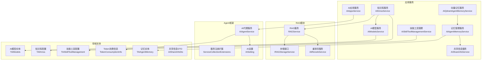

图表来源
- [AIAgentService.cs:1-567](file://Kevin/kevin.Module/kevin.AI.AgentFramework/AIAgentService.cs#L1-L567)
- [AISetting.cs:1-88](file://Kevin/kevin.Module/kevin.AI.AgentFramework/AISetting.cs#L1-L88)
- [AIAppsService.cs:370-565](file://Kevin/Application/Services/AI/AIAppsService.cs#L370-L565)
- [RAGService.cs:1-81](file://Kevin/kevin.Module/kevin.RAG/RAGService.cs#L1-L81)
- [IRAGStorageService.cs:1-30](file://Kevin/kevin.Module/kevin.RAG/Interfaces/IRAGStorageService.cs#L1-L30)
- [AliRerankService.cs:1-99](file://Kevin/kevin.Module/kevin.RAG/Rerank/AliRerankService.cs#L1-L99)
- [AIModelsService.cs:1-160](file://Kevin/Application/Services/AI/AIModelsService.cs#L1-L160)
- [TAIModels.cs:1-55](file://Kevin/Domain/Entities/AI/TAIModels.cs#L1-L55)
- [AISkillToolManagementService.cs:1-254](file://Kevin/Application/Services/AI/AISkillToolManagementService.cs#L1-L254)
- [TAISkillToolManagement.cs:1-93](file://Kevin/Domain/Entities/AI/TAISkillToolManagement.cs#L1-L93)
- [AIKmssService.cs:1-449](file://Kevin/Application/Services/AI/AIKmssService.cs#L1-L449)
- [TAIKmss.cs:1-47](file://Kevin/Domain/Entities/AI/TAIKmss.cs#L1-L47)
- [TokenConsumptionInfo.cs:1-44](file://Kevin/kevin.Module/kevin.AI.AgentFramework/Dto/TokenConsumptionInfo.cs#L1-L44)
- [AIQdrantAgentMemoryService.cs:1-378](file://Kevin/Application/Services/AI/AIQdrantAgentMemoryService.cs#L1-L378)
- [AIAgentMemoryService.cs:1-470](file://Kevin/Application/Services/AI/AIAgentMemoryService.cs#L1-L470)
- [AIShareInfoService.cs:1-40](file://Kevin/kevin.Module/kevin.AI.AgentFramework/Tools/AIShareInfoService.cs#L1-L40)
- [TAIAgentMemory.cs:1-71](file://Kevin/Domain/Entities/AI/TAIAgentMemory.cs#L1-L71)
- [AIShareInfoDto.cs:1-64](file://Kevin/kevin.Module/kevin.AI.AgentFramework/Dto/AIShareInfoDto.cs#L1-L64)

章节来源
- [AIAgentService.cs:1-567](file://Kevin/kevin.Module/kevin.AI.AgentFramework/AIAgentService.cs#L1-L567)
- [AISetting.cs:1-88](file://Kevin/kevin.Module/kevin.AI.AgentFramework/AISetting.cs#L1-L88)
- [AIAppsService.cs:370-565](file://Kevin/Application/Services/AI/AIAppsService.cs#L370-L565)
- [RAGService.cs:1-81](file://Kevin/kevin.Module/kevin.RAG/RAGService.cs#L1-L81)
- [AIModelsService.cs:1-160](file://Kevin/Application/Services/AI/AIModelsService.cs#L1-L160)
- [AIKmssService.cs:1-449](file://Kevin/Application/Services/AI/AIKmssService.cs#L1-L449)

## 核心组件
- AI代理与流式推理：通过AIAgentService创建OpenAI兼容的ChatClient并装配为AIAgent，支持流式文本、工具调用回调、思考过程提取与Token用量统计，具备重试与HTTP请求拦截日志能力。
- **新增自动模式**：支持多模型环境下的智能切换，当主模型调用失败时自动随机切换到备选模型，提升系统可靠性和容错能力。
- **新增向量记忆系统**：AIQdrantAgentMemoryService基于Qdrant向量数据库实现语义级记忆检索，结合AIAgentMemoryService的双存储架构（MySQL + Qdrant），提供高性能、高可用的记忆管理能力。
- RAG检索增强：RAGService根据集合名与问题向量检索文档块，可选接入重排序服务提升相关性，最终组装上下文提示词供LLM使用。
- 知识库索引与入库：AIKmssService负责文档解析、分块、向量化（Ollama Embedding）、写入Qdrant（通过IRAGStorageService），并维护导入状态。
- 模型配置与管理：AIModelsService提供模型的增删改查，持久化至TAIModels，包含端点、名称、密钥、Embedding维度等。
- 技能与工具管理：AISkillToolManagementService管理内置/自定义技能与工具，支持MCP协议参数、附件包解压与启用控制。
- **新增上下文数据共享**：AIShareInfoService实现AI组件间的安全上下文传递，支持域名授权和安全拦截。

章节来源
- [AIAgentService.cs:1-567](file://Kevin/kevin.Module/kevin.AI.AgentFramework/AIAgentService.cs#L1-L567)
- [AISetting.cs:1-88](file://Kevin/kevin.Module/kevin.AI.AgentFramework/AISetting.cs#L1-L88)
- [AIAppsService.cs:370-565](file://Kevin/Application/Services/AI/AIAppsService.cs#L370-L565)
- [RAGService.cs:1-81](file://Kevin/kevin.Module/kevin.RAG/RAGService.cs#L1-L81)
- [AIKmssService.cs:1-449](file://Kevin/Application/Services/AI/AIKmssService.cs#L1-L449)
- [AIModelsService.cs:1-160](file://Kevin/Application/Services/AI/AIModelsService.cs#L1-L160)
- [AISkillToolManagementService.cs:1-254](file://Kevin/Application/Services/AI/AISkillToolManagementService.cs#L1-L254)
- [AIQdrantAgentMemoryService.cs:1-378](file://Kevin/Application/Services/AI/AIQdrantAgentMemoryService.cs#L1-L378)
- [AIAgentMemoryService.cs:1-470](file://Kevin/Application/Services/AI/AIAgentMemoryService.cs#L1-L470)
- [AIShareInfoService.cs:1-40](file://Kevin/kevin.Module/kevin.AI.AgentFramework/Tools/AIShareInfoService.cs#L1-L40)

## 架构总览
下图展示从用户输入到AI响应的主流程，包括RAG检索、重排序、Agent执行、工具调用与流式输出，以及新增的自动模式故障转移机制和向量记忆系统。

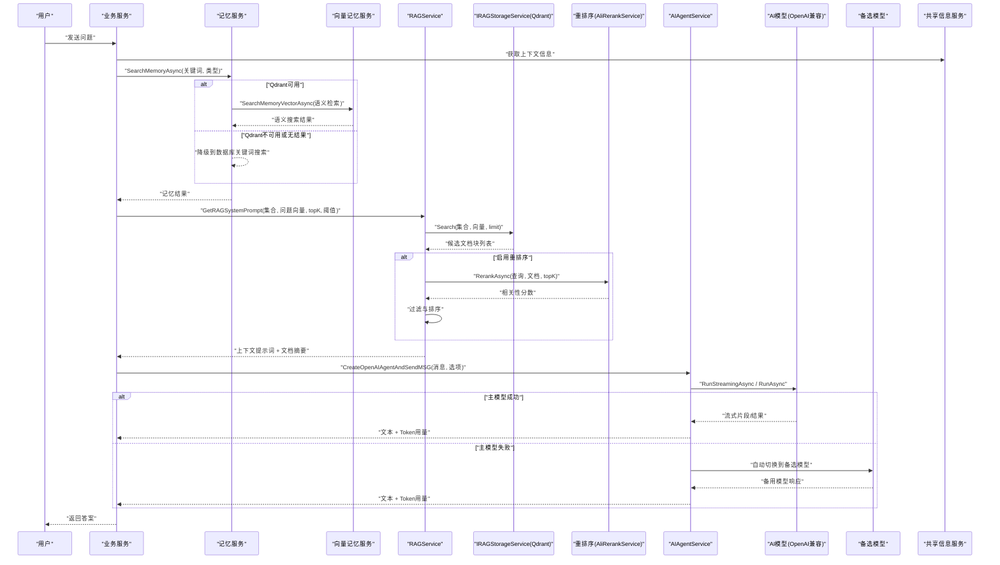

图表来源
- [RAGService.cs:1-81](file://Kevin/kevin.Module/kevin.RAG/RAGService.cs#L1-L81)
- [IRAGStorageService.cs:1-30](file://Kevin/kevin.Module/kevin.RAG/Interfaces/IRAGStorageService.cs#L1-L30)
- [AliRerankService.cs:1-99](file://Kevin/kevin.Module/kevin.RAG/Rerank/AliRerankService.cs#L1-L99)
- [AIAgentService.cs:1-567](file://Kevin/kevin.Module/kevin.AI.AgentFramework/AIAgentService.cs#L1-L567)
- [AIQdrantAgentMemoryService.cs:1-378](file://Kevin/Application/Services/AI/AIQdrantAgentMemoryService.cs#L1-L378)
- [AIAgentMemoryService.cs:1-470](file://Kevin/Application/Services/AI/AIAgentMemoryService.cs#L1-L470)
- [AIShareInfoService.cs:1-40](file://Kevin/kevin.Module/kevin.AI.AgentFramework/Tools/AIShareInfoService.cs#L1-L40)

## 详细组件分析

### AI代理与服务编排（AIAgentService）
- 代理创建：基于OpenAI兼容客户端构造ChatClient并转换为AIAgent，装配工具自动审批规则，支持禁用工具/技能开关。
- 流式处理：支持流式文本输出、工具调用事件回调、思考过程提取（reasoning字段），并在更新中抽取Token用量。
- **新增自动模式**：实现了完整的故障转移机制，当主模型调用失败时，自动从备选模型列表中随机选择一个未使用过的模型进行重试。
- **智能重试**：根据备选模型数量动态调整最大重试次数，确保能够尝试所有配置的备用模型。
- **模型切换通知**：在流式模式下，通过回调函数向前端发送模型切换通知，提升用户体验。
- 可观测性：可选HTTP请求拦截日志。

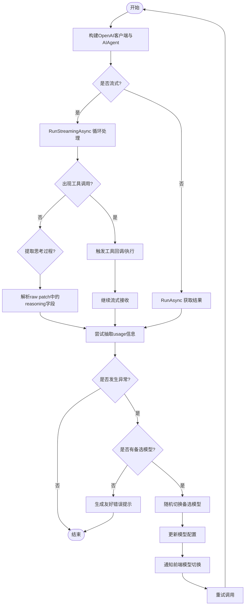

图表来源
- [AIAgentService.cs:1-567](file://Kevin/kevin.Module/kevin.AI.AgentFramework/AIAgentService.cs#L1-L567)

章节来源
- [AIAgentService.cs:1-567](file://Kevin/kevin.Module/kevin.AI.AgentFramework/AIAgentService.cs#L1-L567)
- [AISetting.cs:1-88](file://Kevin/kevin.Module/kevin.AI.AgentFramework/AISetting.cs#L1-L88)
- [ServiceCollectionExtensions.cs:1-22](file://Kevin/kevin.Module/kevin.AI.AgentFramework/ServiceCollectionExtensions.cs#L1-L22)

### 自动模式与故障转移机制
**新增功能** 系统现在支持AI代理自动模式，提供企业级的多模型容错能力：

- **备选模型管理**：通过`AIFallbackModel`类定义备选模型配置，包含API地址、密钥和模型名称
- **智能切换策略**：当主模型调用失败时，从备选模型列表中随机选择一个未使用过的模型进行重试
- **动态重试控制**：根据备选模型数量自动调整最大重试次数，确保能够尝试所有备用方案
- **前端通知机制**：在流式模式下，通过回调函数向前端发送模型切换通知，提升用户体验
- **优雅降级**：当所有备选模型都失败时，提供友好的错误提示信息

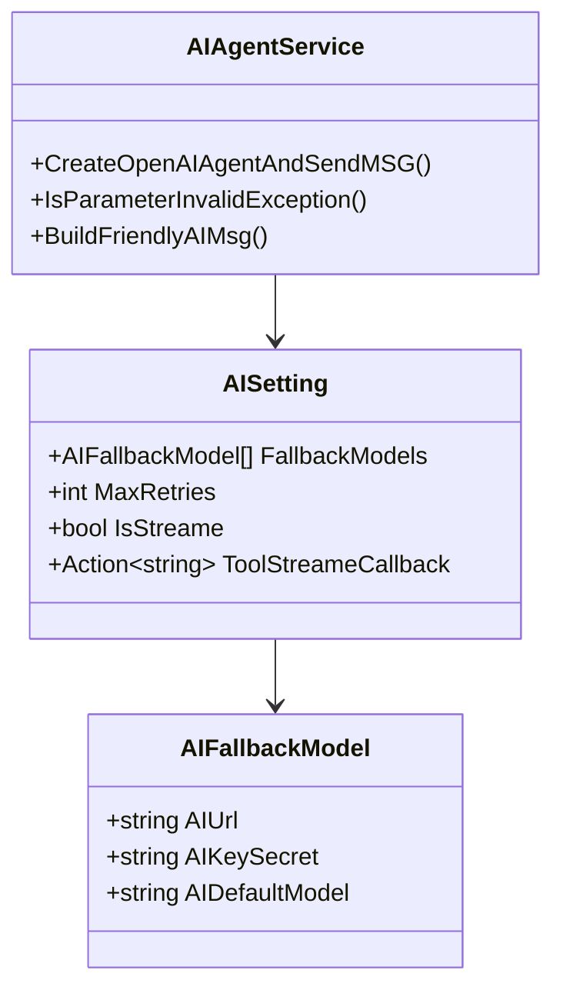

图表来源
- [AISetting.cs:1-88](file://Kevin/kevin.Module/kevin.AI.AgentFramework/AISetting.cs#L1-L88)
- [AIAgentService.cs:1-567](file://Kevin/kevin.Module/kevin.AI.AgentFramework/AIAgentService.cs#L1-L567)

章节来源
- [AISetting.cs:1-88](file://Kevin/kevin.Module/kevin.AI.AgentFramework/AISetting.cs#L1-L88)
- [AIAgentService.cs:1-567](file://Kevin/kevin.Module/kevin.AI.AgentFramework/AIAgentService.cs#L1-L567)

### 向量记忆系统（AIQdrantAgentMemoryService + AIAgentMemoryService）
**新增功能** 系统实现了基于Qdrant的向量记忆系统，提供高性能的语义检索能力：

- **双存储架构**：AIAgentMemoryService作为统一入口，优先使用AIQdrantAgentMemoryService进行向量检索，失败时自动降级到MySQL关键词搜索
- **三维隔离**：按租户+智能体+用户维度隔离记忆数据，确保多租户环境下的数据安全
- **语义检索**：通过Ollama嵌入模型将记忆内容转换为向量，使用余弦相似度进行语义匹配
- **可选重排序**：集成AliRerankService对搜索结果进行相关性重排序，提升检索精度
- **异步同步**：记忆CRUD操作以MySQL为主，成功后异步同步向量到Qdrant，失败不影响主流程
- **过期管理**：支持短期记忆（task类型）的过期时间管理，自动过滤已过期记忆

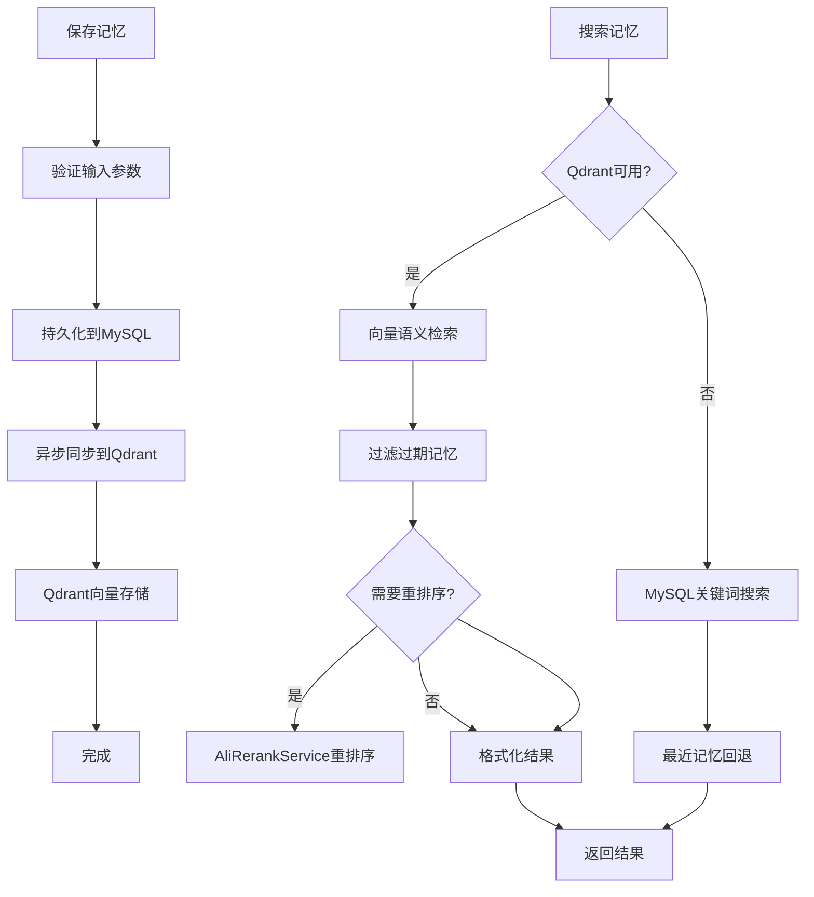

图表来源
- [AIQdrantAgentMemoryService.cs:1-378](file://Kevin/Application/Services/AI/AIQdrantAgentMemoryService.cs#L1-L378)
- [AIAgentMemoryService.cs:1-470](file://Kevin/Application/Services/AI/AIAgentMemoryService.cs#L1-L470)

章节来源
- [AIQdrantAgentMemoryService.cs:1-378](file://Kevin/Application/Services/AI/AIQdrantAgentMemoryService.cs#L1-L378)
- [AIAgentMemoryService.cs:1-470](file://Kevin/Application/Services/AI/AIAgentMemoryService.cs#L1-L470)
- [TAIAgentMemory.cs:1-71](file://Kevin/Domain/Entities/AI/TAIAgentMemory.cs#L1-L71)

### 上下文数据共享（AIShareInfoService）
**新增功能** 系统实现了AI组件间的上下文数据共享机制：

- **安全上下文传递**：AIShareInfoService提供线程安全的上下文数据存储和访问
- **域名授权管理**：支持配置允许的域名列表，防止敏感信息泄露
- **安全拦截机制**：可配置是否开启安全拦截，默认启用以防止恶意请求
- **多维度上下文**：包含用户信息、租户信息、智能体信息、聊天会话信息等
- **灵活配置**：支持动态配置内容长度限制、消息限制条数等参数

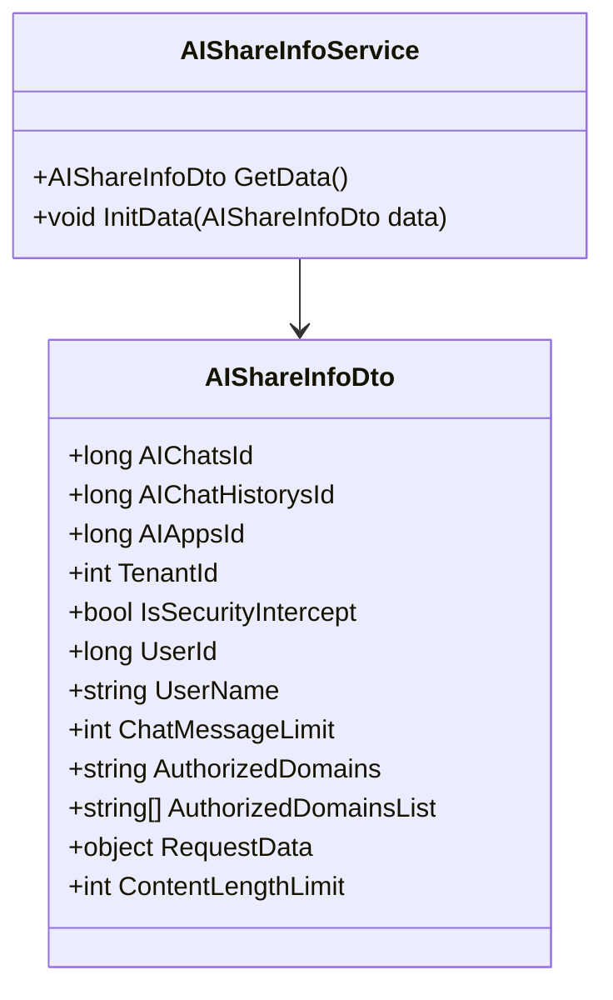

图表来源
- [AIShareInfoService.cs:1-40](file://Kevin/kevin.Module/kevin.AI.AgentFramework/Tools/AIShareInfoService.cs#L1-L40)
- [AIShareInfoDto.cs:1-64](file://Kevin/kevin.Module/kevin.AI.AgentFramework/Dto/AIShareInfoDto.cs#L1-L64)

章节来源
- [AIShareInfoService.cs:1-40](file://Kevin/kevin.Module/kevin.AI.AgentFramework/Tools/AIShareInfoService.cs#L1-L40)
- [AIShareInfoDto.cs:1-64](file://Kevin/kevin.Module/kevin.AI.AgentFramework/Dto/AIShareInfoDto.cs#L1-L64)
- [IAIShareInfoService.cs:1-29](file://Kevin/kevin.Module/kevin.AI.AgentFramework/Interfaces/IAIShareInfoService.cs#L1-L29)

### RAG检索与重排序（RAGService + AliRerankService）
- 检索流程：按集合名与问题向量搜索文档块，支持topK与相似度阈值过滤。
- 重排序：可选接入外部重排序服务，对候选文档进行相关性打分与排序，再组装上下文提示词。
- 输出：返回布尔标志、拼接后的系统提示词与文档块列表。

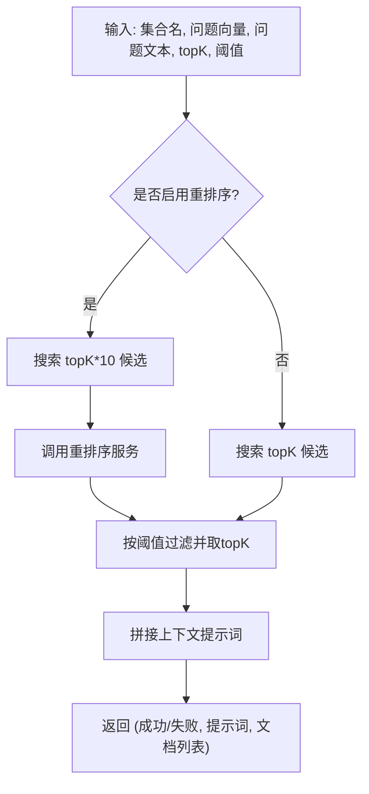

图表来源
- [RAGService.cs:1-81](file://Kevin/kevin.Module/kevin.RAG/RAGService.cs#L1-L81)
- [AliRerankService.cs:1-99](file://Kevin/kevin.Module/kevin.RAG/Rerank/AliRerankService.cs#L1-L99)
- [IRAGStorageService.cs:1-30](file://Kevin/kevin.Module/kevin.RAG/Interfaces/IRAGStorageService.cs#L1-L30)

章节来源
- [RAGService.cs:1-81](file://Kevin/kevin.Module/kevin.RAG/RAGService.cs#L1-L81)
- [AliRerankService.cs:1-99](file://Kevin/kevin.Module/kevin.RAG/Rerank/AliRerankService.cs#L1-L99)
- [IRAGStorageService.cs:1-30](file://Kevin/kevin.Module/kevin.RAG/Interfaces/IRAGStorageService.cs#L1-L30)

### 知识库索引与入库（AIKmssService）
- 文档读取：支持本地文件与远程URL，按类型解析（文本、Markdown、PDF、Word、HTML、图片、Excel）。
- 分块与清洗：DocumentProcessor清理并分段，生成带元数据的文档块。
- 向量化：通过Ollama嵌入模型生成向量，记录维度大小。
- 入库：调用IRAGStorageService将文档块写入Qdrant集合（命名空间含知识库ID）。
- 并发控制：分布式锁避免重复处理同一知识库。

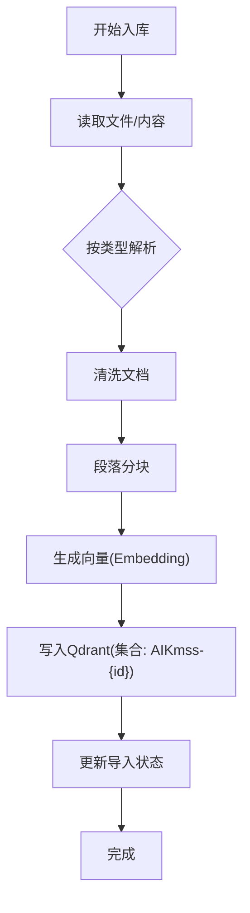

图表来源
- [AIKmssService.cs:1-449](file://Kevin/Application/Services/AI/AIKmssService.cs#L1-L449)
- [TAIKmss.cs:1-47](file://Kevin/Domain/Entities/AI/TAIKmss.cs#L1-L47)

章节来源
- [AIKmssService.cs:1-449](file://Kevin/Application/Services/AI/AIKmssService.cs#L1-L449)
- [TAIKmss.cs:1-47](file://Kevin/Domain/Entities/AI/TAIKmss.cs#L1-L47)

### 模型配置与管理（AIModelsService + TAIModels）
- 功能：分页查询、详情获取、新增/编辑、删除；支持按类型筛选。
- 字段：AI类型、模型类型（聊天/嵌入等）、端点、模型名、密钥、部署名、Embedding维度。
- 权限：支持租户隔离与数据权限控制。

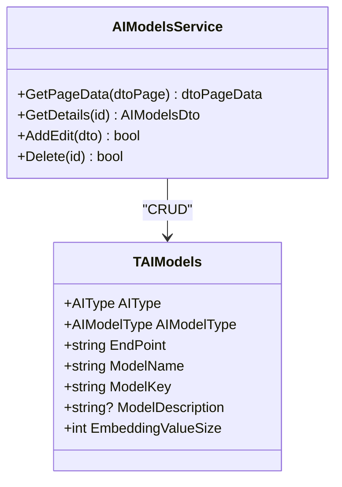

图表来源
- [TAIModels.cs:1-55](file://Kevin/Domain/Entities/AI/TAIModels.cs#L1-L55)
- [AIModelsService.cs:1-160](file://Kevin/Application/Services/AI/AIModelsService.cs#L1-L160)

章节来源
- [AIModelsService.cs:1-160](file://Kevin/Application/Services/AI/AIModelsService.cs#L1-L160)
- [TAIModels.cs:1-55](file://Kevin/Domain/Entities/AI/TAIModels.cs#L1-L55)

### 智能应用配置（AIAppsService）
**新增功能** 智能应用服务现支持Auto模式，提供灵活的模型选择机制：

- **Auto模式支持**：当应用配置设置为"auto"时，系统会自动从可用模型列表中随机选择一个模型
- **子应用模型选择**：支持子智能体的独立模型选择，每个子应用可以配置不同的模型策略
- **动态模型解析**：在运行时解析Auto配置，确保每次请求都能获得合适的模型实例
- **错误处理**：当没有可用模型时，提供友好的用户提示信息

章节来源
- [AIAppsService.cs:370-565](file://Kevin/Application/Services/AI/AIAppsService.cs#L370-L565)

### 技能与工具管理（AISkillToolManagementService + TAISkillToolManagement）
- 能力：分页查询、按类型筛选（Skill/Tool/MCP）、唯一性校验、启用/停用、系统内置保护。
- 技能包：上传Zip后解压至磁盘目录，便于运行时加载。
- MCP集成：支持MCP地址、类型、Headers、命令、参数与环境变量配置。

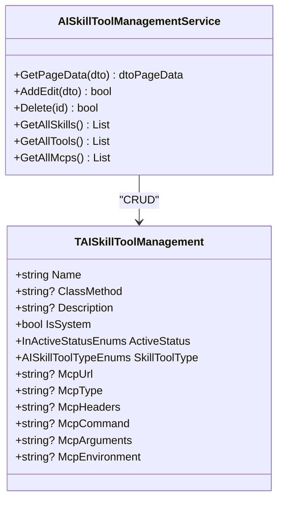

图表来源
- [TAISkillToolManagement.cs:1-93](file://Kevin/Domain/Entities/AI/TAISkillToolManagement.cs#L1-L93)
- [AISkillToolManagementService.cs:1-254](file://Kevin/Application/Services/AI/AISkillToolManagementService.cs#L1-L254)

章节来源
- [AISkillToolManagementService.cs:1-254](file://Kevin/Application/Services/AI/AISkillToolManagementService.cs#L1-L254)
- [TAISkillToolManagement.cs:1-93](file://Kevin/Domain/Entities/AI/TAISkillToolManagement.cs#L1-L93)

## 依赖关系分析
- AIAgentService依赖AISetting进行连接与行为配置，并通过服务注册扩展注入工具服务。
- **新增自动模式依赖**：AIAgentService现在依赖备选模型列表进行故障转移，增强了系统的可靠性。
- **新增记忆系统依赖**：AIAgentMemoryService依赖AIQdrantAgentMemoryService进行向量检索，依赖AIShareInfoService获取上下文信息。
- RAGService依赖IRAGStorageService与可选的重排序服务，解耦存储实现。
- AIKmssService依赖AIModelsService（选择嵌入模型）、OllamaApiService（嵌入）、IRAGStorageService（Qdrant）与文件服务。
- 领域实体作为数据契约被服务层引用，保证一致性。

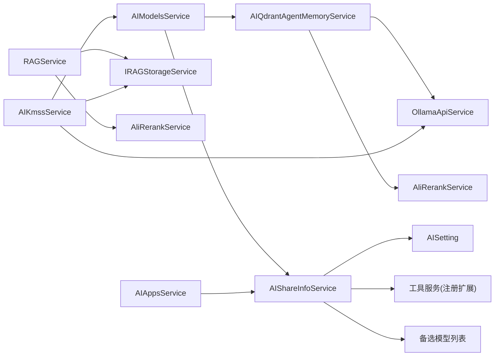

图表来源
- [ServiceCollectionExtensions.cs:1-22](file://Kevin/kevin.Module/kevin.AI.AgentFramework/ServiceCollectionExtensions.cs#L1-L22)
- [RAGService.cs:1-81](file://Kevin/kevin.Module/kevin.RAG/RAGService.cs#L1-L81)
- [AIKmssService.cs:1-449](file://Kevin/Application/Services/AI/AIKmssService.cs#L1-L449)
- [AISetting.cs:1-88](file://Kevin/kevin.Module/kevin.AI.AgentFramework/AISetting.cs#L1-L88)
- [AIAppsService.cs:370-565](file://Kevin/Application/Services/AI/AIAppsService.cs#L370-L565)
- [AIQdrantAgentMemoryService.cs:1-378](file://Kevin/Application/Services/AI/AIQdrantAgentMemoryService.cs#L1-L378)
- [AIAgentMemoryService.cs:1-470](file://Kevin/Application/Services/AI/AIAgentMemoryService.cs#L1-L470)

章节来源
- [ServiceCollectionExtensions.cs:1-22](file://Kevin/kevin.Module/kevin.AI.AgentFramework/ServiceCollectionExtensions.cs#L1-L22)
- [RAGService.cs:1-81](file://Kevin/kevin.Module/kevin.RAG/RAGService.cs#L1-L81)
- [AIKmssService.cs:1-449](file://Kevin/Application/Services/AI/AIKmssService.cs#L1-L449)
- [AISetting.cs:1-88](file://Kevin/kevin.Module/kevin.AI.AgentFramework/AISetting.cs#L1-L88)
- [AIAppsService.cs:370-565](file://Kevin/Application/Services/AI/AIAppsService.cs#L370-L565)

## 性能考量
- 流式输出与增量渲染：优先使用流式模式降低首字延迟，结合工具调用回调与思考过程提取提升交互体验。
- **新增自动模式性能优化**：智能重试机制确保在多模型环境下的高可用性，减少单点故障影响。
- **新增向量记忆性能优化**：Qdrant向量检索提供O(1)复杂度的相似性搜索，远优于传统关键词匹配的O(n)复杂度。
- 重试与超时：合理设置最大重试次数与网络超时，避免瞬时抖动导致失败。
- 检索规模控制：RAG检索先扩大候选集（如topK*10）再重排序，减少漏检；同时设置相似度阈值过滤低质片段。
- 分块策略：依据文档类型与语义调整段落长度与重叠标记数，平衡召回与上下文窗口限制。
- 并发入库：使用分布式锁避免重复处理，批量写入向量库减少往返开销。
- 资源隔离：不同知识库使用独立集合命名空间，避免冲突与热点。
- **内存管理**：向量记忆系统支持短期记忆的自动过期清理，避免无限增长。

## 故障排查指南
- 流式异常回退：当流式调用抛出异常时，服务会回退为非流式调用并重试，检查日志定位网络或模型端问题。
- **新增自动模式故障排查**：检查备选模型配置是否正确，确认模型API地址和密钥有效，查看模型切换通知是否正常触发。
- **新增向量记忆故障排查**：检查Qdrant连接配置、Ollama嵌入服务可用性，查看向量同步日志，确认三维隔离是否正确。
- 思考过程为空：若未提取到reasoning字段，检查原始响应结构与字段名兼容性。
- 重排序失败：确认重排序服务URL、模型与鉴权头配置正确，捕获错误信息并提示。
- 知识库入库失败：查看导入状态与错误信息，核对文件类型、解析器与嵌入模型配置；必要时重新触发处理。
- 技能工具不可用：检查启用状态、系统内置保护与MCP参数完整性。
- **新增错误提示优化**：系统现在提供友好的错误提示信息，包括API Key无效、限流、Token限制等常见问题的明确指导。
- **上下文共享故障排查**：检查AIShareInfoService初始化是否正确，域名授权配置是否生效，安全拦截是否正常工作。

章节来源
- [AIAgentService.cs:1-567](file://Kevin/kevin.Module/kevin.AI.AgentFramework/AIAgentService.cs#L1-L567)
- [AliRerankService.cs:1-99](file://Kevin/kevin.Module/kevin.RAG/Rerank/AliRerankService.cs#L1-L99)
- [AIKmssService.cs:1-449](file://Kevin/Application/Services/AI/AIKmssService.cs#L1-L449)
- [AIQdrantAgentMemoryService.cs:1-378](file://Kevin/Application/Services/AI/AIQdrantAgentMemoryService.cs#L1-L378)
- [AIAgentMemoryService.cs:1-470](file://Kevin/Application/Services/AI/AIAgentMemoryService.cs#L1-L470)

## 结论
NetCoreKevin AI智能体系统以AgentFramework为核心，结合RAG检索增强与知识库索引，形成从"问题→检索→重排→推理→工具"的闭环链路。**新增的自动模式功能**显著提升了系统在多模型环境下的可靠性和容错能力，通过智能模型选择和故障转移机制，确保AI服务的持续可用性。**新增的向量记忆系统**通过Qdrant向量数据库实现高性能的语义检索，结合MySQL持久化存储，提供了企业级的记忆管理能力。**上下文数据共享机制**确保了AI组件间的安全通信和数据传递。通过灵活的模型配置、完善的技能工具管理与稳健的流式处理能力，满足企业级AI应用的多场景需求。建议在生产环境结合重试、超时、阈值与分块策略调优，并获得自动模式的故障转移优势与向量记忆的高性能检索能力，以获得稳定高效的AI服务能力。

## 附录
- 自定义工具开发指南
  - 在工具服务注册扩展中声明工具服务类型，确保依赖注入可用。
  - 遵循统一接口约定，实现工具方法签名与参数校验。
  - 通过AIAgent的工具自动审批规则控制执行策略，注意安全风险。
- 技能管理配置
  - 上传技能Zip包并解压至指定目录，确保运行时可加载。
  - 配置MCP参数（地址、类型、Headers、命令、参数、环境变量）以对接外部能力。
- **新增自动模式配置指南**
  - 在AISetting中配置备选模型列表，包含多个不同供应商的模型配置
  - 设置合理的最大重试次数，确保能够尝试所有备选模型
  - 配置流式回调函数，实现前端模型切换状态的实时显示
  - 在生产环境中建议配置至少2-3个备选模型，提高系统可用性
- **新增向量记忆配置指南**
  - 配置Qdrant连接信息（URL、ApiKey、证书指纹）
  - 设置Ollama嵌入模型配置，确保向量维度一致
  - 配置重排序服务（可选），提升语义检索精度
  - 设置合适的SearchFetchLimit和MaxReturnCount参数
  - 配置短期记忆过期策略，避免数据无限增长
- **新增上下文共享配置指南**
  - 配置AuthorizedDomains域名白名单，限制API调用来源
  - 设置IsSecurityIntercept开关，控制安全拦截行为
  - 配置ContentLengthLimit限制，防止过大数据传输
  - 设置ChatMessageLimit限制对话消息数量
- 实际应用场景与最佳实践
  - 客服问答：RAG检索企业内部文档，重排序提升准确性，Agent调用查询工具补充实时数据。
  - 代码助手：结合代码仓库与文档，利用工具执行编译/测试，流式反馈逐步生成代码。
  - 数据分析：读取Excel/CSV，生成洞察报告，必要时调用计算工具进行指标聚合。
  - **高可用场景**：利用自动模式实现多模型冗余，确保关键业务AI服务的连续性。
  - **个性化服务**：通过向量记忆系统记住用户偏好和历史对话，提供个性化的AI服务体验。
  - **多租户场景**：利用三维隔离机制，确保不同租户间的数据完全隔离。