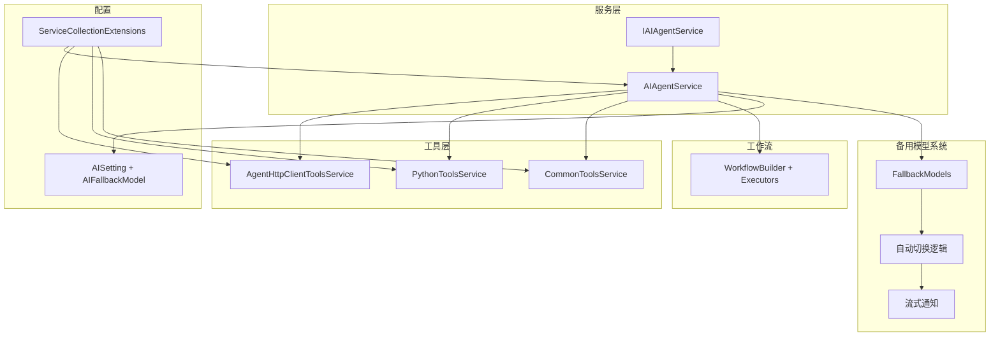
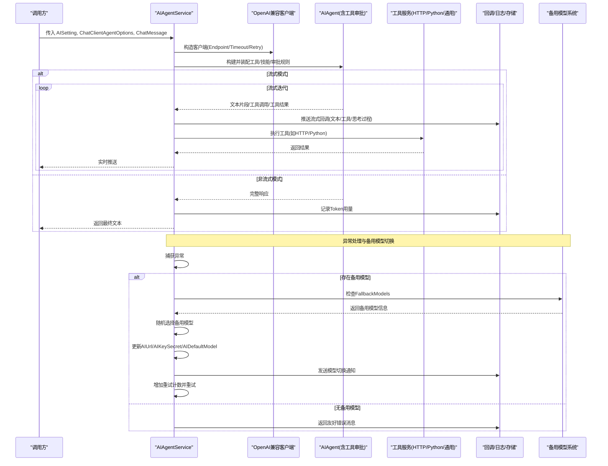
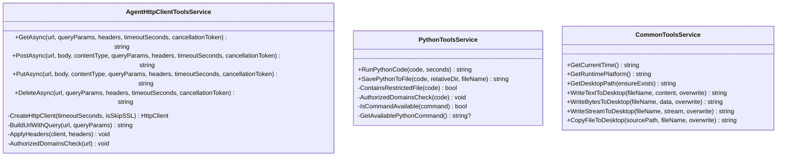
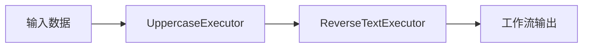
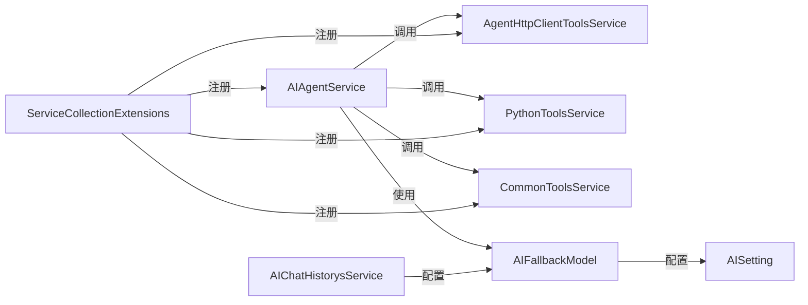

# AgentFramework集成

<cite>
**本文引用的文件**
- [AIAgentService.cs](file://Kevin/kevin.Module/kevin.AI.AgentFramework/AIAgentService.cs)
- [AISetting.cs](file://Kevin/kevin.Module/kevin.AI.AgentFramework/AISetting.cs)
- [AIChatHistorysService.cs](file://Kevin/Application/Services/AI/AIChatHistorysService.cs)
- [ServiceCollectionExtensions.cs](file://Kevin/kevin.Module/kevin.AI.AgentFramework/ServiceCollectionExtensions.cs)
- [IAIAgentService.cs](file://Kevin/kevin.Module/kevin.AI.AgentFramework/Interfaces/IAIAgentService.cs)
- [CommonToolsService.cs](file://Kevin/kevin.Module/kevin.AI.AgentFramework/Tools/CommonToolsService.cs)
- [AgentHttpClientToolsService.cs](file://Kevin/kevin.Module/kevin.AI.AgentFramework/Tools/AgentHttpClientToolsService.cs)
- [PythonToolsService.cs](file://Kevin/kevin.Module/kevin.AI.AgentFramework/Tools/PythonToolsService.cs)
- [Demo.cs](file://Kevin/kevin.Module/kevin.AI.AgentFramework/WorkFlows/Demo.cs)
</cite>

## 更新摘要
**变更内容**
- 增强了AIAgentService的智能备用模型系统，支持多模型故障转移
- 添加了FallbackModels属性和AIFallbackModel类用于配置备用模型
- 实现了自动模型切换机制和流式通知功能
- 优化了重试策略，根据可用备用模型动态调整重试次数
- 改进了错误处理和用户友好的错误消息

## 目录
1. [简介](#简介)
2. [项目结构](#项目结构)
3. [核心组件](#核心组件)
4. [架构总览](#架构总览)
5. [详细组件分析](#详细组件分析)
6. [依赖关系分析](#依赖关系分析)
7. [性能考虑](#性能考虑)
8. [故障排查指南](#故障排查指南)
9. [结论](#结论)
10. [附录](#附录)

## 简介
本文件面向基于 Microsoft Semantic Kernel / Extensions.AI 的智能代理框架（AgentFramework）集成，聚焦以下目标：
- 多步推理引擎与工作流编排：通过 AIAgent 构建器、工具审批与流式处理，实现"模型-工具-结果"的闭环。
- **智能备用模型系统**：新增的FallbackModels属性支持多模型故障转移，当主模型失败时自动切换到备用模型，确保服务的高可用性。
- 任务自动化工具链：提供 HTTP 调用、Python 脚本执行、通用系统工具等能力，支持安全白名单与内容长度限制。
- 技能系统与上下文保持：通过配置开关控制技能与工具的启用，结合回调机制实现对话上下文与中间状态传递。
- 工作流设计模式：使用 Executer/WorkflowBuilder 将多个步骤串联，形成可复用的复杂 AI 任务流程。
- 自定义技能开发指南、工具注册机制与错误处理策略：给出扩展点与最佳实践。
- 实际应用场景示例：自动化数据处理、API 调用编排、多模型协作等。

## 项目结构
AgentFramework 位于 Kevin.Module/kevin.AI.AgentFramework，核心由服务层、工具层、工作流与配置组成：
- 服务层：AIAgentService 负责创建 AIAgent、发送消息、流式输出、Token 用量统计与**智能备用模型切换**。
- 工具层：HTTP 客户端工具、Python 执行工具、通用系统工具，均通过特性描述暴露为可被模型调用的函数。
- 工作流：基于 WorkflowBuilder 的演示，展示如何连接多个执行器形成有向图。
- 配置：AISetting 集中管理端点、模型、超时、重试、流式回调、工具/技能开关及**备用模型列表**等。
- 依赖注入：ServiceCollectionExtensions 统一注册常用工具与服务。

**图表来源**
- [AIAgentService.cs:62-210](file://Kevin/kevin.Module/kevin.AI.AgentFramework/AIAgentService.cs#L62-L210)
- [AISetting.cs:62-86](file://Kevin/kevin.Module/kevin.AI.AgentFramework/AISetting.cs#L62-L86)
- [ServiceCollectionExtensions.cs:12-22](file://Kevin/kevin.Module/kevin.AI.AgentFramework/ServiceCollectionExtensions.cs#L12-L22)

## 核心组件
- **AIAgentService**：封装 OpenAI 兼容客户端、AIAgent 构建器、工具审批、流式与非流式两种执行路径、思考过程提取、Token 用量统计与异常重试。**新增智能备用模型系统，支持自动故障转移和流式通知**。
- **备用模型系统**：
  - FallbackModels属性：存储备用模型配置的列表
  - AIFallbackModel类：定义备用模型的API地址、密钥和模型名称
  - 自动切换逻辑：在主模型失败时随机选择备用模型并更新配置
  - 流式通知：通过ToolStreameCallback通知前端模型切换状态
- 工具服务：
  - AgentHttpClientToolsService：GET/POST/PUT/DELETE 请求，支持域名白名单、Header 注入、响应长度限制。
  - PythonToolsService：执行 Python 代码，包含安全校验、受控配置文件拦截、URL 白名单、超时控制与脚本保存。
  - CommonToolsService：时间、平台、桌面路径、文件写入/复制等通用能力。
- 工作流：Demo 展示了两个执行器的顺序编排，体现"输入->处理->输出"的可组合性。
- 配置与注入：AISetting 集中参数；ServiceCollectionExtensions 统一注册服务到 DI 容器。

**章节来源**
- [AIAgentService.cs:1-567](file://Kevin/kevin.Module/kevin.AI.AgentFramework/AIAgentService.cs#L1-L567)
- [AISetting.cs:1-88](file://Kevin/kevin.Module/kevin.AI.AgentFramework/AISetting.cs#L1-L88)
- [AIChatHistorysService.cs:124-145](file://Kevin/Application/Services/AI/AIChatHistorysService.cs#L124-L145)
- [AgentHttpClientToolsService.cs:1-256](file://Kevin/kevin.Module/kevin.AI.AgentFramework/Tools/AgentHttpClientToolsService.cs#L1-L256)
- [PythonToolsService.cs:1-299](file://Kevin/kevin.Module/kevin.AI.AgentFramework/Tools/PythonToolsService.cs#L1-L299)
- [CommonToolsService.cs:1-260](file://Kevin/kevin.Module/kevin.AI.AgentFramework/Tools/CommonToolsService.cs#L1-L260)
- [Demo.cs:1-60](file://Kevin/kevin.Module/kevin.AI.AgentFramework/WorkFlows/Demo.cs#L1-L60)
- [ServiceCollectionExtensions.cs:1-25](file://Kevin/kevin.Module/kevin.AI.AgentFramework/ServiceCollectionExtensions.cs#L1-L25)

## 架构总览
下图展示从调用方到模型、工具与工作流的端到端交互，**重点突出智能备用模型系统的故障转移机制**：

**图表来源**
- [AIAgentService.cs:185-210](file://Kevin/kevin.Module/kevin.AI.AgentFramework/AIAgentService.cs#L185-L210)
- [AISetting.cs:62-86](file://Kevin/kevin.Module/kevin.AI.AgentFramework/AISetting.cs#L62-L86)
- [AIChatHistorysService.cs:223-244](file://Kevin/Application/Services/AI/AIChatHistorysService.cs#L223-L244)

## 详细组件分析

### AIAgentService：对话管理、上下文保持、工具调用与结果处理
- **对话与上下文**
  - 通过 ChatClientAgentOptions 注入工具与上下文提供者；可通过 AISetting.IsAITools/IsAISkills 动态关闭或开启。
  - 支持流式回调 StreameCallback、ToolStreameCallback、ReasoningStreameCallback，便于前端实时渲染与调试。
- **工具调用与审批**
  - 使用 AsBuilder().UseToolApproval(...) 设置自动审批规则，默认全匹配放行，也可替换为更严格的策略。
- **流式与非流式执行**
  - 流式：遍历 AgentResponseUpdate，区分 FunctionCallContent/FunctionResultContent/TextContent，分别触发工具回调与文本回调。
  - 非流式：直接获取完整响应文本与 Usage 信息。
- **Token 用量与思考过程**
  - TryExtractUsageFromUpdate 兼容多种来源（对象属性、反射、JSON 节点），提取输入/输出/总计 Token。
  - GetReasoningTextAsync 从原始流中解析 reasoning/reasoning_content，用于展示"思考过程"。
- **容错与重试**
  - 捕获异常后按 MaxRetries 进行重试，确保网络抖动时的稳定性。
- **智能备用模型系统** ⭐ **新增功能**
  - **动态重试计数**：当存在FallbackModels时，自动将MaxRetries设置为FallbackModels.Count以确保足够尝试所有备用模型
  - **自动模型切换**：在主模型失败时，随机选择一个未使用过的备用模型，更新AIUrl、AIKeySecret和AIDefaultModel配置
  - **流式通知**：通过ToolStreameCallback向前端发送模型切换通知，格式为"⚠️ 模型调用失败，正在自动切换到备用模型: {model}..."
  - **模型移除机制**：每次切换后从FallbackModels列表中移除已使用的模型，避免重复尝试

```mermaid
flowchart TD
Start(["开始"]) --> CheckFB{"检查FallbackModels"}
CheckFB -- 有备用模型 --> SetRetries["设置maxRetries = max(MaxRetries, FallbackModels.Count)"]
CheckFB -- 无备用模型 --> NormalRetries["使用原始MaxRetries"]
SetRetries --> Mode{"是否流式?"}
NormalRetries --> Mode
Mode -- 是 --> StreamLoop["遍历流式更新"]
StreamLoop --> Type{"内容类型"}
Type -- 工具调用 --> CallTool["触发工具回调/执行工具"]
Type -- 工具结果 --> ReturnTool["返回工具结果"]
Type -- 文本 --> PushText["推送文本回调"]
Type -- 思考过程 --> PushReason["推送思考过程回调"]
CallTool --> StreamLoop
ReturnTool --> StreamLoop
PushText --> StreamLoop
PushReason --> StreamLoop
Mode -- 否 --> NonStream["RunAsync获取完整响应"]
NonStream --> ExtractUsage["提取Token用量"]
ExtractUsage --> End(["结束"])
StreamLoop --> End
Note1["异常处理"] --> CheckFB2{"是否有备用模型?"}
CheckFB2 -- 是 --> SelectModel["随机选择备用模型"]
SelectModel --> UpdateConfig["更新AIUrl/AIKeySecret/AIDefaultModel"]
UpdateConfig --> SendNotify["发送模型切换通知"]
SendNotify --> RemoveModel["从FallbackModels移除已用模型"]
RemoveModel --> Retry["重试请求"]
CheckFB2 -- 否 --> FriendlyMsg["返回友好错误消息"]
```

**图表来源**
- [AIAgentService.cs:62-67](file://Kevin/kevin.Module/kevin.AI.AgentFramework/AIAgentService.cs#L62-L67)
- [AIAgentService.cs:185-210](file://Kevin/kevin.Module/kevin.AI.AgentFramework/AIAgentService.cs#L185-L210)
- [AIAgentService.cs:247-271](file://Kevin/kevin.Module/kevin.AI.AgentFramework/AIAgentService.cs#L247-L271)

**章节来源**
- [AIAgentService.cs:1-567](file://Kevin/kevin.Module/kevin.AI.AgentFramework/AIAgentService.cs#L1-L567)
- [IAIAgentService.cs:1-30](file://Kevin/kevin.Module/kevin.AI.AgentFramework/Interfaces/IAIAgentService.cs#L1-L30)
- [AISetting.cs:1-88](file://Kevin/kevin.Module/kevin.AI.AgentFramework/AISetting.cs#L1-L88)

### 备用模型系统：智能故障转移与通知机制
- **FallbackModels属性**
  - 类型为List<AIFallbackModel>，存储备用模型配置列表
  - 支持多个备用模型的配置和管理
- **AIFallbackModel类**
  - AIUrl：备用模型的API地址
  - AIKeySecret：备用模型的密钥
  - AIDefaultModel：备用模型的名称
- **自动切换逻辑**
  - 在主模型抛出异常时触发
  - 使用Random.Next()随机选择备用模型索引
  - 更新当前AISetting的配置以切换到新模型
  - 从FallbackModels列表中移除已使用的模型
- **流式通知机制**
  - 通过ToolStreameCallback发送模型切换通知
  - 通知格式："⚠️ 模型调用失败，正在自动切换到备用模型: {model}..."
  - 支持前端实时显示模型切换状态
- **动态重试计数**
  - 当存在FallbackModels时，自动计算maxRetries = Math.Max(MaxRetries, FallbackModels.Count)
  - 确保有足够的重试次数尝试所有备用模型

**章节来源**
- [AIAgentService.cs:62-67](file://Kevin/kevin.Module/kevin.AI.AgentFramework/AIAgentService.cs#L62-L67)
- [AIAgentService.cs:193-208](file://Kevin/kevin.Module/kevin.AI.AgentFramework/AIAgentService.cs#L193-L208)
- [AISetting.cs:62-86](file://Kevin/kevin.Module/kevin.AI.AgentFramework/AISetting.cs#L62-L86)
- [AIChatHistorysService.cs:124-145](file://Kevin/Application/Services/AI/AIChatHistorysService.cs#L124-L145)

### 工具链：HTTP 调用、Python 执行与通用能力
- AgentHttpClientToolsService
  - 支持 GET/POST/PUT/DELETE，可注入查询参数与自定义 Header。
  - 安全：AuthorizedDomainsCheck 限制 URL 域名白名单；响应长度限制避免大响应影响上下文。
  - 健壮性：自动解压、重定向、超时控制与异常包装。
- PythonToolsService
  - 安全护栏：禁止访问受限配置文件；URL 白名单校验；可选代码级安全校验。
  - 执行：检测 python/python3，以子进程方式运行脚本；支持超时终止与错误输出收集。
  - 辅助：SavePythonToFile 将代码持久化以便审计与复用。
- CommonToolsService
  - 提供时间、平台、桌面路径、文件写入/复制等基础能力，便于智能体落地数据与产物。

**图表来源**
- [AgentHttpClientToolsService.cs:1-256](file://Kevin/kevin.Module/kevin.AI.AgentFramework/Tools/AgentHttpClientToolsService.cs#L1-L256)
- [PythonToolsService.cs:1-299](file://Kevin/kevin.Module/kevin.AI.AgentFramework/Tools/PythonToolsService.cs#L1-L299)
- [CommonToolsService.cs:1-260](file://Kevin/kevin.Module/kevin.AI.AgentFramework/Tools/CommonToolsService.cs#L1-L260)

**章节来源**
- [AgentHttpClientToolsService.cs:1-256](file://Kevin/kevin.Module/kevin.AI.AgentFramework/Tools/AgentHttpClientToolsService.cs#L1-L256)
- [PythonToolsService.cs:1-299](file://Kevin/kevin.Module/kevin.AI.AgentFramework/Tools/PythonToolsService.cs#L1-L299)
- [CommonToolsService.cs:1-260](file://Kevin/kevin.Module/kevin.AI.AgentFramework/Tools/CommonToolsService.cs#L1-L260)

### 工作流设计模式：构建复杂 AI 任务流程
- 使用 WorkflowBuilder 将多个 Executor 串联，形成有向无环图（DAG）。
- Demo 展示了"大写转换 -> 文本反转"的顺序执行，体现了可扩展的执行器模式。
- 可将 AIAgent 作为执行器嵌入工作流，实现"多模型协作"与"分阶段处理"。

**图表来源**
- [Demo.cs:1-60](file://Kevin/kevin.Module/kevin.AI.AgentFramework/WorkFlows/Demo.cs#L1-L60)

**章节来源**
- [Demo.cs:1-60](file://Kevin/kevin.Module/kevin.AI.AgentFramework/WorkFlows/Demo.cs#L1-L60)

### 自定义技能开发与工具注册机制
- 技能系统
  - 通过 AISetting.IsAISkills 控制是否启用技能上下文提供者；在 AIAgent 构建时装配。
  - 可在 Skills 目录下组织技能资源（参考 system-ops 等目录结构），并通过上下文提供者接入。
- 工具注册
  - 在 ServiceCollectionExtensions.AddAIAgentClient 中统一注册工具服务，使 AIAgent 能够发现并调用。
  - 工具方法通过 Description 特性暴露给模型，便于自动发现与参数提示。
- 最佳实践
  - 为每个工具提供清晰的 Description 与参数约束（Required/Description）。
  - 对敏感操作（HTTP/Python）实施白名单与长度限制，防止滥用。
  - 使用流式回调记录工具调用与结果，便于追踪与审计。

**章节来源**
- [ServiceCollectionExtensions.cs:12-22](file://Kevin/kevin.Module/kevin.AI.AgentFramework/ServiceCollectionExtensions.cs#L12-L22)
- [AISetting.cs:25-31](file://Kevin/kevin.Module/kevin.AI.AgentFramework/AISetting.cs#L25-L31)
- [AgentHttpClientToolsService.cs:119-256](file://Kevin/kevin.Module/kevin.AI.AgentFramework/Tools/AgentHttpClientToolsService.cs#L119-L256)
- [PythonToolsService.cs:161-250](file://Kevin/kevin.Module/kevin.AI.AgentFramework/Tools/PythonToolsService.cs#L161-L250)
- [CommonToolsService.cs:33-257](file://Kevin/kevin.Module/kevin.AI.AgentFramework/Tools/CommonToolsService.cs#L33-L257)

### 错误处理策略
- **网络与模型层**
  - 使用 ClientRetryPolicy 与 MaxRetries 控制重试；捕获异常后回退为非流式执行。
  - **智能备用模型切换**：当主模型失败时自动切换到备用模型，提高系统可靠性。
- **工具层**
  - HTTP 工具：统一异常包装为"❌ 请求失败: ..."，便于上层识别与展示。
  - Python 工具：安全拦截、超时终止、错误输出收集，返回明确错误信息。
- **流式处理**
  - 对工具调用/结果/思考过程分别回调，便于定位问题与可视化调试。
- **用户友好错误消息** ⭐ **新增功能**
  - BuildFriendlyAIMsg方法将技术异常转换为易于理解的用户消息
  - 支持多种错误场景：Token限制、上下文长度、鉴权失败、限流等
  - 提供具体的解决建议，如"请检查模型配置后重试"

**章节来源**
- [AIAgentService.cs:185-210](file://Kevin/kevin.Module/kevin.AI.AgentFramework/AIAgentService.cs#L185-L210)
- [AIAgentService.cs:247-271](file://Kevin/kevin.Module/kevin.AI.AgentFramework/AIAgentService.cs#L247-L271)
- [AgentHttpClientToolsService.cs:142-145](file://Kevin/kevin.Module/kevin.AI.AgentFramework/Tools/AgentHttpClientToolsService.cs#L142-L145)
- [PythonToolsService.cs:172-196](file://Kevin/kevin.Module/kevin.AI.AgentFramework/Tools/PythonToolsService.cs#L172-L196)

## 依赖关系分析
- 服务与工具耦合度低：AIAgentService 仅通过工具接口调用具体实现，便于替换与测试。
- 外部依赖：OpenAI 兼容客户端、Extensions.AI 抽象、Microsoft.Agents.AI 工作流。
- 注入与生命周期：所有工具与服务以 Scoped 生命周期注册，适合 Web 请求上下文。
- **备用模型依赖**：AIFallbackModel类依赖于AISetting配置，通过AIChatHistorysService进行实例化和配置。

**图表来源**
- [ServiceCollectionExtensions.cs:12-22](file://Kevin/kevin.Module/kevin.AI.AgentFramework/ServiceCollectionExtensions.cs#L12-L22)
- [AIAgentService.cs:1-567](file://Kevin/kevin.Module/kevin.AI.AgentFramework/AIAgentService.cs#L1-L567)
- [AISetting.cs:62-86](file://Kevin/kevin.Module/kevin.AI.AgentFramework/AISetting.cs#L62-L86)
- [AIChatHistorysService.cs:124-145](file://Kevin/Application/Services/AI/AIChatHistorysService.cs#L124-L145)

**章节来源**
- [ServiceCollectionExtensions.cs:1-25](file://Kevin/kevin.Module/kevin.AI.AgentFramework/ServiceCollectionExtensions.cs#L1-L25)
- [AIAgentService.cs:1-567](file://Kevin/kevin.Module/kevin.AI.AgentFramework/AIAgentService.cs#L1-L567)

## 性能考虑
- **流式输出**：优先使用流式模式降低首包延迟，提升用户体验。
- **超时与重试**：合理设置 NetworkTimeout 与 MaxRetries，平衡可靠性与资源占用。
- **内容长度限制**：对 HTTP/Python 输出进行截断，避免上下文溢出。
- **工具审批**：在生产环境建议替换默认全匹配规则为更严格的策略，减少不必要调用。
- **并发与取消**：充分利用 CancellationToken，及时中断长时间任务。
- **备用模型优化** ⭐ **新增功能**
  - 动态重试计数确保足够的备用模型尝试机会
  - 随机选择备用模型避免单点故障
  - 模型切换后立即通知前端，提升用户体验

## 故障排查指南
- **无法建立连接或鉴权失败**
  - 检查 AISetting.AIUrl、AIKeySecret 是否正确；确认 Endpoint 与模型名称可用。
  - **备用模型检查**：确认FallbackModels列表中的备用模型配置正确且可用。
- **工具未生效**
  - 确认 IsAITools/IsAISkills 已启用；检查工具是否已在 ServiceCollectionExtensions 中注册。
- **HTTP 请求被拒绝**
  - 检查 AuthorizedDomains 白名单；确认域名与路径前缀匹配。
- **Python 执行失败**
  - 确认系统 PATH 中存在 python/python3；检查安全拦截与受限配置文件；查看超时与错误输出。
- **流式回调为空**
  - 检查 StreameCallback/ToolStreameCallback/ReasoningStreameCallback 是否设置；确认流式模式已启用。
- **备用模型切换问题** ⭐ **新增功能**
  - 检查FallbackModels列表是否为空；确认备用模型配置完整（AIUrl、AIKeySecret、AIDefaultModel）。
  - 查看ToolStreameCallback是否正确接收模型切换通知。
  - 确认重试次数足够尝试所有备用模型。

**章节来源**
- [AISetting.cs:1-88](file://Kevin/kevin.Module/kevin.AI.AgentFramework/AISetting.cs#L1-L88)
- [ServiceCollectionExtensions.cs:12-22](file://Kevin/kevin.Module/kevin.AI.AgentFramework/ServiceCollectionExtensions.cs#L12-L22)
- [AgentHttpClientToolsService.cs:106-117](file://Kevin/kevin.Module/kevin.AI.AgentFramework/Tools/AgentHttpClientToolsService.cs#L106-L117)
- [PythonToolsService.cs:143-159](file://Kevin/kevin.Module/kevin.AI.AgentFramework/Tools/PythonToolsService.cs#L143-L159)
- [AIAgentService.cs:185-210](file://Kevin/kevin.Module/kevin.AI.AgentFramework/AIAgentService.cs#L185-L210)

## 结论
该 AgentFramework 以 AIAgentService 为核心，结合工具链与工作流，提供了开箱即用的多步推理与任务自动化能力。**新增的智能备用模型系统显著提升了系统的可靠性和容错能力**，通过自动故障转移和流式通知机制，确保在主模型不可用时能够快速切换到备用模型，为用户提供连续的服务体验。通过灵活的配置与安全的工具沙箱，能够快速构建数据处理、API 编排与多模型协作等场景。建议在生产环境中强化工具审批策略与安全校验，并结合流式回调完善可观测性与用户体验。

## 附录
- **典型应用场景**
  - 自动化数据处理：Python 工具读取/清洗数据，HTTP 工具拉取外部数据，Common 工具输出结果文件。
  - API 调用编排：HTTP 工具串联多个微服务，结合工作流实现条件分支与重试。
  - 多模型协作：在工作流中串联不同 AIAgent（翻译、摘要、格式化），实现分阶段处理。
  - **高可用AI服务** ⭐ **新增场景**：利用备用模型系统实现多模型冗余，确保AI服务的持续可用性。
- **扩展点**
  - 新增工具：实现接口并在 ServiceCollectionExtensions 中注册；添加 Description 与参数约束。
  - 新增技能：在 Skills 目录组织资源，并通过上下文提供者接入 AIAgent。
  - 工作流扩展：定义新的 Executor，使用 WorkflowBuilder 连接已有步骤。
  - **备用模型扩展** ⭐ **新增扩展点**：通过配置更多备用模型提高系统容错能力，支持不同供应商的模型混合部署。