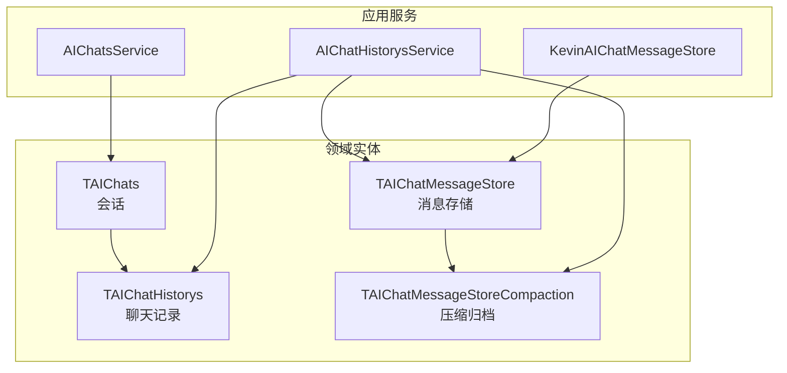
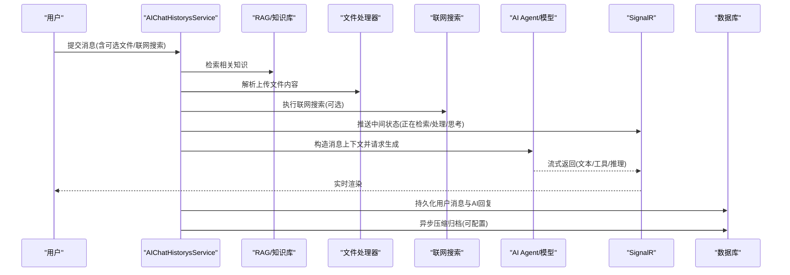
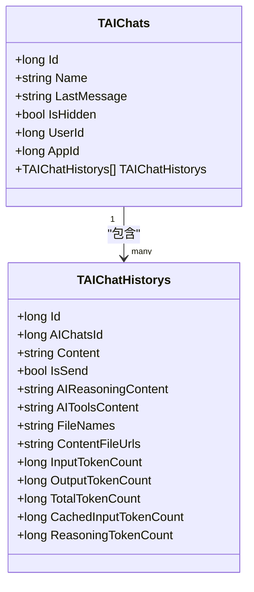
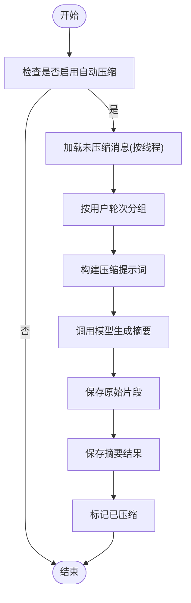
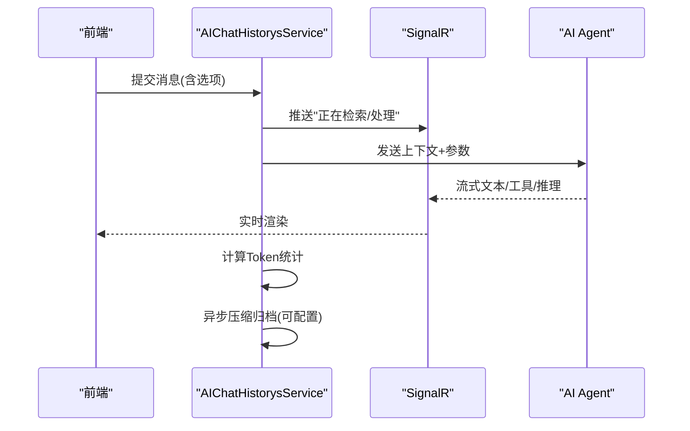
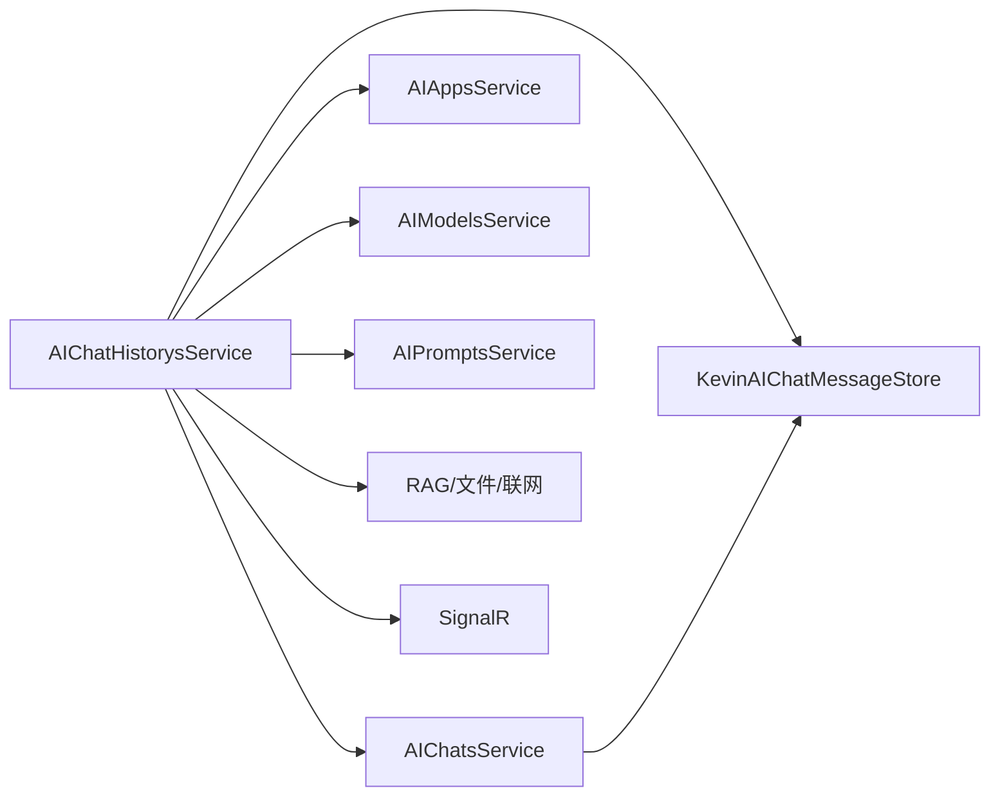
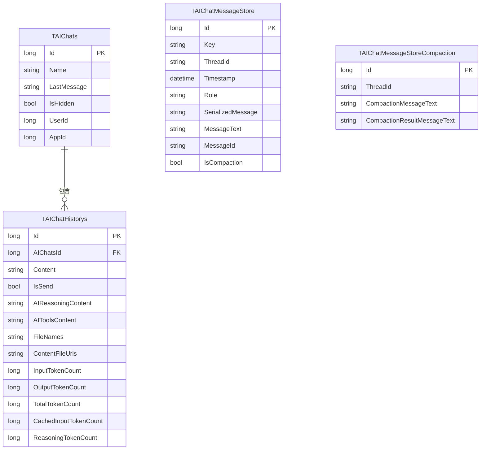

# 对话系统

<cite>
**本文引用的文件**
- [TAIChats.cs](file://Kevin/Domain/Entities/AI/TAIChats.cs)
- [TAIChatHistorys.cs](file://Kevin/Domain/Entities/AI/TAIChatHistorys.cs)
- [TAIChatMessageStore.cs](file://Kevin/Domain/Entities/AI/TAIChatMessageStore.cs)
- [TAIChatMessageStoreCompaction.cs](file://Kevin/Domain/Entities/AI/TAIChatMessageStoreCompaction.cs)
- [AIChatsService.cs](file://Kevin/Application/Services/AI/AIChatsService.cs)
- [AIChatHistorysService.cs](file://Kevin/Application/Services/AI/AIChatHistorysService.cs)
- [KevinAIChatMessageStore.cs](file://Kevin/Application/Services/AI/KevinAIChatMessageStore.cs)
</cite>

## 目录
1. [简介](#简介)
2. [项目结构](#项目结构)
3. [核心组件](#核心组件)
4. [架构总览](#架构总览)
5. [详细组件分析](#详细组件分析)
6. [依赖关系分析](#依赖关系分析)
7. [性能考量](#性能考量)
8. [故障排查指南](#故障排查指南)
9. [结论](#结论)
10. [附录](#附录)

## 简介
本对话系统围绕“会话、消息、上下文与持久化”构建，支持多轮对话、富文本与文件内容解析、知识库检索、联网搜索、流式响应与中间状态展示、消息压缩与归档等能力。通过服务层编排，将用户输入转化为结构化消息，结合提示词、模型配置与外部工具（RAG、搜索引擎、文件读取）生成AI回复，并以SignalR实时推送前端。同时提供会话列表管理、历史分页查询、主题与最后消息维护、以及按线程的消息存储与压缩归档机制。

## 项目结构
- 领域实体：会话、聊天记录、消息存储与压缩记录
- 应用服务：会话创建与更新、聊天历史新增/分页/删除、消息存储读写、压缩归档
- 基础设施：SignalR实时通信、HTTP客户端、RAG与文件读取、模型调用封装

图表来源
- [TAIChats.cs:1-52](file://Kevin/Domain/Entities/AI/TAIChats.cs#L1-L52)
- [TAIChatHistorys.cs:1-83](file://Kevin/Domain/Entities/AI/TAIChatHistorys.cs#L1-L83)
- [TAIChatMessageStore.cs:1-52](file://Kevin/Domain/Entities/AI/TAIChatMessageStore.cs#L1-L52)
- [TAIChatMessageStoreCompaction.cs:1-34](file://Kevin/Domain/Entities/AI/TAIChatMessageStoreCompaction.cs#L1-L34)
- [AIChatsService.cs:1-212](file://Kevin/Application/Services/AI/AIChatsService.cs#L1-L212)
- [AIChatHistorysService.cs:1-600](file://Kevin/Application/Services/AI/AIChatHistorysService.cs#L1-L600)
- [KevinAIChatMessageStore.cs:1-93](file://Kevin/Application/Services/AI/KevinAIChatMessageStore.cs#L1-L93)

章节来源
- [TAIChats.cs:1-52](file://Kevin/Domain/Entities/AI/TAIChats.cs#L1-L52)
- [TAIChatHistorys.cs:1-83](file://Kevin/Domain/Entities/AI/TAIChatHistorys.cs#L1-L83)
- [AIChatsService.cs:1-212](file://Kevin/Application/Services/AI/AIChatsService.cs#L1-L212)
- [AIChatHistorysService.cs:1-600](file://Kevin/Application/Services/AI/AIChatHistorysService.cs#L1-L600)
- [KevinAIChatMessageStore.cs:1-93](file://Kevin/Application/Services/AI/KevinAIChatMessageStore.cs#L1-L93)

## 核心组件
- 会话与会话历史
  - 会话：主题、最后一条消息、是否隐藏、用户与应用绑定、关联历史记录集合
  - 聊天记录：发送方向、内容、思考过程、工具调用过程、附件信息、Token统计
- 消息存储与压缩
  - 消息存储：按线程保存角色、序列化消息、时间戳、消息ID、是否已压缩
  - 压缩归档：保存原始压缩片段与LLM生成的摘要结果
- 服务层
  - AIChatsService：会话列表、新建会话并初始化欢迎语、更新主题与最后消息、删除
  - AIChatHistorysService：分页获取聊天记录、新增用户消息与AI回复、知识库检索、文件处理、联网搜索、流式回调、Token统计、异步压缩归档
  - KevinAIChatMessageStore：消息的批量写入与按线程读取（支持限制最近用户轮次）

章节来源
- [TAIChats.cs:1-52](file://Kevin/Domain/Entities/AI/TAIChats.cs#L1-L52)
- [TAIChatHistorys.cs:1-83](file://Kevin/Domain/Entities/AI/TAIChatHistorys.cs#L1-L83)
- [TAIChatMessageStore.cs:1-52](file://Kevin/Domain/Entities/AI/TAIChatMessageStore.cs#L1-L52)
- [TAIChatMessageStoreCompaction.cs:1-34](file://Kevin/Domain/Entities/AI/TAIChatMessageStoreCompaction.cs#L1-L34)
- [AIChatsService.cs:1-212](file://Kevin/Application/Services/AI/AIChatsService.cs#L1-L212)
- [AIChatHistorysService.cs:1-600](file://Kevin/Application/Services/AI/AIChatHistorysService.cs#L1-L600)
- [KevinAIChatMessageStore.cs:1-93](file://Kevin/Application/Services/AI/KevinAIChatMessageStore.cs#L1-L93)

## 架构总览
对话系统采用分层架构：控制器（未在本节展开）→ 应用服务 → 领域实体与仓储 → 外部能力（模型、RAG、文件、SignalR）。关键数据流如下：

图表来源
- [AIChatHistorysService.cs:104-262](file://Kevin/Application/Services/AI/AIChatHistorysService.cs#L104-L262)
- [AIChatHistorysService.cs:267-398](file://Kevin/Application/Services/AI/AIChatHistorysService.cs#L267-L398)
- [AIChatHistorysService.cs:470-596](file://Kevin/Application/Services/AI/AIChatHistorysService.cs#L470-L596)

## 详细组件分析

### 会话与会话历史
- 会话(TAIChats)
  - 字段：名称、最后消息、是否隐藏、用户ID、应用ID、关联历史记录集合
  - 作用：承载一次对话的元信息与概览
- 聊天记录(TAIChatHistorys)
  - 字段：所属会话、内容、发送方向、思考过程、工具调用过程、文件名与URL、Token统计（输入/输出/总计/缓存/推理）
  - 作用：记录每轮交互的完整上下文与资源消耗

图表来源
- [TAIChats.cs:1-52](file://Kevin/Domain/Entities/AI/TAIChats.cs#L1-L52)
- [TAIChatHistorys.cs:1-83](file://Kevin/Domain/Entities/AI/TAIChatHistorys.cs#L1-L83)

章节来源
- [TAIChats.cs:1-52](file://Kevin/Domain/Entities/AI/TAIChats.cs#L1-L52)
- [TAIChatHistorys.cs:1-83](file://Kevin/Domain/Entities/AI/TAIChatHistorys.cs#L1-L83)

### 消息存储与压缩归档
- 消息存储(TAIChatMessageStore)
  - 字段：Key、ThreadId、Timestamp、Role、SerializedMessage、MessageText、MessageId、IsCompaction
  - 索引：Key、ThreadId、Role、MessageId
- 压缩归档(TAIChatMessageStoreCompaction)
  - 字段：ThreadId、CompactionMessageText、CompactionResultMessageText
- 用途：为长对话提供上下文窗口管理与成本优化；按线程聚合用户轮次，触发压缩并保存摘要

图表来源
- [TAIChatMessageStore.cs:1-52](file://Kevin/Domain/Entities/AI/TAIChatMessageStore.cs#L1-L52)
- [TAIChatMessageStoreCompaction.cs:1-34](file://Kevin/Domain/Entities/AI/TAIChatMessageStoreCompaction.cs#L1-L34)
- [AIChatHistorysService.cs:470-596](file://Kevin/Application/Services/AI/AIChatHistorysService.cs#L470-L596)

章节来源
- [TAIChatMessageStore.cs:1-52](file://Kevin/Domain/Entities/AI/TAIChatMessageStore.cs#L1-L52)
- [TAIChatMessageStoreCompaction.cs:1-34](file://Kevin/Domain/Entities/AI/TAIChatMessageStoreCompaction.cs#L1-L34)
- [AIChatHistorysService.cs:470-596](file://Kevin/Application/Services/AI/AIChatHistorysService.cs#L470-L596)

### 消息格式定义与类型支持
- 消息角色：用户、助手、工具等（用于区分上下文中的不同来源）
- 消息内容：
  - 文本：纯文本或Markdown
  - 图片：通过远程URL加载为二进制内容参与上下文
  - 文件：Excel/PDF/Word/HTML/Markdown/文本等，转换为可读文本后注入上下文
- Token统计：输入、输出、总计、缓存输入、推理Token分别记录，便于成本核算与限流控制

章节来源
- [AIChatHistorysService.cs:176-229](file://Kevin/Application/Services/AI/AIChatHistorysService.cs#L176-L229)
- [AIChatHistorysService.cs:324-398](file://Kevin/Application/Services/AI/AIChatHistorysService.cs#L324-L398)
- [TAIChatHistorys.cs:48-80](file://Kevin/Domain/Entities/AI/TAIChatHistorys.cs#L48-L80)

### 对话流控制（用户输入→AI响应→中间状态）
- 用户输入处理
  - 校验权限与配额（聊天记录上限）
  - 组装系统提示词与业务提示词
  - 可选：知识库检索、文件解析、联网搜索
- AI响应生成
  - 基于模型配置（端点、模型名、密钥、温度、最大输出等）发起请求
  - 支持流式回调：文本、工具调用、推理过程分段推送
- 中间状态展示
  - 通过SignalR推送“正在检索/处理/思考”等进度消息
  - 工具调用与推理过程可按配置开关日志并实时回传

图表来源
- [AIChatHistorysService.cs:104-262](file://Kevin/Application/Services/AI/AIChatHistorysService.cs#L104-L262)
- [AIChatHistorysService.cs:470-596](file://Kevin/Application/Services/AI/AIChatHistorysService.cs#L470-L596)

章节来源
- [AIChatHistorysService.cs:104-262](file://Kevin/Application/Services/AI/AIChatHistorysService.cs#L104-L262)
- [AIChatHistorysService.cs:470-596](file://Kevin/Application/Services/AI/AIChatHistorysService.cs#L470-L596)

### 对话持久化策略、数据压缩与归档
- 持久化
  - 会话与聊天记录落库，支持软删除与租户隔离
  - 消息存储按线程保存，支持按用户轮次限制读取
- 压缩与归档
  - 达到阈值后，按用户轮次聚合未压缩消息，调用模型生成摘要
  - 原始片段与摘要均持久化，便于后续恢复与审计
  - 支持绑定智能体场景下的独立线程压缩

章节来源
- [AIChatsService.cs:138-169](file://Kevin/Application/Services/AI/AIChatsService.cs#L138-L169)
- [AIChatHistorysService.cs:470-596](file://Kevin/Application/Services/AI/AIChatHistorysService.cs#L470-L596)
- [KevinAIChatMessageStore.cs:20-89](file://Kevin/Application/Services/AI/KevinAIChatMessageStore.cs#L20-L89)

### 对话模板管理、快捷指令与批量操作
- 对话模板
  - 通过提示词服务加载系统提示词与业务提示词，组合为最终指令
- 快捷指令
  - 通过技能/工具绑定与Agent选项，实现一键执行常用流程（如联网搜索、知识库检索）
- 批量操作
  - 会话列表分页查询、聊天记录分页查询、批量删除（软删）

章节来源
- [AIChatHistorysService.cs:142-143](file://Kevin/Application/Services/AI/AIChatHistorysService.cs#L142-L143)
- [AIChatHistorysService.cs:166-174](file://Kevin/Application/Services/AI/AIChatHistorysService.cs#L166-L174)
- [AIChatsService.cs:51-63](file://Kevin/Application/Services/AI/AIChatsService.cs#L51-L63)
- [AIChatsService.cs:192-207](file://Kevin/Application/Services/AI/AIChatsService.cs#L192-L207)

### 实时对话的前端集成方案与WebSocket通信配置
- 实时通信
  - 使用SignalR进行双向通信，服务端通过身份标识向特定用户推送消息
  - 事件类型包括：进程消息、AI消息、工具调用内容、推理内容等
- 前端集成要点
  - 建立连接后订阅对应事件，按消息类型渲染（文本、图片、工具/推理日志）
  - 对长内容进行截断显示，避免UI卡顿
  - 错误重试与断线重连策略

章节来源
- [AIChatHistorysService.cs:167-218](file://Kevin/Application/Services/AI/AIChatHistorysService.cs#L167-L218)

## 依赖关系分析
- 服务间耦合
  - AIChatHistorysService 依赖：AIChatsService、AIAppsService、AIModelsService、AIPromptsService、RAG、文件读取、联网搜索、SignalR、消息存储与压缩服务
  - AIChatsService 依赖：AIAppsService、AIModelsService、AIPromptsService、消息存储、SignalR
  - KevinAIChatMessageStore 依赖：消息存储仓储
- 外部依赖
  - 模型提供方（OpenAI兼容接口）、RAG嵌入/重排、文件解析器、SignalR

图表来源
- [AIChatHistorysService.cs:29-73](file://Kevin/Application/Services/AI/AIChatHistorysService.cs#L29-L73)
- [AIChatsService.cs:14-44](file://Kevin/Application/Services/AI/AIChatsService.cs#L14-L44)
- [KevinAIChatMessageStore.cs:11-19](file://Kevin/Application/Services/AI/KevinAIChatMessageStore.cs#L11-L19)

章节来源
- [AIChatHistorysService.cs:29-73](file://Kevin/Application/Services/AI/AIChatHistorysService.cs#L29-L73)
- [AIChatsService.cs:14-44](file://Kevin/Application/Services/AI/AIChatsService.cs#L14-L44)
- [KevinAIChatMessageStore.cs:11-19](file://Kevin/Application/Services/AI/KevinAIChatMessageStore.cs#L11-L19)

## 性能考量
- 流式响应：降低首字延迟，提升用户体验
- 上下文裁剪：通过消息压缩减少Token消耗与上下文长度
- 文件处理：按类型选择高效解析器，失败时降级并记录错误
- 并发与超时：网络请求设置超时与重试策略，避免阻塞
- 分页与索引：会话与聊天记录分页查询，消息存储表建索引加速检索

[本节为通用指导，不直接分析具体文件]

## 故障排查指南
- 常见问题
  - 权限不足：确认当前用户对智能体的访问权限
  - 聊天记录上限：达到应用配置的上限时需新建会话
  - 文件解析失败：检查文件格式与网络可达性，查看日志中的错误信息
  - SignalR推送异常：检查连接状态与事件订阅是否正确
- 定位方法
  - 查看聊天记录绑定的日志（系统提示词、知识库、文件内容、联网搜索）
  - 检查Token统计与压缩归档记录，评估上下文大小与成本
  - 核对模型配置（端点、模型名、密钥）与网络连通性

章节来源
- [AIChatHistorysService.cs:116-123](file://Kevin/Application/Services/AI/AIChatHistorysService.cs#L116-L123)
- [AIChatHistorysService.cs:385-395](file://Kevin/Application/Services/AI/AIChatHistorysService.cs#L385-L395)
- [AIChatHistorysService.cs:167-218](file://Kevin/Application/Services/AI/AIChatHistorysService.cs#L167-L218)

## 结论
该对话系统以清晰的领域模型与服务编排实现了多轮对话的全链路能力：从用户输入到AI响应，涵盖上下文管理、富文本与文件处理、知识库检索、联网搜索、流式实时推送、消息压缩与归档。通过可配置的提示词、模型参数与工具链，系统具备良好的扩展性与可维护性，适合企业级AI应用场景。

## 附录
- 数据模型关系

图表来源
- [TAIChats.cs:1-52](file://Kevin/Domain/Entities/AI/TAIChats.cs#L1-L52)
- [TAIChatHistorys.cs:1-83](file://Kevin/Domain/Entities/AI/TAIChatHistorys.cs#L1-L83)
- [TAIChatMessageStore.cs:1-52](file://Kevin/Domain/Entities/AI/TAIChatMessageStore.cs#L1-L52)
- [TAIChatMessageStoreCompaction.cs:1-34](file://Kevin/Domain/Entities/AI/TAIChatMessageStoreCompaction.cs#L1-L34)