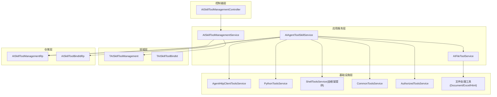
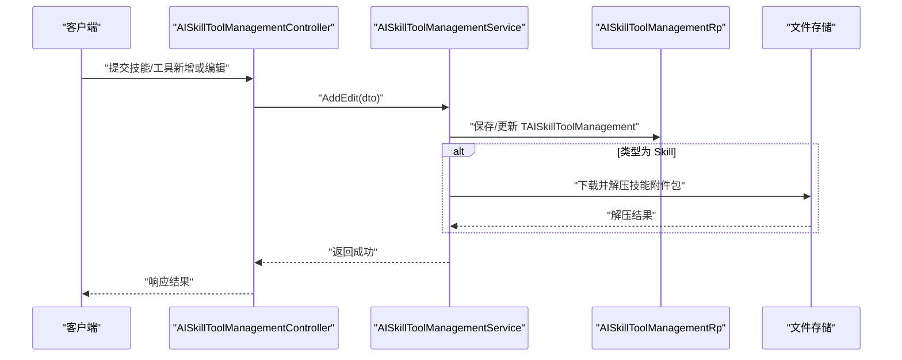
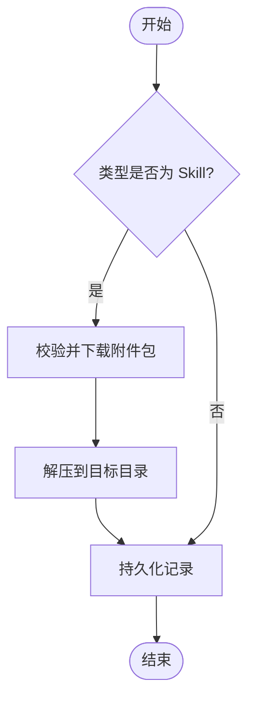
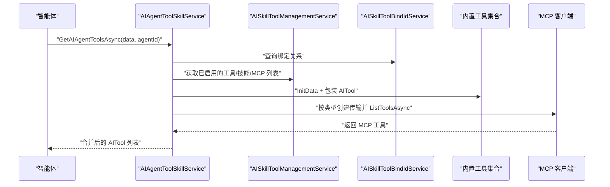
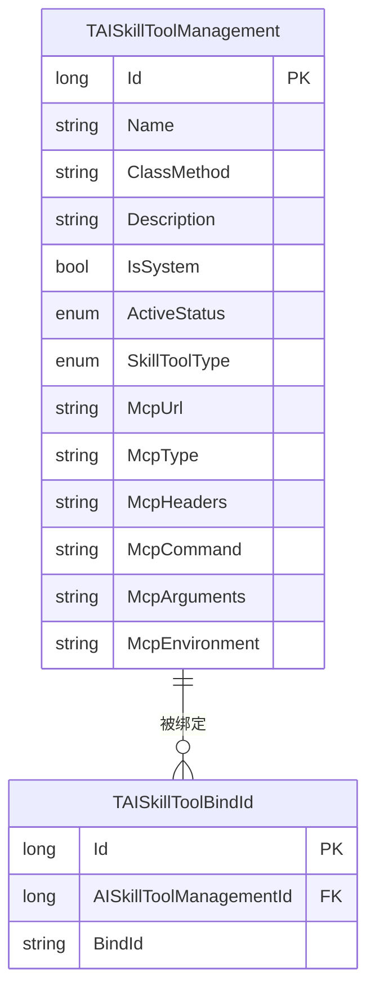
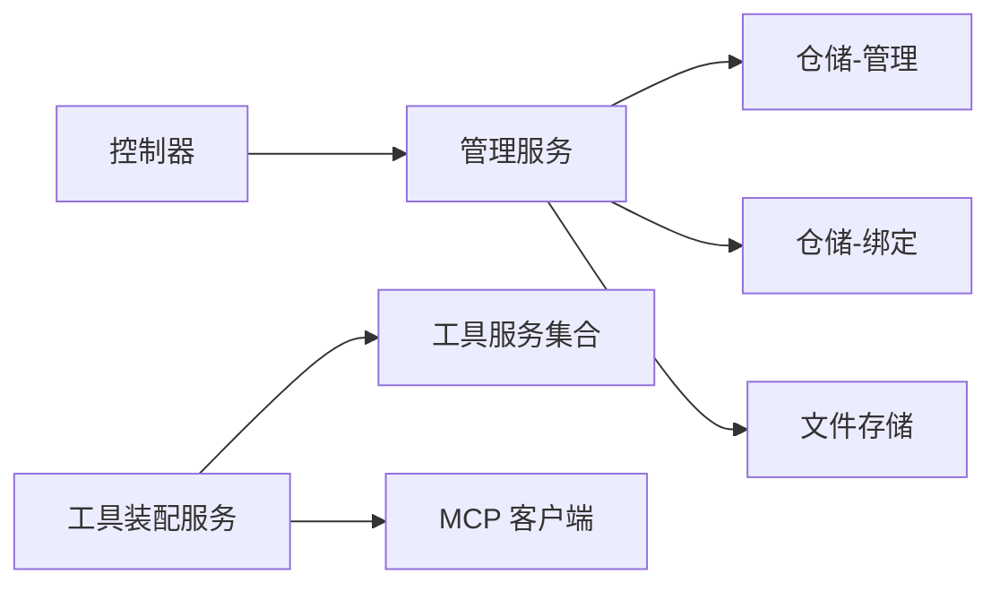

# 技能工具管理

<cite>
**本文引用的文件**
- [AISkillToolManagementService.cs](file://Kevin/Application/Services/AI/AISkillToolManagementService.cs)
- [AIAgentToolSkillService.cs](file://Kevin/Application/Services/AI/AIAgentToolSkillService.cs)
- [TAISkillToolManagement.cs](file://Kevin/Domain/Entities/AI/TAISkillToolManagement.cs)
- [TAISkillToolBindId.cs](file://Kevin/Domain/Entities/AI/TAISkillToolBindId.cs)
- [IAIAgentToolSkillService.cs](file://Kevin/kevin.Module/kevin.AI.AgentFramework/Interfaces/IAIAgentToolSkillService.cs)
- [CommonToolsService.cs](file://Kevin/kevin.Module/kevin.AI.AgentFramework/Tools/CommonToolsService.cs)
- [PythonToolsService.cs](file://Kevin/kevin.Module/kevin.AI.AgentFramework/Tools/PythonToolsService.cs)
- [AgentHttpClientToolsService.cs](file://Kevin/kevin.Module/kevin.AI.AgentFramework/Tools/AgentHttpClientToolsService.cs)
- [AuthorizedToolsService.cs](file://Kevin/kevin.Module/kevin.AI.AgentFramework/Tools/AuthorizedToolsService.cs)
- [AIFileToolService.cs](file://Kevin/Application/Services/AI/AIFileToolService.cs)
- [AISkillToolManagementController.cs](file://Kevin/ Kevin.Web.Basics/Controllers/AI/AISkillToolManagementController.cs)
- [TAISkillToolManagementConfig.cs](file://Kevin/ Kevin.EntityFrameworkCore/Configuration/TAISkillToolManagementConfig.cs)
- [AISkillToolManagementRp.cs](file://Kevin/RepositorieRps/Repositories/AI/AISkillToolManagementRp.cs)
- [AISkillToolBindIdRp.cs](file://Kevin/RepositorieRps/Repositories/AI/AISkillToolBindIdRp.cs)
- [DocumentProcessor.cs](file://Kevin/kevin.Module/Kevin.Common/Helper/FileHandleTools/DocumentProcessor.cs)
- [ExcelReader.cs](file://Kevin/kevin.Module/Kevin.Common/Helper/FileHandleTools/ExcelReader.cs)
- [HtmlReader.cs](file://Kevin/kevin.Module/Kevin.Common/Helper/FileHandleTools/HtmlReader.cs)
</cite>

## 目录
1. [简介](#简介)
2. [项目结构](#项目结构)
3. [核心组件](#核心组件)
4. [架构总览](#架构总览)
5. [详细组件分析](#详细组件分析)
6. [依赖关系分析](#依赖关系分析)
7. [性能考虑](#性能考虑)
8. [故障排查指南](#故障排查指南)
9. [结论](#结论)
10. [附录](#附录)

## 简介
本文件面向“技能工具管理系统”，聚焦于技能与工具的注册、编排、执行与治理。系统提供：
- 工具注册机制：通过配置实体集中管理工具元数据，支持本地方法、MCP（HTTP/SSE/STDIO）等多种接入方式。
- 接口定义与执行框架：统一以 AITool 暴露给智能体调用，服务层负责按绑定关系装配可用工具集。
- 内置工具能力：HTTP 请求、文件操作、数据处理、Python 脚本执行、Shell 命令执行、定时任务、消息通知等。
- 自定义工具规范：基于接口实现、参数校验、错误处理与安全护栏。
- 组合使用与版本控制：通过绑定表将工具与智能体/用户/角色关联；支持启用状态与软删除。
- 权限控制与安全沙箱：内置工具具备危险命令拦截、输出截断、超时控制；可结合授权码获取能力进行鉴权。
- 最佳实践：围绕常见业务场景给出开发示例与注意事项。

## 项目结构
技能工具管理涉及领域模型、应用服务、控制器、仓储与基础设施模块，整体分层清晰：
- 领域层：定义技能工具管理与绑定实体，承载元数据与关联关系。
- 应用层：提供服务编排、工具装配、文件处理、日志与消息等能力。
- 控制器层：对外暴露技能工具管理的 CRUD 与查询接口。
- 仓储层：对领域实体的持久化访问。
- 基础设施层：Agent 框架工具集（HTTP、Python、Shell、通用工具、授权工具）、文件处理工具等。

图表来源
- [AISkillToolManagementController.cs](file://Kevin/ Kevin.Web.Basics/Controllers/AI/AISkillToolManagementController.cs)
- [AISkillToolManagementService.cs](file://Kevin/Application/Services/AI/AISkillToolManagementService.cs)
- [AIAgentToolSkillService.cs](file://Kevin/Application/Services/AI/AIAgentToolSkillService.cs)
- [TAISkillToolManagement.cs](file://Kevin/Domain/Entities/AI/TAISkillToolManagement.cs)
- [TAISkillToolBindId.cs](file://Kevin/Domain/Entities/AI/TAISkillToolBindId.cs)
- [AISkillToolManagementRp.cs](file://Kevin/RepositorieRps/Repositories/AI/AISkillToolManagementRp.cs)
- [AISkillToolBindIdRp.cs](file://Kevin/RepositorieRps/Repositories/AI/AISkillToolBindIdRp.cs)
- [AgentHttpClientToolsService.cs](file://Kevin/kevin.Module/kevin.AI.AgentFramework/Tools/AgentHttpClientToolsService.cs)
- [PythonToolsService.cs](file://Kevin/kevin.Module/kevin.AI.AgentFramework/Tools/PythonToolsService.cs)
- [CommonToolsService.cs](file://Kevin/kevin.Module/kevin.AI.AgentFramework/Tools/CommonToolsService.cs)
- [AuthorizedToolsService.cs](file://Kevin/kevin.Module/kevin.AI.AgentFramework/Tools/AuthorizedToolsService.cs)
- [AIFileToolService.cs](file://Kevin/Application/Services/AI/AIFileToolService.cs)
- [DocumentProcessor.cs](file://Kevin/kevin.Module/Kevin.Common/Helper/FileHandleTools/DocumentProcessor.cs)
- [ExcelReader.cs](file://Kevin/kevin.Module/Kevin.Common/Helper/FileHandleTools/ExcelReader.cs)
- [HtmlReader.cs](file://Kevin/kevin.Module/Kevin.Common/Helper/FileHandleTools/HtmlReader.cs)

章节来源
- [AISkillToolManagementService.cs:29-250](file://Kevin/Application/Services/AI/AISkillToolManagementService.cs#L29-L250)
- [AIAgentToolSkillService.cs:59-378](file://Kevin/Application/Services/AI/AIAgentToolSkillService.cs#L59-L378)
- [TAISkillToolManagement.cs:10-91](file://Kevin/Domain/Entities/AI/TAISkillToolManagement.cs#L10-L91)
- [TAISkillToolBindId.cs:6-23](file://Kevin/Domain/Entities/AI/TAISkillToolBindId.cs#L6-L23)

## 核心组件
- 技能工具管理服务：负责技能/工具的增删改查、分页检索、启用状态控制、附件包解压与清理、系统内置保护等。
- 智能体工具装配服务：根据智能体绑定关系，动态组装 AITool 集合，包含内置工具与 MCP 工具。
- 领域实体：技能工具主数据与绑定关系，支撑多租户、软删除、创建/更新人审计。
- 仓储：对主数据与绑定的持久化访问。
- 工具能力：HTTP、Python、Shell、通用工具、授权工具、文件处理等。

章节来源
- [AISkillToolManagementService.cs:16-250](file://Kevin/Application/Services/AI/AISkillToolManagementService.cs#L16-L250)
- [AIAgentToolSkillService.cs:16-378](file://Kevin/Application/Services/AI/AIAgentToolSkillService.cs#L16-L378)
- [TAISkillToolManagement.cs:10-91](file://Kevin/Domain/Entities/AI/TAISkillToolManagement.cs#L10-L91)
- [TAISkillToolBindId.cs:6-23](file://Kevin/Domain/Entities/AI/TAISkillToolBindId.cs#L6-L23)

## 架构总览
系统采用分层+插件式工具装配的架构：
- 控制器接收管理请求，交由应用服务处理。
- 应用服务聚合仓储与外部工具能力，完成业务编排。
- 领域实体承载数据模型，仓储负责持久化。
- Agent 框架通过 AITool 抽象统一暴露工具，支持本地方法与远程 MCP 工具。

图表来源
- [AISkillToolManagementController.cs](file://Kevin/ Kevin.Web.Basics/Controllers/AI/AISkillToolManagementController.cs)
- [AISkillToolManagementService.cs:76-173](file://Kevin/Application/Services/AI/AISkillToolManagementService.cs#L76-L173)
- [AISkillToolManagementRp.cs](file://Kevin/RepositorieRps/Repositories/AI/AISkillToolManagementRp.cs)

章节来源
- [AISkillToolManagementService.cs:76-173](file://Kevin/Application/Services/AI/AISkillToolManagementService.cs#L76-L173)

## 详细组件分析

### 技能工具管理（CRUD 与生命周期）
- 功能要点
  - 分页查询：支持关键字搜索、类型过滤、数据权限开关。
  - 新增/编辑：名称唯一性校验、系统内置保护、Skill 附件包解压到指定目录。
  - 删除：软删除并清理已解压的技能目录。
  - 列表接口：区分 Skill/Tool/Mcp 三类，并提供不受数据权限控制的查询用于管理员场景。
- 关键流程
  - 新增/编辑时，若为 Skill 类型，需上传 zip 附件包并解压至 Skills/{Name}/{Name} 目录。
  - 删除时检查是否系统内置，非系统内置才允许删除，并清理对应目录。

图表来源
- [AISkillToolManagementService.cs:76-173](file://Kevin/Application/Services/AI/AISkillToolManagementService.cs#L76-L173)

章节来源
- [AISkillToolManagementService.cs:29-250](file://Kevin/Application/Services/AI/AISkillToolManagementService.cs#L29-L250)

### 智能体工具装配（内置工具与 MCP）
- 功能要点
  - 内置工具：JSON 日志、当前时间、当前用户信息、文件保存、钉钉消息、HTTP 请求、Shell 执行、Python 执行、平台信息、桌面路径、定时任务、授权码获取等。
  - MCP 工具：支持 HTTP(S)/SSE/STDIO 三种传输模式，读取配置后动态连接并拉取工具清单。
  - 绑定关系：依据智能体 ID 查询绑定，仅装配已绑定的工具。
- 执行流程
  - 初始化各工具上下文数据。
  - 根据 ClassMethod 字符串匹配，将具体方法包装为 AITool。
  - 遍历 MCP 配置，建立传输并获取工具集合。

图表来源
- [AIAgentToolSkillService.cs:59-378](file://Kevin/Application/Services/AI/AIAgentToolSkillService.cs#L59-L378)
- [IAIAgentToolSkillService.cs:5-64](file://Kevin/kevin.Module/kevin.AI.AgentFramework/Interfaces/IAIAgentToolSkillService.cs#L5-L64)

章节来源
- [AIAgentToolSkillService.cs:59-378](file://Kevin/Application/Services/AI/AIAgentToolSkillService.cs#L59-L378)
- [IAIAgentToolSkillService.cs:5-64](file://Kevin/kevin.Module/kevin.AI.AgentFramework/Interfaces/IAIAgentToolSkillService.cs#L5-L64)

### 领域模型与数据库映射
- 实体说明
  - TAISkillToolManagement：技能/工具主数据，包含名称、方法标识、描述、是否系统内置、启用状态、类型、MCP 相关配置等。
  - TAISkillToolBindId：绑定关系，将技能/工具与智能体/用户/角色关联。
- 映射配置
  - 通过 EF Core 配置类完成实体映射。

图表来源
- [TAISkillToolManagement.cs:10-91](file://Kevin/Domain/Entities/AI/TAISkillToolManagement.cs#L10-L91)
- [TAISkillToolBindId.cs:6-23](file://Kevin/Domain/Entities/AI/TAISkillToolBindId.cs#L6-L23)
- [TAISkillToolManagementConfig.cs](file://Kevin/ Kevin.EntityFrameworkCore/Configuration/TAISkillToolManagementConfig.cs)

章节来源
- [TAISkillToolManagement.cs:10-91](file://Kevin/Domain/Entities/AI/TAISkillToolManagement.cs#L10-L91)
- [TAISkillToolBindId.cs:6-23](file://Kevin/Domain/Entities/AI/TAISkillToolBindId.cs#L6-L23)
- [TAISkillToolManagementConfig.cs](file://Kevin/ Kevin.EntityFrameworkCore/Configuration/TAISkillToolManagementConfig.cs)

### 内置工具详解
- HTTP 请求工具
  - 提供 GET/POST/PUT/DELETE 等方法，适合调用外部 API。
  - 建议配合授权码获取工具，先取得 Token 再发起请求。
- Python 脚本执行
  - 在安全沙箱中执行 Python 代码，注意资源限制与异常捕获。
- Shell 命令执行
  - 支持跨平台 Shell，内置危险命令阻止、输出截断与超时控制。
- 通用工具
  - 获取当前时间、运行平台、桌面路径、写入桌面文件等。
- 授权工具
  - 获取授权登录代码，便于后续带鉴权的 HTTP 调用。
- 文件处理工具
  - 文档解析、Excel 读取、HTML 解析等，服务于数据处理场景。

章节来源
- [AIAgentToolSkillService.cs:70-248](file://Kevin/Application/Services/AI/AIAgentToolSkillService.cs#L70-L248)
- [AgentHttpClientToolsService.cs](file://Kevin/kevin.Module/kevin.AI.AgentFramework/Tools/AgentHttpClientToolsService.cs)
- [PythonToolsService.cs](file://Kevin/kevin.Module/kevin.AI.AgentFramework/Tools/PythonToolsService.cs)
- [CommonToolsService.cs](file://Kevin/kevin.Module/kevin.AI.AgentFramework/Tools/CommonToolsService.cs)
- [AuthorizedToolsService.cs](file://Kevin/kevin.Module/kevin.AI.AgentFramework/Tools/AuthorizedToolsService.cs)
- [DocumentProcessor.cs](file://Kevin/kevin.Module/Kevin.Common/Helper/FileHandleTools/DocumentProcessor.cs)
- [ExcelReader.cs](file://Kevin/kevin.Module/Kevin.Common/Helper/FileHandleTools/ExcelReader.cs)
- [HtmlReader.cs](file://Kevin/kevin.Module/Kevin.Common/Helper/FileHandleTools/HtmlReader.cs)

### 自定义工具开发规范
- 接口实现
  - 遵循现有工具服务接口约定，确保方法签名与参数语义清晰。
  - 通过 AIFunctionFactory 包装为 AITool，提供名称与描述，便于智能体识别。
- 参数验证
  - 在服务层进行入参校验，失败时抛出友好异常，避免脏数据进入执行流。
- 错误处理
  - 统一捕获异常并转换为结构化错误信息，便于前端展示与日志追踪。
- 安全与沙箱
  - 对可能影响系统的操作（如 Shell、文件系统）设置白名单与限制。
  - 对网络请求增加超时与重试策略，避免雪崩。
- 版本控制
  - 通过启用状态与软删除控制工具生命周期；升级时保留历史版本以便回滚。

章节来源
- [AIAgentToolSkillService.cs:59-248](file://Kevin/Application/Services/AI/AIAgentToolSkillService.cs#L59-L248)
- [AISkillToolManagementService.cs:76-173](file://Kevin/Application/Services/AI/AISkillToolManagementService.cs#L76-L173)

### 组合使用、依赖管理与版本控制
- 组合使用
  - 通过绑定表将多个工具组合到同一智能体，按需装配。
  - 工具之间可通过共享上下文数据进行协作（例如先获取授权码，再进行 HTTP 调用）。
- 依赖管理
  - 工具服务通过依赖注入装配，便于替换与测试。
  - MCP 工具按配置动态加载，无需重启即可扩展。
- 版本控制
  - 利用 ActiveStatus 控制启用/停用；结合软删除实现灰度发布与回滚。
  - Skill 附件包按名称隔离目录，便于多版本并存与切换。

章节来源
- [AIAgentToolSkillService.cs:329-378](file://Kevin/Application/Services/AI/AIAgentToolSkillService.cs#L329-L378)
- [AISkillToolManagementService.cs:208-250](file://Kevin/Application/Services/AI/AISkillToolManagementService.cs#L208-L250)

### 权限控制、安全沙箱与执行超时
- 权限控制
  - 数据权限：部分查询受数据权限控制，另有不受权限控制的查询供管理员使用。
  - 工具级权限：通过绑定关系控制智能体/用户可用的工具集合。
- 安全沙箱
  - Shell 命令执行包含危险命令阻止、输出截断与超时控制。
  - Python 执行建议在受限环境中运行，限制系统调用与网络访问。
- 执行超时
  - HTTP 请求应配置合理超时与重试；长耗时任务建议异步化。

章节来源
- [AIAgentToolSkillService.cs:165-183](file://Kevin/Application/Services/AI/AIAgentToolSkillService.cs#L165-L183)
- [AISkillToolManagementService.cs:112-140](file://Kevin/Application/Services/AI/AISkillToolManagementService.cs#L112-L140)

## 依赖关系分析
- 组件耦合
  - 控制器依赖应用服务；应用服务依赖仓储与工具服务；工具服务相互独立，通过接口解耦。
- 直接依赖
  - AIAgentToolSkillService 依赖多种工具服务与 AI 文件服务。
  - AISkillToolManagementService 依赖仓储与文件存储。
- 间接依赖
  - 通过 EF Core 配置与仓储访问数据库。
- 外部集成点
  - MCP 客户端通过 HTTP/SSE/STDIO 与外部服务交互。
  - 文件存储用于 Skill 附件包的下载与解压。

图表来源
- [AISkillToolManagementService.cs](file://Kevin/Application/Services/AI/AISkillToolManagementService.cs)
- [AIAgentToolSkillService.cs](file://Kevin/Application/Services/AI/AIAgentToolSkillService.cs)
- [AISkillToolManagementRp.cs](file://Kevin/RepositorieRps/Repositories/AI/AISkillToolManagementRp.cs)
- [AISkillToolBindIdRp.cs](file://Kevin/RepositorieRps/Repositories/AI/AISkillToolBindIdRp.cs)

章节来源
- [AISkillToolManagementService.cs:16-250](file://Kevin/Application/Services/AI/AISkillToolManagementService.cs#L16-L250)
- [AIAgentToolSkillService.cs:16-378](file://Kevin/Application/Services/AI/AIAgentToolSkillService.cs#L16-L378)

## 性能考虑
- 查询优化
  - 分页查询时使用 Skip/Take，减少内存占用。
  - 条件过滤尽量下推到数据库层，避免全表扫描。
- I/O 优化
  - 大文件解压建议使用流式处理，避免一次性加载到内存。
  - 文件存储下载与解压过程可异步化，提升吞吐。
- 并发与超时
  - 外部 HTTP 调用设置超时与重试，避免阻塞线程池。
  - Shell/Python 执行设置超时与资源限制，防止长时间占用。

[本节为通用指导，不直接分析具体文件]

## 故障排查指南
- 常见问题
  - 名称重复：新增/编辑时校验名称唯一性，出现重复会抛出友好异常。
  - 系统内置保护：系统内置工具不允许修改或删除，需调整配置而非直接操作。
  - Skill 附件缺失：Skill 类型必须上传 zip 附件包，否则提示上传。
  - MCP 连接失败：检查 McpType、McpUrl、McpHeaders、McpCommand 等配置是否正确。
- 定位步骤
  - 查看服务层抛出的异常信息与日志。
  - 检查绑定关系是否正确，确认工具处于启用状态。
  - 对于 MCP，验证网络连通性与认证头配置。

章节来源
- [AISkillToolManagementService.cs:88-140](file://Kevin/Application/Services/AI/AISkillToolManagementService.cs#L88-L140)
- [AISkillToolManagementService.cs:142-173](file://Kevin/Application/Services/AI/AISkillToolManagementService.cs#L142-L173)
- [AISkillToolManagementService.cs:178-206](file://Kevin/Application/Services/AI/AISkillToolManagementService.cs#L178-L206)
- [AIAgentToolSkillService.cs:252-327](file://Kevin/Application/Services/AI/AIAgentToolSkillService.cs#L252-L327)

## 结论
技能工具管理系统通过统一的实体模型与服务编排，实现了工具的可插拔、可组合与可治理。内置工具覆盖常见业务场景，MCP 机制支持外部能力快速接入。通过绑定关系与权限控制，系统可在多租户环境下灵活分配工具能力。建议在实际使用中遵循开发规范与安全策略，结合监控与日志完善问题定位与性能调优。

[本节为总结性内容，不直接分析具体文件]

## 附录
- 常见业务场景示例
  - 数据采集：使用 HTTP 工具抓取数据，Python 工具进行清洗，文件工具保存到远程存储。
  - 报表生成：读取 Excel/HTML，处理后输出到桌面或远程文件。
  - 自动化运维：通过 Shell 执行系统命令，结合定时任务周期性触发。
- 最佳实践
  - 工具命名与描述清晰，便于智能体理解与选择。
  - 入参校验前置，错误信息明确。
  - 敏感操作加入审批与审计，关键路径记录日志。
  - 外部依赖设置超时与重试，避免级联故障。

[本节为补充说明，不直接分析具体文件]