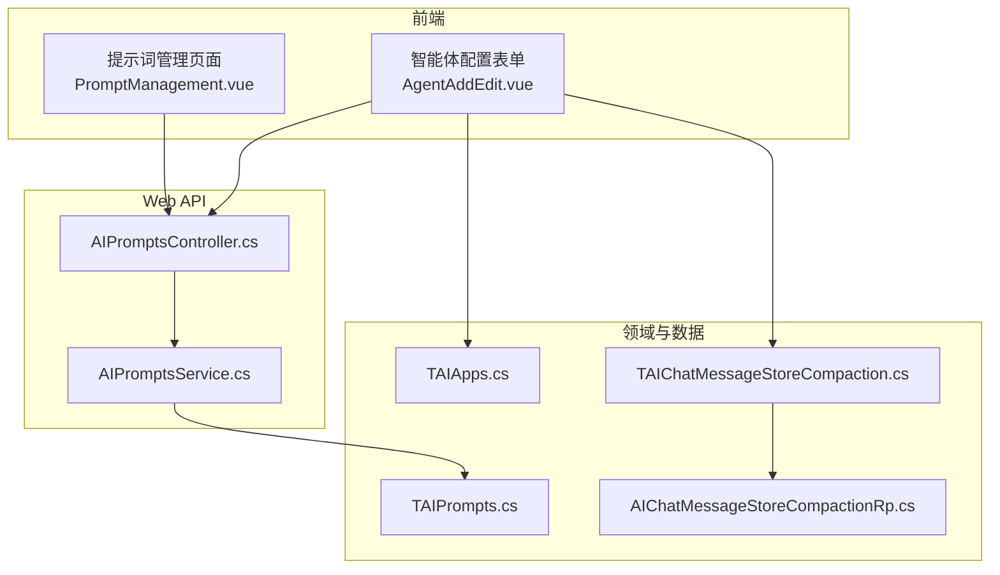
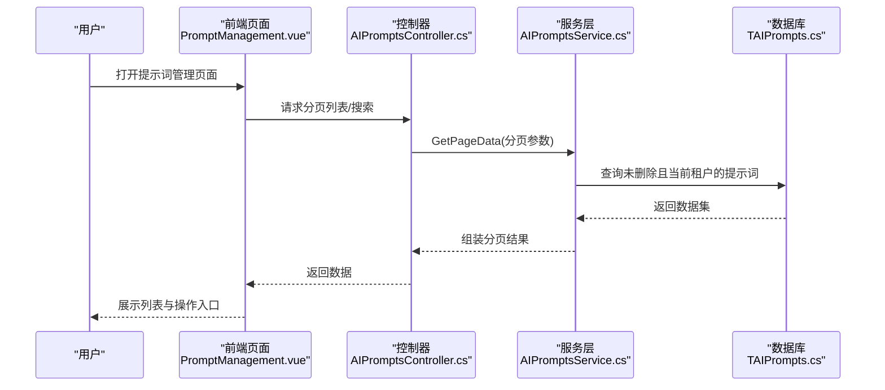
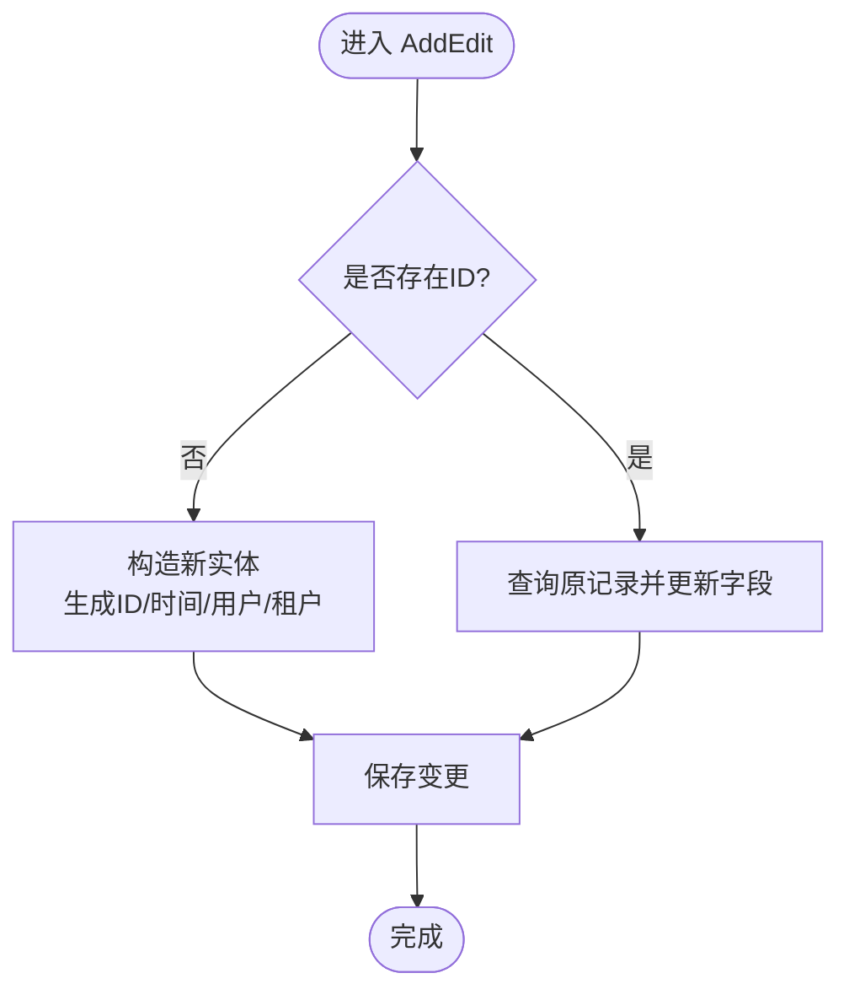
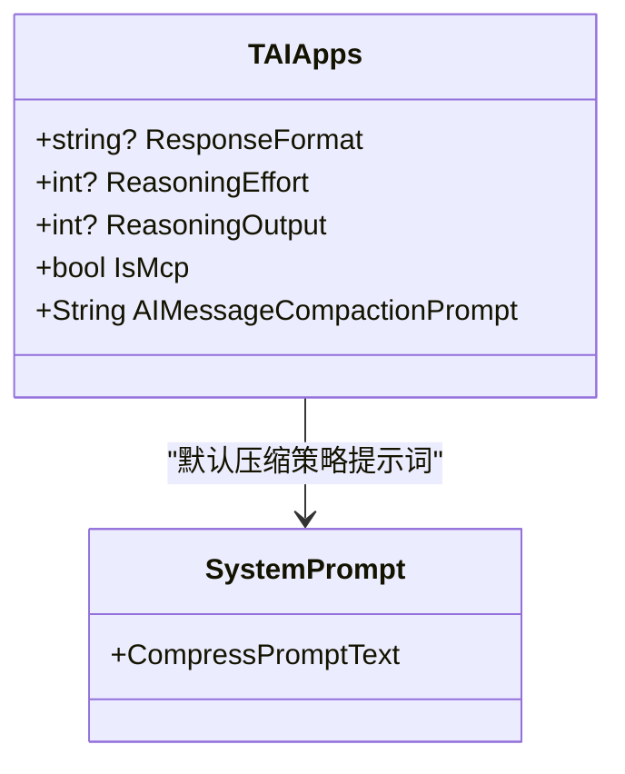
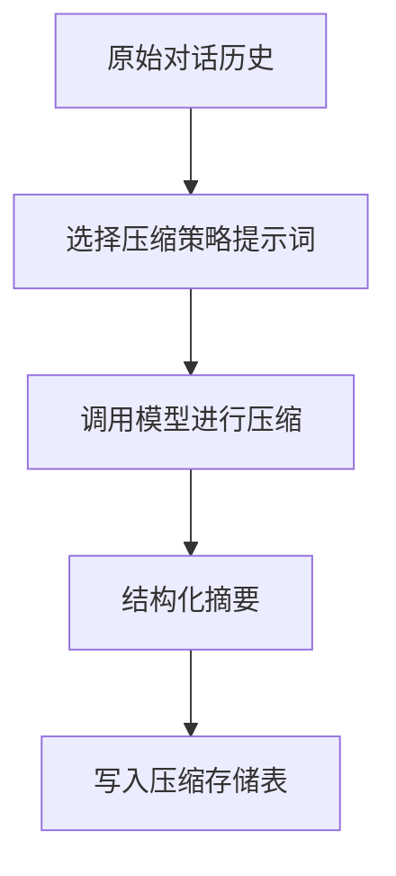
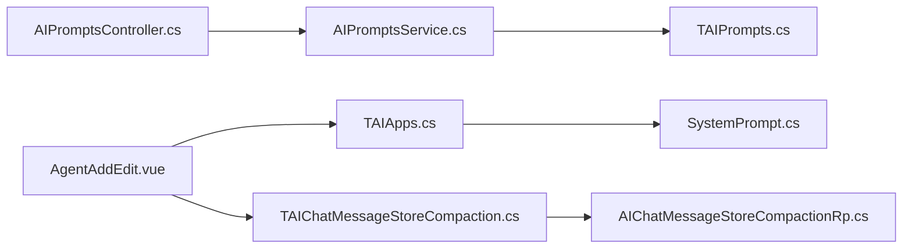

# 提示词工程

<cite>
**本文引用的文件**
- [AIPromptsController.cs](file://Kevin/ Kevin.Web.Basics/Controllers/AI/AIPromptsController.cs)
- [AIPromptsService.cs](file://Kevin/Application/Services/AI/AIPromptsService.cs)
- [TAIPrompts.cs](file://Kevin/Domain/Entities/AI/TAIPrompts.cs)
- [PromptManagement.vue](file://vue/kevin.web.vue/src/pages/ai/PromptManagement.vue)
- [AgentAddEdit.vue](file://vue/kevin.web.vue/src/components/ai/AgentAddEdit.vue)
- [TAIApps.cs](file://Kevin/Domain/Entities/AI/TAIApps.cs)
- [SystemPrompt.cs](file://Kevin/kevin.Module/kevin.AI.AgentFramework/Const/SystemPrompt.cs)
- [TAIChatMessageStoreCompaction.cs](file://Kevin/Domain/Entities/AI/TAIChatMessageStoreCompaction.cs)
- [AIChatMessageStoreCompactionRp.cs](file://Kevin/RepositorieRps/Repositories/AI/AIChatMessageStoreCompactionRp.cs)
- [PublicPortAuthorizeFilters.cs](file://Kevin/ Kevin.Web.Basics/Filters/PublicPortAuthorizeFilters.cs)
</cite>

## 目录
1. [简介](#简介)
2. [项目结构](#项目结构)
3. [核心组件](#核心组件)
4. [架构总览](#架构总览)
5. [详细组件分析](#详细组件分析)
6. [依赖关系分析](#依赖关系分析)
7. [性能考量](#性能考量)
8. [故障排查指南](#故障排查指南)
9. [结论](#结论)
10. [附录](#附录)

## 简介
本文件聚焦于“提示词工程系统”的专门文档，围绕提示词模板管理、版本与变量替换、条件渲染、系统提示词架构（角色定义、约束设置、输出格式控制）、优化技巧（Few-shot、思维链、结构化输出）、测试工具（效果评估、A/B测试、性能分析）、安全过滤（敏感词检测、合规性检查）以及不同业务场景的设计模式与最佳实践进行系统化说明。结合代码库中的提示词管理模块、智能体配置与消息压缩能力，提供可落地的工程化方案。

## 项目结构
提示词工程相关的前后端结构与关键职责如下：
- 前端页面 PromptManagement.vue：提供提示词的增删改查、分页与搜索，支持富文本编辑与校验。
- 控制器 AIPromptsController.cs：暴露 REST API，承载权限、日志与缓存等横切关注点。
- 服务层 AIPromptsService.cs：实现提示词的分页查询、详情获取、新增/编辑、删除等业务逻辑。
- 领域实体 TAIPrompts.cs：持久化提示词的基本信息（名称、内容、描述）。
- 智能体配置 TAIApps.cs：集中配置模型返回格式、思考能力、自动压缩策略提示词等。
- 默认系统提示 SystemPrompt.cs：提供内置的系统级提示词常量（如压缩策略）。
- 消息压缩存储 TAIChatMessageStoreCompaction.cs：用于保存对话压缩后的内容与结果。
- 仓储 AIChatMessageStoreCompactionRp.cs：对压缩存储的访问封装。
- 安全过滤器 PublicPortAuthorizeFilters.cs：对外接口的密钥校验，保障调用安全。

**图表来源**
- [AIPromptsController.cs:1-82](file://Kevin/ Kevin.Web.Basics/Controllers/AI/AIPromptsController.cs#L1-L82)
- [AIPromptsService.cs:1-155](file://Kevin/Application/Services/AI/AIPromptsService.cs#L1-L155)
- [TAIPrompts.cs:1-32](file://Kevin/Domain/Entities/AI/TAIPrompts.cs#L1-L32)
- [TAIApps.cs:198-229](file://Kevin/Domain/Entities/AI/TAIApps.cs#L198-L229)
- [TAIChatMessageStoreCompaction.cs:1-33](file://Kevin/Domain/Entities/AI/TAIChatMessageStoreCompaction.cs#L1-L33)
- [AIChatMessageStoreCompactionRp.cs:1-15](file://Kevin/RepositorieRps/Repositories/AI/AIChatMessageStoreCompactionRp.cs#L1-L15)

**章节来源**
- [PromptManagement.vue:1-325](file://vue/kevin.web.vue/src/pages/ai/PromptManagement.vue#L1-L325)
- [AIPromptsController.cs:1-82](file://Kevin/ Kevin.Web.Basics/Controllers/AI/AIPromptsController.cs#L1-L82)
- [AIPromptsService.cs:1-155](file://Kevin/Application/Services/AI/AIPromptsService.cs#L1-L155)
- [TAIPrompts.cs:1-32](file://Kevin/Domain/Entities/AI/TAIPrompts.cs#L1-L32)
- [TAIApps.cs:198-229](file://Kevin/Domain/Entities/AI/TAIApps.cs#L198-L229)
- [TAIChatMessageStoreCompaction.cs:1-33](file://Kevin/Domain/Entities/AI/TAIChatMessageStoreCompaction.cs#L1-L33)
- [AIChatMessageStoreCompactionRp.cs:1-15](file://Kevin/RepositorieRps/Repositories/AI/AIChatMessageStoreCompactionRp.cs#L1-L15)

## 核心组件
- 提示词模板管理
  - 通过控制器与服务层提供分页查询、详情获取、新增/编辑、删除能力；支持按租户隔离与软删除。
  - 前端提供可视化编辑界面，包含名称、提示词正文、描述字段及长度限制与必填校验。
- 智能体配置与系统提示
  - 智能体配置项包括模型返回格式、思考能力、思考输出开关、是否启用 MCP 工具等。
  - 系统提示词常量集中管理，例如自动压缩策略提示词默认值。
- 对话压缩与存储
  - 针对长对话历史，提供压缩策略提示词与压缩后内容的持久化表，便于后续检索与复用。

**章节来源**
- [AIPromptsController.cs:30-79](file://Kevin/ Kevin.Web.Basics/Controllers/AI/AIPromptsController.cs#L30-L79)
- [AIPromptsService.cs:15-151](file://Kevin/Application/Services/AI/AIPromptsService.cs#L15-L151)
- [TAIPrompts.cs:10-29](file://Kevin/Domain/Entities/AI/TAIPrompts.cs#L10-L29)
- [TAIApps.cs:198-229](file://Kevin/Domain/Entities/AI/TAIApps.cs#L198-L229)
- [TAIChatMessageStoreCompaction.cs:11-31](file://Kevin/Domain/Entities/AI/TAIChatMessageStoreCompaction.cs#L11-L31)

## 架构总览
提示词工程系统的端到端流程涵盖前端交互、API 网关、服务编排、领域建模与数据存储，同时集成安全与缓存等横切能力。

**图表来源**
- [AIPromptsController.cs:30-52](file://Kevin/ Kevin.Web.Basics/Controllers/AI/AIPromptsController.cs#L30-L52)
- [AIPromptsService.cs:20-38](file://Kevin/Application/Services/AI/AIPromptsService.cs#L20-L38)
- [TAIPrompts.cs:10-29](file://Kevin/Domain/Entities/AI/TAIPrompts.cs#L10-L29)

## 详细组件分析

### 提示词模板管理（CRUD 与版本控制）
- 功能要点
  - 分页查询与搜索：支持关键字过滤、分页参数、总数统计。
  - 详情获取：支持带权限与不带权限两种读取路径。
  - 新增/编辑：根据是否存在 ID 判断新增或更新，统一写入创建/更新时间与用户信息。
  - 删除：软删除并记录删除时间。
- 版本控制建议
  - 在现有实体基础上扩展版本字段（如 Version），每次更新递增版本号。
  - 引入“生效版本”机制，智能体配置引用版本化的提示词 ID。
  - 变更审计：保留变更记录（创建人、更新人、时间戳），已在基础基类中体现。
- 变量替换与条件渲染
  - 变量替换：在服务层对提示词内容进行占位符解析（如 {user}、{context}），结合上下文注入。
  - 条件渲染：基于智能体配置（如 ResponseFormat、ReasoningEffort）动态拼接提示词片段。

**图表来源**
- [AIPromptsService.cs:81-129](file://Kevin/Application/Services/AI/AIPromptsService.cs#L81-L129)

**章节来源**
- [AIPromptsService.cs:15-151](file://Kevin/Application/Services/AI/AIPromptsService.cs#L15-L151)
- [AIPromptsController.cs:30-79](file://Kevin/ Kevin.Web.Basics/Controllers/AI/AIPromptsController.cs#L30-L79)
- [TAIPrompts.cs:10-29](file://Kevin/Domain/Entities/AI/TAIPrompts.cs#L10-L29)

### 系统提示词架构（角色、约束、输出格式）
- 角色定义
  - 通过智能体配置项与系统提示词常量组合，明确模型的角色定位与任务边界。
- 约束设置
  - 使用 ResponseFormat 限定输出为 JSON 或 Text，确保下游解析稳定。
  - ReasoningEffort/ReasoningOutput 控制模型的思考深度与输出粒度。
- 输出格式控制
  - 在提示词中强制要求结构化字段与顺序，配合示例输出提升一致性。
  - 自动压缩策略提示词用于将长对话精炼为固定字段摘要，便于上下文管理。

**图表来源**
- [TAIApps.cs:198-229](file://Kevin/Domain/Entities/AI/TAIApps.cs#L198-L229)
- [SystemPrompt.cs](file://Kevin/kevin.Module/kevin.AI.AgentFramework/Const/SystemPrompt.cs)

**章节来源**
- [TAIApps.cs:198-229](file://Kevin/Domain/Entities/AI/TAIApps.cs#L198-L229)
- [SystemPrompt.cs](file://Kevin/kevin.Module/kevin.AI.AgentFramework/Const/SystemPrompt.cs)

### 对话压缩与提示词优化（Few-shot、思维链、结构化输出）
- Few-shot 学习
  - 在提示词中嵌入少量高质量示例，引导模型遵循期望的输出格式与风格。
- 思维链提示
  - 通过 ReasoningEffort/ReasoningOutput 开启或调整模型的推理过程输出，增强复杂任务的准确性。
- 结构化输出
  - 使用 ResponseFormat 与明确的字段定义，保证结果可被程序化消费。
- 自动压缩
  - 利用压缩策略提示词将多轮对话提炼为固定字段摘要，减少上下文长度，降低 Token 成本。

**图表来源**
- [TAIChatMessageStoreCompaction.cs:11-31](file://Kevin/Domain/Entities/AI/TAIChatMessageStoreCompaction.cs#L11-L31)
- [AIChatMessageStoreCompactionRp.cs:1-15](file://Kevin/RepositorieRps/Repositories/AI/AIChatMessageStoreCompactionRp.cs#L1-L15)

**章节来源**
- [TAIApps.cs:198-229](file://Kevin/Domain/Entities/AI/TAIApps.cs#L198-L229)
- [TAIChatMessageStoreCompaction.cs:11-31](file://Kevin/Domain/Entities/AI/TAIChatMessageStoreCompaction.cs#L11-L31)
- [AIChatMessageStoreCompactionRp.cs:1-15](file://Kevin/RepositorieRps/Repositories/AI/AIChatMessageStoreCompactionRp.cs#L1-L15)

### 提示词测试工具（效果评估、A/B测试、性能分析）
- 效果评估
  - 基于结构化输出进行自动化评测（字段完整性、格式正确性、语义相关性）。
  - 人工抽检与评分卡结合，形成多维度的质量指标。
- A/B 测试
  - 同一任务并行运行两套提示词，对比成功率、响应时延、Token 消耗等指标。
  - 通过智能体配置切换不同提示词版本，灰度发布与回滚。
- 性能分析
  - 监控输入/输出 Token 数、推理标记数量、缓存命中情况，识别瓶颈。
  - 结合压缩策略降低上下文长度，提升吞吐与稳定性。

[本节为概念性说明，不直接分析具体文件]

### 安全过滤（敏感词检测、合规性检查）
- 对外接口安全
  - 通过公共端口授权过滤器进行 appId/appSecret 校验，拒绝非法请求。
- 提示词安全
  - 建议在服务层增加敏感词检测与合规性检查，拦截不当输入/输出。
  - 结合租户隔离与权限控制，确保提示词仅对授权范围可见与使用。

**章节来源**
- [PublicPortAuthorizeFilters.cs:10-41](file://Kevin/ Kevin.Web.Basics/Filters/PublicPortAuthorizeFilters.cs#L10-L41)

## 依赖关系分析
- 控制器依赖服务层，服务层依赖仓储与领域实体。
- 智能体配置与系统提示词共同决定提示词拼装策略。
- 对话压缩涉及专用存储表与仓储，便于历史管理与复用。

**图表来源**
- [AIPromptsController.cs:1-82](file://Kevin/ Kevin.Web.Basics/Controllers/AI/AIPromptsController.cs#L1-L82)
- [AIPromptsService.cs:1-155](file://Kevin/Application/Services/AI/AIPromptsService.cs#L1-L155)
- [TAIPrompts.cs:1-32](file://Kevin/Domain/Entities/AI/TAIPrompts.cs#L1-L32)
- [TAIApps.cs:198-229](file://Kevin/Domain/Entities/AI/TAIApps.cs#L198-L229)
- [SystemPrompt.cs](file://Kevin/kevin.Module/kevin.AI.AgentFramework/Const/SystemPrompt.cs)
- [TAIChatMessageStoreCompaction.cs:1-33](file://Kevin/Domain/Entities/AI/TAIChatMessageStoreCompaction.cs#L1-L33)
- [AIChatMessageStoreCompactionRp.cs:1-15](file://Kevin/RepositorieRps/Repositories/AI/AIChatMessageStoreCompactionRp.cs#L1-L15)

**章节来源**
- [AIPromptsController.cs:1-82](file://Kevin/ Kevin.Web.Basics/Controllers/AI/AIPromptsController.cs#L1-L82)
- [AIPromptsService.cs:1-155](file://Kevin/Application/Services/AI/AIPromptsService.cs#L1-L155)
- [TAIPrompts.cs:1-32](file://Kevin/Domain/Entities/AI/TAIPrompts.cs#L1-L32)
- [TAIApps.cs:198-229](file://Kevin/Domain/Entities/AI/TAIApps.cs#L198-L229)
- [TAIChatMessageStoreCompaction.cs:1-33](file://Kevin/Domain/Entities/AI/TAIChatMessageStoreCompaction.cs#L1-L33)
- [AIChatMessageStoreCompactionRp.cs:1-15](file://Kevin/RepositorieRps/Repositories/AI/AIChatMessageStoreCompactionRp.cs#L1-L15)

## 性能考量
- 提示词长度与 Token 成本
  - 使用压缩策略提示词减少上下文长度，降低 Token 消耗与延迟。
- 缓存与并发
  - 对频繁读取的提示词列表启用缓存（控制器已具备缓存过滤器），提高吞吐。
- 结构化输出
  - 通过 ResponseFormat 与严格字段定义，减少模型发散，提升解析效率。
- 推理深度权衡
  - 合理设置 ReasoningEffort/ReasoningOutput，平衡准确性与性能。

[本节为通用指导，不直接分析具体文件]

## 故障排查指南
- 提示词不存在或已删除
  - 服务层在获取详情或编辑时会抛出友好异常，需检查 ID 有效性。
- 权限与安全
  - 外部接口需携带正确的 appId/appSecret，否则返回未授权。
- 前端表单验证失败
  - 检查必填字段与长度限制，确保提交数据符合规则。

**章节来源**
- [AIPromptsService.cs:45-67](file://Kevin/Application/Services/AI/AIPromptsService.cs#L45-L67)
- [PublicPortAuthorizeFilters.cs:30-41](file://Kevin/ Kevin.Web.Basics/Filters/PublicPortAuthorizeFilters.cs#L30-L41)
- [PromptManagement.vue:173-190](file://vue/kevin.web.vue/src/pages/ai/PromptManagement.vue#L173-L190)

## 结论
本系统提供了完整的提示词模板管理能力，结合智能体配置与系统提示词，实现了角色定义、约束设置与输出格式控制的工程化落地。通过对话压缩、结构化输出与推理深度调节，有效提升了提示词的质量与性能。配套的安全过滤与缓存机制保障了系统的稳定性与可扩展性。建议在生产环境中引入版本控制、A/B 测试与持续评测，以驱动提示词的持续优化。

## 附录
- 前端提示词管理界面
  - 支持分页、搜索、添加/编辑/删除操作，表单包含名称、提示词、描述字段与校验规则。
- 智能体配置项
  - 包括模型返回格式、思考能力、思考输出、是否启用 MCP 工具等。
- 压缩策略提示词
  - 用于将多轮对话精炼为固定字段摘要，便于上下文管理与成本控制。

**章节来源**
- [PromptManagement.vue:1-325](file://vue/kevin.web.vue/src/pages/ai/PromptManagement.vue#L1-L325)
- [AgentAddEdit.vue:33-73](file://vue/kevin.web.vue/src/components/ai/AgentAddEdit.vue#L33-L73)
- [AgentAddEdit.vue:402-431](file://vue/kevin.web.vue/src/components/ai/AgentAddEdit.vue#L402-L431)
- [TAIApps.cs:198-229](file://Kevin/Domain/Entities/AI/TAIApps.cs#L198-L229)
- [TAIChatMessageStoreCompaction.cs:11-31](file://Kevin/Domain/Entities/AI/TAIChatMessageStoreCompaction.cs#L11-L31)