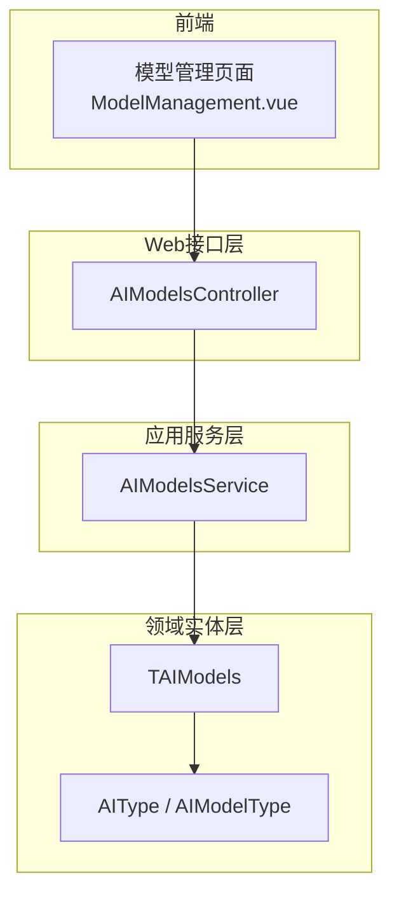
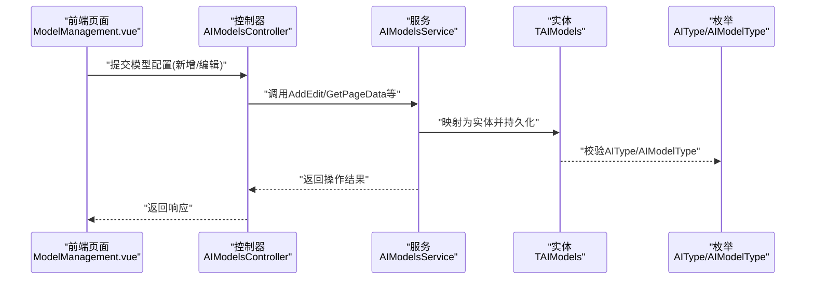
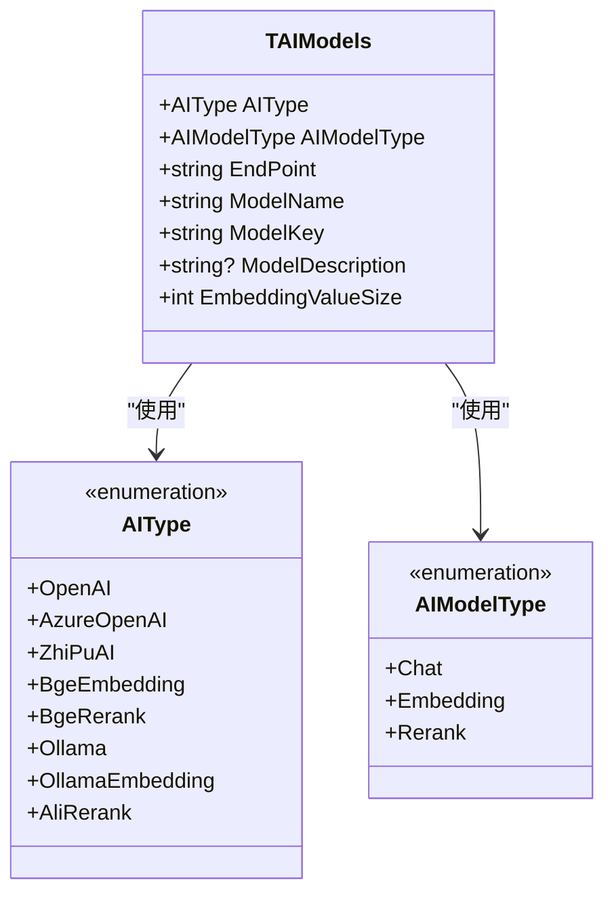
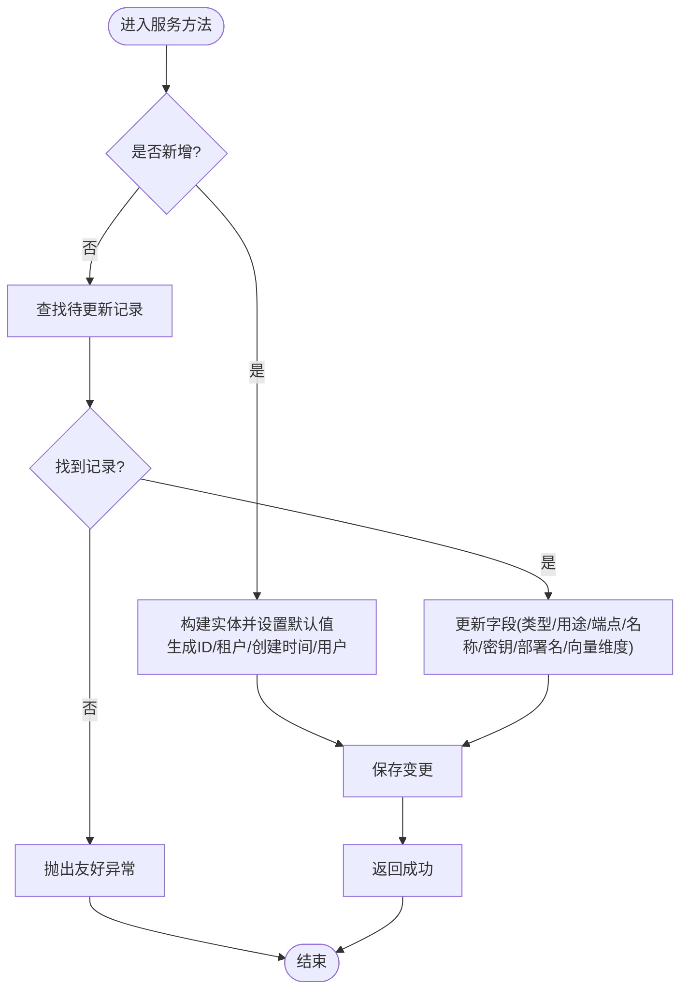
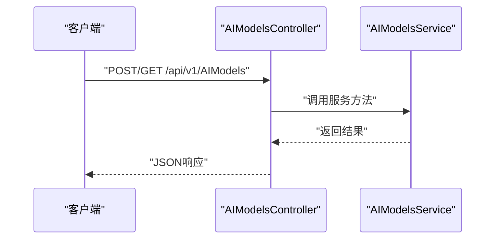
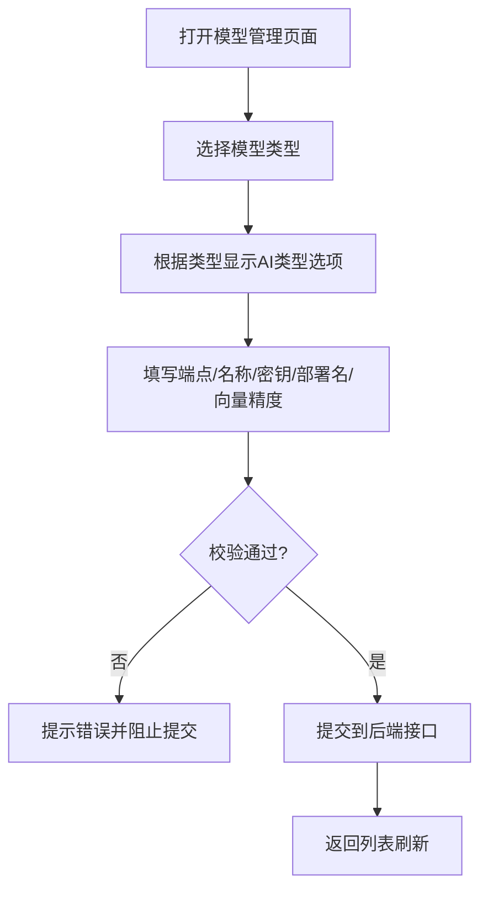
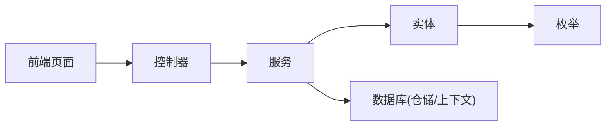

# 模型管理

<cite>
**本文引用的文件**
- [TAIModels.cs](file://Kevin/Domain/Entities/AI/TAIModels.cs)
- [AIType.cs](file://Kevin/kevin.Share/Enums/AIType.cs)
- [AIModelsService.cs](file://Kevin/Application/Services/AI/AIModelsService.cs)
- [AIModelsController.cs](file://Kevin/Kevin.Web.Basics/Controllers/AI/AIModelsController.cs)
- [ModelManagement.vue](file://vue/kevin.web.vue/src/pages/ai/ModelManagement.vue)
</cite>

## 目录
1. [简介](#简介)
2. [项目结构](#项目结构)
3. [核心组件](#核心组件)
4. [架构总览](#架构总览)
5. [详细组件分析](#详细组件分析)
6. [依赖关系分析](#依赖关系分析)
7. [性能考量](#性能考量)
8. [故障排查指南](#故障排查指南)
9. [结论](#结论)
10. [附录](#附录)

## 简介
本系统提供统一的AI模型管理能力，支持OpenAI兼容API、本地Ollama模型以及第三方服务提供商（如Azure OpenAI、智谱AI、Bge Embedding/Rerank、Ali Rerank等）。通过集中化的模型配置与数据持久化，实现模型的增删改查、类型与用途区分、连接参数与认证信息管理。结合前端模型管理界面，可完成可视化配置与维护。

## 项目结构
围绕“模型管理”的核心代码分布在以下层次：
- 领域实体层：定义AI模型配置的数据结构与约束
- 应用服务层：封装模型配置的查询、新增、编辑、删除等业务逻辑
- Web接口层：对外暴露模型管理的REST接口
- 前端页面：提供模型配置的可视化维护界面

图表来源
- [ModelManagement.vue:119-153](file://vue/kevin.web.vue/src/pages/ai/ModelManagement.vue#L119-L153)
- [AIModelsController.cs](file://Kevin/Kevin.Web.Basics/Controllers/AI/AIModelsController.cs)
- [AIModelsService.cs:1-160](file://Kevin/Application/Services/AI/AIModelsService.cs#L1-L160)
- [TAIModels.cs:1-55](file://Kevin/Domain/Entities/AI/TAIModels.cs#L1-L55)
- [AIType.cs:1-39](file://Kevin/kevin.Share/Enums/AIType.cs#L1-L39)

章节来源
- [TAIModels.cs:1-55](file://Kevin/Domain/Entities/AI/TAIModels.cs#L1-L55)
- [AIType.cs:1-39](file://Kevin/kevin.Share/Enums/AIType.cs#L1-L39)
- [AIModelsService.cs:1-160](file://Kevin/Application/Services/AI/AIModelsService.cs#L1-L160)
- [AIModelsController.cs](file://Kevin/Kevin.Web.Basics/Controllers/AI/AIModelsController.cs)
- [ModelManagement.vue:119-153](file://vue/kevin.web.vue/src/pages/ai/ModelManagement.vue#L119-L153)

## 核心组件
- 模型实体 TAIModels：承载模型类型、模型用途、端点地址、模型名称、密钥、部署名、向量维度等关键配置项
- 枚举 AIType/AIModelType：统一描述支持的AI提供商类型与模型用途（聊天、嵌入、重排）
- 应用服务 AIModelsService：提供分页查询、详情获取、列表获取、新增/编辑、删除等能力
- Web控制器 AIModelsController：对外暴露模型管理接口（由框架路由到服务方法）
- 前端 ModelManagement.vue：提供模型类型的选择、必填校验、表单提交与列表展示

章节来源
- [TAIModels.cs:1-55](file://Kevin/Domain/Entities/AI/TAIModels.cs#L1-L55)
- [AIType.cs:1-39](file://Kevin/kevin.Share/Enums/AIType.cs#L1-L39)
- [AIModelsService.cs:1-160](file://Kevin/Application/Services/AI/AIModelsService.cs#L1-L160)
- [ModelManagement.vue:119-153](file://vue/kevin.web.vue/src/pages/ai/ModelManagement.vue#L119-L153)

## 架构总览
下图展示了从前端到后端再到实体的调用链路，以及模型类型与用途的约束关系。

图表来源
- [ModelManagement.vue:119-153](file://vue/kevin.web.vue/src/pages/ai/ModelManagement.vue#L119-L153)
- [AIModelsController.cs](file://Kevin/Kevin.Web.Basics/Controllers/AI/AIModelsController.cs)
- [AIModelsService.cs:1-160](file://Kevin/Application/Services/AI/AIModelsService.cs#L1-L160)
- [TAIModels.cs:1-55](file://Kevin/Domain/Entities/AI/TAIModels.cs#L1-L55)
- [AIType.cs:1-39](file://Kevin/kevin.Share/Enums/AIType.cs#L1-L39)

## 详细组件分析

### 模型实体与类型约束
- 字段说明
  - AIType：AI提供商类型，支持OpenAI、Azure OpenAI、智谱AI、Bge Embedding、Bge Rerank、Ollama、OllamaEmbedding、Ali Rerank等
  - AIModelType：模型用途，包括Chat（对话）、Embedding（向量）、Rerank（重排）
  - EndPoint：模型服务地址
  - ModelName：模型名称
  - ModelKey：模型密钥（原生直连场景可为空）
  - ModelDescription：部署名（Azure等场景需要）
  - EmbeddingValueSize：向量维度大小（默认2048）
- 约束与默认值
  - 必填字段：AIType、AIModelType、EndPoint、ModelName
  - 默认值：AIType=OpenAI，AIModelType=Chat，EmbeddingValueSize=2048

图表来源
- [TAIModels.cs:1-55](file://Kevin/Domain/Entities/AI/TAIModels.cs#L1-L55)
- [AIType.cs:1-39](file://Kevin/kevin.Share/Enums/AIType.cs#L1-L39)

章节来源
- [TAIModels.cs:1-55](file://Kevin/Domain/Entities/AI/TAIModels.cs#L1-L55)
- [AIType.cs:1-39](file://Kevin/kevin.Share/Enums/AIType.cs#L1-L39)

### 模型配置服务（AIModelsService）
- 能力概览
  - 分页查询：按租户与软删除过滤，支持关键字搜索（模型名称），包含创建/更新用户信息
  - 详情获取：按ID获取单条记录，不存在时抛出友好异常
  - 全量列表：按模型用途筛选返回
  - 新增/编辑：根据是否存在ID判断新增或更新，填充租户、创建/更新时间与用户信息
  - 删除：软删除并记录时间戳
- 业务要点
  - 数据权限：查询默认启用数据权限与租户隔离
  - 异常处理：对缺失数据返回友好提示
  - 审计字段：自动设置创建/更新时间与用户

图表来源
- [AIModelsService.cs:87-134](file://Kevin/Application/Services/AI/AIModelsService.cs#L87-L134)
- [AIModelsService.cs:142-157](file://Kevin/Application/Services/AI/AIModelsService.cs#L142-L157)

章节来源
- [AIModelsService.cs:1-160](file://Kevin/Application/Services/AI/AIModelsService.cs#L1-L160)

### Web接口（AIModelsController）
- 职责：接收HTTP请求，调用AIModelsService对应方法，返回标准化响应
- 典型流程：路由解析 -> 参数绑定 -> 服务调用 -> 结果封装 -> 返回

图表来源
- [AIModelsController.cs](file://Kevin/Kevin.Web.Basics/Controllers/AI/AIModelsController.cs)
- [AIModelsService.cs:1-160](file://Kevin/Application/Services/AI/AIModelsService.cs#L1-L160)

章节来源
- [AIModelsController.cs](file://Kevin/Kevin.Web.Basics/Controllers/AI/AIModelsController.cs)
- [AIModelsService.cs:1-160](file://Kevin/Application/Services/AI/AIModelsService.cs#L1-L160)

### 前端模型管理（ModelManagement.vue）
- 功能要点
  - 模型类型选择：Chat、Embedding、Rerank
  - AI类型联动：根据模型用途动态显示可选的AI提供商类型
  - 必填校验：模型类型、AI类型、端点、模型名称、部署名、向量精度等
  - 表单提交：将配置提交至后端进行新增/编辑
- 交互流程

图表来源
- [ModelManagement.vue:119-153](file://vue/kevin.web.vue/src/pages/ai/ModelManagement.vue#L119-L153)
- [ModelManagement.vue:213-228](file://vue/kevin.web.vue/src/pages/ai/ModelManagement.vue#L213-L228)

章节来源
- [ModelManagement.vue:119-153](file://vue/kevin.web.vue/src/pages/ai/ModelManagement.vue#L119-L153)
- [ModelManagement.vue:213-228](file://vue/kevin.web.vue/src/pages/ai/ModelManagement.vue#L213-L228)

## 依赖关系分析
- 模块内依赖
  - 控制器依赖服务：用于解耦HTTP与业务逻辑
  - 服务依赖实体与枚举：保证数据结构与类型约束一致
  - 前端依赖控制器接口：通过HTTP协议交互
- 外部依赖
  - 数据库访问：通过仓储/上下文持久化模型配置
  - 第三方AI服务：通过EndPoint与ModelKey等进行远程调用（具体调用逻辑在其它模块中实现）

图表来源
- [AIModelsController.cs](file://Kevin/Kevin.Web.Basics/Controllers/AI/AIModelsController.cs)
- [AIModelsService.cs:1-160](file://Kevin/Application/Services/AI/AIModelsService.cs#L1-L160)
- [TAIModels.cs:1-55](file://Kevin/Domain/Entities/AI/TAIModels.cs#L1-L55)
- [AIType.cs:1-39](file://Kevin/kevin.Share/Enums/AIType.cs#L1-L39)

章节来源
- [AIModelsService.cs:1-160](file://Kevin/Application/Services/AI/AIModelsService.cs#L1-L160)
- [TAIModels.cs:1-55](file://Kevin/Domain/Entities/AI/TAIModels.cs#L1-L55)
- [AIType.cs:1-39](file://Kevin/kevin.Share/Enums/AIType.cs#L1-L39)

## 性能考量
- 查询优化
  - 分页与跳过：避免一次性加载大量数据
  - 条件过滤：按租户与软删除状态过滤，减少无效数据
  - 关联加载：按需Include创建/更新用户，避免N+1问题
- 写入优化
  - 批量保存：在服务层合并多次修改后统一保存
  - 软删除：保留历史数据，便于审计与恢复
- 缓存建议
  - 模型配置可考虑短期缓存（如内存缓存），降低频繁读取数据库的压力
  - 注意缓存失效策略：当模型配置变更时及时清理缓存

[本节为通用性能指导，不直接分析具体文件]

## 故障排查指南
- 常见错误
  - 数据不存在或已删除：服务层在获取详情或删除时若未找到记录会抛出友好异常
  - 必填字段缺失：前端校验会在提交前拦截，确保基本完整性
- 定位步骤
  - 检查前端表单校验规则与提示信息
  - 查看后端服务日志与异常堆栈
  - 确认数据库记录是否存在且未被软删除
  - 核对租户隔离与数据权限是否正确

章节来源
- [AIModelsService.cs:45-68](file://Kevin/Application/Services/AI/AIModelsService.cs#L45-L68)
- [AIModelsService.cs:142-157](file://Kevin/Application/Services/AI/AIModelsService.cs#L142-L157)
- [ModelManagement.vue:213-228](file://vue/kevin.web.vue/src/pages/ai/ModelManagement.vue#L213-L228)

## 结论
本系统提供了完善的AI模型配置管理能力，覆盖主流AI提供商与本地模型，具备清晰的实体设计、规范的服务层逻辑与友好的前端交互。通过统一的类型与用途约束，确保配置的一致性与可维护性。后续可在调用层增加负载均衡、健康检查、监控统计与成本分析等能力，进一步提升系统的可用性与可观测性。

[本节为总结性内容，不直接分析具体文件]

## 附录
- 支持的AI类型与模型用途
  - AI类型：OpenAI、Azure OpenAI、智谱AI、Bge Embedding、Bge Rerank、Ollama、OllamaEmbedding、Ali Rerank
  - 模型用途：Chat（对话）、Embedding（向量）、Rerank（重排）
- 配置字段
  - 端点地址、模型名称、密钥、部署名、向量维度等
- 使用建议
  - Chat场景优先选择OpenAI/Ollama；Embedding场景可选择Bge或OllamaEmbedding；Rerank场景可选择Bge或Ali Rerank
  - 根据业务需求合理设置向量维度，以平衡精度与性能

章节来源
- [AIType.cs:1-39](file://Kevin/kevin.Share/Enums/AIType.cs#L1-L39)
- [TAIModels.cs:1-55](file://Kevin/Domain/Entities/AI/TAIModels.cs#L1-L55)