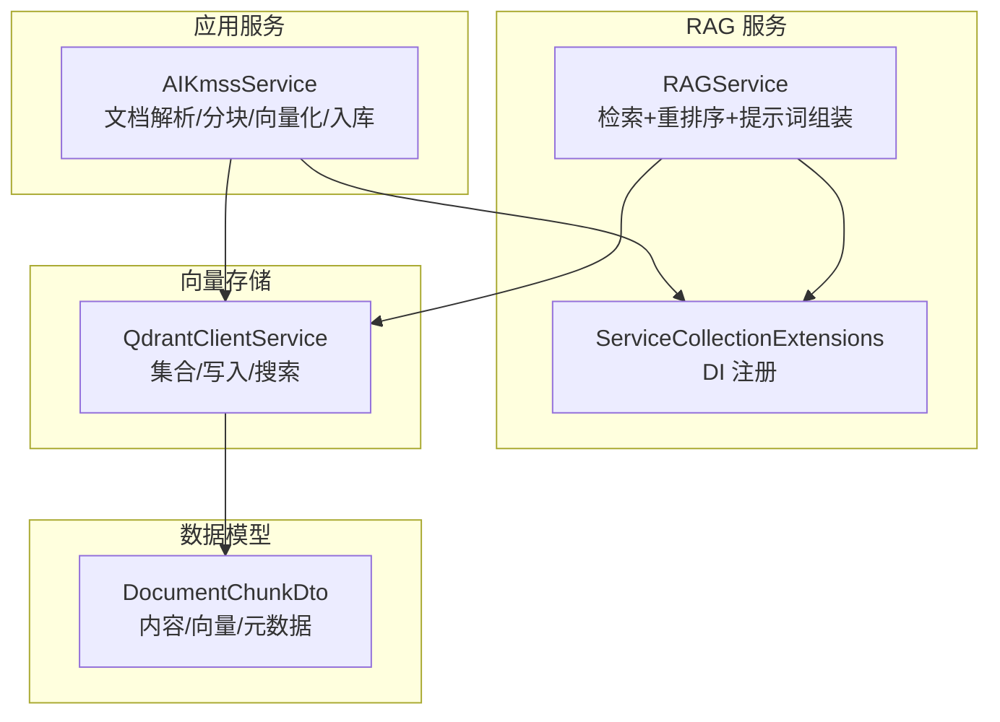
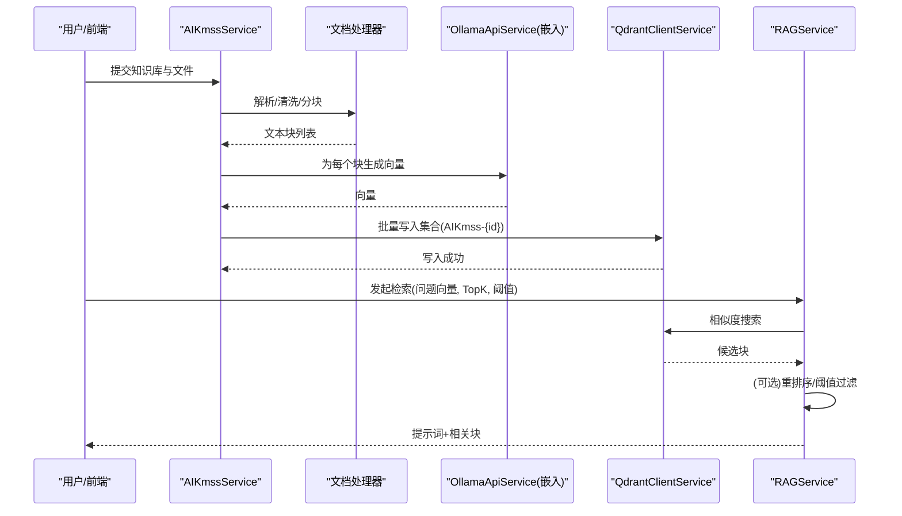
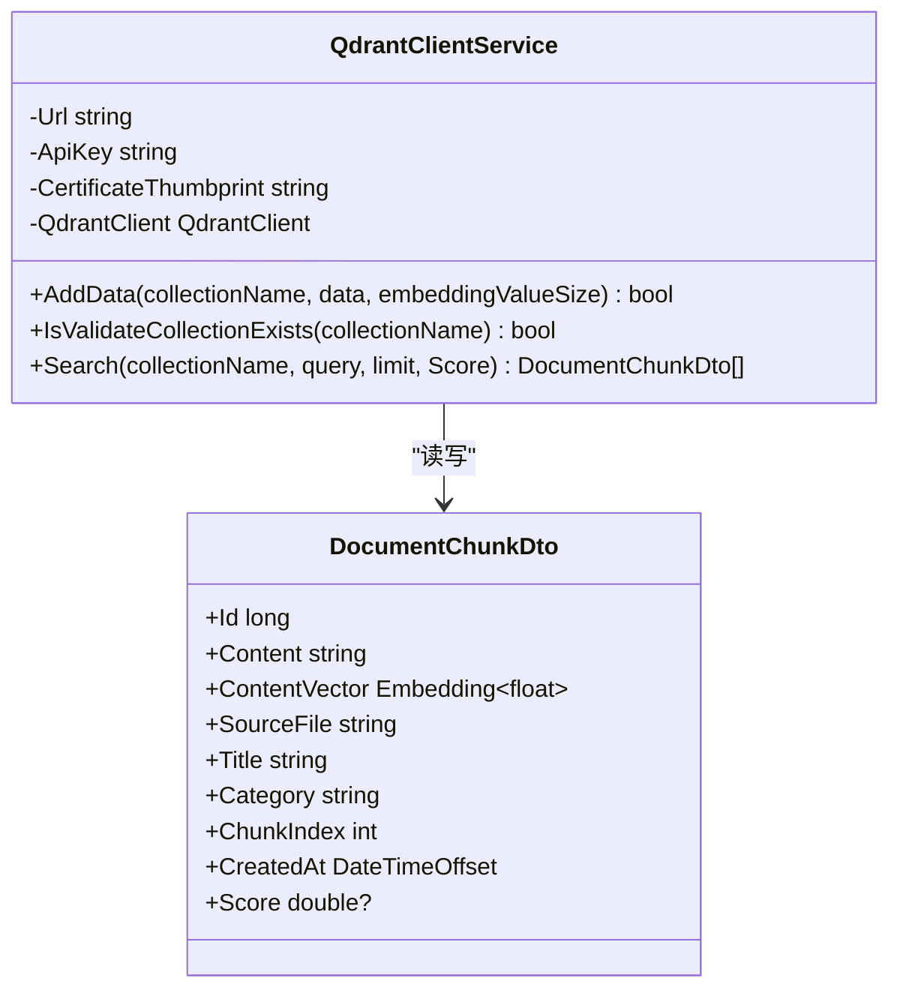
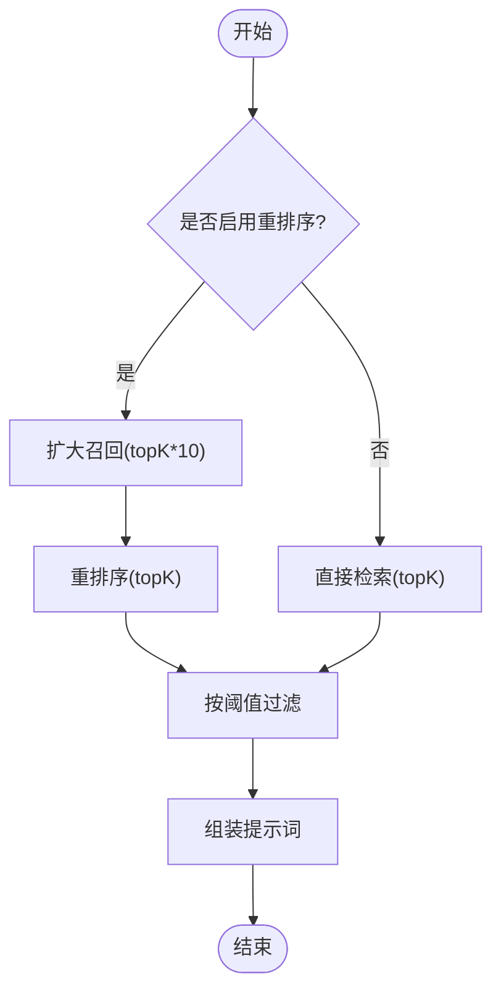
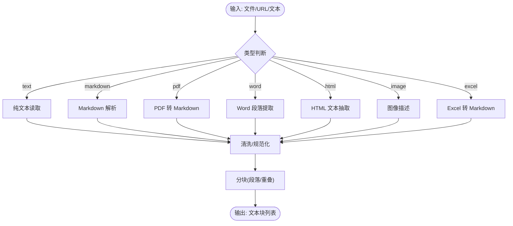
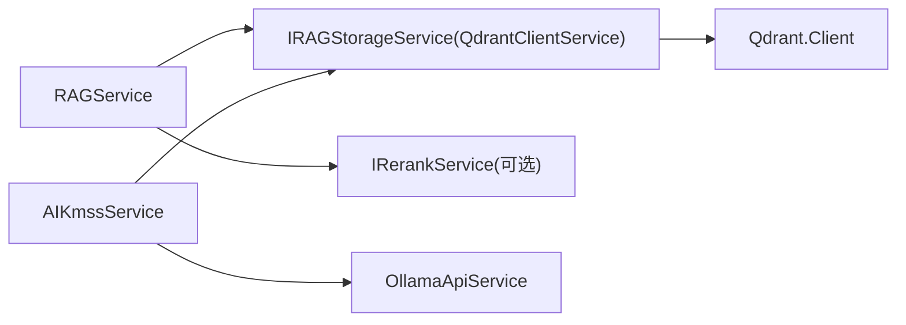

# 知识库管理

<cite>
**本文引用的文件**
- [RAGService.cs](file://Kevin/kevin.Module/Kevin.RAG/RAGService.cs)
- [ServiceCollectionExtensions.cs](file://Kevin/kevin.Module/Kevin.RAG/ServiceCollectionExtensions.cs)
- [QdrantClientService.cs](file://Kevin/kevin.Module/Kevin.RAG/Qdrant/QdrantClientService.cs)
- [IRAGStorageService.cs](file://Kevin/kevin.Module/Kevin.RAG/Interfaces/IRAGStorageService.cs)
- [IRAGService.cs](file://Kevin/kevin.Module/Kevin.RAG/Interfaces/IRAGService.cs)
- [DocumentChunkDto.cs](file://Kevin/kevin.Module/Kevin.RAG/Dto/DocumentChunkDto.cs)
- [AIKmssService.cs](file://Kevin/Application/Services/AI/AIKmssService.cs)
</cite>

## 目录
1. [简介](#简介)
2. [项目结构](#项目结构)
3. [核心组件](#核心组件)
4. [架构总览](#架构总览)
5. [详细组件分析](#详细组件分析)
6. [依赖关系分析](#依赖关系分析)
7. [性能考虑](#性能考虑)
8. [故障排查指南](#故障排查指南)
9. [结论](#结论)
10. [附录](#附录)

## 简介
本文件面向“基于 RAG（检索增强生成）的知识库管理系统”，聚焦文档处理、向量化存储与语义检索的完整链路。系统通过文档解析器支持多种文件格式（文本、Markdown、PDF、Word、HTML、图片、Excel），将内容清洗、分块后，使用嵌入模型生成向量并持久化到 Qdrant 向量数据库；查询时进行相似度检索，可选重排序以提升结果质量，最终拼接为提示词供大模型回答。同时提供知识库的 CRUD、版本管理与权限控制能力，以及构建与调优的最佳实践。

## 项目结构
知识库相关代码主要位于 Kevin.RAG 模块与应用服务层：
- RAG 服务层：封装检索流程、重排序策略与提示词组装
- 向量存储层：基于 Qdrant 的集合创建、数据写入与相似度搜索
- 数据模型：统一的文档块 DTO，承载内容与元数据
- 应用服务：负责文档解析、分块、向量化与入库编排
- 依赖注入：集中注册 Ollama、Qdrant、重排序等外部能力

图表来源
- [AIKmssService.cs:246-429](file://Kevin/Application/Services/AI/AIKmssService.cs#L246-L429)
- [RAGService.cs:19-78](file://Kevin/kevin.Module/Kevin.RAG/RAGService.cs#L19-L78)
- [QdrantClientService.cs:49-130](file://Kevin/kevin.Module/Kevin.RAG/Qdrant/QdrantClientService.cs#L49-L130)
- [ServiceCollectionExtensions.cs:13-34](file://Kevin/kevin.Module/Kevin.RAG/ServiceCollectionExtensions.cs#L13-L34)
- [DocumentChunkDto.cs:8-62](file://Kevin/kevin.Module/Kevin.RAG/Dto/DocumentChunkDto.cs#L8-L62)

章节来源
- [AIKmssService.cs:246-429](file://Kevin/Application/Services/AI/AIKmssService.cs#L246-L429)
- [RAGService.cs:19-78](file://Kevin/kevin.Module/Kevin.RAG/RAGService.cs#L19-L78)
- [QdrantClientService.cs:49-130](file://Kevin/kevin.Module/Kevin.RAG/Qdrant/QdrantClientService.cs#L49-L130)
- [ServiceCollectionExtensions.cs:13-34](file://Kevin/kevin.Module/Kevin.RAG/ServiceCollectionExtensions.cs#L13-L34)
- [DocumentChunkDto.cs:8-62](file://Kevin/kevin.Module/Kevin.RAG/Dto/DocumentChunkDto.cs#L8-L62)

## 核心组件
- IRAGService / RAGService：对外暴露检索接口，支持是否启用重排序、TopK 与分数阈值过滤，并将检索结果拼装为系统提示词。
- IRAGStorageService / QdrantClientService：抽象向量存储操作，实现基于 Qdrant 的集合创建、批量插入与相似度搜索，支持余弦距离与自定义阈值过滤。
- DocumentChunkDto：统一的数据载体，包含内容、向量、来源、标题、分类、分块序号、时间与得分等字段。
- AIKmssService：知识库业务编排，负责文档解析、清洗、分块、调用嵌入模型生成向量并写入 Qdrant，同时维护知识库与明细记录的状态。
- ServiceCollectionExtensions：集中注册 Ollama、Qdrant、重排序服务，便于配置与扩展。

章节来源
- [IRAGService.cs:6-32](file://Kevin/kevin.Module/Kevin.RAG/Interfaces/IRAGService.cs#L6-L32)
- [RAGService.cs:9-78](file://Kevin/kevin.Module/Kevin.RAG/RAGService.cs#L9-L78)
- [IRAGStorageService.cs:6-26](file://Kevin/kevin.Module/Kevin.RAG/Interfaces/IRAGStorageService.cs#L6-L26)
- [QdrantClientService.cs:11-130](file://Kevin/kevin.Module/Kevin.RAG/Qdrant/QdrantClientService.cs#L11-L130)
- [DocumentChunkDto.cs:8-62](file://Kevin/kevin.Module/Kevin.RAG/Dto/DocumentChunkDto.cs#L8-L62)
- [AIKmssService.cs:246-429](file://Kevin/Application/Services/AI/AIKmssService.cs#L246-L429)
- [ServiceCollectionExtensions.cs:13-34](file://Kevin/kevin.Module/Kevin.RAG/ServiceCollectionExtensions.cs#L13-L34)

## 架构总览
下图展示了从文档上传到检索问答的端到端流程：文档解析→清洗→分块→嵌入→入库→检索→（可选）重排序→提示词组装→返回结果。

图表来源
- [AIKmssService.cs:246-429](file://Kevin/Application/Services/AI/AIKmssService.cs#L246-L429)
- [RAGService.cs:19-78](file://Kevin/kevin.Module/Kevin.RAG/RAGService.cs#L19-L78)
- [QdrantClientService.cs:49-130](file://Kevin/kevin.Module/Kevin.RAG/Qdrant/QdrantClientService.cs#L49-L130)

## 详细组件分析

### 向量存储：Qdrant 集成与索引
- 连接与鉴权：支持 URL、API Key 与证书指纹配置，构造 gRPC 客户端。
- 集合管理：首次写入前检查集合是否存在，不存在则按 embedding 维度与余弦距离创建。
- 数据写入：将 DocumentChunkDto 映射为 PointStruct，Payload 包含内容、来源、标题、分类、分块序号与时间戳。
- 相似度检索：根据查询向量执行 SearchAsync，支持 limit 与 Score 阈值过滤，并按分数降序返回。

图表来源
- [QdrantClientService.cs:11-130](file://Kevin/kevin.Module/Kevin.RAG/Qdrant/QdrantClientService.cs#L11-L130)
- [DocumentChunkDto.cs:8-62](file://Kevin/kevin.Module/Kevin.RAG/Dto/DocumentChunkDto.cs#L8-L62)

章节来源
- [QdrantClientService.cs:17-130](file://Kevin/kevin.Module/Kevin.RAG/Qdrant/QdrantClientService.cs#L17-L130)

### 检索与重排序：RAG 服务
- 检索入口：接收集合名、问题向量、问题文本、是否启用重排序、TopK 与分数阈值。
- 检索流程：优先调用存储层搜索，若启用重排序则先扩大召回集，再对内容进行重排序，最后按阈值与 TopK 裁剪。
- 提示词组装：将检索到的块以结构化格式拼接为上下文，返回给上层用于 LLM 生成。

图表来源
- [RAGService.cs:19-78](file://Kevin/kevin.Module/Kevin.RAG/RAGService.cs#L19-L78)

章节来源
- [RAGService.cs:19-78](file://Kevin/kevin.Module/Kevin.RAG/RAGService.cs#L19-L78)

### 文档解析与预处理：多格式支持
- 支持的输入类型：文本、Markdown、PDF、Word、HTML、图片描述、Excel 表格转 Markdown。
- 解析路径：本地文件或远程 URL；流式读取后按类型选择对应解析器。
- 清洗与分块：使用文档处理器进行清洗，按段落分块，避免过碎或过长导致检索效果下降。
- 元数据填充：来源文件名、标题、分类、分块序号、创建时间等。

图表来源
- [AIKmssService.cs:274-357](file://Kevin/Application/Services/AI/AIKmssService.cs#L274-L357)

章节来源
- [AIKmssService.cs:274-357](file://Kevin/Application/Services/AI/AIKmssService.cs#L274-L357)

### 知识分块策略与嵌入模型
- 分块参数：每段最大 Token 数、行最大 Token 数、重叠 Token 数，可在知识库级别配置。
- 嵌入模型：通过 Ollama 获取向量，支持不同模型的向量维度；在入库时动态设置 embedding 维度。
- 向量维度：默认 2048，可从模型配置中覆盖。

章节来源
- [AIKmssService.cs:350-391](file://Kevin/Application/Services/AI/AIKmssService.cs#L350-L391)
- [DocumentChunkDto.cs:24-26](file://Kevin/kevin.Module/Kevin.RAG/Dto/DocumentChunkDto.cs#L24-L26)

### 检索算法与配置
- 相似度度量：余弦距离。
- 检索参数：limit（TopK）、Score（相似度阈值）。
- 重排序：可接入外部重排序服务，提升相关性。

章节来源
- [QdrantClientService.cs:72-75](file://Kevin/kevin.Module/Kevin.RAG/Qdrant/QdrantClientService.cs#L72-L75)
- [QdrantClientService.cs:102-130](file://Kevin/kevin.Module/Kevin.RAG/Qdrant/QdrantClientService.cs#L102-L130)
- [RAGService.cs:44-67](file://Kevin/kevin.Module/Kevin.RAG/RAGService.cs#L44-L67)

### 知识库 CRUD、版本管理与权限控制
- 知识库主表与明细：支持新增/编辑/删除，明细记录跟踪文件、状态、错误信息等。
- 版本管理：更新时对比新旧明细，标记删除旧条目，新增/更新新条目，保证变更可追溯。
- 权限控制：结合系统权限体系，知识库查询与操作受租户与数据权限约束（如 isDataPer 过滤）。

章节来源
- [AIKmssService.cs:50-111](file://Kevin/Application/Services/AI/AIKmssService.cs#L50-L111)
- [AIKmssService.cs:112-239](file://Kevin/Application/Services/AI/AIKmssService.cs#L112-L239)
- [AIKmssService.cs:431-446](file://Kevin/Application/Services/AI/AIKmssService.cs#L431-L446)

### 依赖注入与服务装配
- 通过扩展方法集中注册：Ollama API、Qdrant 存储、RAG 服务、重排序服务。
- 配置项：OllamaApiSetting、QdrantClientSetting、RerankApiSetting。

章节来源
- [ServiceCollectionExtensions.cs:13-34](file://Kevin/kevin.Module/Kevin.RAG/ServiceCollectionExtensions.cs#L13-L34)

## 依赖关系分析
- RAGService 依赖 IRAGStorageService（Qdrant 实现）与 IRerankService（可选）。
- QdrantClientService 依赖 Qdrant.Client 与配置项。
- AIKmssService 依赖文件存储、解析工具、嵌入模型与向量存储。
- 所有服务通过 DI 容器装配，便于替换与测试。

图表来源
- [RAGService.cs:9-18](file://Kevin/kevin.Module/Kevin.RAG/RAGService.cs#L9-L18)
- [QdrantClientService.cs:11-47](file://Kevin/kevin.Module/Kevin.RAG/Qdrant/QdrantClientService.cs#L11-L47)
- [AIKmssService.cs:29-49](file://Kevin/Application/Services/AI/AIKmssService.cs#L29-L49)

章节来源
- [RAGService.cs:9-18](file://Kevin/kevin.Module/Kevin.RAG/RAGService.cs#L9-L18)
- [QdrantClientService.cs:11-47](file://Kevin/kevin.Module/Kevin.RAG/Qdrant/QdrantClientService.cs#L11-L47)
- [AIKmssService.cs:29-49](file://Kevin/Application/Services/AI/AIKmssService.cs#L29-L49)

## 性能考虑
- 向量维度与集合创建：确保 embedding 维度与模型一致，避免运行时转换开销。
- 批量写入：尽量合并多个块的写入请求，减少网络往返。
- 检索优化：合理设置 TopK 与 Score 阈值，平衡召回率与延迟；必要时启用重排序提高精度。
- 分块策略：根据文档长度与语义完整性调整段落大小与重叠，避免碎片化影响检索质量。
- 并发与锁：入库流程使用分布式锁防止重复处理，保障幂等性。

[本节为通用指导，不直接分析具体文件]

## 故障排查指南
- Qdrant 连接失败：检查 URL、API Key、证书指纹是否正确；确认服务可达。
- 集合不存在：首次写入会自动创建；若失败请检查向量维度与距离配置。
- 检索结果为空：降低 Score 阈值或增大 TopK；检查嵌入向量是否成功生成。
- 重排序异常：确认重排序服务地址、密钥与模型名称正确；必要时关闭重排序回退到相似度排序。
- 解析失败：确认文件类型与解析器匹配；检查流读取与编码问题。

章节来源
- [QdrantClientService.cs:17-47](file://Kevin/kevin.Module/Kevin.RAG/Qdrant/QdrantClientService.cs#L17-L47)
- [RAGService.cs:44-78](file://Kevin/kevin.Module/Kevin.RAG/RAGService.cs#L44-L78)
- [AIKmssService.cs:274-357](file://Kevin/Application/Services/AI/AIKmssService.cs#L274-L357)

## 结论
本知识库系统以 RAG 为核心，打通了文档解析、分块、向量化、存储与检索的全链路。通过可插拔的重排序与灵活的嵌入模型配置，兼顾检索精度与性能。配合完善的 CRUD、版本管理与权限控制，可满足企业级知识库的建设与运维需求。建议在生产环境结合数据规模与查询 SLA，持续优化分块策略、向量维度与检索参数，以获得最佳体验。

[本节为总结，不直接分析具体文件]

## 附录
- 关键接口与职责
  - IRAGService：检索与提示词组装
  - IRAGStorageService：向量存储抽象
  - QdrantClientService：Qdrant 实现
  - RAGService：检索流程编排
  - AIKmssService：知识库业务编排
- 数据模型
  - DocumentChunkDto：文档块载体

章节来源
- [IRAGService.cs:6-32](file://Kevin/kevin.Module/Kevin.RAG/Interfaces/IRAGService.cs#L6-L32)
- [IRAGStorageService.cs:6-26](file://Kevin/kevin.Module/Kevin.RAG/Interfaces/IRAGStorageService.cs#L6-L26)
- [DocumentChunkDto.cs:8-62](file://Kevin/kevin.Module/Kevin.RAG/Dto/DocumentChunkDto.cs#L8-L62)