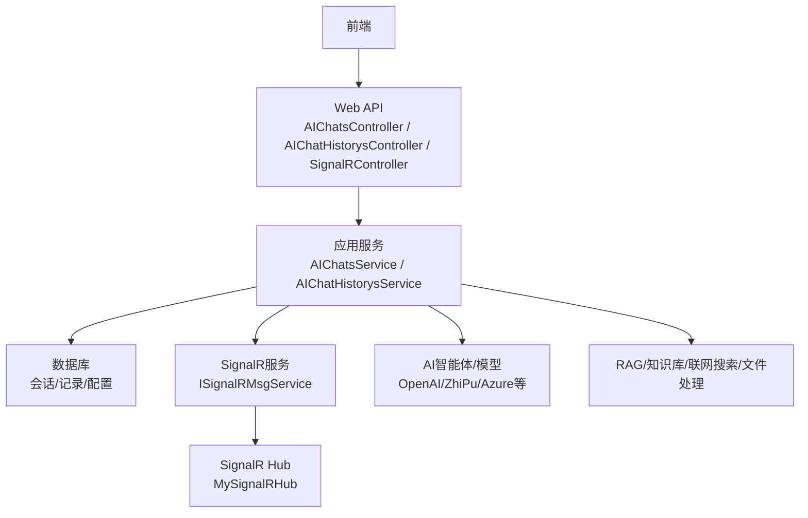
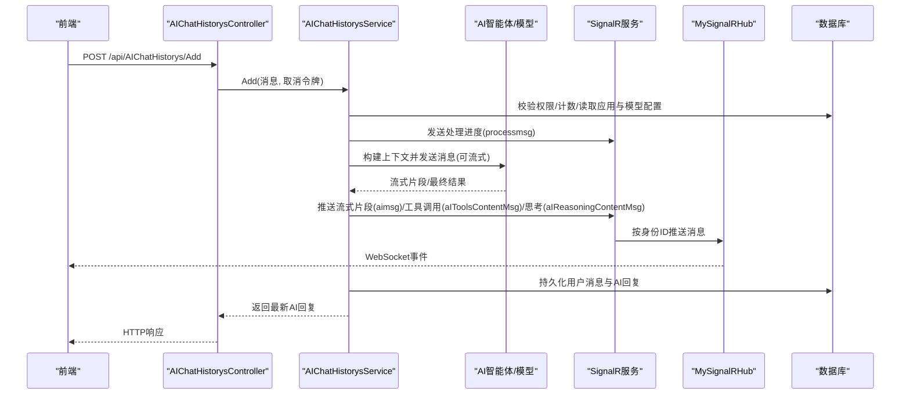
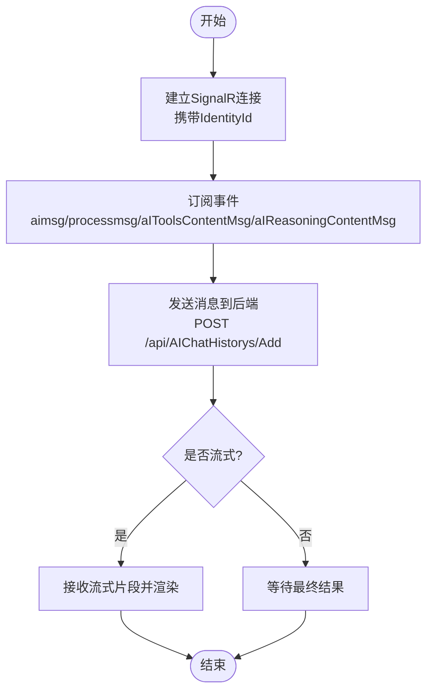
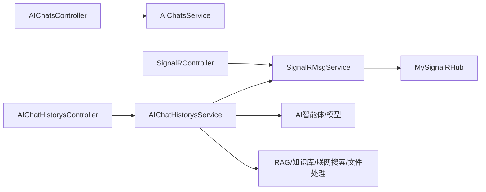

# AI聊天接口

<cite>
**本文引用的文件**
- [AIChatsController.cs](file://Kevin/Kevin.Web.Basics/Controllers/AI/AIChatsController.cs)
- [AIChatHistorysController.cs](file://Kevin/Kevin.Web.Basics/Controllers/AI/AIChatHistorysController.cs)
- [SignalRController.cs](file://Kevin/Kevin.Web.Basics/Controllers/SignalRController.cs)
- [AIChatsService.cs](file://Kevin/Application/Services/AI/AIChatsService.cs)
- [AIChatHistorysService.cs](file://Kevin/Application/Services/AI/AIChatHistorysService.cs)
- [ISignalRMsgService.cs](file://Kevin/kevin.Module/Kevin.SignalR/Service/ISignalRMsgService.cs)
- [SignalRMsgService.cs](file://Kevin/kevin.Module/Kevin.SignalR/Service/SignalRMsgService.cs)
- [MySignalRHub.cs](file://Kevin/kevin.Module/Kevin.SignalR/MySignalRHub.cs)
- [AIChatsDto.cs](file://Kevin/kevin.Share/Dtos/AI/AIChatsDto.cs)
- [AIChatHistorysDto.cs](file://Kevin/kevin.Share/Dtos/AI/AIChatHistorysDto.cs)
</cite>

## 目录
1. [简介](#简介)
2. [项目结构](#项目结构)
3. [核心组件](#核心组件)
4. [架构总览](#架构总览)
5. [详细组件分析](#详细组件分析)
6. [依赖关系分析](#依赖关系分析)
7. [性能考虑](#性能考虑)
8. [故障排查指南](#故障排查指南)
9. [结论](#结论)
10. [附录](#附录)

## 简介
本文件面向开发者，系统化说明AI聊天功能的API接口与实现要点，覆盖：
- 会话管理：创建、查询、删除对话
- 消息收发：发送用户消息、接收AI回复（支持流式）
- 历史记录：分页查询聊天记录
- 流式响应：基于SignalR的实时推送机制
- 模型调用与上下文：智能体选项、提示词、知识库检索、联网搜索、文件处理
- 前端集成：WebSocket连接示例与错误处理方案

## 项目结构
本项目采用分层架构：
- Web层：控制器暴露REST API，负责鉴权、日志、事务等横切关注点
- 应用服务层：编排业务逻辑，协调仓储、外部服务（AI Agent、SignalR、RAG等）
- 领域与基础设施：实体、DTO、SignalR Hub、缓存、数据库访问等

图表来源
- [AIChatsController.cs:15-77](file://Kevin/Kevin.Web.Basics/Controllers/AI/AIChatsController.cs#L15-L77)
- [AIChatHistorysController.cs:14-76](file://Kevin/Kevin.Web.Basics/Controllers/AI/AIChatHistorysController.cs#L14-L76)
- [SignalRController.cs:10-92](file://Kevin/Kevin.Web.Basics/Controllers/SignalRController.cs#L10-L92)
- [AIChatsService.cs:14-44](file://Kevin/Application/Services/AI/AIChatsService.cs#L14-L44)
- [AIChatHistorysService.cs:29-73](file://Kevin/Application/Services/AI/AIChatHistorysService.cs#L29-L73)
- [ISignalRMsgService.cs:1-67](file://Kevin/kevin.Module/Kevin.SignalR/Service/ISignalRMsgService.cs#L1-L67)
- [MySignalRHub.cs:11-47](file://Kevin/kevin.Module/Kevin.SignalR/MySignalRHub.cs#L11-L47)

章节来源
- [AIChatsController.cs:15-77](file://Kevin/Kevin.Web.Basics/Controllers/AI/AIChatsController.cs#L15-L77)
- [AIChatHistorysController.cs:14-76](file://Kevin/Kevin.Web.Basics/Controllers/AI/AIChatHistorysController.cs#L14-L76)
- [SignalRController.cs:10-92](file://Kevin/Kevin.Web.Basics/Controllers/SignalRController.cs#L10-L92)

## 核心组件
- 会话管理
  - 获取我的对话列表、新增对话、删除对话
- 消息收发
  - 新增聊天记录（发送用户消息并触发AI回复，支持流式）
  - 分页查询聊天记录
- 实时通信
  - 通过SignalR将AI流式片段、工具调用过程、思考过程、处理状态推送到前端
- 上下文与增强
  - 系统提示词、知识库检索（RAG）、联网搜索、文件内容提取、图片多模态输入
- 模型与智能体
  - 统一封装OpenAI/ZhiPu/Azure等模型调用，支持流式回调、重试、超时、Token统计

章节来源
- [AIChatsService.cs:46-207](file://Kevin/Application/Services/AI/AIChatsService.cs#L46-L207)
- [AIChatHistorysService.cs:75-262](file://Kevin/Application/Services/AI/AIChatHistorysService.cs#L75-L262)
- [SignalRMsgService.cs:72-111](file://Kevin/kevin.Module/Kevin.SignalR/Service/SignalRMsgService.cs#L72-L111)

## 架构总览
下图展示一次“发送消息”的完整流程：前端发起HTTP请求创建或追加消息，后端组装上下文（提示词、知识库、文件、联网搜索结果），调用AI智能体；若启用流式，则通过SignalR将增量片段实时推送给前端。

图表来源
- [AIChatHistorysController.cs:45-60](file://Kevin/Kevin.Web.Basics/Controllers/AI/AIChatHistorysController.cs#L45-L60)
- [AIChatHistorysService.cs:110-262](file://Kevin/Application/Services/AI/AIChatHistorysService.cs#L110-L262)
- [SignalRMsgService.cs:94-111](file://Kevin/kevin.Module/Kevin.SignalR/Service/SignalRMsgService.cs#L94-L111)
- [MySignalRHub.cs:74-129](file://Kevin/kevin.Module/Kevin.SignalR/MySignalRHub.cs#L74-L129)

## 详细组件分析

### 会话管理接口
- 获取我的对话列表
  - 方法：POST /api/AIChats/GetMyPageData
  - 入参：分页参数（页码、每页条数、可选搜索关键字）
  - 返回：分页数据（包含对话主题、最后一条消息、是否隐藏等）
  - 说明：仅返回当前租户与用户的可见对话
- 新增对话
  - 方法：POST /api/AIChats/Add
  - 入参：AppId、是否隐藏等
  - 返回：初始化的第一条AI欢迎消息
  - 说明：校验智能体权限，写入会话与初始历史
- 删除对话
  - 方法：DELETE /api/AIChats/Delete?Id=...
  - 返回：布尔值
  - 说明：软删除，记录删除时间

章节来源
- [AIChatsController.cs:31-76](file://Kevin/Kevin.Web.Basics/Controllers/AI/AIChatsController.cs#L31-L76)
- [AIChatsService.cs:46-130](file://Kevin/Application/Services/AI/AIChatsService.cs#L46-L130)
- [AIChatsService.cs:131-207](file://Kevin/Application/Services/AI/AIChatsService.cs#L131-L207)
- [AIChatsDto.cs:10-47](file://Kevin/kevin.Share/Dtos/AI/AIChatsDto.cs#L10-L47)

### 消息收发与历史记录接口
- 新增聊天记录（发送消息并获取AI回复）
  - 方法：POST /api/AIChatHistorys/Add
  - 入参：AIChatsId、Content、IsOnlineSearch、文件URL与文件名、是否联网搜索等
  - 返回：AI回复消息（含Token统计、工具调用与思考过程字段）
  - 说明：
    - 校验对话与智能体权限、消息数量上限
    - 组装系统提示词与应用提示词
    - 可选：知识库检索、联网搜索、文件内容提取、图片多模态
    - 调用AI智能体，支持流式回调
    - 异步压缩历史消息（按配置阈值）
- 分页查询聊天记录
  - 方法：POST /api/AIChatHistorys/GetPageData
  - 入参：whereId（必须为对话ID）、分页参数
  - 返回：分页数据（含绑定日志）
- 删除聊天记录
  - 方法：DELETE /api/AIChatHistorys/Delete?Id=...
  - 返回：布尔值

章节来源
- [AIChatHistorysController.cs:30-75](file://Kevin/Kevin.Web.Basics/Controllers/AI/AIChatHistorysController.cs#L30-L75)
- [AIChatHistorysService.cs:75-101](file://Kevin/Application/Services/AI/AIChatHistorysService.cs#L75-L101)
- [AIChatHistorysService.cs:104-262](file://Kevin/Application/Services/AI/AIChatHistorysService.cs#L104-L262)
- [AIChatHistorysService.cs:400-421](file://Kevin/Application/Services/AI/AIChatHistorysService.cs#L400-L421)
- [AIChatHistorysDto.cs:9-102](file://Kevin/kevin.Share/Dtos/AI/AIChatHistorysDto.cs#L9-L102)

### 流式响应与实时推送
- 流式回调
  - 当应用配置为流式时，AI智能体在生成过程中会持续回调，服务端通过SignalR将片段推送至前端
- 处理状态与调试信息
  - processmsg：显示“正在结合相关信息思考...”、“正在查询知识库...”等
  - aIToolsContentMsg：工具调用过程（可开关日志）
  - aIReasoningContentMsg：推理/思考过程（可开关日志）
- 身份标识
  - 通过IdentityId区分不同客户端实例，确保消息精准投递

章节来源
- [AIChatHistorysService.cs:166-219](file://Kevin/Application/Services/AI/AIChatHistorysService.cs#L166-L219)
- [SignalRController.cs:27-87](file://Kevin/Kevin.Web.Basics/Controllers/SignalRController.cs#L27-L87)
- [SignalRMsgService.cs:72-111](file://Kevin/kevin.Module/Kevin.SignalR/Service/SignalRMsgService.cs#L72-L111)
- [MySignalRHub.cs:49-68](file://Kevin/kevin.Module/Kevin.SignalR/MySignalRHub.cs#L49-L68)

### AI模型调用与上下文管理
- 上下文构建
  - 系统提示词 + 应用提示词
  - 知识库检索（RAG）：根据相似度阈值与最大匹配数召回相关文档
  - 联网搜索：可选，用于补充上下文
  - 文件处理：PDF/Excel/Word/HTML/Markdown/文本转文本，图片作为多模态输入
- 智能体选项
  - 温度、最大输出Token、响应格式（文本/JSON）、推理策略
- 模型类型
  - OpenAI、ZhiPu、AzureOpenAI等统一入口
- Token统计
  - 输入、输出、缓存输入、推理标记等统计字段

章节来源
- [AIChatHistorysService.cs:142-180](file://Kevin/Application/Services/AI/AIChatHistorysService.cs#L142-L180)
- [AIChatHistorysService.cs:264-398](file://Kevin/Application/Services/AI/AIChatHistorysService.cs#L264-L398)
- [AIChatHistorysService.cs:423-468](file://Kevin/Application/Services/AI/AIChatHistorysService.cs#L423-L468)
- [AIChatHistorysService.cs:181-230](file://Kevin/Application/Services/AI/AIChatHistorysService.cs#L181-L230)

### 对话状态维护与消息压缩
- 自动压缩
  - 达到一定轮次后，对历史消息进行压缩，减少上下文长度，提升效率
- 压缩策略
  - 按角色（用户/助手/工具）抽取关键内容，使用模型生成摘要并持久化

章节来源
- [AIChatHistorysService.cs:469-596](file://Kevin/Application/Services/AI/AIChatHistorysService.cs#L469-L596)

### 前端集成与WebSocket示例
- 连接建立
  - 使用SignalR客户端连接服务器端点，并在连接头或查询参数中携带IdentityId以标识客户端实例
- 订阅事件
  - aimsg：接收AI流式片段
  - processmsg：接收处理状态
  - aIToolsContentMsg：工具调用过程
  - aIReasoningContentMsg：推理/思考过程
- 断开与重连
  - 监听断开事件，实现指数退避重连
- 错误处理
  - 网络异常、鉴权失败、身份映射为空等场景需友好提示并重试

[此图为概念流程图，不直接对应具体源码]

## 依赖关系分析
- 控制器依赖应用服务
- 应用服务依赖：
  - 仓储（会话、历史记录、配置）
  - SignalR服务（实时推送）
  - AI智能体（模型调用）
  - RAG/知识库/联网搜索/文件处理
- SignalR Hub负责连接管理与身份映射，服务层通过缓存维护连接表

图表来源
- [AIChatsController.cs:15-77](file://Kevin/Kevin.Web.Basics/Controllers/AI/AIChatsController.cs#L15-L77)
- [AIChatHistorysController.cs:14-76](file://Kevin/Kevin.Web.Basics/Controllers/AI/AIChatHistorysController.cs#L14-L76)
- [SignalRController.cs:10-92](file://Kevin/Kevin.Web.Basics/Controllers/SignalRController.cs#L10-L92)
- [AIChatsService.cs:14-44](file://Kevin/Application/Services/AI/AIChatsService.cs#L14-L44)
- [AIChatHistorysService.cs:29-73](file://Kevin/Application/Services/AI/AIChatHistorysService.cs#L29-L73)
- [SignalRMsgService.cs:9-23](file://Kevin/kevin.Module/Kevin.SignalR/Service/SignalRMsgService.cs#L9-L23)
- [MySignalRHub.cs:11-47](file://Kevin/kevin.Module/Kevin.SignalR/MySignalRHub.cs#L11-L47)

章节来源
- [AIChatsService.cs:14-44](file://Kevin/Application/Services/AI/AIChatsService.cs#L14-L44)
- [AIChatHistorysService.cs:29-73](file://Kevin/Application/Services/AI/AIChatHistorysService.cs#L29-L73)
- [SignalRMsgService.cs:9-23](file://Kevin/kevin.Module/Kevin.SignalR/Service/SignalRMsgService.cs#L9-L23)

## 性能考虑
- 流式响应降低首字节延迟，提升用户体验
- 消息压缩控制上下文长度，减少Token消耗与延迟
- 知识库检索与联网搜索可配置开关，避免不必要的开销
- 文件处理采用流式读取与分类型解析，限制单次处理大小
- 重试与超时策略保护外部模型调用稳定性

[本节为通用指导，不直接分析具体文件]

## 故障排查指南
- 鉴权与权限
  - 控制器默认需要鉴权；部分接口标注跳过权限，请确认安全边界
- 智能体权限不足
  - 新增对话或消息时校验应用权限，失败抛出友好异常
- 聊天记录上限
  - 超过应用配置的消息条数限制时，建议新建对话
- SignalR连接问题
  - 检查IdentityId是否正确传递
  - 查看缓存中的连接映射是否存在
  - 断线重连与错误提示
- 模型调用失败
  - 检查Endpoint、ModelName、ModelKey配置
  - 关注重试次数与网络超时设置
  - 查看Token统计与日志定位问题

章节来源
- [AIChatsService.cs:72-130](file://Kevin/Application/Services/AI/AIChatsService.cs#L72-L130)
- [AIChatHistorysService.cs:110-123](file://Kevin/Application/Services/AI/AIChatHistorysService.cs#L110-L123)
- [SignalRMsgService.cs:25-49](file://Kevin/kevin.Module/Kevin.SignalR/Service/SignalRMsgService.cs#L25-L49)
- [MySignalRHub.cs:74-129](file://Kevin/kevin.Module/Kevin.SignalR/MySignalRHub.cs#L74-L129)

## 结论
本AI聊天功能通过清晰的层次划分与模块化设计，实现了会话管理、消息收发、历史记录查询与流式响应的完整闭环。借助SignalR实时推送、RAG知识库、联网搜索与文件处理能力，提供了灵活且强大的对话体验。建议在集成时重点关注身份标识、权限校验、流式事件处理与错误恢复策略。

[本节为总结性内容，不直接分析具体文件]

## 附录

### API定义速查
- 会话管理
  - POST /api/AIChats/GetMyPageData：获取我的对话列表
  - POST /api/AIChats/Add：新增对话
  - DELETE /api/AIChats/Delete?Id=...：删除对话
- 消息与历史
  - POST /api/AIChatHistorys/GetPageData：分页查询聊天记录
  - POST /api/AIChatHistorys/Add：发送消息并获取AI回复（支持流式）
  - DELETE /api/AIChatHistorys/Delete?Id=...：删除聊天记录
- SignalR管理
  - GET /api/SignalR/SendPublicMsg：发送公告消息
  - GET /api/SignalR/SendConnIdMsg：私发指定连接ID
  - GET /api/SignalR/SendIdentityIdMsg：按身份ID发送
  - GET /api/SignalR/SendIdentityIdsMsg：批量按身份ID发送
  - GET /api/SignalR/GetTenantIdentityIds：获取租户所有身份ID

章节来源
- [AIChatsController.cs:31-76](file://Kevin/Kevin.Web.Basics/Controllers/AI/AIChatsController.cs#L31-L76)
- [AIChatHistorysController.cs:30-75](file://Kevin/Kevin.Web.Basics/Controllers/AI/AIChatHistorysController.cs#L30-L75)
- [SignalRController.cs:27-87](file://Kevin/Kevin.Web.Basics/Controllers/SignalRController.cs#L27-L87)

### DTO字段说明（节选）
- AIChatsDto
  - Name：对话主题
  - UserId：聊天用户ID
  - AppId：应用ID
  - IsHidden：是否隐藏
  - LastMessage：最后一条消息
- AIChatHistorysDto
  - AIChatsId：所属对话ID
  - Content：消息内容
  - IsSend：发送(true)/接收(false)
  - MsgType：1非流式，2流式
  - IsOnlineSearch：是否联网搜索
  - AIReasoningContent：思考过程
  - AIToolsContent：工具调用过程
  - FileNames/ContentFileUrls：文件名称与URL
  - InputTokenCount/OutputTokenCount/TotalTokenCount/CachedInputTokenCount/ReasoningTokenCount：Token统计

章节来源
- [AIChatsDto.cs:10-47](file://Kevin/kevin.Share/Dtos/AI/AIChatsDto.cs#L10-L47)
- [AIChatHistorysDto.cs:9-102](file://Kevin/kevin.Share/Dtos/AI/AIChatHistorysDto.cs#L9-L102)