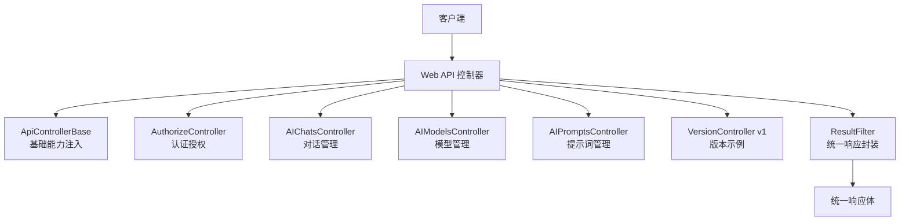
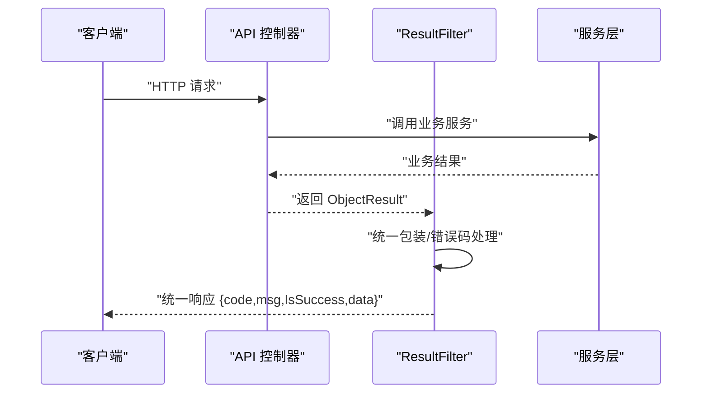
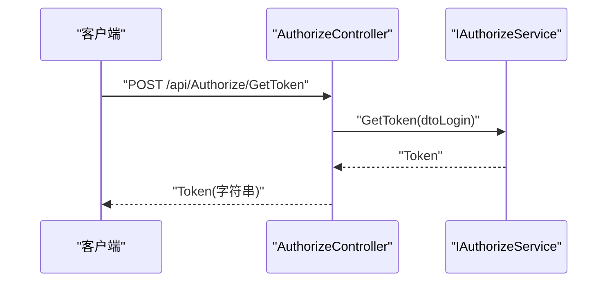
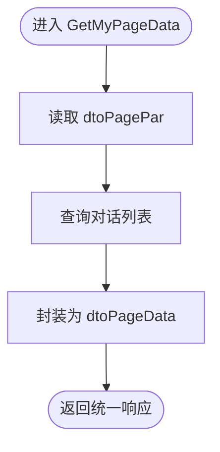
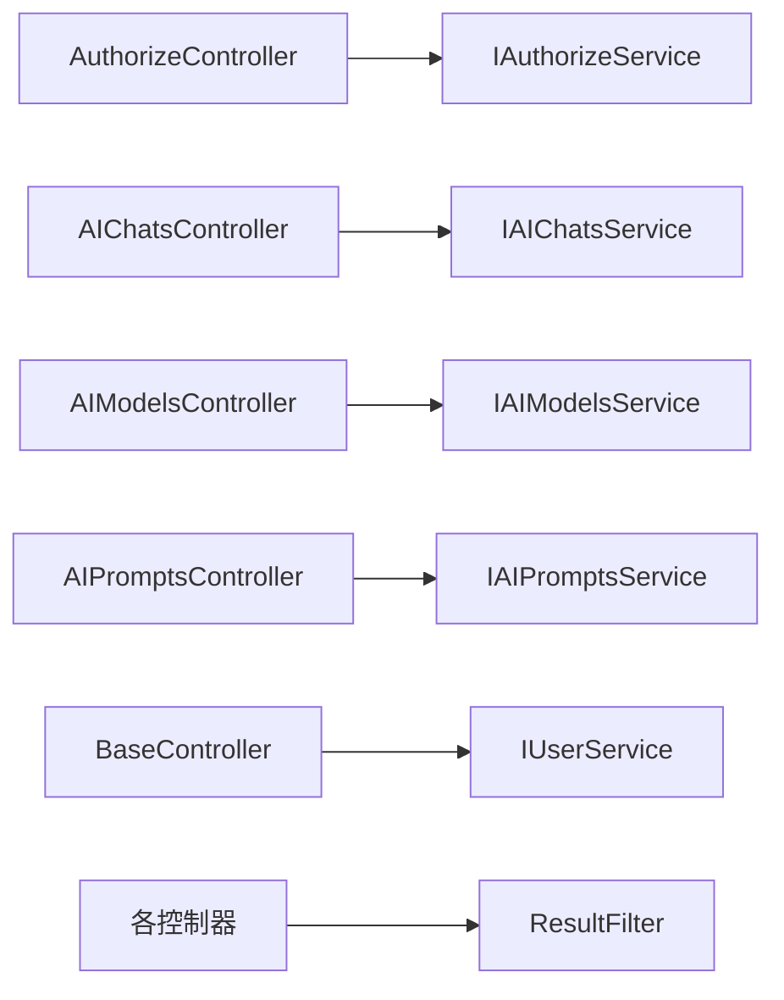

# API接口文档

<cite>
**本文引用的文件**
- [AuthorizeController.cs](file://Kevin/Kevin.Web.Basics/Controllers/AuthorizeController.cs)
- [BaseController.cs](file://Kevin/Kevin.Web.Basics/Controllers/BaseController.cs)
- [ApiControllerBase.cs](file://Kevin/Kevin.Web.Basics/Controllers/ApiControllerBase.cs)
- [ResultFilter.cs](file://Kevin/Kevin.Web.Basics/Filters/ResultFilter.cs)
- [VersionController.cs](file://App/WebApi/Controllers/v1/VersionController.cs)
- [AIChatsController.cs](file://Kevin/Kevin.Web.Basics/Controllers/AI/AIChatsController.cs)
- [AIModelsController.cs](file://Kevin/Kevin.Web.Basics/Controllers/AI/AIModelsController.cs)
- [AIPromptsController.cs](file://Kevin/Kevin.Web.Basics/Controllers/AI/AIPromptsController.cs)
- [dtoLogin.cs](file://Kevin/kevin.Share/Dtos/dtoLogin.cs)
- [dtoKeyValue.cs](file://Kevin/kevin.Share/Dtos/dtoKeyValue.cs)
- [dtoPagePar.cs](file://Kevin/kevin.Share/Dtos/dtoPagePar.cs)
- [dtoPageData.cs](file://Kevin/kevin.Share/Dtos/dtoPageData.cs)
- [AIChatsDto.cs](file://Kevin/kevin.Share/Dtos/AI/AIChatsDto.cs)
- [AIModelsDto.cs](file://Kevin/kevin.Share/Dtos/AI/AIModelsDto.cs)
</cite>

## 目录
1. [简介](#简介)
2. [项目结构](#项目结构)
3. [核心组件](#核心组件)
4. [架构总览](#架构总览)
5. [详细组件分析](#详细组件分析)
6. [依赖关系分析](#依赖关系分析)
7. [性能考虑](#性能考虑)
8. [故障排查指南](#故障排查指南)
9. [结论](#结论)
10. [附录](#附录)

## 简介
本文件为 NetCoreKevin 框架的完整API接口文档，覆盖RESTful设计规范、统一响应格式、认证授权机制、错误处理标准与版本管理策略。文档化所有公共接口的HTTP方法、URL模式、请求/响应结构与参数说明，并提供认证接口（登录、短信登录、发送短信验证码）与AI相关接口（对话、模型、提示词等）的详细使用说明与调用示例。同时提供接口测试工具与调试方法指导。

## 项目结构
本项目采用分层与模块化组织：
- Web层：控制器位于 Kevin/Kevin.Web.Basics/Controllers，按功能域划分（如 AI、Organizational），并包含基础控制器与过滤器。
- 共享DTO：位于 Kevin/kevin.Share/Dtos，定义通用分页、键值对、登录等数据结构。
- 应用模块：App/WebApi 下提供版本化示例控制器。
- 过滤器：全局结果格式化与错误包装在 Filters/ResultFilter.cs。

图表来源
- [ApiControllerBase.cs:9-20](file://Kevin/Kevin.Web.Basics/Controllers/ApiControllerBase.cs#L9-L20)
- [AuthorizeController.cs:11-61](file://Kevin/Kevin.Web.Basics/Controllers/AuthorizeController.cs#L11-L61)
- [AIChatsController.cs:15-77](file://Kevin/Kevin.Web.Basics/Controllers/AI/AIChatsController.cs#L15-L77)
- [AIModelsController.cs:14-80](file://Kevin/Kevin.Web.Basics/Controllers/AI/AIModelsController.cs#L14-L80)
- [AIPromptsController.cs:14-80](file://Kevin/Kevin.Web.Basics/Controllers/AI/AIPromptsController.cs#L14-L80)
- [VersionController.cs:6-23](file://App/WebApi/Controllers/v1/VersionController.cs#L6-L23)
- [ResultFilter.cs:10-153](file://Kevin/Kevin.Web.Basics/Filters/ResultFilter.cs#L10-L153)

章节来源
- [ApiControllerBase.cs:9-20](file://Kevin/Kevin.Web.Basics/Controllers/ApiControllerBase.cs#L9-L20)
- [AuthorizeController.cs:11-61](file://Kevin/Kevin.Web.Basics/Controllers/AuthorizeController.cs#L11-L61)
- [AIChatsController.cs:15-77](file://Kevin/Kevin.Web.Basics/Controllers/AI/AIChatsController.cs#L15-L77)
- [AIModelsController.cs:14-80](file://Kevin/Kevin.Web.Basics/Controllers/AI/AIModelsController.cs#L14-L80)
- [AIPromptsController.cs:14-80](file://Kevin/Kevin.Web.Basics/Controllers/AI/AIPromptsController.cs#L14-L80)
- [VersionController.cs:6-23](file://App/WebApi/Controllers/v1/VersionController.cs#L6-L23)
- [ResultFilter.cs:10-153](file://Kevin/Kevin.Web.Basics/Filters/ResultFilter.cs#L10-L153)

## 核心组件
- 统一响应封装：通过 ResultFilter 将业务返回统一包装为 { code, msg, IsSuccess, data }，并对 null 值进行安全转换。
- 认证授权：AuthorizeController 提供登录、短信登录、发送短信验证码；部分接口使用 [Authorize] 保护，部分使用 [AllowAnonymous]/[SkipAuthority] 开放。
- 版本管理：App/WebApi/Controllers/v1/VersionController 展示基于 ApiVersion 的版本化路由。
- 基础工具：BaseController 提供地区级联、二维码生成、字典取值、雪花ID/GUID等通用能力。

章节来源
- [ResultFilter.cs:10-153](file://Kevin/Kevin.Web.Basics/Filters/ResultFilter.cs#L10-L153)
- [AuthorizeController.cs:11-61](file://Kevin/Kevin.Web.Basics/Controllers/AuthorizeController.cs#L11-L61)
- [VersionController.cs:6-23](file://App/WebApi/Controllers/v1/VersionController.cs#L6-L23)
- [BaseController.cs:11-146](file://Kevin/Kevin.Web.Basics/Controllers/BaseController.cs#L11-L146)

## 架构总览
下图展示了从客户端到控制器的请求链路，以及统一响应封装过程。

图表来源
- [AuthorizeController.cs:11-61](file://Kevin/Kevin.Web.Basics/Controllers/AuthorizeController.cs#L11-L61)
- [ResultFilter.cs:10-153](file://Kevin/Kevin.Web.Basics/Filters/ResultFilter.cs#L10-L153)

## 详细组件分析

### 认证授权接口
- 获取Token（用户名+密码）
  - 方法：POST
  - URL：/api/Authorize/GetToken
  - 请求体：dtoLogin（Name, PassWord, TenantId）
  - 响应：字符串（Token）
  - 备注：匿名访问，记录HttpLog
- 短信登录（手机号+验证码）
  - 方法：POST
  - URL：/api/Authorize/GetTokenBySms
  - 请求体：dtoKeyValue（Key=手机号，Value=验证码）
  - 响应：字符串（Token）
- 发送短信验证码
  - 方法：POST
  - URL：/api/Authorize/SendSmsVerifyPhone
  - 请求体：dtoKeyValue（Key=手机号，Value可为空）
  - 响应：布尔值

图表来源
- [AuthorizeController.cs:11-61](file://Kevin/Kevin.Web.Basics/Controllers/AuthorizeController.cs#L11-L61)
- [dtoLogin.cs:6-37](file://Kevin/kevin.Share/Dtos/dtoLogin.cs#L6-L37)
- [dtoKeyValue.cs:1-23](file://Kevin/kevin.Share/Dtos/dtoKeyValue.cs#L1-L23)

章节来源
- [AuthorizeController.cs:11-61](file://Kevin/Kevin.Web.Basics/Controllers/AuthorizeController.cs#L11-L61)
- [dtoLogin.cs:6-37](file://Kevin/kevin.Share/Dtos/dtoLogin.cs#L6-L37)
- [dtoKeyValue.cs:1-23](file://Kevin/kevin.Share/Dtos/dtoKeyValue.cs#L1-L23)

### 基础工具接口
- 微信小程序OpenId
  - GET /api/Base/GetWeiXinMiniAppOpenId?weixinkeyid=&code=
  - 返回：openid,userid
- 省市级联地址
  - GET /api/Base/GetRegion?provinceId=&cityId=
  - 返回：键值列表
- 全部省市级联
  - GET /api/Base/GetRegionAll
  - 返回：嵌套键值列表
- 二维码生成
  - GET /api/Base/GetQrCode?text=
  - 返回：图片流
- 字典可选值
  - GET /api/Base/GetSelectValue?key=
  - 返回：键值列表
- 雪花ID/GUID
  - GET /api/Base/GetSnowflakeId
  - GET /api/Base/GetGuId

章节来源
- [BaseController.cs:11-146](file://Kevin/Kevin.Web.Basics/Controllers/BaseController.cs#L11-L146)

### AI对话接口
- 获取我的对话列表（分页）
  - POST /api/AIChats/GetMyPageData
  - 请求体：dtoPagePar<string>（支持 whereId/searchKey/state/sign/pageSize/pageNum/StartTime/EndTime/Parameter）
  - 响应：dtoPageData<AIChatsDto>
- 新增对话
  - POST /api/AIChats/Add
  - 请求体：AIChatsDto（Name, UserId, AppId, IsHidden, LastMessage 等）
  - 响应：AIChatHistorysDto
- 删除对话
  - DELETE /api/AIChats/Delete?id=
  - 响应：bool

图表来源
- [AIChatsController.cs:15-77](file://Kevin/Kevin.Web.Basics/Controllers/AI/AIChatsController.cs#L15-L77)
- [dtoPagePar.cs:1-50](file://Kevin/kevin.Share/Dtos/dtoPagePar.cs#L1-L50)
- [dtoPageData.cs:1-52](file://Kevin/kevin.Share/Dtos/dtoPageData.cs#L1-L52)
- [AIChatsDto.cs:6-47](file://Kevin/kevin.Share/Dtos/AI/AIChatsDto.cs#L6-L47)

章节来源
- [AIChatsController.cs:15-77](file://Kevin/Kevin.Web.Basics/Controllers/AI/AIChatsController.cs#L15-L77)
- [dtoPagePar.cs:1-50](file://Kevin/kevin.Share/Dtos/dtoPagePar.cs#L1-L50)
- [dtoPageData.cs:1-52](file://Kevin/kevin.Share/Dtos/dtoPageData.cs#L1-L52)
- [AIChatsDto.cs:6-47](file://Kevin/kevin.Share/Dtos/AI/AIChatsDto.cs#L6-L47)

### AI模型管理接口
- 分页获取模型
  - POST /api/AIModels/GetPageData
  - 请求体：dtoPagePar<string>
  - 响应：dtoPageData<AIModelsDto>
- 获取全部模型列表（缓存）
  - GET /api/AIModels/GetALLList?type=
  - 响应：List<AIModelsDto>
- 新增或编辑模型
  - POST /api/AIModels/AddEdit
  - 请求体：AIModelsDto（AIType, AIModelType, EndPoint, ModelName, ModelKey, ModelDescription, EmbeddingValueSize）
  - 响应：bool
- 删除模型
  - DELETE /api/AIModels/Delete?id=
  - 响应：bool

章节来源
- [AIModelsController.cs:14-80](file://Kevin/Kevin.Web.Basics/Controllers/AI/AIModelsController.cs#L14-L80)
- [AIModelsDto.cs:6-53](file://Kevin/kevin.Share/Dtos/AI/AIModelsDto.cs#L6-L53)

### AI提示词管理接口
- 分页获取提示词
  - POST /api/AIPrompts/GetPageData
  - 请求体：dtoPagePar<string>
  - 响应：dtoPageData<AIPromptsDto>
- 获取全部提示词列表（缓存）
  - GET /api/AIPrompts/GetALLList
  - 响应：List<AIPromptsDto>
- 新增或编辑提示词
  - POST /api/AIPrompts/AddEdit
  - 请求体：AIPromptsDto
  - 响应：bool
- 删除提示词
  - DELETE /api/AIPrompts/Delete?id=
  - 响应：bool

章节来源
- [AIPromptsController.cs:14-80](file://Kevin/Kevin.Web.Basics/Controllers/AI/AIPromptsController.cs#L14-L80)

### 版本管理接口
- 获取版本信息
  - GET /api/Version/GetVersion
  - 响应：字符串（示例：我是版本1）
  - 说明：该控制器标注 ApiVersion("1.0")，体现版本化路由策略

章节来源
- [VersionController.cs:6-23](file://App/WebApi/Controllers/v1/VersionController.cs#L6-L23)

## 依赖关系分析
- 控制器依赖：
  - AuthorizeController 依赖 IAuthorizeService、ICacheService
  - AI* 控制器依赖对应 IServices.AI.* 服务
  - BaseController 依赖 IUserService、数据库上下文
- 过滤器依赖：
  - ResultFilter 负责统一响应封装与错误码映射
- DTO依赖：
  - dtoPagePar/dtoPageData 用于分页输入输出
  - dtoLogin/dtoKeyValue 用于认证交互
  - AIChatsDto/AIModelsDto 用于AI领域数据交换

图表来源
- [AuthorizeController.cs:11-61](file://Kevin/Kevin.Web.Basics/Controllers/AuthorizeController.cs#L11-L61)
- [AIChatsController.cs:15-77](file://Kevin/Kevin.Web.Basics/Controllers/AI/AIChatsController.cs#L15-L77)
- [AIModelsController.cs:14-80](file://Kevin/Kevin.Web.Basics/Controllers/AI/AIModelsController.cs#L14-L80)
- [AIPromptsController.cs:14-80](file://Kevin/Kevin.Web.Basics/Controllers/AI/AIPromptsController.cs#L14-L80)
- [BaseController.cs:11-146](file://Kevin/Kevin.Web.Basics/Controllers/BaseController.cs#L11-L146)
- [ResultFilter.cs:10-153](file://Kevin/Kevin.Web.Basics/Filters/ResultFilter.cs#L10-L153)

章节来源
- [AuthorizeController.cs:11-61](file://Kevin/Kevin.Web.Basics/Controllers/AuthorizeController.cs#L11-L61)
- [AIChatsController.cs:15-77](file://Kevin/Kevin.Web.Basics/Controllers/AI/AIChatsController.cs#L15-L77)
- [AIModelsController.cs:14-80](file://Kevin/Kevin.Web.Basics/Controllers/AI/AIModelsController.cs#L14-L80)
- [AIPromptsController.cs:14-80](file://Kevin/Kevin.Web.Basics/Controllers/AI/AIPromptsController.cs#L14-L80)
- [BaseController.cs:11-146](file://Kevin/Kevin.Web.Basics/Controllers/BaseController.cs#L11-L146)
- [ResultFilter.cs:10-153](file://Kevin/Kevin.Web.Basics/Filters/ResultFilter.cs#L10-L153)

## 性能考虑
- 缓存：部分列表接口使用缓存过滤器（如 GetALLList），可显著降低重复查询压力。
- 分页：统一使用 dtoPagePar 进行分页，避免全量加载。
- 响应封装：ResultFilter 对null值进行安全处理，减少前端判空成本。
- 建议：
  - 合理设置缓存TTL，避免脏读。
  - 对高频接口增加限流与幂等设计。
  - 大对象返回时考虑字段裁剪。

## 故障排查指南
- 统一错误码与消息：
  - 400：参数校验失败，errMsg 携带具体错误信息
  - 401：未授权，msg 提示“未授权”
  - 500：系统内部异常，msg 提示“系统内部异常”
- 定位步骤：
  - 检查请求体是否符合DTO约束（如 dtoLogin 必填项）。
  - 查看日志中 HttpLog 记录，确认接口入口与参数。
  - 核对权限注解（[Authorize]/[SkipAuthority]）是否匹配。
  - 若返回data为null，确认ResultFilter是否正确包装。

章节来源
- [ResultFilter.cs:10-153](file://Kevin/Kevin.Web.Basics/Filters/ResultFilter.cs#L10-L153)
- [AuthorizeController.cs:11-61](file://Kevin/Kevin.Web.Basics/Controllers/AuthorizeController.cs#L11-L61)

## 结论
NetCoreKevin 框架提供了统一的RESTful API规范、完善的认证授权机制、标准化的错误处理与版本管理策略。AI相关接口覆盖对话、模型、提示词等核心场景，配合分页与缓存提升性能。建议在实际使用中遵循DTO约束、合理使用权限注解与缓存策略，并结合日志与统一响应快速定位问题。

## 附录

### 统一响应格式
- 成功：
  - code: 200
  - msg: "success"
  - IsSuccess: true
  - data: 实际数据
- 失败：
  - code: 400/401/500
  - msg: "errmsg"
  - IsSuccess: false
  - errMsg: 具体错误信息

章节来源
- [ResultFilter.cs:10-153](file://Kevin/Kevin.Web.Basics/Filters/ResultFilter.cs#L10-L153)

### 分页参数说明
- 输入：dtoPagePar<T>
  - whereId: 条件Id
  - searchKey: 搜索关键字
  - state: 状态
  - sign: 标识
  - pageSize: 每页大小（默认20）
  - pageNum: 当前页（默认1）
  - StartTime/EndTime: 时间范围
  - Parameter: 自定义参数
- 输出：dtoPageData<T>
  - 同输入字段 + data: List<T>

章节来源
- [dtoPagePar.cs:1-50](file://Kevin/kevin.Share/Dtos/dtoPagePar.cs#L1-L50)
- [dtoPageData.cs:1-52](file://Kevin/kevin.Share/Dtos/dtoPageData.cs#L1-L52)

### 认证接口调用示例
- 登录
  - 方法：POST
  - URL：/api/Authorize/GetToken
  - 请求体：{ Name, PassWord, TenantId }
  - 响应：字符串（Token）
- 短信登录
  - 方法：POST
  - URL：/api/Authorize/GetTokenBySms
  - 请求体：{ Key: "手机号", Value: "验证码" }
  - 响应：字符串（Token）
- 发送短信验证码
  - 方法：POST
  - URL：/api/Authorize/SendSmsVerifyPhone
  - 请求体：{ Key: "手机号", Value: "" }
  - 响应：布尔值

章节来源
- [AuthorizeController.cs:11-61](file://Kevin/Kevin.Web.Basics/Controllers/AuthorizeController.cs#L11-L61)
- [dtoLogin.cs:6-37](file://Kevin/kevin.Share/Dtos/dtoLogin.cs#L6-L37)
- [dtoKeyValue.cs:1-23](file://Kevin/kevin.Share/Dtos/dtoKeyValue.cs#L1-L23)

### AI接口调用示例
- 获取我的对话列表
  - 方法：POST
  - URL：/api/AIChats/GetMyPageData
  - 请求体：dtoPagePar<string>
  - 响应：dtoPageData<AIChatsDto>
- 新增对话
  - 方法：POST
  - URL：/api/AIChats/Add
  - 请求体：AIChatsDto
  - 响应：AIChatHistorysDto
- 获取全部模型列表
  - 方法：GET
  - URL：/api/AIModels/GetALLList?type=1
  - 响应：List<AIModelsDto>
- 新增或编辑模型
  - 方法：POST
  - URL：/api/AIModels/AddEdit
  - 请求体：AIModelsDto
  - 响应：bool

章节来源
- [AIChatsController.cs:15-77](file://Kevin/Kevin.Web.Basics/Controllers/AI/AIChatsController.cs#L15-L77)
- [AIModelsController.cs:14-80](file://Kevin/Kevin.Web.Basics/Controllers/AI/AIModelsController.cs#L14-L80)
- [AIChatsDto.cs:6-47](file://Kevin/kevin.Share/Dtos/AI/AIChatsDto.cs#L6-L47)
- [AIModelsDto.cs:6-53](file://Kevin/kevin.Share/Dtos/AI/AIModelsDto.cs#L6-L53)

### 接口测试与调试
- 推荐使用 Postman 或 curl 进行接口测试。
- 调试要点：
  - 检查请求头与路径是否正确。
  - 验证DTO必填字段是否齐全。
  - 关注统一响应的 code/msg/errMsg。
  - 结合 HttpLog 与服务器日志定位问题。