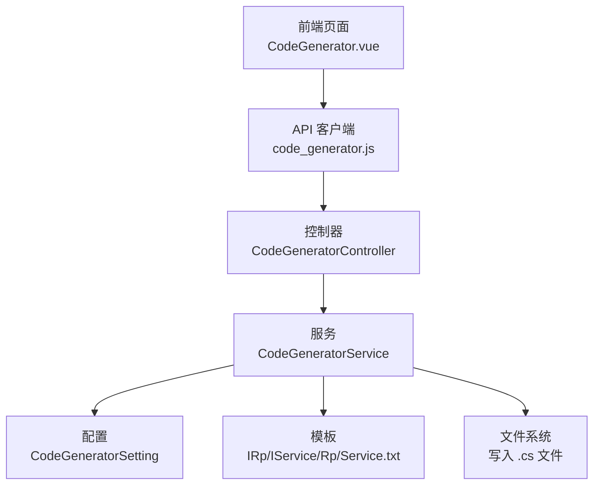
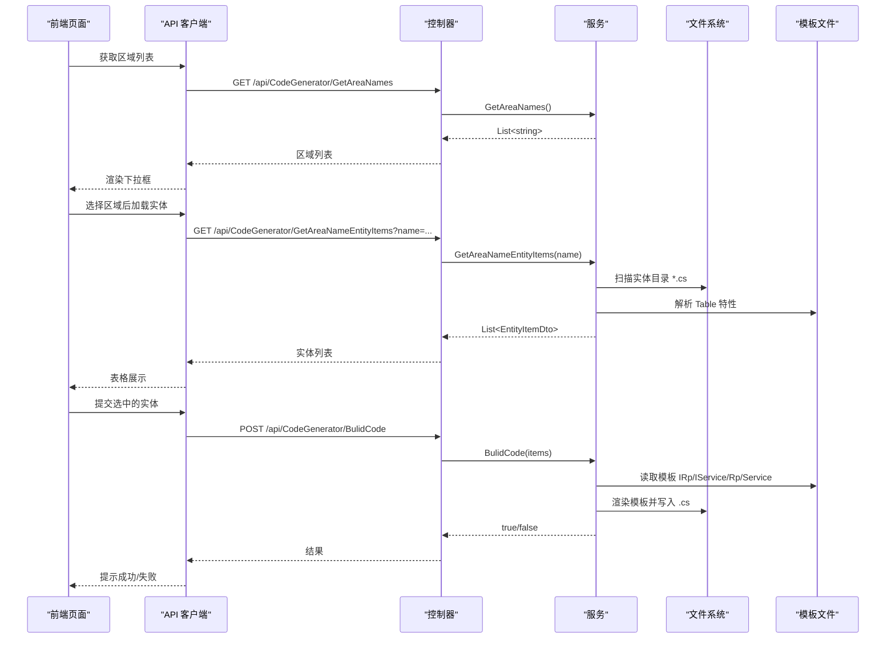
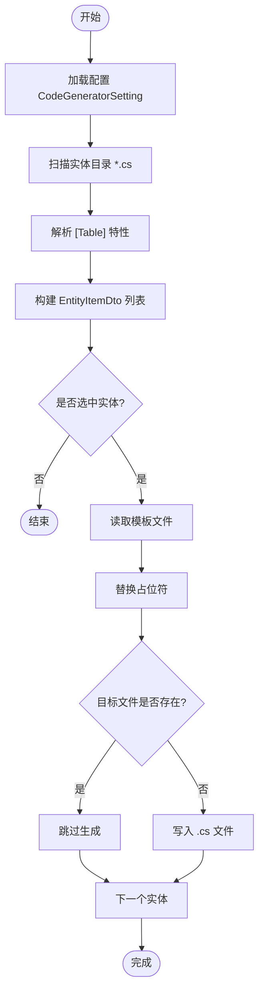
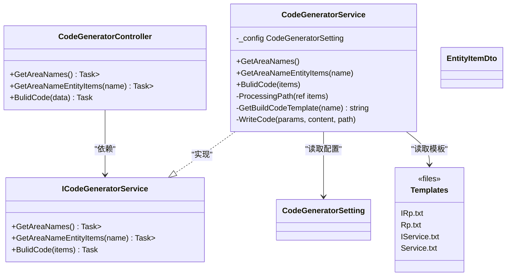

# 代码生成器接口

<cite>
**本文引用的文件**
- [CodeGeneratorController.cs](file://Kevin/ Kevin.Web.Basics/Controllers/CodeGeneratorController.cs)
- [ICodeGeneratorService.cs](file://Kevin/kevin.Module/kevin.CodeGenerator/ICodeGeneratorService.cs)
- [CodeGeneratorService.cs](file://Kevin/kevin.Module/kevin.CodeGenerator/CodeGeneratorService.cs)
- [EntityItemDto.cs](file://Kevin/kevin.Module/kevin.CodeGenerator/Dto/EntityItemDto.cs)
- [CodeGeneratorSetting.cs](file://Kevin/kevin.Module/kevin.CodeGenerator/Dto/CodeGeneratorSetting.cs)
- [IRp.txt](file://Kevin/kevin.Module/kevin.CodeGenerator/BuildCodeTemplate/IRp.txt)
- [Rp.txt](file://Kevin/kevin.Module/kevin.CodeGenerator/BuildCodeTemplate/Rp.txt)
- [IService.txt](file://Kevin/kevin.Module/kevin.CodeGenerator/BuildCodeTemplate/IService.txt)
- [Service.txt](file://Kevin/kevin.Module/kevin.CodeGenerator/BuildCodeTemplate/Service.txt)
- [ServiceCollectionExtensions.cs](file://Kevin/kevin.Module/kevin.CodeGenerator/ServiceCollectionExtensions.cs)
- [code_generator.js](file://vue/kevin.web.vue/src/api/code_generator.js)
- [CodeGenerator.vue](file://vue/kevin.web.vue/src/pages/CodeGenerator.vue)
</cite>

## 目录
1. [简介](#简介)
2. [项目结构](#项目结构)
3. [核心组件](#核心组件)
4. [架构总览](#架构总览)
5. [详细组件分析](#详细组件分析)
6. [依赖关系分析](#依赖关系分析)
7. [性能考虑](#性能考虑)
8. [故障排查指南](#故障排查指南)
9. [结论](#结论)
10. [附录](#附录)

## 简介
本模块提供基于数据库实体类（带表映射特性）自动生成后端仓储与服务基础代码的能力，包含：
- 按区域枚举实体、批量选择并生成代码
- 模板化代码生成（仓储接口与实现、服务接口与实现）
- 配置驱动的路径与命名空间策略
- 前端可视化界面用于选择区域与实体并触发生成

该能力聚焦于“后端仓储与服务”的自动化生成；控制器与路由需另行手动或借助其他工具注册。

## 项目结构
- Web 层暴露 REST 接口，供前端调用
- 服务层封装生成逻辑，读取配置与模板，写入目标路径
- DTO 定义输入输出与配置项
- 模板文件定义生成的代码骨架
- 前端页面与 API 客户端封装交互流程

图表来源
- [CodeGeneratorController.cs:15-73](file://Kevin/ Kevin.Web.Basics/Controllers/CodeGeneratorController.cs#L15-L73)
- [CodeGeneratorService.cs:17-219](file://Kevin/kevin.Module/kevin.CodeGenerator/CodeGeneratorService.cs#L17-L219)
- [CodeGeneratorSetting.cs:1-45](file://Kevin/kevin.Module/kevin.CodeGenerator/Dto/CodeGeneratorSetting.cs#L1-L45)
- [IRp.txt:1-11](file://Kevin/kevin.Module/kevin.CodeGenerator/BuildCodeTemplate/IRp.txt#L1-L11)
- [Rp.txt:1-16](file://Kevin/kevin.Module/kevin.CodeGenerator/BuildCodeTemplate/Rp.txt#L1-L16)
- [IService.txt:1-31](file://Kevin/kevin.Module/kevin.CodeGenerator/BuildCodeTemplate/IService.txt#L1-L31)
- [Service.txt:1-88](file://Kevin/kevin.Module/kevin.CodeGenerator/BuildCodeTemplate/Service.txt#L1-L88)

章节来源
- [CodeGeneratorController.cs:15-73](file://Kevin/ Kevin.Web.Basics/Controllers/CodeGeneratorController.cs#L15-L73)
- [CodeGeneratorService.cs:17-219](file://Kevin/kevin.Module/kevin.CodeGenerator/CodeGeneratorService.cs#L17-L219)
- [code_generator.js:1-16](file://vue/kevin.web.vue/src/api/code_generator.js#L1-L16)
- [CodeGenerator.vue:14-186](file://vue/kevin.web.vue/src/pages/CodeGenerator.vue#L14-L186)

## 核心组件
- 控制器 CodeGeneratorController：对外暴露三个 HTTP 端点，负责权限校验与参数转发
- 服务 CodeGeneratorService：实现区域枚举、实体扫描、模板渲染与文件写入
- DTO EntityItemDto：描述待生成实体的元数据与目标路径
- 配置 CodeGeneratorSetting/CodeGeneratorItem：定义区域、实体路径与各层生成路径
- 模板 IRp/IService/Rp/Service：定义生成的代码骨架与占位符替换规则
- 扩展 ServiceCollectionExtensions：将服务以 Scoped 生命周期注入容器，并支持配置绑定

章节来源
- [CodeGeneratorController.cs:24-73](file://Kevin/ Kevin.Web.Basics/Controllers/CodeGeneratorController.cs#L24-L73)
- [ICodeGeneratorService.cs:5-24](file://Kevin/kevin.Module/kevin.CodeGenerator/ICodeGeneratorService.cs#L5-L24)
- [CodeGeneratorService.cs:9-219](file://Kevin/kevin.Module/kevin.CodeGenerator/CodeGeneratorService.cs#L9-L219)
- [EntityItemDto.cs:3-30](file://Kevin/kevin.Module/kevin.CodeGenerator/Dto/EntityItemDto.cs#L3-L30)
- [CodeGeneratorSetting.cs:3-44](file://Kevin/kevin.Module/kevin.CodeGenerator/Dto/CodeGeneratorSetting.cs#L3-L44)
- [ServiceCollectionExtensions.cs:7-13](file://Kevin/kevin.Module/kevin.CodeGenerator/ServiceCollectionExtensions.cs#L7-L13)

## 架构总览
下图展示从前端到后端的完整调用链路与生成过程：

图表来源
- [CodeGeneratorController.cs:30-73](file://Kevin/ Kevin.Web.Basics/Controllers/CodeGeneratorController.cs#L30-L73)
- [CodeGeneratorService.cs:17-219](file://Kevin/kevin.Module/kevin.CodeGenerator/CodeGeneratorService.cs#L17-L219)
- [code_generator.js:1-16](file://vue/kevin.web.vue/src/api/code_generator.js#L1-L16)
- [CodeGenerator.vue:104-186](file://vue/kevin.web.vue/src/pages/CodeGenerator.vue#L104-L186)

## 详细组件分析

### 控制器 CodeGeneratorController
- 路由与访问控制
  - 路由前缀：/api/CodeGenerator
  - 需要认证：[Authorize]
  - 仅超级管理员可操作：内部对 CurrentUser.IsSuperAdmin 进行校验
- 接口清单
  - GET GetAreaNames：返回可用区域名称列表
  - GET GetAreaNameEntityItems：根据区域名返回该区域下的实体项集合
  - POST BulidCode：接收实体项集合，批量生成仓储与服务基础代码

章节来源
- [CodeGeneratorController.cs:15-73](file://Kevin/ Kevin.Web.Basics/Controllers/CodeGeneratorController.cs#L15-L73)

### 服务 CodeGeneratorService
- 区域与实体枚举
  - 从配置中读取区域列表
  - 根据 AreaPath 定位实体目录，递归扫描 .cs 文件
  - 使用正则匹配 [Table("...")] 特性，提取类名与表名
- 路径处理
  - 根据实体所在子目录动态追加到各层生成路径（IRp/Rp/IService/Service）
- 代码生成
  - 读取模板文件 IRp/IService/Rp/Service
  - 替换占位符：%entityName%、%entityNamespace%、%namespacePath%、%iRpBulidNamespace%、%iServiceBulidNamespace%
  - 若目标文件已存在则跳过，否则写入新文件
- 异常与边界
  - 区域不存在或路径无效时抛出参数异常
  - 非超级管理员直接拒绝

图表来源
- [CodeGeneratorService.cs:17-219](file://Kevin/kevin.Module/kevin.CodeGenerator/CodeGeneratorService.cs#L17-L219)

章节来源
- [CodeGeneratorService.cs:17-219](file://Kevin/kevin.Module/kevin.CodeGenerator/CodeGeneratorService.cs#L17-L219)

### DTO 与配置
- EntityItemDto
  - 字段：AreaName、EntityName、Description、IRpBulidPath、RpBulidPath、IServiceBulidPath、ServiceBulidPath
  - 用途：承载单个实体的元数据与目标生成路径
- CodeGeneratorSetting/CodeGeneratorItem
  - 字段：AreaName、AreaPath、IRpBulidPath、RpBulidPath、IServiceBulidPath、ServiceBulidPath
  - 用途：声明区域、实体源路径与各层代码的目标路径

章节来源
- [EntityItemDto.cs:3-30](file://Kevin/kevin.Module/kevin.CodeGenerator/Dto/EntityItemDto.cs#L3-L30)
- [CodeGeneratorSetting.cs:3-44](file://Kevin/kevin.Module/kevin.CodeGenerator/Dto/CodeGeneratorSetting.cs#L3-L44)

### 模板与生成产物
- 模板文件
  - IRp.txt：生成仓储接口 I{Entity}Rp，继承 IRepository<T{Entity}, long>
  - Rp.txt：生成仓储实现 {Entity}Rp，继承 Repository<T{Entity}, long> 并实现 I{Entity}Rp
  - IService.txt：生成服务接口 I{Entity}Service，继承 IBaseService，包含分页、新增编辑、删除方法
  - Service.txt：生成服务实现 {Entity}Service，继承 BaseService，注入 I{Entity}Rp，实现上述方法
- 占位符说明
  - %entityName%：实体名（去除前缀 T）
  - %entityNamespace%：实体所在命名空间
  - %namespacePath%：当前生成文件的命名空间
  - %iRpBulidNamespace%：仓储接口命名空间
  - %iServiceBulidNamespace%：服务接口命名空间

章节来源
- [IRp.txt:1-11](file://Kevin/kevin.Module/kevin.CodeGenerator/BuildCodeTemplate/IRp.txt#L1-L11)
- [Rp.txt:1-16](file://Kevin/kevin.Module/kevin.CodeGenerator/BuildCodeTemplate/Rp.txt#L1-L16)
- [IService.txt:1-31](file://Kevin/kevin.Module/kevin.CodeGenerator/BuildCodeTemplate/IService.txt#L1-L31)
- [Service.txt:1-88](file://Kevin/kevin.Module/kevin.CodeGenerator/BuildCodeTemplate/Service.txt#L1-L88)

### 依赖注入与配置绑定
- 通过 AddKevinCodeGenerator 扩展方法将 ICodeGeneratorService 以 Scoped 生命周期注册
- 使用 Configure(Action<CodeGeneratorSetting>) 绑定配置，支持运行时变更（IOptionsMonitor）

章节来源
- [ServiceCollectionExtensions.cs:7-13](file://Kevin/kevin.Module/kevin.CodeGenerator/ServiceCollectionExtensions.cs#L7-L13)
- [CodeGeneratorService.cs:13-16](file://Kevin/kevin.Module/kevin.CodeGenerator/CodeGeneratorService.cs#L13-L16)

### 前端集成
- API 客户端 code_generator.js
  - GetAreaNames：GET /api/CodeGenerator/GetAreaNames
  - GetAreaNameEntityItems：GET /api/CodeGenerator/GetAreaNameEntityItems?name=...
  - BulidCode：POST /api/CodeGenerator/BulidCode
- 页面 CodeGenerator.vue
  - 步骤一：选择区域并加载实体列表
  - 步骤二：勾选实体并批量生成代码
  - 错误与加载状态：统一提示与 loading 控制

章节来源
- [code_generator.js:1-16](file://vue/kevin.web.vue/src/api/code_generator.js#L1-L16)
- [CodeGenerator.vue:14-186](file://vue/kevin.web.vue/src/pages/CodeGenerator.vue#L14-L186)

## 依赖关系分析
- 控制器依赖服务 ICodeGeneratorService
- 服务依赖配置 CodeGeneratorSetting、模板文件、文件系统
- 前端依赖 API 客户端与页面组件

图表来源
- [CodeGeneratorController.cs:24-73](file://Kevin/ Kevin.Web.Basics/Controllers/CodeGeneratorController.cs#L24-L73)
- [ICodeGeneratorService.cs:5-24](file://Kevin/kevin.Module/kevin.CodeGenerator/ICodeGeneratorService.cs#L5-L24)
- [CodeGeneratorService.cs:9-219](file://Kevin/kevin.Module/kevin.CodeGenerator/CodeGeneratorService.cs#L9-L219)
- [EntityItemDto.cs:3-30](file://Kevin/kevin.Module/kevin.CodeGenerator/Dto/EntityItemDto.cs#L3-L30)
- [CodeGeneratorSetting.cs:3-44](file://Kevin/kevin.Module/kevin.CodeGenerator/Dto/CodeGeneratorSetting.cs#L3-L44)

## 性能考虑
- 实体扫描为全量递归遍历，建议合理划分 AreaPath，避免过大目录
- 模板渲染与文件写入为同步 IO，批量生成时注意磁盘 IO 压力
- 已存在文件会跳过写入，减少重复开销
- 可通过限制单次生成数量或异步任务拆分提升响应性（当前实现为同步阻塞）

## 故障排查指南
- 非超级管理员报错
  - 现象：调用任何接口均被拒绝
  - 原因：CurrentUser.IsSuperAdmin 校验未通过
  - 解决：使用具备超级管理员权限的账户登录
- 区域或路径不存在
  - 现象：GetAreaNameEntityItems 抛出参数异常
  - 原因：CodeGeneratorSetting 中配置的 AreaPath 指向的目录不存在
  - 解决：检查并修正配置中的 AreaPath
- 模板文件缺失
  - 现象：生成阶段读取模板失败
  - 原因：BuildCodeTemplate 下缺少对应 .txt 模板
  - 解决：确保 IRp/IService/Rp/Service 模板文件存在且可读
- 生成文件冲突
  - 现象：控制台提示文件已存在并跳过
  - 原因：目标路径已存在同名 .cs 文件
  - 解决：清理旧文件或调整生成路径

章节来源
- [CodeGeneratorController.cs:38-71](file://Kevin/ Kevin.Web.Basics/Controllers/CodeGeneratorController.cs#L38-L71)
- [CodeGeneratorService.cs:23-72](file://Kevin/kevin.Module/kevin.CodeGenerator/CodeGeneratorService.cs#L23-L72)
- [CodeGeneratorService.cs:179-217](file://Kevin/kevin.Module/kevin.CodeGenerator/CodeGeneratorService.cs#L179-L217)

## 结论
该代码生成器模块提供了面向后端仓储与服务的基础代码自动化能力，具备：
- 配置驱动的目录与命名空间策略
- 模板化的代码骨架生成
- 简单的前端交互界面
- 严格的权限控制

如需进一步扩展，可在模板层增加更多 CRUD 方法与业务钩子，或在服务层增强实体属性解析与校验。

## 附录

### API 接口定义
- 获取区域列表
  - 方法：GET
  - 路径：/api/CodeGenerator/GetAreaNames
  - 鉴权：需要登录且为超级管理员
  - 返回：字符串数组（区域名）
- 获取区域下的实体列表
  - 方法：GET
  - 路径：/api/CodeGenerator/GetAreaNameEntityItems
  - 查询参数：name（区域名，必填）
  - 鉴权：需要登录且为超级管理员
  - 返回：EntityItemDto 数组
- 生成仓储和服务基础代码
  - 方法：POST
  - 路径：/api/CodeGenerator/BulidCode
  - 请求体：EntityItemDto 数组
  - 鉴权：需要登录且为超级管理员
  - 返回：布尔值（true 表示成功）

章节来源
- [CodeGeneratorController.cs:30-73](file://Kevin/ Kevin.Web.Basics/Controllers/CodeGeneratorController.cs#L30-L73)
- [EntityItemDto.cs:3-30](file://Kevin/kevin.Module/kevin.CodeGenerator/Dto/EntityItemDto.cs#L3-L30)

### 配置项说明
- CodeGeneratorSetting.CodeGeneratorItems
  - AreaName：区域标识
  - AreaPath：实体类所在目录（相对或绝对路径）
  - IRpBulidPath：仓储接口生成路径（命名空间形式）
  - RpBulidPath：仓储实现生成路径（命名空间形式）
  - IServiceBulidPath：服务接口生成路径（命名空间形式）
  - ServiceBulidPath：服务实现生成路径（命名空间形式）

章节来源
- [CodeGeneratorSetting.cs:3-44](file://Kevin/kevin.Module/kevin.CodeGenerator/Dto/CodeGeneratorSetting.cs#L3-L44)

### 自定义模板开发指南
- 模板位置：BuildCodeTemplate/*.txt
- 占位符
  - %entityName%：实体名（不含前缀 T）
  - %entityNamespace%：实体命名空间
  - %namespacePath%：当前文件命名空间
  - %iRpBulidNamespace%：仓储接口命名空间
  - %iServiceBulidNamespace%：服务接口命名空间
- 扩展方式
  - 新增模板文件并在服务中加载与替换
  - 在 BulidCode 流程中增加新的生成步骤
  - 保持命名约定一致，便于自动识别与组织

章节来源
- [CodeGeneratorService.cs:179-217](file://Kevin/kevin.Module/kevin.CodeGenerator/CodeGeneratorService.cs#L179-L217)
- [IRp.txt:1-11](file://Kevin/kevin.Module/kevin.CodeGenerator/BuildCodeTemplate/IRp.txt#L1-L11)
- [Rp.txt:1-16](file://Kevin/kevin.Module/kevin.CodeGenerator/BuildCodeTemplate/Rp.txt#L1-L16)
- [IService.txt:1-31](file://Kevin/kevin.Module/kevin.CodeGenerator/BuildCodeTemplate/IService.txt#L1-L31)
- [Service.txt:1-88](file://Kevin/kevin.Module/kevin.CodeGenerator/BuildCodeTemplate/Service.txt#L1-L88)