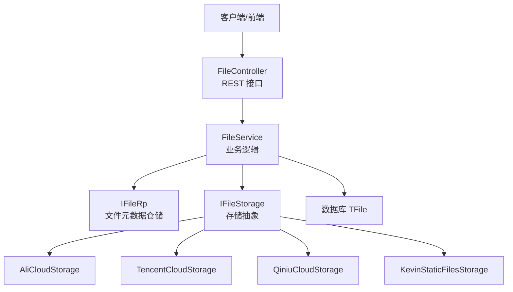
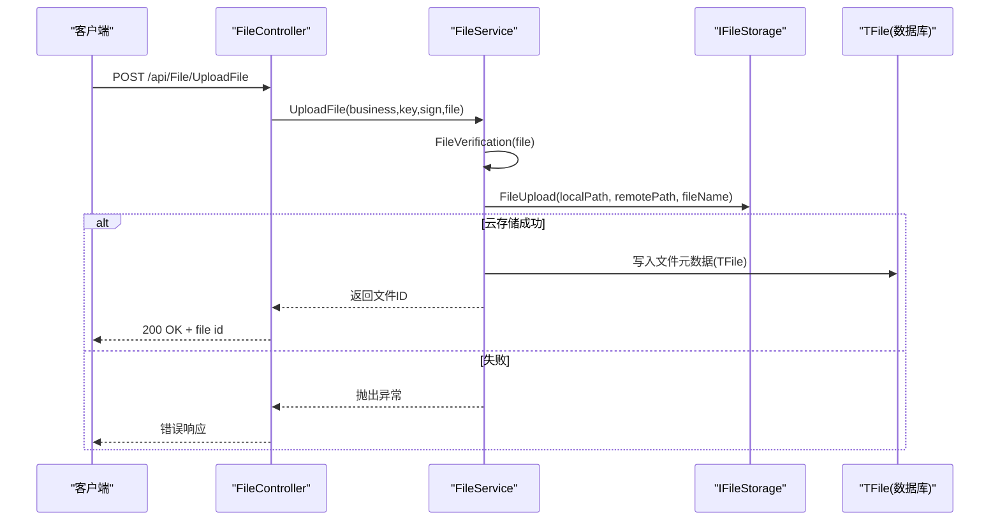
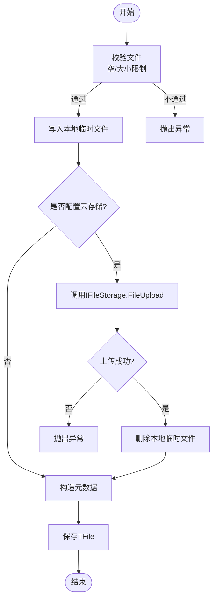
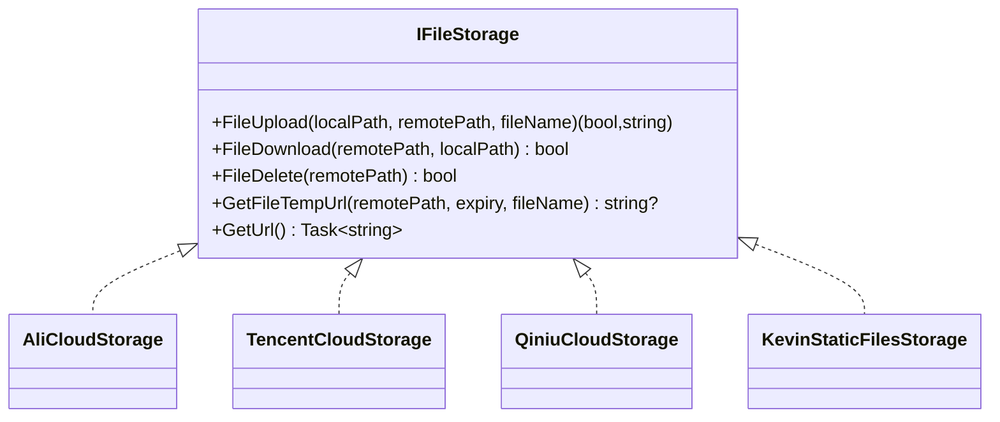
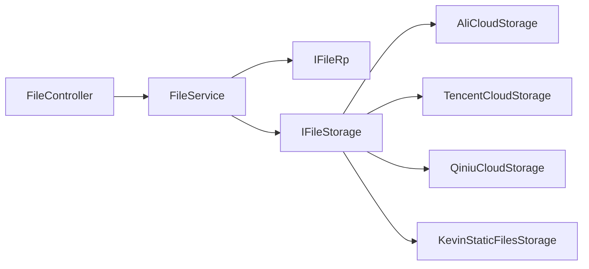

# 文件操作接口

<cite>
**本文引用的文件**
- [FileController.cs](file://Kevin/Kevin.Web.Basics/Controllers/FileController.cs)
- [FileService.cs](file://Kevin/Application/Services/FileService.cs)
- [IFileStorage.cs](file://Kevin/kevin.Share/Interfaces/IFileStorage.cs)
- [TFile.cs](file://Kevin/Domain/Entities/TFile.cs)
- [ServiceCollectionExtensions.cs](file://Kevin/kevin.Module/kevin.FileStorage/ServiceCollectionExtensions.cs)
- [AliCloudStorage.cs](file://Kevin/kevin.Module/kevin.FileStorage/AliCloud/AliCloudStorage.cs)
- [TencentCloudStorage.cs](file://Kevin/kevin.Module/kevin.FileStorage/TencentCloud/TencentCloudStorage.cs)
- [QiniuCloudStorage.cs](file://Kevin/kevin.Module/kevin.FileStorage/QiniuCloud/QiniuCloudStorage.cs)
- [appsettings.json](file://App/WebApi/appsettings.json)
- [file.js](file://vue/kevin.web.vue/src/api/file.js)
</cite>

## 目录
1. [简介](#简介)
2. [项目结构](#项目结构)
3. [核心组件](#核心组件)
4. [架构总览](#架构总览)
5. [详细组件分析](#详细组件分析)
6. [依赖关系分析](#依赖关系分析)
7. [性能与并发](#性能与并发)
8. [安全与防护](#安全与防护)
9. [故障排查](#故障排查)
10. [结论](#结论)
11. [附录：云存储配置说明](#附录：云存储配置说明)

## 简介
本模块提供统一的文件操作能力，包括上传（单文件、批量、远程）、下载、预览（图片缩放）、删除等基础功能，并通过可插拔的云存储抽象（阿里云、腾讯云、七牛云、本地静态文件）实现多后端存储。服务层负责业务校验、持久化元数据与调用存储抽象；控制器暴露REST API；前端通过统一API封装进行交互。

## 项目结构
- 控制器层：定义HTTP端点，接收请求并委托给服务层处理。
- 服务层：实现文件上传、下载、路径解析、删除、远程拉取等核心逻辑，并调用存储抽象。
- 存储抽象：定义统一的IFileStorage接口，支持多种云厂商或本地存储实现。
- 实体模型：文件元数据持久化到数据库表TFile。
- 前端API：封装常用文件操作调用，便于页面集成。

图表来源
- [FileController.cs:15-213](file://Kevin/Kevin.Web.Basics/Controllers/FileController.cs#L15-L213)
- [FileService.cs:8-256](file://Kevin/Application/Services/FileService.cs#L8-L256)
- [IFileStorage.cs:3-48](file://Kevin/kevin.Share/Interfaces/IFileStorage.cs#L3-L48)
- [ServiceCollectionExtensions.cs:9-52](file://Kevin/kevin.Module/kevin.FileStorage/ServiceCollectionExtensions.cs#L9-L52)

章节来源
- [FileController.cs:15-213](file://Kevin/Kevin.Web.Basics/Controllers/FileController.cs#L15-L213)
- [FileService.cs:8-256](file://Kevin/Application/Services/FileService.cs#L8-L256)
- [IFileStorage.cs:3-48](file://Kevin/kevin.Share/Interfaces/IFileStorage.cs#L3-L48)
- [ServiceCollectionExtensions.cs:9-52](file://Kevin/kevin.Module/kevin.FileStorage/ServiceCollectionExtensions.cs#L9-L52)

## 核心组件
- FileController：对外暴露文件上传、下载、预览、删除等接口。
- FileService：实现文件验证、大小限制、上传流程、下载流处理、路径获取、删除标记等。
- IFileStorage：统一存储抽象，屏蔽不同云厂商差异。
- TFile：文件元数据实体，包含名称、路径、URL、关联表及ID、标记等。
- 云存储实现：阿里云、腾讯云、七牛云、本地静态文件。

章节来源
- [FileController.cs:15-213](file://Kevin/Kevin.Web.Basics/Controllers/FileController.cs#L15-L213)
- [FileService.cs:8-256](file://Kevin/Application/Services/FileService.cs#L8-L256)
- [IFileStorage.cs:3-48](file://Kevin/kevin.Share/Interfaces/IFileStorage.cs#L3-L48)
- [TFile.cs:7-70](file://Kevin/Domain/Entities/TFile.cs#L7-L70)

## 架构总览
整体采用“控制器-服务-存储抽象”的分层架构。控制器仅做参数绑定与转发；服务层负责业务规则（如大小限制、临时文件清理、元数据落库）；存储抽象负责与具体云厂商SDK交互。通过依赖注入在启动时注册具体存储实现，从而灵活切换后端。

图表来源
- [FileController.cs:46-61](file://Kevin/Kevin.Web.Basics/Controllers/FileController.cs#L46-L61)
- [FileService.cs:169-236](file://Kevin/Application/Services/FileService.cs#L169-L236)
- [IFileStorage.cs:5-12](file://Kevin/kevin.Share/Interfaces/IFileStorage.cs#L5-L12)

## 详细组件分析

### 控制器：FileController
- 路由前缀：/api/File
- 主要接口
  - 远程单文件上传：POST /api/File/RemoteUploadFile
  - 单文件上传：POST /api/File/UploadFile
  - 批量上传：POST /api/File/BatchUploadFile
  - 获取文件内容：GET /api/File/GetFile?fileid=...
  - 获取文件信息：GET /api/File/GetById?Id=...
  - 图片预览（可缩放）：GET /api/File/GetImage?fileId=...&width=...&height=...
  - 获取文件访问路径：GET /api/File/GetFilePath?fileid=...
  - 删除文件：DELETE /api/File/DeleteFile?id=...
- 权限控制：部分接口允许匿名访问（如GetFile、GetImage），上传接口需鉴权。

章节来源
- [FileController.cs:31-210](file://Kevin/Kevin.Web.Basics/Controllers/FileController.cs#L31-L210)

### 服务：FileService
- 上传流程
  - 校验：空文件检查、大小限制（默认50MB，可通过字典配置覆盖）。
  - 本地暂存：生成日期目录与唯一文件名，写入临时文件。
  - 云存储：若配置了IFileStorage则调用上传；成功后删除本地临时文件，并记录URL。
  - 元数据：写入TFile（名称、路径、URL、业务标识、租户、创建人等）。
- 下载流程
  - 根据fileid查询TFile，若存在Url则先下载到本地再读取流返回；否则直接读取本地文件。
  - 自动识别MIME类型并设置Content-Type。
- 图片预览
  - 基于SkiaSharp对图片进行等比缩放，支持只指定宽或高。
- 删除
  - 软删除：将IsDelete置为true并记录删除时间。

图表来源
- [FileService.cs:169-236](file://Kevin/Application/Services/FileService.cs#L169-L236)
- [FileService.cs:238-253](file://Kevin/Application/Services/FileService.cs#L238-L253)

章节来源
- [FileService.cs:22-253](file://Kevin/Application/Services/FileService.cs#L22-L253)

### 存储抽象：IFileStorage 与各实现
- 接口能力
  - 上传：FileUpload(localPath, remotePath, fileName?)
  - 下载：FileDownload(remotePath, localPath)
  - 删除：FileDelete(remotePath)
  - 临时URL：GetFileTempUrl(remotePath, expiry, fileName?)
  - 域名前缀：GetUrl()
- 实现
  - 阿里云：使用OSS SDK，支持删除、下载等。
  - 腾讯云：使用COSXML，配置连接超时、读写超时、HTTPS等。
  - 七牛云：使用官方SDK，支持私有链接签名与自定义下载名。
  - 本地静态文件：作为兜底实现。

图表来源
- [IFileStorage.cs:3-48](file://Kevin/kevin.Share/Interfaces/IFileStorage.cs#L3-L48)
- [AliCloudStorage.cs:1-43](file://Kevin/kevin.Module/kevin.FileStorage/AliCloud/AliCloudStorage.cs#L1-L43)
- [TencentCloudStorage.cs:1-32](file://Kevin/kevin.Module/kevin.FileStorage/TencentCloud/TencentCloudStorage.cs#L1-L32)
- [QiniuCloudStorage.cs:1-91](file://Kevin/kevin.Module/kevin.FileStorage/QiniuCloud/QiniuCloudStorage.cs#L1-L91)

章节来源
- [IFileStorage.cs:3-48](file://Kevin/kevin.Share/Interfaces/IFileStorage.cs#L3-L48)
- [AliCloudStorage.cs:1-43](file://Kevin/kevin.Module/kevin.FileStorage/AliCloud/AliCloudStorage.cs#L1-L43)
- [TencentCloudStorage.cs:1-32](file://Kevin/kevin.Module/kevin.FileStorage/TencentCloud/TencentCloudStorage.cs#L1-L32)
- [QiniuCloudStorage.cs:1-九十一:1-91](file://Kevin/kevin.Module/kevin.FileStorage/QiniuCloud/QiniuCloudStorage.cs#L1-L91)

### 前端API封装：file.js
- 提供单文件上传、批量上传、远程上传、下载、图片获取、路径获取、信息获取、删除等方法。
- 下载通过Blob方式触发浏览器下载；图片获取返回二进制流供渲染。

章节来源
- [file.js:7-151](file://vue/kevin.web.vue/src/api/file.js#L7-L151)

## 依赖关系分析
- 控制器依赖服务：FileController -> FileService
- 服务依赖仓储与存储：FileService -> IFileRp, IFileStorage
- 存储抽象解耦：IFileStorage 由启动时注入具体实现（阿里云/腾讯云/七牛/本地）
- 配置集中管理：appsettings.json 中各云存储配置项

图表来源
- [FileController.cs:24-29](file://Kevin/Kevin.Web.Basics/Controllers/FileController.cs#L24-L29)
- [FileService.cs:14-20](file://Kevin/Application/Services/FileService.cs#L14-L20)
- [ServiceCollectionExtensions.cs:16-51](file://Kevin/kevin.Module/kevin.FileStorage/ServiceCollectionExtensions.cs#L16-L51)

章节来源
- [ServiceCollectionExtensions.cs:16-51](file://Kevin/kevin.Module/kevin.FileStorage/ServiceCollectionExtensions.cs#L16-L51)
- [appsettings.json:67-87](file://App/WebApi/appsettings.json#L67-L87)

## 性能与并发
- 当前实现要点
  - 上传：先写本地临时文件，再调用云存储上传；成功后删除临时文件。
  - 下载：若存在Url则先下载到本地再读取流返回，避免跨域直链问题。
  - 图片预览：内存中缩放后返回PNG流。
- 建议优化方向（通用指导）
  - 大文件分片上传：在服务层增加分片合并逻辑，结合断点续传（记录已上传分片索引），降低网络抖动影响。
  - 并发控制：对同一文件或同租户的上传进行排队或限流，避免瞬时峰值导致IO瓶颈。
  - 流式处理：尽量使用流式读写，减少内存占用；对超大文件考虑边读边传。
  - 缓存策略：对频繁访问的图片可引入CDN或对象存储公共读+签名URL。
- 注意
  - 当前代码未内置分片与断点续传逻辑；如需扩展，可在FileService中新增方法并在控制器暴露新端点。

[本节为通用性能建议，不直接分析具体文件]

## 安全与防护
- 文件大小限制
  - 默认上限50MB，可通过系统字典配置项覆盖。
- 文件类型验证
  - 当前未对扩展名或MIME做白名单校验；建议在FileVerification中增加扩展名与MIME双重校验。
- 安全扫描
  - 当前未集成病毒扫描；可在上传成功后、入库前插入异步扫描任务，失败则拒绝入库并通知。
- 访问控制
  - 上传接口需要鉴权；下载/预览接口允许匿名访问，生产环境建议按需改为鉴权或签名URL。
- 敏感信息
  - 云存储密钥请通过环境变量或安全配置中心注入，避免硬编码。

章节来源
- [FileService.cs:238-253](file://Kevin/Application/Services/FileService.cs#L238-L253)
- [FileController.cs:101-107](file://Kevin/Kevin.Web.Basics/Controllers/FileController.cs#L101-L107)

## 故障排查
- 上传失败
  - 检查文件大小是否超过限制；确认IFileStorage已正确注入且配置有效。
  - 查看临时文件是否被清理；确认磁盘空间充足。
- 下载为空或报错
  - 确认TFile.Path是否存在；若Url存在但无法访问，检查云存储权限与域名配置。
- 图片预览异常
  - 确认文件为图片格式；检查SkiaSharp依赖与资源路径。
- 删除无效
  - 当前为软删除，确认IsDelete字段状态；如需物理删除，需在IFileStorage实现中补充删除逻辑。

章节来源
- [FileService.cs:48-91](file://Kevin/Application/Services/FileService.cs#L48-L91)
- [FileService.cs:169-236](file://Kevin/Application/Services/FileService.cs#L169-L236)

## 结论
该文件操作模块以清晰的层次划分和可插拔的存储抽象实现了通用的文件管理能力，满足上传、下载、预览、删除等常见场景。通过配置即可切换不同云存储后端。后续可按需增强大文件分片、断点续传、并发控制与安全扫描等高级特性，以提升稳定性与安全性。

[本节为总结性内容，不直接分析具体文件]

## 附录：云存储配置说明
- 配置文件位置：appsettings.json
- 关键配置项
  - 阿里云：Endpoint、AccessKeyId、AccessKeySecret、BucketName、Url
  - 腾讯云：AppId、Region、SecretId、SecretKey、BucketName、Url
  - 七牛云：AccessKey、SecretKey、domain、Bucket
- 启用方式
  - 在应用启动时通过ServiceCollectionExtensions中的扩展方法注册对应存储实现（AddAliCloudStorage/AddTencentCloudStorage/AddQiniuCloudStorage/AddKevinStaticFilesStorage）。

章节来源
- [appsettings.json:67-87](file://App/WebApi/appsettings.json#L67-L87)
- [ServiceCollectionExtensions.cs:16-51](file://Kevin/kevin.Module/kevin.FileStorage/ServiceCollectionExtensions.cs#L16-L51)