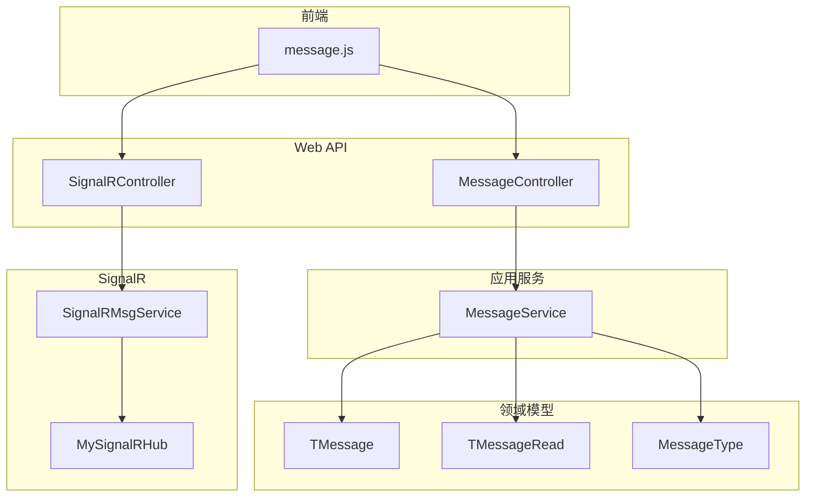
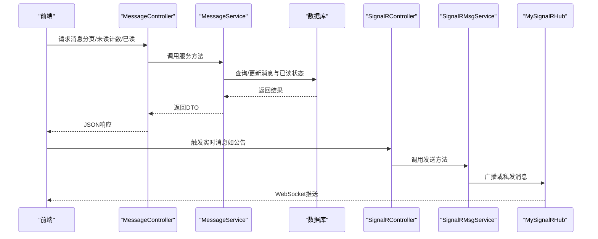
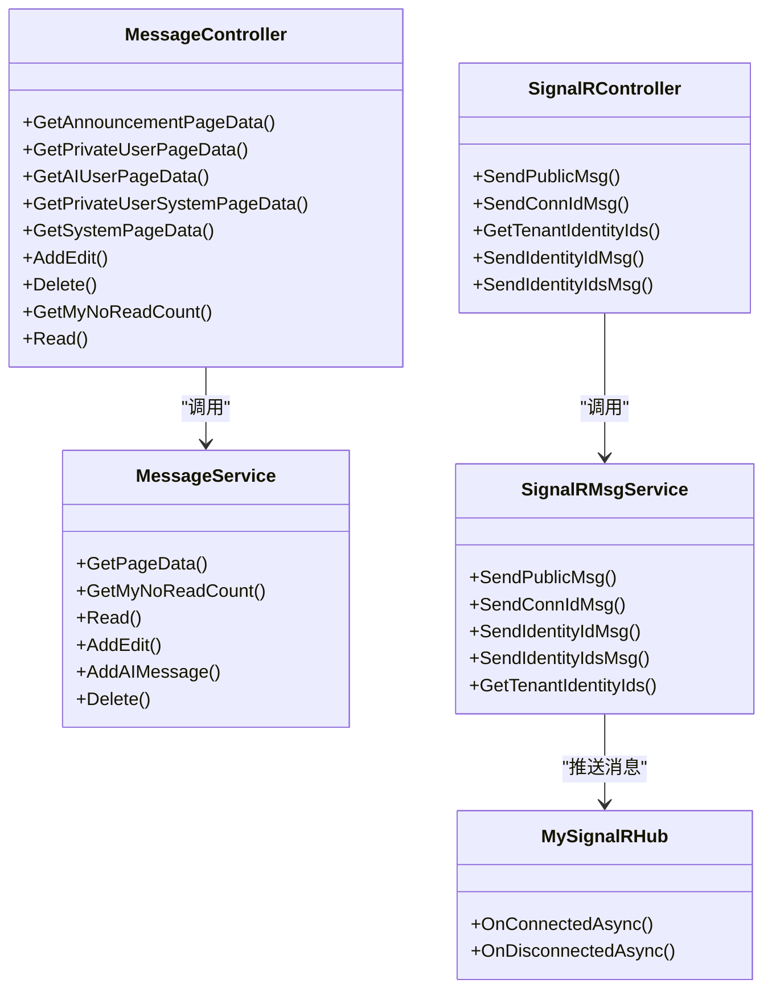
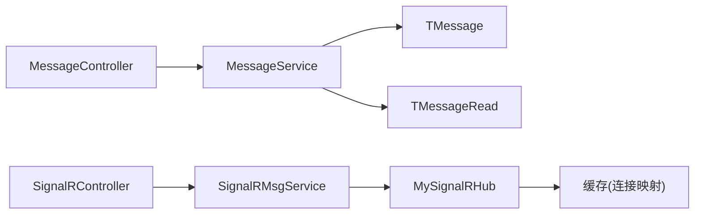
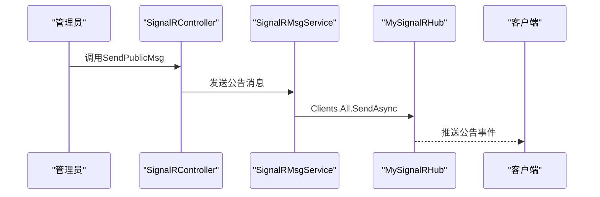

# 消息通知接口

<cite>
**本文引用的文件**
- [MessageController.cs](file://Kevin/ Kevin.Web.Basics/Controllers/MessageController.cs)
- [SignalRController.cs](file://Kevin/ Kevin.Web.Basics/Controllers/SignalRController.cs)
- [MessageService.cs](file://Kevin/Application/Services/MessageService.cs)
- [IMessageService.cs](file://Kevin/Domain/Interfaces/IServices/IMessageService.cs)
- [TMessage.cs](file://Kevin/Domain/Entities/TMessage.cs)
- [TMessageRead.cs](file://Kevin/Domain/Entities/TMessageRead.cs)
- [MessageType.cs](file://Kevin/kevin.Share/Enums/MessageType.cs)
- [MySignalRHub.cs](file://Kevin/kevin.Module/Kevin.SignalR/MySignalRHub.cs)
- [SignalRMsgService.cs](file://Kevin/kevin.Module/Kevin.SignalR/Service/SignalRMsgService.cs)
- [message.js](file://vue/kevin.web.vue/src/api/message.js)
</cite>

## 目录
1. [简介](#简介)
2. [项目结构](#项目结构)
3. [核心组件](#核心组件)
4. [架构总览](#架构总览)
5. [详细组件分析](#详细组件分析)
6. [依赖关系分析](#依赖关系分析)
7. [性能考虑](#性能考虑)
8. [故障排查指南](#故障排查指南)
9. [结论](#结论)
10. [附录](#附录)

## 简介
本文件为消息通知系统的API接口文档，覆盖私信、公告、系统通知等消息类型的管理接口，并说明基于SignalR的实时推送机制与客户端集成方式。同时给出后端在消息持久化、分页查询、已读标记、未读计数等方面的设计要点，以及移动端与Web端实现实时同步的建议方案。

## 项目结构
消息通知相关代码主要分布在以下层次：
- Web API层：提供HTTP接口（消息管理、SignalR管理）
- 应用服务层：封装业务逻辑（消息CRUD、分页、已读、未读计数）
- 领域模型层：消息实体与已读记录
- SignalR模块：Hub连接管理与消息广播服务
- 前端：Vue工程中的消息API调用封装

图表来源
- [MessageController.cs:1-140](file://Kevin/ Kevin.Web.Basics/Controllers/MessageController.cs#L1-L140)
- [SignalRController.cs:1-94](file://Kevin/ Kevin.Web.Basics/Controllers/SignalRController.cs#L1-L94)
- [MessageService.cs:1-186](file://Kevin/Application/Services/MessageService.cs#L1-L186)
- [TMessage.cs:1-55](file://Kevin/Domain/Entities/TMessage.cs#L1-L55)
- [TMessageRead.cs:1-21](file://Kevin/Domain/Entities/TMessageRead.cs#L1-L21)
- [MessageType.cs:1-22](file://Kevin/kevin.Share/Enums/MessageType.cs#L1-L22)
- [MySignalRHub.cs:1-176](file://Kevin/kevin.Module/Kevin.SignalR/MySignalRHub.cs#L1-L176)
- [SignalRMsgService.cs:1-132](file://Kevin/kevin.Module/Kevin.SignalR/Service/SignalRMsgService.cs#L1-L132)
- [message.js:1-37](file://vue/kevin.web.vue/src/api/message.js#L1-L37)

章节来源
- [MessageController.cs:1-140](file://Kevin/ Kevin.Web.Basics/Controllers/MessageController.cs#L1-L140)
- [SignalRController.cs:1-94](file://Kevin/ Kevin.Web.Basics/Controllers/SignalRController.cs#L1-L94)
- [MessageService.cs:1-186](file://Kevin/Application/Services/MessageService.cs#L1-L186)
- [TMessage.cs:1-55](file://Kevin/Domain/Entities/TMessage.cs#L1-L55)
- [TMessageRead.cs:1-21](file://Kevin/Domain/Entities/TMessageRead.cs#L1-L21)
- [MessageType.cs:1-22](file://Kevin/kevin.Share/Enums/MessageType.cs#L1-L22)
- [MySignalRHub.cs:1-176](file://Kevin/kevin.Module/Kevin.SignalR/MySignalRHub.cs#L1-L176)
- [SignalRMsgService.cs:1-132](file://Kevin/kevin.Module/Kevin.SignalR/Service/SignalRMsgService.cs#L1-L132)
- [message.js:1-37](file://vue/kevin.web.vue/src/api/message.js#L1-L37)

## 核心组件
- 消息控制器（MessageController）：对外暴露消息管理的HTTP接口，包括公告、私信、系统消息的分页查询、新增编辑、删除、已读标记、未读计数等。
- 信号R控制器（SignalRController）：对外暴露SignalR消息发送接口，支持公告广播、按连接ID私发、按身份ID私发及批量私发。
- 消息服务（MessageService）：实现消息的分页查询、未读计数、已读标记、新增编辑、AI消息写入、删除等业务逻辑。
- SignalR Hub（MySignalRHub）：处理客户端连接与断开，维护租户维度的连接映射（IdentityId到ConnectionId）。
- 信号R消息服务（SignalRMsgService）：封装对Hub的调用，提供公告广播、单发、群发、按身份ID发送等方法。
- 数据模型：TMessage（消息）、TMessageRead（已读记录）、MessageType（消息类型枚举）。

章节来源
- [MessageController.cs:1-140](file://Kevin/ Kevin.Web.Basics/Controllers/MessageController.cs#L1-L140)
- [SignalRController.cs:1-94](file://Kevin/ Kevin.Web.Basics/Controllers/SignalRController.cs#L1-L94)
- [MessageService.cs:1-186](file://Kevin/Application/Services/MessageService.cs#L1-L186)
- [MySignalRHub.cs:1-176](file://Kevin/kevin.Module/Kevin.SignalR/MySignalRHub.cs#L1-L176)
- [SignalRMsgService.cs:1-132](file://Kevin/kevin.Module/Kevin.SignalR/Service/SignalRMsgService.cs#L1-L132)
- [TMessage.cs:1-55](file://Kevin/Domain/Entities/TMessage.cs#L1-L55)
- [TMessageRead.cs:1-21](file://Kevin/Domain/Entities/TMessageRead.cs#L1-L21)
- [MessageType.cs:1-22](file://Kevin/kevin.Share/Enums/MessageType.cs#L1-L22)

## 架构总览
消息通知系统采用分层架构：
- 表现层：ASP.NET Core控制器提供RESTful API
- 服务层：应用服务封装业务规则与数据访问编排
- 数据层：通过仓储访问数据库，持久化消息与已读状态
- 实时通信：SignalR Hub负责连接管理与消息分发，结合缓存存储连接映射
- 前端：Vue工程通过API调用获取消息列表，并通过SignalR接收实时推送

图表来源
- [MessageController.cs:1-140](file://Kevin/ Kevin.Web.Basics/Controllers/MessageController.cs#L1-L140)
- [MessageService.cs:1-186](file://Kevin/Application/Services/MessageService.cs#L1-L186)
- [SignalRController.cs:1-94](file://Kevin/ Kevin.Web.Basics/Controllers/SignalRController.cs#L1-L94)
- [SignalRMsgService.cs:1-132](file://Kevin/kevin.Module/Kevin.SignalR/Service/SignalRMsgService.cs#L1-L132)
- [MySignalRHub.cs:1-176](file://Kevin/kevin.Module/Kevin.SignalR/MySignalRHub.cs#L1-L176)

## 详细组件分析

### 消息管理API（MessageController）
- 公告分页：GetAnnouncementPageData
  - 作用：获取公司公告消息的分页数据
  - 参数：分页对象，内部强制设置消息类型为公告
  - 返回：分页数据集合
- 我的私信分页：GetPrivateUserPageData
  - 作用：获取当前用户的私人私信消息分页
  - 参数：分页对象，内部设置消息类型为私人私信并限定用户
  - 返回：分页数据集合
- AI消息分页：GetAIUserPageData
  - 作用：获取当前用户的AI消息分页
  - 参数：分页对象，内部设置消息类型为AI并限定用户
  - 返回：分页数据集合
- 我的系统私信分页：GetPrivateUserSystemPageData
  - 作用：获取当前用户的私人系统消息分页
  - 参数：分页对象，内部设置消息类型为私人系统消息并限定用户
  - 返回：分页数据集合
- 系统消息分页：GetSystemPageData
  - 作用：获取公共系统消息分页
  - 参数：分页对象，内部设置消息类型为系统
  - 返回：分页数据集合
- 新增或编辑：AddEdit
  - 作用：新增或编辑消息（标题、内容、发送人、接收人、关联信息等）
  - 参数：消息DTO
  - 返回：布尔结果
- 删除：Delete
  - 作用：软删除消息
  - 参数：消息ID
  - 返回：布尔结果
- 未读数量：GetMyNoReadCount
  - 作用：获取当前用户的未读消息数量（支持按类型筛选）
  - 参数：消息类型（默认全部）
  - 返回：未读数量
- 已读标记：Read
  - 作用：将指定消息标记为已读
  - 参数：消息ID
  - 返回：布尔结果

章节来源
- [MessageController.cs:33-137](file://Kevin/ Kevin.Web.Basics/Controllers/MessageController.cs#L33-L137)

### 消息服务（MessageService）
- 分页查询：GetPageData
  - 过滤条件：租户隔离、关键词搜索、关联ID、用户ID、消息类型
  - 结果增强：附加已读状态、附件信息、创建者名称
  - 复杂度：O(N)扫描+排序，N为符合条件的消息数
- 未读计数：GetMyNoReadCount
  - 逻辑：查询当前用户相关的消息（发送方、接收方、系统、公告），再排除已读记录
  - 复杂度：两次查询（消息与已读），合并过滤
- 已读标记：Read
  - 逻辑：插入一条已读记录（包含消息ID、当前用户、时间戳、租户）
- 新增编辑：AddEdit
  - 逻辑：根据ID判断新增或更新；新增时生成雪花ID、设置租户与创建信息；更新时填充更新时间与操作人
- AI消息：AddAIMessage
  - 逻辑：以AI发送人为创建者，自动解析租户ID并持久化
- 删除：Delete
  - 逻辑：软删除，记录删除时间与操作人

章节来源
- [MessageService.cs:22-183](file://Kevin/Application/Services/MessageService.cs#L22-L183)

### 数据模型
- TMessage（消息）
  - 字段：标题、内容、消息类型、发送人、接收人、关联ID与表名
  - 用途：承载私信、公告、系统消息等所有消息实体
- TMessageRead（已读记录）
  - 字段：消息ID、创建用户、时间戳、租户
  - 用途：记录用户对某条消息的已读状态
- MessageType（消息类型）
  - 值：公告、私人私信、公共系统、私人系统、全部（仅筛选）、AI（仅筛选）

章节来源
- [TMessage.cs:5-52](file://Kevin/Domain/Entities/TMessage.cs#L5-L52)
- [TMessageRead.cs:3-18](file://Kevin/Domain/Entities/TMessageRead.cs#L3-L18)
- [MessageType.cs:5-20](file://Kevin/kevin.Share/Enums/MessageType.cs#L5-L20)

### SignalR实时推送（SignalRController + MySignalRHub + SignalRMsgService）
- 控制器接口
  - SendPublicMsg：向所有连接广播公告消息
  - SendConnIdMsg：向指定连接ID私发消息
  - GetTenantIdentityIds：获取租户内所有身份ID
  - SendIdentityIdMsg：向指定身份ID私发消息
  - SendIdentityIdsMsg：批量向多个身份ID私发消息
- Hub连接管理
  - OnConnectedAsync：建立连接时，将IdentityId与ConnectionId映射存入缓存（按租户维度）
  - OnDisconnectedAsync：断开连接时，清理对应映射
- 消息服务
  - 提供广播、单发、群发、按身份ID发送等方法
  - 通过缓存读取连接映射，定位目标ConnectionId进行推送

图表来源
- [MessageController.cs:1-140](file://Kevin/ Kevin.Web.Basics/Controllers/MessageController.cs#L1-L140)
- [MessageService.cs:1-186](file://Kevin/Application/Services/MessageService.cs#L1-L186)
- [SignalRController.cs:1-94](file://Kevin/ Kevin.Web.Basics/Controllers/SignalRController.cs#L1-L94)
- [MySignalRHub.cs:1-176](file://Kevin/kevin.Module/Kevin.SignalR/MySignalRHub.cs#L1-L176)
- [SignalRMsgService.cs:1-132](file://Kevin/kevin.Module/Kevin.SignalR/Service/SignalRMsgService.cs#L1-L132)

### 前端集成（Vue）
- 提供的API封装
  - 获取未读数量：GetMyNoReadCount
  - 系统消息分页：getSystemPageData
  - 新增编辑：addEditMessage
  - 删除：deleteMessage
  - 已读标记：readMessage
  - 我的消息：getPrivateUserSystemPageData、getPrivateUserPageData
  - 公告分页：getAnnouncementPageData
  - AI消息分页：getAIUserPageData
- 建议集成方式
  - 页面加载时调用分页接口拉取历史消息
  - 定时轮询未读数量接口刷新角标
  - 建立SignalR连接，订阅服务端推送事件，实时更新消息列表与未读数

章节来源
- [message.js:1-37](file://vue/kevin.web.vue/src/api/message.js#L1-L37)

## 依赖关系分析
- 控制器与服务解耦：MessageController依赖IMessageService，SignalRController依赖ISignalRMsgService
- 服务与仓储/实体：MessageService通过仓储访问TMessage与TMessageRead，使用枚举MessageType进行筛选
- SignalR与缓存：MySignalRHub在连接生命周期中读写缓存，维护租户维度的连接映射；SignalRMsgService据此定位目标连接进行推送
- 前端与后端：前端通过HTTP与WebSocket两种通道与后端交互，分别用于数据查询与实时推送

图表来源
- [MessageController.cs:1-140](file://Kevin/ Kevin.Web.Basics/Controllers/MessageController.cs#L1-L140)
- [MessageService.cs:1-186](file://Kevin/Application/Services/MessageService.cs#L1-L186)
- [SignalRController.cs:1-94](file://Kevin/ Kevin.Web.Basics/Controllers/SignalRController.cs#L1-L94)
- [SignalRMsgService.cs:1-132](file://Kevin/kevin.Module/Kevin.SignalR/Service/SignalRMsgService.cs#L1-L132)
- [MySignalRHub.cs:1-176](file://Kevin/kevin.Module/Kevin.SignalR/MySignalRHub.cs#L1-L176)

## 性能考虑
- 分页查询优化：使用跳过与限制（Skip/Take）减少数据传输量；按需Include关联数据避免N+1问题
- 未读计数缓存：接口使用了缓存过滤器（TTL=600秒），降低高频查询压力
- 已读标记原子性：插入已读记录应保证幂等，避免重复标记导致数据膨胀
- SignalR连接映射：缓存键需具备租户隔离，防止跨租户误推；连接断开时需及时清理，避免内存泄漏
- 大数据量场景：可引入消息队列异步落库与推送，提升吞吐与稳定性（见“扩展建议”）

[本节为通用指导，不直接分析具体文件]

## 故障排查指南
- 未读数量异常
  - 检查是否已正确插入已读记录（TMessageRead）
  - 确认查询条件是否正确包含发送方、接收方、系统与公告类型
- 消息列表为空
  - 检查租户隔离条件与用户权限
  - 确认分页参数与搜索关键字
- SignalR推送失败
  - 验证连接是否成功建立（OnConnectedAsync）
  - 检查缓存中是否存在目标IdentityId对应的ConnectionId
  - 确认控制器调用的方法参数与方法名匹配
- 前端未收到实时消息
  - 检查SignalR连接是否建立成功
  - 确认订阅的事件名称与服务端推送一致
  - 查看浏览器控制台网络与WebSocket日志

章节来源
- [MessageService.cs:22-183](file://Kevin/Application/Services/MessageService.cs#L22-L183)
- [MySignalRHub.cs:70-173](file://Kevin/kevin.Module/Kevin.SignalR/MySignalRHub.cs#L70-L173)
- [SignalRMsgService.cs:25-129](file://Kevin/kevin.Module/Kevin.SignalR/Service/SignalRMsgService.cs#L25-L129)

## 结论
该消息通知系统通过清晰的层次划分与职责分离，实现了消息的持久化、查询、已读标记与实时推送。SignalR结合缓存的连接映射提供了高效的点对点与广播能力。建议在大规模场景下引入消息队列进行异步处理与削峰填谷，进一步提升系统可扩展性与稳定性。

[本节为总结性内容，不直接分析具体文件]

## 附录

### API定义汇总（消息管理）
- POST /api/Message/GetAnnouncementPageData
  - 描述：获取公司公告分页数据
  - 入参：分页对象（内部强制消息类型为公告）
  - 出参：分页数据集合
- POST /api/Message/GetPrivateUserPageData
  - 描述：获取我的私人私信分页数据
  - 入参：分页对象（内部强制消息类型为私人私信并限定用户）
  - 出参：分页数据集合
- POST /api/Message/GetAIUserPageData
  - 描述：获取我的AI消息分页数据
  - 入参：分页对象（内部强制消息类型为AI并限定用户）
  - 出参：分页数据集合
- POST /api/Message/GetPrivateUserSystemPageData
  - 描述：获取我的系统私信消息分页
  - 入参：分页对象（内部强制消息类型为私人系统消息并限定用户）
  - 出参：分页数据集合
- POST /api/Message/GetSystemPageData
  - 描述：获取系统消息分页
  - 入参：分页对象（内部强制消息类型为系统）
  - 出参：分页数据集合
- POST /api/Message/AddEdit
  - 描述：新增或编辑消息
  - 入参：消息DTO
  - 出参：布尔结果
- DELETE /api/Message/Delete?Id={id}
  - 描述：删除消息（软删除）
  - 入参：消息ID
  - 出参：布尔结果
- GET /api/Message/GetMyNoReadCount?messageType={type}
  - 描述：获取我的未读消息数量（支持按类型筛选）
  - 入参：消息类型（默认全部）
  - 出参：未读数量
- GET /api/Message/Read?messageId={id}
  - 描述：标记消息为已读
  - 入参：消息ID
  - 出参：布尔结果

章节来源
- [MessageController.cs:33-137](file://Kevin/ Kevin.Web.Basics/Controllers/MessageController.cs#L33-L137)

### API定义汇总（SignalR管理）
- GET /api/SignalR/SendPublicMsg?method={method}&msg={msg}
  - 描述：发送公告消息（广播）
  - 入参：方法名、消息体
  - 出参：布尔结果
- GET /api/SignalR/SendConnIdMsg?method={method}&msg={msg}&connId={connId}
  - 描述：私发信息（按连接ID）
  - 入参：方法名、消息体、连接ID
  - 出参：布尔结果
- GET /api/SignalR/GetTenantIdentityIds
  - 描述：获取租户所有身份ID
  - 入参：无
  - 出参：身份ID列表
- GET /api/SignalR/SendIdentityIdMsg?method={method}&msg={msg}&identityId={identityId}
  - 描述：私发信息（按身份ID）
  - 入参：方法名、消息体、身份ID
  - 出参：布尔结果
- GET /api/SignalR/SendIdentityIdsMsg?method={method}&msg={msg}&identityIds=[...]
  - 描述：批量私发信息（按身份ID列表）
  - 入参：方法名、消息体、身份ID列表
  - 出参：布尔结果

章节来源
- [SignalRController.cs:27-87](file://Kevin/ Kevin.Web.Basics/Controllers/SignalRController.cs#L27-L87)

### 实时推送流程（序列图）

图表来源
- [SignalRController.cs:27-38](file://Kevin/ Kevin.Web.Basics/Controllers/SignalRController.cs#L27-L38)
- [SignalRMsgService.cs:72-75](file://Kevin/kevin.Module/Kevin.SignalR/Service/SignalRMsgService.cs#L72-L75)
- [MySignalRHub.cs:70-129](file://Kevin/kevin.Module/Kevin.SignalR/MySignalRHub.cs#L70-L129)

### 扩展建议（消息队列与异步处理）
- 引入消息队列（如RabbitMQ）进行消息落库与推送的异步解耦，提高吞吐与容错
- 将高并发场景下的未读计数计算改为事件驱动，延迟更新缓存
- 对SignalR推送增加重试与失败告警机制，保障可靠性

[本节为通用建议，不直接分析具体文件]