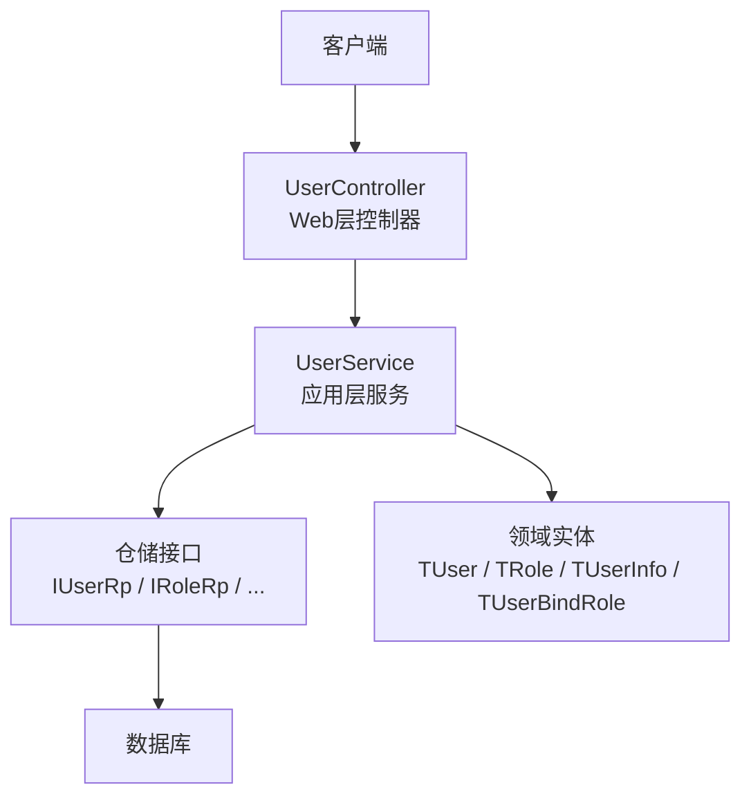
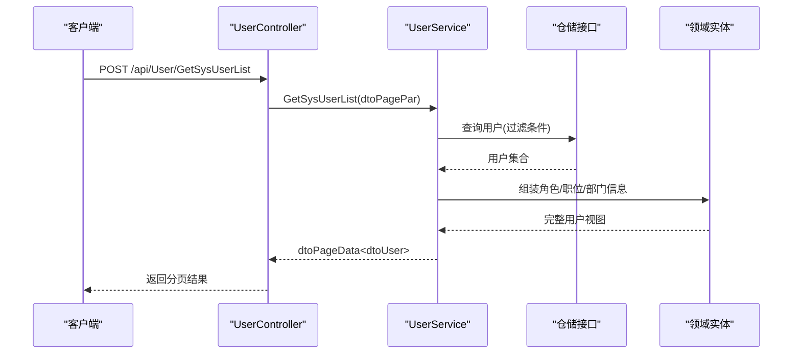
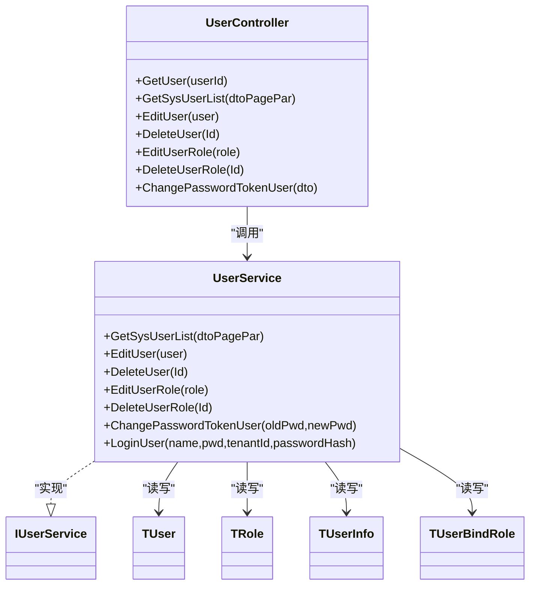

# 用户管理接口

<cite>
**本文引用的文件**
- [UserController.cs](file://Kevin/Kevin.Web.Basics/Controllers/UserController.cs)
- [UserService.cs](file://Kevin/Application/Services/UserService.cs)
- [IUserService.cs](file://Kevin/Domain/Interfaces/IServices/IUserService.cs)
- [TUser.cs](file://Kevin/Domain/Entities/TUser.cs)
- [TUserBindRole.cs](file://Kevin/Domain/Entities/TUserBindRole.cs)
- [TUserInfo.cs](file://Kevin/Domain/Entities/TUserInfo.cs)
- [TRole.cs](file://Kevin/Domain/Entities/TRole.cs)
- [dtoLogin.cs](file://Kevin/kevin.Share/Dtos/dtoLogin.cs)
</cite>

## 目录
1. [简介](#简介)
2. [项目结构](#项目结构)
3. [核心组件](#核心组件)
4. [架构总览](#架构总览)
5. [详细组件分析](#详细组件分析)
6. [依赖关系分析](#依赖关系分析)
7. [性能考虑](#性能考虑)
8. [故障排查指南](#故障排查指南)
9. [结论](#结论)
10. [附录：接口清单与示例](#附录接口清单与示例)

## 简介
本文件面向使用方，系统化说明“用户管理模块”的RESTful API，覆盖用户注册、登录、信息修改、密码重置等常见能力，并文档化用户状态管理、角色绑定、部门关联等高级功能。文档包含请求参数校验规则、响应数据结构、错误码说明，以及典型使用场景与调用示例路径，便于前后端快速对接与联调。

## 项目结构
用户管理相关代码采用分层架构：
- Web层（控制器）：暴露HTTP接口，负责路由、鉴权、日志、缓存、事务等横切关注点
- 应用层（服务）：编排业务逻辑，协调领域实体与仓储，处理数据一致性
- 领域层（实体/接口）：定义用户、角色、用户详情等核心模型及领域行为
- DTO层：用于跨层传输的请求/响应对象

图表来源
- [UserController.cs:1-289](file://Kevin/Kevin.Web.Basics/Controllers/UserController.cs#L1-L289)
- [UserService.cs:1-859](file://Kevin/Application/Services/UserService.cs#L1-L859)
- [IUserService.cs:1-175](file://Kevin/Domain/Interfaces/IServices/IUserService.cs#L1-L175)
- [TUser.cs:1-99](file://Kevin/Domain/Entities/TUser.cs#L1-L99)
- [TRole.cs:1-41](file://Kevin/Domain/Entities/TRole.cs#L1-L41)
- [TUserInfo.cs:1-77](file://Kevin/Domain/Entities/TUserInfo.cs#L1-L77)
- [TUserBindRole.cs:1-22](file://Kevin/Domain/Entities/TUserBindRole.cs#L1-L22)

章节来源
- [UserController.cs:1-289](file://Kevin/Kevin.Web.Basics/Controllers/UserController.cs#L1-L289)
- [UserService.cs:1-859](file://Kevin/Application/Services/UserService.cs#L1-L859)

## 核心组件
- 控制器：UserController 提供用户管理的HTTP端点，统一挂载在 /api/User 下，默认需要授权，部分接口通过特性跳过权限校验
- 服务：UserService 实现用户CRUD、登录、密码变更、短信验证码操作、角色与职位绑定、部门关联查询等
- 实体：TUser（用户主表）、TRole（角色）、TUserInfo（用户详细信息）、TUserBindRole（用户-角色关联）
- DTO：dtoLogin（登录请求体），其他分页、键值对等通用DTO由框架提供

章节来源
- [UserController.cs:1-289](file://Kevin/Kevin.Web.Basics/Controllers/UserController.cs#L1-L289)
- [UserService.cs:1-859](file://Kevin/Application/Services/UserService.cs#L1-L859)
- [TUser.cs:1-99](file://Kevin/Domain/Entities/TUser.cs#L1-L99)
- [TRole.cs:1-41](file://Kevin/Domain/Entities/TRole.cs#L1-L41)
- [TUserInfo.cs:1-77](file://Kevin/Domain/Entities/TUserInfo.cs#L1-L77)
- [TUserBindRole.cs:1-22](file://Kevin/Domain/Entities/TUserBindRole.cs#L1-L22)
- [dtoLogin.cs:1-39](file://Kevin/kevin.Share/Dtos/dtoLogin.cs#L1-L39)

## 架构总览
下图展示一次“获取系统用户列表”的典型调用链，体现控制器到服务再到仓储的数据流。

图表来源
- [UserController.cs:88-100](file://Kevin/Kevin.Web.Basics/Controllers/UserController.cs#L88-L100)
- [UserService.cs:264-338](file://Kevin/Application/Services/UserService.cs#L264-L338)

## 详细组件分析

### 用户CRUD接口
- 新增/编辑用户
  - 方法：POST /api/User/EditUser
  - 入参：dtoUser（包含用户名、昵称、手机号、邮箱、密码（新增必填）、状态等；角色、职位、部门信息可一并提交）
  - 校验要点：用户名唯一、手机号唯一（系统用户范围内）、新增时密码必填
  - 副作用：保存用户基本信息、更新角色绑定、更新用户详细信息、更新职位绑定
  - 返回：布尔表示成功与否
  - 参考实现：[EditUser:398-476](file://Kevin/Application/Services/UserService.cs#L398-L476)

- 删除用户
  - 方法：DELETE /api/User/DeleteUser
  - 入参：Id（用户ID）
  - 校验要点：不可删除当前登录用户、不可删除种子数据、超级管理员保护
  - 返回：布尔
  - 参考实现：[DeleteUser:554-590](file://Kevin/Application/Services/UserService.cs#L554-L590)

- 按ID获取用户
  - 方法：GET /api/User/GetSysUserWhereId
  - 入参：Id
  - 返回：dtoUser（含角色、职位、部门名称等）
  - 参考实现：[GetSysUserWhereId:340-367](file://Kevin/Application/Services/UserService.cs#L340-L367)

- 获取系统用户列表
  - 方法：POST /api/User/GetSysUserList
  - 入参：dtoPagePar<dtoUserPar>（支持分页、搜索关键字、岗位/部门筛选）
  - 返回：dtoPageData<dtoUser>
  - 参考实现：[GetSysUserList:264-338](file://Kevin/Application/Services/UserService.cs#L264-L338)

- 导出系统用户列表
  - 方法：POST /api/User/ExportGetSysUserList
  - 入参：dtoPagePar<dtoUserPar>
  - 返回：Excel文件流
  - 参考实现：[ExportGetSysUserList:102-135](file://Kevin/Kevin.Web.Basics/Controllers/UserController.cs#L102-L135)

章节来源
- [UserController.cs:141-189](file://Kevin/Kevin.Web.Basics/Controllers/UserController.cs#L141-L189)
- [UserService.cs:264-476](file://Kevin/Application/Services/UserService.cs#L264-L476)
- [UserService.cs:554-590](file://Kevin/Application/Services/UserService.cs#L554-L590)

### 登录与认证
- 登录
  - 方法：通常由统一的鉴权控制器提供（本仓库中用户控制器未直接暴露登录端点）
  - 入参：dtoLogin（Name、PassWord、TenantId、可选PasswordHash）
  - 校验：用户名/手机号或密码哈希匹配、租户隔离、软删除过滤
  - 返回：用户基础信息与角色集合
  - 参考实现：[LoginUser:127-167](file://Kevin/Application/Services/UserService.cs#L127-L167)

- 获取当前用户ID（令牌上下文）
  - 方法：GET /api/User/GetTokenUserId
  - 返回：当前登录用户ID
  - 参考实现：[GetTokenUserId:265-274](file://Kevin/Kevin.Web.Basics/Controllers/UserController.cs#L265-L274)

章节来源
- [UserService.cs:127-167](file://Kevin/Application/Services/UserService.cs#L127-L167)
- [UserController.cs:265-274](file://Kevin/Kevin.Web.Basics/Controllers/UserController.cs#L265-L274)
- [dtoLogin.cs:1-39](file://Kevin/kevin.Share/Dtos/dtoLogin.cs#L1-L39)

### 密码与安全
- 通过短信验证码修改密码
  - 方法：POST /api/User/EditUserPassWordBySms
  - 入参：dtoKeyValue（Key为新密码，Value为短信验证码）
  - 校验：短信验证码校验通过、新密码非空
  - 返回：布尔
  - 参考实现：[EditUserPassWordBySms:192-233](file://Kevin/Application/Services/UserService.cs#L192-L233)

- 通过短信验证码修改手机号
  - 方法：POST /api/User/EditUserPhoneBySms
  - 入参：dtoKeyValue（Key为新手机号，Value为短信验证码）
  - 校验：短信验证码校验通过、手机号唯一性
  - 返回：布尔
  - 参考实现：[EditUserPhoneBySms:49-101](file://Kevin/Application/Services/UserService.cs#L49-L101)

- 当前用户修改密码（基于令牌）
  - 方法：POST /api/User/ChangePasswordTokenUser
  - 入参：ChangePasswordTokenUserDto（旧密码、新密码）
  - 校验：旧密码正确
  - 返回：布尔
  - 参考实现：[ChangePasswordTokenUser:743-757](file://Kevin/Application/Services/UserService.cs#L743-L757)

- 密码存储与验证
  - 存储：SHA256哈希
  - 验证：Compare哈希值
  - 参考实现：[TUser.ChangePassword / ValidatePassword:76-84](file://Kevin/Domain/Entities/TUser.cs#L76-L84)

章节来源
- [UserController.cs:52-73](file://Kevin/Kevin.Web.Basics/Controllers/UserController.cs#L52-L73)
- [UserController.cs:162-175](file://Kevin/Kevin.Web.Basics/Controllers/UserController.cs#L162-L175)
- [UserService.cs:49-101](file://Kevin/Application/Services/UserService.cs#L49-L101)
- [UserService.cs:192-233](file://Kevin/Application/Services/UserService.cs#L192-L233)
- [UserService.cs:743-757](file://Kevin/Application/Services/UserService.cs#L743-L757)
- [TUser.cs:76-84](file://Kevin/Domain/Entities/TUser.cs#L76-L84)

### 角色与权限绑定
- 获取用户角色列表
  - 方法：POST /api/User/GetUserRoleList
  - 入参：分页参数
  - 返回：角色分页列表
  - 参考实现：[GetUserRoleList:592-615](file://Kevin/Application/Services/UserService.cs#L592-L615)

- 新增/编辑角色
  - 方法：POST /api/User/EditUserRole
  - 入参：dtoRole（角色名、备注）
  - 返回：布尔
  - 参考实现：[EditUserRole:646-682](file://Kevin/Application/Services/UserService.cs#L646-L682)

- 删除角色
  - 方法：DELETE /api/User/DeleteUserRole
  - 入参：RoleId
  - 校验：若仍有有效用户绑定则拒绝删除
  - 返回：布尔
  - 参考实现：[DeleteUserRole:686-715](file://Kevin/Application/Services/UserService.cs#L686-L715)

- 用户-角色关联
  - 在新增/编辑用户时同步维护用户与角色的绑定关系
  - 参考实现：[EditUserRoles:477-506](file://Kevin/Application/Services/UserService.cs#L477-L506)

- 角色实体
  - 字段：角色名、备注
  - 参考实现：[TRole:1-41](file://Kevin/Domain/Entities/TRole.cs#L1-L41)

- 用户-角色关联实体
  - 字段：UserId、RoleId
  - 参考实现：[TUserBindRole:1-22](file://Kevin/Domain/Entities/TUserBindRole.cs#L1-L22)

章节来源
- [UserController.cs:191-240](file://Kevin/Kevin.Web.Basics/Controllers/UserController.cs#L191-L240)
- [UserService.cs:477-506](file://Kevin/Application/Services/UserService.cs#L477-L506)
- [UserService.cs:592-715](file://Kevin/Application/Services/UserService.cs#L592-L715)
- [TRole.cs:1-41](file://Kevin/Domain/Entities/TRole.cs#L1-L41)
- [TUserBindRole.cs:1-22](file://Kevin/Domain/Entities/TUserBindRole.cs#L1-L22)

### 部门与职位关联
- 用户详细信息（含部门、上级、工号、社交账号等）
  - 实体：TUserInfo
  - 参考实现：[TUserInfo:1-77](file://Kevin/Domain/Entities/TUserInfo.cs#L1-L77)

- 用户-职位绑定
  - 在新增/编辑用户时同步维护用户与职位的绑定
  - 参考实现：[EditUser 中的职位绑定:470-475](file://Kevin/Application/Services/UserService.cs#L470-L475)

- 列表查询时聚合部门名称
  - 在系统用户列表中根据用户详细信息中的部门ID填充部门名称
  - 参考实现：[GetSysUserList 中的部门聚合:322-336](file://Kevin/Application/Services/UserService.cs#L322-L336)

章节来源
- [UserService.cs:322-336](file://Kevin/Application/Services/UserService.cs#L322-L336)
- [UserService.cs:470-475](file://Kevin/Application/Services/UserService.cs#L470-L475)
- [TUserInfo.cs:1-77](file://Kevin/Domain/Entities/TUserInfo.cs#L1-L77)

### 用户状态管理
- 状态字段：Status（启用/禁用）
- 最近登录时间：RecentLoginTime（在服务中更新）
- 软删除：IsDelete（删除标记）
- 参考实现：
  - [TUser.Status / RecentLoginTime:46-56](file://Kevin/Domain/Entities/TUser.cs#L46-L56)
  - [UpdateRecentLoginTime:758-776](file://Kevin/Application/Services/UserService.cs#L758-L776)

章节来源
- [TUser.cs:46-56](file://Kevin/Domain/Entities/TUser.cs#L46-L56)
- [UserService.cs:758-776](file://Kevin/Application/Services/UserService.cs#L758-L776)

## 依赖关系分析
用户管理涉及的主要依赖如下：
- 控制器依赖服务接口 IUserService
- 服务依赖多个仓储接口（用户、角色、用户-角色、用户详细信息、文件等）
- 服务依赖组织服务（部门、职位）以完成部门/职位数据的聚合
- 实体之间通过外键建立关系：用户-角色、用户-详细信息

图表来源
- [UserController.cs:1-289](file://Kevin/Kevin.Web.Basics/Controllers/UserController.cs#L1-L289)
- [UserService.cs:1-859](file://Kevin/Application/Services/UserService.cs#L1-L859)
- [IUserService.cs:1-175](file://Kevin/Domain/Interfaces/IServices/IUserService.cs#L1-L175)
- [TUser.cs:1-99](file://Kevin/Domain/Entities/TUser.cs#L1-L99)
- [TRole.cs:1-41](file://Kevin/Domain/Entities/TRole.cs#L1-L41)
- [TUserInfo.cs:1-77](file://Kevin/Domain/Entities/TUserInfo.cs#L1-L77)
- [TUserBindRole.cs:1-22](file://Kevin/Domain/Entities/TUserBindRole.cs#L1-L22)

章节来源
- [IUserService.cs:1-175](file://Kevin/Domain/Interfaces/IServices/IUserService.cs#L1-L175)

## 性能考虑
- 分页与过滤：系统用户列表支持分页与多条件过滤，建议前端合理设置pageSize与searchKey
- 缓存：部分只读接口使用了缓存过滤器（如 GetUserRoleKey、GetAllUserCount），减少重复查询压力
- 批量写入：新增/编辑用户会同时处理角色、职位、详细信息等多表写入，建议在事务内执行（控制器已标注事务特性）
- 头像与附件：列表查询时会二次加载头像URL，注意控制数据量与网络开销

## 故障排查指南
- 常见异常类型：UserFriendlyException（用户友好型异常），用于提示明确的用户错误信息
- 典型错误场景
  - 手机号已被其他账户绑定：新增/编辑用户时报错
  - 人员姓名已存在：新增/编辑用户时报错
  - 密码为空：新增用户且未提供密码时报错
  - 不能删除自己：删除当前登录用户时报错
  - 种子数据不可删：删除系统种子用户时报错
  - 超级管理员不可删：删除超级管理员时报错
  - 旧密码错误：修改密码时旧密码不匹配报错
  - 短信验证码错误：通过短信验证码修改手机号/密码时校验失败报错
- 定位建议
  - 查看控制器与服务层的异常抛出位置
  - 检查请求参数是否符合校验规则
  - 确认租户隔离是否正确（登录时传入TenantId）

章节来源
- [UserService.cs:49-101](file://Kevin/Application/Services/UserService.cs#L49-L101)
- [UserService.cs:192-233](file://Kevin/Application/Services/UserService.cs#L192-L233)
- [UserService.cs:398-476](file://Kevin/Application/Services/UserService.cs#L398-L476)
- [UserService.cs:554-590](file://Kevin/Application/Services/UserService.cs#L554-L590)
- [UserService.cs:743-757](file://Kevin/Application/Services/UserService.cs#L743-L757)

## 结论
本模块提供了完整的用户管理能力，涵盖CRUD、登录、密码安全、角色与职位绑定、部门关联等关键能力。通过清晰的层次划分与一致的DTO设计，便于前后端协作与扩展。建议在实际使用中结合分页、缓存与事务机制，确保性能与数据一致性。

## 附录：接口清单与示例

### 接口清单
- GET /api/User/GetUser?userId={id}
  - 描述：按用户ID获取用户信息
  - 鉴权：允许跳过权限（SkipAuthority）
  - 返回：dtoUser

- POST /api/User/GetSysUserList
  - 描述：获取系统用户列表（分页、搜索、岗位/部门筛选）
  - 入参：dtoPagePar<dtoUserPar>
  - 返回：dtoPageData<dtoUser>

- POST /api/User/ExportGetSysUserList
  - 描述：导出系统用户列表为Excel
  - 入参：dtoPagePar<dtoUserPar>
  - 返回：文件流

- GET /api/User/GetSysUserWhereId?id={id}
  - 描述：后台管理按ID获取用户信息
  - 返回：dtoUser

- POST /api/User/EditUser
  - 描述：新增/编辑用户（含角色、职位、详细信息）
  - 入参：dtoUser
  - 返回：bool

- DELETE /api/User/DeleteUser?id={id}
  - 描述：删除用户（软删除）
  - 入参：Id
  - 返回：bool

- POST /api/User/ChangePasswordTokenUser
  - 描述：当前用户修改密码
  - 入参：ChangePasswordTokenUserDto（旧密码、新密码）
  - 返回：bool

- POST /api/User/EditUserPhoneBySms
  - 描述：通过短信验证码修改手机号
  - 入参：dtoKeyValue（Key=新手机号，Value=验证码）
  - 返回：bool

- POST /api/User/EditUserPassWordBySms
  - 描述：通过短信验证码修改密码
  - 入参：dtoKeyValue（Key=新密码，Value=验证码）
  - 返回：bool

- POST /api/User/GetUserRoleList
  - 描述：获取用户角色列表（分页）
  - 入参：分页参数
  - 返回：dtoPageData<dtoRole>

- POST /api/User/EditUserRole
  - 描述：新增/编辑角色
  - 入参：dtoRole
  - 返回：bool

- DELETE /api/User/DeleteUserRole?id={id}
  - 描述：删除角色（若无有效用户绑定）
  - 入参：RoleId
  - 返回：bool

- GET /api/User/GetUserSystemKey
  - 描述：获取可用系统用户键值对
  - 返回：List<dtoKeyValue>

- GET /api/User/GetTokenUserId
  - 描述：获取当前令牌用户ID
  - 返回：long

- GET /api/User/GetAllUserCount
  - 描述：获取系统用户数量（带缓存）
  - 返回：int

章节来源
- [UserController.cs:39-286](file://Kevin/Kevin.Web.Basics/Controllers/UserController.cs#L39-L286)

### 典型使用场景与示例路径
- 场景一：管理员新增系统用户并分配角色
  - 步骤：调用 EditUser 提交用户基本信息与角色列表；服务内部会校验唯一性并持久化
  - 参考实现：[EditUser:398-476](file://Kevin/Application/Services/UserService.cs#L398-L476)

- 场景二：用户通过短信验证码重置密码
  - 步骤：先发送验证码至用户手机；调用 EditUserPassWordBySms 提交新密码与验证码；服务校验通过后更新密码
  - 参考实现：[EditUserPassWordBySms:192-233](file://Kevin/Application/Services/UserService.cs#L192-L233)

- 场景三：查询当前登录用户信息
  - 步骤：调用 GetTokenUserId 获取当前用户ID；再调用 GetUser 或 GetSysUserWhereId 获取详细信息
  - 参考实现：[GetTokenUserId:265-274](file://Kevin/Kevin.Web.Basics/Controllers/UserController.cs#L265-L274)、[GetUser:108-115](file://Kevin/Application/Services/UserService.cs#L108-L115)

- 场景四：导出系统用户列表
  - 步骤：构造分页与筛选条件，调用 ExportGetSysUserList；服务端生成Excel并返回文件流
  - 参考实现：[ExportGetSysUserList:102-135](file://Kevin/Kevin.Web.Basics/Controllers/UserController.cs#L102-L135)