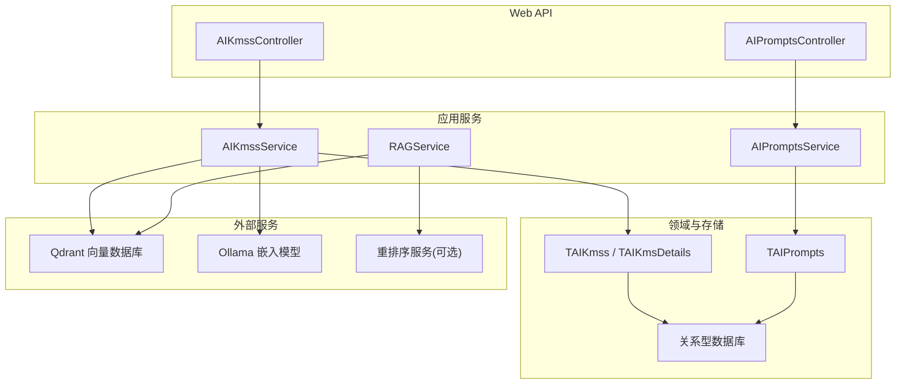
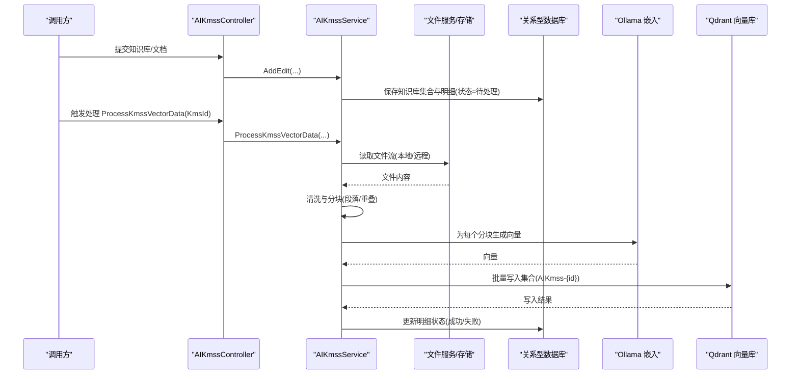
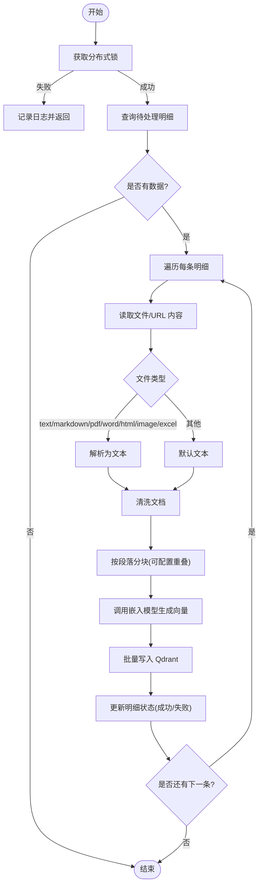
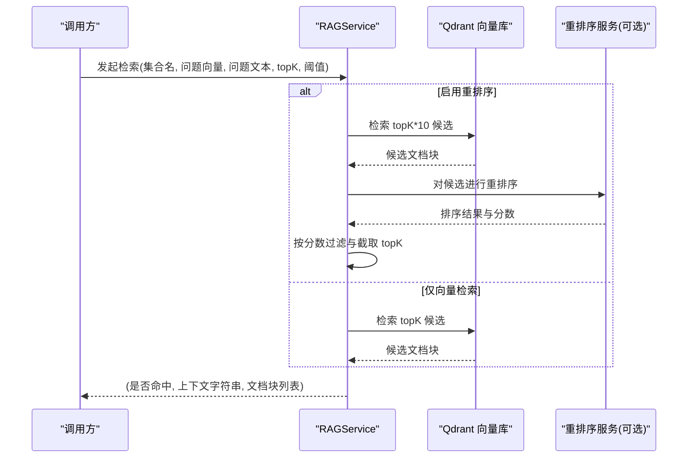
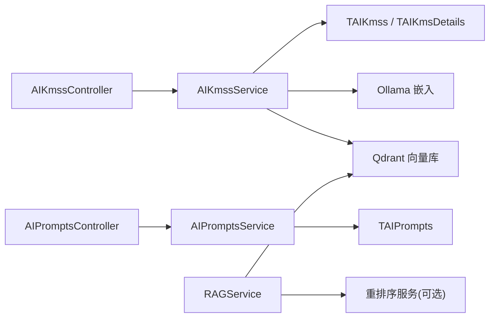

# 知识库接口

<cite>
**本文引用的文件**
- [AIKmssService.cs](file://Kevin/Application/Services/AI/AIKmssService.cs)
- [AIPromptsService.cs](file://Kevin/Application/Services/AI/AIPromptsService.cs)
- [RAGService.cs](file://Kevin/kevin.Module/Kevin.RAG/RAGService.cs)
- [QdrantClientService.cs](file://Kevin/kevin.Module/Kevin.RAG/Qdrant/QdrantClientService.cs)
- [AIKmssController.cs](file://Kevin/ Kevin.Web.Basics/Controllers/AI/AIKmssController.cs)
- [AIPromptsController.cs](file://Kevin/ Kevin.Web.Basics/Controllers/AI/AIPromptsController.cs)
- [TAIKmss.cs](file://Kevin/Domain/Entities/AI/TAIKmss.cs)
- [TAIKmsDetails.cs](file://Kevin/Domain/Entities/AI/TAIKmsDetails.cs)
- [TAIPrompts.cs](file://Kevin/Domain/Entities/AI/TAIPrompts.cs)
- [ImportKmsStatusEnums.cs](file://Kevin/Domain/Share/Enums/ImportKmsStatusEnums.cs)
</cite>

## 目录
1. [简介](#简介)
2. [项目结构](#项目结构)
3. [核心组件](#核心组件)
4. [架构总览](#架构总览)
5. [详细组件分析](#详细组件分析)
6. [依赖关系分析](#依赖关系分析)
7. [性能考虑](#性能考虑)
8. [故障排查指南](#故障排查指南)
9. [结论](#结论)
10. [附录：API 定义与示例](#附录api-定义与示例)

## 简介
本接口文档面向 AI 知识库管理，覆盖以下能力：
- 知识库文档的上传、解析、分块、向量化与索引入库
- 基于向量数据库的语义检索与重排序（可选）
- 提示词模板的增删改查与版本化扩展点
- RAG（检索增强生成）模式的完整调用链路示例
- 与向量数据库（Qdrant）、嵌入模型（Ollama）及重排序服务的集成

## 项目结构
系统采用分层架构：Web API 控制器层 → 应用服务层 → 领域实体/仓储 → 外部服务（向量库、嵌入模型、重排序）。知识库与提示词分别由独立的服务模块实现，RAG 能力封装在独立的 RAG 模块中。

图表来源
- [AIKmssController.cs](file://Kevin/ Kevin.Web.Basics/Controllers/AI/AIKmssController.cs)
- [AIPromptsController.cs](file://Kevin/ Kevin.Web.Basics/Controllers/AI/AIPromptsController.cs)
- [AIKmssService.cs](file://Kevin/Application/Services/AI/AIKmssService.cs)
- [AIPromptsService.cs](file://Kevin/Application/Services/AI/AIPromptsService.cs)
- [RAGService.cs](file://Kevin/kevin.Module/Kevin.RAG/RAGService.cs)
- [QdrantClientService.cs](file://Kevin/kevin.Module/Kevin.RAG/Qdrant/QdrantClientService.cs)

章节来源
- [AIKmssService.cs:1-449](file://Kevin/Application/Services/AI/AIKmssService.cs#L1-L449)
- [AIPromptsService.cs:1-155](file://Kevin/Application/Services/AI/AIPromptsService.cs#L1-L155)
- [RAGService.cs:1-81](file://Kevin/kevin.Module/Kevin.RAG/RAGService.cs#L1-L81)

## 核心组件
- 知识库服务（AIKmssService）
  - 负责知识库集合与明细的 CRUD、文档解析、分块、向量化、写入 Qdrant、状态回写。
- 提示词服务（AIPromptsService）
  - 提供提示词模板的查询、新增、编辑、删除等基础管理能力。
- RAG 服务（RAGService）
  - 封装检索流程：向量检索、可选重排序、上下文组装，供上层对话或问答使用。
- 向量存储（QdrantClientService）
  - 提供集合创建、数据插入、相似度搜索等能力。

章节来源
- [AIKmssService.cs:1-449](file://Kevin/Application/Services/AI/AIKmssService.cs#L1-L449)
- [AIPromptsService.cs:1-155](file://Kevin/Application/Services/AI/AIPromptsService.cs#L1-L155)
- [RAGService.cs:1-81](file://Kevin/kevin.Module/Kevin.RAG/RAGService.cs#L1-L81)
- [QdrantClientService.cs](file://Kevin/kevin.Module/Kevin.RAG/Qdrant/QdrantClientService.cs)

## 架构总览
知识库处理主流程（上传→解析→分块→向量化→索引）如下：

图表来源
- [AIKmssService.cs:246-429](file://Kevin/Application/Services/AI/AIKmssService.cs#L246-L429)

## 详细组件分析

### 知识库服务（AIKmssService）
- 职责
  - 知识库集合与明细的增删改查、分页列表、详情聚合
  - 文档解析：支持 text/markdown/pdf/word/html/image/excel 等类型
  - 分块策略：按段落切分，可配置每段 token 上限与重叠 token
  - 向量化：通过 Ollama 嵌入模型生成向量
  - 索引入库：批量写入 Qdrant 集合，命名规则为 AIKmss-{知识库ID}
  - 并发控制：分布式锁避免重复处理同一知识库
  - 状态管理：明细记录导入状态（加载中/成功/失败），错误信息回写
- 关键方法
  - GetList / GetPageData / GetDetails / AddEdit / Delete
  - ProcessKmssVectorData(KmsId)
- 数据流
  - 从文件或 URL 获取内容 → 清洗 → 分块 → 生成向量 → 写入向量库 → 更新状态
- 异常与边界
  - 缺失必填字段（如嵌入模型）时抛出友好异常
  - 文件为空或解析失败时标记失败并记录错误信息
  - 分布式锁获取失败时直接返回

图表来源
- [AIKmssService.cs:246-429](file://Kevin/Application/Services/AI/AIKmssService.cs#L246-L429)

章节来源
- [AIKmssService.cs:50-239](file://Kevin/Application/Services/AI/AIKmssService.cs#L50-L239)
- [AIKmssService.cs:246-429](file://Kevin/Application/Services/AI/AIKmssService.cs#L246-L429)

### 提示词服务（AIPromptsService）
- 职责
  - 提示词模板的查询（分页/关键词过滤）、详情获取、新增/编辑、删除
  - 支持租户隔离与权限控制
- 关键方法
  - GetPageData / GetDetails / GetNoPerDetails / GetALLList / AddEdit / Delete
- 数据模型
  - 对应实体 TAIPrompts，包含名称、提示词内容、描述、创建/更新时间与用户信息等

章节来源
- [AIPromptsService.cs:15-152](file://Kevin/Application/Services/AI/AIPromptsService.cs#L15-L152)

### RAG 服务（RAGService）
- 职责
  - 根据问题向量进行相似检索，可选重排序后组装上下文
  - 支持两种模式：内置检索或接入外部重排序服务（如阿里重排序）
- 关键方法
  - GetRAGSystemPrompt(collectionName, questionEmbedding, questionText, isRerankModel, topK, Score)
  - GetRAGAliReankSystemPrompt(...): 指定重排序地址、密钥与模型
- 输出
  - 返回是否找到相关文档、用于构建系统提示的上下文字符串、以及匹配的文档块列表

图表来源
- [RAGService.cs:19-78](file://Kevin/kevin.Module/Kevin.RAG/RAGService.cs#L19-L78)

章节来源
- [RAGService.cs:1-81](file://Kevin/kevin.Module/Kevin.RAG/RAGService.cs#L1-L81)

### 向量存储（QdrantClientService）
- 职责
  - 集合级操作：创建/选择集合、批量插入、相似度搜索
  - 与知识库集合命名约定一致：AIKmss-{知识库ID}
- 典型用法
  - 知识库服务在分块与向量化后批量写入
  - RAG 服务在检索阶段按集合名查询

章节来源
- [QdrantClientService.cs](file://Kevin/kevin.Module/Kevin.RAG/Qdrant/QdrantClientService.cs)

## 依赖关系分析
- 控制器到服务
  - AIKmssController → AIKmssService
  - AIPromptsController → AIPromptsService
- 服务到领域与存储
  - AIKmssService → TAIKmss / TAIKmsDetails → 关系型数据库
  - AIPromptsService → TAIPrompts → 关系型数据库
- 服务到外部系统
  - AIKmssService → Ollama（嵌入）→ Qdrant（向量库）
  - RAGService → Qdrant（检索）→ 可选重排序服务

图表来源
- [AIKmssController.cs](file://Kevin/ Kevin.Web.Basics/Controllers/AI/AIKmssController.cs)
- [AIPromptsController.cs](file://Kevin/ Kevin.Web.Basics/Controllers/AI/AIPromptsController.cs)
- [AIKmssService.cs:1-449](file://Kevin/Application/Services/AI/AIKmssService.cs#L1-L449)
- [AIPromptsService.cs:1-155](file://Kevin/Application/Services/AI/AIPromptsService.cs#L1-L155)
- [RAGService.cs:1-81](file://Kevin/kevin.Module/Kevin.RAG/RAGService.cs#L1-L81)

章节来源
- [AIKmssService.cs:1-449](file://Kevin/Application/Services/AI/AIKmssService.cs#L1-L449)
- [AIPromptsService.cs:1-155](file://Kevin/Application/Services/AI/AIPromptsService.cs#L1-L155)
- [RAGService.cs:1-81](file://Kevin/kevin.Module/Kevin.RAG/RAGService.cs#L1-L81)

## 性能考虑
- 分块与重叠
  - 合理设置 MaxTokensPerParagraph 与 OverlappingTokens，平衡召回率与冗余度
- 批处理
  - 将多个分块合并为一次批量写入，减少网络往返
- 并发控制
  - 使用分布式锁避免重复处理同一知识库，防止向量库写入冲突
- 检索优化
  - 先检索 topK*10 再重排序取 topK，提升最终质量；结合 Score 阈值过滤低相关结果
- 资源限制
  - 大文件建议流式读取与增量处理，避免内存峰值过高

## 故障排查指南
- 常见问题
  - 未配置嵌入模型：需确保知识库关联了有效的嵌入模型
  - 文件为空或格式不支持：检查文件类型与解析器支持范围
  - 向量库写入失败：检查 Qdrant 连接与集合是否存在
  - 重排序失败：检查重排序服务地址、密钥与模型参数
- 定位步骤
  - 查看明细记录的 Status 与 ErrorMessage
  - 确认分布式锁是否获取成功
  - 核对集合命名是否符合 AIKmss-{知识库ID}
  - 验证嵌入模型端点与 Key 是否正确

章节来源
- [AIKmssService.cs:112-239](file://Kevin/Application/Services/AI/AIKmssService.cs#L112-L239)
- [AIKmssService.cs:246-429](file://Kevin/Application/Services/AI/AIKmssService.cs#L246-L429)

## 结论
本知识库方案以“解析-分块-向量化-索引-检索”为主线，结合可选重排序与 RAG 上下文组装，形成完整的智能问答闭环。通过清晰的领域建模与模块化设计，便于扩展新的文档类型、嵌入模型与重排序服务。

## 附录：API 定义与示例

### 知识库管理（AIKmssController）
- 说明
  - 提供知识库集合与明细的增删改查、分页列表、详情聚合、触发向量化处理等接口
- 主要接口
  - 获取列表：GET /api/v1/AIKmss/List
  - 分页查询：POST /api/v1/AIKmss/PageData
  - 获取详情：GET /api/v1/AIKmss/GetDetails?id={id}
  - 新增/编辑：POST /api/v1/AIKmss/AddEdit
  - 删除：DELETE /api/v1/AIKmss/Delete?id={id}
  - 处理向量索引：POST /api/v1/AIKmss/ProcessKmssVectorData?KmsId={KmsId}
- 请求体要点（AddEdit）
  - Name：知识库名称
  - aIModelsId：嵌入模型 ID（必填）
  - aIRerankModelsId：重排序模型 ID（可选）
  - MaxTokensPerParagraph：每段最大 token
  - OverlappingTokens：重叠 token
  - AIKmssDetailsList：明细列表（支持文件 ID 或 URL、内容、类型、文件名等）

章节来源
- [AIKmssController.cs](file://Kevin/ Kevin.Web.Basics/Controllers/AI/AIKmssController.cs)
- [AIKmssService.cs:50-239](file://Kevin/Application/Services/AI/AIKmssService.cs#L50-L239)

### 提示词模板管理（AIPromptsController）
- 说明
  - 提供提示词模板的查询、新增、编辑、删除等接口
- 主要接口
  - 分页查询：POST /api/v1/AIPrompts/PageData
  - 获取详情：GET /api/v1/AIPrompts/GetDetails?id={id}
  - 无权限详情：GET /api/v1/AIPrompts/GetNoPerDetails?id={id}
  - 全部列表：GET /api/v1/AIPrompts/GetALLList
  - 新增/编辑：POST /api/v1/AIPrompts/AddEdit
  - 删除：DELETE /api/v1/AIPrompts/Delete?id={id}
- 请求体要点（AddEdit）
  - Name：模板名称
  - Prompt：提示词内容
  - Description：描述

章节来源
- [AIPromptsController.cs](file://Kevin/ Kevin.Web.Basics/Controllers/AI/AIPromptsController.cs)
- [AIPromptsService.cs:15-152](file://Kevin/Application/Services/AI/AIPromptsService.cs#L15-L152)

### RAG 检索接口（RAGService）
- 说明
  - 对外暴露检索接口，返回可用于构造系统提示的上下文与匹配文档块
- 主要接口
  - 标准检索：GET/POST /api/v1/RAG/GetRAGSystemPrompt
    - 入参：collectionName、question（向量）、questionText、isRerankModel、topK、Score
  - 阿里重排序检索：GET/POST /api/v1/RAG/GetRAGAliReankSystemPrompt
    - 入参：collectionName、question、questionText、topK、Score、RerankUrl、RerankKey、RerankModel
- 返回
  - 是否命中、上下文字符串、匹配文档块列表（含标题、来源、相似度分数等）

章节来源
- [RAGService.cs:19-78](file://Kevin/kevin.Module/Kevin.RAG/RAGService.cs#L19-L78)

### 数据模型概览
- 知识库集合（TAIKmss）
  - 关键字段：名称、嵌入模型 ID、重排序模型 ID、分段与重叠配置、租户与审计字段
- 知识库明细（TAIKmsDetails）
  - 关键字段：所属知识库 ID、文件 ID/URL、文件类型、内容、文件名、数据量、导入状态、错误信息
- 提示词模板（TAIPrompts）
  - 关键字段：名称、提示词内容、描述、租户与审计字段

章节来源
- [TAIKmss.cs](file://Kevin/Domain/Entities/AI/TAIKmss.cs)
- [TAIKmsDetails.cs](file://Kevin/Domain/Entities/AI/TAIKmsDetails.cs)
- [TAIPrompts.cs](file://Kevin/Domain/Entities/AI/TAIPrompts.cs)
- [ImportKmsStatusEnums.cs](file://Kevin/Domain/Share/Enums/ImportKmsStatusEnums.cs)

### RAG 完整调用示例（端到端）
- 步骤
  1) 上传文档并建立知识库（AddEdit）
  2) 触发向量化处理（ProcessKmssVectorData）
  3) 使用问题向量调用 RAG 检索（GetRAGSystemPrompt 或 GetRAGAliReankSystemPrompt）
  4) 将返回的上下文拼接至系统提示，交由 LLM 生成回答
- 注意事项
  - 确保集合名与知识库 ID 一致（AIKmss-{id}）
  - 若启用重排序，需提供正确的重排序服务配置
  - 合理设置 topK 与 Score 阈值，平衡召回与质量

章节来源
- [AIKmssService.cs:246-429](file://Kevin/Application/Services/AI/AIKmssService.cs#L246-L429)
- [RAGService.cs:19-78](file://Kevin/kevin.Module/Kevin.RAG/RAGService.cs#L19-L78)