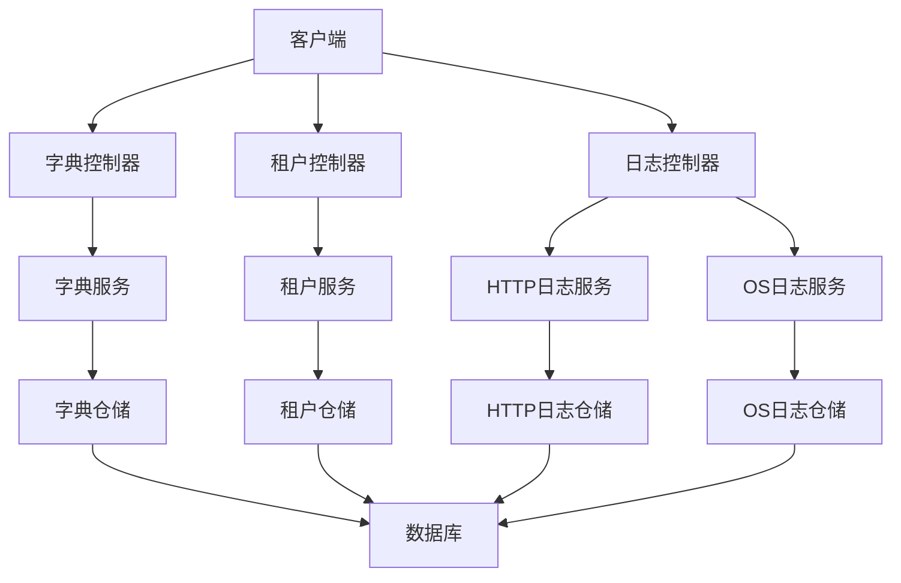
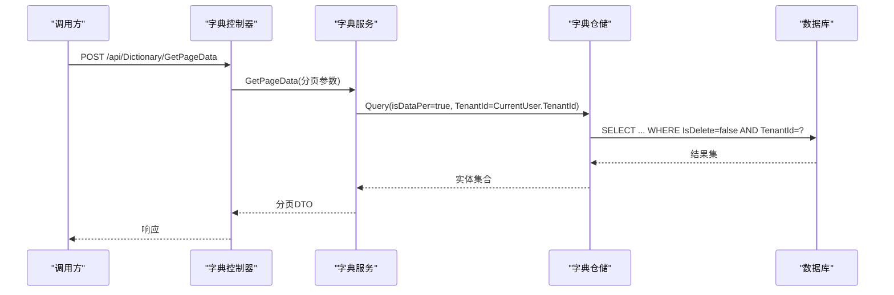
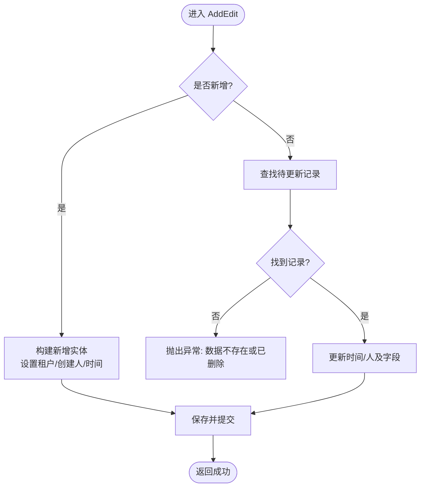
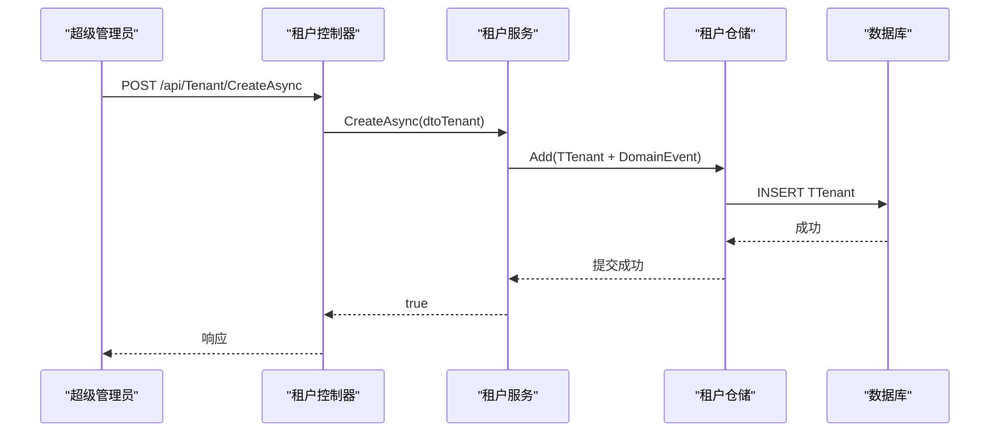
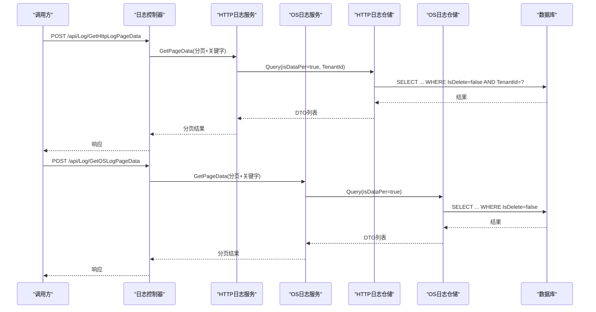
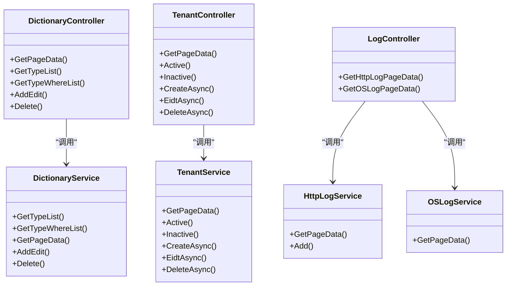

# 系统管理接口

<cite>
**本文引用的文件**
- [DictionaryController.cs](file://Kevin/Kevin.Web.Basics/Controllers/DictionaryController.cs)
- [TenantController.cs](file://Kevin/Kevin.Web.Basics/Controllers/TenantController.cs)
- [LogController.cs](file://Kevin/Kevin.Web.Basics/Controllers/LogController.cs)
- [DictionaryService.cs](file://Kevin/Application/Services/DictionaryService.cs)
- [TenantService.cs](file://Kevin/Application/Services/TenantService.cs)
- [HttpLogService.cs](file://Kevin/Application/Services/HttpLogService.cs)
- [OSLogService.cs](file://Kevin/Application/Services/OSLogService.cs)
- [TDictionary.cs](file://Kevin/Domain/Entities/TDictionary.cs)
- [TTenant.cs](file://Kevin/Domain/Entities/TTenant.cs)
- [THttpLog.cs](file://Kevin/Domain/Entities/THttpLog.cs)
- [TOSLog.cs](file://Kevin/Domain/Entities/TOSLog.cs)
- [appsettings.json](file://App/WebApi/appsettings.json)
</cite>

## 目录
1. [简介](#简介)
2. [项目结构](#项目结构)
3. [核心组件](#核心组件)
4. [架构总览](#架构总览)
5. [详细组件分析](#详细组件分析)
6. [依赖关系分析](#依赖关系分析)
7. [性能与监控](#性能与监控)
8. [故障排查指南](#故障排查指南)
9. [结论](#结论)
10. [附录：API 清单](#附录api-清单)

## 简介
本模块提供系统级管理能力，包括字典管理、租户管理、日志查询等。通过统一的控制器与服务层设计，实现数据隔离（多租户）、权限控制、操作审计与关键数据变更追踪。同时结合配置中心与外部服务（如 Redis、RabbitMQ、Consul）完成运行期能力扩展。

## 项目结构
系统管理相关代码采用分层架构：
- Web API 层：控制器暴露 REST 接口，负责参数校验、鉴权与日志记录
- 应用服务层：封装业务流程、权限检查、分页查询、事务与审计
- 领域实体层：定义数据模型与业务规则
- 基础设施与配置：数据库连接、缓存、消息队列、服务注册等

图表来源
- [DictionaryController.cs:11-75](file://Kevin/Kevin.Web.Basics/Controllers/DictionaryController.cs#L11-L75)
- [TenantController.cs:10-94](file://Kevin/Kevin.Web.Basics/Controllers/TenantController.cs#L10-L94)
- [LogController.cs:9-48](file://Kevin/Kevin.Web.Basics/Controllers/LogController.cs#L9-L48)
- [DictionaryService.cs:1-141](file://Kevin/Application/Services/DictionaryService.cs#L1-L141)
- [TenantService.cs:1-282](file://Kevin/Application/Services/TenantService.cs#L1-L282)
- [HttpLogService.cs:1-37](file://Kevin/Application/Services/HttpLogService.cs#L1-L37)
- [OSLogService.cs:1-38](file://Kevin/Application/Services/OSLogService.cs#L1-L38)

章节来源
- [DictionaryController.cs:11-75](file://Kevin/Kevin.Web.Basics/Controllers/DictionaryController.cs#L11-L75)
- [TenantController.cs:10-94](file://Kevin/Kevin.Web.Basics/Controllers/TenantController.cs#L10-L94)
- [LogController.cs:9-48](file://Kevin/Kevin.Web.Basics/Controllers/LogController.cs#L9-L48)

## 核心组件
- 字典管理：提供类型列表、按类型查询、分页查询、新增编辑、删除等操作，支持按租户隔离与软删除保护
- 租户管理：提供租户列表、启用/停用、创建、编辑、删除；仅超级管理员可操作，并包含种子数据保护
- 日志查询：提供 HTTP 请求日志与关键数据变动日志的分页查询，支持关键字检索与租户过滤

章节来源
- [DictionaryController.cs:30-74](file://Kevin/Kevin.Web.Basics/Controllers/DictionaryController.cs#L30-L74)
- [TenantController.cs:26-93](file://Kevin/Kevin.Web.Basics/Controllers/TenantController.cs#L26-L93)
- [LogController.cs:31-47](file://Kevin/Kevin.Web.Basics/Controllers/LogController.cs#L31-L47)

## 架构总览
系统管理模块遵循“控制器 -> 服务 -> 仓储 -> 数据库”的调用链，并通过上下文注入当前租户与用户信息，实现数据隔离与审计。

图表来源
- [DictionaryController.cs:30-38](file://Kevin/Kevin.Web.Basics/Controllers/DictionaryController.cs#L30-L38)
- [DictionaryService.cs:34-60](file://Kevin/Application/Services/DictionaryService.cs#L34-L60)

章节来源
- [DictionaryService.cs:34-60](file://Kevin/Application/Services/DictionaryService.cs#L34-L60)

## 详细组件分析

### 字典管理
- 功能要点
  - 获取所有字典类型列表
  - 按类型获取字典项列表（排序）
  - 分页查询字典（支持关键字搜索与类型过滤）
  - 新增或编辑字典项（自动设置租户、创建人、时间戳）
  - 删除字典项（软删除，内置字典禁止删除）
- 数据隔离
  - 查询时强制附加 TenantId 条件，确保跨租户数据隔离
- 权限与安全
  - 接口受授权保护，部分只读接口可跳过权限校验
- 错误处理
  - 更新不存在的数据抛出友好异常
  - 删除内置字典抛出异常

图表来源
- [DictionaryService.cs:68-113](file://Kevin/Application/Services/DictionaryService.cs#L68-L113)

章节来源
- [DictionaryController.cs:30-74](file://Kevin/Kevin.Web.Basics/Controllers/DictionaryController.cs#L30-L74)
- [DictionaryService.cs:15-137](file://Kevin/Application/Services/DictionaryService.cs#L15-L137)
- [TDictionary.cs:1-58](file://Kevin/Domain/Entities/TDictionary.cs#L1-L58)

### 租户管理
- 功能要点
  - 分页查询租户列表（仅超级管理员）
  - 启用/停用租户
  - 创建租户（触发领域事件）
  - 编辑租户（校验唯一性）
  - 删除租户（软删除，保护种子数据）
- 数据隔离
  - 租户状态影响访问控制，实体包含可用性校验
- 权限与安全
  - 所有操作均要求超级管理员身份
- 错误处理
  - 非管理员抛异常
  - Code 重复抛异常
  - 删除种子数据抛异常

图表来源
- [TenantController.cs:63-69](file://Kevin/Kevin.Web.Basics/Controllers/TenantController.cs#L63-L69)
- [TenantService.cs:111-127](file://Kevin/Application/Services/TenantService.cs#L111-L127)

章节来源
- [TenantController.cs:26-93](file://Kevin/Kevin.Web.Basics/Controllers/TenantController.cs#L26-L93)
- [TenantService.cs:28-151](file://Kevin/Application/Services/TenantService.cs#L28-L151)
- [TTenant.cs:1-56](file://Kevin/Domain/Entities/TTenant.cs#L1-L56)

### 日志查询
- 功能要点
  - HTTP 请求日志分页查询（按租户过滤、关键字检索）
  - 关键数据变动日志分页查询（支持内容/标记/表名/ID 检索）
- 数据隔离
  - HTTP 日志按租户过滤；OS 日志全局可查（可按关键字筛选）
- 性能考虑
  - 使用 Skip/Take 分页，避免全量加载
  - 按需 Include 关联用户信息

图表来源
- [LogController.cs:31-47](file://Kevin/Kevin.Web.Basics/Controllers/LogController.cs#L31-L47)
- [HttpLogService.cs:17-27](file://Kevin/Application/Services/HttpLogService.cs#L17-L27)
- [OSLogService.cs:15-35](file://Kevin/Application/Services/OSLogService.cs#L15-L35)

章节来源
- [LogController.cs:31-47](file://Kevin/Kevin.Web.Basics/Controllers/LogController.cs#L31-L47)
- [HttpLogService.cs:17-27](file://Kevin/Application/Services/HttpLogService.cs#L17-L27)
- [OSLogService.cs:15-35](file://Kevin/Application/Services/OSLogService.cs#L15-L35)
- [THttpLog.cs:1-78](file://Kevin/Domain/Entities/THttpLog.cs#L1-L78)
- [TOSLog.cs:1-77](file://Kevin/Domain/Entities/TOSLog.cs#L1-L77)

## 依赖关系分析
- 控制器依赖服务：通过构造函数或属性注入服务实例
- 服务依赖仓储：仓储封装数据访问逻辑，服务编排业务流程
- 实体与基础基类：统一审计字段（创建/更新/删除时间与人员）
- 配置与外部依赖：数据库连接、Redis、RabbitMQ、Consul 等在配置文件中声明

图表来源
- [DictionaryController.cs:11-75](file://Kevin/Kevin.Web.Basics/Controllers/DictionaryController.cs#L11-L75)
- [TenantController.cs:10-94](file://Kevin/Kevin.Web.Basics/Controllers/TenantController.cs#L10-L94)
- [LogController.cs:9-48](file://Kevin/Kevin.Web.Basics/Controllers/LogController.cs#L9-L48)
- [DictionaryService.cs:1-141](file://Kevin/Application/Services/DictionaryService.cs#L1-L141)
- [TenantService.cs:1-282](file://Kevin/Application/Services/TenantService.cs#L1-L282)
- [HttpLogService.cs:1-37](file://Kevin/Application/Services/HttpLogService.cs#L1-L37)
- [OSLogService.cs:1-38](file://Kevin/Application/Services/OSLogService.cs#L1-L38)

章节来源
- [DictionaryController.cs:11-75](file://Kevin/Kevin.Web.Basics/Controllers/DictionaryController.cs#L11-L75)
- [TenantController.cs:10-94](file://Kevin/Kevin.Web.Basics/Controllers/TenantController.cs#L10-L94)
- [LogController.cs:9-48](file://Kevin/Kevin.Web.Basics/Controllers/LogController.cs#L9-L48)

## 性能与监控
- 分页与索引
  - 所有列表接口均采用分页查询，减少数据传输与内存占用
  - 建议在常用检索字段（如 Key/Value/Type、OperateType/UserName、Content/Sign/Table/TableId）建立索引以提升查询性能
- 多租户数据隔离
  - 查询强制附加 TenantId，避免跨租户扫描，提升安全性与性能
- 监控与指标
  - 可通过 Hangfire 配置后台任务与监控面板
  - 通过 Redis 配置 SignalR 通道进行实时通知与状态推送
  - 通过 Consul 进行服务注册与健康检查，便于集群运维
- 配置热重载
  - 配置文件位于 appsettings.json，运行时可通过环境变量或配置中心覆盖
  - 对于需要热更新的配置，建议结合 Redis 广播或 SignalR 推送至前端/客户端刷新

章节来源
- [appsettings.json:16-57](file://App/WebApi/appsettings.json#L16-L57)
- [appsettings.json:92-98](file://App/WebApi/appsettings.json#L92-L98)

## 故障排查指南
- 权限问题
  - 租户管理接口需超级管理员，否则抛出友好异常
- 数据不存在或已删除
  - 字典更新/删除时若找不到记录会抛出异常，请确认 ID 与租户上下文
- 内置字典保护
  - 删除内置字典将抛出异常，避免破坏系统基础数据
- 租户状态校验
  - 已删除或失效的租户在访问时会阻止操作，请先恢复或重新创建
- 日志查询无数据
  - 检查租户上下文是否正确、关键字是否匹配、分页参数是否合理

章节来源
- [TenantService.cs:28-83](file://Kevin/Application/Services/TenantService.cs#L28-L83)
- [DictionaryService.cs:68-137](file://Kevin/Application/Services/DictionaryService.cs#L68-L137)
- [TTenant.cs:43-53](file://Kevin/Domain/Entities/TTenant.cs#L43-L53)
- [TDictionary.cs:49-55](file://Kevin/Domain/Entities/TDictionary.cs#L49-L55)

## 结论
系统管理模块以清晰的分层设计与严格的多租户数据隔离为基础，提供了完善的字典、租户与日志管理能力。配合配置中心与外部服务，可实现高可用与可扩展的运维体系。建议在生产环境完善索引策略、开启健康检查与监控告警，并对敏感配置进行加密与最小化暴露。

## 附录：API 清单
- 字典管理
  - POST /api/Dictionary/GetPageData：获取字典分页数据
  - GET /api/Dictionary/GetTypeList：获取字典类型列表
  - GET /api/Dictionary/GetTypeWhereList?type={type}：按类型获取字典列表
  - POST /api/Dictionary/AddEdit：新增或编辑字典
  - DELETE /api/Dictionary/Delete?id={id}：删除字典
- 租户管理
  - POST /api/Tenant/GetPageData：获取租户分页数据
  - POST /api/Tenant/Active：启用租户
  - POST /api/Tenant/Inactive：停用租户
  - POST /api/Tenant/CreateAsync：创建租户
  - POST /api/Tenant/EidtAsync：编辑租户
  - DELETE /api/Tenant/DeleteAsync：删除租户
- 日志查询
  - POST /api/Log/GetHttpLogPageData：获取 HTTP 请求日志分页
  - POST /api/Log/GetOSLogPageData：获取关键数据变动日志分页

章节来源
- [DictionaryController.cs:30-74](file://Kevin/Kevin.Web.Basics/Controllers/DictionaryController.cs#L30-L74)
- [TenantController.cs:26-93](file://Kevin/Kevin.Web.Basics/Controllers/TenantController.cs#L26-L93)
- [LogController.cs:31-47](file://Kevin/Kevin.Web.Basics/Controllers/LogController.cs#L31-L47)