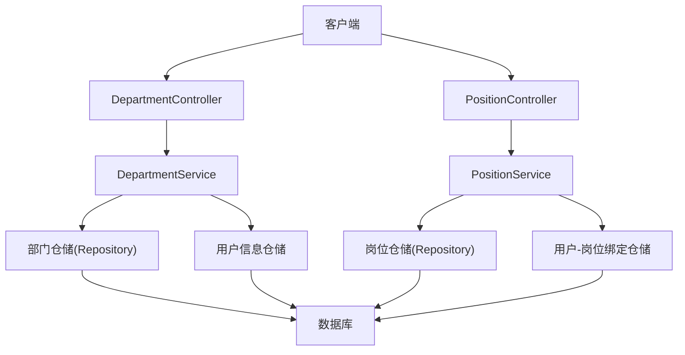
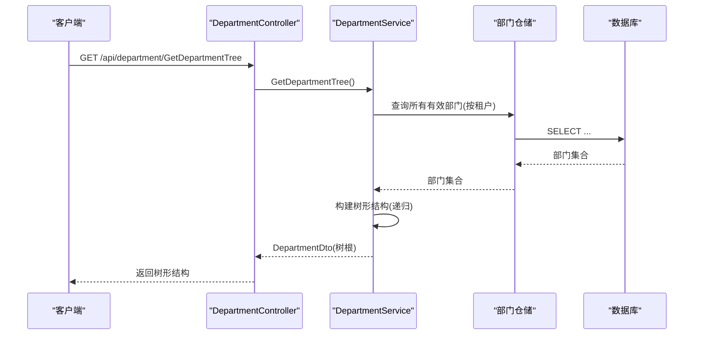
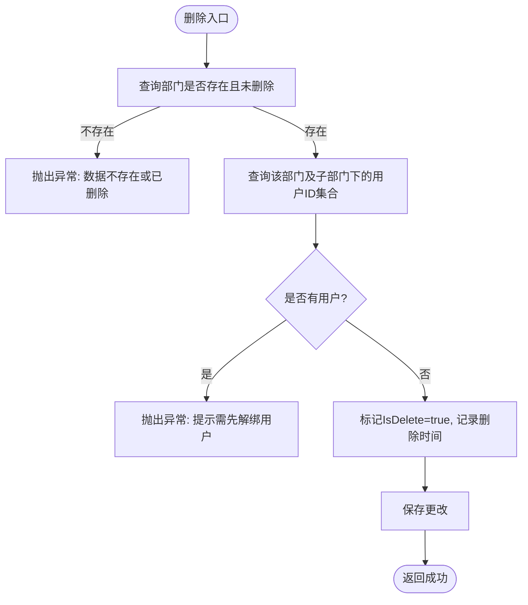
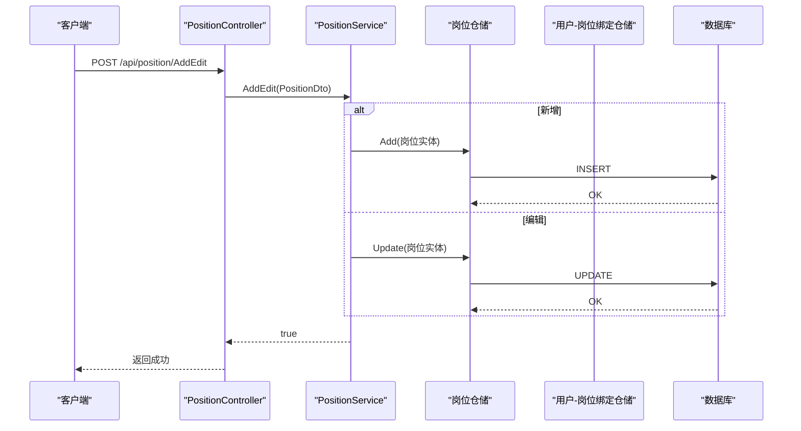
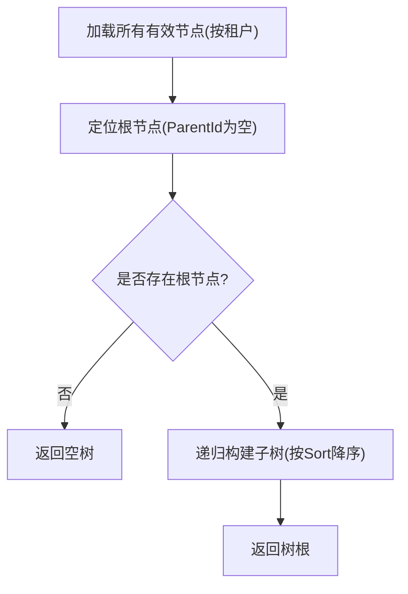
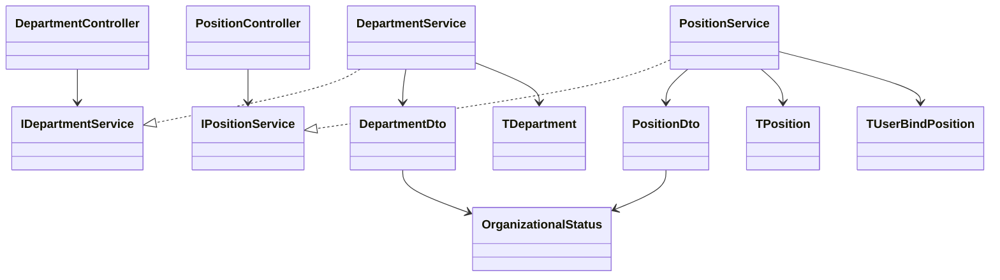

# 组织架构接口

<cite>
**本文引用的文件**
- [DepartmentController.cs](file://Kevin/Kevin.Web.Basics/Controllers/Organizational/DepartmentController.cs)
- [PositionController.cs](file://Kevin/Kevin.Web.Basics/Controllers/Organizational/PositionController.cs)
- [DepartmentService.cs](file://Kevin/Application/Services/Organizational/DepartmentService.cs)
- [PositionService.cs](file://Kevin/Application/Services/Organizational/PositionService.cs)
- [IDepartmentService.cs](file://Kevin/Domain/Interfaces/IServices/Organizational/IDepartmentService.cs)
- [IPositionService.cs](file://Kevin/Domain/Interfaces/IServices/Organizational/IPositionService.cs)
- [DepartmentDto.cs](file://Kevin/kevin.Share/Dtos/Organizational/DepartmentDto.cs)
- [PositionDto.cs](file://Kevin/kevin.Share/Dtos/Organizational/PositionDto.cs)
- [TDepartment.cs](file://Kevin/Domain/Entities/Organizational/TDepartment.cs)
- [TPosition.cs](file://Kevin/Domain/Entities/Organizational/TPosition.cs)
- [TUserBindPosition.cs](file://Kevin/Domain/Entities/TUserBindPosition.cs)
- [TUser.cs](file://Kevin/Domain/Entities/TUser.cs)
- [OrganizationalStatus.cs](file://Kevin/kevin.Share/Enums/OrganizationalStatus.cs)
</cite>

## 目录
1. [简介](#简介)
2. [项目结构](#项目结构)
3. [核心组件](#核心组件)
4. [架构总览](#架构总览)
5. [详细组件分析](#详细组件分析)
6. [依赖关系分析](#依赖关系分析)
7. [性能考虑](#性能考虑)
8. [故障排查指南](#故障排查指南)
9. [结论](#结论)
10. [附录](#附录)

## 简介
本模块提供组织架构的部门与岗位管理能力，支持树形结构的增删改查、层级关系维护、分页查询、全量列表获取等。同时提供与用户管理的关联能力（部门归属、岗位绑定），以及基于租户隔离的数据访问。当前仓库未包含组织数据的导入导出与批量操作接口，文档中会明确说明并给出扩展建议。

## 项目结构
- 控制器层：暴露RESTful API，负责路由、鉴权、日志记录与参数校验。
- 服务层：实现业务逻辑，包括树构建、分页查询、CRUD、删除前校验、用户关联查询等。
- 数据模型：DTO用于API输入输出；实体映射数据库表结构。
- 枚举：统一状态码（如启用/禁用）。



图表来源
- [DepartmentController.cs:16-75](file://Kevin/Kevin.Web.Basics/Controllers/Organizational/DepartmentController.cs#L16-L75)
- [PositionController.cs:16-77](file://Kevin/Kevin.Web.Basics/Controllers/Organizational/PositionController.cs#L16-L77)
- [DepartmentService.cs:20-204](file://Kevin/Application/Services/Organizational/DepartmentService.cs#L20-L204)
- [PositionService.cs:20-216](file://Kevin/Application/Services/Organizational/PositionService.cs#L20-L216)

章节来源
- [DepartmentController.cs:16-75](file://Kevin/Kevin.Web.Basics/Controllers/Organizational/DepartmentController.cs#L16-L75)
- [PositionController.cs:16-77](file://Kevin/Kevin.Web.Basics/Controllers/Organizational/PositionController.cs#L16-L77)

## 核心组件
- 部门管理
  - 控制器：DepartmentController
  - 服务：DepartmentService
  - DTO：DepartmentDto
  - 实体：TDepartment
- 岗位管理
  - 控制器：PositionController
  - 服务：PositionService
  - DTO：PositionDto
  - 实体：TPosition
- 用户关联
  - 用户实体：TUser
  - 用户-岗位绑定：TUserBindPosition
- 通用枚举
  - 组织状态：OrganizationalStatus

章节来源
- [DepartmentController.cs:16-75](file://Kevin/Kevin.Web.Basics/Controllers/Organizational/DepartmentController.cs#L16-L75)
- [PositionController.cs:16-77](file://Kevin/Kevin.Web.Basics/Controllers/Organizational/PositionController.cs#L16-L77)
- [DepartmentService.cs:20-204](file://Kevin/Application/Services/Organizational/DepartmentService.cs#L20-L204)
- [PositionService.cs:20-216](file://Kevin/Application/Services/Organizational/PositionService.cs#L20-L216)
- [DepartmentDto.cs:6-53](file://Kevin/kevin.Share/Dtos/Organizational/DepartmentDto.cs#L6-L53)
- [PositionDto.cs:6-40](file://Kevin/kevin.Share/Dtos/Organizational/PositionDto.cs#L6-L40)
- [TDepartment.cs:8-56](file://Kevin/Domain/Entities/Organizational/TDepartment.cs#L8-L56)
- [TPosition.cs:8-48](file://Kevin/Domain/Entities/Organizational/TPosition.cs#L8-L48)
- [TUser.cs:9-98](file://Kevin/Domain/Entities/TUser.cs#L9-L98)
- [TUserBindPosition.cs:8-24](file://Kevin/Domain/Entities/TUserBindPosition.cs#L8-L24)
- [OrganizationalStatus.cs:6-10](file://Kevin/kevin.Share/Enums/OrganizationalStatus.cs#L6-L10)

## 架构总览
- 请求入口：控制器接收HTTP请求，进行鉴权与日志记录后调用对应服务方法。
- 业务处理：服务层完成分页、树构建、CRUD、删除前置校验、用户关联查询等。
- 数据访问：通过仓储接口访问数据库，按租户过滤数据。
- 返回结果：统一分页或对象结构返回给客户端。



图表来源
- [DepartmentController.cs:49-57](file://Kevin/Kevin.Web.Basics/Controllers/Organizational/DepartmentController.cs#L49-L57)
- [DepartmentService.cs:53-63](file://Kevin/Application/Services/Organizational/DepartmentService.cs#L53-L63)
- [DepartmentService.cs:107-121](file://Kevin/Application/Services/Organizational/DepartmentService.cs#L107-L121)

章节来源
- [DepartmentController.cs:49-57](file://Kevin/Kevin.Web.Basics/Controllers/Organizational/DepartmentController.cs#L49-L57)
- [DepartmentService.cs:53-63](file://Kevin/Application/Services/Organizational/DepartmentService.cs#L53-L63)

## 详细组件分析

### 部门管理接口
- 获取分页列表
  - 路径：POST /api/department/GetPageData
  - 请求体：dtoPagePar<string>（含搜索关键字、页码、每页条数）
  - 响应：dtoPageData<DepartmentDto>
  - 行为：按租户过滤、软删除过滤、关键字模糊匹配名称/编码、排序、分页、填充创建/更新人姓名
- 获取全部列表
  - 路径：GET /api/department/GetALLList
  - 响应：List<DepartmentDto>
  - 行为：按租户过滤、软删除过滤、按排序倒序
- 获取部门树
  - 路径：GET /api/department/GetDepartmentTree
  - 响应：DepartmentDto（树根节点，包含Children子树）
  - 行为：仅返回启用状态的部门，递归构建子树
- 新增或编辑
  - 路径：POST /api/department/AddEdit
  - 请求体：DepartmentDto
  - 响应：bool
  - 行为：新增时生成雪花ID、设置创建信息与租户；编辑时更新字段；保存变更
- 删除
  - 路径：DELETE /api/department/Delete?id={id}
  - 响应：bool
  - 行为：若存在绑定到该部门或其子部门的用户，抛出友好异常提示先解绑；否则标记为软删除并记录删除时间



图表来源
- [DepartmentService.cs:183-204](file://Kevin/Application/Services/Organizational/DepartmentService.cs#L183-L204)
- [DepartmentService.cs:66-91](file://Kevin/Application/Services/Organizational/DepartmentService.cs#L66-L91)

章节来源
- [DepartmentController.cs:30-75](file://Kevin/Kevin.Web.Basics/Controllers/Organizational/DepartmentController.cs#L30-L75)
- [DepartmentService.cs:20-204](file://Kevin/Application/Services/Organizational/DepartmentService.cs#L20-L204)
- [DepartmentDto.cs:6-53](file://Kevin/kevin.Share/Dtos/Organizational/DepartmentDto.cs#L6-L53)
- [TDepartment.cs:8-56](file://Kevin/Domain/Entities/Organizational/TDepartment.cs#L8-L56)

### 岗位管理接口
- 获取分页列表
  - 路径：POST /api/position/GetPageData
  - 请求体：dtoPagePar<string>
  - 响应：dtoPageData<PositionDto>
  - 行为：按租户过滤、软删除过滤、关键字模糊匹配名称/编码、排序、分页、填充创建/更新人姓名
- 获取全部列表
  - 路径：GET /api/position/GetALLList
  - 响应：List<PositionDto>
  - 行为：按租户过滤、软删除过滤、按排序倒序
- 获取岗位树
  - 路径：GET /api/position/GetPositionTree
  - 响应：PositionDto（树根节点，包含Children子树）
  - 行为：仅返回启用状态的岗位，递归构建子树
- 新增或编辑
  - 路径：POST /api/position/AddEdit
  - 请求体：PositionDto
  - 响应：bool
  - 行为：新增时生成雪花ID、设置创建信息与租户；编辑时更新字段；保存变更
- 删除
  - 路径：DELETE /api/position/Delete?id={id}
  - 响应：bool
  - 行为：若存在绑定到该岗位或其子岗位的用户，抛出友好异常提示先解绑；否则标记为软删除并记录删除时间
- 用户-岗位绑定
  - 路径：未在控制器暴露（服务层提供）
  - 行为：清空用户原有岗位绑定，再批量添加新岗位绑定



图表来源
- [PositionController.cs:59-66](file://Kevin/Kevin.Web.Basics/Controllers/Organizational/PositionController.cs#L59-L66)
- [PositionService.cs:120-164](file://Kevin/Application/Services/Organizational/PositionService.cs#L120-L164)

章节来源
- [PositionController.cs:30-77](file://Kevin/Kevin.Web.Basics/Controllers/Organizational/PositionController.cs#L30-L77)
- [PositionService.cs:20-216](file://Kevin/Application/Services/Organizational/PositionService.cs#L20-L216)
- [PositionDto.cs:6-40](file://Kevin/kevin.Share/Dtos/Organizational/PositionDto.cs#L6-L40)
- [TPosition.cs:8-48](file://Kevin/Domain/Entities/Organizational/TPosition.cs#L8-L48)

### 组织树构建算法
- 部门树构建
  - 步骤：查询所有启用部门（按租户）→ 找到根节点（ParentId为空）→ 递归查找子节点并按Sort降序排列 → 组装Children
- 岗位树构建
  - 步骤：查询所有启用岗位（按租户）→ 找到根节点（ParentId为空）→ 递归查找子节点并按Sort降序排列 → 组装Children
- 复杂度
  - 时间：O(N) 遍历一次集合构建父子关系（N为节点数）
  - 空间：O(N) 存储树结构与中间集合



图表来源
- [DepartmentService.cs:53-63](file://Kevin/Application/Services/Organizational/DepartmentService.cs#L53-L63)
- [DepartmentService.cs:107-121](file://Kevin/Application/Services/Organizational/DepartmentService.cs#L107-L121)
- [PositionService.cs:47-57](file://Kevin/Application/Services/Organizational/PositionService.cs#L47-L57)
- [PositionService.cs:91-105](file://Kevin/Application/Services/Organizational/PositionService.cs#L91-L105)

章节来源
- [DepartmentService.cs:53-63](file://Kevin/Application/Services/Organizational/DepartmentService.cs#L53-L63)
- [PositionService.cs:47-57](file://Kevin/Application/Services/Organizational/PositionService.cs#L47-L57)

### 与用户管理的关联关系
- 部门与用户
  - 用户实体包含部门归属信息（在用户信息服务中体现）
  - 删除部门前会检查该部门及其子部门下是否仍有用户，若有则阻止删除并提示先解绑
- 岗位与用户
  - 通过用户-岗位绑定表建立多对多关系
  - 删除岗位前会检查该岗位及其子岗位下是否仍有用户，若有则阻止删除并提示先解绑
  - 服务层提供用户-岗位绑定接口（AddEditUserBindPosition），可批量替换用户的岗位绑定

```mermaid
erDiagram
TUser {
long UserId PK
string Name
bool Status
}
TDepartment {
long Id PK
string Name
long? ParentId
int Sort
enum Status
}
TPosition {
long Id PK
string Name
long? ParentId
int Sort
enum Status
}
TUserBindPosition {
long Id PK
long UserId FK
long PositionId FK
}
TUser ||--o{ TUserBindPosition : "绑定岗位"
TPosition ||--o{ TUserBindPosition : "被用户绑定"
```

图表来源
- [TUser.cs:9-98](file://Kevin/Domain/Entities/TUser.cs#L9-L98)
- [TDepartment.cs:8-56](file://Kevin/Domain/Entities/Organizational/TDepartment.cs#L8-L56)
- [TPosition.cs:8-48](file://Kevin/Domain/Entities/Organizational/TPosition.cs#L8-L48)
- [TUserBindPosition.cs:8-24](file://Kevin/Domain/Entities/TUserBindPosition.cs#L8-L24)

章节来源
- [DepartmentService.cs:87-101](file://Kevin/Application/Services/Organizational/DepartmentService.cs#L87-L101)
- [PositionService.cs:76-85](file://Kevin/Application/Services/Organizational/PositionService.cs#L76-L85)
- [PositionService.cs:190-216](file://Kevin/Application/Services/Organizational/PositionService.cs#L190-L216)

## 依赖关系分析
- 控制器依赖服务接口
- 服务依赖仓储接口与上下文（当前用户、租户）
- 实体与DTO之间通过映射转换
- 枚举统一状态语义



图表来源
- [DepartmentController.cs:16-75](file://Kevin/Kevin.Web.Basics/Controllers/Organizational/DepartmentController.cs#L16-L75)
- [PositionController.cs:16-77](file://Kevin/Kevin.Web.Basics/Controllers/Organizational/PositionController.cs#L16-L77)
- [IDepartmentService.cs:5-35](file://Kevin/Domain/Interfaces/IServices/Organizational/IDepartmentService.cs#L5-L35)
- [IPositionService.cs:5-22](file://Kevin/Domain/Interfaces/IServices/Organizational/IPositionService.cs#L5-L22)
- [DepartmentService.cs:9-204](file://Kevin/Application/Services/Organizational/DepartmentService.cs#L9-L204)
- [PositionService.cs:9-216](file://Kevin/Application/Services/Organizational/PositionService.cs#L9-L216)
- [DepartmentDto.cs:6-53](file://Kevin/kevin.Share/Dtos/Organizational/DepartmentDto.cs#L6-L53)
- [PositionDto.cs:6-40](file://Kevin/kevin.Share/Dtos/Organizational/PositionDto.cs#L6-L40)
- [TDepartment.cs:8-56](file://Kevin/Domain/Entities/Organizational/TDepartment.cs#L8-L56)
- [TPosition.cs:8-48](file://Kevin/Domain/Entities/Organizational/TPosition.cs#L8-L48)
- [TUserBindPosition.cs:8-24](file://Kevin/Domain/Entities/TUserBindPosition.cs#L8-L24)
- [OrganizationalStatus.cs:6-10](file://Kevin/kevin.Share/Enums/OrganizationalStatus.cs#L6-L10)

章节来源
- [IDepartmentService.cs:5-35](file://Kevin/Domain/Interfaces/IServices/Organizational/IDepartmentService.cs#L5-L35)
- [IPositionService.cs:5-22](file://Kevin/Domain/Interfaces/IServices/Organizational/IPositionService.cs#L5-L22)

## 性能考虑
- 分页查询
  - 使用Skip/Take限制返回数量，避免一次性加载大量数据
  - 建议在Name/Code字段建立索引以提升模糊查询效率（根据实际数据库优化）
- 树构建
  - 将全量数据加载到内存后进行父子关系组装，适合中小规模组织树；超大规模建议分层查询或缓存
- 排序
  - 按Sort字段降序保证展示顺序稳定
- 租户隔离
  - 所有查询均按TenantId过滤，确保数据隔离与安全性
- 软删除
  - 查询时过滤IsDelete=false，减少无效数据处理开销

[本节为通用性能建议，不直接分析具体文件]

## 故障排查指南
- 删除失败：提示“此部门/岗位下有X位用户，请先解绑”
  - 原因：该部门/岗位或其子部门/岗位下仍有用户绑定
  - 处理：先解绑用户后再删除
- 删除失败：提示“数据不存在或已删除”
  - 原因：目标记录已被软删除或不存在
  - 处理：确认记录状态或重新创建
- 树为空：可能无根节点或无启用状态数据
  - 处理：检查ParentId是否为空、Status是否为启用

章节来源
- [DepartmentService.cs:183-204](file://Kevin/Application/Services/Organizational/DepartmentService.cs#L183-L204)
- [PositionService.cs:166-187](file://Kevin/Application/Services/Organizational/PositionService.cs#L166-L187)

## 结论
本模块提供了完整的部门与岗位管理能力，支持树形结构、分页查询、CRUD与删除前置校验，并与用户管理形成清晰的关联关系。当前仓库未包含组织数据的导入导出与批量操作接口，可在现有服务基础上扩展相应功能以满足更高阶需求。

[本节为总结性内容，不直接分析具体文件]

## 附录

### RESTful接口清单
- 部门管理
  - POST /api/department/GetPageData
    - 请求体：dtoPagePar<string>
    - 响应：dtoPageData<DepartmentDto>
  - GET /api/department/GetALLList
    - 响应：List<DepartmentDto>
  - GET /api/department/GetDepartmentTree
    - 响应：DepartmentDto（树根）
  - POST /api/department/AddEdit
    - 请求体：DepartmentDto
    - 响应：bool
  - DELETE /api/department/Delete?id={id}
    - 响应：bool
- 岗位管理
  - POST /api/position/GetPageData
    - 请求体：dtoPagePar<string>
    - 响应：dtoPageData<PositionDto>
  - GET /api/position/GetALLList
    - 响应：List<PositionDto>
  - GET /api/position/GetPositionTree
    - 响应：PositionDto（树根）
  - POST /api/position/AddEdit
    - 请求体：PositionDto
    - 响应：bool
  - DELETE /api/position/Delete?id={id}
    - 响应：bool

章节来源
- [DepartmentController.cs:30-75](file://Kevin/Kevin.Web.Basics/Controllers/Organizational/DepartmentController.cs#L30-L75)
- [PositionController.cs:30-77](file://Kevin/Kevin.Web.Basics/Controllers/Organizational/PositionController.cs#L30-L77)

### 数据模型说明
- 部门DTO字段
  - 名称、编码、描述、上级ID、上级名称、子节点集合、负责人ID、排序、状态
- 岗位DTO字段
  - 名称、编码、描述、上级ID、子节点集合、排序、状态
- 实体字段
  - 部门/岗位实体包含基础字段与状态、排序、父级关系
- 用户-岗位绑定
  - 用户ID、岗位ID，用于建立用户与岗位的关联

章节来源
- [DepartmentDto.cs:6-53](file://Kevin/kevin.Share/Dtos/Organizational/DepartmentDto.cs#L6-L53)
- [PositionDto.cs:6-40](file://Kevin/kevin.Share/Dtos/Organizational/PositionDto.cs#L6-L40)
- [TDepartment.cs:8-56](file://Kevin/Domain/Entities/Organizational/TDepartment.cs#L8-L56)
- [TPosition.cs:8-48](file://Kevin/Domain/Entities/Organizational/TPosition.cs#L8-L48)
- [TUserBindPosition.cs:8-24](file://Kevin/Domain/Entities/TUserBindPosition.cs#L8-L24)

### 高级功能说明（导入导出与批量操作）
- 导入导出
  - 当前仓库未提供组织数据的导入导出接口
  - 建议：在服务层增加批量读取/写入方法，结合文件解析与事务控制实现
- 批量操作
  - 当前仓库未提供批量新增/编辑/删除接口
  - 建议：在服务层增加批量处理方法，利用仓储的批量插入/更新能力提升性能

[本节为概念性说明，不直接分析具体文件]