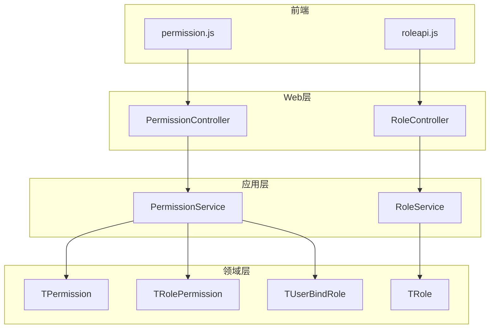
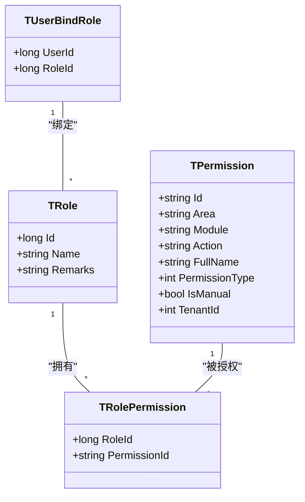
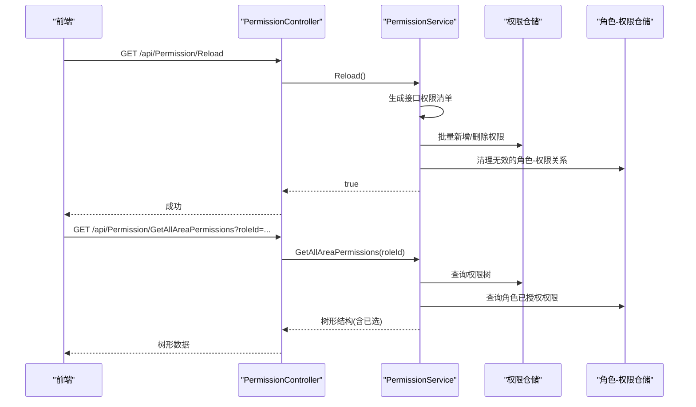
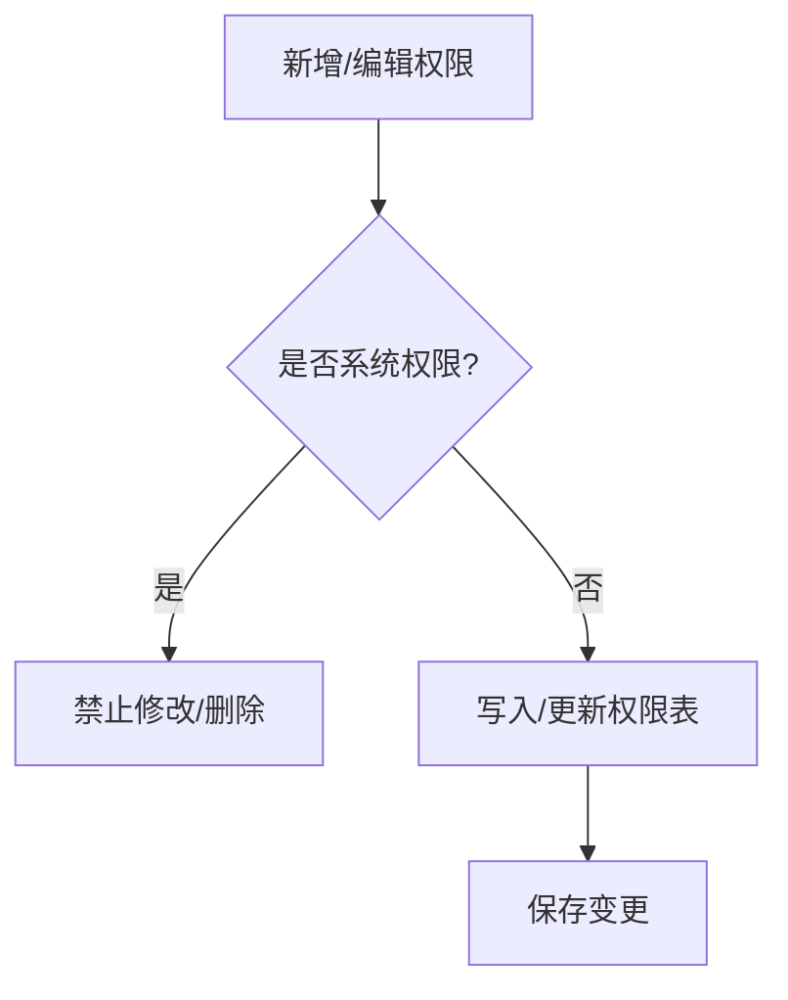
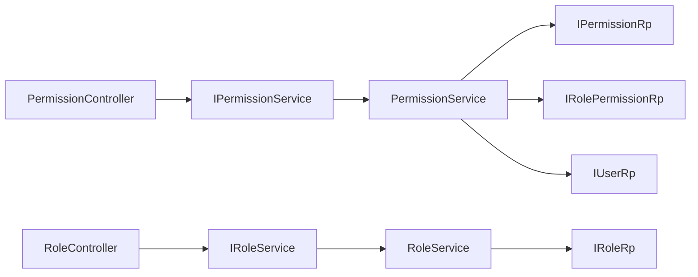
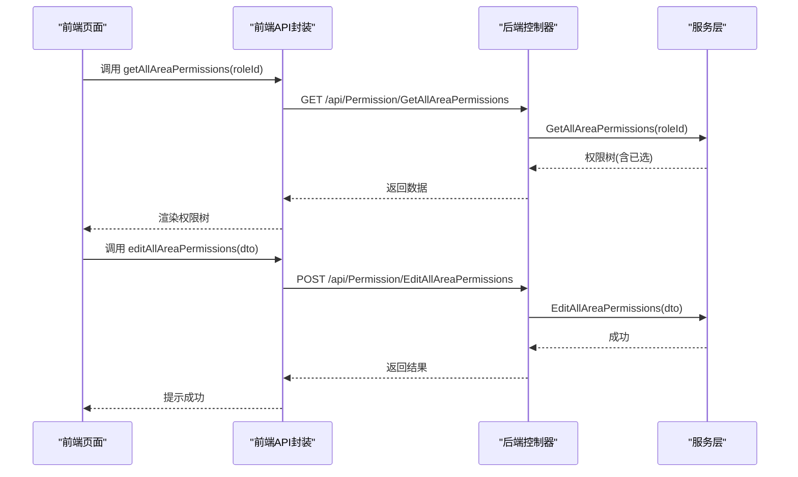

# 角色权限接口

<cite>
**本文引用的文件**
- [PermissionController.cs](file://Kevin/Kevin.Web.Basics/Controllers/PermissionController.cs)
- [RoleController.cs](file://Kevin/Kevin.Web.Basics/Controllers/RoleController.cs)
- [PermissionService.cs](file://Kevin/Application/Services/PermissionService.cs)
- [RoleService.cs](file://Kevin/Application/Services/RoleService.cs)
- [TPermission.cs](file://Kevin/Domain/Entities/TPermission.cs)
- [TRole.cs](file://Kevin/Domain/Entities/TRole.cs)
- [TRolePermission.cs](file://Kevin/Domain/Entities/TRolePermission.cs)
- [TUserBindRole.cs](file://Kevin/Domain/Entities/TUserBindRole.cs)
- [IPermissionService.cs](file://Kevin/Domain/Interfaces/IServices/IPermissionService.cs)
- [IRoleService.cs](file://Kevin/Domain/Interfaces/IServices/IRoleService.cs)
- [permission.js](file://vue/kevin.web.vue/src/api/permission.js)
- [roleapi.js](file://vue/kevin.web.vue/src/api/roleapi.js)
</cite>

## 目录
1. [简介](#简介)
2. [项目结构](#项目结构)
3. [核心组件](#核心组件)
4. [架构总览](#架构总览)
5. [详细组件分析](#详细组件分析)
6. [依赖关系分析](#依赖关系分析)
7. [性能考虑](#性能考虑)
8. [故障排查指南](#故障排查指南)
9. [结论](#结论)
10. [附录](#附录)

## 简介
本文件面向“角色权限管理”的API与实现，围绕RBAC（基于角色的访问控制）模型，提供：
- 角色CRUD、权限分配、用户角色绑定等能力说明
- 权限控制器全部端点文档（含权限树形结构获取、菜单权限配置）
- 权限验证完整流程与前后端集成示例
- 权限继承、数据权限等高级特性的使用说明

## 项目结构
后端采用分层架构：
- Web层：控制器暴露REST API
- 应用层：服务编排业务逻辑
- 领域层：实体与仓储接口
- 前端：Vue调用统一HTTP封装

图表来源
- [PermissionController.cs:1-165](file://Kevin/Kevin.Web.Basics/Controllers/PermissionController.cs#L1-L165)
- [RoleController.cs:1-78](file://Kevin/Kevin.Web.Basics/Controllers/RoleController.cs#L1-L78)
- [PermissionService.cs:1-434](file://Kevin/Application/Services/PermissionService.cs#L1-L434)
- [RoleService.cs:1-116](file://Kevin/Application/Services/RoleService.cs#L1-L116)
- [TPermission.cs:1-154](file://Kevin/Domain/Entities/TPermission.cs#L1-L154)
- [TRole.cs:1-41](file://Kevin/Domain/Entities/TRole.cs#L1-L41)
- [TRolePermission.cs:1-29](file://Kevin/Domain/Entities/TRolePermission.cs#L1-L29)
- [TUserBindRole.cs:1-22](file://Kevin/Domain/Entities/TUserBindRole.cs#L1-L22)
- [permission.js:1-32](file://vue/kevin.web.vue/src/api/permission.js#L1-L32)
- [roleapi.js:1-23](file://vue/kevin.web.vue/src/api/roleapi.js#L1-L23)

章节来源
- [PermissionController.cs:1-165](file://Kevin/Kevin.Web.Basics/Controllers/PermissionController.cs#L1-L165)
- [RoleController.cs:1-78](file://Kevin/Kevin.Web.Basics/Controllers/RoleController.cs#L1-L78)

## 核心组件
- 权限控制器 PermissionController：提供权限初始化、分页查询、详情、删除、新增/编辑、全量列表、按角色获取/编辑权限树、当前登录用户权限等接口。
- 角色控制器 RoleController：提供角色分页、新增/编辑、删除、按ID获取、全量获取等接口。
- 权限服务 PermissionService：实现权限初始化（含数据权限）、权限CRUD、角色-权限批量授权、当前用户权限计算等。
- 角色服务 RoleService：实现角色CRUD与分页查询。
- 领域实体：TPermission、TRole、TRolePermission、TUserBindRole 描述权限、角色、角色-权限关联、用户-角色关联。

章节来源
- [PermissionController.cs:1-165](file://Kevin/Kevin.Web.Basics/Controllers/PermissionController.cs#L1-L165)
- [RoleController.cs:1-78](file://Kevin/Kevin.Web.Basics/Controllers/RoleController.cs#L1-L78)
- [PermissionService.cs:1-434](file://Kevin/Application/Services/PermissionService.cs#L1-L434)
- [RoleService.cs:1-116](file://Kevin/Application/Services/RoleService.cs#L1-L116)
- [TPermission.cs:1-154](file://Kevin/Domain/Entities/TPermission.cs#L1-L154)
- [TRole.cs:1-41](file://Kevin/Domain/Entities/TRole.cs#L1-L41)
- [TRolePermission.cs:1-29](file://Kevin/Domain/Entities/TRolePermission.cs#L1-L29)
- [TUserBindRole.cs:1-22](file://Kevin/Domain/Entities/TUserBindRole.cs#L1-L22)

## 架构总览
权限体系以“区域-模块-动作”为粒度，支持多种权限类型（菜单、功能、数据、接口），并通过角色进行聚合授权，最终映射到当前用户的可操作集合。

图表来源
- [TPermission.cs:1-154](file://Kevin/Domain/Entities/TPermission.cs#L1-L154)
- [TRole.cs:1-41](file://Kevin/Domain/Entities/TRole.cs#L1-L41)
- [TRolePermission.cs:1-29](file://Kevin/Domain/Entities/TRolePermission.cs#L1-L29)
- [TUserBindRole.cs:1-22](file://Kevin/Domain/Entities/TUserBindRole.cs#L1-L22)

## 详细组件分析

### 权限控制器（PermissionController）端点
- 初始化权限
  - 方法：GET /api/Permission/Reload
  - 说明：根据全局模块定义生成接口权限并同步至数据库；同时初始化数据权限。
  - 鉴权：跳过权限校验（用于系统初始化）。
- 获取权限分页
  - 方法：POST /api/Permission/GetPageData
  - 入参：分页对象（包含搜索关键字）
  - 返回：分页结果
- 获取权限详情
  - 方法：GET /api/Permission/GetDetails?Id=...
  - 返回：权限详情
- 删除权限
  - 方法：DELETE /api/Permission/Del?id=...
  - 说明：仅允许删除手动添加的权限。
- 新增/编辑权限
  - 方法：POST /api/Permission/Add 或 /api/Permission/Edit
  - 入参：权限DTO（新增时必填Area/Module/Action等）
  - 说明：新增会校验重复；编辑需满足非系统权限限制。
- 获取所有权限
  - 方法：GET /api/Permission/GetAllPermissions
  - 返回：权限列表
- 获取所有权限ID
  - 方法：GET /api/Permission/GetAllPermissionIds
  - 返回：权限ID列表
- 获取角色对应权限（树形）
  - 方法：GET /api/Permission/GetAllAreaPermissions?roleId=...
  - 返回：按权限类型-区域-模块-动作组织的树形结构，并标注已勾选项
- 编辑角色对应权限
  - 方法：POST /api/Permission/EditAllAreaPermissions
  - 入参：角色ID与权限ID集合
  - 说明：增量更新角色-权限关系
- 获取当前登录用户权限
  - 方法：GET /api/Permission/GetUserPermissions
  - 返回：当前用户可用权限标识集合

章节来源
- [PermissionController.cs:1-165](file://Kevin/Kevin.Web.Basics/Controllers/PermissionController.cs#L1-L165)

### 角色控制器（RoleController）端点
- 获取角色分页
  - 方法：POST /api/Role/GetRolePage
  - 入参：分页对象（支持名称/备注模糊搜索）
  - 返回：分页结果
- 新增/编辑角色
  - 方法：POST /api/Role/AddEidt
  - 入参：角色DTO
  - 说明：新增自动生成主键；编辑需存在且未删除
- 删除角色
  - 方法：DELETE /api/Role/DeleteRole?roleId=...
  - 说明：种子数据不可删除
- 获取指定角色
  - 方法：GET /api/Role/GetRoleById?roleId=...
  - 返回：角色详情
- 获取所有角色
  - 方法：GET /api/Role/GetAllRoles
  - 返回：角色列表

章节来源
- [RoleController.cs:1-78](file://Kevin/Kevin.Web.Basics/Controllers/RoleController.cs#L1-L78)

### 权限服务（PermissionService）关键流程
- 权限初始化（Reload）
  - 从全局模块清单生成接口权限，设置权限类型为“接口权限”，写入权限表
  - 随后初始化数据权限（按模块+数据权限动作生成）
- 数据权限初始化（ReloadDataPermission）
  - 按模块维度生成数据权限项，标记为“数据权限”
- 批量同步权限（InDtoAddPermission）
  - 对比现有权限与目标清单，执行新增/删除，并清理不再存在的角色-权限关系
- 角色-权限批量授权（EditAllAreaPermissions）
  - 计算差集，新增缺失的授权，软删除多余的授权
- 当前用户权限计算（GetUserPermissions）
  - 若为超级管理员，返回全部权限；否则返回该用户通过角色继承得到的权限集合

图表来源
- [PermissionController.cs:1-165](file://Kevin/Kevin.Web.Basics/Controllers/PermissionController.cs#L1-L165)
- [PermissionService.cs:1-434](file://Kevin/Application/Services/PermissionService.cs#L1-L434)

章节来源
- [PermissionService.cs:1-434](file://Kevin/Application/Services/PermissionService.cs#L1-L434)

### 角色服务（RoleService）关键流程
- 分页查询：按租户过滤，支持名称/备注搜索
- 新增/编辑：新增生成主键；编辑校验存在性并更新
- 删除：软删除，禁止删除种子数据
- 按ID获取/全量获取：返回基础信息

章节来源
- [RoleService.cs:1-116](file://Kevin/Application/Services/RoleService.cs#L1-L116)

### 领域实体与关系
- TPermission：权限主数据，包含区域、模块、动作、HTTP方法、权限类型、是否手动创建等
- TRole：角色主数据
- TRolePermission：角色与权限的多对多关系
- TUserBindRole：用户与角色的多对多关系（用于用户-角色绑定）

图表来源
- [TPermission.cs:1-154](file://Kevin/Domain/Entities/TPermission.cs#L1-L154)
- [PermissionService.cs:221-266](file://Kevin/Application/Services/PermissionService.cs#L221-L266)

章节来源
- [TPermission.cs:1-154](file://Kevin/Domain/Entities/TPermission.cs#L1-L154)
- [TRole.cs:1-41](file://Kevin/Domain/Entities/TRole.cs#L1-L41)
- [TRolePermission.cs:1-29](file://Kevin/Domain/Entities/TRolePermission.cs#L1-L29)
- [TUserBindRole.cs:1-22](file://Kevin/Domain/Entities/TUserBindRole.cs#L1-L22)

## 依赖关系分析
- 控制器依赖服务接口：
  - PermissionController -> IPermissionService
  - RoleController -> IRoleService
- 服务依赖仓储与上下文：
  - PermissionService -> IPermissionRp, IRolePermissionRp, IUserRp
  - RoleService -> IRoleRp
- 前端API封装：
  - permission.js 调用权限相关接口
  - roleapi.js 调用角色相关接口

图表来源
- [IPermissionService.cs:1-68](file://Kevin/Domain/Interfaces/IServices/IPermissionService.cs#L1-L68)
- [IRoleService.cs:1-14](file://Kevin/Domain/Interfaces/IServices/IRoleService.cs#L1-L14)
- [PermissionService.cs:1-434](file://Kevin/Application/Services/PermissionService.cs#L1-L434)
- [RoleService.cs:1-116](file://Kevin/Application/Services/RoleService.cs#L1-L116)

章节来源
- [IPermissionService.cs:1-68](file://Kevin/Domain/Interfaces/IServices/IPermissionService.cs#L1-L68)
- [IRoleService.cs:1-14](file://Kevin/Domain/Interfaces/IServices/IRoleService.cs#L1-L14)

## 性能考虑
- 权限初始化与同步
  - 使用批量新增/删除减少数据库往返
  - 先计算差集再持久化，避免无谓更新
- 分页与检索
  - 服务端分页，结合关键字模糊匹配，注意索引设计
- 权限树构建
  - 一次性加载并按内存分组，减少多次查询
- 缓存建议
  - 只读权限列表可在前端或网关层做短期缓存（如浏览器缓存或CDN）
  - 敏感操作（授权变更）后应失效相关缓存

[本节为通用指导，不直接分析具体文件]

## 故障排查指南
- 无法删除系统权限
  - 现象：尝试删除IsManual=false的权限时报错
  - 处理：仅允许删除手动创建的权限；如需调整，请重新初始化权限
- 相同Area/Module/Action重复
  - 现象：新增或编辑时报重复错误
  - 处理：检查权限唯一性约束，确保Action在Area+Module下唯一
- 种子角色不可删除
  - 现象：删除内置角色失败
  - 处理：请勿删除种子数据；如需扩展，新建角色
- 权限未生效
  - 现象：授权后前端仍无权限
  - 处理：确认已调用“获取当前用户权限”接口刷新；必要时触发权限初始化

章节来源
- [PermissionService.cs:208-219](file://Kevin/Application/Services/PermissionService.cs#L208-L219)
- [PermissionService.cs:226-266](file://Kevin/Application/Services/PermissionService.cs#L226-L266)
- [RoleService.cs:76-91](file://Kevin/Application/Services/RoleService.cs#L76-L91)

## 结论
本权限体系以“区域-模块-动作”为核心粒度，结合角色聚合授权，支持菜单、功能、数据、接口四类权限。通过统一的控制器与服务层，实现了权限初始化、角色管理、权限分配与用户权限计算的闭环。配合前端API封装，可快速完成权限树展示与授权配置。

[本节为总结，不直接分析具体文件]

## 附录

### API 端点一览（权限）
- GET /api/Permission/Reload
- POST /api/Permission/GetPageData
- GET /api/Permission/GetDetails?Id=...
- DELETE /api/Permission/Del?id=...
- POST /api/Permission/Add
- POST /api/Permission/Edit
- GET /api/Permission/GetAllPermissions
- GET /api/Permission/GetAllPermissionIds
- GET /api/Permission/GetAllAreaPermissions?roleId=...
- POST /api/Permission/EditAllAreaPermissions
- GET /api/Permission/GetUserPermissions

章节来源
- [PermissionController.cs:1-165](file://Kevin/Kevin.Web.Basics/Controllers/PermissionController.cs#L1-L165)

### API 端点一览（角色）
- POST /api/Role/GetRolePage
- POST /api/Role/AddEidt
- DELETE /api/Role/DeleteRole?roleId=...
- GET /api/Role/GetRoleById?roleId=...
- GET /api/Role/GetAllRoles

章节来源
- [RoleController.cs:1-78](file://Kevin/Kevin.Web.Basics/Controllers/RoleController.cs#L1-L78)

### 权限验证流程（前后端集成示例）
- 前端调用
  - 使用 permission.js 中的 reload、getAllAreaPermissions、editAllAreaPermissions 等方法调用后端接口
  - 使用 roleapi.js 中的 getRolePage、addEidtRole、deleteRole、getRoleById、getAllRoles 等方法管理角色
- 典型流程
  - 初始化权限：调用 /api/Permission/Reload
  - 获取权限树：调用 /api/Permission/GetAllAreaPermissions?roleId=...
  - 授权保存：调用 /api/Permission/EditAllAreaPermissions
  - 刷新用户权限：调用 /api/Permission/GetUserPermissions

图表来源
- [permission.js:1-32](file://vue/kevin.web.vue/src/api/permission.js#L1-L32)
- [roleapi.js:1-23](file://vue/kevin.web.vue/src/api/roleapi.js#L1-L23)
- [PermissionController.cs:1-165](file://Kevin/Kevin.Web.Basics/Controllers/PermissionController.cs#L1-L165)
- [PermissionService.cs:1-434](file://Kevin/Application/Services/PermissionService.cs#L1-L434)

### 高级特性说明
- 权限继承
  - 用户通过绑定多个角色，继承其所有权限；超级管理员默认拥有全部权限
- 数据权限
  - 按模块维度生成数据权限项，用于控制数据可见范围
- 权限类型
  - 菜单权限、功能权限、数据权限、接口权限，分别对应不同粒度的控制

章节来源
- [PermissionService.cs:25-79](file://Kevin/Application/Services/PermissionService.cs#L25-L79)
- [PermissionService.cs:416-431](file://Kevin/Application/Services/PermissionService.cs#L416-L431)