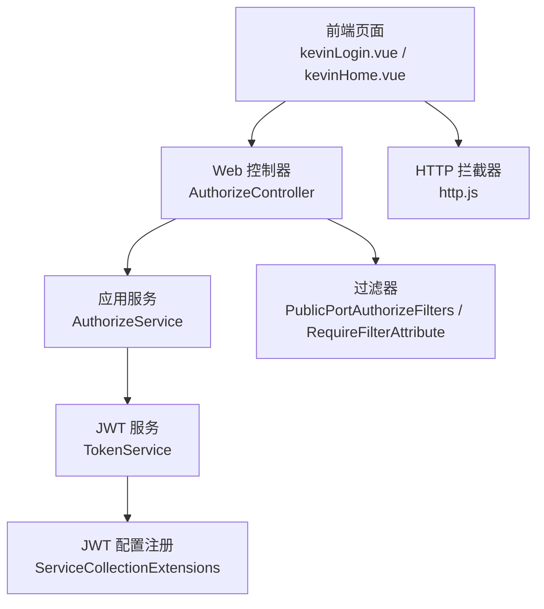
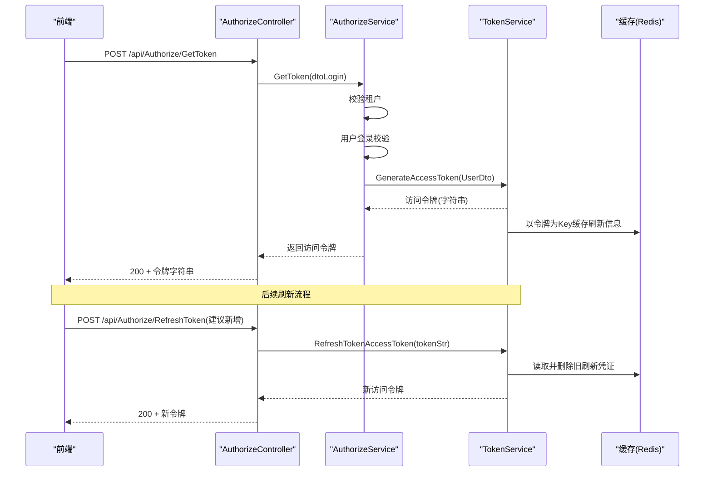
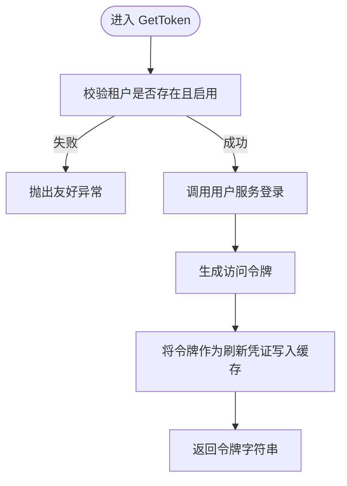
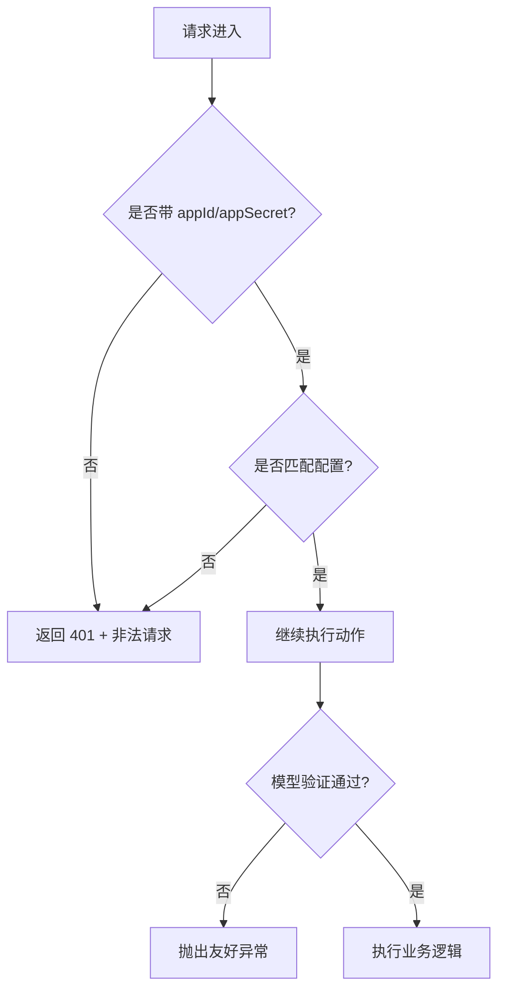
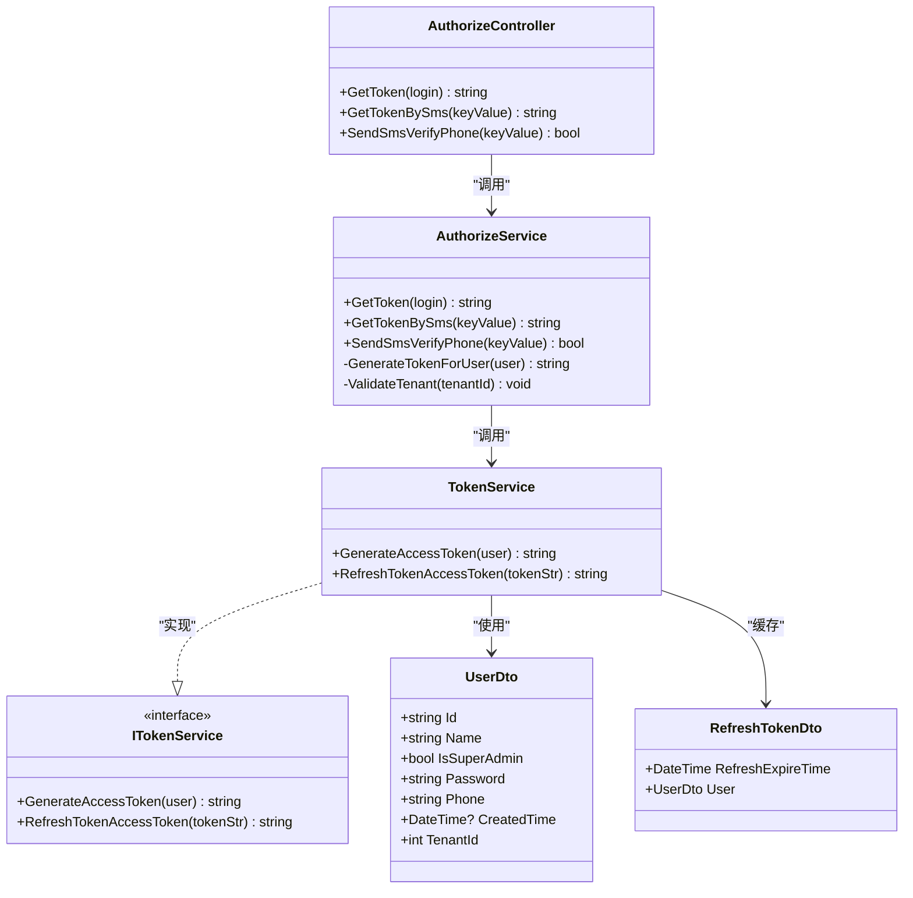

# 认证授权接口

<cite>
**本文引用的文件**
- [AuthorizeController.cs](file://Kevin/ Kevin.Web.Basics/Controllers/AuthorizeController.cs)
- [AuthorizeService.cs](file://Kevin/Application/Services/AuthorizeService.cs)
- [TokenService.cs](file://Kevin/kevin.Module/Kevin.Authentication.Jwt/Service/TokenService.cs)
- [ITokenService.cs](file://Kevin/kevin.Module/Kevin.Authentication.Jwt/IService/ITokenService.cs)
- [UserDto.cs](file://Kevin/kevin.Module/Kevin.Authentication.Jwt/Dto/UserDto.cs)
- [RefreshTokenDto.cs](file://Kevin/kevin.Module/Kevin.Authentication.Jwt/Dto/RefreshTokenDto.cs)
- [ServiceCollectionExtensions.cs](file://Kevin/kevin.Module/Kevin.Authentication.Jwt/ServiceCollectionExtensions.cs)
- [PublicPortAuthorizeFilters.cs](file://Kevin/ Kevin.Web.Basics/Filters/PublicPortAuthorizeFilters.cs)
- [RequireFilterAttribute.cs](file://Kevin/ Kevin.Web.Basics/Filters/RequireFilterAttribute.cs)
- [http.js](file://vue/kevin.web.vue/src/utils/http.js)
- [baseapi.js](file://vue/kevin.web.vue/src/api/baseapi.js)
- [kevinLogin.vue](file://vue/kevin.web.vue/src/pages/kevinLogin.vue)
- [kevinHome.vue](file://vue/kevin.web.vue/src/pages/kevinHome.vue)
</cite>

## 目录
1. [简介](#简介)
2. [项目结构](#项目结构)
3. [核心组件](#核心组件)
4. [架构总览](#架构总览)
5. [详细组件分析](#详细组件分析)
6. [依赖关系分析](#依赖关系分析)
7. [性能考虑](#性能考虑)
8. [故障排查指南](#故障排查指南)
9. [结论](#结论)
10. [附录](#附录)

## 简介
本文件面向前后端开发者，系统化说明本项目中基于 JWT 的认证与授权机制，覆盖登录、短信登录、令牌刷新等核心接口的 HTTP 方法、URL 模式、请求参数与响应格式；解释权限验证过滤器的工作原理与使用方式；提供前端集成示例与常见问题解决方案。

## 项目结构
认证授权相关代码主要分布在以下模块：
- Web 层控制器：对外暴露认证接口（登录、短信登录、发送验证码）
- 应用服务层：业务编排（租户校验、用户登录、生成 Token）
- JWT 模块：令牌签发与刷新、配置注册
- 过滤器：对外接口密钥校验、模型验证
- 前端：登录流程、鉴权拦截、权限获取与存储

图表来源
- [AuthorizeController.cs:11-61](file://Kevin/ Kevin.Web.Basics/Controllers/AuthorizeController.cs#L11-L61)
- [AuthorizeService.cs:13-143](file://Kevin/Application/Services/AuthorizeService.cs#L13-L143)
- [TokenService.cs:13-108](file://Kevin/kevin.Module/Kevin.Authentication.Jwt/Service/TokenService.cs#L13-L108)
- [ServiceCollectionExtensions.cs:13-39](file://Kevin/kevin.Module/Kevin.Authentication.Jwt/ServiceCollectionExtensions.cs#L13-L39)
- [PublicPortAuthorizeFilters.cs:10-41](file://Kevin/ Kevin.Web.Basics/Filters/PublicPortAuthorizeFilters.cs#L10-L41)
- [RequireFilterAttribute.cs:6-22](file://Kevin/ Kevin.Web.Basics/Filters/RequireFilterAttribute.cs#L6-L22)
- [http.js:69-124](file://vue/kevin.web.vue/src/utils/http.js#L69-L124)

章节来源
- [AuthorizeController.cs:11-61](file://Kevin/ Kevin.Web.Basics/Controllers/AuthorizeController.cs#L11-L61)
- [AuthorizeService.cs:13-143](file://Kevin/Application/Services/AuthorizeService.cs#L13-L143)
- [TokenService.cs:13-108](file://Kevin/kevin.Module/Kevin.Authentication.Jwt/Service/TokenService.cs#L13-L108)
- [ServiceCollectionExtensions.cs:13-39](file://Kevin/kevin.Module/Kevin.Authentication.Jwt/ServiceCollectionExtensions.cs#L13-L39)
- [PublicPortAuthorizeFilters.cs:10-41](file://Kevin/ Kevin.Web.Basics/Filters/PublicPortAuthorizeFilters.cs#L10-L41)
- [RequireFilterAttribute.cs:6-22](file://Kevin/ Kevin.Web.Basics/Filters/RequireFilterAttribute.cs#L6-L22)
- [http.js:69-124](file://vue/kevin.web.vue/src/utils/http.js#L69-L124)

## 核心组件
- 控制器 AuthorizeController：定义登录、短信登录、发送验证码三个 HTTP 接口，统一返回字符串类型的访问令牌或布尔结果。
- 服务 AuthorizeService：负责租户有效性校验、用户登录、调用 JWT 服务生成访问令牌；支持短信验证码登录并自动注册用户。
- JWT 服务 TokenService：根据配置签发访问令牌，并将令牌作为“刷新凭证”缓存到 Redis；提供基于缓存令牌的刷新能力。
- 配置 ServiceCollectionExtensions：注册 ASP.NET Core JWT 认证方案，设置 Issuer、Audience、签名 Key、ClockSkew 等。
- 过滤器 PublicPortAuthorizeFilters：对外公开接口进行 appId/appSecret 校验。
- 过滤器 RequireFilterAttribute：对模型绑定与验证失败进行统一处理。
- 前端 http.js：封装 Axios 拦截器，统一处理 401/403 错误、清理本地状态并跳转登录页。

章节来源
- [AuthorizeController.cs:11-61](file://Kevin/ Kevin.Web.Basics/Controllers/AuthorizeController.cs#L11-L61)
- [AuthorizeService.cs:13-143](file://Kevin/Application/Services/AuthorizeService.cs#L13-L143)
- [TokenService.cs:13-108](file://Kevin/kevin.Module/Kevin.Authentication.Jwt/Service/TokenService.cs#L13-L108)
- [ServiceCollectionExtensions.cs:13-39](file://Kevin/kevin.Module/Kevin.Authentication.Jwt/ServiceCollectionExtensions.cs#L13-L39)
- [PublicPortAuthorizeFilters.cs:10-41](file://Kevin/ Kevin.Web.Basics/Filters/PublicPortAuthorizeFilters.cs#L10-L41)
- [RequireFilterAttribute.cs:6-22](file://Kevin/ Kevin.Web.Basics/Filters/RequireFilterAttribute.cs#L6-L22)
- [http.js:69-124](file://vue/kevin.web.vue/src/utils/http.js#L69-L124)

## 架构总览
下图展示从前端发起登录到后端签发 JWT 的完整调用链，以及后续刷新令牌的流程。

图表来源
- [AuthorizeController.cs:32-47](file://Kevin/ Kevin.Web.Basics/Controllers/AuthorizeController.cs#L32-L47)
- [AuthorizeService.cs:37-60](file://Kevin/Application/Services/AuthorizeService.cs#L37-L60)
- [TokenService.cs:29-108](file://Kevin/kevin.Module/Kevin.Authentication.Jwt/Service/TokenService.cs#L29-L108)

## 详细组件分析

### 登录接口（用户名+密码）
- 接口
  - 方法：POST
  - URL：/api/Authorize/GetToken
  - 请求体：dtoLogin（包含用户名、密码、租户ID、可选密码哈希）
  - 响应：字符串（访问令牌）
- 处理逻辑
  - 控制器接收请求并委托服务层
  - 服务层校验租户有效性
  - 调用用户服务完成登录校验
  - 通过 JWT 服务生成访问令牌，并将令牌作为刷新凭证写入缓存
- 错误处理
  - 租户不存在或已停用：抛出友好异常
  - 登录失败：由上层统一异常处理返回错误信息

图表来源
- [AuthorizeController.cs:32-37](file://Kevin/ Kevin.Web.Basics/Controllers/AuthorizeController.cs#L32-L37)
- [AuthorizeService.cs:37-60](file://Kevin/Application/Services/AuthorizeService.cs#L37-L60)
- [TokenService.cs:29-60](file://Kevin/kevin.Module/Kevin.Authentication.Jwt/Service/TokenService.cs#L29-L60)

章节来源
- [AuthorizeController.cs:32-37](file://Kevin/ Kevin.Web.Basics/Controllers/AuthorizeController.cs#L32-L37)
- [AuthorizeService.cs:37-60](file://Kevin/Application/Services/AuthorizeService.cs#L37-L60)
- [TokenService.cs:29-60](file://Kevin/kevin.Module/Kevin.Authentication.Jwt/Service/TokenService.cs#L29-L60)

### 短信验证码登录接口
- 接口
  - 方法：POST
  - URL：/api/Authorize/GetTokenBySms
  - 请求体：dtoKeyValue（key=手机号，value=验证码）
  - 响应：字符串（访问令牌）
- 处理逻辑
  - 校验短信验证码
  - 若用户不存在则自动创建基础账户
  - 使用密码哈希直接登录，避免重复哈希
  - 生成访问令牌并缓存刷新凭证
- 错误处理
  - 验证码校验失败：抛出友好异常

章节来源
- [AuthorizeController.cs:43-47](file://Kevin/ Kevin.Web.Basics/Controllers/AuthorizeController.cs#L43-L47)
- [AuthorizeService.cs:75-113](file://Kevin/Application/Services/AuthorizeService.cs#L75-L113)

### 发送短信验证码接口
- 接口
  - 方法：POST
  - URL：/api/Authorize/SendSmsVerifyPhone
  - 请求体：dtoKeyValue（key=手机号，value可为空）
  - 响应：布尔值（是否发送成功）
- 处理逻辑
  - 生成随机验证码
  - 调用短信服务发送
  - 将验证码存入缓存（短时过期）
- 错误处理
  - 发送失败：返回 false

章节来源
- [AuthorizeController.cs:55-58](file://Kevin/ Kevin.Web.Basics/Controllers/AuthorizeController.cs#L55-L58)
- [AuthorizeService.cs:114-140](file://Kevin/Application/Services/AuthorizeService.cs#L114-L140)

### 令牌刷新接口（建议新增）
当前 TokenService 已实现基于缓存令牌的刷新能力，但控制器未暴露对应接口。建议新增：
- 方法：POST
- URL：/api/Authorize/RefreshToken
- 请求体：tokenStr（上一次登录返回的访问令牌）
- 响应：字符串（新的访问令牌）
- 处理逻辑
  - 从缓存读取该令牌对应的刷新凭证
  - 校验有效后删除旧凭证
  - 重新签发访问令牌，并再次写入缓存
- 错误处理
  - 缓存中无对应凭证或已过期：返回空或错误码

章节来源
- [TokenService.cs:67-108](file://Kevin/kevin.Module/Kevin.Authentication.Jwt/Service/TokenService.cs#L67-L108)

### 登出机制
- 服务端无显式登出接口
- 客户端在退出时清除本地 token、user、UserPermissions 等状态，并跳转登录页
- 由于刷新凭证采用一次性策略（刷新后删除），可视为服务端侧的“软登出”

章节来源
- [kevinHome.vue:689-696](file://vue/kevin.web.vue/src/pages/kevinHome.vue#L689-L696)
- [http.js:77-90](file://vue/kevin.web.vue/src/utils/http.js#L77-L90)

### 权限验证过滤器
- 对外接口密钥校验过滤器
  - 作用：校验请求头中的 appId 与 appSecret，不匹配则返回 401 与错误消息
  - 使用方式：在需要保护的公开接口上添加特性标记
- 模型验证过滤器
  - 作用：当模型绑定或验证失败时，统一抛出友好异常
  - 使用方式：在控制器或动作上添加特性标记

图表来源
- [PublicPortAuthorizeFilters.cs:30-39](file://Kevin/ Kevin.Web.Basics/Filters/PublicPortAuthorizeFilters.cs#L30-L39)
- [RequireFilterAttribute.cs:8-18](file://Kevin/ Kevin.Web.Basics/Filters/RequireFilterAttribute.cs#L8-L18)

章节来源
- [PublicPortAuthorizeFilters.cs:10-41](file://Kevin/ Kevin.Web.Basics/Filters/PublicPortAuthorizeFilters.cs#L10-L41)
- [RequireFilterAttribute.cs:6-22](file://Kevin/ Kevin.Web.Basics/Filters/RequireFilterAttribute.cs#L6-L22)

### JWT 配置与认证方案
- 配置项
  - Jwt.Key：对称签名密钥
  - Jwt.Issuer：签发者
  - Jwt.Audience：受众
  - Jwt.AccessTokenExpirationMinutes：访问令牌有效期（分钟）
  - Jwt.RefreshTokenExpirationDays：刷新凭证有效期（天）
- 认证方案
  - 默认使用 JwtBearer 方案
  - 严格校验 Issuer、Audience、Lifetime、签名 Key
  - ClockSkew 设置为零，确保过期时间严格

章节来源
- [ServiceCollectionExtensions.cs:13-39](file://Kevin/kevin.Module/Kevin.Authentication.Jwt/ServiceCollectionExtensions.cs#L13-L39)

## 依赖关系分析
- 控制器依赖服务层，服务层依赖用户服务与 JWT 服务
- JWT 服务依赖配置与缓存服务
- 前端通过 Axios 拦截器统一处理鉴权错误与状态清理

图表来源
- [AuthorizeController.cs:11-61](file://Kevin/ Kevin.Web.Basics/Controllers/AuthorizeController.cs#L11-L61)
- [AuthorizeService.cs:13-143](file://Kevin/Application/Services/AuthorizeService.cs#L13-L143)
- [TokenService.cs:13-108](file://Kevin/kevin.Module/Kevin.Authentication.Jwt/Service/TokenService.cs#L13-L108)
- [ITokenService.cs:5-19](file://Kevin/kevin.Module/Kevin.Authentication.Jwt/IService/ITokenService.cs#L5-L19)
- [UserDto.cs:3-39](file://Kevin/kevin.Module/Kevin.Authentication.Jwt/Dto/UserDto.cs#L3-L39)
- [RefreshTokenDto.cs:3-15](file://Kevin/kevin.Module/Kevin.Authentication.Jwt/Dto/RefreshTokenDto.cs#L3-L15)

章节来源
- [AuthorizeController.cs:11-61](file://Kevin/ Kevin.Web.Basics/Controllers/AuthorizeController.cs#L11-L61)
- [AuthorizeService.cs:13-143](file://Kevin/Application/Services/AuthorizeService.cs#L13-L143)
- [TokenService.cs:13-108](file://Kevin/kevin.Module/Kevin.Authentication.Jwt/Service/TokenService.cs#L13-L108)
- [ITokenService.cs:5-19](file://Kevin/kevin.Module/Kevin.Authentication.Jwt/IService/ITokenService.cs#L5-L19)
- [UserDto.cs:3-39](file://Kevin/kevin.Module/Kevin.Authentication.Jwt/Dto/UserDto.cs#L3-L39)
- [RefreshTokenDto.cs:3-15](file://Kevin/kevin.Module/Kevin.Authentication.Jwt/Dto/RefreshTokenDto.cs#L3-L15)

## 性能考虑
- 令牌刷新采用一次性策略：每次刷新均删除旧凭证，降低重放风险
- 访问令牌较短有效期，减少泄露窗口
- 刷新凭证缓存于 Redis，具备高吞吐与低延迟特性
- 建议在控制器新增刷新接口，避免前端持有过期令牌导致多次无效请求

[本节为通用性能建议，无需特定文件引用]

## 故障排查指南
- 401 未认证
  - 检查请求是否携带有效的访问令牌
  - 前端 http.js 会在 401 时清理本地状态并跳转登录页
- 403 无权限
  - 检查角色与权限分配是否正确
  - 确认是否需要对外接口密钥校验（appId/appSecret）
- 登录失败
  - 检查用户名、密码、租户ID是否正确
  - 查看服务层抛出的友好异常信息
- 短信验证码问题
  - 确认短信服务可用
  - 验证码缓存是否过期（默认短时）
- 刷新令牌失败
  - 确认传入的是上次登录返回的访问令牌
  - 检查缓存中是否存在对应刷新凭证

章节来源
- [http.js:69-124](file://vue/kevin.web.vue/src/utils/http.js#L69-L124)
- [AuthorizeService.cs:62-74](file://Kevin/Application/Services/AuthorizeService.cs#L62-L74)
- [AuthorizeService.cs:114-140](file://Kevin/Application/Services/AuthorizeService.cs#L114-L140)
- [TokenService.cs:67-108](file://Kevin/kevin.Module/Kevin.Authentication.Jwt/Service/TokenService.cs#L67-L108)

## 结论
本项目采用标准的 JWT 认证方案，结合一次性刷新凭证与严格的令牌校验，实现了安全的登录与会话管理。通过过滤器提供了对外接口的密钥校验与统一的模型验证。前端通过 Axios 拦截器集中处理鉴权错误与状态清理，提升了用户体验与可维护性。建议补充刷新接口以完善全链路体验。

[本节为总结性内容，无需特定文件引用]

## 附录

### API 清单与数据格式
- 登录
  - 方法：POST
  - URL：/api/Authorize/GetToken
  - 请求体：dtoLogin（用户名、密码、租户ID、可选密码哈希）
  - 响应：字符串（访问令牌）
- 短信登录
  - 方法：POST
  - URL：/api/Authorize/GetTokenBySms
  - 请求体：dtoKeyValue（key=手机号，value=验证码）
  - 响应：字符串（访问令牌）
- 发送验证码
  - 方法：POST
  - URL：/api/Authorize/SendSmsVerifyPhone
  - 请求体：dtoKeyValue（key=手机号，value可为空）
  - 响应：布尔值
- 刷新令牌（建议新增）
  - 方法：POST
  - URL：/api/Authorize/RefreshToken
  - 请求体：tokenStr（上次登录返回的访问令牌）
  - 响应：字符串（新的访问令牌）

章节来源
- [AuthorizeController.cs:32-58](file://Kevin/ Kevin.Web.Basics/Controllers/AuthorizeController.cs#L32-L58)
- [AuthorizeService.cs:37-140](file://Kevin/Application/Services/AuthorizeService.cs#L37-L140)
- [TokenService.cs:29-108](file://Kevin/kevin.Module/Kevin.Authentication.Jwt/Service/TokenService.cs#L29-L108)

### 前端集成示例
- 登录流程
  - 调用登录接口获取令牌
  - 保存令牌与用户信息到本地存储
  - 获取用户权限列表并缓存
- 鉴权拦截
  - 401 时清理本地状态并跳转登录页
  - 403 时提示无权限
- 登出
  - 清除本地 token、user、UserPermissions
  - 跳转登录页

章节来源
- [kevinLogin.vue:253-289](file://vue/kevin.web.vue/src/pages/kevinLogin.vue#L253-L289)
- [baseapi.js:11-13](file://vue/kevin.web.vue/src/api/baseapi.js#L11-L13)
- [http.js:69-124](file://vue/kevin.web.vue/src/utils/http.js#L69-L124)
- [kevinHome.vue:689-696](file://vue/kevin.web.vue/src/pages/kevinHome.vue#L689-L696)