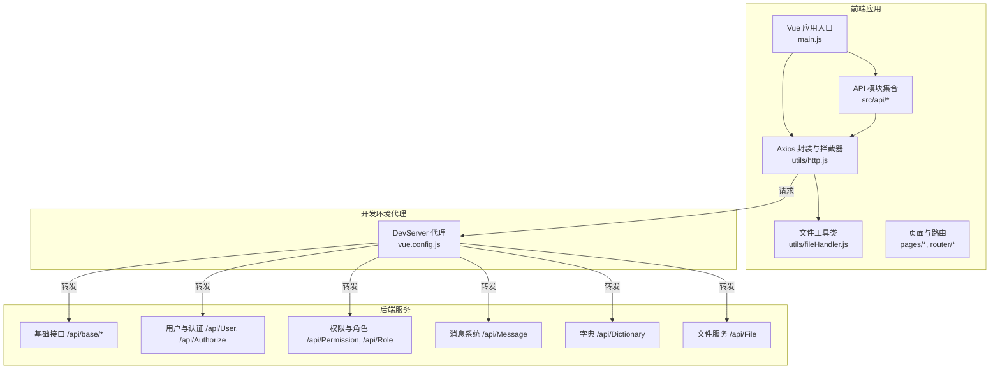
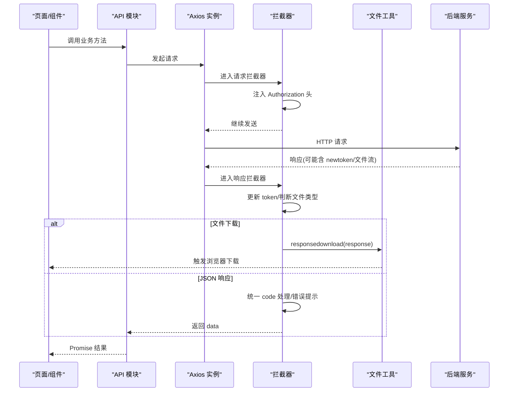
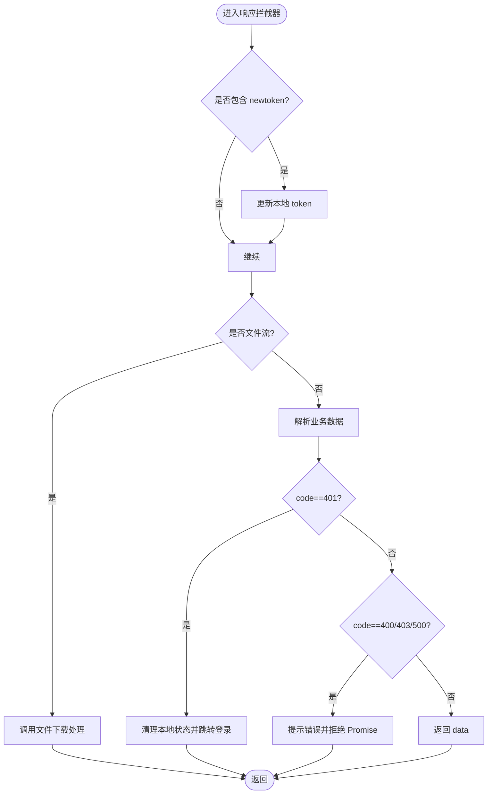
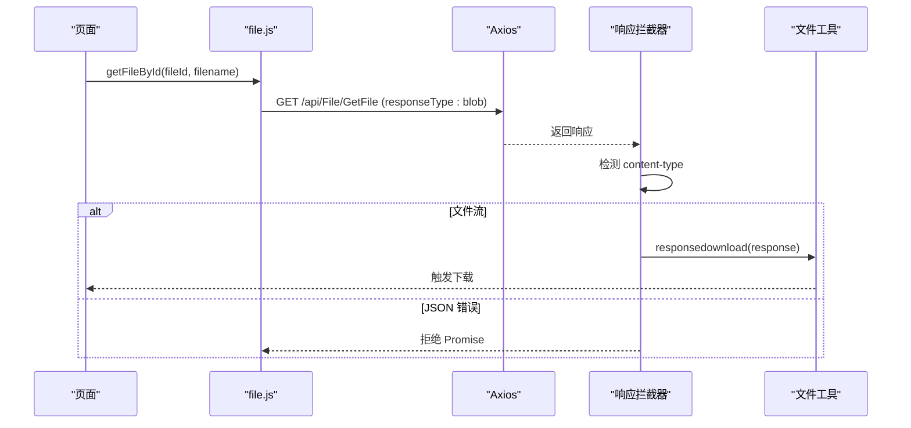
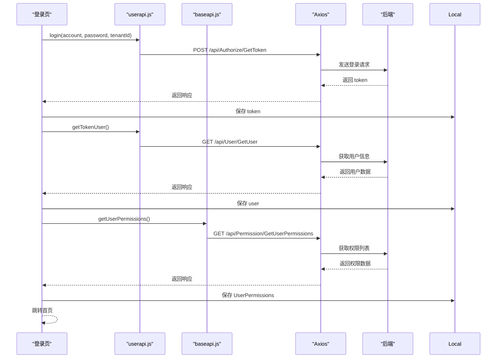
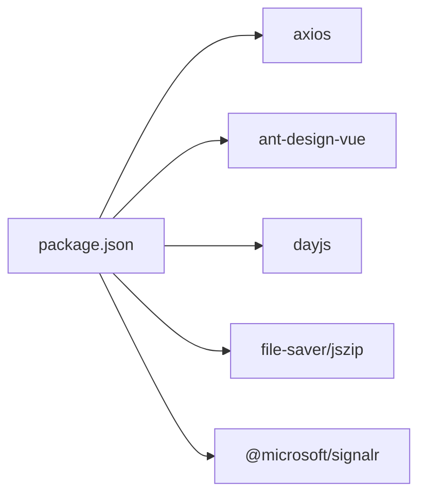

# API对接

<cite>
**本文引用的文件**
- [http.js](file://vue/kevin.web.vue/src/utils/http.js)
- [baseapi.js](file://vue/kevin.web.vue/src/api/baseapi.js)
- [userapi.js](file://vue/kevin.web.vue/src/api/userapi.js)
- [file.js](file://vue/kevin.web.vue/src/api/file.js)
- [message.js](file://vue/kevin.web.vue/src/api/message.js)
- [permission.js](file://vue/kevin.web.vue/src/api/permission.js)
- [roleapi.js](file://vue/kevin.web.vue/src/api/roleapi.js)
- [dic.js](file://vue/kevin.web.vue/src/api/dic.js)
- [fileHandler.js](file://vue/kevin.web.vue/src/utils/fileHandler.js)
- [kevinLogin.vue](file://vue/kevin.web.vue/src/pages/kevinLogin.vue)
- [main.js](file://vue/kevin.web.vue/src/main.js)
- [package.json](file://vue/kevin.web.vue/package.json)
- [vue.config.js](file://vue/kevin.web.vue/vue.config.js)
</cite>

## 目录
1. [简介](#简介)
2. [项目结构](#项目结构)
3. [核心组件](#核心组件)
4. [架构总览](#架构总览)
5. [详细组件分析](#详细组件分析)
6. [依赖关系分析](#依赖关系分析)
7. [性能考虑](#性能考虑)
8. [故障排查指南](#故障排查指南)
9. [结论](#结论)
10. [附录](#附录)

## 简介
本文件面向前端开发者，系统化说明 NetCoreKevin 前端的 API 对接方案。内容涵盖：
- HTTP 请求封装与拦截器配置（请求头、Token 管理、错误统一处理）
- API 模块化组织与接口命名规范
- 认证授权机制（登录状态、Token 刷新、权限验证）
- 异步请求处理、Promise 封装与错误重试策略建议
- API 版本管理与接口文档、Mock 数据支持
- 最佳实践、性能优化与调试技巧
- 与后端微服务架构的协作方式

## 项目结构
前端采用 Vue3 + Ant Design Vue 技术栈，HTTP 客户端基于 Axios 进行封装，API 按业务域拆分到独立模块文件，便于维护与扩展。

图表来源
- [main.js:1-20](file://vue/kevin.web.vue/src/main.js#L1-L20)
- [http.js:1-125](file://vue/kevin.web.vue/src/utils/http.js#L1-L125)
- [fileHandler.js:1-252](file://vue/kevin.web.vue/src/utils/fileHandler.js#L1-L252)
- [vue.config.js:1-21](file://vue/kevin.web.vue/vue.config.js#L1-L21)

章节来源
- [main.js:1-20](file://vue/kevin.web.vue/src/main.js#L1-L20)
- [package.json:1-68](file://vue/kevin.web.vue/package.json#L1-L68)

## 核心组件
- Axios 实例与拦截器：集中管理 baseURL、超时、withCredentials、请求头注入、响应体统一处理、文件下载识别、401/403/400/500 等错误统一提示与跳转。
- 文件处理工具：提供下载、上传、批量上传、预览、Base64/Blob 转换等能力，并与 Axios 响应流无缝衔接。
- API 模块：按业务域划分（用户、权限、角色、消息、字典、文件、基础能力），统一通过 http 实例发起请求，保持调用风格一致。
- 登录流程：在登录页完成 Token 获取与持久化，并拉取用户信息与权限列表缓存至本地存储。

章节来源
- [http.js:1-125](file://vue/kevin.web.vue/src/utils/http.js#L1-L125)
- [fileHandler.js:1-252](file://vue/kevin.web.vue/src/utils/fileHandler.js#L1-L252)
- [userapi.js:1-44](file://vue/kevin.web.vue/src/api/userapi.js#L1-L44)
- [baseapi.js:1-14](file://vue/kevin.web.vue/src/api/baseapi.js#L1-L14)
- [kevinLogin.vue:164-346](file://vue/kevin.web.vue/src/pages/kevinLogin.vue#L164-L346)

## 架构总览
前端通过统一的 Axios 实例对外暴露 API 方法；拦截器负责鉴权与错误收敛；文件模块处理二进制流；开发期通过 DevServer 代理将特定路径转发到后端服务。

图表来源
- [http.js:12-123](file://vue/kevin.web.vue/src/utils/http.js#L12-L123)
- [fileHandler.js:12-44](file://vue/kevin.web.vue/src/utils/fileHandler.js#L12-L44)

## 详细组件分析

### HTTP 请求封装与拦截器
- 请求拦截器
  - 自动从 localStorage 读取 token，并设置 Authorization: Bearer <token>
  - 对 400 错误在请求阶段进行提示
- 响应拦截器
  - 若响应头包含 newtoken，则自动更新本地 token
  - 根据 content-type 识别文件下载响应，交由文件工具处理
  - 统一处理业务码：401 清理本地状态并跳转登录；400/403/500 提示并拒绝 Promise
  - 非 2xx 错误在 catch 分支中统一提示与拒绝

图表来源
- [http.js:29-123](file://vue/kevin.web.vue/src/utils/http.js#L29-L123)

章节来源
- [http.js:1-125](file://vue/kevin.web.vue/src/utils/http.js#L1-L125)

### 文件上传与下载
- 下载
  - 响应拦截器识别常见文件类型后，直接交给文件工具进行下载
  - 文件工具可从响应头解析文件名并触发浏览器下载
- 上传
  - 使用 FormData 构造 multipart/form-data 请求
  - 支持单文件、批量上传与远程地址上传
  - 可传入额外参数与进度回调

图表来源
- [file.js:58-95](file://vue/kevin.web.vue/src/api/file.js#L58-L95)
- [http.js:38-47](file://vue/kevin.web.vue/src/utils/http.js#L38-L47)
- [fileHandler.js:12-44](file://vue/kevin.web.vue/src/utils/fileHandler.js#L12-L44)

章节来源
- [file.js:1-151](file://vue/kevin.web.vue/src/api/file.js#L1-L151)
- [fileHandler.js:1-252](file://vue/kevin.web.vue/src/utils/fileHandler.js#L1-L252)

### 认证与授权
- 登录流程
  - 调用登录接口获取 token，写入本地存储
  - 拉取当前用户信息、用户权限列表并缓存
  - 可选“记住我”功能，持久化登录表单信息
- 鉴权
  - 每次请求自动携带 Authorization 头
  - 服务端返回 401 时，前端清理本地状态并跳转登录页
  - 权限相关接口用于加载菜单与按钮级权限控制

图表来源
- [kevinLogin.vue:239-302](file://vue/kevin.web.vue/src/pages/kevinLogin.vue#L239-L302)
- [userapi.js:3-9](file://vue/kevin.web.vue/src/api/userapi.js#L3-L9)
- [baseapi.js:11-14](file://vue/kevin.web.vue/src/api/baseapi.js#L11-L14)
- [http.js:12-18](file://vue/kevin.web.vue/src/utils/http.js#L12-L18)

章节来源
- [kevinLogin.vue:164-346](file://vue/kevin.web.vue/src/pages/kevinLogin.vue#L164-L346)
- [userapi.js:1-44](file://vue/kevin.web.vue/src/api/userapi.js#L1-L44)
- [baseapi.js:1-14](file://vue/kevin.web.vue/src/api/baseapi.js#L1-L14)
- [http.js:1-125](file://vue/kevin.web.vue/src/utils/http.js#L1-L125)

### API 模块化与命名规范
- 模块化
  - 按业务域拆分：用户、权限、角色、消息、字典、文件、基础能力等
  - 每个模块导出若干函数，统一通过 http 实例发起请求
- 命名规范
  - 函数名采用动词+名词形式，语义清晰（如 getUserList、addEidtRole）
  - 接口路径遵循 RESTful 风格，资源与动作分离（如 /api/User/GetSysUserList）
- 示例模块
  - 用户：登录、获取用户、增删改查、导出
  - 权限：重载、分页、编辑、删除、详情、区域权限
  - 角色：分页、新增编辑、删除、详情、全部角色
  - 消息：未读计数、系统消息、公告、AI 消息
  - 字典：分页、类型列表、增删改
  - 文件：上传、下载、图片、路径、信息、删除

章节来源
- [userapi.js:1-44](file://vue/kevin.web.vue/src/api/userapi.js#L1-L44)
- [permission.js:1-32](file://vue/kevin.web.vue/src/api/permission.js#L1-L32)
- [roleapi.js:1-23](file://vue/kevin.web.vue/src/api/roleapi.js#L1-L23)
- [message.js:1-37](file://vue/kevin.web.vue/src/api/message.js#L1-L37)
- [dic.js:1-18](file://vue/kevin.web.vue/src/api/dic.js#L1-L18)
- [file.js:1-151](file://vue/kevin.web.vue/src/api/file.js#L1-L151)

### 异步请求、Promise 与错误重试
- 异步模型
  - 所有 API 方法返回 Promise，便于链式调用与 async/await
- 错误处理
  - 统一在响应拦截器中处理业务码与网络错误，抛出错误供上层捕获
- 重试机制（建议）
  - 针对幂等 GET 请求可实现指数退避重试
  - 对 401 场景不建议自动重试，应引导重新登录
  - 可通过封装 axios-retry 或自定义重试函数实现

[本节为通用指导，不直接分析具体文件]

### API 版本管理、接口文档与 Mock
- 版本管理
  - 后端存在 v1/v2 控制器目录，前端可按需切换 base URL 或路径前缀
  - 建议在环境变量中配置不同环境的 API 基址，便于多版本共存
- 接口文档
  - 后端 Swagger 集成于版本化模块，可在对应环境访问在线文档
- Mock 数据
  - 可使用 DevServer 代理或第三方 Mock 工具（如 mockjs）在开发期模拟接口

章节来源
- [vue.config.js:5-18](file://vue/kevin.web.vue/vue.config.js#L5-L18)

### 与后端微服务的协作
- 开发期代理
  - 通过 vue.config.js 的 devServer.proxy 将特定路径转发到后端服务
  - 可配置 changeOrigin 与 pathRewrite 以适配后端路由
- 生产部署
  - 通过 Nginx 或网关统一转发，避免跨域问题
  - 结合后端 CORS 配置确保跨域安全

章节来源
- [vue.config.js:5-18](file://vue/kevin.web.vue/vue.config.js#L5-L18)

## 依赖关系分析
前端主要依赖：
- axios：HTTP 客户端
- ant-design-vue：UI 组件库
- dayjs：时间处理
- file-saver/jszip：文件处理辅助
- @microsoft/signalr：实时通信（如需）

图表来源
- [package.json:16-35](file://vue/kevin.web.vue/package.json#L16-L35)

章节来源
- [package.json:1-68](file://vue/kevin.web.vue/package.json#L1-L68)

## 性能考虑
- 合理设置超时与并发
  - 大文件下载/上传建议增加超时与分片策略
- 减少重复请求
  - 对静态或低频变化数据做本地缓存（如权限、字典）
- 懒加载与按需引入
  - 路由与组件按需加载，减少首屏体积
- 文件传输优化
  - 图片压缩、CDN 加速、断点续传（视需求）
- 错误快速失败
  - 统一错误提示，避免阻塞主流程

[本节为通用指导，不直接分析具体文件]

## 故障排查指南
- 常见问题定位
  - 401 未登录：检查 token 是否存在且有效；确认拦截器是否正确注入 Authorization
  - 403 无权限：检查用户权限是否已正确加载与缓存
  - 400/500 错误：查看后端返回 errMsg，定位参数或服务端异常
  - 文件下载失败：检查 content-type 与响应头中的文件名
- 调试技巧
  - 打开浏览器 Network 面板，观察请求头、响应头与响应体
  - 在拦截器中打印关键日志，定位问题阶段
  - 使用 DevTools 控制台输出中间变量，验证逻辑分支

章节来源
- [http.js:12-123](file://vue/kevin.web.vue/src/utils/http.js#L12-L123)
- [fileHandler.js:12-44](file://vue/kevin.web.vue/src/utils/fileHandler.js#L12-L44)

## 结论
本项目通过统一的 Axios 封装与拦截器实现了稳定的 HTTP 请求管理，结合模块化 API 设计，提升了可维护性与扩展性。认证授权流程完整，支持 Token 自动刷新与权限校验。文件处理能力完善，满足常见上传下载场景。建议在生产环境中结合网关与 CORS 配置，保障跨域与安全；同时引入重试与缓存策略，提升用户体验与系统稳定性。

## 附录
- 环境变量与代理
  - 通过环境变量配置 API 基址，配合 DevServer 代理进行开发调试
- 常用接口清单（示例）
  - 用户：登录、获取用户、增删改查、导出
  - 权限：重载、分页、编辑、删除、详情、区域权限
  - 角色：分页、新增编辑、删除、详情、全部角色
  - 消息：未读计数、系统消息、公告、AI 消息
  - 字典：分页、类型列表、增删改
  - 文件：上传、下载、图片、路径、信息、删除

章节来源
- [userapi.js:1-44](file://vue/kevin.web.vue/src/api/userapi.js#L1-L44)
- [permission.js:1-32](file://vue/kevin.web.vue/src/api/permission.js#L1-L32)
- [roleapi.js:1-23](file://vue/kevin.web.vue/src/api/roleapi.js#L1-L23)
- [message.js:1-37](file://vue/kevin.web.vue/src/api/message.js#L1-L37)
- [dic.js:1-18](file://vue/kevin.web.vue/src/api/dic.js#L1-L18)
- [file.js:1-151](file://vue/kevin.web.vue/src/api/file.js#L1-L151)