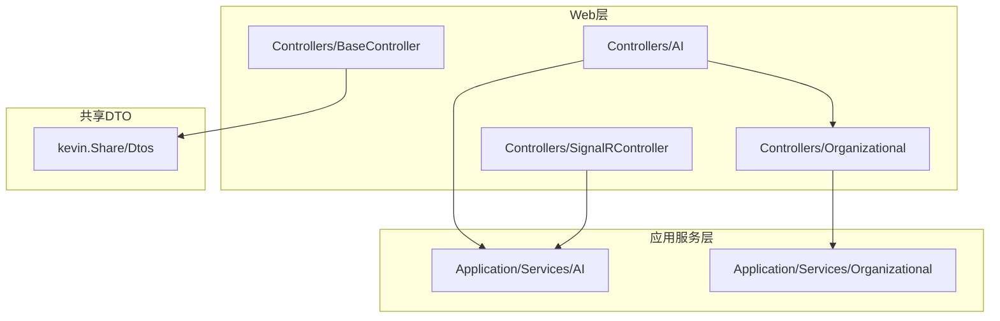
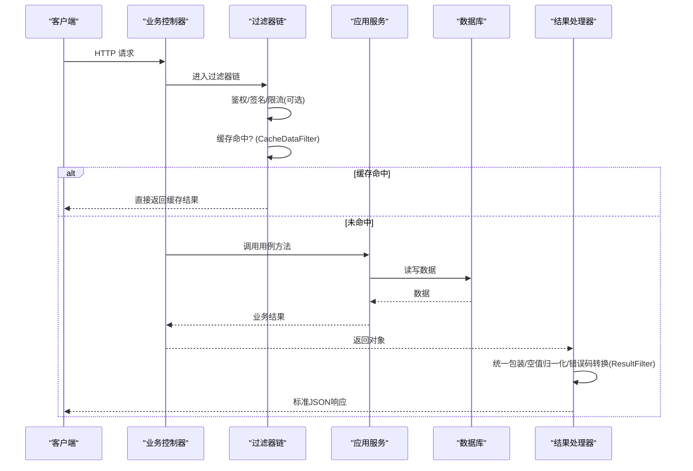
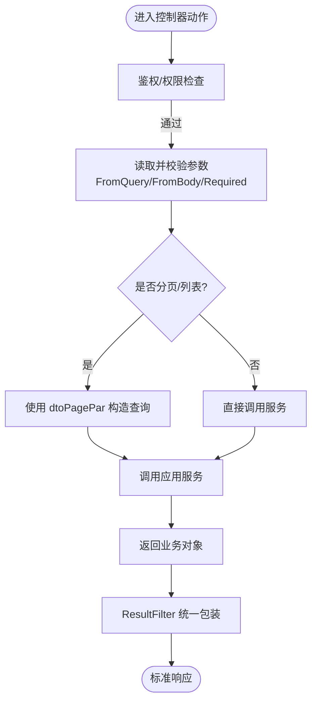
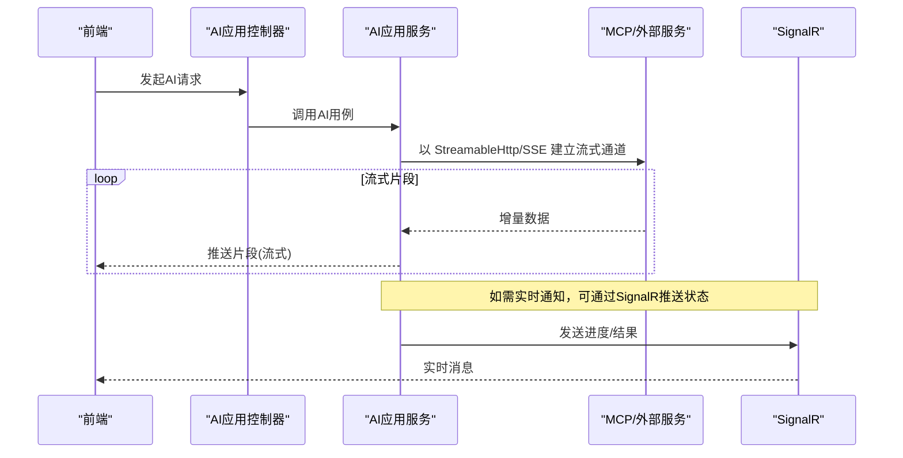
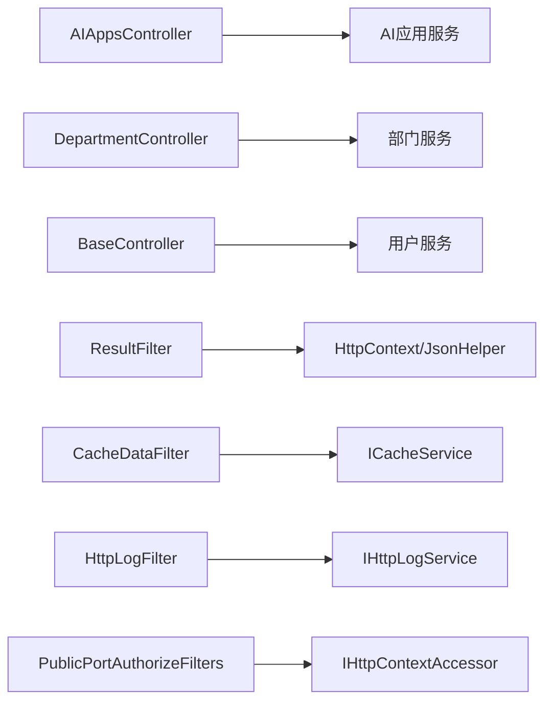

# API模块化组织

<cite>
**本文引用的文件**
- [ApiControllerBase.cs](file://Kevin/Kevin.Web.Basics/Controllers/ApiControllerBase.cs)
- [BaseController.cs](file://Kevin/Kevin.Web.Basics/Controllers/BaseController.cs)
- [ResultFilter.cs](file://Kevin/Kevin.Web.Basics/Filters/ResultFilter.cs)
- [CacheDataFilter.cs](file://Kevin/Kevin.Web.Basics/Filters/CacheDataFilter.cs)
- [HttpLogFilter.cs](file://Kevin/Kevin.Web.Basics/Filters/HttpLogFilter.cs)
- [PublicPortAuthorizeFilters.cs](file://Kevin/Kevin.Web.Basics/Filters/PublicPortAuthorizeFilters.cs)
- [AIAppsController.cs](file://Kevin/Kevin.Web.Basics/Controllers/AI/AIAppsController.cs)
- [DepartmentController.cs](file://Kevin/Kevin.Web.Basics/Controllers/Organizational/DepartmentController.cs)
- [SignalRController.cs](file://Kevin/Kevin.Web.Basics/Controllers/SignalRController.cs)
- [VersionController.cs](file://App/WebApi/Controllers/v1/VersionController.cs)
- [dtoPagePar.cs](file://Kevin/kevin.Share/Dtos/dtoPagePar.cs)
- [dtoPageData.cs](file://Kevin/kevin.Share/Dtos/dtoPageData.cs)
- [AIAgentToolSkillService.cs](file://Kevin/Application/Services/AI/AIAgentToolSkillService.cs)
</cite>

## 目录
1. [简介](#简介)
2. [项目结构](#项目结构)
3. [核心组件](#核心组件)
4. [架构总览](#架构总览)
5. [详细组件分析](#详细组件分析)
6. [依赖关系分析](#依赖关系分析)
7. [性能考量](#性能考量)
8. [故障排查指南](#故障排查指南)
9. [结论](#结论)
10. [附录：新模块API添加指南与最佳实践](#附录新模块api添加指南与最佳实践)

## 简介
本文件面向后端API的模块化组织与规范，聚焦以下目标：
- 说明按业务模块划分的控制器目录结构与路由约定
- 解释基础API封装（通用能力、参数校验、响应格式化）
- 描述各业务模块的API定义规范（命名、参数传递、返回值处理）
- 说明AI相关API的特殊处理方式（流式传输与WebSocket/SSE等）
- 提供新增业务模块API的实操指南与最佳实践

## 项目结构
整体采用“领域分层 + 模块化”的组织方式：
- Web层（对外暴露）：位于 Kevin/Kevin.Web.Basics/Controllers，按业务域划分子目录（如 AI、Organizational），以及系统级控制器（如 BaseController、SignalRController）
- 应用服务层：位于 Kevin/Application/Services，按业务域划分（如 AI、Organizational），承载用例编排
- 共享DTO与枚举：位于 Kevin/kevin.Share/Dtos、Enums，统一分页、请求参数、返回结构
- 版本化示例：App/WebApi/Controllers/v1、v2，展示多版本共存策略

图表来源
- [AIAppsController.cs:12-22](file://Kevin/Kevin.Web.Basics/Controllers/AI/AIAppsController.cs#L12-L22)
- [DepartmentController.cs:11-21](file://Kevin/Kevin.Web.Basics/Controllers/Organizational/DepartmentController.cs#L11-L21)
- [BaseController.cs:9-18](file://Kevin/Kevin.Web.Basics/Controllers/BaseController.cs#L9-L18)
- [SignalRController.cs:8-19](file://Kevin/Kevin.Web.Basics/Controllers/SignalRController.cs#L8-L19)
- [dtoPagePar.cs:1-49](file://Kevin/kevin.Share/Dtos/dtoPagePar.cs#L1-L49)
- [dtoPageData.cs:1-52](file://Kevin/kevin.Share/Dtos/dtoPageData.cs#L1-L52)

章节来源
- [AIAppsController.cs:12-22](file://Kevin/Kevin.Web.Basics/Controllers/AI/AIAppsController.cs#L12-L22)
- [DepartmentController.cs:11-21](file://Kevin/Kevin.Web.Basics/Controllers/Organizational/DepartmentController.cs#L11-L21)
- [BaseController.cs:9-18](file://Kevin/Kevin.Web.Basics/Controllers/BaseController.cs#L9-L18)
- [SignalRController.cs:8-19](file://Kevin/Kevin.Web.Basics/Controllers/SignalRController.cs#L8-L19)
- [dtoPagePar.cs:1-49](file://Kevin/kevin.Share/Dtos/dtoPagePar.cs#L1-L49)
- [dtoPageData.cs:1-52](file://Kevin/kevin.Share/Dtos/dtoPageData.cs#L1-L52)

## 核心组件
- 基础控制器基类
  - ApiControllerBase：集中注入 DbContext、当前用户、配置、分布式锁等横切能力
  - BaseController：提供系统级通用接口（如地区数据、二维码、雪花ID等）
- 全局过滤器
  - ResultFilter：统一响应体包装、空值归一化、错误码标准化
  - CacheDataFilter<T>：基于Action的缓存拦截器，支持TTL、Token/Body参与键计算
  - HttpLogFilter：记录操作日志（类型、备注、是否记录）
  - PublicPortAuthorizeFilters：对外公开接口的密钥校验（appId/appSecret）
- 业务控制器
  - AI 模块：AIAppsController（CRUD、初始化、列表等）
  - 组织架构模块：DepartmentController（分页、树形、增删改）
  - SignalR 模块：SignalRController（公告、私发、批量推送）
- 版本控制
  - VersionController：演示 ApiVersion 的使用

章节来源
- [ApiControllerBase.cs:7-20](file://Kevin/Kevin.Web.Basics/Controllers/ApiControllerBase.cs#L7-L20)
- [BaseController.cs:11-147](file://Kevin/Kevin.Web.Basics/Controllers/BaseController.cs#L11-L147)
- [ResultFilter.cs:10-160](file://Kevin/Kevin.Web.Basics/Filters/ResultFilter.cs#L10-L160)
- [CacheDataFilter.cs:14-118](file://Kevin/Kevin.Web.Basics/Filters/CacheDataFilter.cs#L14-L118)
- [HttpLogFilter.cs:10-43](file://Kevin/Kevin.Web.Basics/Filters/HttpLogFilter.cs#L10-L43)
- [PublicPortAuthorizeFilters.cs:12-58](file://Kevin/Kevin.Web.Basics/Filters/PublicPortAuthorizeFilters.cs#L12-L58)
- [AIAppsController.cs:12-120](file://Kevin/Kevin.Web.Basics/Controllers/AI/AIAppsController.cs#L12-L120)
- [DepartmentController.cs:11-77](file://Kevin/Kevin.Web.Basics/Controllers/Organizational/DepartmentController.cs#L11-L77)
- [SignalRController.cs:8-93](file://Kevin/Kevin.Web.Basics/Controllers/SignalRController.cs#L8-L93)
- [VersionController.cs:6-23](file://App/WebApi/Controllers/v1/VersionController.cs#L6-L23)

## 架构总览
下图展示了从HTTP请求到响应输出的关键路径，包括鉴权、日志、缓存、响应格式化等环节。

图表来源
- [ResultFilter.cs:120-153](file://Kevin/Kevin.Web.Basics/Filters/ResultFilter.cs#L120-L153)
- [CacheDataFilter.cs:75-116](file://Kevin/Kevin.Web.Basics/Filters/CacheDataFilter.cs#L75-L116)
- [AIAppsController.cs:31-119](file://Kevin/Kevin.Web.Basics/Controllers/AI/AIAppsController.cs#L31-L119)
- [DepartmentController.cs:30-75](file://Kevin/Kevin.Web.Basics/Controllers/Organizational/DepartmentController.cs#L30-L75)

## 详细组件分析

### 基础API封装
- 通用能力
  - 上下文与基础设施：DbContext、CurrentUser、Configuration、分布式锁通过基类注入
  - 通用接口：地区查询、二维码生成、ID生成、字典取值等
- 参数校验
  - 使用 DataAnnotations（如 Required）进行入参校验
  - 公共端口鉴权：PublicPortAuthorizeFilters 校验 appId/appSecret
- 响应格式化
  - ResultFilter 将不同状态码统一为 {code, msg, IsSuccess, data}
  - 对 null 字符串与 List 做空值归一化，避免前端判空异常
  - 文件流输出不受影响（FileResult 跳过包装）

章节来源
- [ApiControllerBase.cs:7-20](file://Kevin/Kevin.Web.Basics/Controllers/ApiControllerBase.cs#L7-L20)
- [BaseController.cs:26-146](file://Kevin/Kevin.Web.Basics/Controllers/BaseController.cs#L26-L146)
- [PublicPortAuthorizeFilters.cs:32-56](file://Kevin/Kevin.Web.Basics/Filters/PublicPortAuthorizeFilters.cs#L32-L56)
- [ResultFilter.cs:20-153](file://Kevin/Kevin.Web.Basics/Filters/ResultFilter.cs#L20-L153)

### 业务模块API定义规范
- 目录与路由
  - 按业务域分目录：AI、Organizational；根控制器用于系统能力
  - 路由约定：[Route("api/[controller]")]，动作可自定义名称
- 命名约定
  - 控制器：名词复数或业务域+管理（如 AIAppsController、DepartmentController）
  - 动作：动词+资源（GetPageData、AddEdit、Delete、GetDetails）
- 参数传递
  - 分页：统一使用 dtoPagePar<T>（含 pageSize/pageNum/searchKey/state/sign/whereId/Parameter/时间范围）
  - 查询参数：FromQuery + Required
  - 请求体：FromBody
- 返回值处理
  - 业务返回具体类型，由 ResultFilter 统一包装为标准响应
  - 列表接口可结合 CacheDataFilter 提升性能

图表来源
- [AIAppsController.cs:31-119](file://Kevin/Kevin.Web.Basics/Controllers/AI/AIAppsController.cs#L31-L119)
- [DepartmentController.cs:30-75](file://Kevin/Kevin.Web.Basics/Controllers/Organizational/DepartmentController.cs#L30-L75)
- [dtoPagePar.cs:1-49](file://Kevin/kevin.Share/Dtos/dtoPagePar.cs#L1-L49)
- [dtoPageData.cs:1-52](file://Kevin/kevin.Share/Dtos/dtoPageData.cs#L1-L52)
- [ResultFilter.cs:120-153](file://Kevin/Kevin.Web.Basics/Filters/ResultFilter.cs#L120-L153)

章节来源
- [AIAppsController.cs:12-120](file://Kevin/Kevin.Web.Basics/Controllers/AI/AIAppsController.cs#L12-L120)
- [DepartmentController.cs:11-77](file://Kevin/Kevin.Web.Basics/Controllers/Organizational/DepartmentController.cs#L11-L77)
- [dtoPagePar.cs:1-49](file://Kevin/kevin.Share/Dtos/dtoPagePar.cs#L1-L49)
- [dtoPageData.cs:1-52](file://Kevin/kevin.Share/Dtos/dtoPageData.cs#L1-L52)
- [ResultFilter.cs:120-153](file://Kevin/Kevin.Web.Basics/Filters/ResultFilter.cs#L120-L153)

### AI相关API特殊处理
- 流式响应与SSE/StreamableHttp
  - 在AI工具/技能集成中，可通过 HttpClientTransport 以 StreamableHttp 或 SSE 模式建立长连接，实现服务端事件推送
  - 适用于需要增量返回结果的场景（如大模型对话、任务进度）
- WebSocket/SignalR
  - SignalRController 提供消息广播与点对点推送能力，适合实时通知、公告、在线状态等
  - 可与AI流程结合，将AI任务进度或结果通过SignalR推送到前端

图表来源
- [AIAgentToolSkillService.cs:368-393](file://Kevin/Application/Services/AI/AIAgentToolSkillService.cs#L368-L393)
- [SignalRController.cs:27-88](file://Kevin/Kevin.Web.Basics/Controllers/SignalRController.cs#L27-L88)

章节来源
- [AIAgentToolSkillService.cs:368-393](file://Kevin/Application/Services/AI/AIAgentToolSkillService.cs#L368-L393)
- [SignalRController.cs:8-93](file://Kevin/Kevin.Web.Basics/Controllers/SignalRController.cs#L8-L93)

### 版本化与扩展点
- 版本控制
  - 使用 ApiVersion 标注控制器，便于多版本并存与演进
- 扩展点
  - 过滤器：鉴权、缓存、日志、限流等均可按需叠加
  - 中间件与服务：可在模块初始化中注册

章节来源
- [VersionController.cs:6-23](file://App/WebApi/Controllers/v1/VersionController.cs#L6-L23)
- [ResultFilter.cs:120-153](file://Kevin/Kevin.Web.Basics/Filters/ResultFilter.cs#L120-L153)
- [CacheDataFilter.cs:75-116](file://Kevin/Kevin.Web.Basics/Filters/CacheDataFilter.cs#L75-L116)
- [HttpLogFilter.cs:10-43](file://Kevin/Kevin.Web.Basics/Filters/HttpLogFilter.cs#L10-L43)

## 依赖关系分析
- 控制器依赖
  - 业务控制器依赖对应应用服务（如 AIAppsController -> IAIAppsService）
  - 基础控制器依赖公共服务（如 IUserService）
- 过滤器依赖
  - ResultFilter 依赖 HttpContext、JsonHelper、状态码映射
  - CacheDataFilter 依赖 ICacheService、CryptoHelper、JsonHelper
  - HttpLogFilter 依赖 IHttpLogService
  - PublicPortAuthorizeFilters 依赖 HttpContextAccessor、固定时间比较
- DTO依赖
  - 分页参数与结果：dtoPagePar<T>、dtoPageData<T>

图表来源
- [AIAppsController.cs:24-29](file://Kevin/Kevin.Web.Basics/Controllers/AI/AIAppsController.cs#L24-L29)
- [DepartmentController.cs:23-28](file://Kevin/Kevin.Web.Basics/Controllers/Organizational/DepartmentController.cs#L23-L28)
- [BaseController.cs:19-23](file://Kevin/Kevin.Web.Basics/Controllers/BaseController.cs#L19-L23)
- [ResultFilter.cs:120-153](file://Kevin/Kevin.Web.Basics/Filters/ResultFilter.cs#L120-L153)
- [CacheDataFilter.cs:75-116](file://Kevin/Kevin.Web.Basics/Filters/CacheDataFilter.cs#L75-L116)
- [HttpLogFilter.cs:10-43](file://Kevin/Kevin.Web.Basics/Filters/HttpLogFilter.cs#L10-L43)
- [PublicPortAuthorizeFilters.cs:32-56](file://Kevin/Kevin.Web.Basics/Filters/PublicPortAuthorizeFilters.cs#L32-L56)

章节来源
- [AIAppsController.cs:24-29](file://Kevin/Kevin.Web.Basics/Controllers/AI/AIAppsController.cs#L24-L29)
- [DepartmentController.cs:23-28](file://Kevin/Kevin.Web.Basics/Controllers/Organizational/DepartmentController.cs#L23-L28)
- [BaseController.cs:19-23](file://Kevin/Kevin.Web.Basics/Controllers/BaseController.cs#L19-L23)
- [ResultFilter.cs:120-153](file://Kevin/Kevin.Web.Basics/Filters/ResultFilter.cs#L120-L153)
- [CacheDataFilter.cs:75-116](file://Kevin/Kevin.Web.Basics/Filters/CacheDataFilter.cs#L75-L116)
- [HttpLogFilter.cs:10-43](file://Kevin/Kevin.Web.Basics/Filters/HttpLogFilter.cs#L10-L43)
- [PublicPortAuthorizeFilters.cs:32-56](file://Kevin/Kevin.Web.Basics/Filters/PublicPortAuthorizeFilters.cs#L32-L56)

## 性能考量
- 缓存优先
  - 对读多写少、数据稳定的接口使用 CacheDataFilter，合理设置 TTL
  - 键生成包含 QueryString、Body、Authorization，确保缓存隔离
- 响应归一化
  - ResultFilter 递归深度限制，避免深层对象导致的性能问题
- 流式传输
  - AI场景优先使用 StreamableHttp/SSE，减少首包延迟与内存占用
- 日志与监控
  - HttpLogFilter 仅记录必要信息，避免过度IO

章节来源
- [CacheDataFilter.cs:40-73](file://Kevin/Kevin.Web.Basics/Filters/CacheDataFilter.cs#L40-L73)
- [CacheDataFilter.cs:75-116](file://Kevin/Kevin.Web.Basics/Filters/CacheDataFilter.cs#L75-L116)
- [ResultFilter.cs:16-18](file://Kevin/Kevin.Web.Basics/Filters/ResultFilter.cs#L16-L18)
- [AIAgentToolSkillService.cs:368-393](file://Kevin/Application/Services/AI/AIAgentToolSkillService.cs#L368-L393)
- [HttpLogFilter.cs:10-43](file://Kevin/Kevin.Web.Basics/Filters/HttpLogFilter.cs#L10-L43)

## 故障排查指南
- 400/401/500 统一响应
  - ResultFilter 将不同状态码转换为统一格式，errMsg 来源于上下文或默认提示
- 缓存异常
  - CacheDataFilter 捕获异常并记录日志，不影响主流程
- 鉴权失败
  - PublicPortAuthorizeFilters 对 appId/appSecret 进行固定时间比较，失败返回401
- 日志缺失
  - 确认动作上是否标注 HttpLogAttribute，且 islog 为 true

章节来源
- [ResultFilter.cs:120-153](file://Kevin/Kevin.Web.Basics/Filters/ResultFilter.cs#L120-L153)
- [CacheDataFilter.cs:91-116](file://Kevin/Kevin.Web.Basics/Filters/CacheDataFilter.cs#L91-L116)
- [PublicPortAuthorizeFilters.cs:32-56](file://Kevin/Kevin.Web.Basics/Filters/PublicPortAuthorizeFilters.cs#L32-L56)
- [HttpLogFilter.cs:10-43](file://Kevin/Kevin.Web.Basics/Filters/HttpLogFilter.cs#L10-L43)

## 结论
本项目通过清晰的模块化目录、统一的基类与过滤器、标准化的DTO与响应格式，构建了高内聚、低耦合的API体系。AI场景通过流式传输与SignalR增强实时性，版本化与扩展点保证了长期演进能力。遵循本文规范可显著提升一致性、可维护性与性能。

## 附录：新模块API添加指南与最佳实践
- 步骤
  1) 新建控制器
     - 在 Controllers 下按业务域创建目录（如 NewBiz）
     - 继承 ControllerBase 或根据需要复用基类能力
     - 使用 [Route("api/[controller]")]、[ApiController]、[Authorize]（如需）
  2) 定义动作
     - 使用 [HttpPost]/[HttpGet]/[HttpDelete] 等明确语义
     - 入参使用 FromQuery/FromBody，必要时加 [Required]
     - 分页接口统一使用 dtoPagePar<T>
  3) 调用服务
     - 注入对应 IServices，完成用例编排
  4) 附加横切能力
     - 日志：[HttpLog("模块","动作",islog)]
     - 缓存：[CacheDataFilter<T>(TTL=秒, UseToken=true/false, UseBody=true/false)]
     - 权限：[SkipAuthority] 或权限注解（根据需求）
  5) 验证与测试
     - 使用 Swagger/Postman 验证
     - 关注 ResultFilter 的统一响应格式
- 最佳实践
  - 命名：控制器用名词复数，动作用“动词+资源”
  - 参数：分页统一、查询参数尽量简单、复杂条件放入 Parameter
  - 返回：只返回必要字段，避免大对象
  - 缓存：读多写少、稳定数据优先缓存，合理设置TTL
  - 安全：对外接口使用 PublicPortAuthorizeFilters，内部接口使用授权
  - 日志：关键操作必须记录，避免敏感信息泄露
  - 流式：AI/长耗时任务优先流式，结合SignalR推送状态

章节来源
- [AIAppsController.cs:31-119](file://Kevin/Kevin.Web.Basics/Controllers/AI/AIAppsController.cs#L31-L119)
- [DepartmentController.cs:30-75](file://Kevin/Kevin.Web.Basics/Controllers/Organizational/DepartmentController.cs#L30-L75)
- [dtoPagePar.cs:1-49](file://Kevin/kevin.Share/Dtos/dtoPagePar.cs#L1-L49)
- [dtoPageData.cs:1-52](file://Kevin/kevin.Share/Dtos/dtoPageData.cs#L1-L52)
- [ResultFilter.cs:120-153](file://Kevin/Kevin.Web.Basics/Filters/ResultFilter.cs#L120-L153)
- [CacheDataFilter.cs:75-116](file://Kevin/Kevin.Web.Basics/Filters/CacheDataFilter.cs#L75-L116)
- [HttpLogFilter.cs:10-43](file://Kevin/Kevin.Web.Basics/Filters/HttpLogFilter.cs#L10-L43)
- [PublicPortAuthorizeFilters.cs:32-56](file://Kevin/Kevin.Web.Basics/Filters/PublicPortAuthorizeFilters.cs#L32-L56)