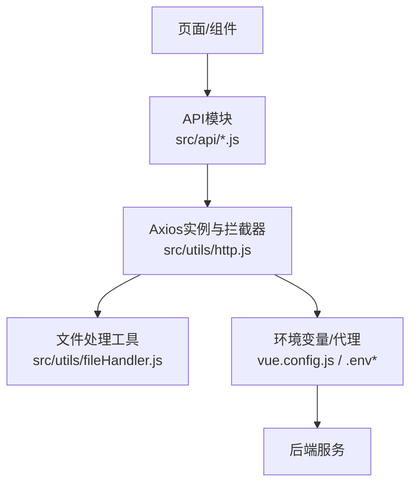
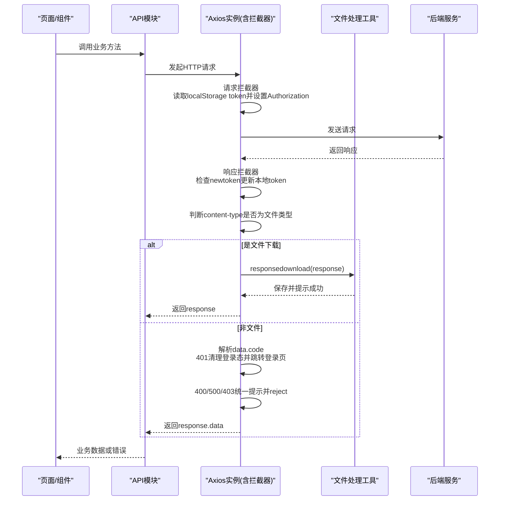
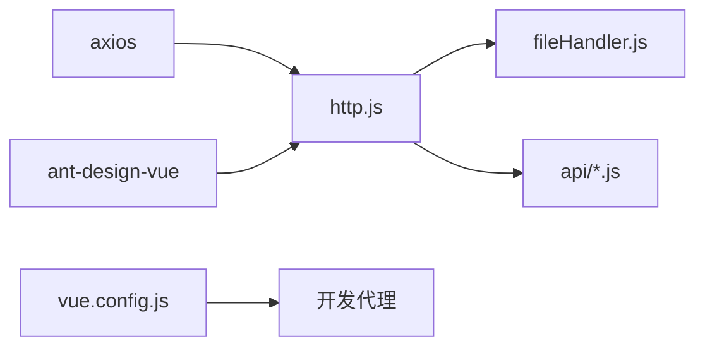

# HTTP请求封装

<cite>
**本文引用的文件**
- [http.js](file://vue/kevin.web.vue/src/utils/http.js)
- [fileHandler.js](file://vue/kevin.web.vue/src/utils/fileHandler.js)
- [baseapi.js](file://vue/kevin.web.vue/src/api/baseapi.js)
- [userapi.js](file://vue/kevin.web.vue/src/api/userapi.js)
- [file.js](file://vue/kevin.web.vue/src/api/file.js)
- [vue.config.js](file://vue/kevin.web.vue/vue.config.js)
- [package.json](file://vue/kevin.web.vue/package.json)
</cite>

## 目录
1. [简介](#简介)
2. [项目结构](#项目结构)
3. [核心组件](#核心组件)
4. [架构总览](#架构总览)
5. [详细组件分析](#详细组件分析)
6. [依赖关系分析](#依赖关系分析)
7. [性能考量](#性能考量)
8. [故障排查指南](#故障排查指南)
9. [结论](#结论)
10. [附录：最佳实践与使用示例](#附录：最佳实践与使用示例)

## 简介
本文件面向前端Vue工程中的HTTP请求封装，围绕Axios实例配置、请求拦截器、响应拦截器、全局错误处理策略以及文件下载/上传能力进行系统化说明。目标是帮助开发者快速理解并正确使用统一的HTTP层，确保Token自动注入、统一响应格式、统一错误提示、文件流处理等关键能力稳定可用。

## 项目结构
前端HTTP相关代码主要位于以下位置：
- Axios实例与拦截器：src/utils/http.js
- 文件处理工具（下载/上传/预览）：src/utils/fileHandler.js
- API模块封装：src/api/*.js（如 baseapi.js、userapi.js、file.js）
- 开发代理配置：vue.config.js
- 依赖声明：package.json（包含axios版本）

图表来源
- [http.js:1-125](file://vue/kevin.web.vue/src/utils/http.js#L1-L125)
- [fileHandler.js:1-252](file://vue/kevin.web.vue/src/utils/fileHandler.js#L1-L252)
- [vue.config.js:1-20](file://vue/kevin.web.vue/vue.config.js#L1-L20)
- [package.json:16-36](file://vue/kevin.web.vue/package.json#L16-L36)

章节来源
- [http.js:1-125](file://vue/kevin.web.vue/src/utils/http.js#L1-L125)
- [fileHandler.js:1-252](file://vue/kevin.web.vue/src/utils/fileHandler.js#L1-L252)
- [vue.config.js:1-20](file://vue/kevin.web.vue/vue.config.js#L1-L20)
- [package.json:16-36](file://vue/kevin.web.vue/package.json#L16-L36)

## 核心组件
- Axios实例与拦截器：集中管理baseURL、超时、凭据携带、Token注入、统一响应格式、文件下载识别、统一错误提示与权限处理。
- 文件处理工具：提供下载、批量下载、上传、预览、Base64/Blob互转、文件大小格式化等通用能力。
- API模块：按业务域组织接口调用，复用统一的HTTP能力，保持调用简洁一致。

章节来源
- [http.js:1-125](file://vue/kevin.web.vue/src/utils/http.js#L1-L125)
- [fileHandler.js:1-252](file://vue/kevin.web.vue/src/utils/fileHandler.js#L1-L252)
- [baseapi.js:1-14](file://vue/kevin.web.vue/src/api/baseapi.js#L1-L14)
- [userapi.js:1-44](file://vue/kevin.web.vue/src/api/userapi.js#L1-L44)
- [file.js:1-151](file://vue/kevin.web.vue/src/api/file.js#L1-L151)

## 架构总览
下图展示了从页面发起请求到后端返回的完整链路，包括请求拦截器的Token注入、响应拦截器的统一处理与文件下载分流、以及错误处理的分支逻辑。

图表来源
- [http.js:12-25](file://vue/kevin.web.vue/src/utils/http.js#L12-L25)
- [http.js:29-122](file://vue/kevin.web.vue/src/utils/http.js#L29-L122)
- [fileHandler.js:12-44](file://vue/kevin.web.vue/src/utils/fileHandler.js#L12-L44)

## 详细组件分析

### Axios实例配置
- baseURL：通过环境变量VUE_APP_API_BASE_URL注入，便于多环境切换。
- timeout：设置为较长超时时间，避免大文件或慢接口被误杀。
- withCredentials：开启跨域携带Cookie，配合后端会话/CSRF机制。
- 依赖：axios库由package.json引入。

章节来源
- [http.js:3-9](file://vue/kevin.web.vue/src/utils/http.js#L3-L9)
- [package.json:26-26](file://vue/kevin.web.vue/package.json#L26-L26)

### 请求拦截器实现
- Token自动注入：从localStorage读取token，若存在则设置Authorization头为Bearer token。
- 参数预处理：当前未对params/body做额外处理，可在后续扩展中增加签名、租户ID等。
- 错误分支：在请求拦截器错误回调中，针对特定状态码进行提示与拒绝。

章节来源
- [http.js:12-25](file://vue/kevin.web.vue/src/utils/http.js#L12-L25)

### 响应拦截器工作机制
- 统一响应格式：
  - 优先返回response.data，简化上层调用。
  - 当data.code为401时，清理用户信息、权限与token，并在非登录场景下跳转到登录页。
  - 当data.code为400时，提示错误并reject Promise。
- 文件下载处理：
  - 根据响应头的Content-Type判断是否属于文件类型（二进制流、Excel、PDF等）。
  - 若是文件，交由FileHandler.responsedownload进行保存与提示。
- 错误状态码处理：
  - 400/500：提示错误信息并reject。
  - 403：提示无权限并reject。
  - 401：清理登录态并跳转登录页。

章节来源
- [http.js:29-122](file://vue/kevin.web.vue/src/utils/http.js#L29-L122)

### 文件下载与上传
- 下载：
  - 自动识别文件类型并调用FileHandler.responsedownload，完成Blob保存与提示。
  - 支持从响应头提取文件名，并提供默认文件名兜底。
- 上传：
  - 单文件/批量上传封装，自动设置multipart/form-data。
  - 支持进度回调、附加参数传递。
- 预览与转换：
  - 提供Blob预览、Base64与Blob互转、文件大小格式化等工具方法。

章节来源
- [fileHandler.js:12-44](file://vue/kevin.web.vue/src/utils/fileHandler.js#L12-L44)
- [fileHandler.js:46-137](file://vue/kevin.web.vue/src/utils/fileHandler.js#L46-L137)
- [fileHandler.js:139-249](file://vue/kevin.web.vue/src/utils/fileHandler.js#L139-L249)

### 全局错误处理策略
- 网络异常：
  - 在响应错误回调中捕获，统一提示并reject，便于上层统一处理。
- 服务器错误：
  - 400/500：提示具体错误信息并reject。
- 用户权限错误：
  - 401：清理本地登录态并跳转登录页。
  - 403：提示无权限访问并reject。
- 统一提示：
  - 使用UI库的消息提示组件进行友好反馈。

章节来源
- [http.js:67-122](file://vue/kevin.web.vue/src/utils/http.js#L67-L122)

### API模块使用示例
- 基础接口：获取GUID、雪花ID、用户权限等。
- 用户接口：登录、获取用户信息、增删改查、导出列表（blob）、修改密码等。
- 文件接口：单文件/批量上传、远程上传、获取文件/图片、删除文件等。

章节来源
- [baseapi.js:1-14](file://vue/kevin.web.vue/src/api/baseapi.js#L1-L14)
- [userapi.js:1-44](file://vue/kevin.web.vue/src/api/userapi.js#L1-L44)
- [file.js:1-151](file://vue/kevin.web.vue/src/api/file.js#L1-L151)

## 依赖关系分析
- axios：作为HTTP客户端，负责网络请求与拦截器链。
- ant-design-vue：用于消息提示与交互反馈。
- file-saver/jszip：在文件处理工具中可能用于高级下载/压缩场景（按需使用）。
- vue.config.js：开发环境代理配置，将特定前缀转发至后端地址，解决开发期跨域问题。

图表来源
- [package.json:16-36](file://vue/kevin.web.vue/package.json#L16-L36)
- [vue.config.js:1-20](file://vue/kevin.web.vue/vue.config.js#L1-L20)
- [http.js:1-125](file://vue/kevin.web.vue/src/utils/http.js#L1-L125)
- [fileHandler.js:1-252](file://vue/kevin.web.vue/src/utils/fileHandler.js#L1-L252)

章节来源
- [package.json:16-36](file://vue/kevin.web.vue/package.json#L16-L36)
- [vue.config.js:1-20](file://vue/kevin.web.vue/vue.config.js#L1-L20)

## 性能考量
- 超时配置：当前超时时间较长，适合大文件下载；对于普通接口建议评估更合理的超时值，避免长时间阻塞。
- 并发控制：如需限制并发，可在API层或HTTP层引入队列/信号量机制。
- 缓存策略：对静态或低频变化数据可考虑浏览器缓存或内存缓存，减少重复请求。
- 文件传输：大文件建议使用分片上传/断点续传；下载时注意Blob对象释放，避免内存泄漏。
- 日志与监控：结合HttpLogService或前端埋点记录请求耗时与失败率，便于定位瓶颈。

[本节为通用指导，不直接分析具体文件]

## 故障排查指南
- 无法携带Cookie或跨域失败：
  - 确认withCredentials已启用，且后端允许携带凭证与对应域名。
  - 开发环境检查vue.config.js代理是否正确配置目标地址与前缀重写。
- Token未注入或无效：
  - 检查localStorage中是否存在token，以及请求拦截器是否正确设置Authorization头。
  - 关注响应头newtoken是否被正确刷新。
- 文件下载失败：
  - 确认后端返回的Content-Type为文件类型，且响应体为二进制流。
  - 检查FileHandler.responsedownload是否能正确解析文件名并触发下载。
- 权限错误频繁：
  - 401/403出现时，确认是否已清理本地登录态并跳转登录页。
  - 核对后端鉴权逻辑与前端Token生命周期是否匹配。

章节来源
- [http.js:12-25](file://vue/kevin.web.vue/src/utils/http.js#L12-L25)
- [http.js:29-122](file://vue/kevin.web.vue/src/utils/http.js#L29-L122)
- [fileHandler.js:12-44](file://vue/kevin.web.vue/src/utils/fileHandler.js#L12-L44)
- [vue.config.js:1-20](file://vue/kevin.web.vue/vue.config.js#L1-L20)

## 结论
该HTTP封装以Axios为核心，通过请求与响应拦截器实现了Token自动注入、统一响应格式、文件下载分流与全局错误处理，配合文件处理工具提供了完整的文件能力。API模块按业务域组织，调用简洁一致。建议在后续迭代中补充请求重试、取消、缓存与更细粒度的超时策略，以提升健壮性与可维护性。

[本节为总结，不直接分析具体文件]

## 附录：最佳实践与使用示例

- 统一入口：所有HTTP请求通过src/utils/http.js导出的myAxios发起，避免重复配置。
- Token管理：登录后将token写入localStorage；响应头newtoken会自动刷新本地token。
- 文件下载：
  - JSON接口：直接返回response.data，无需特殊处理。
  - 文件接口：确保后端返回正确的Content-Type，或使用responseType: 'blob'并交由FileHandler处理。
- 错误处理：
  - 401/403/400/500已在拦截器中统一提示与处理，上层只需关注业务逻辑。
  - 如需自定义提示，可在API层捕获错误并进行差异化处理。
- 开发代理：
  - 使用vue.config.js将特定前缀转发到后端地址，解决开发期跨域问题。

章节来源
- [http.js:1-125](file://vue/kevin.web.vue/src/utils/http.js#L1-L125)
- [fileHandler.js:1-252](file://vue/kevin.web.vue/src/utils/fileHandler.js#L1-L252)
- [baseapi.js:1-14](file://vue/kevin.web.vue/src/api/baseapi.js#L1-L14)
- [userapi.js:1-44](file://vue/kevin.web.vue/src/api/userapi.js#L1-L44)
- [file.js:1-151](file://vue/kevin.web.vue/src/api/file.js#L1-L151)
- [vue.config.js:1-20](file://vue/kevin.web.vue/vue.config.js#L1-L20)