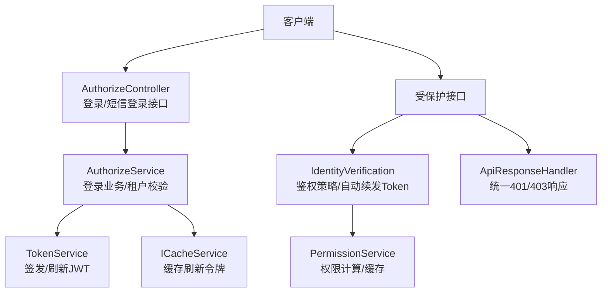
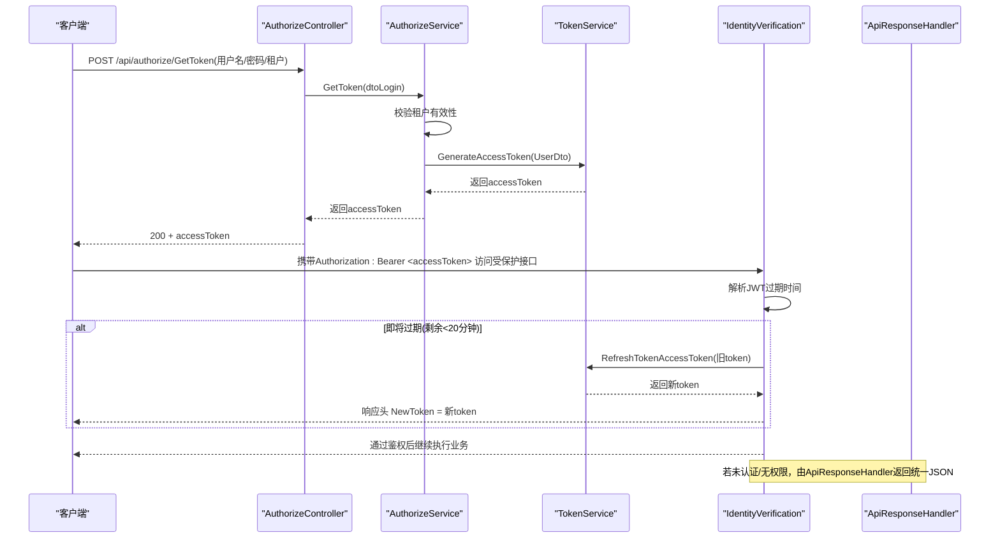
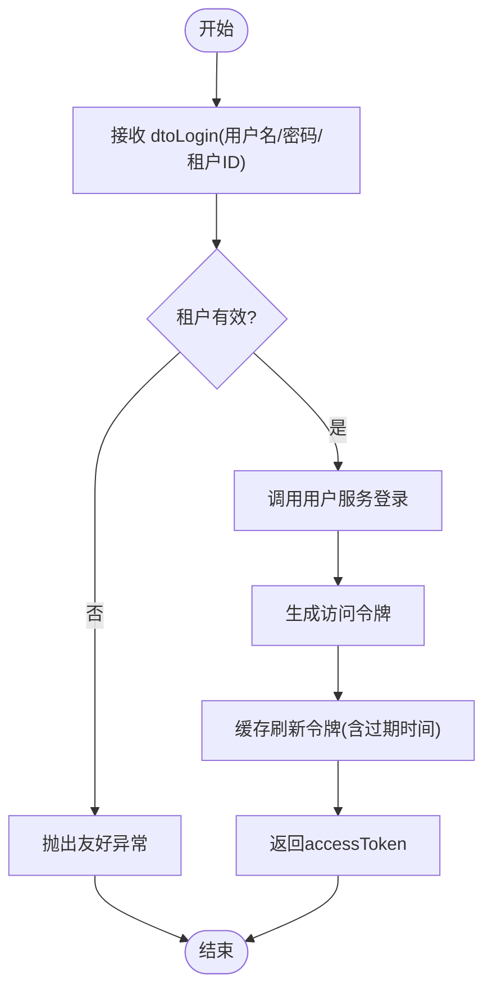
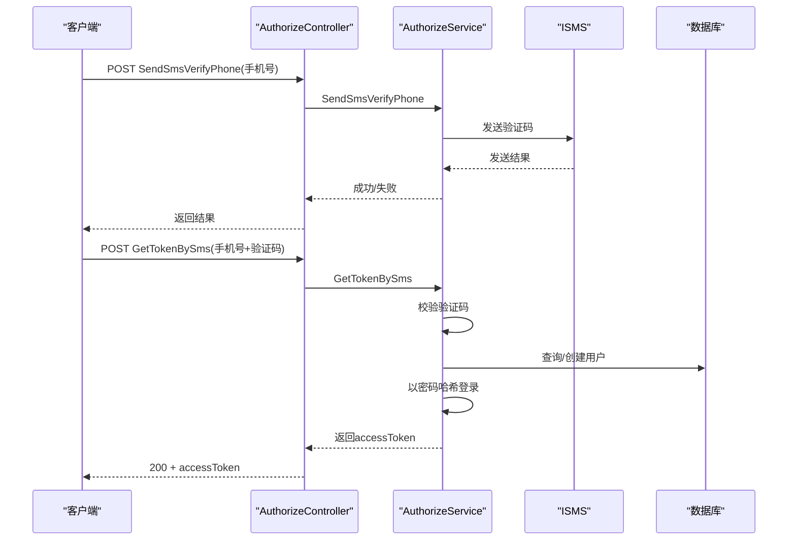
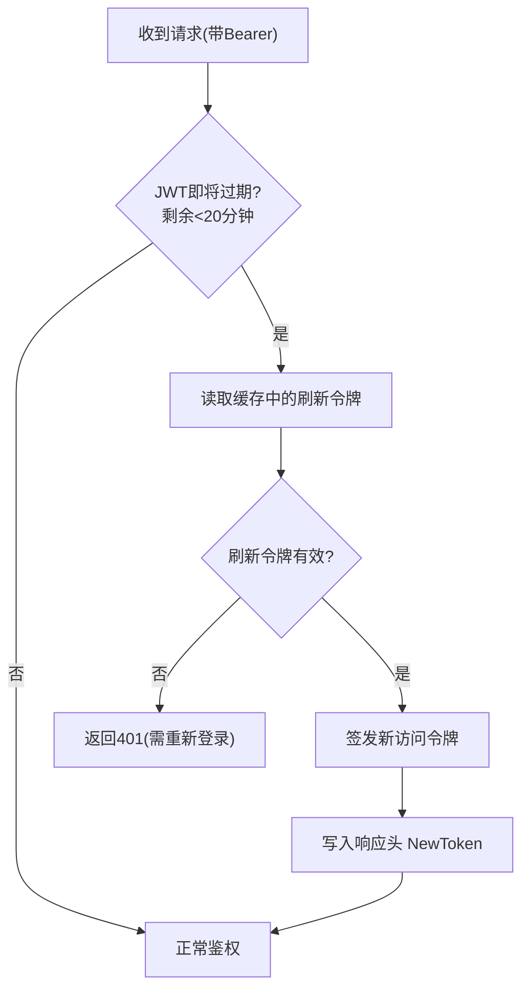
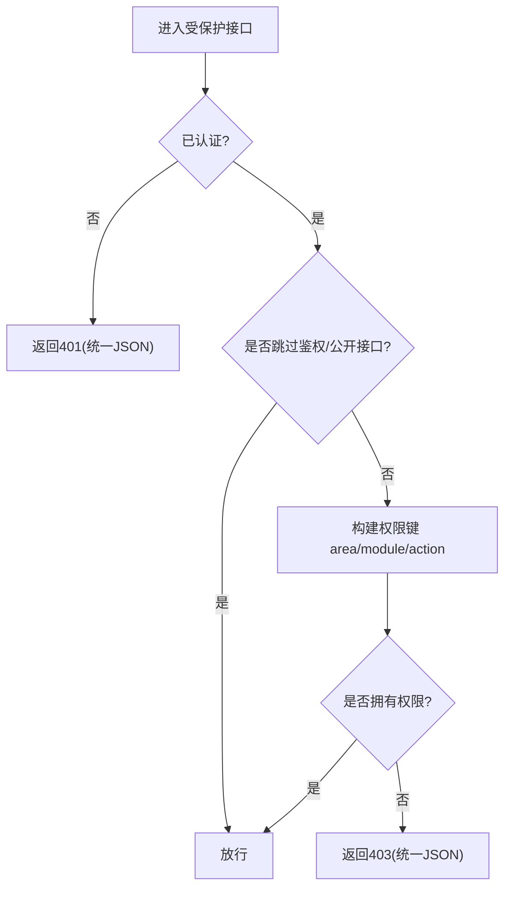
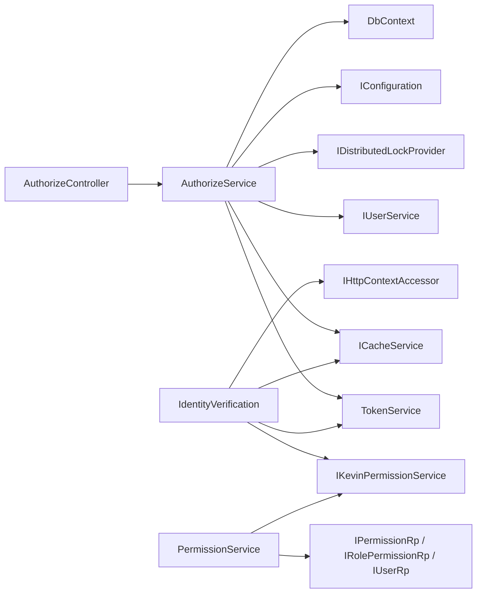

# 认证授权管理

<cite>
**本文引用的文件**
- [AuthorizeController.cs](file://Kevin/ Kevin.Web.Basics/Controllers/AuthorizeController.cs)
- [AuthorizeService.cs](file://Kevin/Application/Services/AuthorizeService.cs)
- [ITokenService.cs](file://Kevin/kevin.Module/Kevin.Authentication.Jwt/IService/ITokenService.cs)
- [TokenService.cs](file://Kevin/kevin.Module/Kevin.Authentication.Jwt/Service/TokenService.cs)
- [UserDto.cs](file://Kevin/kevin.Module/Kevin.Authentication.Jwt/Dto/UserDto.cs)
- [RefreshTokenDto.cs](file://Kevin/kevin.Module/Kevin.Authentication.Jwt/Dto/RefreshTokenDto.cs)
- [IdentityVerification.cs](file://Kevin/kevin.Module/kevin.Permission/Permission/Action/IdentityVerification.cs)
- [PermissionService.cs](file://Kevin/Application/Services/PermissionService.cs)
- [ApiResponseHandler.cs](file://Kevin/Domain/Auth/ApiResponseHandler.cs)
- [dtoLogin.cs](file://Kevin/kevin.Share/Dtos/dtoLogin.cs)
</cite>

## 目录
1. [简介](#简介)
2. [项目结构](#项目结构)
3. [核心组件](#核心组件)
4. [架构总览](#架构总览)
5. [详细组件分析](#详细组件分析)
6. [依赖关系分析](#依赖关系分析)
7. [性能考虑](#性能考虑)
8. [故障排查指南](#故障排查指南)
9. [结论](#结论)
10. [附录：API调用示例与错误处理](#附录api调用示例与错误处理)

## 简介
本文件面向后端认证授权子系统，覆盖登录流程、Token生成与刷新、权限校验（路由守卫与接口级）、用户信息缓存以及登出清理策略。文档以代码为依据，提供流程图与时序图，帮助读者快速理解并落地集成。

## 项目结构
认证授权相关能力分布在以下模块：
- Web层控制器：对外暴露登录、短信登录等接口
- 应用服务：实现登录业务、租户校验、Token签发入口
- JWT模块：负责访问令牌签发与刷新、刷新令牌缓存
- 权限模块：基于自定义鉴权策略进行接口级权限控制，支持自动续发新Token
- 统一响应处理器：将未认证/无权限场景返回为统一的JSON格式

图表来源
- [AuthorizeController.cs:11-61](file://Kevin/ Kevin.Web.Basics/Controllers/AuthorizeController.cs#L11-L61)
- [AuthorizeService.cs:13-172](file://Kevin/Application/Services/AuthorizeService.cs#L13-L172)
- [TokenService.cs:13-107](file://Kevin/kevin.Module/Kevin.Authentication.Jwt/Service/TokenService.cs#L13-L107)
- [IdentityVerification.cs:15-198](file://Kevin/kevin.Module/kevin.Permission/Permission/Action/IdentityVerification.cs#L15-L198)
- [PermissionService.cs:7-434](file://Kevin/Application/Services/PermissionService.cs#L7-L434)
- [ApiResponseHandler.cs:13-35](file://Kevin/Domain/Auth/ApiResponseHandler.cs#L13-L35)

章节来源
- [AuthorizeController.cs:11-61](file://Kevin/ Kevin.Web.Basics/Controllers/AuthorizeController.cs#L11-L61)
- [AuthorizeService.cs:13-172](file://Kevin/Application/Services/AuthorizeService.cs#L13-L172)
- [TokenService.cs:13-107](file://Kevin/kevin.Module/Kevin.Authentication.Jwt/Service/TokenService.cs#L13-L107)
- [IdentityVerification.cs:15-198](file://Kevin/kevin.Module/kevin.Permission/Permission/Action/IdentityVerification.cs#L15-L198)
- [PermissionService.cs:7-434](file://Kevin/Application/Services/PermissionService.cs#L7-L434)
- [ApiResponseHandler.cs:13-35](file://Kevin/Domain/Auth/ApiResponseHandler.cs#L13-L35)

## 核心组件
- 登录控制器与接口
  - 提供用户名密码登录、短信验证码登录、发送短信验证码等接口
- 登录服务
  - 校验租户有效性、执行用户登录、生成访问令牌
- JWT令牌服务
  - 签发访问令牌，并将刷新令牌写入缓存；支持用旧令牌换取新令牌
- 鉴权策略
  - 在请求进入时校验身份与权限，必要时自动续发新令牌
- 权限服务
  - 维护权限定义、角色-权限映射、用户权限集合
- 统一响应处理器
  - 将401/403转换为统一JSON结构

章节来源
- [AuthorizeController.cs:11-61](file://Kevin/ Kevin.Web.Basics/Controllers/AuthorizeController.cs#L11-L61)
- [AuthorizeService.cs:13-172](file://Kevin/Application/Services/AuthorizeService.cs#L13-L172)
- [TokenService.cs:13-107](file://Kevin/kevin.Module/Kevin.Authentication.Jwt/Service/TokenService.cs#L13-L107)
- [IdentityVerification.cs:15-198](file://Kevin/kevin.Module/kevin.Permission/Permission/Action/IdentityVerification.cs#L15-L198)
- [PermissionService.cs:7-434](file://Kevin/Application/Services/PermissionService.cs#L7-L434)
- [ApiResponseHandler.cs:13-35](file://Kevin/Domain/Auth/ApiResponseHandler.cs#L13-L35)

## 架构总览
下图展示从登录到受保护接口访问的完整链路，包括自动续发新令牌的机制。

图表来源
- [AuthorizeController.cs:32-47](file://Kevin/ Kevin.Web.Basics/Controllers/AuthorizeController.cs#L32-L47)
- [AuthorizeService.cs:70-93](file://Kevin/Application/Services/AuthorizeService.cs#L70-L93)
- [TokenService.cs:29-60](file://Kevin/kevin.Module/Kevin.Authentication.Jwt/Service/TokenService.cs#L29-L60)
- [IdentityVerification.cs:22-139](file://Kevin/kevin.Module/kevin.Permission/Permission/Action/IdentityVerification.cs#L22-L139)
- [ApiResponseHandler.cs:23-35](file://Kevin/Domain/Auth/ApiResponseHandler.cs#L23-L35)

## 详细组件分析

### 登录流程（用户名/密码）
- 控制器接收登录参数，委托应用服务完成登录与租户校验
- 应用服务验证租户存在且有效，调用用户服务完成认证
- 成功后使用JWT服务签发访问令牌，并将刷新令牌写入缓存
- 前端保存accessToken用于后续请求；同时可保存refresh token以便刷新

图表来源
- [AuthorizeController.cs:32-37](file://Kevin/ Kevin.Web.Basics/Controllers/AuthorizeController.cs#L32-L37)
- [AuthorizeService.cs:70-93](file://Kevin/Application/Services/AuthorizeService.cs#L70-L93)
- [TokenService.cs:29-60](file://Kevin/kevin.Module/Kevin.Authentication.Jwt/Service/TokenService.cs#L29-L60)
- [dtoLogin.cs:9-36](file://Kevin/kevin.Share/Dtos/dtoLogin.cs#L9-L36)

章节来源
- [AuthorizeController.cs:32-37](file://Kevin/ Kevin.Web.Basics/Controllers/AuthorizeController.cs#L32-L37)
- [AuthorizeService.cs:70-93](file://Kevin/Application/Services/AuthorizeService.cs#L70-L93)
- [TokenService.cs:29-60](file://Kevin/kevin.Module/Kevin.Authentication.Jwt/Service/TokenService.cs#L29-L60)
- [dtoLogin.cs:9-36](file://Kevin/kevin.Share/Dtos/dtoLogin.cs#L9-L36)

### 登录流程（短信验证码）
- 发送短信验证码：服务端生成验证码并缓存，设置短过期时间
- 短信登录：校验验证码通过后，查找或创建用户，直接以密码哈希登录并签发令牌

图表来源
- [AuthorizeController.cs:43-58](file://Kevin/ Kevin.Web.Basics/Controllers/AuthorizeController.cs#L43-L58)
- [AuthorizeService.cs:112-142](file://Kevin/Application/Services/AuthorizeService.cs#L112-L142)

章节来源
- [AuthorizeController.cs:43-58](file://Kevin/ Kevin.Web.Basics/Controllers/AuthorizeController.cs#L43-L58)
- [AuthorizeService.cs:112-142](file://Kevin/Application/Services/AuthorizeService.cs#L112-L142)

### Token管理机制（本地存储、自动刷新、过期处理）
- 访问令牌：包含用户标识、是否超级管理员、姓名、创建时间、租户ID等声明；过期时间由配置决定
- 刷新令牌：以访问令牌为键，缓存刷新信息（过期时间、用户信息），用于换发新访问令牌
- 自动续发：当请求中JWT即将过期（剩余不足20分钟）时，鉴权阶段自动调用刷新接口，并在响应头中回传新令牌
- 前端建议：
  - 将accessToken存入内存或安全存储，每次请求附加到Authorization头
  - 监听响应头NewToken，更新本地令牌
  - 若收到401/403，引导重新登录

图表来源
- [IdentityVerification.cs:107-139](file://Kevin/kevin.Module/kevin.Permission/Permission/Action/IdentityVerification.cs#L107-L139)
- [TokenService.cs:67-107](file://Kevin/kevin.Module/Kevin.Authentication.Jwt/Service/TokenService.cs#L67-L107)

章节来源
- [IdentityVerification.cs:107-139](file://Kevin/kevin.Module/kevin.Permission/Permission/Action/IdentityVerification.cs#L107-L139)
- [TokenService.cs:67-107](file://Kevin/kevin.Module/Kevin.Authentication.Jwt/Service/TokenService.cs#L67-L107)

### 权限验证流程（路由守卫、接口权限控制、用户信息缓存）
- 路由守卫：基于自定义鉴权策略，根据控制器/动作上的特性判断是否跳过鉴权或仅要求已登录
- 接口权限控制：构造权限键 area/module/action，结合角色-权限映射判断是否允许访问
- 用户信息缓存：可通过权限服务获取当前用户权限集合，便于前端菜单/按钮级控制
- 超级管理员：具备全部权限，可直接放行

图表来源
- [IdentityVerification.cs:22-104](file://Kevin/kevin.Module/kevin.Permission/Permission/Action/IdentityVerification.cs#L22-L104)
- [PermissionService.cs:419-430](file://Kevin/Application/Services/PermissionService.cs#L419-L430)
- [ApiResponseHandler.cs:23-35](file://Kevin/Domain/Auth/ApiResponseHandler.cs#L23-L35)

章节来源
- [IdentityVerification.cs:22-104](file://Kevin/kevin.Module/kevin.Permission/Permission/Action/IdentityVerification.cs#L22-L104)
- [PermissionService.cs:419-430](file://Kevin/Application/Services/PermissionService.cs#L419-L430)
- [ApiResponseHandler.cs:23-35](file://Kevin/Domain/Auth/ApiResponseHandler.cs#L23-L35)

### 登出处理逻辑（清理本地数据与重置应用状态）
- 服务端侧：当前实现未提供显式登出接口；刷新令牌采用“一次性”策略（刷新后即删除），避免重复使用
- 客户端侧建议：
  - 清除本地存储的accessToken与refresh token
  - 清空用户信息缓存（如权限列表、用户资料）
  - 跳转至登录页并重置应用状态

说明：由于仓库未提供服务端登出接口实现，以上为通用实践建议。

章节来源
- [TokenService.cs:67-107](file://Kevin/kevin.Module/Kevin.Authentication.Jwt/Service/TokenService.cs#L67-L107)

## 依赖关系分析
- AuthorizeController 依赖 IAuthorizeService 与 ICacheService
- AuthorizeService 依赖 IUserService、ITokenService、ICacheService、IDistributedLockProvider、IConfiguration、DbContext
- TokenService 依赖 IConfiguration 与 ICacheService
- IdentityVerification 依赖 ITokenService、ICacheService、IKevinPermissionService、HttpContextAccessor
- PermissionService 依赖 IKevinPermissionService、IPermissionRp、IRolePermissionRp、IUserRp

图表来源
- [AuthorizeController.cs:19-23](file://Kevin/ Kevin.Web.Basics/Controllers/AuthorizeController.cs#L19-L23)
- [AuthorizeService.cs:15-31](file://Kevin/Application/Services/AuthorizeService.cs#L15-L31)
- [TokenService.cs:15-23](file://Kevin/kevin.Module/Kevin.Authentication.Jwt/Service/TokenService.cs#L15-L23)
- [IdentityVerification.cs:15-22](file://Kevin/kevin.Module/kevin.Permission/Permission/Action/IdentityVerification.cs#L15-L22)
- [PermissionService.cs:9-23](file://Kevin/Application/Services/PermissionService.cs#L9-L23)

章节来源
- [AuthorizeController.cs:19-23](file://Kevin/ Kevin.Web.Basics/Controllers/AuthorizeController.cs#L19-L23)
- [AuthorizeService.cs:15-31](file://Kevin/Application/Services/AuthorizeService.cs#L15-L31)
- [TokenService.cs:15-23](file://Kevin/kevin.Module/Kevin.Authentication.Jwt/Service/TokenService.cs#L15-L23)
- [IdentityVerification.cs:15-22](file://Kevin/kevin.Module/kevin.Permission/Permission/Action/IdentityVerification.cs#L15-L22)
- [PermissionService.cs:9-23](file://Kevin/Application/Services/PermissionService.cs#L9-L23)

## 性能考虑
- 刷新令牌缓存：使用分布式缓存承载刷新令牌，注意合理设置过期时间与容量
- 自动续发：仅在接近过期时触发，减少不必要的刷新开销
- 权限计算：对高频接口可结合缓存降低权限查询压力
- 并发登录：分布式锁可用于防止同一账号并发登录导致的令牌竞争

[本节为通用指导，不直接分析具体文件]

## 故障排查指南
- 401 未认证
  - 检查请求是否携带正确的Authorization头
  - 确认JWT未过期；若即将过期，关注响应头NewToken是否被正确更新
  - 查看统一响应处理器返回的JSON结构
- 403 无权限
  - 检查当前用户是否拥有对应area/module/action权限
  - 确认控制器/动作未误标为公开或跳过鉴权
- 刷新失败
  - 检查缓存中是否存在有效的刷新令牌
  - 确认刷新令牌已被消费（一次性策略）

章节来源
- [ApiResponseHandler.cs:23-35](file://Kevin/Domain/Auth/ApiResponseHandler.cs#L23-L35)
- [IdentityVerification.cs:107-139](file://Kevin/kevin.Module/kevin.Permission/Permission/Action/IdentityVerification.cs#L107-L139)
- [TokenService.cs:67-107](file://Kevin/kevin.Module/Kevin.Authentication.Jwt/Service/TokenService.cs#L67-L107)

## 结论
该认证授权方案以JWT为核心，结合缓存的刷新令牌与鉴权阶段的自动续发机制，实现了良好的用户体验与安全边界。权限体系通过area/module/action维度进行细粒度控制，配合统一响应处理器，形成一致的交互体验。建议在客户端完善令牌管理与错误处理，确保系统稳定运行。

[本节为总结性内容，不直接分析具体文件]

## 附录：API调用示例与错误处理

- 登录（用户名/密码）
  - 方法：POST
  - 路径：/api/authorize/GetToken
  - 请求体：dtoLogin（用户名、密码、租户ID）
  - 成功响应：字符串（accessToken）
  - 失败响应：统一JSON（401/403）

- 发送短信验证码
  - 方法：POST
  - 路径：/api/authorize/SendSmsVerifyPhone
  - 请求体：dtoKeyValue（key=手机号）
  - 成功响应：布尔值

- 短信登录
  - 方法：POST
  - 路径：/api/authorize/GetTokenBySms
  - 请求体：dtoKeyValue（key=手机号，value=验证码）
  - 成功响应：字符串（accessToken）
  - 失败响应：统一JSON（401/403）

- 自动续发新令牌
  - 触发条件：JWT剩余有效期小于20分钟
  - 响应头：NewToken（新accessToken）
  - 客户端行为：更新本地accessToken

- 错误处理建议
  - 捕获401：提示重新登录，并清理本地令牌
  - 捕获403：提示权限不足，联系管理员
  - 网络异常：重试与降级策略

章节来源
- [AuthorizeController.cs:32-58](file://Kevin/ Kevin.Web.Basics/Controllers/AuthorizeController.cs#L32-L58)
- [AuthorizeService.cs:70-142](file://Kevin/Application/Services/AuthorizeService.cs#L70-L142)
- [IdentityVerification.cs:107-139](file://Kevin/kevin.Module/kevin.Permission/Permission/Action/IdentityVerification.cs#L107-L139)
- [ApiResponseHandler.cs:23-35](file://Kevin/Domain/Auth/ApiResponseHandler.cs#L23-L35)