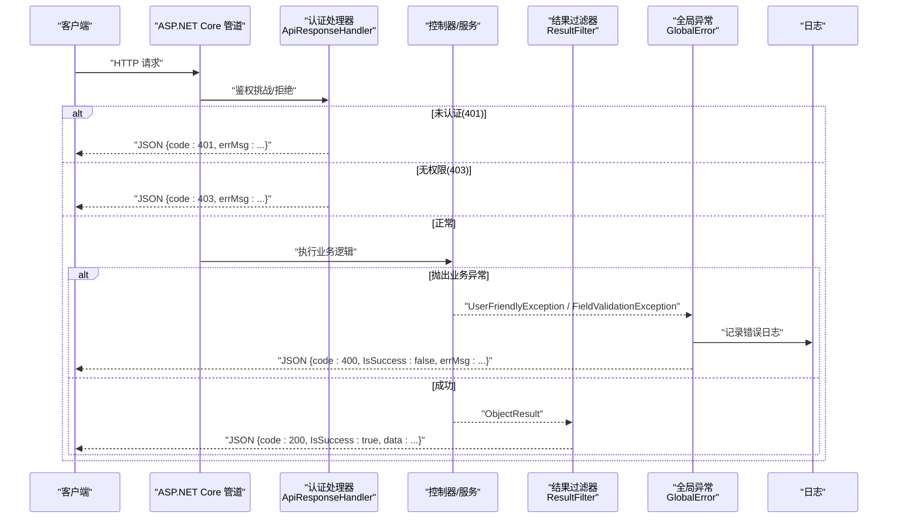
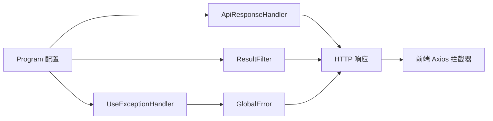

# 错误处理机制

<cite>
**本文引用的文件**
- [GlobalError.cs](file://Kevin/kevin.Module/Kevin.Common/App/Global/GlobalError.cs)
- [ApiResponseHandler.cs](file://Kevin/Domain/Auth/ApiResponseHandler.cs)
- [ResultFilter.cs](file://Kevin/Kevin.Web.Basics/Filters/ResultFilter.cs)
- [Program.cs](file://App/WebApi/Program.cs)
- [UserFriendlyException.cs](file://Kevin/kevin.Module/Kevin.Common/App/Exceptions/UserFriendlyException.cs)
- [FieldValidationException.cs](file://Kevin/kevin.Share/FieldValidationException.cs)
- [http.js](file://vue/kevin.web.vue/src/utils/http.js)
- [RetryTools.cs（Common）](file://Kevin/kevin.Module/Kevin.Common/Tools/RetryTools.cs)
- [RetryTools.cs（HttpApiClients）](file://Kevin/kevin.Module/Kevin.HttpApiClients/Tools/RetryTools.cs)
</cite>

## 目录
1. [简介](#简介)
2. [项目结构](#项目结构)
3. [核心组件](#核心组件)
4. [架构总览](#架构总览)
5. [详细组件分析](#详细组件分析)
6. [依赖关系分析](#依赖关系分析)
7. [性能考量](#性能考量)
8. [故障排查指南](#故障排查指南)
9. [结论](#结论)
10. [附录](#附录)

## 简介
本文件系统化梳理后端与前端在 HTTP 请求生命周期中的错误处理机制，覆盖网络错误、服务器错误与业务逻辑错误的分类；统一错误捕获、用户提示与日志记录流程；针对 401、403、500 等关键状态码的处理策略；以及异步错误处理模式（Promise 与 try-catch）。同时提供调试技巧与常见问题解决方案，帮助开发者快速定位与修复问题。

## 项目结构
错误处理贯穿“请求进入 -> 认证授权 -> 控制器执行 -> 结果过滤 -> 全局异常”的完整链路，并在前端通过 Axios 拦截器进行统一响应处理与用户提示。

```mermaid
graph TB
Client["浏览器/客户端"] --> API["ASP.NET Core 管道"]
API --> Auth["认证处理器<br/>ApiResponseHandler"]
API --> Controller["控制器/服务"]
Controller --> Result["结果过滤器<br/>ResultFilter"]
Result --> GlobalErr["全局异常中间件<br/>GlobalError"]
API --> Log["日志系统<br/>log4net"]
Client <--|HTTP 响应| API
```

图表来源
- [Program.cs:59-77](file://App/WebApi/Program.cs#L59-L77)
- [ApiResponseHandler.cs:23-35](file://Kevin/Domain/Auth/ApiResponseHandler.cs#L23-L35)
- [ResultFilter.cs:120-153](file://Kevin/Kevin.Web.Basics/Filters/ResultFilter.cs#L120-L153)
- [GlobalError.cs:16-64](file://Kevin/kevin.Module/Kevin.Common/App/Global/GlobalError.cs#L16-L64)

章节来源
- [Program.cs:59-77](file://App/WebApi/Program.cs#L59-L77)

## 核心组件
- 全局异常处理：捕获未处理异常，统一输出 JSON，并写入日志。
- 认证授权处理器：对 401 未认证与 403 无权限返回标准 JSON。
- 结果过滤器：对成功/失败响应进行统一封装，保证前端一致的数据结构。
- 业务异常类型：UserFriendlyException、FieldValidationException 用于表达可预期的业务错误。
- 前端 Axios 拦截器：统一处理 401/403/400/500 等错误，提示用户并做跳转或清理状态。
- 重试工具：为易失败的 I/O 操作提供重试能力，降低瞬时错误影响。

章节来源
- [GlobalError.cs:16-64](file://Kevin/kevin.Module/Kevin.Common/App/Global/GlobalError.cs#L16-L64)
- [ApiResponseHandler.cs:23-35](file://Kevin/Domain/Auth/ApiResponseHandler.cs#L23-L35)
- [ResultFilter.cs:120-153](file://Kevin/Kevin.Web.Basics/Filters/ResultFilter.cs#L120-L153)
- [UserFriendlyException.cs:6-19](file://Kevin/kevin.Module/Kevin.Common/App/Exceptions/UserFriendlyException.cs#L6-L19)
- [FieldValidationException.cs:5-18](file://Kevin/kevin.Share/FieldValidationException.cs#L5-L18)
- [http.js:12-122](file://vue/kevin.web.vue/src/utils/http.js#L12-L122)
- [RetryTools.cs（Common）:31-86](file://Kevin/kevin.Module/Kevin.Common/Tools/RetryTools.cs#L31-L86)
- [RetryTools.cs（HttpApiClients）:29-90](file://Kevin/kevin.Module/Kevin.HttpApiClients/Tools/RetryTools.cs#L29-L90)

## 架构总览
下图展示了从请求进入到最终响应的错误处理主路径，包括认证失败、业务异常、未处理异常的统一处理。



图表来源
- [ApiResponseHandler.cs:23-35](file://Kevin/Domain/Auth/ApiResponseHandler.cs#L23-L35)
- [ResultFilter.cs:120-153](file://Kevin/Kevin.Web.Basics/Filters/ResultFilter.cs#L120-L153)
- [GlobalError.cs:16-64](file://Kevin/kevin.Module/Kevin.Common/App/Global/GlobalError.cs#L16-L64)

## 详细组件分析

### 全局异常处理（GlobalError）
- 职责：捕获管道中未处理的异常，统一记录日志并返回标准 JSON。
- 行为要点：
  - 读取 IExceptionHandlerFeature.Error 获取异常信息。
  - 对 UserFriendlyException 与 FieldValidationException 映射为 400 业务错误。
  - 其他异常默认返回 500 内部错误。
  - 记录请求路径、参数、Authorization 头等信息到日志（便于排查）。
- 适用场景：所有未被上层捕获的异常都会落入此处，确保系统稳定性与一致性。

章节来源
- [GlobalError.cs:16-64](file://Kevin/kevin.Module/Kevin.Common/App/Global/GlobalError.cs#L16-L64)

### 认证与授权处理器（ApiResponseHandler）
- 职责：在认证/授权阶段对 401、403 进行统一响应。
- 行为要点：
  - HandleChallengeAsync：返回 401 及友好提示。
  - HandleForbiddenAsync：返回 403 及友好提示。
- 适用场景：当 JWT 缺失/过期或权限不足时，直接返回标准化错误，避免框架默认 HTML 页面。

章节来源
- [ApiResponseHandler.cs:23-35](file://Kevin/Domain/Auth/ApiResponseHandler.cs#L23-L35)

### 结果过滤器（ResultFilter）
- 职责：对控制器返回值进行统一包装，屏蔽内部细节，对外暴露稳定结构。
- 行为要点：
  - 将 ObjectResult 的值递归格式化，避免 null 字段导致前端解析异常。
  - 根据响应状态码生成统一 JSON：
    - 400：取 Items 中的 errMsg 或数据体 errMsg。
    - 401：返回“未授权”。
    - 500：返回“系统内部异常”。
    - 其他：返回成功结构 {code:200, IsSuccess:true, data}。
- 适用场景：所有非文件流响应均走此过滤器，确保前后端契约一致。

章节来源
- [ResultFilter.cs:120-153](file://Kevin/Kevin.Web.Basics/Filters/ResultFilter.cs#L120-L153)

### 业务异常类型（UserFriendlyException / FieldValidationException）
- 用途：表达可预期的业务错误（如参数校验失败、资源不存在），由全局异常处理统一转为 400。
- 设计要点：
  - 支持消息与内层异常传递，便于保留原始堆栈。
  - 可在服务层抛出，交由全局异常处理统一收敛。
- 适用场景：参数校验失败、业务规则不满足等场景。

章节来源
- [UserFriendlyException.cs:6-19](file://Kevin/kevin.Module/Kevin.Common/App/Exceptions/UserFriendlyException.cs#L6-L19)
- [FieldValidationException.cs:5-18](file://Kevin/kevin.Share/FieldValidationException.cs#L5-L18)

### 前端 Axios 拦截器（http.js）
- 职责：统一处理请求/响应错误，提示用户并维护登录态。
- 行为要点：
  - 请求拦截：携带 Authorization 头；对 400 错误提示。
  - 响应拦截：
    - 401：清理本地缓存并跳转到登录页。
    - 403：提示“接口无权限访问”。
    - 400/500：提示errMsg 并 reject Promise。
  - 文件下载：按 Content-Type 识别并走专用下载处理。
- 适用场景：所有 API 调用统一错误处理，提升用户体验与可维护性。

章节来源
- [http.js:12-122](file://vue/kevin.web.vue/src/utils/http.js#L12-L122)

### 重试工具（RetryTools）
- 职责：对易失败的异步操作提供重试能力，降低瞬时错误影响。
- 行为要点：
  - 同步/异步重试方法，支持自定义重试次数与间隔。
  - 每次失败记录错误日志，便于定位。
- 适用场景：数据库超时、外部服务抖动等临时性失败。

章节来源
- [RetryTools.cs（Common）:31-86](file://Kevin/kevin.Module/Kevin.Common/Tools/RetryTools.cs#L31-L86)
- [RetryTools.cs（HttpApiClients）:29-90](file://Kevin/kevin.Module/Kevin.HttpApiClients/Tools/RetryTools.cs#L29-L90)

## 依赖关系分析
- Program 注册全局异常中间件，串联认证、控制器、结果过滤器与全局异常。
- ApiResponseHandler 依赖 ASP.NET Core 认证管线，输出 401/403。
- ResultFilter 依赖 MVC 结果管道，统一封装响应。
- GlobalError 依赖日志组件与 HttpContext 扩展，输出统一错误。
- 前端 http.js 依赖 axios，统一处理后端返回的错误结构。



图表来源
- [Program.cs:59-77](file://App/WebApi/Program.cs#L59-L77)
- [ApiResponseHandler.cs:23-35](file://Kevin/Domain/Auth/ApiResponseHandler.cs#L23-L35)
- [ResultFilter.cs:120-153](file://Kevin/Kevin.Web.Basics/Filters/ResultFilter.cs#L120-L153)
- [GlobalError.cs:16-64](file://Kevin/kevin.Module/Kevin.Common/App/Global/GlobalError.cs#L16-L64)
- [http.js:12-122](file://vue/kevin.web.vue/src/utils/http.js#L12-L122)

章节来源
- [Program.cs:59-77](file://App/WebApi/Program.cs#L59-L77)

## 性能考量
- 递归深度限制：ResultFilter 对对象属性递归格式化设置最大深度，避免深层嵌套导致的性能问题或栈溢出。
- 日志体积控制：GlobalError 对请求参数序列化长度进行截断，防止超大 payload 影响日志性能。
- 重试退避：RetryTools 使用固定间隔重试，可根据实际场景引入指数退避与抖动策略以降低雪崩风险。
- 前端超时：Axios 实例设置了较长超时，适合大文件或长耗时任务，但需结合后端超时与重试策略综合评估。

[本节为通用指导，不直接分析具体文件]

## 故障排查指南
- 401 未授权
  - 检查是否携带有效 token，前端是否在 401 时清理缓存并跳转登录。
  - 确认后端认证处理器是否正确返回 401 JSON。
  - 参考：[ApiResponseHandler.cs:23-28](file://Kevin/Domain/Auth/ApiResponseHandler.cs#L23-L28)、[http.js:52-66](file://vue/kevin.web.vue/src/utils/http.js#L52-L66)
- 403 无权限
  - 检查角色/权限配置是否正确，确认后端返回 403 JSON。
  - 参考：[ApiResponseHandler.cs:30-35](file://Kevin/Domain/Auth/ApiResponseHandler.cs#L30-L35)、[http.js:93-96](file://vue/kevin.web.vue/src/utils/http.js#L93-L96)
- 400 业务错误
  - 在服务层抛出 UserFriendlyException 或 FieldValidationException，确保 message 清晰。
  - 前端会提示 errMsg 并 reject Promise。
  - 参考：[GlobalError.cs:28-37](file://Kevin/kevin.Module/Kevin.Common/App/Global/GlobalError.cs#L28-L37)、[ResultFilter.cs:130-145](file://Kevin/Kevin.Web.Basics/Filters/ResultFilter.cs#L130-L145)、[http.js:67-71](file://vue/kevin.web.vue/src/utils/http.js#L67-L71)
- 500 服务器错误
  - 查看 GlobalError 记录的日志，关注 path、parameter、authorization 与异常堆栈。
  - 参考：[GlobalError.cs:41-62](file://Kevin/kevin.Module/Kevin.Common/App/Global/GlobalError.cs#L41-L62)
- 异步错误处理
  - 使用 try-catch 包裹异步调用，或在 Promise 链中使用 .catch()。
  - 对易失败的外部调用使用 RetryTools 进行重试。
  - 参考：[RetryTools.cs（Common）:50-67](file://Kevin/kevin.Module/Kevin.Common/Tools/RetryTools.cs#L50-L67)、[RetryTools.cs（HttpApiClients）:48-65](file://Kevin/kevin.Module/Kevin.HttpApiClients/Tools/RetryTools.cs#L48-L65)

章节来源
- [ApiResponseHandler.cs:23-35](file://Kevin/Domain/Auth/ApiResponseHandler.cs#L23-L35)
- [GlobalError.cs:28-62](file://Kevin/kevin.Module/Kevin.Common/App/Global/GlobalError.cs#L28-L62)
- [ResultFilter.cs:130-145](file://Kevin/Kevin.Web.Basics/Filters/ResultFilter.cs#L130-L145)
- [http.js:52-96](file://vue/kevin.web.vue/src/utils/http.js#L52-L96)
- [RetryTools.cs（Common）:50-67](file://Kevin/kevin.Module/Kevin.Common/Tools/RetryTools.cs#L50-L67)
- [RetryTools.cs（HttpApiClients）:48-65](file://Kevin/kevin.Module/Kevin.HttpApiClients/Tools/RetryTools.cs#L48-L65)

## 结论
本项目在后端通过“认证处理器 + 结果过滤器 + 全局异常”构建了统一的错误处理体系，在前端通过 Axios 拦截器实现一致的错误提示与状态管理。配合业务异常类型与重试工具，既保证了用户体验，又提升了系统的健壮性与可维护性。建议在实际开发中遵循以下最佳实践：
- 在服务层优先抛出明确的业务异常，而非裸抛通用异常。
- 保持前后端错误结构一致，减少适配成本。
- 对不稳定依赖使用重试与超时保护，避免级联失败。
- 充分利用日志信息进行问题定位，注意敏感信息脱敏与日志体积控制。

[本节为总结性内容，不直接分析具体文件]

## 附录
- 统一错误响应结构（后端）
  - 成功：{ code: 200, IsSuccess: true, data: ... }
  - 业务错误：{ code: 400, IsSuccess: false, errMsg: "..." }
  - 未认证：{ code: 401, IsSuccess: false, errMsg: "..." }
  - 无权限：{ code: 403, IsSuccess: false, errMsg: "..." }
  - 服务器错误：{ code: 500, IsSuccess: false, errMsg: "..." }
- 前端错误处理要点
  - 401：清理本地缓存并跳转登录。
  - 403：提示无权限。
  - 400/500：提示 errMsg 并 reject Promise。
  - 文件下载：按 Content-Type 分流处理。

[本节为概念性说明，不直接分析具体文件]