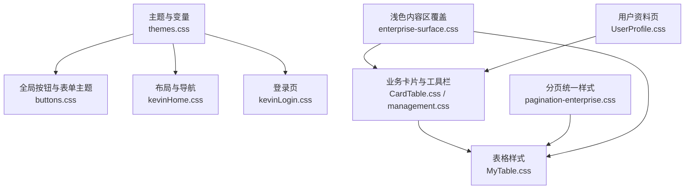
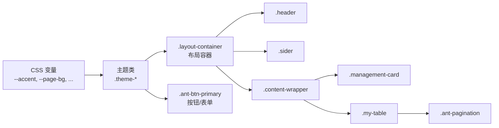
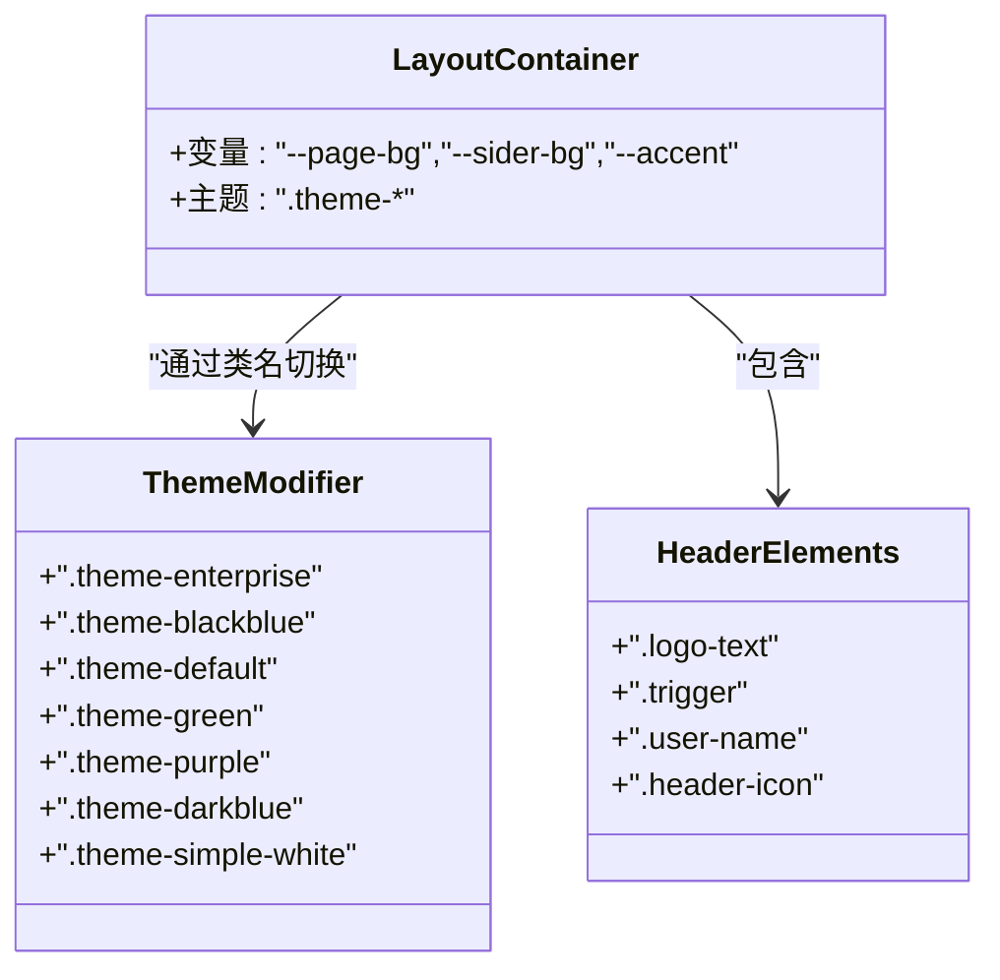
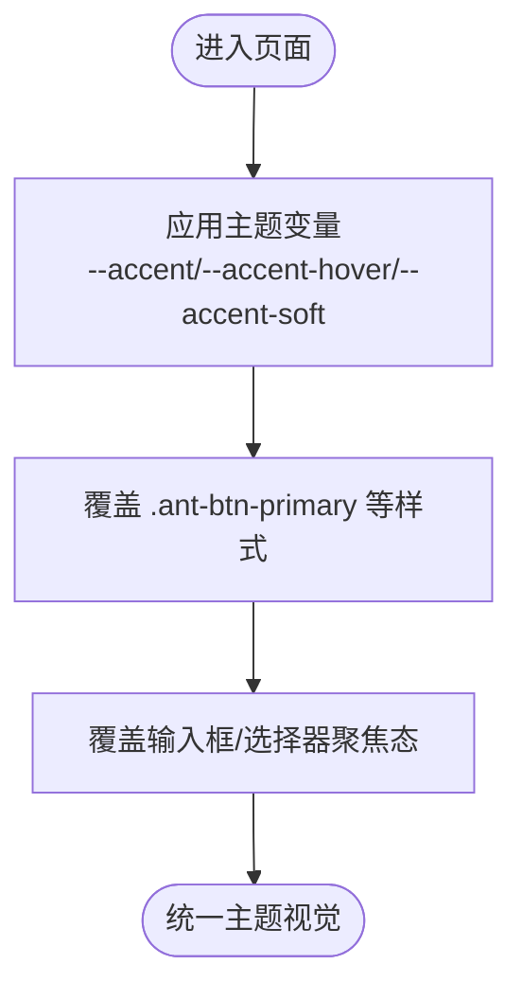
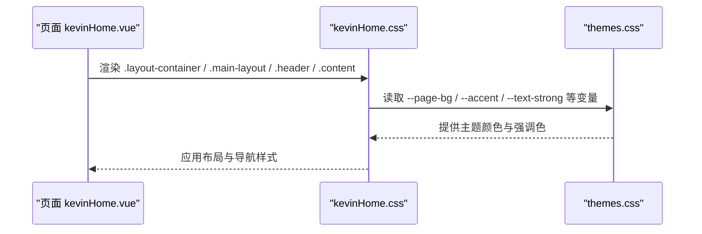
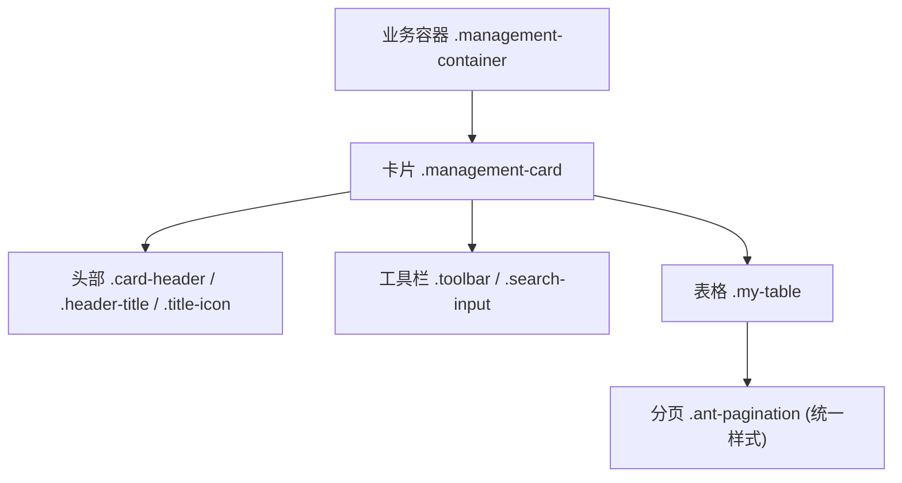
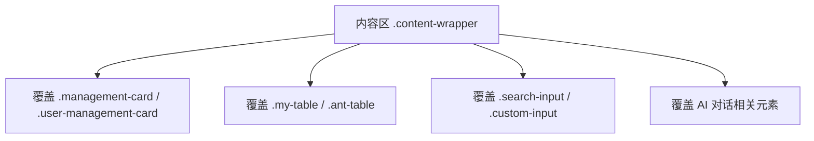
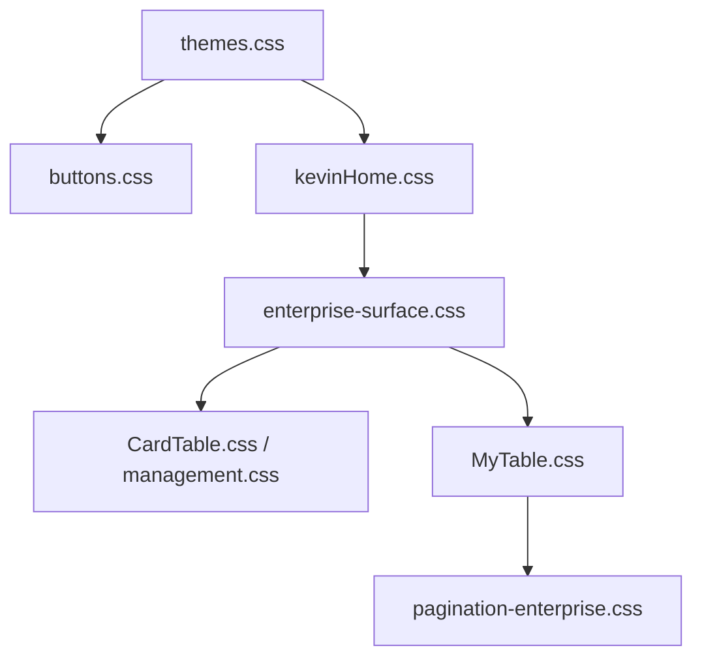

# CSS命名规范

<cite>
**本文引用的文件**
- [themes.css](file://vue/kevin.web.vue/src/css/themes.css)
- [buttons.css](file://vue/kevin.web.vue/src/css/buttons.css)
- [kevinHome.css](file://vue/kevin.web.vue/src/css/kevinHome.css)
- [kevinLogin.css](file://vue/kevin.web.vue/src/css/kevinLogin.css)
- [CardTable.css](file://vue/kevin.web.vue/src/css/CardTable.css)
- [MyTable.css](file://vue/kevin.web.vue/src/css/MyTable.css)
- [UserProfile.css](file://vue/kevin.web.vue/src/css/UserProfile.css)
- [management.css](file://vue/kevin.web.vue/src/css/management.css)
- [pagination-enterprise.css](file://vue/kevin.web.vue/src/css/pagination-enterprise.css)
- [enterprise-surface.css](file://vue/kevin.web.vue/src/css/enterprise-surface.css)
- [kevinHome.vue](file://vue/kevin.web.vue/src/pages/kevinHome.vue)
- [UserManagement.vue](file://vue/kevin.web.vue/src/components/UserManagement.vue)
</cite>

## 目录
1. [简介](#简介)
2. [项目结构](#项目结构)
3. [核心组件](#核心组件)
4. [架构总览](#架构总览)
5. [详细组件分析](#详细组件分析)
6. [依赖关系分析](#依赖关系分析)
7. [性能考量](#性能考量)
8. [故障排查指南](#故障排查指南)
9. [结论](#结论)
10. [附录](#附录)

## 简介
本规范面向 NetCoreKevin 前端（Vue）的样式工程，目标是统一并提升代码可读性与可维护性。文档重点说明：
- BEM 命名方法在本项目的落地实践与约束
- 语义化类名原则与最佳实践
- 组件样式与作用域样式的约定
- 第三方组件（Ant Design Vue）样式覆盖的命名策略
- 命名冲突的预防与解决
- 结合仓库实际文件的示例与反例对比

## 项目结构
前端样式集中在 vue/kevin.web.vue/src/css 目录，按职责拆分：
- 主题与全局变量：themes.css
- 全局组件风格与主题变量应用：buttons.css
- 布局与页面级样式：kevinHome.css、kevinLogin.css
- 业务卡片与表格：CardTable.css、MyTable.css、management.css
- 分页统一样式：pagination-enterprise.css
- 浅色内容区对历史深色样式的覆盖：enterprise-surface.css
- 用户资料页：UserProfile.css

图表来源
- [themes.css:1-378](file://vue/kevin.web.vue/src/css/themes.css#L1-L378)
- [buttons.css:1-99](file://vue/kevin.web.vue/src/css/buttons.css#L1-L99)
- [kevinHome.css:1-387](file://vue/kevin.web.vue/src/css/kevinHome.css#L1-L387)
- [kevinLogin.css:1-255](file://vue/kevin.web.vue/src/css/kevinLogin.css#L1-L255)
- [CardTable.css:1-353](file://vue/kevin.web.vue/src/css/CardTable.css#L1-L353)
- [MyTable.css:1-76](file://vue/kevin.web.vue/src/css/MyTable.css#L1-L76)
- [management.css:1-177](file://vue/kevin.web.vue/src/css/management.css#L1-L177)
- [pagination-enterprise.css:1-135](file://vue/kevin.web.vue/src/css/pagination-enterprise.css#L1-L135)
- [enterprise-surface.css:1-327](file://vue/kevin.web.vue/src/css/enterprise-surface.css#L1-L327)

章节来源
- [themes.css:1-378](file://vue/kevin.web.vue/src/css/themes.css#L1-L378)
- [kevinHome.css:1-387](file://vue/kevin.web.vue/src/css/kevinHome.css#L1-L387)
- [enterprise-surface.css:1-327](file://vue/kevin.web.vue/src/css/enterprise-surface.css#L1-L327)

## 核心组件
- 主题系统：通过 CSS 自定义属性集中管理强调色、背景、边框、文字等，便于多主题切换与一致性控制。
- 全局按钮与表单：统一使用主题变量，确保交互态一致。
- 布局容器：以 .layout-container 为根，内部包含侧边栏、头部、内容区、底部与标签页导航。
- 业务卡片与表格：以 .management-container/.management-card 为块，配合 .toolbar、.table-container、.my-table 等元素。
- 分页：独立 .pagination-container，并对表格内分页进行统一覆盖。
- 浅色内容区覆盖：在 .content-wrapper 下对历史深色样式进行统一修正。

章节来源
- [themes.css:1-378](file://vue/kevin.web.vue/src/css/themes.css#L1-L378)
- [buttons.css:1-99](file://vue/kevin.web.vue/src/css/buttons.css#L1-L99)
- [kevinHome.css:1-387](file://vue/kevin.web.vue/src/css/kevinHome.css#L1-L387)
- [CardTable.css:1-353](file://vue/kevin.web.vue/src/css/CardTable.css#L1-L353)
- [MyTable.css:1-76](file://vue/kevin.web.vue/src/css/MyTable.css#L1-L76)
- [pagination-enterprise.css:1-135](file://vue/kevin.web.vue/src/css/pagination-enterprise.css#L1-L135)
- [enterprise-surface.css:1-327](file://vue/kevin.web.vue/src/css/enterprise-surface.css#L1-L327)

## 架构总览
下图展示主题变量如何驱动全局样式，以及页面与组件如何消费这些变量。

图表来源
- [themes.css:1-378](file://vue/kevin.web.vue/src/css/themes.css#L1-L378)
- [buttons.css:1-99](file://vue/kevin.web.vue/src/css/buttons.css#L1-L99)
- [kevinHome.css:1-387](file://vue/kevin.web.vue/src/css/kevinHome.css#L1-L387)
- [enterprise-surface.css:1-327](file://vue/kevin.web.vue/src/css/enterprise-surface.css#L1-L327)

## 详细组件分析

### 主题系统（BEM 视角）
- Block：主题容器 .layout-container 作为“块”，承载全局变量与主题作用域。
- Modifier：.theme-enterprise、.theme-blackblue、.theme-default、.theme-green、.theme-purple、.theme-darkblue、.theme-simple-white 作为“修饰符”，用于切换主题。
- Element：主题下的子元素如 .logo-text、.trigger、.user-name、.header-icon 等，均受当前主题变量影响。

图表来源
- [themes.css:1-378](file://vue/kevin.web.vue/src/css/themes.css#L1-L378)
- [kevinHome.css:1-387](file://vue/kevin.web.vue/src/css/kevinHome.css#L1-L387)

章节来源
- [themes.css:1-378](file://vue/kevin.web.vue/src/css/themes.css#L1-L378)
- [kevinHome.vue:1-200](file://vue/kevin.web.vue/src/pages/kevinHome.vue#L1-L200)

### 全局按钮与表单（BEM 视角）
- Block：.layout-container 作为作用域块，避免全局污染。
- Element：.ant-btn-primary、.ant-input、.ant-select 等第三方组件元素在块内被主题变量覆盖。
- Modifier：通过 hover/focus 状态实现交互修饰。

图表来源
- [buttons.css:1-99](file://vue/kevin.web.vue/src/css/buttons.css#L1-L99)
- [themes.css:1-378](file://vue/kevin.web.vue/src/css/themes.css#L1-L378)

章节来源
- [buttons.css:1-99](file://vue/kevin.web.vue/src/css/buttons.css#L1-L99)
- [themes.css:1-378](file://vue/kevin.web.vue/src/css/themes.css#L1-L378)

### 布局与导航（BEM 视角）
- Block：.layout-container、.main-layout
- Element：.sider、.header、.header-left、.header-right、.content、.footer、.menu-wrapper
- Modifier：.tab-item.active、.tab-navigation 等状态修饰

图表来源
- [kevinHome.vue:1-200](file://vue/kevin.web.vue/src/pages/kevinHome.vue#L1-L200)
- [kevinHome.css:1-387](file://vue/kevin.web.vue/src/css/kevinHome.css#L1-L387)
- [themes.css:1-378](file://vue/kevin.web.vue/src/css/themes.css#L1-L378)

章节来源
- [kevinHome.css:1-387](file://vue/kevin.web.vue/src/css/kevinHome.css#L1-L387)
- [kevinHome.vue:1-200](file://vue/kevin.web.vue/src/pages/kevinHome.vue#L1-L200)

### 业务卡片与表格（BEM 视角）
- Block：.management-container、.management-card
- Element：.card-header、.header-title、.title-icon、.header-actions、.toolbar、.table-container、.my-table
- Modifier：.active、.horizontal 等

图表来源
- [CardTable.css:1-353](file://vue/kevin.web.vue/src/css/CardTable.css#L1-L353)
- [management.css:1-177](file://vue/kevin.web.vue/src/css/management.css#L1-L177)
- [MyTable.css:1-76](file://vue/kevin.web.vue/src/css/MyTable.css#L1-L76)
- [pagination-enterprise.css:1-135](file://vue/kevin.web.vue/src/css/pagination-enterprise.css#L1-L135)

章节来源
- [CardTable.css:1-353](file://vue/kevin.web.vue/src/css/CardTable.css#L1-L353)
- [management.css:1-177](file://vue/kevin.web.vue/src/css/management.css#L1-L177)
- [MyTable.css:1-76](file://vue/kevin.web.vue/src/css/MyTable.css#L1-L76)
- [pagination-enterprise.css:1-135](file://vue/kevin.web.vue/src/css/pagination-enterprise.css#L1-L135)

### 浅色内容区覆盖（第三方样式治理）
- Block：.content-wrapper
- Element：针对历史深色样式中的卡片、表格、输入、对话气泡等进行覆盖
- Modifier：通过组合选择器限定作用域，避免全局污染

图表来源
- [enterprise-surface.css:1-327](file://vue/kevin.web.vue/src/css/enterprise-surface.css#L1-L327)

章节来源
- [enterprise-surface.css:1-327](file://vue/kevin.web.vue/src/css/enterprise-surface.css#L1-L327)

### 登录页（BEM 视角）
- Block：.login-container
- Element：.login-card、.login-header、.form-options、.captcha-wrapper、.login-button
- Modifier：.login-tabs、.custom-input 等

章节来源
- [kevinLogin.css:1-255](file://vue/kevin.web.vue/src/css/kevinLogin.css#L1-L255)

### 用户资料页（BEM 视角）
- Block：.user-profile-container
- Element：.user-profile-card、.avatar-section、.info-section、.action-buttons
- Modifier：响应式适配

章节来源
- [UserProfile.css:1-126](file://vue/kevin.web.vue/src/css/UserProfile.css#L1-L126)

## 依赖关系分析
- 主题变量是全局样式的基础，所有组件样式通过引用变量保持一致性。
- 布局与页面样式依赖主题变量；业务卡片与表格样式在布局容器内生效。
- 第三方组件样式通过作用域选择器（如 .layout-container、.content-wrapper）进行覆盖，降低耦合度。

图表来源
- [themes.css:1-378](file://vue/kevin.web.vue/src/css/themes.css#L1-L378)
- [buttons.css:1-99](file://vue/kevin.web.vue/src/css/buttons.css#L1-L99)
- [kevinHome.css:1-387](file://vue/kevin.web.vue/src/css/kevinHome.css#L1-L387)
- [enterprise-surface.css:1-327](file://vue/kevin.web.vue/src/css/enterprise-surface.css#L1-L327)
- [CardTable.css:1-353](file://vue/kevin.web.vue/src/css/CardTable.css#L1-L353)
- [MyTable.css:1-76](file://vue/kevin.web.vue/src/css/MyTable.css#L1-L76)
- [pagination-enterprise.css:1-135](file://vue/kevin.web.vue/src/css/pagination-enterprise.css#L1-L135)

章节来源
- [themes.css:1-378](file://vue/kevin.web.vue/src/css/themes.css#L1-L378)
- [enterprise-surface.css:1-327](file://vue/kevin.web.vue/src/css/enterprise-surface.css#L1-L327)

## 性能考量
- 优先使用 CSS 变量减少重复声明，提高主题切换效率。
- 使用作用域选择器（如 .layout-container、.content-wrapper）限制样式范围，避免全局匹配带来的额外计算。
- 合理使用 :deep() 仅针对必要的第三方组件内部节点，避免过度穿透。
- 将通用样式拆分为独立文件并按需引入，减少首屏样式体积。

## 故障排查指南
- 主题未生效
  - 检查页面是否挂载了正确的主题类（如 .theme-enterprise），并确保 .layout-container 存在。
  - 确认 themes.css 已正确引入，且变量定义未被覆盖。
- 按钮/表单颜色异常
  - 检查 buttons.css 中 :hover/:focus 规则是否被其他样式覆盖。
  - 确认 .layout-container 或 .content-wrapper 作用域是否正确。
- 表格/分页样式错乱
  - 检查 enterprise-surface.css 对 .my-table 和 .ant-pagination 的覆盖是否生效。
  - 确认分页容器 .pagination-container 与表格内分页的选择器优先级。
- 浅色内容区文本不可见
  - 检查 enterprise-surface.css 对 .content-wrapper 下元素的覆盖是否完整。
  - 核对历史深色样式是否仍在全局生效。

章节来源
- [themes.css:1-378](file://vue/kevin.web.vue/src/css/themes.css#L1-L378)
- [buttons.css:1-99](file://vue/kevin.web.vue/src/css/buttons.css#L1-L99)
- [enterprise-surface.css:1-327](file://vue/kevin.web.vue/src/css/enterprise-surface.css#L1-L327)
- [MyTable.css:1-76](file://vue/kevin.web.vue/src/css/MyTable.css#L1-L76)
- [pagination-enterprise.css:1-135](file://vue/kevin.web.vue/src/css/pagination-enterprise.css#L1-L135)

## 结论
本项目采用“主题变量 + 作用域选择器”的方式，结合 BEM 思想组织类名，实现了清晰、可扩展的前端样式体系。通过统一的命名约定与覆盖策略，既保证了多主题的一致性，又有效治理了第三方组件样式，提升了可维护性与团队协作效率。

## 附录

### BEM 在项目中的实践要点
- Block（块）：代表一个独立的业务单元，如 .layout-container、.management-container、.login-container。
- Element（元素）：块的组成部分，如 .header、.sider、.card-header、.table-container。
- Modifier（修饰符）：表示状态或变体，如 .theme-enterprise、.active、.horizontal。

### 语义化命名原则
- 使用描述功能的名称，避免抽象或技术实现词汇（如 .btn 改为 .add-button）。
- 保持层级扁平，避免过深的嵌套选择器。
- 同一概念在不同文件中复用相同类名，增强一致性。

### 组件样式与作用域样式约定
- 组件级样式尽量放在组件所在目录或对应业务 CSS 文件中。
- 使用 .layout-container 或 .content-wrapper 作为作用域块，避免全局污染。
- 对第三方组件的覆盖必须限定在作用域内，并使用 :deep() 精准命中。

### 第三方组件样式覆盖命名
- 统一入口：在 .layout-container 或 .content-wrapper 下覆盖 Ant Design Vue 组件样式。
- 常见覆盖点：.ant-btn-primary、.ant-input、.ant-select、.ant-table、.ant-pagination。
- 使用 !important 仅在必要时，并通过更高优先级选择器替代。

### 命名冲突解决方案与最佳实践
- 使用唯一前缀或作用域块隔离不同模块样式。
- 避免同名类跨模块复用，必要时通过组合选择器区分上下文。
- 定期清理无用类名，合并重复样式。
- 通过 ESLint/CSSLint 或团队规范检查类名是否符合约定。

### 具体示例与反例对比
- 推荐（Block.Element.Modifier）
  - .layout-container > .header > .header-icon:hover
  - .management-container > .management-card > .card-header > .header-title
  - .theme-enterprise > .trigger:hover
- 不推荐（过于具体或无意义）
  - 直接使用 .ant-btn-primary 全局覆盖（应限定在 .layout-container 或 .content-wrapper）
  - 使用 .btn1、.box-red 等非语义类名
  - 过深嵌套选择器导致维护困难

章节来源
- [kevinHome.css:1-387](file://vue/kevin.web.vue/src/css/kevinHome.css#L1-L387)
- [CardTable.css:1-353](file://vue/kevin.web.vue/src/css/CardTable.css#L1-L353)
- [management.css:1-177](file://vue/kevin.web.vue/src/css/management.css#L1-L177)
- [MyTable.css:1-76](file://vue/kevin.web.vue/src/css/MyTable.css#L1-L76)
- [pagination-enterprise.css:1-135](file://vue/kevin.web.vue/src/css/pagination-enterprise.css#L1-L135)
- [enterprise-surface.css:1-327](file://vue/kevin.web.vue/src/css/enterprise-surface.css#L1-L327)
- [themes.css:1-378](file://vue/kevin.web.vue/src/css/themes.css#L1-L378)
- [kevinHome.vue:1-200](file://vue/kevin.web.vue/src/pages/kevinHome.vue#L1-L200)
- [UserManagement.vue:1-200](file://vue/kevin.web.vue/src/components/UserManagement.vue#L1-L200)