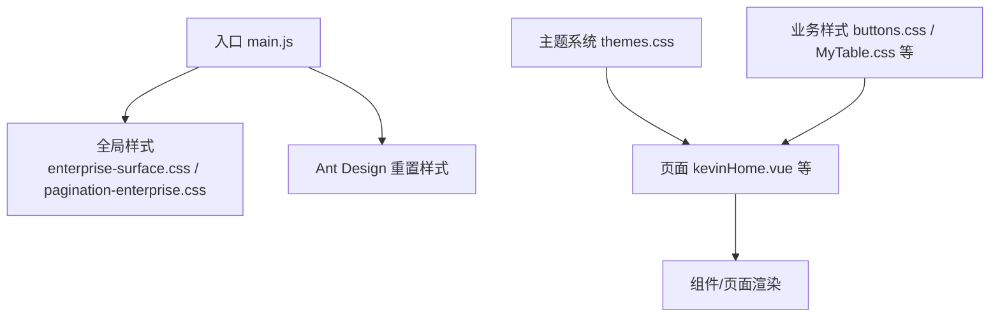
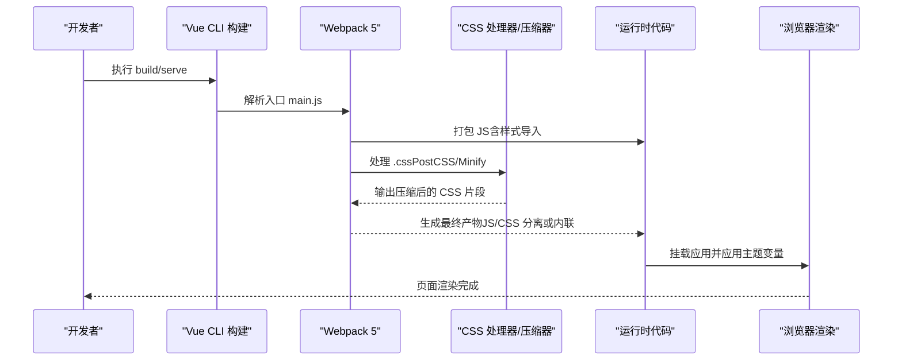
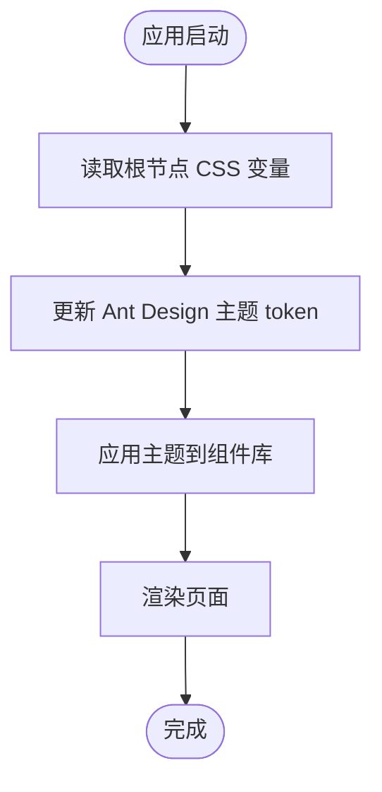
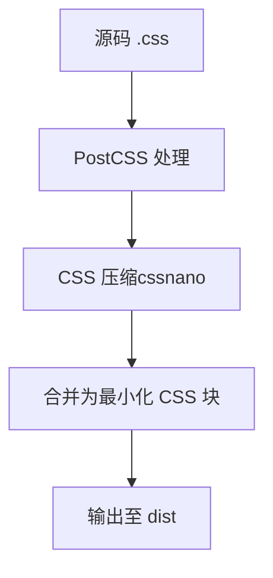
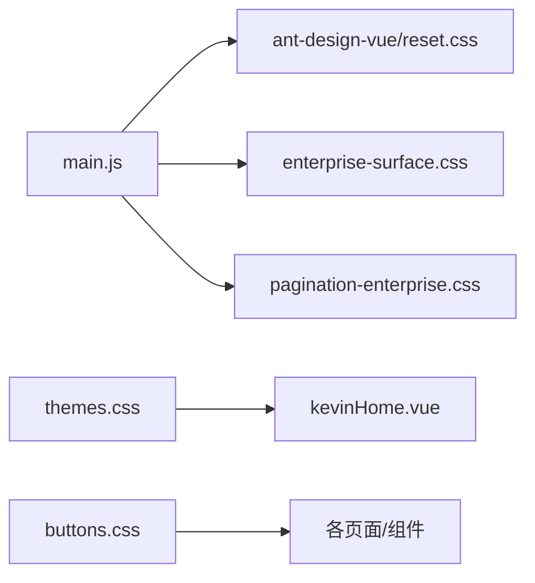

# CSS性能优化

<cite>
**本文引用的文件**
- [vue.config.js](file://vue/kevin.web.vue/vue.config.js)
- [package.json](file://vue/kevin.web.vue/package.json)
- [main.js](file://vue/kevin.web.vue/src/main.js)
- [App.vue](file://vue/kevin.web.vue/src/App.vue)
- [themes.css](file://vue/kevin.web.vue/src/css/themes.css)
- [enterprise-surface.css](file://vue/kevin.web.vue/src/css/enterprise-surface.css)
- [buttons.css](file://vue/kevin.web.vue/src/css/buttons.css)
- [kevinHome.vue](file://vue/kevin.web.vue/src/pages/kevinHome.vue)
</cite>

## 目录
1. [简介](#简介)
2. [项目结构](#项目结构)
3. [核心组件](#核心组件)
4. [架构总览](#架构总览)
5. [详细组件分析](#详细组件分析)
6. [依赖关系分析](#依赖关系分析)
7. [性能考量](#性能考量)
8. [故障排查指南](#故障排查指南)
9. [结论](#结论)
10. [附录](#附录)

## 简介
本文件面向 NetCoreKevin 前端（Vue 3 + Ant Design Vue）的 CSS 性能优化，聚焦以下目标：
- 构建期 CSS 压缩与合并策略（基于 Vue CLI 5 / Webpack 5）
- CSS 选择器性能优化与低效选择器规避
- 动画与过渡效果的性能技巧
- 缓存策略与 CDN 部署最佳实践
- 文件大小分析与优化方法
- 性能监控与调试工具使用指南

## 项目结构
前端位于 vue/kevin.web.vue，CSS 资源集中在 src/css，入口通过 main.js 引入全局样式；主题系统通过 themes.css 提供多套主题变量；业务页面在 pages 中按需引入或 @import 局部样式。

图表来源
- [main.js:1-20](file://vue/kevin.web.vue/src/main.js#L1-L20)
- [themes.css:1-378](file://vue/kevin.web.vue/src/css/themes.css#L1-L378)
- [enterprise-surface.css:1-327](file://vue/kevin.web.vue/src/css/enterprise-surface.css#L1-L327)
- [buttons.css:1-99](file://vue/kevin.web.vue/src/css/buttons.css#L1-L99)
- [kevinHome.vue:1-200](file://vue/kevin.web.vue/src/pages/kevinHome.vue#L1-L200)

章节来源
- [main.js:1-20](file://vue/kevin.web.vue/src/main.js#L1-L20)
- [package.json:1-68](file://vue/kevin.web.vue/package.json#L1-L68)
- [vue.config.js:1-21](file://vue/kevin.web.vue/vue.config.js#L1-L21)

## 核心组件
- 主题系统：通过 CSS 自定义属性（--accent、--accent-hover、--accent-soft 等）集中管理强调色与布局色板，配合 App.vue 动态读取并注入到 Ant Design 主题 token，实现运行时主题切换。
- 全局样式覆盖：enterprise-surface.css 统一内容区卡片、表格、输入框、分页等 UI 的浅色企业风外观；buttons.css 统一按钮、输入框、开关、复选/单选、日期选择器等交互态颜色。
- 页面级样式：各页面按需 import 或 @import 局部样式，避免重复加载。

章节来源
- [App.vue:1-53](file://vue/kevin.web.vue/src/App.vue#L1-L53)
- [themes.css:1-378](file://vue/kevin.web.vue/src/css/themes.css#L1-L378)
- [enterprise-surface.css:1-327](file://vue/kevin.web.vue/src/css/enterprise-surface.css#L1-L327)
- [buttons.css:1-99](file://vue/kevin.web.vue/src/css/buttons.css#L1-L99)

## 架构总览
下图展示了从入口到样式加载、主题应用与页面渲染的关键路径，以及构建期压缩/合并的参与点。

图表来源
- [vue.config.js:1-21](file://vue/kevin.web.vue/vue.config.js#L1-L21)
- [package.json:37-46](file://vue/kevin.web.vue/package.json#L37-L46)
- [main.js:1-20](file://vue/kevin.web.vue/src/main.js#L1-L20)

## 详细组件分析

### 主题系统与运行时换肤
- 主题变量集中定义于 themes.css，通过类名切换（如 theme-enterprise、theme-simple-white）改变 --accent 等变量。
- App.vue 在 mounted 时读取根节点 CSS 变量并更新 Ant Design 主题 token，保证组件库与自定义样式一致。
- 页面 kevinHome.vue 通过 class 绑定 currentTheme 控制整体主题。

图表来源
- [App.vue:8-41](file://vue/kevin.web.vue/src/App.vue#L8-L41)
- [themes.css:1-378](file://vue/kevin.web.vue/src/css/themes.css#L1-L378)
- [kevinHome.vue:1-200](file://vue/kevin.web.vue/src/pages/kevinHome.vue#L1-L200)

章节来源
- [App.vue:1-53](file://vue/kevin.web.vue/src/App.vue#L1-L53)
- [themes.css:1-378](file://vue/kevin.web.vue/src/css/themes.css#L1-L378)
- [kevinHome.vue:1-200](file://vue/kevin.web.vue/src/pages/kevinHome.vue#L1-L200)

### 全局样式与组件样式覆盖
- enterprise-surface.css 针对 content-wrapper 下的卡片、表格、输入、搜索、分页等进行统一覆盖，确保浅色内容区的可读性与一致性。
- buttons.css 统一按钮、输入框、开关、复选/单选、日期选择器的焦点态与选中态颜色，提升交互一致性。
- 注意：多处使用 !important 覆盖第三方组件样式，需评估是否可通过更精确的选择器或主题配置替代，以减少优先级冲突与重绘成本。

章节来源
- [enterprise-surface.css:1-327](file://vue/kevin.web.vue/src/css/enterprise-surface.css#L1-L327)
- [buttons.css:1-99](file://vue/kevin.web.vue/src/css/buttons.css#L1-L99)

### 构建期 CSS 压缩与合并
- 当前使用 Vue CLI 5（基于 Webpack 5），默认启用 CSS 压缩与模块合并。
- package.json 显示已集成 css-minimizer-webpack-plugin（依赖 cssnano、postcss），用于生产环境压缩 CSS。
- 可在 vue.config.js 中进一步定制 PostCSS 插件链与压缩选项（例如开启 autoprefixer、optimizeCss）。

图表来源
- [package.json:37-46](file://vue/kevin.web.vue/package.json#L37-L46)
- [vue.config.js:1-21](file://vue/kevin.web.vue/vue.config.js#L1-L21)

章节来源
- [package.json:37-46](file://vue/kevin.web.vue/package.json#L37-L46)
- [vue.config.js:1-21](file://vue/kevin.web.vue/vue.config.js#L1-L21)

## 依赖关系分析
- 入口 main.js 引入 Ant Design 重置样式与全局业务样式，确保基础样式优先加载。
- 主题样式 themes.css 被页面通过 class 切换，影响全局强调色与侧栏背景等。
- 业务样式按页面/组件按需引入，减少首屏无关样式。

图表来源
- [main.js:1-20](file://vue/kevin.web.vue/src/main.js#L1-L20)
- [themes.css:1-378](file://vue/kevin.web.vue/src/css/themes.css#L1-L378)
- [buttons.css:1-99](file://vue/kevin.web.vue/src/css/buttons.css#L1-L99)
- [kevinHome.vue:1-200](file://vue/kevin.web.vue/src/pages/kevinHome.vue#L1-L200)

章节来源
- [main.js:1-20](file://vue/kevin.web.vue/src/main.js#L1-L20)

## 性能考量

### CSS 代码压缩与合并策略
- 生产构建默认启用压缩与合并，建议：
  - 保持现有 css-minimizer-webpack-plugin 配置，必要时开启 source map 以便定位问题。
  - 在 vue.config.js 中扩展 PostCSS 插件链，加入 autoprefixer、cssnano 的合理 preset，确保跨浏览器兼容与极致压缩。
  - 对大型主题文件可考虑拆分并按需加载（例如将非首屏主题变体延迟加载）。

章节来源
- [package.json:37-46](file://vue/kevin.web.vue/package.json#L37-L46)
- [vue.config.js:1-21](file://vue/kevin.web.vue/vue.config.js#L1-L21)

### CSS 选择器性能优化
- 避免深层嵌套与过度限定：尽量使用语义化类名，减少后代选择器层级，降低匹配开销。
- 谨慎使用通配符与标签选择器：如 *、div、span 等会扩大匹配范围，优先使用具体类名。
- 合理使用作用域：通过父容器限定（如 .content-wrapper）避免全局污染，同时提高匹配效率。
- 减少 !important 的使用：仅在覆盖第三方组件时必须使用，优先考虑主题配置或更精确选择器。

### 动画与过渡效果优化
- 仅对必要元素启用动画：避免在长列表或复杂表格行上频繁触发重排/重绘。
- 使用 GPU 加速属性：优先 transform 与 opacity，避免触发布局变化的属性（如 width、height、top、left）。
- 控制动画频率与时长：合理设置 transition-duration 与 animation-duration，避免过长或过于频繁的动画。
- 减少 backdrop-filter 等高代价滤镜：在大数据量场景下谨慎使用，必要时降级。

### 缓存策略与 CDN 部署
- 文件名哈希：确保构建产物包含内容哈希（Vue CLI 默认行为），利于浏览器长期缓存。
- 强缓存与协商缓存：静态资源（.css/.js）设置 Cache-Control: public, max-age=31536000, immutable；HTML 使用较短缓存或 no-cache。
- CDN 部署：将静态资源托管至 CDN，开启 gzip/brotli 压缩；利用 CDN 边缘缓存提升首屏速度。
- 版本升级：每次发版更新文件名哈希，强制客户端拉取新资源，避免脏缓存。

### 文件大小分析与优化
- 分析工具：使用 webpack-bundle-analyzer 可视化依赖体积；使用 Lighthouse 进行前端性能审计。
- 移除冗余样式：清理未使用的 CSS 规则（可使用 PurgeCSS 或类似工具）。
- 拆分与懒加载：将非首屏样式拆分为独立 chunk，路由级懒加载。
- 图片与图标：使用 SVG Sprite 或 Icon Font 替代多张小图，减少请求数。

### 性能监控与调试工具
- Chrome DevTools：
  - Performance：录制页面加载与交互，观察样式计算与重绘耗时。
  - Rendering：开启 Paint flashing 与 Layer borders 辅助定位重绘区域。
  - Network：检查 CSS 请求大小、缓存命中情况与加载顺序。
- Lighthouse：生成性能报告，关注“减少不必要的样式”“避免过大的 CSS”等建议。
- 构建期统计：启用 bundle 分析，识别大体积依赖与重复样式。

## 故障排查指南
- 主题不生效：
  - 检查根节点是否正确设置主题类名（如 theme-enterprise）。
  - 确认 App.vue 是否在 mounted 后正确读取 CSS 变量并更新主题 token。
- 样式覆盖异常：
  - 核查 !important 的使用位置，尝试用更精确的选择器或主题配置替代。
  - 检查样式加载顺序，确保全局样式先于组件样式加载。
- 构建后样式缺失：
  - 确认 vue.config.js 未禁用 CSS 处理；检查 PostCSS 插件链配置。
  - 核对 import/@import 路径是否正确，避免相对路径错误导致样式未引入。

章节来源
- [App.vue:8-41](file://vue/kevin.web.vue/src/App.vue#L8-L41)
- [themes.css:1-378](file://vue/kevin.web.vue/src/css/themes.css#L1-L378)
- [main.js:1-20](file://vue/kevin.web.vue/src/main.js#L1-L20)

## 结论
本项目已具备完善的主题系统与全局样式体系，结合 Vue CLI 5 的默认构建能力可实现 CSS 压缩与合并。建议在现有基础上进一步优化选择器复杂度、审慎使用高代价样式特性，并通过缓存与 CDN 提升分发效率。借助性能监控与调试工具持续度量与改进，可显著提升首屏渲染速度与交互流畅度。

## 附录
- 相关脚本与环境：
  - 开发/预发/生产构建脚本见 package.json scripts。
  - 浏览器支持范围由 browserslist 配置决定，影响 Autoprefixer 输出。
- 参考文件路径：
  - 入口与全局样式：[main.js](file://vue/kevin.web.vue/src/main.js)
  - 主题系统：[themes.css](file://vue/kevin.web.vue/src/css/themes.css)
  - 全局业务样式：[enterprise-surface.css](file://vue/kevin.web.vue/src/css/enterprise-surface.css)、[buttons.css](file://vue/kevin.web.vue/src/css/buttons.css)
  - 页面示例：[kevinHome.vue](file://vue/kevin.web.vue/src/pages/kevinHome.vue)
  - 构建配置：[vue.config.js](file://vue/kevin.web.vue/vue.config.js)、[package.json](file://vue/kevin.web.vue/package.json)