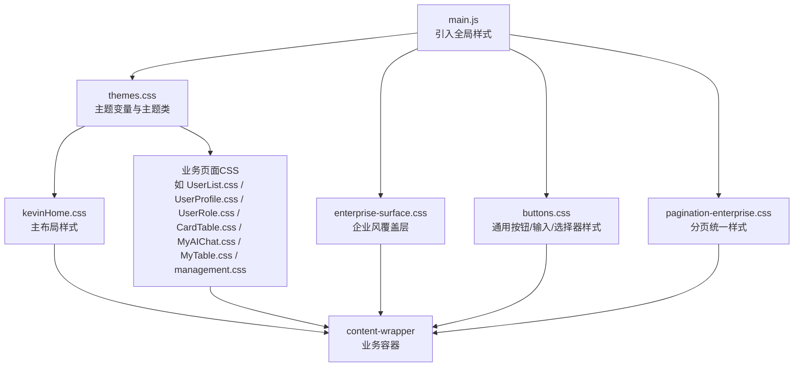
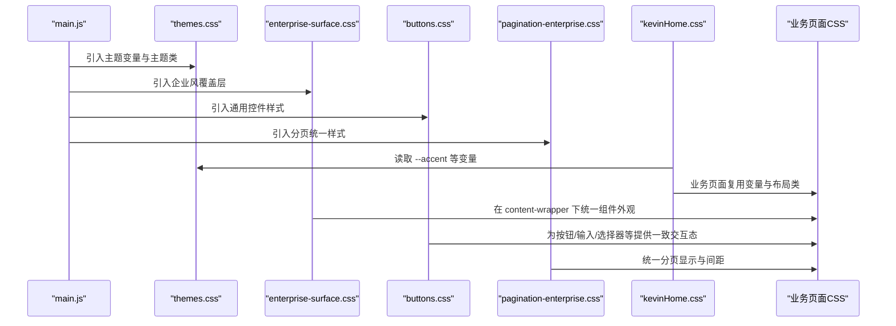
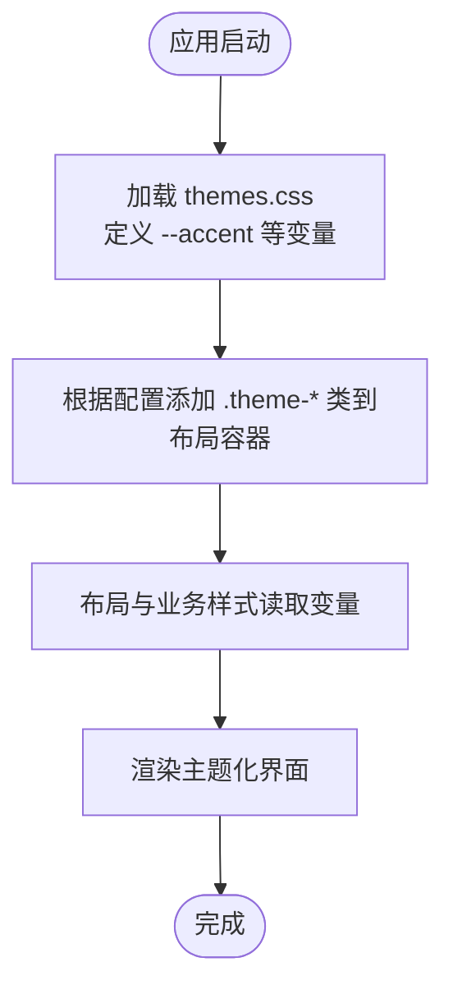
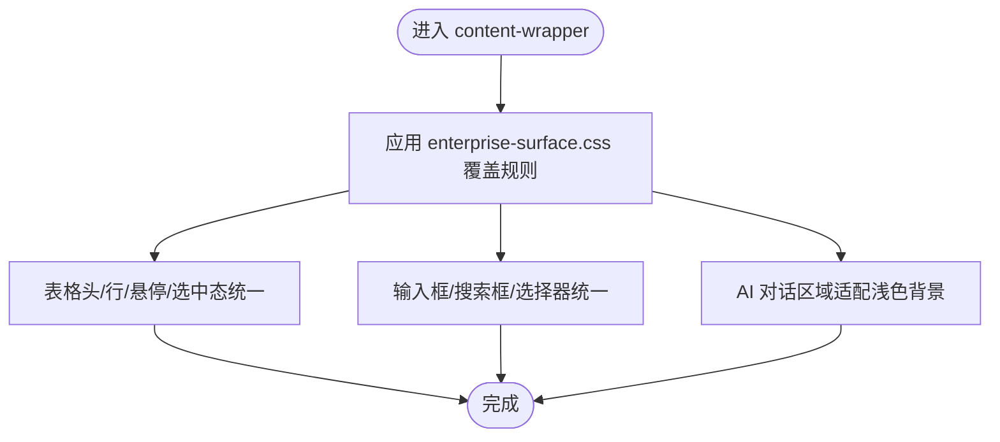
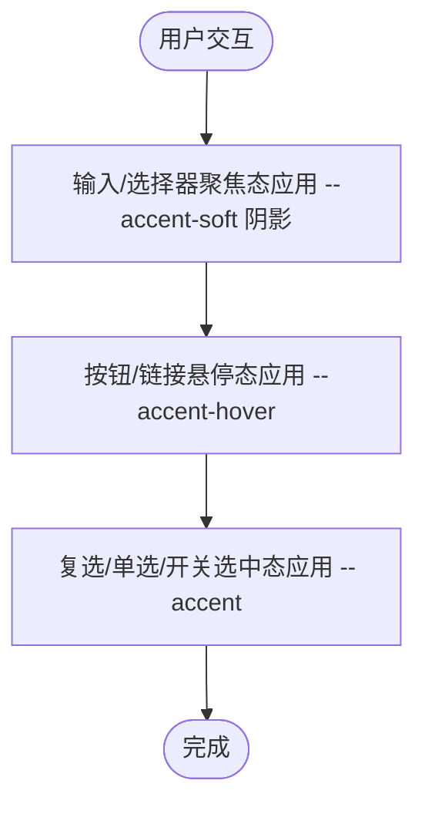
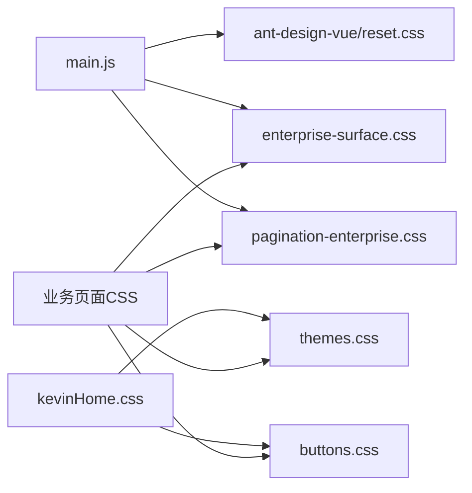

# CSS文件组织

<cite>
**本文引用的文件**
- [main.js](file://vue/kevin.web.vue/src/main.js)
- [App.vue](file://vue/kevin.web.vue/src/App.vue)
- [themes.css](file://vue/kevin.web.vue/src/css/themes.css)
- [enterprise-surface.css](file://vue/kevin.web.vue/src/css/enterprise-surface.css)
- [buttons.css](file://vue/kevin.web.vue/src/css/buttons.css)
- [pagination-enterprise.css](file://vue/kevin.web.vue/src/css/pagination-enterprise.css)
- [kevinHome.css](file://vue/kevin.web.vue/src/css/kevinHome.css)
- [kevinLogin.css](file://vue/kevin.web.vue/src/css/kevinLogin.css)
- [CardTable.css](file://vue/kevin.web.vue/src/css/CardTable.css)
- [MyAIChat.css](file://vue/kevin.web.vue/src/css/MyAIChat.css)
- [MyTable.css](file://vue/kevin.web.vue/src/css/MyTable.css)
- [UserList.css](file://vue/kevin.web.vue/src/css/UserList.css)
- [UserProfile.css](file://vue/kevin.web.vue/src/css/UserProfile.css)
- [UserRole.css](file://vue/kevin.web.vue/src/css/UserRole.css)
- [management.css](file://vue/kevin.web.vue/src/css/management.css)
</cite>

## 目录
1. [简介](#简介)
2. [项目结构](#项目结构)
3. [核心组件](#核心组件)
4. [架构总览](#架构总览)
5. [详细组件分析](#详细组件分析)
6. [依赖关系分析](#依赖关系分析)
7. [性能考虑](#性能考虑)
8. [故障排查指南](#故障排查指南)
9. [结论](#结论)
10. [附录](#附录)

## 简介
本文件面向 NetCoreKevin 前端（Vue）的样式工程，系统化说明 CSS 文件的目录结构、命名规范与模块化组织方式；解释全局样式、组件样式与业务样式的分离策略；梳理样式加载顺序与依赖管理；给出避免冲突与重复定义的方法；并提供重构与维护的最佳实践。文档同时提供可视化图示，帮助读者快速理解整体结构与数据流。

## 项目结构
- 样式根目录：vue/kevin.web.vue/src/css
- 入口挂载：main.js 中引入全局样式与第三方库样式
- 主题变量：themes.css 集中定义多套主题变量与预览样式
- 全局覆盖：enterprise-surface.css、buttons.css、pagination-enterprise.css 统一企业风与通用组件外观
- 布局样式：kevinHome.css 负责主布局（侧边栏、头部、内容区、页脚、标签页导航等）
- 页面样式：kevinLogin.css、CardTable.css、MyAIChat.css、MyTable.css、UserList.css、UserProfile.css、UserRole.css、management.css 分别对应登录、卡片列表、聊天、表格、用户管理等页面或功能模块

**图表来源**
- [main.js:5-7](file://vue/kevin.web.vue/src/main.js#L5-L7)
- [themes.css:1-378](file://vue/kevin.web.vue/src/css/themes.css#L1-L378)
- [enterprise-surface.css:1-327](file://vue/kevin.web.vue/src/css/enterprise-surface.css#L1-L327)
- [buttons.css:1-99](file://vue/kevin.web.vue/src/css/buttons.css#L1-L99)
- [pagination-enterprise.css:1-135](file://vue/kevin.web.vue/src/css/pagination-enterprise.css#L1-L135)
- [kevinHome.css:1-387](file://vue/kevin.web.vue/src/css/kevinHome.css#L1-L387)

**章节来源**
- [main.js:5-7](file://vue/kevin.web.vue/src/main.js#L5-L7)
- [themes.css:1-378](file://vue/kevin.web.vue/src/css/themes.css#L1-L378)
- [enterprise-surface.css:1-327](file://vue/kevin.web.vue/src/css/enterprise-surface.css#L1-L327)
- [buttons.css:1-99](file://vue/kevin.web.vue/src/css/buttons.css#L1-L99)
- [pagination-enterprise.css:1-135](file://vue/kevin.web.vue/src/css/pagination-enterprise.css#L1-L135)
- [kevinHome.css:1-387](file://vue/kevin.web.vue/src/css/kevinHome.css#L1-L387)

## 核心组件
- 主题系统（themes.css）
  - 通过 CSS 自定义属性（--accent、--page-bg、--sider-bg 等）定义多套主题，使用 .theme-* 类切换
  - 提供主题预览色块与开关按钮样式，便于运行时切换
- 企业风覆盖层（enterprise-surface.css）
  - 在浅色 content-wrapper 下统一表格、卡片、搜索框、分页等组件外观，确保一致性
- 通用控件样式（buttons.css）
  - 统一按钮、输入框、选择器、复选框、单选框、日期选择器、开关等交互态颜色与聚焦效果
- 分页统一样式（pagination-enterprise.css）
  - 对独立分页容器与表格底部分页进行统一配色与间距处理
- 主布局（kevinHome.css）
  - 定义 layout-container、sider、header、content-wrapper、footer、tab-navigation 等布局元素
  - 与 themes.css 配合，实现侧栏、头部、内容区的主题化
- 页面级样式
  - kevinLogin.css：登录页科技风格背景与表单样式
  - CardTable.css：AI 管理卡片列表（浅色企业风）
  - MyAIChat.css：AI 对话界面（深色科技风），并在 enterprise-surface.css 中提供浅色覆盖适配
  - MyTable.css：深色透明表格样式
  - UserList.css / UserProfile.css / UserRole.css：用户相关页面的玻璃风与深色主题样式
  - management.css：通用管理卡片与工具栏布局

**章节来源**
- [themes.css:1-378](file://vue/kevin.web.vue/src/css/themes.css#L1-L378)
- [enterprise-surface.css:1-327](file://vue/kevin.web.vue/src/css/enterprise-surface.css#L1-L327)
- [buttons.css:1-99](file://vue/kevin.web.vue/src/css/buttons.css#L1-L99)
- [pagination-enterprise.css:1-135](file://vue/kevin.web.vue/src/css/pagination-enterprise.css#L1-L135)
- [kevinHome.css:1-387](file://vue/kevin.web.vue/src/css/kevinHome.css#L1-L387)
- [kevinLogin.css:1-255](file://vue/kevin.web.vue/src/css/kevinLogin.css#L1-L255)
- [CardTable.css:1-353](file://vue/kevin.web.vue/src/css/CardTable.css#L1-L353)
- [MyAIChat.css:1-800](file://vue/kevin.web.vue/src/css/MyAIChat.css#L1-L800)
- [MyTable.css:1-76](file://vue/kevin.web.vue/src/css/MyTable.css#L1-L76)
- [UserList.css:1-266](file://vue/kevin.web.vue/src/css/UserList.css#L1-L266)
- [UserProfile.css:1-126](file://vue/kevin.web.vue/src/css/UserProfile.css#L1-L126)
- [UserRole.css:1-318](file://vue/kevin.web.vue/src/css/UserRole.css#L1-L318)
- [management.css:1-177](file://vue/kevin.web.vue/src/css/management.css#L1-L177)

## 架构总览
样式加载顺序由 main.js 决定，遵循“基础样式 → 主题变量 → 覆盖层 → 布局 → 页面样式”的原则，确保主题变量优先可用，后续样式可基于变量进行覆盖与定制。

**图表来源**
- [main.js:5-7](file://vue/kevin.web.vue/src/main.js#L5-L7)
- [themes.css:1-378](file://vue/kevin.web.vue/src/css/themes.css#L1-L378)
- [enterprise-surface.css:1-327](file://vue/kevin.web.vue/src/css/enterprise-surface.css#L1-L327)
- [buttons.css:1-99](file://vue/kevin.web.vue/src/css/buttons.css#L1-L99)
- [pagination-enterprise.css:1-135](file://vue/kevin.web.vue/src/css/pagination-enterprise.css#L1-L135)
- [kevinHome.css:1-387](file://vue/kevin.web.vue/src/css/kevinHome.css#L1-L387)

**章节来源**
- [main.js:5-7](file://vue/kevin.web.vue/src/main.js#L5-L7)
- [App.vue:11-22](file://vue/kevin.web.vue/src/App.vue#L11-L22)

## 详细组件分析

### 主题系统（themes.css）
- 设计要点
  - 使用 CSS 变量集中管理主题色、背景、边框、文本颜色等，便于一键切换
  - 通过 .theme-* 类名组合，实现不同侧栏与强调色的主题
  - 提供主题预览与切换按钮样式，支持运行时切换
- 复杂度与影响
  - 变量驱动降低硬编码，提升可维护性
  - 主题类作用于布局容器，影响范围可控
- 优化建议
  - 新增主题时仅扩展变量与类，避免改动业务样式
  - 将通用交互态（hover、focus）统一放在 buttons.css，主题只关注色彩

**图表来源**
- [themes.css:1-378](file://vue/kevin.web.vue/src/css/themes.css#L1-L378)
- [kevinHome.css:1-387](file://vue/kevin.web.vue/src/css/kevinHome.css#L1-L387)

**章节来源**
- [themes.css:1-378](file://vue/kevin.web.vue/src/css/themes.css#L1-L378)
- [kevinHome.css:1-387](file://vue/kevin.web.vue/src/css/kevinHome.css#L1-L387)

### 企业风覆盖层（enterprise-surface.css）
- 设计要点
  - 针对 content-wrapper 下的历史深色玻璃风组件进行统一覆盖，转为浅色企业风
  - 统一表格、卡片、搜索框、分页、AI 对话区域等在浅色内容区的表现
- 冲突处理
  - 大量使用 !important 强制覆盖，确保在企业风下的一致性
  - 通过作用域限定（.content-wrapper）减少全局污染
- 优化建议
  - 将高频覆盖规则抽离为公共类，减少重复
  - 逐步替换 !important 为更精确的选择器，提高可维护性

**图表来源**
- [enterprise-surface.css:1-327](file://vue/kevin.web.vue/src/css/enterprise-surface.css#L1-L327)

**章节来源**
- [enterprise-surface.css:1-327](file://vue/kevin.web.vue/src/css/enterprise-surface.css#L1-L327)

### 通用控件样式（buttons.css）
- 设计要点
  - 统一按钮、输入框、选择器、复选框、单选框、日期选择器、开关等交互态颜色与聚焦效果
  - 使用主题变量 --accent、--accent-hover、--accent-soft 控制强调色与柔和背景
- 冲突处理
  - 通过 .layout-container 限定作用域，避免全局污染
  - 使用 !important 覆盖第三方组件默认样式，保证一致性
- 优化建议
  - 将交互态抽象为 mixin 或预处理器变量（若迁移至 SCSS）
  - 逐步收敛 !important 的使用场景

**图表来源**
- [buttons.css:1-99](file://vue/kevin.web.vue/src/css/buttons.css#L1-L99)

**章节来源**
- [buttons.css:1-99](file://vue/kevin.web.vue/src/css/buttons.css#L1-L99)

### 分页统一样式（pagination-enterprise.css）
- 设计要点
  - 对独立分页容器与表格底部分页进行统一配色、圆角、禁用态与间距处理
  - 与 enterprise-surface.css 协同，确保分页在不同上下文中的视觉一致性
- 优化建议
  - 将分页尺寸与间距提取为变量，便于主题化调整

**章节来源**
- [pagination-enterprise.css:1-135](file://vue/kevin.web.vue/src/css/pagination-enterprise.css#L1-L135)

### 主布局（kevinHome.css）
- 设计要点
  - 定义 layout-container、sider、header、content-wrapper、footer、tab-navigation 等布局元素
  - 与 themes.css 配合，实现侧栏、头部、内容区的主题化
  - 提供响应式适配（移动端折叠与间距调整）
- 优化建议
  - 将布局尺寸与间距抽象为变量，便于主题化与响应式调整

**章节来源**
- [kevinHome.css:1-387](file://vue/kevin.web.vue/src/css/kevinHome.css#L1-L387)

### 页面级样式
- 登录页（kevinLogin.css）
  - 科技风格背景与表单样式，强调品牌色与渐变
- AI 管理卡片（CardTable.css）
  - 浅色企业风卡片列表，统一卡片头、信息展示与进度条样式
- AI 对话（MyAIChat.css）
  - 深色科技风对话界面，包含粒子背景、消息气泡、输入区等
  - 在 enterprise-surface.css 中提供浅色覆盖，确保在浅色内容区可见
- 表格（MyTable.css）
  - 深色透明表格样式，强调表头与行高亮
- 用户管理（UserList.css / UserProfile.css / UserRole.css）
  - 玻璃风与深色主题，统一卡片、表格、模态框、表单等样式
- 通用管理（management.css）
  - 管理卡片与工具栏布局，提供响应式适配

**章节来源**
- [kevinLogin.css:1-255](file://vue/kevin.web.vue/src/css/kevinLogin.css#L1-L255)
- [CardTable.css:1-353](file://vue/kevin.web.vue/src/css/CardTable.css#L1-L353)
- [MyAIChat.css:1-800](file://vue/kevin.web.vue/src/css/MyAIChat.css#L1-L800)
- [MyTable.css:1-76](file://vue/kevin.web.vue/src/css/MyTable.css#L1-L76)
- [UserList.css:1-266](file://vue/kevin.web.vue/src/css/UserList.css#L1-L266)
- [UserProfile.css:1-126](file://vue/kevin.web.vue/src/css/UserProfile.css#L1-L126)
- [UserRole.css:1-318](file://vue/kevin.web.vue/src/css/UserRole.css#L1-L318)
- [management.css:1-177](file://vue/kevin.web.vue/src/css/management.css#L1-L177)

## 依赖关系分析
- 加载顺序
  - main.js 按顺序引入 ant-design-vue 重置样式、enterprise-surface.css、pagination-enterprise.css
  - App.vue 通过 a-config-provider 注入 Ant Design 主题 token，并读取 CSS 变量 --accent 同步主题色
  - kevinHome.css 通过 @import 引入 themes.css 与 buttons.css，形成布局与主题的强耦合
  - 业务页面样式通过各自文件引入或按需加载，复用主题变量与布局类
- 依赖图

**图表来源**
- [main.js:5-7](file://vue/kevin.web.vue/src/main.js#L5-L7)
- [App.vue:11-22](file://vue/kevin.web.vue/src/App.vue#L11-L22)
- [kevinHome.css:1-3](file://vue/kevin.web.vue/src/css/kevinHome.css#L1-L3)

**章节来源**
- [main.js:5-7](file://vue/kevin.web.vue/src/main.js#L5-L7)
- [App.vue:11-22](file://vue/kevin.web.vue/src/App.vue#L11-L22)
- [kevinHome.css:1-3](file://vue/kevin.web.vue/src/css/kevinHome.css#L1-L3)

## 性能考虑
- 样式体积与加载
  - 将全局样式集中在 main.js 引入，避免重复加载
  - 使用主题变量减少重复颜色定义，降低样式体积
- 选择器性能
  - 尽量使用具体类名与作用域限定（如 .content-wrapper、.layout-container），避免过度嵌套与全局选择器
  - 谨慎使用 !important，仅在必要时覆盖第三方组件样式
- 渲染性能
  - 减少复杂动画与滤镜（如 backdrop-filter）在大面积区域的使用
  - 分页与表格样式保持简洁，避免过多重绘

[本节为通用指导，不直接分析具体文件]

## 故障排查指南
- 主题色未生效
  - 检查 App.vue 是否正确读取 --accent 并同步到 Ant Design 主题 token
  - 确认布局容器是否添加了正确的 .theme-* 类
- 组件样式被覆盖
  - 检查 enterprise-surface.css 的作用域是否为 .content-wrapper
  - 核对 main.js 引入顺序，确保主题变量先于覆盖层加载
- 分页样式不一致
  - 确认 pagination-enterprise.css 已引入，且与 enterprise-surface.css 协同工作
- 登录页样式异常
  - 检查 kevinLogin.css 是否与全局样式冲突，必要时增加作用域限定

**章节来源**
- [App.vue:11-22](file://vue/kevin.web.vue/src/App.vue#L11-L22)
- [enterprise-surface.css:1-327](file://vue/kevin.web.vue/src/css/enterprise-surface.css#L1-L327)
- [pagination-enterprise.css:1-135](file://vue/kevin.web.vue/src/css/pagination-enterprise.css#L1-L135)
- [kevinLogin.css:1-255](file://vue/kevin.web.vue/src/css/kevinLogin.css#L1-L255)

## 结论
本项目采用“主题变量 + 覆盖层 + 布局 + 页面样式”的分层组织方式，通过 main.js 控制加载顺序，确保主题变量优先可用；enterprise-surface.css 统一企业风外观；buttons.css 与 pagination-enterprise.css 提供一致的交互体验；kevinHome.css 构建主布局并与主题联动；各页面样式复用变量与布局类，降低重复与冲突。该结构具备良好的可扩展性与可维护性，适合持续演进。

[本节为总结，不直接分析具体文件]

## 附录
- 命名规范建议
  - 主题变量以 -- 前缀命名（如 --accent、--page-bg）
  - 主题类以 .theme-* 命名（如 .theme-enterprise、.theme-simple-white）
  - 布局类以语义化命名（如 .layout-container、.content-wrapper）
  - 组件类以功能命名（如 .search-input、.action-button）
- 最佳实践
  - 将全局样式与主题变量集中管理，业务样式仅引用变量与类
  - 使用作用域限定避免全局污染，减少 !important 使用
  - 新增主题时仅扩展变量与类，不改动业务样式
  - 定期清理冗余样式，合并重复规则

[本节为通用指导，不直接分析具体文件]