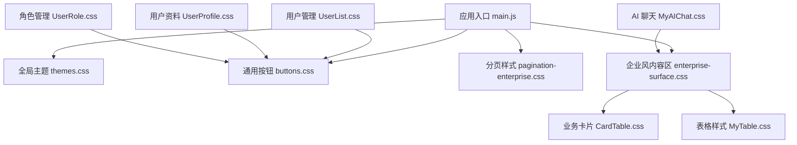
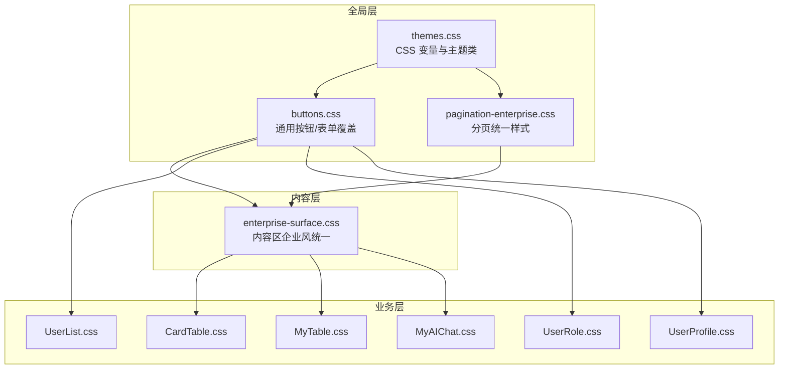
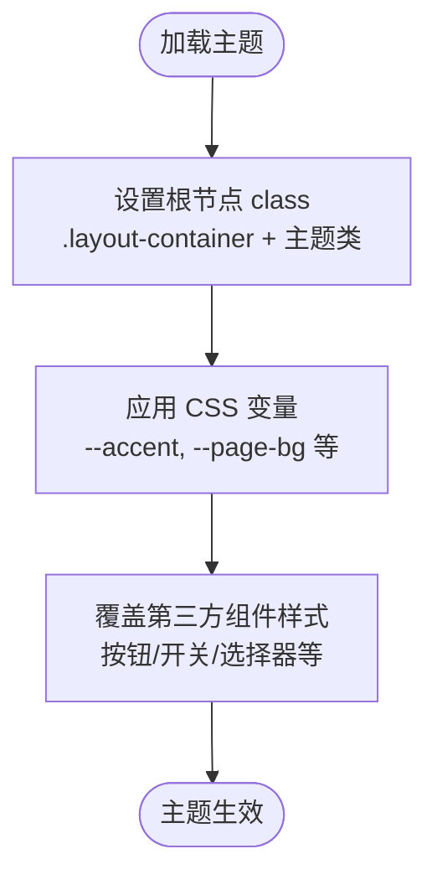
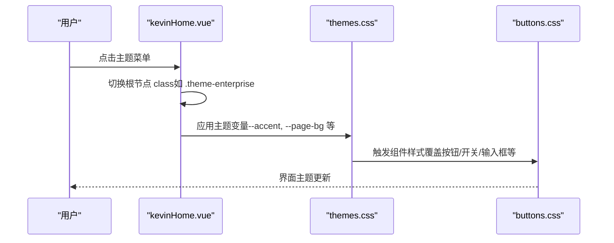
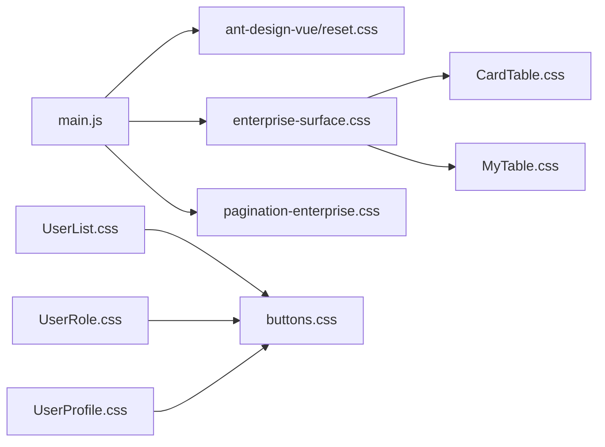

# CSS架构

<cite>
**本文引用的文件**
- [main.js](file://vue/kevin.web.vue/src/main.js)
- [themes.css](file://vue/kevin.web.vue/src/css/themes.css)
- [buttons.css](file://vue/kevin.web.vue/src/css/buttons.css)
- [enterprise-surface.css](file://vue/kevin.web.vue/src/css/enterprise-surface.css)
- [pagination-enterprise.css](file://vue/kevin.web.vue/src/css/pagination-enterprise.css)
- [CardTable.css](file://vue/kevin.web.vue/src/css/CardTable.css)
- [MyAIChat.css](file://vue/kevin.web.vue/src/css/MyAIChat.css)
- [MyTable.css](file://vue/kevin.web.vue/src/css/MyTable.css)
- [UserList.css](file://vue/kevin.web.vue/src/css/UserList.css)
- [UserProfile.css](file://vue/kevin.web.vue/src/css/UserProfile.css)
- [UserRole.css](file://vue/kevin.web.vue/src/css/UserRole.css)
- [kevinHome.vue](file://vue/kevin.web.vue/src/pages/kevinHome.vue)
- [package.json](file://vue/kevin.web.vue/package.json)
- [vue.config.js](file://vue/kevin.web.vue/vue.config.js)
</cite>

## 目录
1. [简介](#简介)
2. [项目结构](#项目结构)
3. [核心组件](#核心组件)
4. [架构总览](#架构总览)
5. [详细组件分析](#详细组件分析)
6. [依赖关系分析](#依赖关系分析)
7. [性能考虑](#性能考虑)
8. [故障排查指南](#故障排查指南)
9. [结论](#结论)
10. [附录](#附录)

## 简介
本文件面向 NetCoreKevin 前端（Vue 3 + Ant Design Vue）的 CSS 架构，系统性说明样式组织、命名约定、优先级与继承策略、主题系统、组件级样式治理、构建与优化配置，以及团队协作规范。目标是帮助团队在大型项目中保持样式一致、可维护、可扩展且高性能。

## 项目结构
前端样式集中于 vue/kevin.web.vue/src/css 目录，按“全局主题/通用组件/业务页面”分层组织：
- 全局主题与变量：themes.css
- 通用组件样式：buttons.css、pagination-enterprise.css
- 企业风内容区统一风格：enterprise-surface.css
- 业务模块样式：CardTable.css、MyAIChat.css、MyTable.css、UserList.css、UserProfile.css、UserRole.css
- 入口引入：main.js 中统一引入全局样式，确保主题与基础组件样式生效

图表来源
- [main.js:1-20](file://vue/kevin.web.vue/src/main.js#L1-L20)
- [themes.css:1-378](file://vue/kevin.web.vue/src/css/themes.css#L1-L378)
- [buttons.css:1-99](file://vue/kevin.web.vue/src/css/buttons.css#L1-L99)
- [pagination-enterprise.css:1-135](file://vue/kevin.web.vue/src/css/pagination-enterprise.css#L1-L135)
- [enterprise-surface.css:1-327](file://vue/kevin.web.vue/src/css/enterprise-surface.css#L1-L327)
- [CardTable.css:1-353](file://vue/kevin.web.vue/src/css/CardTable.css#L1-L353)
- [MyTable.css:1-76](file://vue/kevin.web.vue/src/css/MyTable.css#L1-L76)
- [UserList.css:1-266](file://vue/kevin.web.vue/src/css/UserList.css#L1-L266)
- [UserProfile.css:1-126](file://vue/kevin.web.vue/src/css/UserProfile.css#L1-L126)
- [UserRole.css:1-318](file://vue/kevin.web.vue/src/css/UserRole.css#L1-L318)
- [MyAIChat.css:1-800](file://vue/kevin.web.vue/src/css/MyAIChat.css#L1-L800)

章节来源
- [main.js:1-20](file://vue/kevin.web.vue/src/main.js#L1-L20)
- [package.json:1-68](file://vue/kevin.web.vue/package.json#L1-L68)
- [vue.config.js:1-21](file://vue/kevin.web.vue/vue.config.js#L1-L21)

## 核心组件
- 主题系统（themes.css）
  - 通过 CSS 自定义属性（变量）定义强调色、背景、边框、文本等，配合 .layout-container 作为作用域根节点，实现多主题切换。
  - 提供多种预设主题类名（如 theme-enterprise、theme-simple-white 等），通过切换根节点 class 快速换肤。
- 通用组件样式（buttons.css、pagination-enterprise.css）
  - 统一覆盖 Ant Design 组件默认样式，使用 :root 或 .layout-container 限定作用域，避免污染全局。
  - 分页样式独立文件，便于复用和按需引入。
- 企业风内容区（enterprise-surface.css）
  - 针对 content-wrapper 下的卡片、表格、搜索框、对话区域等进行浅色企业风统一，解决历史深色玻璃风与浅色主内容区的冲突。
- 业务模块样式
  - CardTable.css：管理卡片列表的企业风适配。
  - MyTable.css：深色透明背景的表格样式。
  - UserList/UserProfile/UserRole.css：用户相关页面的深色玻璃风样式，并复用 buttons.css。
  - MyAIChat.css：AI 聊天界面的科技风样式，包含粒子动画、消息气泡、输入区等。

章节来源
- [themes.css:1-378](file://vue/kevin.web.vue/src/css/themes.css#L1-L378)
- [buttons.css:1-99](file://vue/kevin.web.vue/src/css/buttons.css#L1-L99)
- [pagination-enterprise.css:1-135](file://vue/kevin.web.vue/src/css/pagination-enterprise.css#L1-L135)
- [enterprise-surface.css:1-327](file://vue/kevin.web.vue/src/css/enterprise-surface.css#L1-L327)
- [CardTable.css:1-353](file://vue/kevin.web.vue/src/css/CardTable.css#L1-L353)
- [MyTable.css:1-76](file://vue/kevin.web.vue/src/css/MyTable.css#L1-L76)
- [UserList.css:1-266](file://vue/kevin.web.vue/src/css/UserList.css#L1-L266)
- [UserProfile.css:1-126](file://vue/kevin.web.vue/src/css/UserProfile.css#L1-L126)
- [UserRole.css:1-318](file://vue/kevin.web.vue/src/css/UserRole.css#L1-L318)
- [MyAIChat.css:1-800](file://vue/kevin.web.vue/src/css/MyAIChat.css#L1-L800)

## 架构总览
整体采用“全局主题 + 通用组件 + 业务模块”的分层架构，结合 CSS 变量实现主题化；通过作用域类名（如 .layout-container、.content-wrapper）控制样式影响范围，降低耦合与冲突风险。

图表来源
- [themes.css:1-378](file://vue/kevin.web.vue/src/css/themes.css#L1-L378)
- [buttons.css:1-99](file://vue/kevin.web.vue/src/css/buttons.css#L1-L99)
- [pagination-enterprise.css:1-135](file://vue/kevin.web.vue/src/css/pagination-enterprise.css#L1-L135)
- [enterprise-surface.css:1-327](file://vue/kevin.web.vue/src/css/enterprise-surface.css#L1-L327)
- [CardTable.css:1-353](file://vue/kevin.web.vue/src/css/CardTable.css#L1-L353)
- [MyTable.css:1-76](file://vue/kevin.web.vue/src/css/MyTable.css#L1-L76)
- [UserList.css:1-266](file://vue/kevin.web.vue/src/css/UserList.css#L1-L266)
- [UserRole.css:1-318](file://vue/kevin.web.vue/src/css/UserRole.css#L1-L318)
- [UserProfile.css:1-126](file://vue/kevin.web.vue/src/css/UserProfile.css#L1-L126)
- [MyAIChat.css:1-800](file://vue/kevin.web.vue/src/css/MyAIChat.css#L1-L800)

## 详细组件分析

### 主题系统与变量（themes.css）
- 设计要点
  - 以 .layout-container 为根作用域，集中声明 CSS 变量（如 --accent、--accent-hover、--page-bg、--sider-bg 等）。
  - 通过主题类（如 .theme-enterprise、.theme-simple-white）覆盖变量值，实现一键换肤。
  - 对第三方组件（Ant Design）进行局部覆盖，使用 :deep() 选择器穿透到子组件内部样式。
- 优先级与继承
  - 主题变量优先于硬编码颜色，保证一致性。
  - 使用 !important 仅在必要时覆盖第三方组件默认样式，避免滥用。
- 实践建议
  - 新增主题时仅修改变量，不改动业务样式。
  - 将常用颜色抽象为变量，减少重复值。

图表来源
- [themes.css:1-378](file://vue/kevin.web.vue/src/css/themes.css#L1-L378)
- [buttons.css:1-99](file://vue/kevin.web.vue/src/css/buttons.css#L1-L99)

章节来源
- [themes.css:1-378](file://vue/kevin.web.vue/src/css/themes.css#L1-L378)
- [buttons.css:1-99](file://vue/kevin.web.vue/src/css/buttons.css#L1-L99)

### 通用组件样式（buttons.css、pagination-enterprise.css）
- 设计要点
  - 统一 Ant Design 按钮、输入框、选择器、日期选择器、开关等组件的聚焦态与主题色。
  - 分页样式独立文件，支持独立容器与表格底部分页的统一外观。
- 作用域控制
  - 使用 .layout-container 限定作用域，避免全局污染。
  - 分页样式同时兼容 .my-table 与 ant-table-wrapper 场景。
- 最佳实践
  - 尽量使用 CSS 变量驱动颜色变化，减少硬编码。
  - 对复杂组件使用 :deep() 精准定位，避免过度覆盖。

章节来源
- [buttons.css:1-99](file://vue/kevin.web.vue/src/css/buttons.css#L1-L99)
- [pagination-enterprise.css:1-135](file://vue/kevin.web.vue/src/css/pagination-enterprise.css#L1-L135)

### 企业风内容区（enterprise-surface.css）
- 设计要点
  - 针对 content-wrapper 下的卡片、表格、搜索框、对话区域进行浅色企业风统一，解决历史深色玻璃风与浅色主内容区的冲突。
  - 对 Ant Design 表格头、行高亮、选中态、分页、输入框等进行细致覆盖。
- 作用域控制
  - 所有规则以 .content-wrapper 为前缀，确保不影响其他区域。
- 兼容性
  - 对 AI 聊天容器进行适配，使其在浅色内容区内可读性良好。

章节来源
- [enterprise-surface.css:1-327](file://vue/kevin.web.vue/src/css/enterprise-surface.css#L1-L327)

### 业务模块样式
- CardTable.css
  - 管理卡片列表的企业风适配，统一卡片头、标题、信息项布局与悬停效果。
  - 搜索框与进度条在浅色卡片上的可读性与交互反馈。
- MyTable.css
  - 深色透明背景表格，表头与行高亮使用半透明紫色系，提升对比度。
- UserList.css / UserRole.css / UserProfile.css
  - 深色玻璃风页面，统一卡片、表格、模态框、表单元素样式，并复用 buttons.css。
- MyAIChat.css
  - 科技风聊天界面，包含粒子背景、消息气泡、输入区、折叠面板、状态指示等。

章节来源
- [CardTable.css:1-353](file://vue/kevin.web.vue/src/css/CardTable.css#L1-L353)
- [MyTable.css:1-76](file://vue/kevin.web.vue/src/css/MyTable.css#L1-L76)
- [UserList.css:1-266](file://vue/kevin.web.vue/src/css/UserList.css#L1-L266)
- [UserRole.css:1-318](file://vue/kevin.web.vue/src/css/UserRole.css#L1-L318)
- [UserProfile.css:1-126](file://vue/kevin.web.vue/src/css/UserProfile.css#L1-L126)
- [MyAIChat.css:1-800](file://vue/kevin.web.vue/src/css/MyAIChat.css#L1-L800)

### 主题切换流程（序列图）

图表来源
- [kevinHome.vue:1-200](file://vue/kevin.web.vue/src/pages/kevinHome.vue#L1-L200)
- [themes.css:1-378](file://vue/kevin.web.vue/src/css/themes.css#L1-L378)
- [buttons.css:1-99](file://vue/kevin.web.vue/src/css/buttons.css#L1-L99)

章节来源
- [kevinHome.vue:1-200](file://vue/kevin.web.vue/src/pages/kevinHome.vue#L1-L200)
- [themes.css:1-378](file://vue/kevin.web.vue/src/css/themes.css#L1-L378)
- [buttons.css:1-99](file://vue/kevin.web.vue/src/css/buttons.css#L1-L99)

## 依赖关系分析
- 入口依赖
  - main.js 引入 Ant Design 样式与全局 CSS（企业风内容区、分页样式），确保主题与基础组件样式生效。
- 模块间依赖
  - 业务样式文件通过 @import 引用 buttons.css，复用通用按钮样式。
  - 企业风内容区作为业务样式的共同上下文，提供统一的浅色背景与组件覆盖。
- 构建配置
  - package.json 使用 Vue CLI 服务与构建脚本，依赖 ant-design-vue。
  - vue.config.js 配置开发代理与客户端覆盖选项，未启用 PostCSS 插件链。

图表来源
- [main.js:1-20](file://vue/kevin.web.vue/src/main.js#L1-L20)
- [enterprise-surface.css:1-327](file://vue/kevin.web.vue/src/css/enterprise-surface.css#L1-L327)
- [pagination-enterprise.css:1-135](file://vue/kevin.web.vue/src/css/pagination-enterprise.css#L1-L135)
- [CardTable.css:1-353](file://vue/kevin.web.vue/src/css/CardTable.css#L1-L353)
- [MyTable.css:1-76](file://vue/kevin.web.vue/src/css/MyTable.css#L1-L76)
- [UserList.css:1-266](file://vue/kevin.web.vue/src/css/UserList.css#L1-L266)
- [UserRole.css:1-318](file://vue/kevin.web.vue/src/css/UserRole.css#L1-L318)
- [UserProfile.css:1-126](file://vue/kevin.web.vue/src/css/UserProfile.css#L1-L126)

章节来源
- [main.js:1-20](file://vue/kevin.web.vue/src/main.js#L1-L20)
- [package.json:1-68](file://vue/kevin.web.vue/package.json#L1-L68)
- [vue.config.js:1-21](file://vue/kevin.web.vue/vue.config.js#L1-L21)

## 性能考虑
- 代码组织与体积
  - 将通用样式抽离为独立文件（buttons.css、pagination-enterprise.css），减少重复与冗余。
  - 使用 CSS 变量替代硬编码颜色，便于压缩与缓存命中。
- 构建与压缩
  - 生产构建由 Vue CLI 自动处理，建议使用最小化 CSS 输出（默认开启）。
  - 可通过 postcss 插件链（如 autoprefixer、cssnano）进一步优化，当前未在 vue.config.js 中配置。
- 缓存策略
  - 静态资源文件名哈希化（Vue CLI 默认行为），利于浏览器长期缓存。
  - 主题切换基于 class 切换，无需重新加载样式，提升交互性能。
- 加载优化
  - 仅引入必要的全局样式，业务样式按需引入或懒加载。
  - 避免过深的选择器与大量 !important，减少渲染开销。

[本节为通用指导，不直接分析具体文件]

## 故障排查指南
- 主题变量未生效
  - 检查根节点是否设置了正确的主题类名（如 .theme-enterprise）。
  - 确认 themes.css 中的变量定义与作用域（.layout-container）是否正确。
- 组件样式被覆盖
  - 检查是否存在更具体的选择器或 !important 覆盖。
  - 使用浏览器开发者工具查看最终计算样式，定位冲突来源。
- 企业风内容区显示异常
  - 确认 content-wrapper 包裹了需要统一风格的区域。
  - 检查 enterprise-surface.css 中的选择器是否匹配目标元素。
- 分页样式不一致
  - 确认分页容器使用了 .pagination-container 或表格内联分页。
  - 检查 pagination-enterprise.css 是否被正确引入。

章节来源
- [themes.css:1-378](file://vue/kevin.web.vue/src/css/themes.css#L1-L378)
- [enterprise-surface.css:1-327](file://vue/kevin.web.vue/src/css/enterprise-surface.css#L1-L327)
- [pagination-enterprise.css:1-135](file://vue/kevin.web.vue/src/css/pagination-enterprise.css#L1-L135)

## 结论
本项目采用“全局主题 + 通用组件 + 业务模块”的分层 CSS 架构，通过 CSS 变量与主题类实现灵活换肤，借助作用域类名与 :deep() 精准控制样式影响范围，有效避免冲突与覆盖问题。建议在后续迭代中继续强化变量体系、完善构建优化（PostCSS）、统一命名规范与协作流程，以提升可维护性与性能表现。

## 附录
- 命名约定与实践
  - 推荐使用 BEM 风格命名（块-元素-修饰符），例如 .card__header、.card__item--active，提高可读性与可维护性。
  - 业务模块样式文件按功能划分，避免单文件过大。
- 优先级与继承规则
  - 优先使用 CSS 变量与语义化类名，减少 !important。
  - 使用作用域类名（.layout-container、.content-wrapper）限制样式影响范围。
- 预处理器与后处理器
  - 当前未使用 Sass/Less，可直接使用原生 CSS。
  - 可在 vue.config.js 中集成 PostCSS（autoprefixer、cssnano）以实现自动补全与压缩优化。
- 团队协作最佳实践
  - 建立样式审查清单：变量使用、作用域控制、选择器复杂度、!important 使用频率。
  - 新增主题或组件样式时，同步更新文档与示例，确保一致性。

[本节为通用指导，不直接分析具体文件]