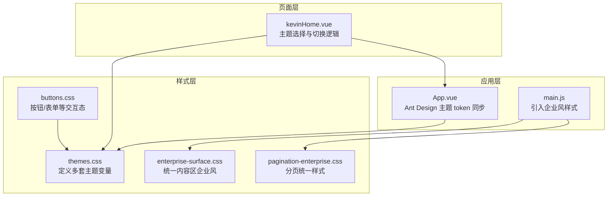
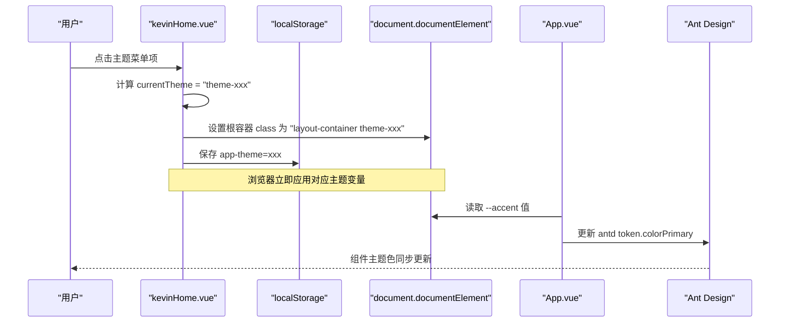
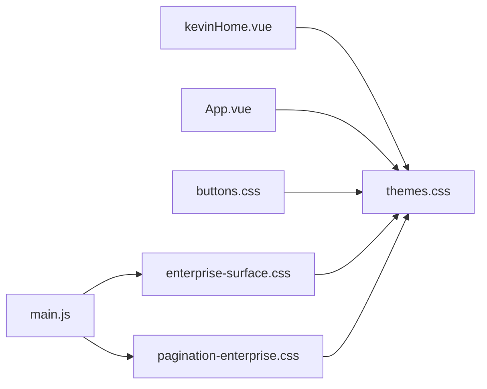

# 主题系统

<cite>
**本文引用的文件**
- [themes.css](file://vue/kevin.web.vue/src/css/themes.css)
- [enterprise-surface.css](file://vue/kevin.web.vue/src/css/enterprise-surface.css)
- [buttons.css](file://vue/kevin.web.vue/src/css/buttons.css)
- [pagination-enterprise.css](file://vue/kevin.web.vue/src/css/pagination-enterprise.css)
- [App.vue](file://vue/kevin.web.vue/src/App.vue)
- [main.js](file://vue/kevin.web.vue/src/main.js)
- [kevinHome.vue](file://vue/kevin.web.vue/src/pages/kevinHome.vue)
</cite>

## 目录
1. [简介](#简介)
2. [项目结构](#项目结构)
3. [核心组件](#核心组件)
4. [架构总览](#架构总览)
5. [详细组件分析](#详细组件分析)
6. [依赖关系分析](#依赖关系分析)
7. [性能考虑](#性能考虑)
8. [故障排查指南](#故障排查指南)
9. [结论](#结论)
10. [附录：主题配置最佳实践与扩展指南](#附录：主题配置最佳实践与扩展指南)

## 简介
本文件系统性地说明 NetCoreKevin 前端主题系统的实现，重点包括：
- CSS 变量（CSS Custom Properties）的设计令牌定义与管理
- 主题切换机制（多套企业级主题、浅色/深色侧栏组合）
- 企业级主题的定制与扩展方法
- 为不同业务模块创建独立主题风格的策略
- 主题配置的最佳实践与性能优化建议
- 主题切换的代码示例与使用场景

该主题系统基于 Vue + Ant Design Vue，通过 CSS 变量驱动全局视觉一致性，结合运行时类名切换与本地存储持久化，实现零刷新、可复用的主题体验。

## 项目结构
主题相关代码主要位于前端工程 vue/kevin.web.vue 的 src 目录下：
- CSS 层：集中定义设计令牌与主题样式
- 应用层：根组件注入 Ant Design 主题 token，并与 CSS 变量联动
- 页面层：提供主题选择器与切换逻辑，持久化用户偏好

图表来源
- [themes.css:1-378](file://vue/kevin.web.vue/src/css/themes.css#L1-L378)
- [enterprise-surface.css:1-327](file://vue/kevin.web.vue/src/css/enterprise-surface.css#L1-L327)
- [buttons.css:1-99](file://vue/kevin.web.vue/src/css/buttons.css#L1-L99)
- [pagination-enterprise.css:1-135](file://vue/kevin.web.vue/src/css/pagination-enterprise.css#L1-L135)
- [App.vue:1-53](file://vue/kevin.web.vue/src/App.vue#L1-L53)
- [main.js:1-20](file://vue/kevin.web.vue/src/main.js#L1-L20)
- [kevinHome.vue:1-681](file://vue/kevin.web.vue/src/pages/kevinHome.vue#L1-L681)

章节来源
- [main.js:1-20](file://vue/kevin.web.vue/src/main.js#L1-L20)
- [themes.css:1-378](file://vue/kevin.web.vue/src/css/themes.css#L1-L378)

## 核心组件
- 主题变量中心：themes.css 中通过 .layout-container 及多个主题类（如 theme-enterprise、theme-simple-white 等）声明 --page-bg、--sider-bg、--accent、--accent-hover、--accent-soft、--header-bg、--content-surface、--text-strong、--text-muted、--danger 等设计令牌，形成“一套变量、多套主题”的基础。
- 企业风内容适配：enterprise-surface.css 将历史深色玻璃风格的内容区域统一为企业浅色系卡片、表格、输入框等，确保在浅色主内容区的可读性与一致性。
- 交互态统一：buttons.css 将按钮、输入框、选择器、开关、日期选择器等交互元素的颜色与聚焦态绑定到 --accent 与 --accent-soft，保证主题切换时交互反馈一致。
- 分页统一：pagination-enterprise.css 对分页控件进行企业风统一，避免在不同主题下出现不一致的分页外观。
- Ant Design 主题联动：App.vue 通过 a-config-provider 注入 antd 主题 token，并读取 CSS 变量 --accent 作为 colorPrimary，使第三方组件与自定义主题保持一致。
- 主题切换入口：kevinHome.vue 提供主题下拉菜单，点击后更新当前布局容器的类名，并将主题键保存到 localStorage，实现跨会话记忆。

章节来源
- [themes.css:1-378](file://vue/kevin.web.vue/src/css/themes.css#L1-L378)
- [enterprise-surface.css:1-327](file://vue/kevin.web.vue/src/css/enterprise-surface.css#L1-L327)
- [buttons.css:1-99](file://vue/kevin.web.vue/src/css/buttons.css#L1-L99)
- [pagination-enterprise.css:1-135](file://vue/kevin.web.vue/src/css/pagination-enterprise.css#L1-L135)
- [App.vue:1-53](file://vue/kevin.web.vue/src/App.vue#L1-L53)
- [kevinHome.vue:596-641](file://vue/kevin.web.vue/src/pages/kevinHome.vue#L596-L641)

## 架构总览
主题系统采用“CSS 变量 + 运行时类名切换 + 本地存储”的轻量方案，不依赖构建期变量替换，具备高可维护性与可扩展性。

图表来源
- [kevinHome.vue:596-641](file://vue/kevin.web.vue/src/pages/kevinHome.vue#L596-L641)
- [App.vue:24-40](file://vue/kevin.web.vue/src/App.vue#L24-L40)

## 详细组件分析

### 主题变量与设计令牌（themes.css）
- 设计令牌覆盖范围：背景、侧栏、强调色、文本、边框、危险色等，均通过 CSS 变量暴露给全局。
- 多主题集合：内置企业蓝、墨黑、灰蓝、绿色、紫色、深海蓝、企业简约白等多套主题，每套主题通过独立的主题类覆盖关键变量。
- 兼容 Ant Design：通过 :deep() 选择器对菜单、徽标等内部组件进行主题适配，确保第三方组件与自定义主题一致。
- 预览与辅助样式：提供主题预览块与切换按钮样式，便于在设置界面展示主题效果。

章节来源
- [themes.css:1-378](file://vue/kevin.web.vue/src/css/themes.css#L1-L378)

### 企业风内容适配（enterprise-surface.css）
- 目标：将历史深色玻璃风的内容区域统一为企业浅色系，提升可读性与品牌一致性。
- 覆盖范围：卡片、表格、输入框、搜索框、AI 对话区、分页等，确保在浅色主内容区下的视觉统一。
- 与主题联动：部分元素颜色引用 --accent 与 --accent-hover，随主题切换自动变化。

章节来源
- [enterprise-surface.css:1-327](file://vue/kevin.web.vue/src/css/enterprise-surface.css#L1-L327)

### 交互态统一（buttons.css）
- 按钮、链接、开关、输入框、选择器、复选框、单选框、日期选择器等交互元素均绑定到 --accent 与 --accent-soft。
- 聚焦态与悬停态统一，确保主题切换时交互反馈一致且符合无障碍对比度要求。

章节来源
- [buttons.css:1-99](file://vue/kevin.web.vue/src/css/buttons.css#L1-L99)

### 分页统一（pagination-enterprise.css）
- 针对独立分页容器与表格底部分页进行统一样式处理，避免在不同主题下出现不一致的分页外观。
- 保持与整体企业风的圆角、边框、颜色一致。

章节来源
- [pagination-enterprise.css:1-135](file://vue/kevin.web.vue/src/css/pagination-enterprise.css#L1-L135)

### Ant Design 主题联动（App.vue）
- 通过 a-config-provider 注入 antd 主题 token，其中 colorPrimary 动态取自 CSS 变量 --accent。
- 挂载时多次读取 --accent，确保在主题切换后 antd 组件主题色及时更新。
- 监听 storage 事件，支持跨标签页的主题同步。

章节来源
- [App.vue:1-53](file://vue/kevin.web.vue/src/App.vue#L1-L53)

### 主题切换入口与持久化（kevinHome.vue）
- 提供主题下拉菜单，包含多套主题选项，点击后调用 switchTheme(theme)。
- switchTheme 将 currentTheme 设置为 "theme-" + theme，并写入 localStorage.app-theme。
- onMounted 时从 localStorage 恢复主题，若无效则回退到默认主题。
- 根据当前主题决定菜单模式（light/dark），以适配不同侧栏背景。

章节来源
- [kevinHome.vue:71-123](file://vue/kevin.web.vue/src/pages/kevinHome.vue#L71-L123)
- [kevinHome.vue:474-478](file://vue/kevin.web.vue/src/pages/kevinHome.vue#L474-L478)
- [kevinHome.vue:596-641](file://vue/kevin.web.vue/src/pages/kevinHome.vue#L596-L641)

## 依赖关系分析
- main.js 引入 enterprise-surface.css 与 pagination-enterprise.css，确保企业风样式全局生效。
- App.vue 读取 CSS 变量 --accent 并映射到 antd 主题 token，实现第三方组件与自定义主题一致。
- kevinHome.vue 负责主题切换逻辑，影响根容器类名，从而触发 themes.css 中的主题变量覆盖。
- buttons.css 与 enterprise-surface.css 广泛引用 --accent 与 --accent-soft，确保交互与内容区在主题切换时一致。

图表来源
- [main.js:1-20](file://vue/kevin.web.vue/src/main.js#L1-L20)
- [App.vue:24-40](file://vue/kevin.web.vue/src/App.vue#L24-L40)
- [kevinHome.vue:596-641](file://vue/kevin.web.vue/src/pages/kevinHome.vue#L596-L641)
- [themes.css:1-378](file://vue/kevin.web.vue/src/css/themes.css#L1-L378)
- [enterprise-surface.css:1-327](file://vue/kevin.web.vue/src/css/enterprise-surface.css#L1-L327)
- [pagination-enterprise.css:1-135](file://vue/kevin.web.vue/src/css/pagination-enterprise.css#L1-L135)
- [buttons.css:1-99](file://vue/kevin.web.vue/src/css/buttons.css#L1-L99)

章节来源
- [main.js:1-20](file://vue/kevin.web.vue/src/main.js#L1-L20)
- [App.vue:24-40](file://vue/kevin.web.vue/src/App.vue#L24-L40)
- [kevinHome.vue:596-641](file://vue/kevin.web.vue/src/pages/kevinHome.vue#L596-L641)

## 性能考虑
- 使用 CSS 变量而非 JS 频繁操作 DOM 样式，减少重排与重绘。
- 主题切换仅修改根容器类名，由浏览器引擎批量应用样式，性能开销低。
- Ant Design 主题 token 仅在必要时更新，并通过多次 setTimeout 确保变量已就绪。
- 企业风样式集中在独立文件，按需引入，避免不必要的样式体积。
- 建议使用 prefers-color-scheme 媒体查询与系统级主题检测，减少首次渲染闪烁。

[本节为通用性能建议，无需特定文件来源]

## 故障排查指南
- 主题未生效
  - 检查根容器是否包含 layout-container 与对应的 theme-xxx 类名。
  - 确认 themes.css 已正确加载，且主题类覆盖了必要的变量。
- Ant Design 组件颜色未同步
  - 确认 App.vue 中已读取 --accent 并更新 antd token.colorPrimary。
  - 检查是否在主题切换后触发了更新逻辑（onMounted 与 storage 事件）。
- 企业风内容区显示异常
  - 确认 enterprise-surface.css 已引入，且内容区被 content-wrapper 包裹。
  - 检查是否有 !important 覆盖导致样式冲突。
- 分页样式不一致
  - 确认 pagination-enterprise.css 已引入，且分页容器使用了正确的类名。
  - 检查是否存在第三方样式覆盖。

章节来源
- [App.vue:24-40](file://vue/kevin.web.vue/src/App.vue#L24-L40)
- [enterprise-surface.css:1-327](file://vue/kevin.web.vue/src/css/enterprise-surface.css#L1-L327)
- [pagination-enterprise.css:1-135](file://vue/kevin.web.vue/src/css/pagination-enterprise.css#L1-L135)
- [themes.css:1-378](file://vue/kevin.web.vue/src/css/themes.css#L1-L378)

## 结论
NetCoreKevin 主题系统通过 CSS 变量统一管理设计令牌，结合运行时类名切换与本地存储持久化，实现了高效、可维护、可扩展的企业级主题能力。Ant Design 主题 token 与 CSS 变量的联动确保了第三方组件的一致性。企业风内容适配与交互态统一进一步提升了用户体验与品牌一致性。

[本节为总结性内容，无需特定文件来源]

## 附录：主题配置最佳实践与扩展指南

### 设计令牌规范
- 命名约定：使用语义化变量名，如 --page-bg、--sider-bg、--accent、--accent-hover、--accent-soft、--header-bg、--content-surface、--text-strong、--text-muted、--danger。
- 层级清晰：基础变量（颜色、字体、间距）与派生变量（强调色变体、半透明变体）分离，便于维护。
- 可访问性：确保文本与背景的对比度满足 WCAG 标准，尤其在深色侧栏与浅色内容区组合时。

章节来源
- [themes.css:1-378](file://vue/kevin.web.vue/src/css/themes.css#L1-L378)

### 主题切换实现机制
- 根容器类名切换：在 kevinHome.vue 中通过 currentTheme 控制 layout-container 的 theme-xxx 类名。
- 本地存储持久化：switchTheme 将主题键写入 localStorage.app-theme，并在 onMounted 时恢复。
- Ant Design 联动：App.vue 读取 --accent 并更新 antd token.colorPrimary，确保组件主题一致。

章节来源
- [kevinHome.vue:596-641](file://vue/kevin.web.vue/src/pages/kevinHome.vue#L596-L641)
- [App.vue:24-40](file://vue/kevin.web.vue/src/App.vue#L24-L40)

### 企业级主题定制与扩展
- 新增主题步骤：
  - 在 themes.css 中新增主题类（如 theme-brand），覆盖 --page-bg、--sider-bg、--accent、--accent-hover、--accent-soft、--header-bg、--content-surface、--text-strong、--text-muted、--danger 等变量。
  - 在 kevinHome.vue 的主题菜单中添加新选项，并在 ALLOWED_THEMES 中加入新主题键。
  - 如需调整菜单模式（light/dark），根据主题特性更新 menuTheme 计算属性。
- 企业风内容适配：
  - 在 enterprise-surface.css 中为新主题补充内容区样式，确保卡片、表格、输入框等与企业风一致。
  - 在 buttons.css 中确认交互态已绑定到 --accent 与 --accent-soft。

章节来源
- [themes.css:1-378](file://vue/kevin.web.vue/src/css/themes.css#L1-L378)
- [kevinHome.vue:71-123](file://vue/kevin.web.vue/src/pages/kevinHome.vue#L71-L123)
- [kevinHome.vue:474-478](file://vue/kevin.web.vue/src/pages/kevinHome.vue#L474-L478)
- [enterprise-surface.css:1-327](file://vue/kevin.web.vue/src/css/enterprise-surface.css#L1-L327)
- [buttons.css:1-99](file://vue/kevin.web.vue/src/css/buttons.css#L1-L99)

### 为不同业务模块创建独立主题风格
- 模块级主题隔离：
  - 为模块添加专属类名（如 .module-finance），在该类名下覆盖主题变量或重写样式，实现模块级主题定制。
  - 在 kevinHome.vue 中根据路由或模块标识动态切换模块级类名。
- 与全局主题协同：
  - 模块级样式应优先复用全局 --accent 等变量，确保品牌一致性。
  - 仅在必要时使用 !important 覆盖，避免破坏主题体系。

章节来源
- [themes.css:1-378](file://vue/kevin.web.vue/src/css/themes.css#L1-L378)
- [enterprise-surface.css:1-327](file://vue/kevin.web.vue/src/css/enterprise-surface.css#L1-L327)

### 主题切换代码示例与使用场景
- 示例场景：用户在右上角主题菜单中选择“企业简约白”，系统立即切换侧栏与内容区样式，并记住用户偏好。
- 代码路径参考：
  - 主题菜单与切换逻辑：[kevinHome.vue:71-123](file://vue/kevin.web.vue/src/pages/kevinHome.vue#L71-L123)、[kevinHome.vue:596-641](file://vue/kevin.web.vue/src/pages/kevinHome.vue#L596-L641)
  - 主题变量定义：[themes.css:1-378](file://vue/kevin.web.vue/src/css/themes.css#L1-L378)
  - Ant Design 主题联动：[App.vue:24-40](file://vue/kevin.web.vue/src/App.vue#L24-L40)

章节来源
- [kevinHome.vue:71-123](file://vue/kevin.web.vue/src/pages/kevinHome.vue#L71-L123)
- [kevinHome.vue:596-641](file://vue/kevin.web.vue/src/pages/kevinHome.vue#L596-L641)
- [themes.css:1-378](file://vue/kevin.web.vue/src/css/themes.css#L1-L378)
- [App.vue:24-40](file://vue/kevin.web.vue/src/App.vue#L24-L40)