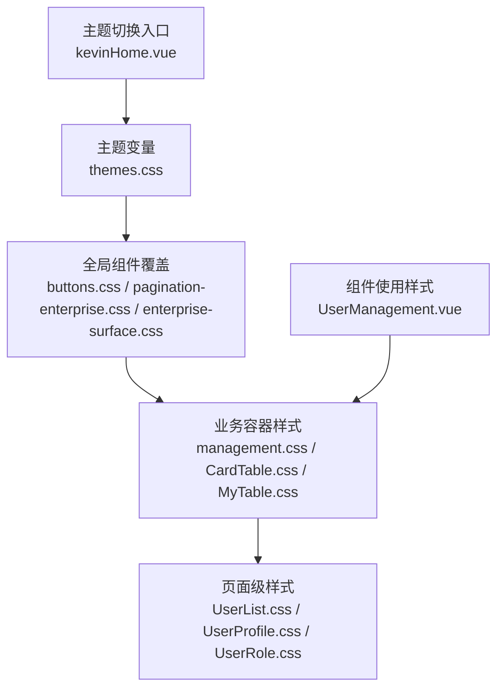
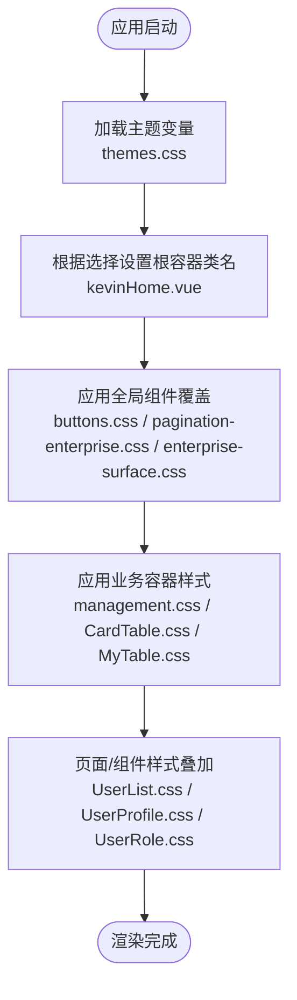
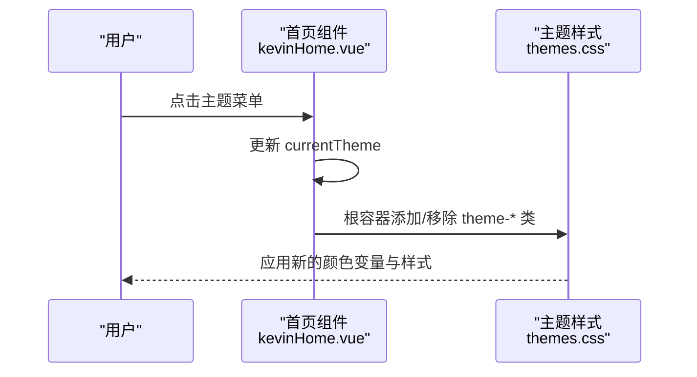
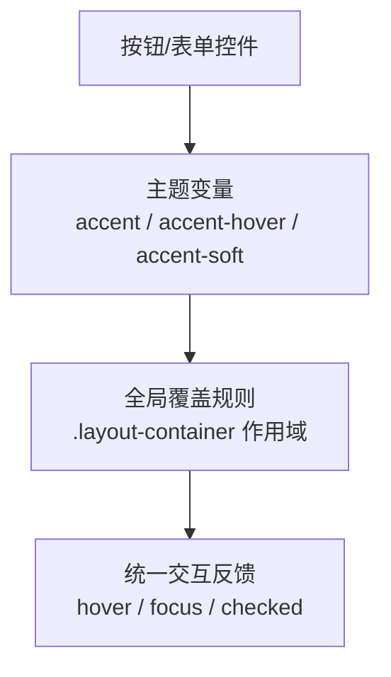
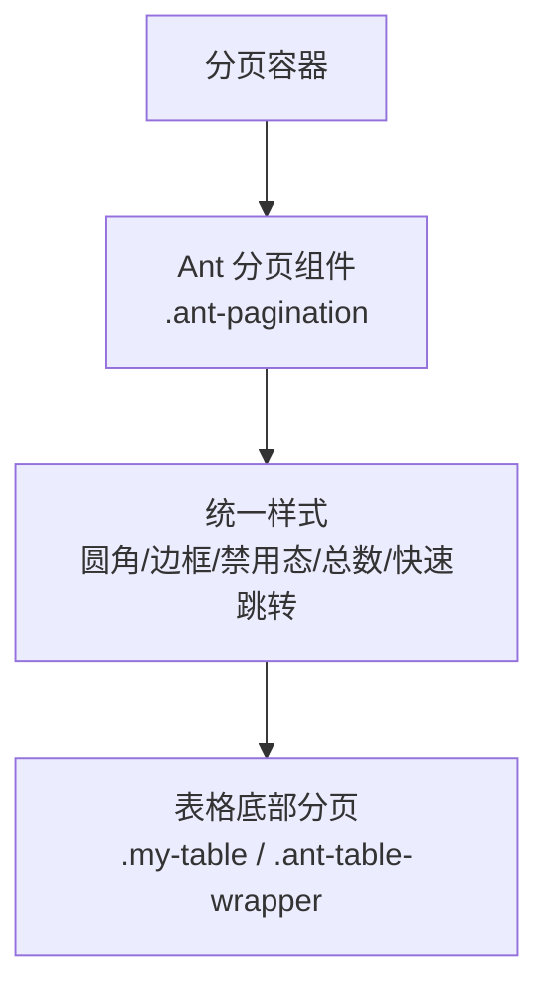
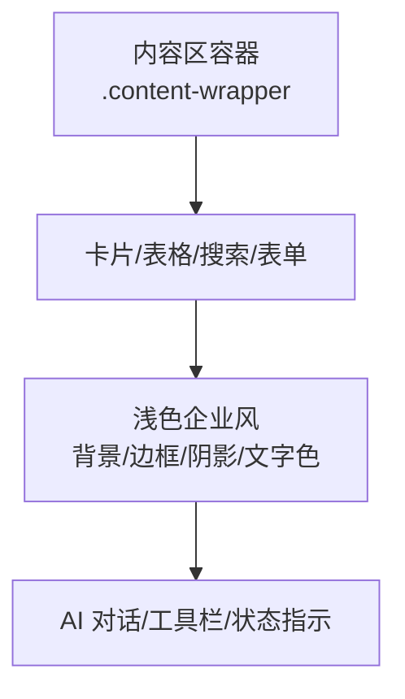
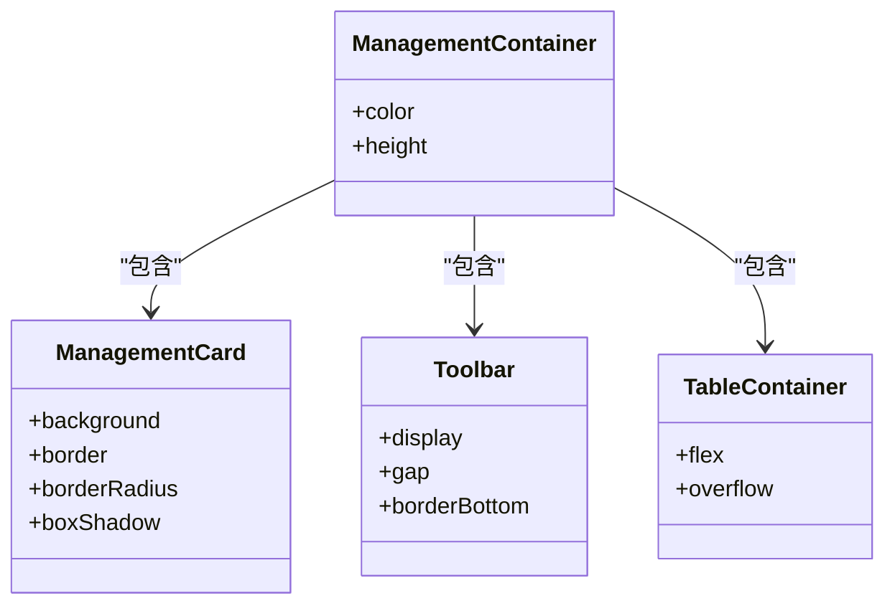
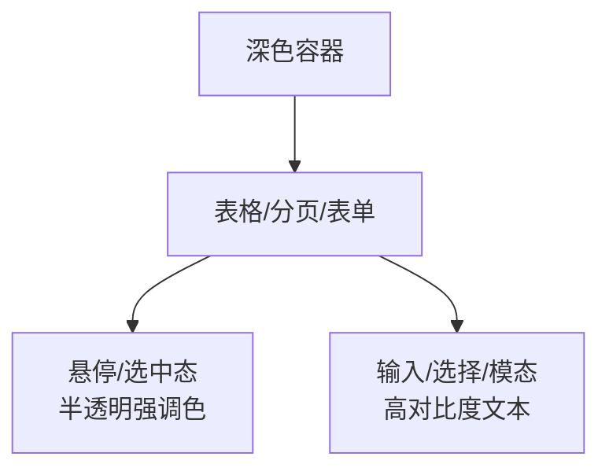
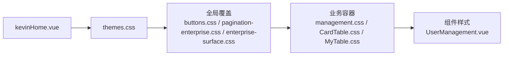

# 组件样式

<cite>
**本文引用的文件**
- [themes.css](file://vue/kevin.web.vue/src/css/themes.css)
- [buttons.css](file://vue/kevin.web.vue/src/css/buttons.css)
- [pagination-enterprise.css](file://vue/kevin.web.vue/src/css/pagination-enterprise.css)
- [enterprise-surface.css](file://vue/kevin.web.vue/src/css/enterprise-surface.css)
- [management.css](file://vue/kevin.web.vue/src/css/management.css)
- [CardTable.css](file://vue/kevin.web.vue/src/css/CardTable.css)
- [MyTable.css](file://vue/kevin.web.vue/src/css/MyTable.css)
- [UserList.css](file://vue/kevin.web.vue/src/css/UserList.css)
- [UserProfile.css](file://vue/kevin.web.vue/src/css/UserProfile.css)
- [UserRole.css](file://vue/kevin.web.vue/src/css/UserRole.css)
- [kevinHome.vue](file://vue/kevin.web.vue/src/pages/kevinHome.vue)
- [UserManagement.vue](file://vue/kevin.web.vue/src/components/UserManagement.vue)
</cite>

## 目录
1. [简介](#简介)
2. [项目结构](#项目结构)
3. [核心组件与样式体系](#核心组件与样式体系)
4. [架构总览](#架构总览)
5. [详细组件分析](#详细组件分析)
6. [依赖关系分析](#依赖关系分析)
7. [性能考虑](#性能考虑)
8. [故障排查指南](#故障排查指南)
9. [结论](#结论)
10. [附录：配置选项与最佳实践](#附录：配置选项与最佳实践)

## 简介
本文件系统性梳理 NetCoreKevin 前端（Vue + Ant Design Vue）的样式定制与覆盖策略，重点说明：
- 主题变量与多主题切换机制
- Ant Design Vue 组件样式的统一覆盖方法
- 自定义按钮、分页器等通用组件的样式实现
- 响应式设计与移动端适配
- 组件状态样式管理（hover、active、disabled 等）
- 样式复用与设计模式
- 具体组件样式示例与配置项

## 项目结构
样式组织采用“全局主题 + 业务模块样式”的分层方式：
- 全局主题变量与主题切换：themes.css
- 全局组件覆盖：buttons.css、pagination-enterprise.css、enterprise-surface.css
- 业务页面容器与布局：management.css、CardTable.css、MyTable.css、UserList.css、UserProfile.css、UserRole.css
- 主题入口与动态类名应用：kevinHome.vue
- 典型业务组件样式使用：UserManagement.vue

图表来源
- [themes.css:1-378](file://vue/kevin.web.vue/src/css/themes.css#L1-L378)
- [buttons.css:1-99](file://vue/kevin.web.vue/src/css/buttons.css#L1-L99)
- [pagination-enterprise.css:1-135](file://vue/kevin.web.vue/src/css/pagination-enterprise.css#L1-L135)
- [enterprise-surface.css:1-327](file://vue/kevin.web.vue/src/css/enterprise-surface.css#L1-L327)
- [management.css:1-177](file://vue/kevin.web.vue/src/css/management.css#L1-L177)
- [CardTable.css:1-353](file://vue/kevin.web.vue/src/css/CardTable.css#L1-L353)
- [MyTable.css:1-76](file://vue/kevin.web.vue/src/css/MyTable.css#L1-L76)
- [UserList.css:1-266](file://vue/kevin.web.vue/src/css/UserList.css#L1-L266)
- [UserProfile.css:1-126](file://vue/kevin.web.vue/src/css/UserProfile.css#L1-L126)
- [UserRole.css:1-318](file://vue/kevin.web.vue/src/css/UserRole.css#L1-L318)
- [kevinHome.vue:1-681](file://vue/kevin.web.vue/src/pages/kevinHome.vue#L1-L681)
- [UserManagement.vue:1-548](file://vue/kevin.web.vue/src/components/UserManagement.vue#L1-L548)

章节来源
- [kevinHome.vue:1-681](file://vue/kevin.web.vue/src/pages/kevinHome.vue#L1-L681)
- [themes.css:1-378](file://vue/kevin.web.vue/src/css/themes.css#L1-L378)

## 核心组件与样式体系
- 主题系统
  - 通过 CSS 变量定义强调色、背景、边框、文字色等，并在不同主题类下覆写变量值。
  - 主题切换通过在根容器添加 theme-* 类名实现，支持企业蓝、墨黑、灰蓝、绿色、紫色、深海蓝、企业简约白等多套主题。
- 全局组件覆盖
  - 按钮、输入框、选择器、开关、复选框、单选框、日期选择器等统一通过 .layout-container 作用域覆盖，确保主题变量生效。
  - 分页器统一浅色风格，适配表格底部分页与独立分页容器。
  - 内容区卡片、表格、搜索框、对话界面等统一为浅色企业风，避免历史深色玻璃风在浅色内容区的冲突。
- 业务容器与布局
  - management/card/table 等容器提供统一的间距、边框、阴影、标题栏样式。
  - 深色表场景（如用户列表）提供独立的透明背景与高对比度文本样式。
- 响应式与移动端适配
  - 多处使用 @media (max-width: 768px) 调整布局方向、间距与尺寸，保证移动端可用性。

章节来源
- [themes.css:1-378](file://vue/kevin.web.vue/src/css/themes.css#L1-L378)
- [buttons.css:1-99](file://vue/kevin.web.vue/src/css/buttons.css#L1-L99)
- [pagination-enterprise.css:1-135](file://vue/kevin.web.vue/src/css/pagination-enterprise.css#L1-L135)
- [enterprise-surface.css:1-327](file://vue/kevin.web.vue/src/css/enterprise-surface.css#L1-L327)
- [management.css:1-177](file://vue/kevin.web.vue/src/css/management.css#L1-L177)
- [CardTable.css:1-353](file://vue/kevin.web.vue/src/css/CardTable.css#L1-L353)
- [MyTable.css:1-76](file://vue/kevin.web.vue/src/css/MyTable.css#L1-L76)
- [UserList.css:1-266](file://vue/kevin.web.vue/src/css/UserList.css#L1-L266)
- [UserProfile.css:1-126](file://vue/kevin.web.vue/src/css/UserProfile.css#L1-L126)
- [UserRole.css:1-318](file://vue/kevin.web.vue/src/css/UserRole.css#L1-L318)

## 架构总览
主题与样式的作用域与优先级如下：
- 根容器 .layout-container 承载主题类名，所有全局覆盖以该容器为作用域，避免污染全局。
- 业务容器 .content-wrapper 用于统一内容区样式，解决历史深色样式在浅色内容区的兼容问题。
- 各页面/组件通过 scoped 或局部引入的方式叠加特定样式，优先满足业务需求。

图表来源
- [kevinHome.vue:1-681](file://vue/kevin.web.vue/src/pages/kevinHome.vue#L1-L681)
- [themes.css:1-378](file://vue/kevin.web.vue/src/css/themes.css#L1-L378)
- [buttons.css:1-99](file://vue/kevin.web.vue/src/css/buttons.css#L1-L99)
- [pagination-enterprise.css:1-135](file://vue/kevin.web.vue/src/css/pagination-enterprise.css#L1-L135)
- [enterprise-surface.css:1-327](file://vue/kevin.web.vue/src/css/enterprise-surface.css#L1-L327)
- [management.css:1-177](file://vue/kevin.web.vue/src/css/management.css#L1-L177)
- [CardTable.css:1-353](file://vue/kevin.web.vue/src/css/CardTable.css#L1-L353)
- [MyTable.css:1-76](file://vue/kevin.web.vue/src/css/MyTable.css#L1-L76)
- [UserList.css:1-266](file://vue/kevin.web.vue/src/css/UserList.css#L1-L266)
- [UserProfile.css:1-126](file://vue/kevin.web.vue/src/css/UserProfile.css#L1-L126)
- [UserRole.css:1-318](file://vue/kevin.web.vue/src/css/UserRole.css#L1-L318)

## 详细组件分析

### 主题系统与多主题切换
- 主题变量集中定义于 themes.css，包含页面背景、侧栏背景、强调色、悬停色、内容表面、边框、文字色、危险色等。
- 通过 kevinHome.vue 在根容器上动态切换 theme-* 类名，并持久化到本地存储，支持多套主题一键切换。
- 菜单主题根据当前主题自动切换 light/dark，保证导航可读性。

图表来源
- [kevinHome.vue:1-681](file://vue/kevin.web.vue/src/pages/kevinHome.vue#L1-L681)
- [themes.css:1-378](file://vue/kevin.web.vue/src/css/themes.css#L1-L378)

章节来源
- [kevinHome.vue:1-681](file://vue/kevin.web.vue/src/pages/kevinHome.vue#L1-L681)
- [themes.css:1-378](file://vue/kevin.web.vue/src/css/themes.css#L1-L378)

### 全局按钮与表单控件覆盖
- 按钮：主按钮、链接按钮、操作按钮统一使用主题变量，hover/focus 状态一致。
- 输入框：聚焦态边框与阴影使用强调色与柔化色，提升可访问性与视觉一致性。
- 选择器、复选框、单选框、日期选择器、开关：选中态与交互态均基于主题变量，保持品牌色一致。

图表来源
- [buttons.css:1-99](file://vue/kevin.web.vue/src/css/buttons.css#L1-L99)
- [themes.css:1-378](file://vue/kevin.web.vue/src/css/themes.css#L1-L378)

章节来源
- [buttons.css:1-99](file://vue/kevin.web.vue/src/css/buttons.css#L1-L99)

### 分页器样式与表格集成
- 独立分页容器与表格底部分页统一浅色风格，圆角、边框、禁用态、总数文本、快速跳转输入框等细节完善。
- 与 ant-table 集成时，通过选择器限定作用域，避免影响其他分页场景。

图表来源
- [pagination-enterprise.css:1-135](file://vue/kevin.web.vue/src/css/pagination-enterprise.css#L1-L135)

章节来源
- [pagination-enterprise.css:1-135](file://vue/kevin.web.vue/src/css/pagination-enterprise.css#L1-L135)

### 内容区企业风统一
- 将历史深色玻璃风卡片、表格、对话框等在浅色内容区进行统一，确保可读性与一致性。
- 针对搜索框、下拉选择、进度条、滑块、空状态、AI 对话消息气泡等进行专项适配。

图表来源
- [enterprise-surface.css:1-327](file://vue/kevin.web.vue/src/css/enterprise-surface.css#L1-L327)

章节来源
- [enterprise-surface.css:1-327](file://vue/kevin.web.vue/src/css/enterprise-surface.css#L1-L327)

### 管理容器与卡片布局
- 管理容器、卡片头部、工具栏、表格区域、操作按钮等提供一致的间距、边框、阴影与排版。
- 搜索框、按钮、选择器等在工具栏内对齐与圆角处理，提升整体观感。

图表来源
- [management.css:1-177](file://vue/kevin.web.vue/src/css/management.css#L1-L177)
- [CardTable.css:1-353](file://vue/kevin.web.vue/src/css/CardTable.css#L1-L353)

章节来源
- [management.css:1-177](file://vue/kevin.web.vue/src/css/management.css#L1-L177)
- [CardTable.css:1-353](file://vue/kevin.web.vue/src/css/CardTable.css#L1-L353)

### 深色表格与用户列表
- 用户列表与角色管理等页面采用深色半透明卡片与高对比度文本，表格行悬停与选中态使用半透明强调色。
- 表单、模态框、树形控件、分页器等在深色背景下保持一致的可读性与交互反馈。

图表来源
- [UserList.css:1-266](file://vue/kevin.web.vue/src/css/UserList.css#L1-L266)
- [UserRole.css:1-318](file://vue/kevin.web.vue/src/css/UserRole.css#L1-L318)
- [MyTable.css:1-76](file://vue/kevin.web.vue/src/css/MyTable.css#L1-L76)

章节来源
- [UserList.css:1-266](file://vue/kevin.web.vue/src/css/UserList.css#L1-L266)
- [UserRole.css:1-318](file://vue/kevin.web.vue/src/css/UserRole.css#L1-L318)
- [MyTable.css:1-76](file://vue/kevin.web.vue/src/css/MyTable.css#L1-L76)

### 组件样式复用与设计模式
- 作用域隔离：全局覆盖以 .layout-container 为作用域，避免全局污染；业务样式通过 scoped 或局部引入叠加。
- 变量驱动：主题变量作为唯一色彩源，组件样式引用变量，便于多主题切换与一致性维护。
- 容器优先：通过 .content-wrapper 统一内容区样式，再在页面/组件中细化，降低耦合。
- 命名规范：按功能划分样式文件（主题、全局组件、业务容器、页面），便于检索与维护。

章节来源
- [themes.css:1-378](file://vue/kevin.web.vue/src/css/themes.css#L1-L378)
- [buttons.css:1-99](file://vue/kevin.web.vue/src/css/buttons.css#L1-L99)
- [enterprise-surface.css:1-327](file://vue/kevin.web.vue/src/css/enterprise-surface.css#L1-L327)
- [management.css:1-177](file://vue/kevin.web.vue/src/css/management.css#L1-L177)

## 依赖关系分析
- kevinHome.vue 负责主题切换，向 DOM 注入 theme-* 类名，触发 themes.css 中的变量变化。
- buttons.css、pagination-enterprise.css、enterprise-surface.css 在全局范围内对 Ant Design Vue 组件进行覆盖，依赖主题变量。
- management.css、CardTable.css、MyTable.css 等业务样式依赖全局覆盖，形成层级样式链。
- UserManagement.vue 等组件通过局部引入样式文件，叠加业务特定样式。

图表来源
- [kevinHome.vue:1-681](file://vue/kevin.web.vue/src/pages/kevinHome.vue#L1-L681)
- [themes.css:1-378](file://vue/kevin.web.vue/src/css/themes.css#L1-L378)
- [buttons.css:1-99](file://vue/kevin.web.vue/src/css/buttons.css#L1-L99)
- [pagination-enterprise.css:1-135](file://vue/kevin.web.vue/src/css/pagination-enterprise.css#L1-L135)
- [enterprise-surface.css:1-327](file://vue/kevin.web.vue/src/css/enterprise-surface.css#L1-L327)
- [management.css:1-177](file://vue/kevin.web.vue/src/css/management.css#L1-L177)
- [CardTable.css:1-353](file://vue/kevin.web.vue/src/css/CardTable.css#L1-L353)
- [MyTable.css:1-76](file://vue/kevin.web.vue/src/css/MyTable.css#L1-L76)
- [UserManagement.vue:1-548](file://vue/kevin.web.vue/src/components/UserManagement.vue#L1-L548)

章节来源
- [kevinHome.vue:1-681](file://vue/kevin.web.vue/src/pages/kevinHome.vue#L1-L681)
- [UserManagement.vue:1-548](file://vue/kevin.web.vue/src/components/UserManagement.vue#L1-L548)

## 性能考虑
- 样式作用域控制：尽量使用 .layout-container 与 .content-wrapper 限定作用域，减少不必要的 !important 与全局污染。
- 变量复用：通过 CSS 变量统一管理颜色与尺寸，减少重复声明，提升渲染性能。
- 媒体查询集中：将响应式规则集中在对应文件中，避免分散导致重排重绘。
- 避免过度嵌套：保持选择器简洁，提高浏览器匹配效率。

[本节为通用指导，不直接分析具体文件]

## 故障排查指南
- 主题未生效
  - 检查根容器是否添加了正确的 theme-* 类名。
  - 确认主题切换逻辑是否正确更新 currentTheme 并持久化。
- 组件样式被覆盖
  - 检查是否存在更高层级的选择器或 !important 覆盖。
  - 确认全局覆盖是否在 .layout-container 作用域内。
- 分页器样式异常
  - 确认分页容器类名与选择器匹配。
  - 检查表格底部分页是否与 .my-table / .ant-table-wrapper 正确关联。
- 深色模式下可读性差
  - 检查文本颜色与背景对比度。
  - 确认表单、模态框、树形控件在深色背景下的样式覆盖。

章节来源
- [kevinHome.vue:1-681](file://vue/kevin.web.vue/src/pages/kevinHome.vue#L1-L681)
- [pagination-enterprise.css:1-135](file://vue/kevin.web.vue/src/css/pagination-enterprise.css#L1-L135)
- [UserList.css:1-266](file://vue/kevin.web.vue/src/css/UserList.css#L1-L266)
- [UserRole.css:1-318](file://vue/kevin.web.vue/src/css/UserRole.css#L1-L318)

## 结论
本项目通过 CSS 变量与主题类名实现了灵活的多主题切换，结合全局覆盖与业务容器样式，确保了 Ant Design Vue 组件的一致性与可维护性。通过作用域隔离、变量驱动与容器优先的设计模式，有效降低了样式耦合，提升了团队协作效率。同时，完善的响应式适配与状态样式管理，保证了在不同设备与交互场景下的良好体验。

[本节为总结，不直接分析具体文件]

## 附录：配置选项与最佳实践

### 主题变量与主题类
- 主题变量
  - 强调色、悬停色、柔化色、页面背景、侧栏背景、内容表面、边框、文字色、危险色等。
- 主题类
  - 企业蓝、墨黑、灰蓝、绿色、紫色、深海蓝、企业简约白。
- 切换方式
  - 在根容器动态添加/移除 theme-* 类名，并持久化到本地存储。

章节来源
- [themes.css:1-378](file://vue/kevin.web.vue/src/css/themes.css#L1-L378)
- [kevinHome.vue:1-681](file://vue/kevin.web.vue/src/pages/kevinHome.vue#L1-L681)

### 全局组件覆盖要点
- 按钮：主按钮、链接按钮、操作按钮的 hover/focus 状态统一。
- 输入框：聚焦态边框与阴影使用强调色与柔化色。
- 选择器、复选框、单选框、日期选择器、开关：选中态与交互态基于主题变量。
- 分页器：统一浅色风格，适配表格底部分页与独立分页容器。

章节来源
- [buttons.css:1-99](file://vue/kevin.web.vue/src/css/buttons.css#L1-L99)
- [pagination-enterprise.css:1-135](file://vue/kevin.web.vue/src/css/pagination-enterprise.css#L1-L135)

### 业务容器与页面样式
- 管理容器：卡片、工具栏、表格区域、操作按钮的统一间距与边框。
- 深色表格：用户列表与角色管理的深色半透明背景与高对比度文本。
- 内容区企业风：卡片、表格、搜索框、对话界面等浅色统一。

章节来源
- [management.css:1-177](file://vue/kevin.web.vue/src/css/management.css#L1-L177)
- [CardTable.css:1-353](file://vue/kevin.web.vue/src/css/CardTable.css#L1-L353)
- [MyTable.css:1-76](file://vue/kevin.web.vue/src/css/MyTable.css#L1-L76)
- [UserList.css:1-266](file://vue/kevin.web.vue/src/css/UserList.css#L1-L266)
- [UserProfile.css:1-126](file://vue/kevin.web.vue/src/css/UserProfile.css#L1-L126)
- [UserRole.css:1-318](file://vue/kevin.web.vue/src/css/UserRole.css#L1-L318)
- [enterprise-surface.css:1-327](file://vue/kevin.web.vue/src/css/enterprise-surface.css#L1-L327)

### 响应式与移动端适配
- 使用 @media (max-width: 768px) 调整布局方向、间距与尺寸。
- 工具栏、卡片头、分页容器等在移动端自适应。

章节来源
- [management.css:156-177](file://vue/kevin.web.vue/src/css/management.css#L156-L177)
- [CardTable.css:305-353](file://vue/kevin.web.vue/src/css/CardTable.css#L305-L353)
- [UserList.css:242-266](file://vue/kevin.web.vue/src/css/UserList.css#L242-L266)
- [UserProfile.css:112-126](file://vue/kevin.web.vue/src/css/UserProfile.css#L112-L126)
- [UserRole.css:299-318](file://vue/kevin.web.vue/src/css/UserRole.css#L299-L318)

### 组件状态样式管理
- hover：按钮、链接、表格行悬停使用强调色或半透明背景。
- active：分页激活项、选中行使用强调色边框或背景。
- disabled：分页禁用项与按钮禁用态使用低透明度与浅背景。
- focus：输入框、选择器、日期选择器聚焦态使用强调色边框与柔化阴影。

章节来源
- [buttons.css:1-99](file://vue/kevin.web.vue/src/css/buttons.css#L1-L99)
- [pagination-enterprise.css:103-129](file://vue/kevin.web.vue/src/css/pagination-enterprise.css#L103-L129)
- [enterprise-surface.css:61-69](file://vue/kevin.web.vue/src/css/enterprise-surface.css#L61-L69)
- [UserList.css:99-115](file://vue/kevin.web.vue/src/css/UserList.css#L99-L115)
- [UserRole.css:102-118](file://vue/kevin.web.vue/src/css/UserRole.css#L102-L118)

### 具体组件样式示例与配置选项
- 用户管理组件
  - 表格列、分页配置、搜索框、操作按钮、标签、模态框等样式通过局部引入与管理容器样式叠加。
  - 分页器配置包括页码、每页大小、快速跳转、总数显示与布局。
- 主题切换
  - 通过根容器类名切换主题，菜单主题根据当前主题自动切换 light/dark。

章节来源
- [UserManagement.vue:1-548](file://vue/kevin.web.vue/src/components/UserManagement.vue#L1-L548)
- [kevinHome.vue:1-681](file://vue/kevin.web.vue/src/pages/kevinHome.vue#L1-L681)