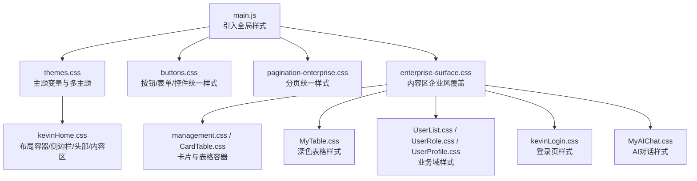
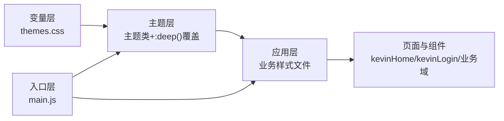
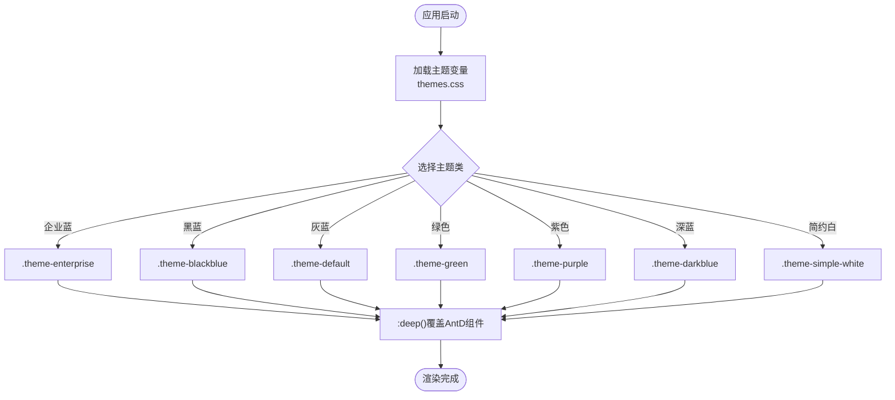
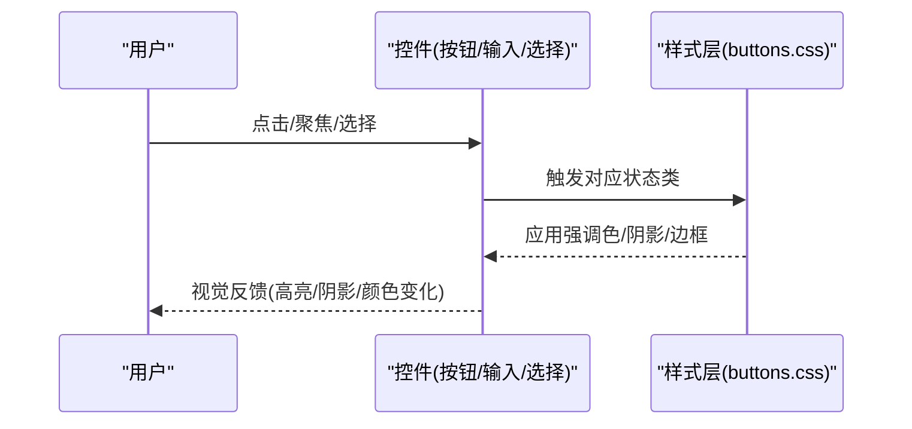
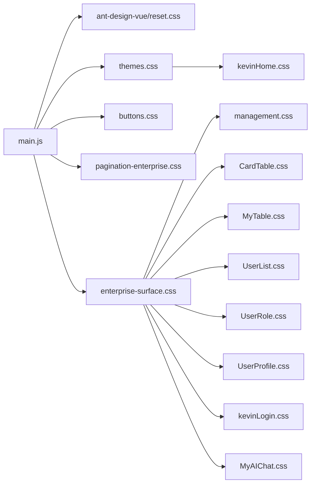

# UI样式

<cite>
**本文引用的文件**
- [themes.css](file://vue/kevin.web.vue/src/css/themes.css)
- [enterprise-surface.css](file://vue/kevin.web.vue/src/css/enterprise-surface.css)
- [buttons.css](file://vue/kevin.web.vue/src/css/buttons.css)
- [pagination-enterprise.css](file://vue/kevin.web.vue/src/css/pagination-enterprise.css)
- [management.css](file://vue/kevin.web.vue/src/css/management.css)
- [CardTable.css](file://vue/kevin.web.vue/src/css/CardTable.css)
- [MyTable.css](file://vue/kevin.web.vue/src/css/MyTable.css)
- [UserList.css](file://vue/kevin.web.vue/src/css/UserList.css)
- [UserProfile.css](file://vue/kevin.web.vue/src/css/UserProfile.css)
- [UserRole.css](file://vue/kevin.web.vue/src/css/UserRole.css)
- [kevinHome.css](file://vue/kevin.web.vue/src/css/kevinHome.css)
- [kevinLogin.css](file://vue/kevin.web.vue/src/css/kevinLogin.css)
- [main.js](file://vue/kevin.web.vue/src/main.js)
- [package.json](file://vue/kevin.web.vue/package.json)
- [vue.config.js](file://vue/kevin.web.vue/vue.config.js)
</cite>

## 目录
1. [简介](#简介)
2. [项目结构](#项目结构)
3. [核心组件](#核心组件)
4. [架构总览](#架构总览)
5. [详细组件分析](#详细组件分析)
6. [依赖关系分析](#依赖关系分析)
7. [性能考量](#性能考量)
8. [故障排查指南](#故障排查指南)
9. [结论](#结论)
10. [附录](#附录)

## 简介
本文件系统化梳理 NetCoreKevin 前端 UI 的样式架构与实现，覆盖企业级主题定制、Ant Design Vue 主题覆盖、响应式设计与移动端适配、浏览器兼容性处理、CSS 变量体系、组件样式隔离与复用策略、动画与交互反馈、样式性能优化、模块化开发与调试技巧，以及设计系统落地与品牌一致性保障。目标是让不同技术背景的读者都能理解并高效维护该样式体系。

## 项目结构
前端样式位于 vue/kevin.web.vue/src/css 目录下，采用“全局基础 + 业务域”的分层组织方式：
- 全局基础：主题变量、按钮与表单统一样式、分页统一样式、内容区企业风覆盖
- 布局与页面：主布局（侧边栏/头部/内容区）、登录页
- 业务域：用户管理、角色管理、个人资料、AI 聊天等独立样式模块
- 入口装配：在 main.js 中引入 Ant Design Vue 样式与全局样式，确保主题一致

图表来源
- [main.js:1-20](file://vue/kevin.web.vue/src/main.js#L1-L20)
- [themes.css:1-378](file://vue/kevin.web.vue/src/css/themes.css#L1-L378)
- [buttons.css:1-99](file://vue/kevin.web.vue/src/css/buttons.css#L1-L99)
- [pagination-enterprise.css:1-135](file://vue/kevin.web.vue/src/css/pagination-enterprise.css#L1-L135)
- [enterprise-surface.css:1-327](file://vue/kevin.web.vue/src/css/enterprise-surface.css#L1-L327)
- [kevinHome.css:1-387](file://vue/kevin.web.vue/src/css/kevinHome.css#L1-L387)

章节来源
- [main.js:1-20](file://vue/kevin.web.vue/src/main.js#L1-L20)
- [package.json:1-68](file://vue/kevin.web.vue/package.json#L1-L68)
- [vue.config.js:1-21](file://vue/kevin.web.vue/vue.config.js#L1-L21)

## 核心组件
- 主题变量与多主题切换
  - 通过 CSS 自定义属性集中定义页面背景、侧栏背景、强调色、文本色、边框色等，并以多个主题类（如 .theme-enterprise、.theme-simple-white）进行组合，实现一键换肤。
  - 使用 :deep() 对 Ant Design Vue 内部节点进行主题覆盖，保证组件在不同主题下的一致性。
- 全局控件样式
  - 按钮、输入框、选择器、开关、复选/单选、日期选择器等统一聚焦态与强调色，形成一致的交互反馈。
- 分页统一样式
  - 为独立分页容器与表格底部分页提供浅色统一的视觉规范，包括激活态、禁用态、尺寸与间距。
- 内容区企业风覆盖
  - 将历史深色玻璃风组件统一到浅色企业风，覆盖卡片、表格、搜索框、AI 对话等区域，确保主内容区风格一致。
- 布局与页面
  - 主布局包含侧边栏、头部、内容区与底部；登录页具备科技风背景与动效。

章节来源
- [themes.css:1-378](file://vue/kevin.web.vue/src/css/themes.css#L1-L378)
- [buttons.css:1-99](file://vue/kevin.web.vue/src/css/buttons.css#L1-L99)
- [pagination-enterprise.css:1-135](file://vue/kevin.web.vue/src/css/pagination-enterprise.css#L1-L135)
- [enterprise-surface.css:1-327](file://vue/kevin.web.vue/src/css/enterprise-surface.css#L1-L327)
- [kevinHome.css:1-387](file://vue/kevin.web.vue/src/css/kevinHome.css#L1-L387)
- [kevinLogin.css:1-255](file://vue/kevin.web.vue/src/css/kevinLogin.css#L1-L255)

## 架构总览
样式架构遵循“变量驱动 + 主题类 + 作用域覆盖”的模式：
- 变量层：themes.css 定义全局 CSS 变量，作为单一事实源
- 主题层：以主题类挂载变量值，配合 :deep() 覆盖 Ant Design Vue 默认样式
- 应用层：业务样式文件通过引用或继承变量，保持视觉一致
- 入口层：main.js 统一引入 Ant Design Vue 样式与全局样式，确保加载顺序与优先级正确

图表来源
- [themes.css:1-378](file://vue/kevin.web.vue/src/css/themes.css#L1-L378)
- [main.js:1-20](file://vue/kevin.web.vue/src/main.js#L1-L20)
- [kevinHome.css:1-387](file://vue/kevin.web.vue/src/css/kevinHome.css#L1-L387)

## 详细组件分析

### 主题系统与变量体系
- 变量定义
  - 页面背景、侧栏背景、强调色及其 hover 态、内容表面色、文本强/弱色、边框色、滚动条色、危险色等集中在主题变量中，便于统一管理与扩展。
- 多主题实现
  - 通过 .theme-enterprise、.theme-blackblue、.theme-default、.theme-green、.theme-purple、.theme-darkblue、.theme-simple-white 等主题类覆盖变量值，实现快速切换。
  - 针对 Ant Design Vue 的菜单、徽章、按钮等组件，使用 :deep() 精准覆盖内部样式，确保主题一致性。
- 预览与切换
  - 提供主题预览块与切换按钮样式，便于在设置面板中展示与切换主题。

图表来源
- [themes.css:1-378](file://vue/kevin.web.vue/src/css/themes.css#L1-L378)

章节来源
- [themes.css:1-378](file://vue/kevin.web.vue/src/css/themes.css#L1-L378)

### 全局控件与交互反馈
- 按钮与链接
  - 主按钮、链接按钮统一使用强调色，hover 态使用强调色的 hover 变量，保持品牌一致性。
- 输入与选择器
  - 输入框、带前缀/后缀的输入框、选择器、日期选择器聚焦时显示强调色边框与柔和阴影，提升可发现性。
- 开关与复选/单选
  - 选中态统一使用强调色，悬停态增强边框颜色，确保状态可见性。
- 操作按钮
  - 行内操作按钮使用中性色，hover 时高亮强调色，危险操作 hover 时高亮危险色。

图表来源
- [buttons.css:1-99](file://vue/kevin.web.vue/src/css/buttons.css#L1-L99)

章节来源
- [buttons.css:1-99](file://vue/kevin.web.vue/src/css/buttons.css#L1-L99)

### 分页统一样式
- 独立分页容器与表格底部分页统一浅色风格，包含：
  - 分页项圆角、边框、激活态高亮、禁用态透明度
  - 总数文本、跳转输入框、下拉选择器的颜色与边框
  - 上一页/下一页按钮的颜色与禁用态
- 与表格的间距与对齐保持一致，避免视觉割裂。

章节来源
- [pagination-enterprise.css:1-135](file://vue/kevin.web.vue/src/css/pagination-enterprise.css#L1-L135)

### 内容区企业风覆盖
- 目标：将历史深色玻璃风组件统一到浅色企业风，确保主内容区风格一致。
- 覆盖范围：
  - 卡片头、标题、工具栏、表格表头/行、输入框、搜索框、选择器、AI 对话区域等
  - 使用 !important 与 :deep() 精确覆盖 Ant Design Vue 默认样式
- 效果：
  - 统一文字颜色、背景色、边框色与阴影
  - 搜索框聚焦态与按钮强调色联动
  - AI 对话在浅色内容区可读性提升

章节来源
- [enterprise-surface.css:1-327](file://vue/kevin.web.vue/src/css/enterprise-surface.css#L1-L327)

### 布局与页面样式
- 主布局
  - 侧边栏、头部、内容区、底部容器，使用主题变量控制背景、边框与文本色
  - 菜单深色模式透明背景与选中态高亮，支持多主题下的选中态差异
  - 标签页导航样式与滚动条美化
- 登录页
  - 科技风背景渐变与网格线，登录卡片圆角与阴影，按钮渐变与悬浮动效
  - 验证码按钮禁用态与焦点态清晰区分
  - 小屏适配：卡片内边距、标题字号、验证码按钮宽度调整

章节来源
- [kevinHome.css:1-387](file://vue/kevin.web.vue/src/css/kevinHome.css#L1-L387)
- [kevinLogin.css:1-255](file://vue/kevin.web.vue/src/css/kevinLogin.css#L1-L255)

### 业务域样式
- 管理卡片与表格
  - 管理卡片容器、卡片头、标题、工具栏、搜索框、分页统一浅色企业风
  - 卡片列表（模型/代理/提示词）悬停边框与阴影变化，信息项排版与截断
- 深色表格
  - 深色背景表格，表头半透明背景，行悬停与选中态高亮，链接按钮颜色与悬停态
- 用户管理、角色管理、个人资料
  - 深色玻璃风卡片与表格，表单、模态框、树形控件、选择器、开关等统一深色主题
  - 小屏适配：工具栏堆叠、内边距缩小、元素对齐调整

章节来源
- [management.css:1-177](file://vue/kevin.web.vue/src/css/management.css#L1-L177)
- [CardTable.css:1-353](file://vue/kevin.web.vue/src/css/CardTable.css#L1-L353)
- [MyTable.css:1-76](file://vue/kevin.web.vue/src/css/MyTable.css#L1-L76)
- [UserList.css:1-266](file://vue/kevin.web.vue/src/css/UserList.css#L1-L266)
- [UserRole.css:1-318](file://vue/kevin.web.vue/src/css/UserRole.css#L1-L318)
- [UserProfile.css:1-126](file://vue/kevin.web.vue/src/css/UserProfile.css#L1-L126)

### AI 对话样式
- 整体风格：深色科技风，渐变背景、粒子动画、发光边框与阴影
- 左侧栏：会话列表、新增按钮、滚动条美化、活跃项高亮
- 右侧主区域：消息列表、头像、消息气泡、时间戳、复制按钮、折叠面板、文件列表、日志项
- 输入区域：多行输入框、聚焦态边框与阴影、发送按钮渐变与悬浮动效
- 动画：打字指示器、状态点脉冲、流式输出淡入、图标脉冲

章节来源
- [MyAIChat.css:1-800](file://vue/kevin.web.vue/src/css/MyAIChat.css#L1-L800)

## 依赖关系分析
- 入口依赖
  - main.js 引入 Ant Design Vue 样式与全局样式，确保主题与组件样式生效
  - 引入 dayjs 中文本地化，影响日期相关组件的显示语言
- 构建与兼容
  - package.json 指定 browserslist，排除 IE11，启用现代浏览器特性
  - vue.config.js 配置开发服务器代理与覆盖层关闭，便于联调
- 样式依赖链
  - themes.css 提供变量与主题类
  - buttons.css、pagination-enterprise.css、enterprise-surface.css 基于变量与主题类进行覆盖
  - kevinHome.css、kevinLogin.css 与业务域样式消费变量与主题类

图表来源
- [main.js:1-20](file://vue/kevin.web.vue/src/main.js#L1-L20)
- [themes.css:1-378](file://vue/kevin.web.vue/src/css/themes.css#L1-L378)
- [buttons.css:1-99](file://vue/kevin.web.vue/src/css/buttons.css#L1-L99)
- [pagination-enterprise.css:1-135](file://vue/kevin.web.vue/src/css/pagination-enterprise.css#L1-L135)
- [enterprise-surface.css:1-327](file://vue/kevin.web.vue/src/css/enterprise-surface.css#L1-L327)
- [kevinHome.css:1-387](file://vue/kevin.web.vue/src/css/kevinHome.css#L1-L387)
- [kevinLogin.css:1-255](file://vue/kevin.web.vue/src/css/kevinLogin.css#L1-L255)
- [management.css:1-177](file://vue/kevin.web.vue/src/css/management.css#L1-L177)
- [CardTable.css:1-353](file://vue/kevin.web.vue/src/css/CardTable.css#L1-L353)
- [MyTable.css:1-76](file://vue/kevin.web.vue/src/css/MyTable.css#L1-L76)
- [UserList.css:1-266](file://vue/kevin.web.vue/src/css/UserList.css#L1-L266)
- [UserRole.css:1-318](file://vue/kevin.web.vue/src/css/UserRole.css#L1-L318)
- [UserProfile.css:1-126](file://vue/kevin.web.vue/src/css/UserProfile.css#L1-L126)
- [MyAIChat.css:1-800](file://vue/kevin.web.vue/src/css/MyAIChat.css#L1-L800)

章节来源
- [package.json:1-68](file://vue/kevin.web.vue/package.json#L1-L68)
- [vue.config.js:1-21](file://vue/kevin.web.vue/vue.config.js#L1-L21)

## 性能考量
- 减少重排与重绘
  - 使用 CSS 变量集中管理颜色与尺寸，避免频繁计算与重复声明
  - 合理使用 :deep() 仅覆盖必要节点，避免全局污染
- 动画与过渡
  - 使用 transform 与 opacity 实现动画，减少布局抖动
  - 限制复杂动画的层级与数量，避免低端设备卡顿
- 样式体积与加载
  - 按需引入 Ant Design Vue 样式，避免全量引入带来的体积膨胀
  - 生产构建开启压缩与 Tree Shaking，减少冗余样式
- 滚动与性能
  - 长列表使用虚拟滚动或分页，避免一次性渲染过多 DOM
  - 自定义滚动条样式仅在必要时使用，避免兼容性问题

[本节为通用指导，不直接分析具体文件]

## 故障排查指南
- 主题未生效
  - 检查是否在根容器上正确添加主题类（如 .theme-enterprise）
  - 确认 themes.css 已引入且优先级高于其他样式
- Ant Design Vue 样式被覆盖异常
  - 检查 :deep() 选择器是否指向正确的子节点
  - 确认 enterprise-surface.css 与 buttons.css 的引入顺序
- 分页样式不一致
  - 确认分页容器类名与 pagination-enterprise.css 匹配
  - 检查表格底部分页是否被其他样式覆盖
- 移动端布局错乱
  - 检查 @media (max-width: 768px) 规则是否正确应用
  - 确认 flex 布局与内边距在小屏下的调整
- 浏览器兼容问题
  - 确认 browserslist 配置与目标浏览器
  - 对于不支持的特性（如 backdrop-filter），提供降级方案

章节来源
- [themes.css:1-378](file://vue/kevin.web.vue/src/css/themes.css#L1-L378)
- [enterprise-surface.css:1-327](file://vue/kevin.web.vue/src/css/enterprise-surface.css#L1-L327)
- [pagination-enterprise.css:1-135](file://vue/kevin.web.vue/src/css/pagination-enterprise.css#L1-L135)
- [kevinHome.css:1-387](file://vue/kevin.web.vue/src/css/kevinHome.css#L1-L387)
- [kevinLogin.css:1-255](file://vue/kevin.web.vue/src/css/kevinLogin.css#L1-L255)
- [package.json:61-66](file://vue/kevin.web.vue/package.json#L61-L66)

## 结论
NetCoreKevin 的前端样式体系以 CSS 变量为核心，结合主题类与 :deep() 覆盖机制，实现了企业级主题定制与 Ant Design Vue 的深度集成。通过分层组织与模块化拆分，保证了样式的可维护性与可扩展性。响应式设计、动画与交互反馈提升了用户体验，性能优化与兼容性策略确保了稳定运行。建议持续完善主题文档与组件样式规范，进一步巩固设计系统的品牌一致性。

[本节为总结，不直接分析具体文件]

## 附录
- 主题变量清单（示例）
  - 页面背景、侧栏背景、强调色、强调色 hover、强调色柔光、头部背景、头部边框、内容表面、内容边框、强文本、弱文本、页脚文本、头部图标色、危险色
- 主题类清单（示例）
  - 企业蓝、黑蓝、灰蓝、绿色、紫色、深蓝、简约白
- 关键样式文件职责
  - themes.css：主题变量与多主题
  - buttons.css：全局控件样式
  - pagination-enterprise.css：分页统一样式
  - enterprise-surface.css：内容区企业风覆盖
  - kevinHome.css：主布局样式
  - kevinLogin.css：登录页样式
  - 业务域样式：管理卡片、表格、用户/角色/资料、AI 对话

[本节为补充说明，不直接分析具体文件]