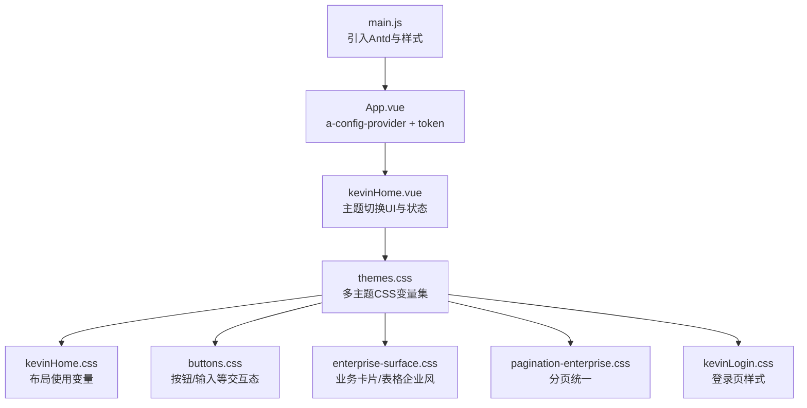
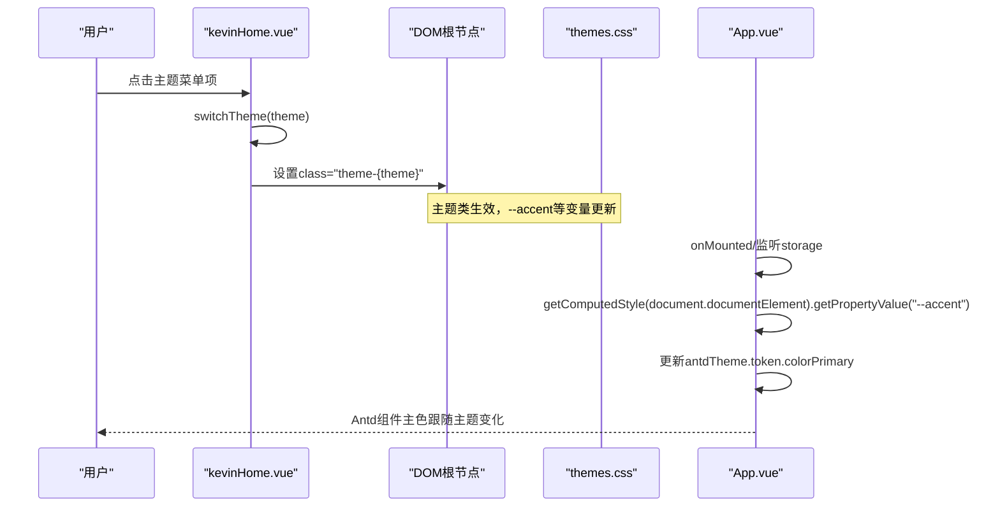
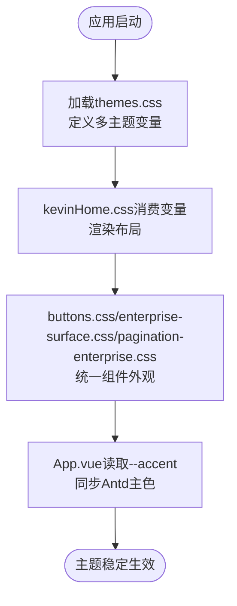
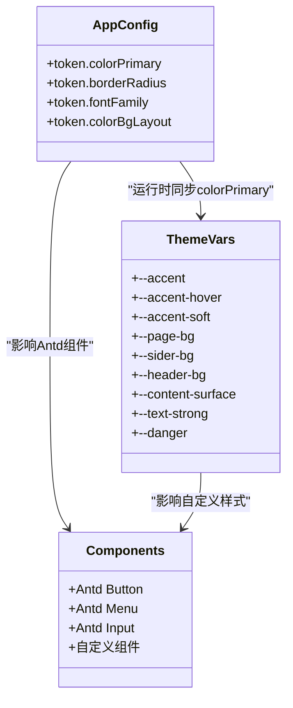
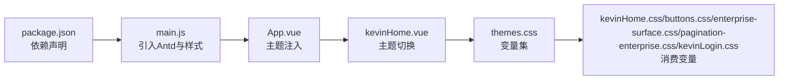

# 主题定制

<cite>
**本文引用的文件**
- [themes.css](file://vue/kevin.web.vue/src/css/themes.css)
- [buttons.css](file://vue/kevin.web.vue/src/css/buttons.css)
- [enterprise-surface.css](file://vue/kevin.web.vue/src/css/enterprise-surface.css)
- [pagination-enterprise.css](file://vue/kevin.web.vue/src/css/pagination-enterprise.css)
- [kevinHome.css](file://vue/kevin.web.vue/src/css/kevinHome.css)
- [kevinLogin.css](file://vue/kevin.web.vue/src/css/kevinLogin.css)
- [App.vue](file://vue/kevin.web.vue/src/App.vue)
- [main.js](file://vue/kevin.web.vue/src/main.js)
- [package.json](file://vue/kevin.web.vue/package.json)
- [kevinHome.vue](file://vue/kevin.web.vue/src/pages/kevinHome.vue)
</cite>

## 目录
1. [简介](#简介)
2. [项目结构](#项目结构)
3. [核心组件](#核心组件)
4. [架构总览](#架构总览)
5. [详细组件分析](#详细组件分析)
6. [依赖关系分析](#依赖关系分析)
7. [性能考虑](#性能考虑)
8. [故障排查指南](#故障排查指南)
9. [结论](#结论)
10. [附录](#附录)

## 简介
本文件系统性说明 NetCoreKevin 前端主题定制方案，围绕 CSS 变量系统、企业级主题覆盖机制（基于 Ant Design Vue）、深色/浅色模式切换、品牌色彩体系与最佳实践展开。目标是帮助开发者快速理解并扩展主题能力，同时兼顾可维护性与性能。

## 项目结构
前端主题相关代码集中在 vue/kevin.web.vue 的 src/css 与页面组件中：
- 主题变量与多主题样式：themes.css
- 全局按钮与交互态统一：buttons.css
- 业务内容区企业风覆盖：enterprise-surface.css
- 分页统一样式：pagination-enterprise.css
- 布局与容器样式：kevinHome.css
- 登录页样式：kevinLogin.css
- Ant Design Vue 主题注入与动态主色同步：App.vue
- 入口引入样式与国际化：main.js
- 主题切换 UI 与持久化：kevinHome.vue
- 依赖声明：package.json

图表来源
- [main.js:1-20](file://vue/kevin.web.vue/src/main.js#L1-L20)
- [App.vue:1-41](file://vue/kevin.web.vue/src/App.vue#L1-L41)
- [kevinHome.vue:1-123](file://vue/kevin.web.vue/src/pages/kevinHome.vue#L1-L123)
- [themes.css:1-378](file://vue/kevin.web.vue/src/css/themes.css#L1-L378)
- [kevinHome.css:1-387](file://vue/kevin.web.vue/src/css/kevinHome.css#L1-L387)
- [buttons.css:1-99](file://vue/kevin.web.vue/src/css/buttons.css#L1-L99)
- [enterprise-surface.css:1-327](file://vue/kevin.web.vue/src/css/enterprise-surface.css#L1-L327)
- [pagination-enterprise.css:1-135](file://vue/kevin.web.vue/src/css/pagination-enterprise.css#L1-L135)
- [kevinLogin.css:1-255](file://vue/kevin.web.vue/src/css/kevinLogin.css#L1-L255)

章节来源
- [main.js:1-20](file://vue/kevin.web.vue/src/main.js#L1-L20)
- [package.json:16-36](file://vue/kevin.web.vue/package.json#L16-L36)

## 核心组件
- CSS 变量系统：通过 .layout-container 及其主题类定义 --page-bg、--sider-bg、--accent、--accent-hover、--accent-soft、--header-bg、--content-surface、--text-strong、--danger 等变量，作为全站的“设计令牌”。
- 主题切换：在 kevinHome.vue 中以 currentTheme 控制根节点 class，并在 localStorage 持久化；菜单主题根据当前主题在 light/dark 间切换。
- Ant Design Vue 集成：App.vue 使用 a-config-provider 注入 theme.token.colorPrimary，并通过读取 --accent 实现运行时主色同步。
- 企业风格覆盖：enterprise-surface.css 将历史深色玻璃风组件统一为浅色企业风；pagination-enterprise.css 统一分页样式；buttons.css 统一按钮与表单交互态。

章节来源
- [themes.css:1-378](file://vue/kevin.web.vue/src/css/themes.css#L1-L378)
- [kevinHome.vue:474-641](file://vue/kevin.web.vue/src/pages/kevinHome.vue#L474-L641)
- [App.vue:1-41](file://vue/kevin.web.vue/src/App.vue#L1-L41)
- [enterprise-surface.css:1-327](file://vue/kevin.web.vue/src/css/enterprise-surface.css#L1-L327)
- [pagination-enterprise.css:1-135](file://vue/kevin.web.vue/src/css/pagination-enterprise.css#L1-L135)
- [buttons.css:1-99](file://vue/kevin.web.vue/src/css/buttons.css#L1-L99)

## 架构总览
主题系统由“变量层 + 覆盖层 + 运行时注入”三层构成：
- 变量层：themes.css 提供多套主题变量集合，按主题类名隔离。
- 覆盖层：kevinHome.css、buttons.css、enterprise-surface.css、pagination-enterprise.css、kevinLogin.css 消费变量，形成一致的视觉语言。
- 运行时注入：App.vue 将 --accent 映射到 Ant Design Vue 的 colorPrimary，使第三方组件与自定义样式保持一致。

图表来源
- [kevinHome.vue:596-641](file://vue/kevin.web.vue/src/pages/kevinHome.vue#L596-L641)
- [themes.css:1-378](file://vue/kevin.web.vue/src/css/themes.css#L1-L378)
- [App.vue:11-41](file://vue/kevin.web.vue/src/App.vue#L11-L41)

## 详细组件分析

### CSS 变量系统与品牌色彩
- 颜色变量
  - 强调色：--accent、--accent-hover、--accent-soft
  - 背景：--page-bg、--sider-bg、--header-bg、--content-surface
  - 文本：--text-strong、--text-muted、--footer-text、--header-icon-color
  - 边框：--header-border、--content-border、--sider-logo-border
  - 状态：--danger
- 字体变量
  - 通过 App.vue 的 fontFamily 统一字体栈，确保中英文混排一致。
- 间距变量
  - 未显式定义间距变量，采用统一的 padding/margin 规范（如 header 高度 64px、content-wrapper 内边距 24px）。
- 品牌色彩实施
  - 默认强调色 #1677ff，hover 色 #4096ff，软态 rgba(22,119,255,0.12)。
  - 多主题通过覆盖 --accent 与侧栏背景实现差异化（企业蓝、墨黑、灰蓝、绿色、紫色、深海蓝、企业简约白）。

图表来源
- [themes.css:1-378](file://vue/kevin.web.vue/src/css/themes.css#L1-L378)
- [kevinHome.css:1-387](file://vue/kevin.web.vue/src/css/kevinHome.css#L1-L387)
- [buttons.css:1-99](file://vue/kevin.web.vue/src/css/buttons.css#L1-L99)
- [enterprise-surface.css:1-327](file://vue/kevin.web.vue/src/css/enterprise-surface.css#L1-L327)
- [pagination-enterprise.css:1-135](file://vue/kevin.web.vue/src/css/pagination-enterprise.css#L1-L135)
- [App.vue:11-41](file://vue/kevin.web.vue/src/App.vue#L11-L41)

章节来源
- [themes.css:1-378](file://vue/kevin.web.vue/src/css/themes.css#L1-L378)
- [App.vue:11-41](file://vue/kevin.web.vue/src/App.vue#L11-L41)

### 企业级主题覆盖机制（基于 Ant Design Vue）
- 通过 a-config-provider 注入 theme.token，设置 colorPrimary、borderRadius、fontFamily、colorBgLayout 等。
- 运行时从 :root 读取 --accent 并更新 colorPrimary，保证 Antd 组件与自定义样式一致。
- 对 Antd 内部选择器使用 :deep() 进行主题适配（如菜单选中态、徽章点等）。

图表来源
- [App.vue:11-41](file://vue/kevin.web.vue/src/App.vue#L11-L41)
- [themes.css:1-378](file://vue/kevin.web.vue/src/css/themes.css#L1-L378)

章节来源
- [App.vue:1-41](file://vue/kevin.web.vue/src/App.vue#L1-L41)
- [themes.css:1-378](file://vue/kevin.web.vue/src/css/themes.css#L1-L378)

### 深色模式与浅色模式切换
- 当前实现以“多主题类”为主（如 theme-simple-white、theme-enterprise），并非严格意义上的 dark/light 双模式。
- 菜单主题根据当前主题在 light/dark 之间切换，以保证可读性。
- 若需真正的深色模式，可在 themes.css 新增 .theme-dark 变量集，并在 kevinHome.vue 中增加切换逻辑。

章节来源
- [kevinHome.vue:474-478](file://vue/kevin.web.vue/src/pages/kevinHome.vue#L474-L478)
- [themes.css:1-378](file://vue/kevin.web.vue/src/css/themes.css#L1-L378)

### 品牌色彩系统的实施规范
- 主色调：--accent 用于按钮、链接、选中态、焦点环等关键交互。
- 辅助色：--accent-hover 用于悬停反馈；--accent-soft 用于浅背景高亮。
- 状态色：--danger 用于危险操作；其他语义色可按需扩展。
- 文本与背景：--text-strong、--text-muted、--page-bg、--content-surface 保障对比度与层次。

章节来源
- [buttons.css:1-99](file://vue/kevin.web.vue/src/css/buttons.css#L1-L99)
- [themes.css:1-378](file://vue/kevin.web.vue/src/css/themes.css#L1-L378)

### 主题配置的最佳实践与扩展方法
- 新增主题
  - 在 themes.css 新增主题类，定义完整的变量集（至少包含 --accent、--accent-hover、--accent-soft、--sider-bg、--page-bg、--header-bg、--content-surface、--text-strong、--danger）。
  - 在 kevinHome.vue 的主题菜单中添加选项，并在 ALLOWED_THEMES 中登记。
- 变量命名约定
  - 使用语义化命名（如 --accent、--text-strong），避免硬编码颜色。
- 组件适配
  - 优先使用 :deep() 覆盖 Antd 内部样式，保持主题一致性。
- 持久化
  - 使用 localStorage 保存 app-theme，启动时恢复。

章节来源
- [themes.css:1-378](file://vue/kevin.web.vue/src/css/themes.css#L1-L378)
- [kevinHome.vue:596-641](file://vue/kevin.web.vue/src/pages/kevinHome.vue#L596-L641)

### 主题性能优化与动态主题加载
- 性能优化
  - 变量集中管理，减少重复计算与样式冲突。
  - 使用 :deep() 精准覆盖，避免全局污染。
  - 合理拆分样式文件，按需引入。
- 动态主题加载
  - 当前通过切换 class 即时生效，无需重新加载样式。
  - 如需远程主题包，可在运行时动态插入 <style> 或加载外部 CSS 文件，并更新 --accent 后触发 App.vue 的主色同步。

章节来源
- [App.vue:24-41](file://vue/kevin.web.vue/src/App.vue#L24-L41)
- [kevinHome.vue:596-641](file://vue/kevin.web.vue/src/pages/kevinHome.vue#L596-L641)

## 依赖关系分析
- main.js 引入 ant-design-vue 与主题样式，初始化 dayjs 中文本地化。
- package.json 声明 ant-design-vue 版本与构建脚本。
- App.vue 通过 a-config-provider 注入主题 token，并监听 --accent 变化。
- kevinHome.vue 提供主题切换 UI 与持久化逻辑。
- 各 CSS 文件通过变量耦合，形成松耦合的主题生态。

图表来源
- [package.json:16-36](file://vue/kevin.web.vue/package.json#L16-L36)
- [main.js:1-20](file://vue/kevin.web.vue/src/main.js#L1-L20)
- [App.vue:1-41](file://vue/kevin.web.vue/src/App.vue#L1-L41)
- [kevinHome.vue:1-123](file://vue/kevin.web.vue/src/pages/kevinHome.vue#L1-L123)
- [themes.css:1-378](file://vue/kevin.web.vue/src/css/themes.css#L1-L378)

章节来源
- [package.json:16-36](file://vue/kevin.web.vue/package.json#L16-L36)
- [main.js:1-20](file://vue/kevin.web.vue/src/main.js#L1-L20)

## 性能考虑
- 样式体积：主题变量集中且复用度高，避免重复定义，降低样式体积。
- 重绘与回流：主题切换仅改变 class，浏览器高效重算变量，无额外请求。
- 运行时同步：App.vue 仅在挂载与 storage 事件时读取一次 --accent，开销极低。
- 建议：如需更多主题，继续以变量集方式扩展，避免新增大量独立样式块。

[本节为通用指导，不直接分析具体文件]

## 故障排查指南
- 主题未生效
  - 检查 kevinHome.vue 是否正确设置 class 并持久化。
  - 确认 themes.css 中对应主题类是否定义了必要变量。
- Antd 组件主色不一致
  - 确认 App.vue 已读取 --accent 并更新 colorPrimary。
  - 检查是否存在 !important 覆盖导致优先级问题。
- 菜单主题不正确
  - 检查 menuTheme 计算逻辑，确保非白色主题使用 dark 菜单。
- 登录页样式异常
  - 确认 kevinLogin.css 未被主题变量覆盖导致对比度不足。

章节来源
- [kevinHome.vue:474-641](file://vue/kevin.web.vue/src/pages/kevinHome.vue#L474-L641)
- [App.vue:11-41](file://vue/kevin.web.vue/src/App.vue#L11-L41)
- [themes.css:1-378](file://vue/kevin.web.vue/src/css/themes.css#L1-L378)
- [kevinLogin.css:1-255](file://vue/kevin.web.vue/src/css/kevinLogin.css#L1-L255)

## 结论
NetCoreKevin 的前端主题系统以 CSS 变量为核心，结合 Ant Design Vue 的动态主题注入，实现了灵活、可扩展的企业级主题能力。通过多主题变量集、统一的组件覆盖与运行时主色同步，既保证了视觉一致性，又提供了便捷的扩展路径。建议在后续迭代中完善深色模式与远程主题加载能力，进一步提升用户体验与可维护性。

## 附录
- 主题清单与预览：themes.css 中提供多种主题类与预览色块。
- 入口与依赖：main.js 与 package.json 负责框架与样式引入。
- 页面集成：kevinHome.vue 提供主题切换 UI 与持久化逻辑。

[本节为概览性内容，不直接分析具体文件]