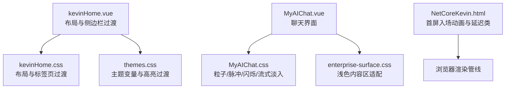
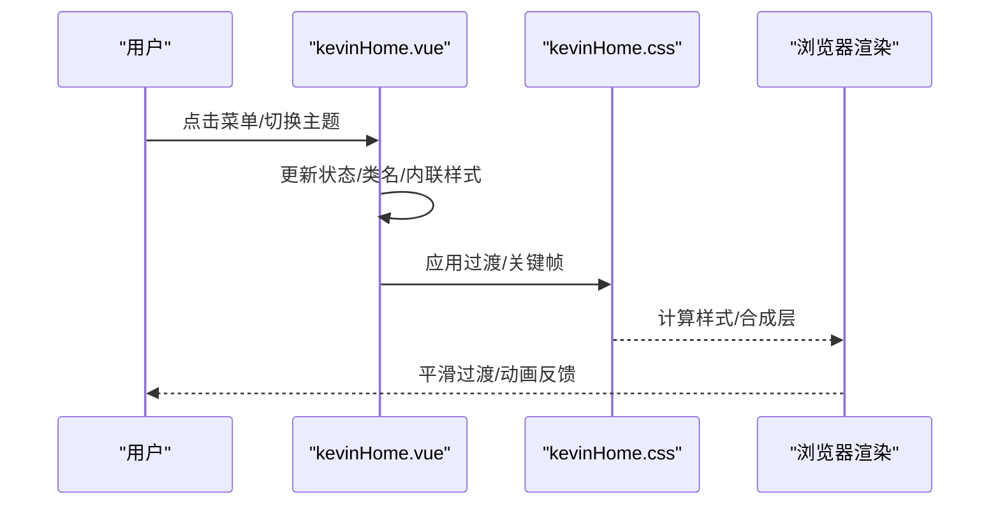
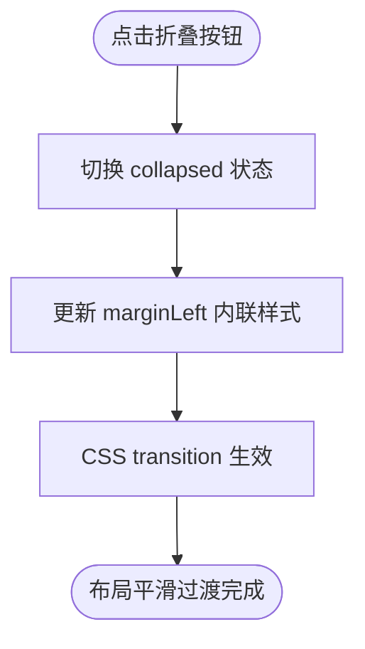
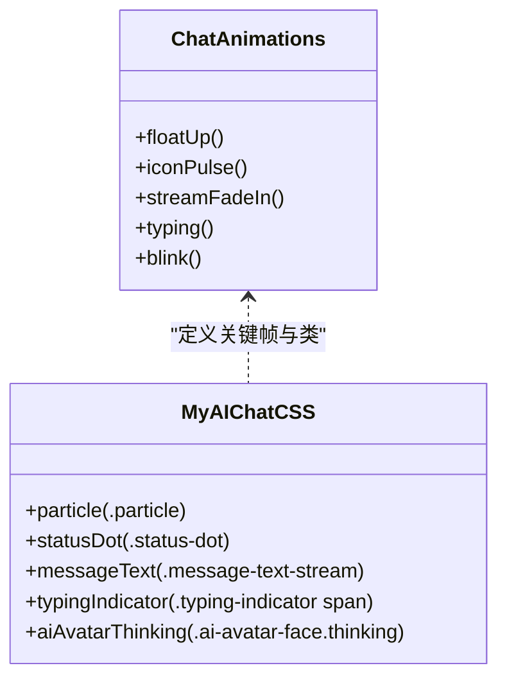
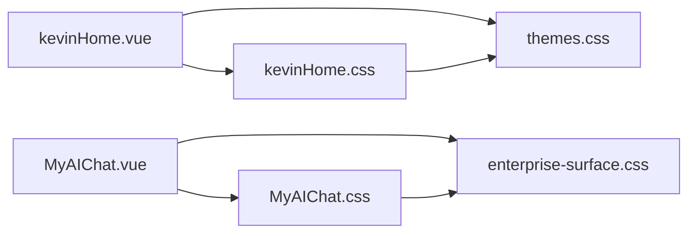

# 动画效果

<cite>
**本文引用的文件**
- [MyAIChat.css](file://vue/kevin.web.vue/src/css/MyAIChat.css)
- [kevinHome.css](file://vue/kevin.web.vue/src/css/kevinHome.css)
- [themes.css](file://vue/kevin.web.vue/src/css/themes.css)
- [enterprise-surface.css](file://vue/kevin.web.vue/src/css/enterprise-surface.css)
- [buttons.css](file://vue/kevin.web.vue/src/css/buttons.css)
- [kevinHome.vue](file://vue/kevin.web.vue/src/pages/kevinHome.vue)
- [MyAIChat.vue](file://vue/kevin.web.vue/src/pages/ai/MyAIChat.vue)
- [NetCoreKevin.html](file://vue/kevin.web.vue/public/NetCoreKevin.html)
</cite>

## 目录
1. [简介](#简介)
2. [项目结构](#项目结构)
3. [核心组件](#核心组件)
4. [架构总览](#架构总览)
5. [详细组件分析](#详细组件分析)
6. [依赖关系分析](#依赖关系分析)
7. [性能考量](#性能考量)
8. [故障排查指南](#故障排查指南)
9. [结论](#结论)
10. [附录](#附录)

## 简介
本文件聚焦 NetCoreKevin 前端（Vue）的动画与过渡实现，覆盖页面切换、元素显示隐藏、状态变化的 CSS3 动画与过渡；总结微交互、反馈动画与用户引导动画的设计原则；给出硬件加速、节流与内存管理的优化建议；说明可访问性（减少动画选项）与无障碍支持；提供调试工具与性能监控方法；并补充现代浏览器兼容性与降级方案。

## 项目结构
前端动画相关代码主要分布在以下位置：
- 样式层：CSS 动画与过渡集中在 css 目录，如聊天界面的粒子背景、脉冲、闪烁等关键帧动画，以及全局主题变量与按钮交互过渡。
- 视图层：页面级组件通过内联样式或类名触发过渡，例如侧边栏折叠展开的 margin-left 过渡。
- 公共入口：public 下的静态 HTML 包含基础入场动画与延迟类，用于首屏加载体验。

图表来源
- [kevinHome.vue:48-54](file://vue/kevin.web.vue/src/pages/kevinHome.vue#L48-L54)
- [kevinHome.css:281-387](file://vue/kevin.web.vue/src/css/kevinHome.css#L281-L387)
- [themes.css:1-378](file://vue/kevin.web.vue/src/css/themes.css#L1-L378)
- [MyAIChat.vue:1-200](file://vue/kevin.web.vue/src/pages/ai/MyAIChat.vue#L1-L200)
- [MyAIChat.css:1-800](file://vue/kevin.web.vue/src/css/MyAIChat.css#L1-L800)
- [enterprise-surface.css:1-327](file://vue/kevin.web.vue/src/css/enterprise-surface.css#L1-L327)
- [NetCoreKevin.html:28-55](file://vue/kevin.web.vue/public/NetCoreKevin.html#L28-L55)

章节来源
- [kevinHome.vue:48-54](file://vue/kevin.web.vue/src/pages/kevinHome.vue#L48-L54)
- [kevinHome.css:281-387](file://vue/kevin.web.vue/src/css/kevinHome.css#L281-L387)
- [MyAIChat.css:1-800](file://vue/kevin.web.vue/src/css/MyAIChat.css#L1-L800)
- [NetCoreKevin.html:28-55](file://vue/kevin.web.vue/public/NetCoreKevin.html#L28-L55)

## 核心组件
- 侧边栏折叠/展开过渡：通过动态设置 margin-left 并配合 transition，实现平滑的布局变化。
- 聊天界面动画：
  - 粒子背景：使用 @keyframes 实现上浮与缩放，营造科技感。
  - 图标脉冲：iconPulse 关键帧用于头像/状态指示器呼吸感。
  - 消息流式淡入：streamFadeIn 为逐条消息出现提供柔和过渡。
  - 打字指示器：typing 关键帧模拟“正在输入”的跳动点。
  - AI 头像眨眼：blink 关键帧在思考态下产生眨眼效果。
- 主题与交互过渡：按钮悬停、输入框聚焦、菜单项选中态均使用 transition 提升反馈。
- 首屏入场动画：静态 HTML 中定义 fade-in-up 与 delay-* 类，用于渐进式展示。

章节来源
- [kevinHome.vue:48-54](file://vue/kevin.web.vue/src/pages/kevinHome.vue#L48-L54)
- [MyAIChat.css:33-48](file://vue/kevin.web.vue/src/css/MyAIChat.css#L33-L48)
- [MyAIChat.css:103-112](file://vue/kevin.web.vue/src/css/MyAIChat.css#L103-L112)
- [MyAIChat.css:609-612](file://vue/kevin.web.vue/src/css/MyAIChat.css#L609-L612)
- [MyAIChat.css:672-681](file://vue/kevin.web.vue/src/css/MyAIChat.css#L672-L681)
- [MyAIChat.css:538-541](file://vue/kevin.web.vue/src/css/MyAIChat.css#L538-L541)
- [buttons.css:22-57](file://vue/kevin.web.vue/src/css/buttons.css#L22-L57)
- [NetCoreKevin.html:28-55](file://vue/kevin.web.vue/public/NetCoreKevin.html#L28-L55)

## 架构总览
从渲染到交互的动画链路如下：
- 用户操作（点击菜单/切换主题/发送消息）触发 Vue 数据更新。
- 视图层根据数据变化添加/移除类或修改内联样式。
- CSS 过渡与关键帧动画由浏览器合成线程执行，完成视觉反馈。
- 复杂场景（如大量粒子）需考虑性能与可访问性策略。

图表来源
- [kevinHome.vue:48-54](file://vue/kevin.web.vue/src/pages/kevinHome.vue#L48-L54)
- [kevinHome.css:281-387](file://vue/kevin.web.vue/src/css/kevinHome.css#L281-L387)

## 详细组件分析

### 侧边栏折叠/展开过渡
- 实现方式：通过动态绑定 style.marginLeft 并使用 transition 属性，实现宽度变化时的平滑过渡。
- 设计要点：
  - 使用 transform 或 margin 均可，但需注意重排与重绘成本；此处采用 margin-left 过渡，适合简单布局切换。
  - 保持过渡时长适中（约 0.3s），避免过长影响交互节奏。
- 可访问性：确保键盘导航与焦点可见；不依赖纯视觉提示。

图表来源
- [kevinHome.vue:48-54](file://vue/kevin.web.vue/src/pages/kevinHome.vue#L48-L54)

章节来源
- [kevinHome.vue:48-54](file://vue/kevin.web.vue/src/pages/kevinHome.vue#L48-L54)

### 聊天界面动画（粒子/脉冲/闪烁/流式淡入/打字指示器）
- 粒子背景：
  - 使用 @keyframes floatUp 控制粒子从底部上浮至顶部并缩放消失，营造空间感。
  - 注意粒子数量与层级，避免过多 DOM 节点导致卡顿。
- 图标脉冲：
  - iconPulse 关键帧用于头像/状态点的呼吸效果，增强在线感知。
- 消息流式淡入：
  - streamFadeIn 为新增消息提供淡入过渡，提升阅读流畅度。
- 打字指示器：
  - typing 关键帧模拟三点跳动的“正在输入”状态，提供即时反馈。
- AI 头像眨眼：
  - blink 关键帧在“思考”状态下使眼睛 scaleY 变化，传达处理中的状态。

图表来源
- [MyAIChat.css:33-48](file://vue/kevin.web.vue/src/css/MyAIChat.css#L33-L48)
- [MyAIChat.css:103-112](file://vue/kevin.web.vue/src/css/MyAIChat.css#L103-L112)
- [MyAIChat.css:609-612](file://vue/kevin.web.vue/src/css/MyAIChat.css#L609-L612)
- [MyAIChat.css:672-681](file://vue/kevin.web.vue/src/css/MyAIChat.css#L672-L681)
- [MyAIChat.css:538-541](file://vue/kevin.web.vue/src/css/MyAIChat.css#L538-L541)

章节来源
- [MyAIChat.css:33-48](file://vue/kevin.web.vue/src/css/MyAIChat.css#L33-L48)
- [MyAIChat.css:103-112](file://vue/kevin.web.vue/src/css/MyAIChat.css#L103-L112)
- [MyAIChat.css:609-612](file://vue/kevin.web.vue/src/css/MyAIChat.css#L609-L612)
- [MyAIChat.css:672-681](file://vue/kevin.web.vue/src/css/MyAIChat.css#L672-L681)
- [MyAIChat.css:538-541](file://vue/kevin.web.vue/src/css/MyAIChat.css#L538-L541)

### 主题与交互过渡
- 按钮与输入框：
  - 使用 transition 实现悬停、聚焦状态的平滑颜色与阴影变化。
  - 强调色通过 CSS 变量统一管理，便于主题切换时保持一致的动效节奏。
- 标签页导航：
  - tab-item 的 hover 与 active 状态使用 transition，提升切换反馈。

章节来源
- [buttons.css:22-57](file://vue/kevin.web.vue/src/css/buttons.css#L22-L57)
- [kevinHome.css:281-387](file://vue/kevin.web.vue/src/css/kevinHome.css#L281-L387)
- [themes.css:1-378](file://vue/kevin.web.vue/src/css/themes.css#L1-L378)

### 首屏入场动画
- 静态 HTML 中定义了 fade-in-up 关键帧与 delay-* 类，用于首屏元素的渐入与延迟展示，提升加载体验。
- 适用于非关键路径的装饰性元素，避免阻塞首屏渲染。

章节来源
- [NetCoreKevin.html:28-55](file://vue/kevin.web.vue/public/NetCoreKevin.html#L28-L55)

## 依赖关系分析
- kevinHome.vue 依赖 kevinHome.css 与 themes.css 提供的布局与主题变量，并通过内联样式触发过渡。
- MyAIChat.vue 依赖 MyAIChat.css 的动画关键帧与 enterprise-surface.css 的浅色适配，确保在不同内容区域中视觉一致。
- 公共样式（buttons.css）统一按钮与表单控件的过渡行为，降低重复代码。

图表来源
- [kevinHome.vue:48-54](file://vue/kevin.web.vue/src/pages/kevinHome.vue#L48-L54)
- [kevinHome.css:281-387](file://vue/kevin.web.vue/src/css/kevinHome.css#L281-L387)
- [themes.css:1-378](file://vue/kevin.web.vue/src/css/themes.css#L1-L378)
- [MyAIChat.vue:1-200](file://vue/kevin.web.vue/src/pages/ai/MyAIChat.vue#L1-L200)
- [MyAIChat.css:1-800](file://vue/kevin.web.vue/src/css/MyAIChat.css#L1-L800)
- [enterprise-surface.css:1-327](file://vue/kevin.web.vue/src/css/enterprise-surface.css#L1-L327)

章节来源
- [kevinHome.vue:48-54](file://vue/kevin.web.vue/src/pages/kevinHome.vue#L48-L54)
- [MyAIChat.vue:1-200](file://vue/kevin.web.vue/src/pages/ai/MyAIChat.vue#L1-L200)

## 性能考量
- 硬件加速：
  - 优先使用 transform 与 opacity 进行动画，利用 GPU 合成层，减少重排与重绘。
  - 当前实现中多处使用 transform（translate/scale）与 opacity，符合最佳实践。
- 动画节流：
  - 对高频事件（滚动、输入）触发的动画应进行节流或防抖，避免频繁样式计算。
  - 聊天消息列表滚动时，避免在滚动回调中创建/销毁大量 DOM；可使用虚拟滚动或分页加载。
- 内存管理：
  - 粒子背景应避免无限制增长，必要时复用节点或限制最大数量。
  - 动画结束后及时移除监听器与定时器，防止内存泄漏。
- 可访问性：
  - 尊重系统“减少动画”偏好，可通过媒体查询或 JS 检测禁用非必要动画。
  - 为关键状态变化提供非动画的替代提示（如文本、声音）。

[本节为通用指导，不直接分析具体文件]

## 故障排查指南
- 动画卡顿：
  - 检查是否触发了重排/重绘（如改变 width/height/top/left），尽量改用 transform/opacity。
  - 使用浏览器性能面板记录帧率，定位耗时动画。
- 动画不生效：
  - 确认类名是否正确绑定，transition 属性是否被覆盖。
  - 检查父容器 overflow 与 z-index 是否遮挡。
- 主题切换后样式异常：
  - 确认 themes.css 变量已正确注入，enterprise-surface.css 的覆盖规则优先级合理。
- 首屏动画阻塞：
  - 将入场动画置于非关键路径，避免阻塞首屏渲染。

章节来源
- [kevinHome.css:281-387](file://vue/kevin.web.vue/src/css/kevinHome.css#L281-L387)
- [MyAIChat.css:1-800](file://vue/kevin.web.vue/src/css/MyAIChat.css#L1-L800)
- [themes.css:1-378](file://vue/kevin.web.vue/src/css/themes.css#L1-L378)
- [NetCoreKevin.html:28-55](file://vue/kevin.web.vue/public/NetCoreKevin.html#L28-L55)

## 结论
本项目在前端动画方面采用了成熟的 CSS3 关键帧与过渡技术，覆盖了页面切换、元素显隐与状态变化的常见场景。通过合理的硬件加速、节流与内存管理策略，保证了动画的流畅性与性能。同时，结合主题系统与可访问性考虑，提供了良好的用户体验与兼容性。建议在后续迭代中继续优化复杂动画的性能，并完善减少动画选项的支持。

[本节为总结，不直接分析具体文件]

## 附录
- 调试工具：
  - 浏览器开发者工具的“性能”与“渲染”面板，用于记录帧率与绘制热点。
  - “元素”面板查看 computed styles 与 transitions 生效情况。
- 性能监控：
  - 使用 Performance API 测量长任务与主线程占用。
  - 对动画密集区域进行采样，评估 FPS 与掉帧原因。
- 兼容性与降级：
  - 对于不支持某些 CSS 特性的旧浏览器，提供静态样式作为降级。
  - 使用特性检测决定是否启用高级动画。

[本节为通用指导，不直接分析具体文件]