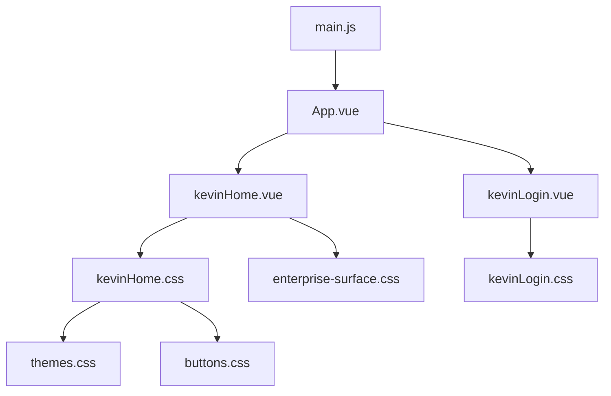
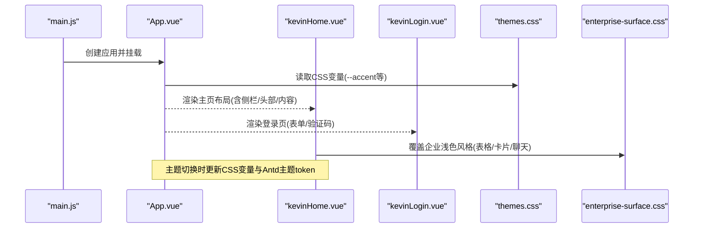
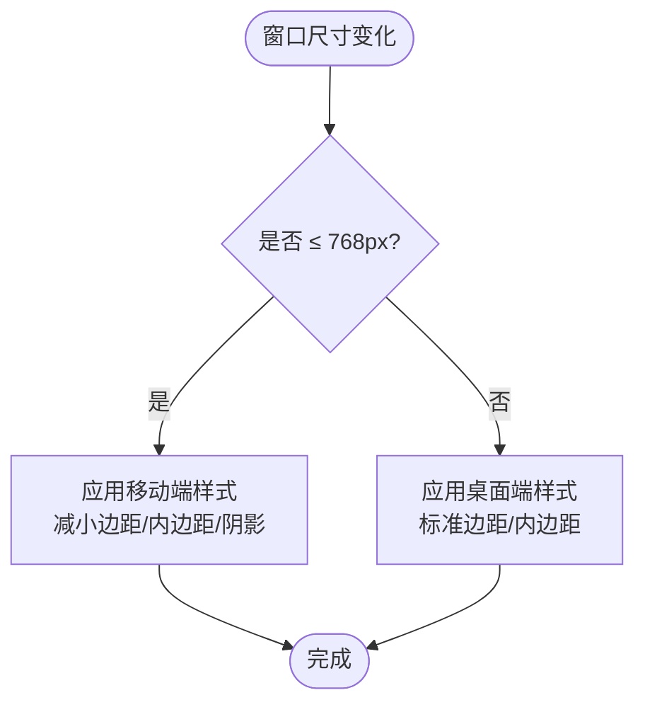
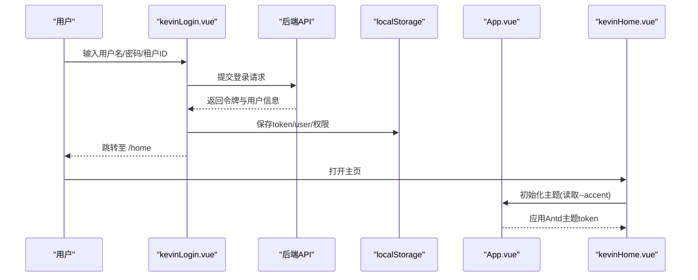
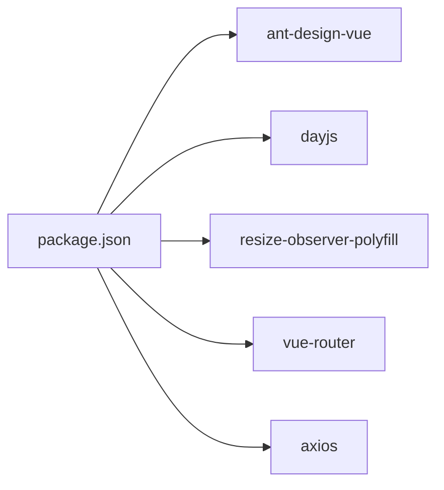

# 响应式设计

<cite>
**本文引用的文件**
- [main.js](file://vue/kevin.web.vue/src/main.js)
- [App.vue](file://vue/kevin.web.vue/src/App.vue)
- [kevinHome.vue](file://vue/kevin.web.vue/src/pages/kevinHome.vue)
- [kevinLogin.vue](file://vue/kevin.web.vue/src/pages/kevinLogin.vue)
- [themes.css](file://vue/kevin.web.vue/src/css/themes.css)
- [buttons.css](file://vue/kevin.web.vue/src/css/buttons.css)
- [enterprise-surface.css](file://vue/kevin.web.vue/src/css/enterprise-surface.css)
- [kevinHome.css](file://vue/kevin.web.vue/src/css/kevinHome.css)
- [kevinLogin.css](file://vue/kevin.web.vue/src/css/kevinLogin.css)
- [package.json](file://vue/kevin.web.vue/package.json)
- [vue.config.js](file://vue/kevin.web.vue/vue.config.js)
</cite>

## 目录
1. [简介](#简介)
2. [项目结构](#项目结构)
3. [核心组件](#核心组件)
4. [架构总览](#架构总览)
5. [详细组件分析](#详细组件分析)
6. [依赖关系分析](#依赖关系分析)
7. [性能考量](#性能考量)
8. [故障排查指南](#故障排查指南)
9. [结论](#结论)
10. [附录](#附录)

## 简介
本文件聚焦 NetCoreKevin 前端（Vue3 + Ant Design Vue）的响应式设计与移动端适配策略，系统说明断点与布局调整、弹性布局与网格使用、触摸交互优化、响应式图片与媒体查询最佳实践、移动端性能优化以及跨设备兼容性测试与调试方法。文档基于仓库中的实际源码与样式文件进行分析与总结，确保内容可追溯、可落地。

## 项目结构
前端位于 vue/kevin.web.vue 目录，采用 Vue 3 单页应用结构：
- 入口与全局配置：main.js、App.vue、vue.config.js、package.json
- 页面与路由：pages/*（如 kevinHome.vue、kevinLogin.vue）
- 样式体系：css/*（主题变量、按钮样式、企业风覆盖、登录与主页样式等）
- 第三方库：Ant Design Vue、dayjs、resize-observer-polyfill 等

图表来源
- [main.js:1-20](file://vue/kevin.web.vue/src/main.js#L1-L20)
- [App.vue:1-53](file://vue/kevin.web.vue/src/App.vue#L1-L53)
- [kevinHome.vue:1-681](file://vue/kevin.web.vue/src/pages/kevinHome.vue#L1-L681)
- [kevinLogin.vue:1-343](file://vue/kevin.web.vue/src/pages/kevinLogin.vue#L1-L343)
- [kevinHome.css:1-387](file://vue/kevin.web.vue/src/css/kevinHome.css#L1-L387)
- [kevinLogin.css:1-255](file://vue/kevin.web.vue/src/css/kevinLogin.css#L1-L255)
- [themes.css:1-378](file://vue/kevin.web.vue/src/css/themes.css#L1-L378)
- [buttons.css:1-99](file://vue/kevin.web.vue/src/css/buttons.css#L1-L99)
- [enterprise-surface.css:1-327](file://vue/kevin.web.vue/src/css/enterprise-surface.css#L1-L327)

章节来源
- [main.js:1-20](file://vue/kevin.web.vue/src/main.js#L1-L20)
- [App.vue:1-53](file://vue/kevin.web.vue/src/App.vue#L1-L53)
- [package.json:1-68](file://vue/kevin.web.vue/package.json#L1-L68)
- [vue.config.js:1-21](file://vue/kevin.web.vue/vue.config.js#L1-L21)

## 核心组件
- 应用壳层 App.vue：通过 a-config-provider 注入 Ant Design 主题 token，并动态读取 CSS 变量 --accent 以统一强调色；设置全局字体与最小高度，保证移动端基础渲染稳定。
- 首页布局 kevinHome.vue：基于 Ant Design Layout 构建侧边栏+头部+内容区+底部，支持折叠侧栏、标签页导航、全屏切换、主题切换与用户菜单。
- 登录页 kevinLogin.vue：表单式登录，包含密码登录与验证码登录两种模式，提供本地存储“记住我”能力。
- 主题与样式：themes.css 定义多套主题变量；buttons.css 统一按钮、输入框、选择器等控件焦点态；enterprise-surface.css 对表格、卡片、聊天界面进行企业浅色风格覆盖；kevinHome.css 与 kevinLogin.css 分别承载主页与登录页的布局与响应式规则。

章节来源
- [App.vue:1-53](file://vue/kevin.web.vue/src/App.vue#L1-L53)
- [kevinHome.vue:1-681](file://vue/kevin.web.vue/src/pages/kevinHome.vue#L1-L681)
- [kevinLogin.vue:1-343](file://vue/kevin.web.vue/src/pages/kevinLogin.vue#L1-L343)
- [themes.css:1-378](file://vue/kevin.web.vue/src/css/themes.css#L1-L378)
- [buttons.css:1-99](file://vue/kevin.web.vue/src/css/buttons.css#L1-L99)
- [enterprise-surface.css:1-327](file://vue/kevin.web.vue/src/css/enterprise-surface.css#L1-L327)
- [kevinHome.css:1-387](file://vue/kevin.web.vue/src/css/kevinHome.css#L1-L387)
- [kevinLogin.css:1-255](file://vue/kevin.web.vue/src/css/kevinLogin.css#L1-L255)

## 架构总览
下图展示从入口到页面与样式的加载链路，以及主题变量在运行时的生效方式。

图表来源
- [main.js:1-20](file://vue/kevin.web.vue/src/main.js#L1-L20)
- [App.vue:1-53](file://vue/kevin.web.vue/src/App.vue#L1-L53)
- [kevinHome.vue:1-681](file://vue/kevin.web.vue/src/pages/kevinHome.vue#L1-L681)
- [kevinLogin.vue:1-343](file://vue/kevin.web.vue/src/pages/kevinLogin.vue#L1-L343)
- [themes.css:1-378](file://vue/kevin.web.vue/src/css/themes.css#L1-L378)
- [enterprise-surface.css:1-327](file://vue/kevin.web.vue/src/css/enterprise-surface.css#L1-L327)

## 详细组件分析

### 移动端适配策略与断点设计
- 断点定义
  - 主页布局在 768px 以下触发紧凑模式：减小侧边阴影、头部内边距、内容区外边距与内边距，提升小屏阅读密度。
  - 登录页在 480px 以下进入超小屏模式：卡片内边距缩小、标题字号减小、验证码区域由横向改为纵向堆叠，按钮全宽显示。
- 布局调整要点
  - 侧边栏固定定位与宽度：在桌面端保持 256px 宽度，折叠后主内容区 margin-left 自动收缩为 80px，避免在小屏出现横向滚动。
  - 头部工具栏：图标间距与点击热区满足手指操作需求，必要时可通过媒体查询进一步增大点击区域。
  - 内容区：使用 flex 纵向布局，确保 footer 始终贴底，内容自适应填充。

图表来源
- [kevinHome.css:263-279](file://vue/kevin.web.vue/src/css/kevinHome.css#L263-L279)
- [kevinLogin.css:233-249](file://vue/kevin.web.vue/src/css/kevinLogin.css#L233-L249)

章节来源
- [kevinHome.css:263-279](file://vue/kevin.web.vue/src/css/kevinHome.css#L263-L279)
- [kevinLogin.css:233-249](file://vue/kevin.web.vue/src/css/kevinLogin.css#L233-L249)

### 弹性布局与网格系统的使用
- 弹性布局（Flexbox）
  - 主页布局容器 main-layout 使用 flex-direction: column，使 header/content/footer 纵向排列，footer 始终贴底。
  - 头部左右区域使用 justify-content: space-between 与 align-items: center，保证图标与用户信息对齐。
  - 侧边栏菜单容器 menu-wrapper 使用 flex 纵向布局并限制高度，配合 overflow-y 实现滚动。
- 网格系统
  - 未引入独立栅格库，主要依赖 Ant Design 的 Row/Col 或自定义 Flex 布局。当前代码中更多采用 Flex 组合实现响应式排布，便于在小屏下自由堆叠。
- 自适应界面
  - 通过 CSS 变量集中管理主题色与背景，结合媒体查询在不同断点切换布局参数，达到“一套代码、多端适配”。

章节来源
- [kevinHome.css:11-239](file://vue/kevin.web.vue/src/css/kevinHome.css#L11-L239)
- [themes.css:3-19](file://vue/kevin.web.vue/src/css/themes.css#L3-L19)
- [buttons.css:22-99](file://vue/kevin.web.vue/src/css/buttons.css#L22-L99)

### 触摸交互优化
- 手势支持与反馈
  - 侧边栏折叠按钮 trigger 具备 hover 高亮与过渡动画，提升点击反馈。
  - 登录页验证码按钮禁用态与倒计时逻辑清晰，避免重复点击。
- 移动端输入优化
  - 表单元素使用 size="large" 增大触控热区，输入框前缀图标增强识别度。
  - 通过 focus 状态的高亮边框与柔和阴影，明确当前输入焦点。
- 注意事项
  - 对于复杂手势（如滑动关闭侧栏），可在后续版本引入轻量手势库或原生 touchstart/touchmove/touchend 事件处理，以提升体验。

章节来源
- [kevinHome.vue:56-67](file://vue/kevin.web.vue/src/pages/kevinHome.vue#L56-L67)
- [kevinLogin.vue:12-153](file://vue/kevin.web.vue/src/pages/kevinLogin.vue#L12-L153)
- [kevinLogin.css:139-172](file://vue/kevin.web.vue/src/css/kevinLogin.css#L139-L172)

### 响应式图片与媒体查询最佳实践
- 图片与 Logo
  - 使用 object-fit: contain 确保 Logo 在不同容器中不变形，同时控制宽高比。
- 媒体查询
  - 在 kevinHome.css 与 kevinLogin.css 中使用 @media (max-width: ...) 针对小屏进行边距、字号、布局方向调整。
- 建议
  - 为不同分辨率准备合适尺寸的图片资源，或使用 srcset/picture 标签进一步优化加载体积（当前代码未使用，可作为后续优化项）。

章节来源
- [kevinHome.css:46-50](file://vue/kevin.web.vue/src/css/kevinHome.css#L46-L50)
- [kevinHome.css:263-279](file://vue/kevin.web.vue/src/css/kevinHome.css#L263-L279)
- [kevinLogin.css:233-249](file://vue/kevin.web.vue/src/css/kevinLogin.css#L233-L249)

### 主题系统与颜色变量
- 主题变量
  - themes.css 定义了页面背景、侧栏背景、强调色、文本色、边框色等变量，并通过 .theme-* 类名切换主题。
- 运行时主题
  - App.vue 通过 Ant Design 的 theme.token 注入 colorPrimary，并监听 CSS 变量 --accent 的变化，实现主题色联动。
- 企业风覆盖
  - enterprise-surface.css 对表格、卡片、聊天界面进行浅色风格覆盖，确保业务页面在浅色内容区内可读性一致。

章节来源
- [themes.css:1-378](file://vue/kevin.web.vue/src/css/themes.css#L1-L378)
- [App.vue:11-40](file://vue/kevin.web.vue/src/App.vue#L11-L40)
- [enterprise-surface.css:1-327](file://vue/kevin.web.vue/src/css/enterprise-surface.css#L1-L327)

### 关键流程时序图（登录与主题切换）

图表来源
- [kevinLogin.vue:240-314](file://vue/kevin.web.vue/src/pages/kevinLogin.vue#L240-L314)
- [App.vue:11-40](file://vue/kevin.web.vue/src/App.vue#L11-L40)
- [kevinHome.vue:596-601](file://vue/kevin.web.vue/src/pages/kevinHome.vue#L596-L601)

## 依赖关系分析
- 运行时依赖
  - ant-design-vue：UI 组件与主题系统
  - dayjs：日期格式化与本地化（中文）
  - resize-observer-polyfill：兼容 ResizeObserver，用于响应式计算
- 构建与开发
  - @vue/cli-service：构建与开发服务器
  - eslint/babel：代码规范与转译
  - browserslist：目标浏览器范围（排除 IE11）

图表来源
- [package.json:16-46](file://vue/kevin.web.vue/package.json#L16-L46)

章节来源
- [package.json:16-46](file://vue/kevin.web.vue/package.json#L16-L46)
- [main.js:1-20](file://vue/kevin.web.vue/src/main.js#L1-L20)

## 性能考量
- 资源加载优化
  - 启用 transpileDependencies 简化第三方库转译成本（vue.config.js）。
  - 使用按需引入或 Tree-shaking 减少包体（当前已使用 ant-design-vue 4.x，建议继续评估按需引入）。
  - 图片资源建议使用合适尺寸与格式（如 WebP），并在未来引入 srcset/picture。
- 渲染性能提升
  - 使用 CSS 变量与主题 token 减少重绘与回流。
  - 列表与表格数据分页加载，避免一次性渲染大量节点。
  - 使用 ResizeObserver 监听容器尺寸变化，谨慎节流以避免频繁计算。
- 网络与缓存
  - 生产环境开启 gzip/brotli 压缩（构建工具默认支持）。
  - 合理设置静态资源缓存策略（CDN 与 Cache-Control）。

[本节为通用指导，不直接分析具体文件]

## 故障排查指南
- 主题色不生效
  - 检查 App.vue 是否正确读取 --accent 并更新 Antd 主题 token。
  - 确认 themes.css 中对应主题类名已正确应用到根容器。
- 小屏布局异常
  - 检查 kevinHome.css 与 kevinLogin.css 的媒体查询断点是否与预期一致。
  - 验证侧边栏折叠逻辑与主内容区 margin-left 的计算是否正确。
- 输入框焦点态不明显
  - 检查 buttons.css 中对 ant-input:focus 的样式覆盖是否生效。
- 验证码按钮状态异常
  - 检查 kevinLogin.vue 中倒计时逻辑与 disabled 状态绑定。

章节来源
- [App.vue:11-40](file://vue/kevin.web.vue/src/App.vue#L11-L40)
- [kevinHome.css:263-279](file://vue/kevin.web.vue/src/css/kevinHome.css#L263-L279)
- [kevinLogin.css:233-249](file://vue/kevin.web.vue/src/css/kevinLogin.css#L233-L249)
- [buttons.css:46-99](file://vue/kevin.web.vue/src/css/buttons.css#L46-L99)
- [kevinLogin.vue:203-237](file://vue/kevin.web.vue/src/pages/kevinLogin.vue#L203-L237)

## 结论
本项目通过 CSS 变量与主题类名实现了灵活的主题切换，借助 Ant Design 的布局组件与 Flexbox 构建了可扩展的主页框架，并在关键断点处进行了移动端适配。登录页在小屏下提供了友好的表单体验。后续可进一步增强手势交互、图片响应式加载与性能监控，以提升整体用户体验与可维护性。

[本节为总结性内容，不直接分析具体文件]

## 附录
- 开发服务器代理配置：vue.config.js 中配置了 /VarApi 的代理转发，便于本地联调。
- 浏览器兼容性：browserslist 排除了 IE11，确保现代特性可用。

章节来源
- [vue.config.js:5-18](file://vue/kevin.web.vue/vue.config.js#L5-L18)
- [package.json:61-66](file://vue/kevin.web.vue/package.json#L61-L66)