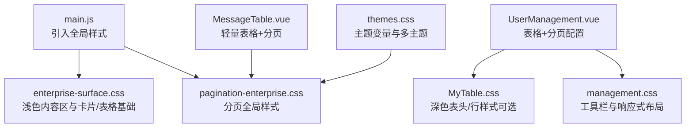
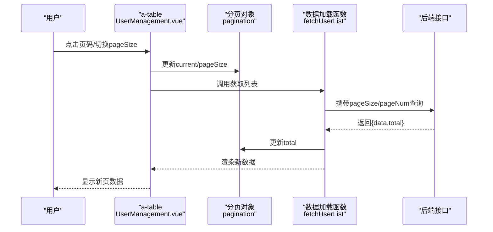
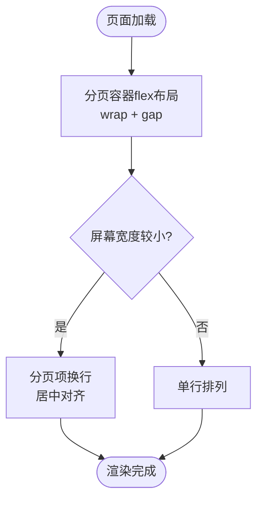
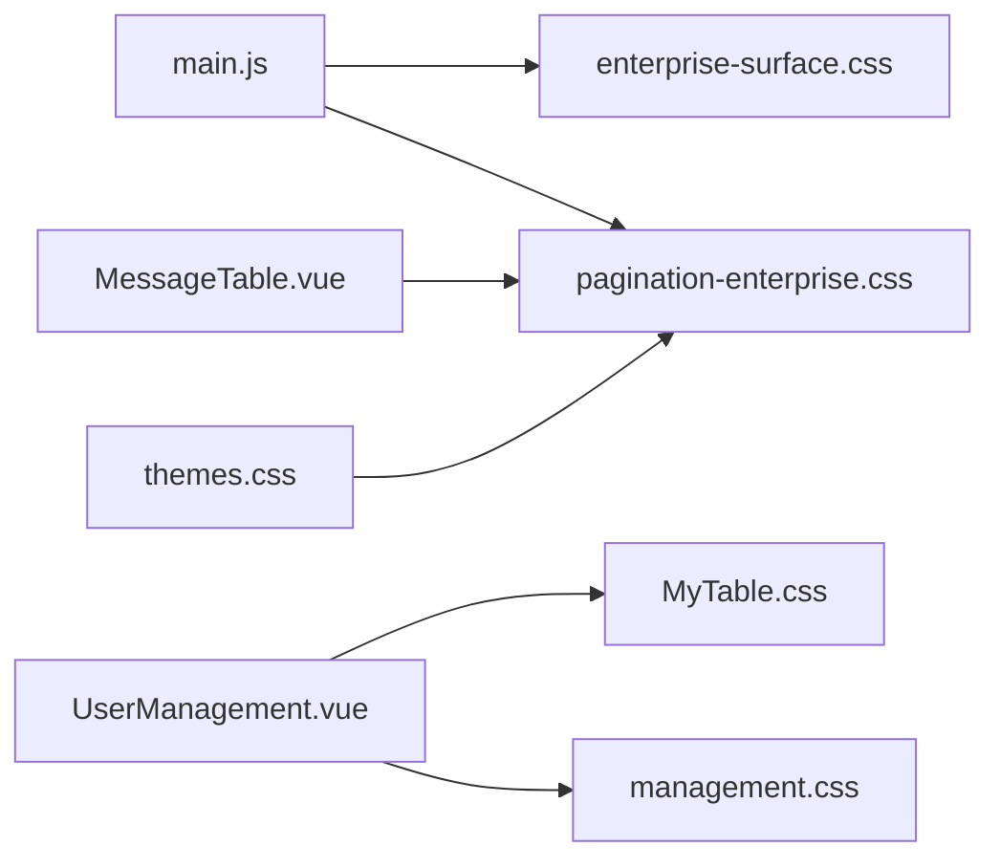

# 分页样式

<cite>
**本文引用的文件**
- [pagination-enterprise.css](file://vue/kevin.web.vue/src/css/pagination-enterprise.css)
- [enterprise-surface.css](file://vue/kevin.web.vue/src/css/enterprise-surface.css)
- [themes.css](file://vue/kevin.web.vue/src/css/themes.css)
- [main.js](file://vue/kevin.web.vue/src/main.js)
- [UserManagement.vue](file://vue/kevin.web.vue/src/components/UserManagement.vue)
- [MessageTable.vue](file://vue/kevin.web.vue/src/components/MessageTable.vue)
- [MyTable.css](file://vue/kevin.web.vue/src/css/MyTable.css)
- [management.css](file://vue/kevin.web.vue/src/css/management.css)
</cite>

## 目录
1. [简介](#简介)
2. [项目结构](#项目结构)
3. [核心组件](#核心组件)
4. [架构总览](#架构总览)
5. [详细组件分析](#详细组件分析)
6. [依赖关系分析](#依赖关系分析)
7. [性能考量](#性能考量)
8. [故障排查指南](#故障排查指南)
9. [结论](#结论)
10. [附录](#附录)

## 简介
本文件聚焦企业级分页器的样式实现与用户体验设计，覆盖按钮状态（当前页、禁用、悬停）、响应式布局与移动端适配、分页信息展示格式与交互反馈、大数据量场景的性能优化建议，以及主题定制与品牌化改造方法。文档基于仓库中实际的前端代码与样式文件进行说明，确保可追溯与可落地。

## 项目结构
分页样式由全局样式与业务组件共同构成：
- 全局样式统一了 Ant Design Vue 的分页外观，包括容器、页码项、跳转、总数文本、每页条数选择器等。
- 业务组件通过配置分页对象与表格事件，驱动分页交互与数据刷新。
- 主题变量提供强调色与中性色，便于品牌化替换。

图表来源
- [main.js:1-20](file://vue/kevin.web.vue/src/main.js#L1-L20)
- [enterprise-surface.css:1-120](file://vue/kevin.web.vue/src/css/enterprise-surface.css#L1-L120)
- [pagination-enterprise.css:1-135](file://vue/kevin.web.vue/src/css/pagination-enterprise.css#L1-L135)
- [UserManagement.vue:58-67](file://vue/kevin.web.vue/src/components/UserManagement.vue#L58-L67)
- [MyTable.css:1-76](file://vue/kevin.web.vue/src/css/MyTable.css#L1-L76)
- [management.css:1-177](file://vue/kevin.web.vue/src/css/management.css#L1-L177)
- [MessageTable.vue:1-39](file://vue/kevin.web.vue/src/components/MessageTable.vue#L1-L39)
- [themes.css:1-378](file://vue/kevin.web.vue/src/css/themes.css#L1-L378)

章节来源
- [main.js:1-20](file://vue/kevin.web.vue/src/main.js#L1-L20)
- [pagination-enterprise.css:1-135](file://vue/kevin.web.vue/src/css/pagination-enterprise.css#L1-L135)
- [enterprise-surface.css:1-120](file://vue/kevin.web.vue/src/css/enterprise-surface.css#L1-L120)
- [UserManagement.vue:315-325](file://vue/kevin.web.vue/src/components/UserManagement.vue#L315-L325)
- [MessageTable.vue:1-39](file://vue/kevin.web.vue/src/components/MessageTable.vue#L1-L39)
- [themes.css:1-378](file://vue/kevin.web.vue/src/css/themes.css#L1-L378)

## 核心组件
- 全局分页样式：统一 Ant Design 分页的容器、页码、跳转、总数、每页条数选择器样式，并覆盖禁用态与激活态。
- 业务分页配置：在表格组件中声明分页对象，包含当前页、每页条数、总数、是否显示大小切换、快速跳转、总数文案与布局。
- 主题变量：通过 CSS 变量定义强调色与中性色，支持多主题切换，影响分页激活色等视觉元素。

章节来源
- [pagination-enterprise.css:12-135](file://vue/kevin.web.vue/src/css/pagination-enterprise.css#L12-L135)
- [UserManagement.vue:315-325](file://vue/kevin.web.vue/src/components/UserManagement.vue#L315-L325)
- [themes.css:1-30](file://vue/kevin.web.vue/src/css/themes.css#L1-L30)

## 架构总览
分页样式与交互的整体流程如下：
- 应用启动时引入全局样式，奠定分页的基础外观。
- 业务表格组件绑定分页对象与 change 事件，用户点击页码或切换每页条数时触发回调。
- 回调更新分页状态并请求后端数据，成功后回填总数与列表，完成一次分页刷新。
- 主题变量决定激活色与强调色，保证品牌一致性。

图表来源
- [UserManagement.vue:58-67](file://vue/kevin.web.vue/src/components/UserManagement.vue#L58-L67)
- [UserManagement.vue:315-325](file://vue/kevin.web.vue/src/components/UserManagement.vue#L315-L325)
- [UserManagement.vue:374-429](file://vue/kevin.web.vue/src/components/UserManagement.vue#L374-L429)
- [UserManagement.vue:507-516](file://vue/kevin.web.vue/src/components/UserManagement.vue#L507-L516)

## 详细组件分析

### 分页按钮状态样式
- 当前页：页码项边框与文字使用强调色，突出当前所在页。
- 禁用态：首页/末页或无数据时，上一页/下一页与不可用页码呈现低对比度背景与弱化文字，避免误操作。
- 悬停效果：普通页码与跳转按钮具备清晰的悬停反馈，提升可操作性。
- 总数与快速跳转：总数文本颜色较浅，输入框与下拉选择器保持统一的浅色表单风格。

章节来源
- [pagination-enterprise.css:26-50](file://vue/kevin.web.vue/src/css/pagination-enterprise.css#L26-L50)
- [pagination-enterprise.css:64-101](file://vue/kevin.web.vue/src/css/pagination-enterprise.css#L64-L101)
- [pagination-enterprise.css:103-129](file://vue/kevin.web.vue/src/css/pagination-enterprise.css#L103-L129)

### 响应式布局与移动端适配
- 分页容器采用弹性布局与换行，保证在小屏下自动折行与居中显示。
- 工具栏与卡片头部在小屏幕下纵向堆叠，减少横向拥挤。
- 表格滚动区域设置最小宽度，保障列不被过度压缩。

图表来源
- [pagination-enterprise.css:3-24](file://vue/kevin.web.vue/src/css/pagination-enterprise.css#L3-L24)
- [management.css:156-177](file://vue/kevin.web.vue/src/css/management.css#L156-L177)
- [UserManagement.vue:58-67](file://vue/kevin.web.vue/src/components/UserManagement.vue#L58-L67)

章节来源
- [pagination-enterprise.css:3-24](file://vue/kevin.web.vue/src/css/pagination-enterprise.css#L3-L24)
- [management.css:156-177](file://vue/kevin.web.vue/src/css/management.css#L156-L177)
- [UserManagement.vue:58-67](file://vue/kevin.web.vue/src/components/UserManagement.vue#L58-L67)

### 分页信息展示格式与交互反馈
- 总数文案：以“共 N 条记录”的形式提示数据规模，增强可读性。
- 布局顺序：包含总数、每页条数选择、上一页、页码、下一页、快速跳转，符合常见阅读习惯。
- 交互反馈：切换页码或每页条数后，立即发起数据请求并在完成后更新总数与列表；加载期间表格显示 loading，提升感知。

章节来源
- [UserManagement.vue:315-325](file://vue/kevin.web.vue/src/components/UserManagement.vue#L315-L325)
- [UserManagement.vue:374-429](file://vue/kevin.web.vue/src/components/UserManagement.vue#L374-L429)
- [UserManagement.vue:58-67](file://vue/kevin.web.vue/src/components/UserManagement.vue#L58-L67)

### 主题定制与品牌化改造
- 强调色：通过 CSS 变量定义强调色与悬停色，分页激活态与链接色与之保持一致。
- 多主题：提供多种主题类名，切换后可改变侧栏、强调色与中性色，从而间接影响分页激活色。
- 品牌化步骤：
  - 在主题文件中调整 --accent 与 --accent-hover 的值。
  - 若需更细粒度控制，可在分页样式中引用主题变量或覆盖特定选择器。
  - 在全局入口引入主题样式，确保一致生效。

章节来源
- [themes.css:1-30](file://vue/kevin.web.vue/src/css/themes.css#L1-L30)
- [themes.css:21-378](file://vue/kevin.web.vue/src/css/themes.css#L21-L378)
- [pagination-enterprise.css:40-50](file://vue/kevin.web.vue/src/css/pagination-enterprise.css#L40-L50)
- [main.js:1-20](file://vue/kevin.web.vue/src/main.js#L1-L20)

## 依赖关系分析
- main.js 引入 ant-design-vue 与全局样式，奠定分页基础外观。
- enterprise-surface.css 为浅色内容区提供统一基调，确保分页与表格在浅色背景下可读。
- pagination-enterprise.css 对 Ant Design 分页进行全局覆盖，形成企业级统一风格。
- UserManagement.vue 与 MessageTable.vue 通过 a-table 的 :pagination 与 @change 驱动分页逻辑。
- MyTable.css 与 management.css 提供表格与工具栏的辅助样式与响应式规则。

图表来源
- [main.js:1-20](file://vue/kevin.web.vue/src/main.js#L1-L20)
- [enterprise-surface.css:1-120](file://vue/kevin.web.vue/src/css/enterprise-surface.css#L1-L120)
- [pagination-enterprise.css:1-135](file://vue/kevin.web.vue/src/css/pagination-enterprise.css#L1-L135)
- [UserManagement.vue:58-67](file://vue/kevin.web.vue/src/components/UserManagement.vue#L58-L67)
- [MessageTable.vue:1-39](file://vue/kevin.web.vue/src/components/MessageTable.vue#L1-L39)
- [MyTable.css:1-76](file://vue/kevin.web.vue/src/css/MyTable.css#L1-L76)
- [management.css:1-177](file://vue/kevin.web.vue/src/css/management.css#L1-L177)
- [themes.css:1-378](file://vue/kevin.web.vue/src/css/themes.css#L1-L378)

章节来源
- [main.js:1-20](file://vue/kevin.web.vue/src/main.js#L1-L20)
- [pagination-enterprise.css:1-135](file://vue/kevin.web.vue/src/css/pagination-enterprise.css#L1-L135)
- [UserManagement.vue:58-67](file://vue/kevin.web.vue/src/components/UserManagement.vue#L58-L67)
- [MessageTable.vue:1-39](file://vue/kevin.web.vue/src/components/MessageTable.vue#L1-L39)

## 性能考量
- 服务端分页：始终传递 pageSize 与 pageNum，避免前端一次性拉取全量数据。
- 合理默认值：默认 pageSize 不宜过大，兼顾首屏渲染与网络开销。
- 防抖与节流：搜索与筛选变化时可结合防抖减少频繁请求。
- 列表虚拟化：当需要前端展示超大列表时，考虑虚拟滚动方案。
- 缓存策略：对相同查询条件结果做短期缓存，减少重复请求。
- 资源体积：按需引入 UI 库与样式，避免打包冗余。

[本节为通用性能建议，不直接分析具体文件]

## 故障排查指南
- 分页样式未生效：确认已引入全局样式与主题样式，检查选择器优先级与 !important 的使用范围。
- 总数不正确：检查接口返回的 total 字段是否正确赋值到分页对象的 total。
- 页码无效：确认 current 与 pageSize 更新后触发了数据重新加载。
- 移动端错位：检查分页容器是否被父级样式覆盖，必要时增加 flex-wrap 与 gap。
- 主题色不一致：确认主题变量已正确注入，且未被子组件样式覆盖。

章节来源
- [main.js:1-20](file://vue/kevin.web.vue/src/main.js#L1-L20)
- [UserManagement.vue:374-429](file://vue/kevin.web.vue/src/components/UserManagement.vue#L374-L429)
- [pagination-enterprise.css:12-135](file://vue/kevin.web.vue/src/css/pagination-enterprise.css#L12-L135)
- [themes.css:1-378](file://vue/kevin.web.vue/src/css/themes.css#L1-L378)

## 结论
本项目通过全局样式与组件配置相结合的方式，实现了统一、易用的企业级分页体验。样式层对 Ant Design 分页进行了系统化覆盖，组件层提供了清晰的分页配置与交互流程，主题层则保证了品牌化扩展能力。配合合理的性能策略与响应式布局，可满足大多数企业后台的数据浏览需求。

## 附录
- 关键样式位置参考：
  - 分页容器与页码项样式：[pagination-enterprise.css:3-50](file://vue/kevin.web.vue/src/css/pagination-enterprise.css#L3-L50)
  - 禁用态与跳转样式：[pagination-enterprise.css:103-129](file://vue/kevin.web.vue/src/css/pagination-enterprise.css#L103-L129)
  - 总数与快速跳转样式：[pagination-enterprise.css:64-101](file://vue/kevin.web.vue/src/css/pagination-enterprise.css#L64-L101)
- 组件分页配置参考：
  - 分页对象与布局：[UserManagement.vue:315-325](file://vue/kevin.web.vue/src/components/UserManagement.vue#L315-L325)
  - 表格绑定与事件：[UserManagement.vue:58-67](file://vue/kevin.web.vue/src/components/UserManagement.vue#L58-L67)
  - 数据加载与回填：[UserManagement.vue:374-429](file://vue/kevin.web.vue/src/components/UserManagement.vue#L374-L429)
- 主题变量参考：
  - 强调色与中性色：[themes.css:1-30](file://vue/kevin.web.vue/src/css/themes.css#L1-L30)
  - 多主题类名与覆盖：[themes.css:21-378](file://vue/kevin.web.vue/src/css/themes.css#L21-L378)