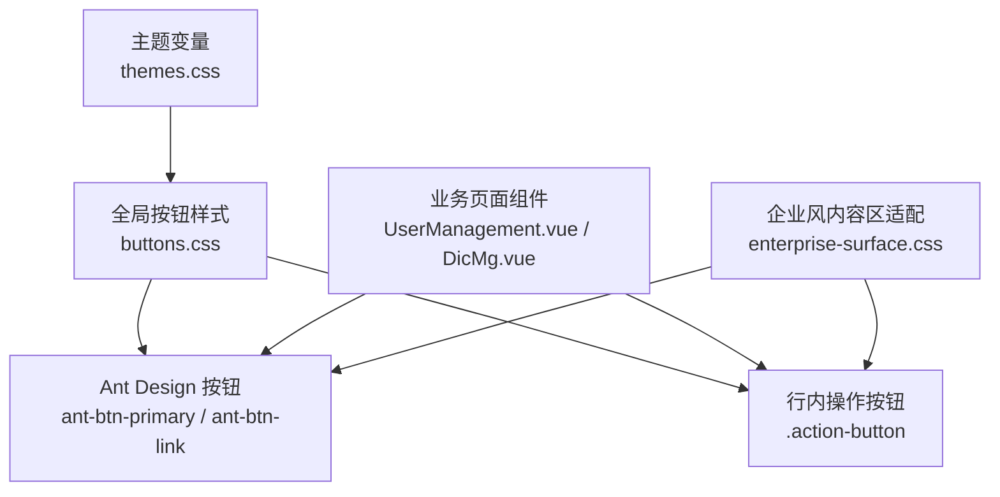
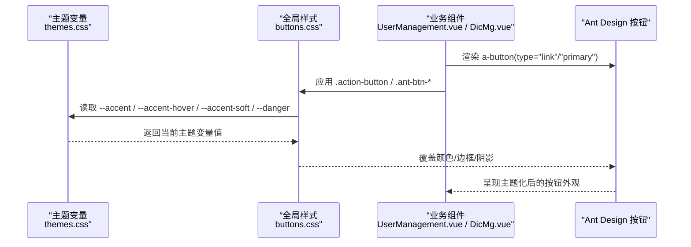
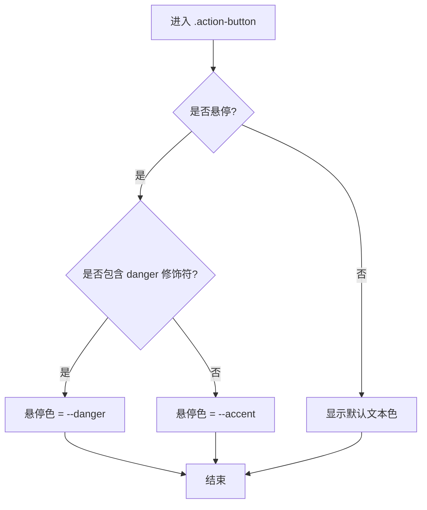
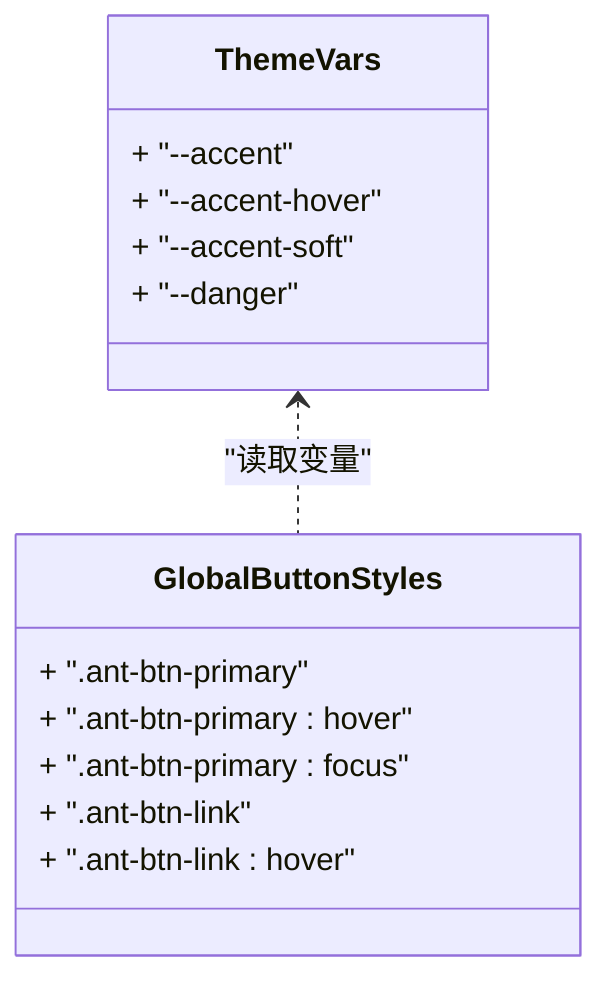
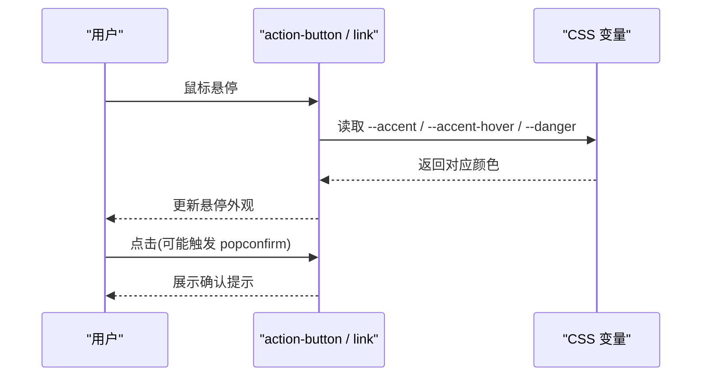
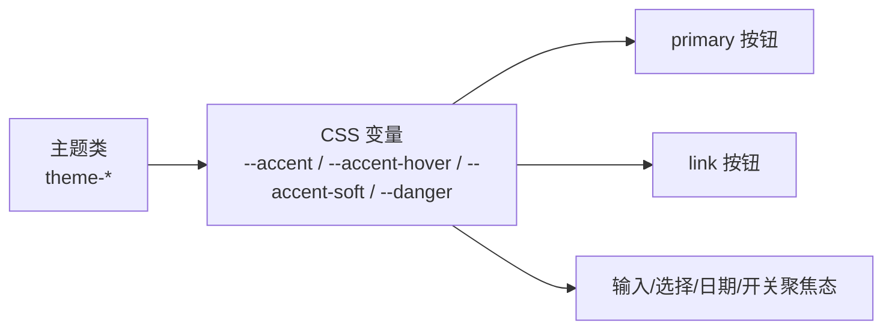
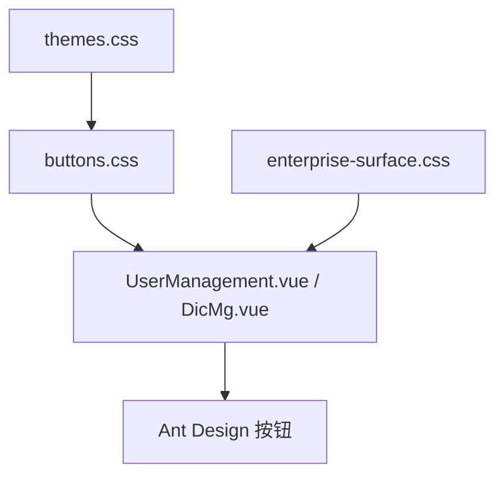

# 按钮样式

<cite>
**本文引用的文件**
- [buttons.css](file://vue/kevin.web.vue/src/css/buttons.css)
- [themes.css](file://vue/kevin.web.vue/src/css/themes.css)
- [enterprise-surface.css](file://vue/kevin.web.vue/src/css/enterprise-surface.css)
- [UserManagement.vue](file://vue/kevin.web.vue/src/components/UserManagement.vue)
- [DicMg.vue](file://vue/kevin.web.vue/src/pages/DicMg.vue)
</cite>

## 目录
1. [简介](#简介)
2. [项目结构](#项目结构)
3. [核心组件](#核心组件)
4. [架构总览](#架构总览)
5. [详细组件分析](#详细组件分析)
6. [依赖关系分析](#依赖关系分析)
7. [性能与可维护性](#性能与可维护性)
8. [故障排查指南](#故障排查指南)
9. [结论](#结论)
10. [附录：主题变量与覆盖清单](#附录：主题变量与覆盖清单)

## 简介
本文件系统性说明前端项目中“按钮样式”的设计规范与实现，重点围绕 action-button 类、全局按钮主题化（primary、link）、交互状态（悬停、焦点、危险操作）以及基于 CSS 变量的主题配置。文档同时提供最佳实践与可复用设计模式，帮助在统一视觉语言下快速扩展与维护按钮样式。

## 项目结构
按钮样式相关代码集中在 Vue 前端项目的 CSS 层，并通过主题变量在不同主题下保持一致的强调色体系；业务页面通过 Ant Design Vue 的 Button 组件配合自定义类名使用。

图表来源
- [themes.css:3-19](file://vue/kevin.web.vue/src/css/themes.css#L3-L19)
- [buttons.css:1-99](file://vue/kevin.web.vue/src/css/buttons.css#L1-L99)
- [enterprise-surface.css:1-152](file://vue/kevin.web.vue/src/css/enterprise-surface.css#L1-L152)
- [UserManagement.vue:107-133](file://vue/kevin.web.vue/src/components/UserManagement.vue#L107-L133)
- [DicMg.vue:68-99](file://vue/kevin.web.vue/src/pages/DicMg.vue#L68-L99)

章节来源
- [themes.css:3-19](file://vue/kevin.web.vue/src/css/themes.css#L3-L19)
- [buttons.css:1-99](file://vue/kevin.web.vue/src/css/buttons.css#L1-L99)
- [enterprise-surface.css:1-152](file://vue/kevin.web.vue/src/css/enterprise-surface.css#L1-L152)
- [UserManagement.vue:107-133](file://vue/kevin.web.vue/src/components/UserManagement.vue#L107-L133)
- [DicMg.vue:68-99](file://vue/kevin.web.vue/src/pages/DicMg.vue#L68-L99)

## 核心组件
- action-button：用于表格或工具栏中的行内操作按钮（编辑、删除等），默认轻量、无背景，悬停时采用强调色；危险操作悬停时采用危险色。
- 全局按钮主题化：对 Ant Design 的 primary 和 link 类型按钮进行主题覆盖，使其跟随 --accent 与 --accent-hover 变量。
- 表单控件聚焦态：输入框、选择器、复选框、单选框、日期选择器、开关等统一使用强调色边框与柔光阴影，保持交互一致性。

章节来源
- [buttons.css:1-99](file://vue/kevin.web.vue/src/css/buttons.css#L1-L99)

## 架构总览
按钮样式由“主题变量 + 全局覆盖 + 业务类名”三层构成：
- 主题变量层：在 themes.css 中定义 --accent、--accent-hover、--accent-soft、--danger 等变量，并按主题切换值。
- 全局覆盖层：在 buttons.css 中对 .layout-container 下的 Ant Design 组件进行统一覆盖，确保所有主题一致。
- 业务类名层：在业务组件中使用 .action-button 及 danger 修饰符，表达不同语义与交互。

图表来源
- [themes.css:3-19](file://vue/kevin.web.vue/src/css/themes.css#L3-L19)
- [buttons.css:22-40](file://vue/kevin.web.vue/src/css/buttons.css#L22-L40)
- [UserManagement.vue:107-133](file://vue/kevin.web.vue/src/components/UserManagement.vue#L107-L133)
- [DicMg.vue:68-99](file://vue/kevin.web.vue/src/pages/DicMg.vue#L68-L99)

## 详细组件分析

### action-button 设计规范与实现
- 基础样式：紧凑内边距、自适应高度、正常行高，适合行内操作场景。
- 悬停效果：默认悬停色为强调色；当添加 danger 修饰符时，悬停色切换为危险色。
- 组合用法：常与 Ant Design 的 type="link" 搭配，形成轻量、无背景的链接式按钮。

图表来源
- [buttons.css:1-15](file://vue/kevin.web.vue/src/css/buttons.css#L1-L15)

章节来源
- [buttons.css:1-15](file://vue/kevin.web.vue/src/css/buttons.css#L1-L15)
- [UserManagement.vue:107-133](file://vue/kevin.web.vue/src/components/UserManagement.vue#L107-L133)
- [DicMg.vue:68-99](file://vue/kevin.web.vue/src/pages/DicMg.vue#L68-L99)

### 全局按钮样式定制（primary、link）
- 主按钮（primary）：背景与边框均使用 --accent；悬停与聚焦时使用 --accent-hover（若未定义则回退到 --accent）。
- 链接按钮（link）：文本色使用 --accent；悬停色使用 --accent-hover（若未定义则回退到 --accent）。
- 作用域：限定在 .layout-container 下，避免影响其他容器内的第三方样式。

图表来源
- [themes.css:3-19](file://vue/kevin.web.vue/src/css/themes.css#L3-L19)
- [buttons.css:22-40](file://vue/kevin.web.vue/src/css/buttons.css#L22-L40)

章节来源
- [buttons.css:22-40](file://vue/kevin.web.vue/src/css/buttons.css#L22-L40)

### 交互状态：悬停、焦点、危险反馈
- 悬停：action-button 与 link 按钮均支持强调色悬停；danger 修饰符将悬停色切换为危险色。
- 焦点：输入框、选择器、日期选择器等聚焦时边框与柔光阴影使用 --accent 与 --accent-soft，提升可达性与一致性。
- 危险操作：删除等操作建议使用 popconfirm 二次确认，并在视觉上以 danger 修饰符或 Ant Design 的 danger 属性强化警示。

图表来源
- [buttons.css:8-15](file://vue/kevin.web.vue/src/css/buttons.css#L8-L15)
- [buttons.css:46-93](file://vue/kevin.web.vue/src/css/buttons.css#L46-L93)
- [UserManagement.vue:120-133](file://vue/kevin.web.vue/src/components/UserManagement.vue#L120-L133)

章节来源
- [buttons.css:8-15](file://vue/kevin.web.vue/src/css/buttons.css#L8-L15)
- [buttons.css:46-93](file://vue/kevin.web.vue/src/css/buttons.css#L46-L93)
- [UserManagement.vue:120-133](file://vue/kevin.web.vue/src/components/UserManagement.vue#L120-L133)

### 使用 CSS 变量实现主题化按钮
- 强调色变量：--accent 为主强调色，--accent-hover 为悬停强调色，--accent-soft 为柔光阴影色。
- 危险色变量：--danger 用于危险操作的强调。
- 主题切换：通过切换根节点的主题类（如 theme-enterprise、theme-default、theme-green、theme-purple、theme-darkblue、theme-simple-white），改变上述变量值，从而全局刷新按钮与控件外观。

图表来源
- [themes.css:3-19](file://vue/kevin.web.vue/src/css/themes.css#L3-L19)
- [themes.css:77-117](file://vue/kevin.web.vue/src/css/themes.css#L77-L117)
- [themes.css:157-200](file://vue/kevin.web.vue/src/css/themes.css#L157-L200)
- [themes.css:203-254](file://vue/kevin.web.vue/src/css/themes.css#L203-L254)
- [buttons.css:22-40](file://vue/kevin.web.vue/src/css/buttons.css#L22-L40)

章节来源
- [themes.css:3-19](file://vue/kevin.web.vue/src/css/themes.css#L3-L19)
- [themes.css:77-117](file://vue/kevin.web.vue/src/css/themes.css#L77-L117)
- [themes.css:157-200](file://vue/kevin.web.vue/src/css/themes.css#L157-L200)
- [themes.css:203-254](file://vue/kevin.web.vue/src/css/themes.css#L203-L254)
- [buttons.css:22-40](file://vue/kevin.web.vue/src/css/buttons.css#L22-L40)

### 最佳实践与可复用模式
- 统一入口：所有主题相关颜色仅通过 CSS 变量暴露，避免硬编码颜色。
- 作用域隔离：全局覆盖限定在 .layout-container，防止污染其他区域。
- 语义化类名：行内操作使用 .action-button，危险操作追加 danger 修饰符；主按钮使用 Ant Design 的 primary，链接式操作使用 link。
- 可访问性：确保焦点态可见（边框与柔光阴影），键盘导航友好。
- 渐进增强：hover/focus 状态提供平滑过渡与明确反馈，危险操作建议二次确认。
- 可维护性：新增主题只需定义变量集，无需修改业务样式。

章节来源
- [buttons.css:22-99](file://vue/kevin.web.vue/src/css/buttons.css#L22-L99)
- [themes.css:3-19](file://vue/kevin.web.vue/src/css/themes.css#L3-L19)

## 依赖关系分析
- 主题变量依赖：themes.css 定义多套主题变量，被 buttons.css 与业务样式共同消费。
- 全局样式依赖：buttons.css 依赖主题变量并覆盖 Ant Design 组件样式。
- 业务组件依赖：UserManagement.vue、DicMg.vue 等通过引入 buttons.css 并使用 .action-button 与 Ant Design 按钮类名获得统一外观。
- 内容区适配：enterprise-surface.css 对浅色内容区的卡片、表格、搜索框等进行统一风格适配，间接影响按钮所在区域的对比度与可读性。

图表来源
- [themes.css:3-19](file://vue/kevin.web.vue/src/css/themes.css#L3-L19)
- [buttons.css:1-99](file://vue/kevin.web.vue/src/css/buttons.css#L1-L99)
- [enterprise-surface.css:1-152](file://vue/kevin.web.vue/src/css/enterprise-surface.css#L1-L152)
- [UserManagement.vue:107-133](file://vue/kevin.web.vue/src/components/UserManagement.vue#L107-L133)
- [DicMg.vue:68-99](file://vue/kevin.web.vue/src/pages/DicMg.vue#L68-L99)

章节来源
- [themes.css:3-19](file://vue/kevin.web.vue/src/css/themes.css#L3-L19)
- [buttons.css:1-99](file://vue/kevin.web.vue/src/css/buttons.css#L1-L99)
- [enterprise-surface.css:1-152](file://vue/kevin.web.vue/src/css/enterprise-surface.css#L1-L152)
- [UserManagement.vue:107-133](file://vue/kevin.web.vue/src/components/UserManagement.vue#L107-L133)
- [DicMg.vue:68-99](file://vue/kevin.web.vue/src/pages/DicMg.vue#L68-L99)

## 性能与可维护性
- 性能：使用 CSS 变量减少重复计算，主题切换仅修改变量值，浏览器可高效重绘；作用域限定降低样式冲突与重排开销。
- 可维护性：集中管理主题变量与全局覆盖，新增主题或调整强调色仅需改动少量文件；业务组件无需关心具体颜色值。
- 可扩展性：通过增加新的主题类即可扩展新配色方案；通过新增修饰符（如 danger）扩展语义化样式。

[本节为通用指导，不直接分析具体文件]

## 故障排查指南
- 按钮颜色未按主题变化
  - 检查根节点是否正确应用了主题类（如 theme-enterprise、theme-default 等）。
  - 确认 themes.css 已加载且未被更高优先级样式覆盖。
- 链接按钮颜色异常
  - 检查是否在 .layout-container 作用域内生效；必要时提高选择器优先级或使用 !important 谨慎覆盖。
- 危险操作悬停色不生效
  - 确认是否添加了 danger 修饰符；检查是否有更具体的选择器覆盖了 .action-button.danger:hover。
- 输入框/选择器聚焦态不明显
  - 检查 --accent-soft 是否合理；确认聚焦态样式未被第三方样式覆盖。
- 企业风内容区对比度问题
  - 参考 enterprise-surface.css 对卡片、表格、搜索框的背景与边框设置，确保按钮与背景对比度足够。

章节来源
- [themes.css:3-19](file://vue/kevin.web.vue/src/css/themes.css#L3-L19)
- [buttons.css:22-99](file://vue/kevin.web.vue/src/css/buttons.css#L22-L99)
- [enterprise-surface.css:1-152](file://vue/kevin.web.vue/src/css/enterprise-surface.css#L1-L152)

## 结论
本项目通过“主题变量 + 全局覆盖 + 语义化类名”的三层架构，实现了统一的按钮样式体系。action-button 提供了轻量、可组合的行内操作按钮；primary 与 link 类型按钮通过 CSS 变量实现主题化；表单控件聚焦态与危险操作视觉反馈保持一致。该设计具备良好的可维护性与可扩展性，便于在多主题环境下快速迭代与统一升级。

[本节为总结，不直接分析具体文件]

## 附录：主题变量与覆盖清单
- 主题变量（themes.css）
  - --accent：强调色（主按钮、链接按钮、聚焦边框等）
  - --accent-hover：强调色悬停态
  - --accent-soft：柔光阴影（聚焦态外发光）
  - --danger：危险操作强调色
  - 其他：--page-bg、--sider-bg、--header-bg、--content-surface、--text-strong、--text-muted、--header-icon-color 等
- 全局覆盖（buttons.css）
  - .ant-btn-primary：背景与边框使用 --accent；悬停/聚焦使用 --accent-hover
  - .ant-btn-link：文本色使用 --accent；悬停使用 --accent-hover
  - .action-button：行内操作按钮；.action-button.danger:hover 使用 --danger
  - 表单控件聚焦态：输入框、选择器、日期选择器、复选框、单选框、开关等统一使用 --accent 与 --accent-soft
- 业务使用示例
  - UserManagement.vue：表格操作列使用 .action-button 与 danger 修饰符，结合 popconfirm 二次确认
  - DicMg.vue：字典项编辑/删除按钮使用 link 类型与 danger 属性，遵循统一样式

章节来源
- [themes.css:3-19](file://vue/kevin.web.vue/src/css/themes.css#L3-L19)
- [buttons.css:1-99](file://vue/kevin.web.vue/src/css/buttons.css#L1-L99)
- [UserManagement.vue:107-133](file://vue/kevin.web.vue/src/components/UserManagement.vue#L107-L133)
- [DicMg.vue:68-99](file://vue/kevin.web.vue/src/pages/DicMg.vue#L68-L99)