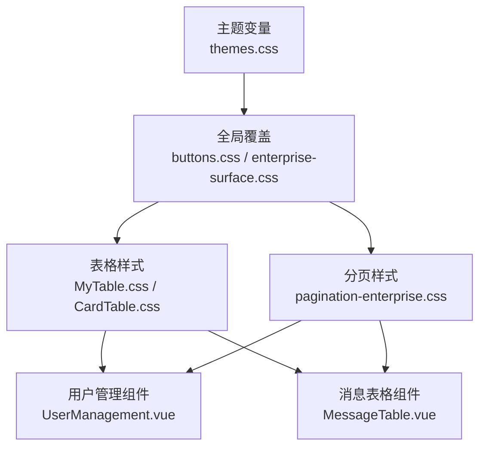
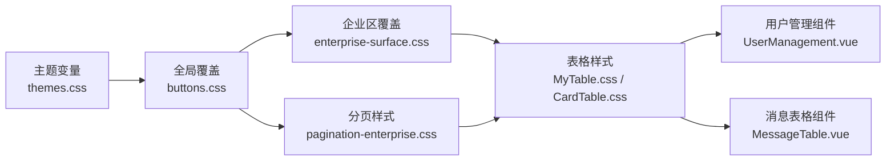
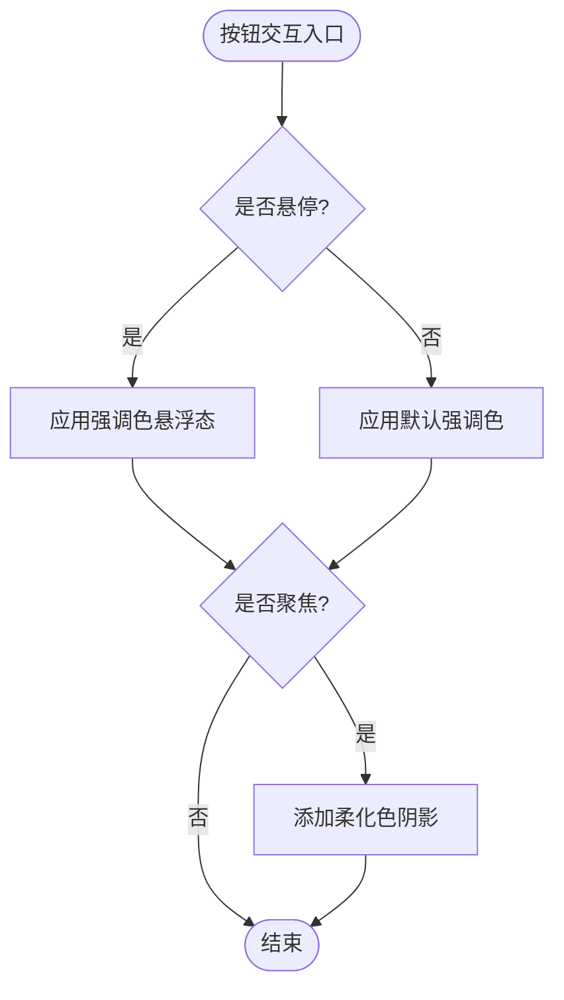
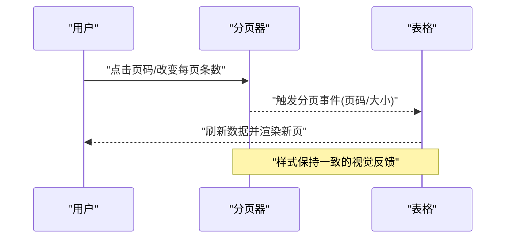
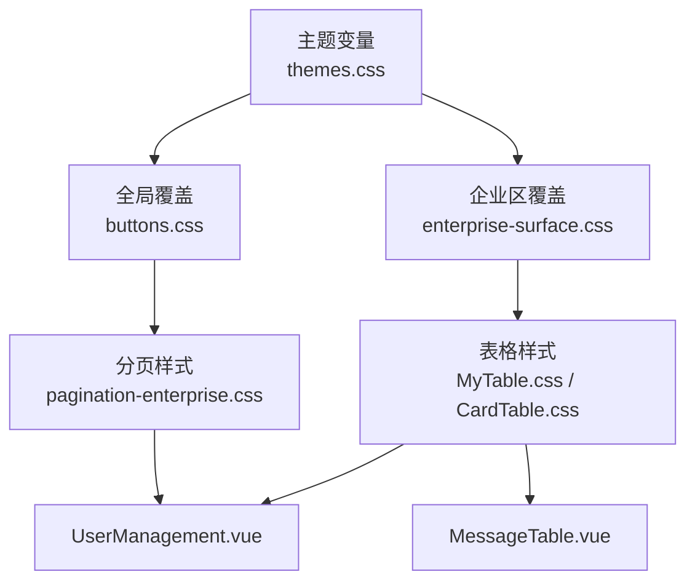

# 组件样式

<cite>
**本文引用的文件**
- [themes.css](file://vue/kevin.web.vue/src/css/themes.css)
- [buttons.css](file://vue/kevin.web.vue/src/css/buttons.css)
- [pagination-enterprise.css](file://vue/kevin.web.vue/src/css/pagination-enterprise.css)
- [enterprise-surface.css](file://vue/kevin.web.vue/src/css/enterprise-surface.css)
- [MyTable.css](file://vue/kevin.web.vue/src/css/MyTable.css)
- [CardTable.css](file://vue/kevin.web.vue/src/css/CardTable.css)
- [UserList.css](file://vue/kevin.web.vue/src/css/UserList.css)
- [management.css](file://vue/kevin.web.vue/src/css/management.css)
- [UserManagement.vue](file://vue/kevin.web.vue/src/components/UserManagement.vue)
- [MessageTable.vue](file://vue/kevin.web.vue/src/components/MessageTable.vue)
</cite>

## 目录
1. [简介](#简介)
2. [项目结构](#项目结构)
3. [核心组件](#核心组件)
4. [架构总览](#架构总览)
5. [详细组件分析](#详细组件分析)
6. [依赖关系分析](#依赖关系分析)
7. [性能考量](#性能考量)
8. [故障排查指南](#故障排查指南)
9. [结论](#结论)
10. [附录](#附录)

## 简介
本文件面向 NetCoreKevin 前端工程，系统化说明 Ant Design Vue 的样式覆盖与定制方法，聚焦以下目标：
- 自定义按钮样式的设计规范与实现（状态、尺寸变体、交互效果）
- 表格组件的样式定制（表头、行高、边框、悬停效果）
- 分页组件的企业级样式实现（分页器样式与交互反馈）
- 组件样式隔离策略（避免冲突与污染）
- 可复用性与模块化开发实践

## 项目结构
本项目将样式按“主题变量 + 全局覆盖 + 业务域样式”分层组织：
- 主题变量层：集中定义强调色、背景、文本、边框等 CSS 变量，支撑多主题切换
- 全局覆盖层：对 Ant Design Vue 默认样式进行统一覆盖，保证一致体验
- 业务域样式层：针对表格、卡片、搜索栏、分页等场景提供专用样式
- 组件内联样式：在组件中使用 scoped 样式或局部 import 进一步收敛样式影响范围



图表来源
- [themes.css:1-378](file://vue/kevin.web.vue/src/css/themes.css#L1-L378)
- [buttons.css:1-99](file://vue/kevin.web.vue/src/css/buttons.css#L1-L99)
- [enterprise-surface.css:1-327](file://vue/kevin.web.vue/src/css/enterprise-surface.css#L1-L327)
- [MyTable.css:1-76](file://vue/kevin.web.vue/src/css/MyTable.css#L1-L76)
- [CardTable.css:1-353](file://vue/kevin.web.vue/src/css/CardTable.css#L1-L353)
- [pagination-enterprise.css:1-135](file://vue/kevin.web.vue/src/css/pagination-enterprise.css#L1-L135)
- [UserManagement.vue:1-548](file://vue/kevin.web.vue/src/components/UserManagement.vue#L1-L548)
- [MessageTable.vue:1-150](file://vue/kevin.web.vue/src/components/MessageTable.vue#L1-L150)

章节来源
- [themes.css:1-378](file://vue/kevin.web.vue/src/css/themes.css#L1-L378)
- [buttons.css:1-99](file://vue/kevin.web.vue/src/css/buttons.css#L1-L99)
- [enterprise-surface.css:1-327](file://vue/kevin.web.vue/src/css/enterprise-surface.css#L1-L327)
- [MyTable.css:1-76](file://vue/kevin.web.vue/src/css/MyTable.css#L1-L76)
- [CardTable.css:1-353](file://vue/kevin.web.vue/src/css/CardTable.css#L1-L353)
- [pagination-enterprise.css:1-135](file://vue/kevin.web.vue/src/css/pagination-enterprise.css#L1-L135)
- [UserManagement.vue:1-548](file://vue/kevin.web.vue/src/components/UserManagement.vue#L1-L548)
- [MessageTable.vue:1-150](file://vue/kevin.web.vue/src/components/MessageTable.vue#L1-L150)

## 核心组件
- 主题系统：通过 CSS 变量统一管理强调色、背景、文本、边框等，支持多套主题快速切换
- 按钮系统：基于主题变量覆盖 Ant Design 按钮、链接按钮、开关等，提供 hover/focus 等交互态
- 表格系统：为浅色企业区与深色业务区分别提供表头、行高、边框、悬停、选中态样式
- 分页系统：统一分页容器、页码、跳转、禁用态等样式，适配表格底部分页与独立分页容器
- 表单与输入：统一输入框、选择器、日期选择器等聚焦态与边框阴影
- 卡片与内容区：统一卡片背景、标题、分割线、阴影，确保浅色内容区的可读性

章节来源
- [themes.css:1-378](file://vue/kevin.web.vue/src/css/themes.css#L1-L378)
- [buttons.css:1-99](file://vue/kevin.web.vue/src/css/buttons.css#L1-L99)
- [enterprise-surface.css:1-327](file://vue/kevin.web.vue/src/css/enterprise-surface.css#L1-L327)
- [MyTable.css:1-76](file://vue/kevin.web.vue/src/css/MyTable.css#L1-L76)
- [CardTable.css:1-353](file://vue/kevin.web.vue/src/css/CardTable.css#L1-L353)
- [pagination-enterprise.css:1-135](file://vue/kevin.web.vue/src/css/pagination-enterprise.css#L1-L135)

## 架构总览
下图展示了样式从主题变量到具体组件的覆盖路径，以及在不同业务区域（浅色企业区 vs 深色业务区）的差异化处理。



图表来源
- [themes.css:1-378](file://vue/kevin.web.vue/src/css/themes.css#L1-L378)
- [buttons.css:1-99](file://vue/kevin.web.vue/src/css/buttons.css#L1-L99)
- [enterprise-surface.css:1-327](file://vue/kevin.web.vue/src/css/enterprise-surface.css#L1-L327)
- [pagination-enterprise.css:1-135](file://vue/kevin.web.vue/src/css/pagination-enterprise.css#L1-L135)
- [MyTable.css:1-76](file://vue/kevin.web.vue/src/css/MyTable.css#L1-L76)
- [CardTable.css:1-353](file://vue/kevin.web.vue/src/css/CardTable.css#L1-L353)
- [UserManagement.vue:1-548](file://vue/kevin.web.vue/src/components/UserManagement.vue#L1-L548)
- [MessageTable.vue:1-150](file://vue/kevin.web.vue/src/components/MessageTable.vue#L1-L150)

## 详细组件分析

### 主题系统与变量
- 通过 .layout-container 定义页面背景、侧栏背景、强调色、强调色悬浮态、强调色柔化色、头部背景与边框、内容区表面与边框、强/弱文本色、危险色等变量
- 多主题通过不同类名（如 theme-enterprise、theme-blackblue、theme-default、theme-green、theme-purple、theme-darkblue、theme-simple-white）覆盖变量值，实现一键换肤
- 菜单、徽标、图标颜色等通过 :deep() 或作用域选择器与主题变量联动

章节来源
- [themes.css:1-378](file://vue/kevin.web.vue/src/css/themes.css#L1-L378)

### 按钮样式规范与实现
- 强调色应用：主按钮、链接按钮、开关等使用主题变量作为背景与边框色，hover/focus 时切换到强调色悬浮态
- 操作按钮：action-button 用于表格内的编辑/删除等操作按钮，hover 时切换为主题强调色；danger 变体在 hover 时切换为危险色
- 输入与选择器聚焦态：输入框、带前缀/后缀输入框、选择器、日期选择器等聚焦时使用强调色边框与柔化色阴影，提升可访问性
- 复选框/单选框：选中态与 hover 态均使用强调色，保持视觉一致性



图表来源
- [buttons.css:1-99](file://vue/kevin.web.vue/src/css/buttons.css#L1-L99)
- [themes.css:1-378](file://vue/kevin.web.vue/src/css/themes.css#L1-L378)

章节来源
- [buttons.css:1-99](file://vue/kevin.web.vue/src/css/buttons.css#L1-L99)
- [themes.css:1-378](file://vue/kevin.web.vue/src/css/themes.css#L1-L378)

### 表格组件样式定制
- 浅色企业区：统一表头背景、行高、边框、悬停与选中态，保证数据密度与可读性
- 深色业务区：为特定表格容器提供透明背景、半透明白色文字、半透明分隔线与悬停高亮，适配深色主题
- 行高与间距：通过单元格 padding 控制行高，配合过渡动画提升交互流畅度
- 选中态：使用强调色的柔化色作为选中背景，突出当前行

```mermaid
classDiagram
class TableStyles {
"表头背景"
"行高与间距"
"边框与分割线"
"悬停与选中态"
}
class EnterpriseSurface {
"浅色企业区覆盖"
"卡片与工具栏"
"输入与选择器"
}
class MyTable {
"深色表格容器"
"半透明背景"
"高对比文本"
}
TableStyles <|-- EnterpriseSurface
TableStyles <|-- MyTable
```

图表来源
- [enterprise-surface.css:1-327](file://vue/kevin.web.vue/src/css/enterprise-surface.css#L1-L327)
- [MyTable.css:1-76](file://vue/kevin.web.vue/src/css/MyTable.css#L1-L76)

章节来源
- [enterprise-surface.css:1-327](file://vue/kevin.web.vue/src/css/enterprise-surface.css#L1-L327)
- [MyTable.css:1-76](file://vue/kevin.web.vue/src/css/MyTable.css#L1-L76)
- [CardTable.css:1-353](file://vue/kevin.web.vue/src/css/CardTable.css#L1-L353)

### 分页组件企业级样式
- 统一分页容器：居中布局、间距、换行，适配不同屏幕宽度
- 页码样式：白底、细边框、圆角，激活页码使用强调色边框与文本
- 上一页/下一页：统一边框与颜色，禁用态降低透明度并灰化背景
- 总数与快速跳转：文本颜色与输入框样式与企业风格一致
- 表格底部分页：与表格底部留白协调，避免拥挤



图表来源
- [pagination-enterprise.css:1-135](file://vue/kevin.web.vue/src/css/pagination-enterprise.css#L1-L135)
- [UserManagement.vue:316-325](file://vue/kevin.web.vue/src/components/UserManagement.vue#L316-L325)
- [MessageTable.vue:1-150](file://vue/kevin.web.vue/src/components/MessageTable.vue#L1-L150)

章节来源
- [pagination-enterprise.css:1-135](file://vue/kevin.web.vue/src/css/pagination-enterprise.css#L1-L135)
- [UserManagement.vue:316-325](file://vue/kevin.web.vue/src/components/UserManagement.vue#L316-L325)
- [MessageTable.vue:1-150](file://vue/kevin.web.vue/src/components/MessageTable.vue#L1-L150)

### 组件样式隔离策略
- 作用域隔离：组件内使用 scoped 样式，并通过 :deep() 精准穿透第三方组件样式，避免全局污染
- 命名空间：以业务容器类（如 content-wrapper、user-management-container、management-container）限定样式作用域，减少冲突
- 优先级控制：合理使用 !important 仅用于覆盖第三方库默认样式，且限定在容器范围内，避免全局扩散
- 模块化导入：组件按需引入样式文件，便于维护与复用

章节来源
- [UserManagement.vue:525-548](file://vue/kevin.web.vue/src/components/UserManagement.vue#L525-L548)
- [MessageTable.vue:132-150](file://vue/kevin.web.vue/src/components/MessageTable.vue#L132-L150)
- [enterprise-surface.css:1-327](file://vue/kevin.web.vue/src/css/enterprise-surface.css#L1-L327)

### 可复用性与模块化实践
- 主题变量集中管理：所有强调色、背景、文本、边框等通过 CSS 变量定义，便于扩展新主题
- 通用样式模块：按钮、输入、选择器、分页等样式集中在独立文件，供多个组件复用
- 业务样式分离：表格、卡片、搜索栏等业务相关样式按模块拆分，便于维护
- 组件内联样式最小化：仅在必要时使用 scoped 样式，优先复用全局模块

章节来源
- [themes.css:1-378](file://vue/kevin.web.vue/src/css/themes.css#L1-L378)
- [buttons.css:1-99](file://vue/kevin.web.vue/src/css/buttons.css#L1-L99)
- [enterprise-surface.css:1-327](file://vue/kevin.web.vue/src/css/enterprise-surface.css#L1-L327)
- [pagination-enterprise.css:1-135](file://vue/kevin.web.vue/src/css/pagination-enterprise.css#L1-L135)
- [MyTable.css:1-76](file://vue/kevin.web.vue/src/css/MyTable.css#L1-L76)
- [CardTable.css:1-353](file://vue/kevin.web.vue/src/css/CardTable.css#L1-L353)

## 依赖关系分析
- 主题变量被全局覆盖样式引用，形成“变量 -> 覆盖 -> 业务样式”的依赖链
- 组件通过 scoped 样式与局部 import 组合，依赖全局样式模块与主题变量
- 分页样式同时作用于独立分页容器与表格底部分页，确保跨场景一致性



图表来源
- [themes.css:1-378](file://vue/kevin.web.vue/src/css/themes.css#L1-L378)
- [buttons.css:1-99](file://vue/kevin.web.vue/src/css/buttons.css#L1-L99)
- [enterprise-surface.css:1-327](file://vue/kevin.web.vue/src/css/enterprise-surface.css#L1-L327)
- [pagination-enterprise.css:1-135](file://vue/kevin.web.vue/src/css/pagination-enterprise.css#L1-L135)
- [MyTable.css:1-76](file://vue/kevin.web.vue/src/css/MyTable.css#L1-L76)
- [CardTable.css:1-353](file://vue/kevin.web.vue/src/css/CardTable.css#L1-L353)
- [UserManagement.vue:1-548](file://vue/kevin.web.vue/src/components/UserManagement.vue#L1-L548)
- [MessageTable.vue:1-150](file://vue/kevin.web.vue/src/components/MessageTable.vue#L1-L150)

章节来源
- [themes.css:1-378](file://vue/kevin.web.vue/src/css/themes.css#L1-L378)
- [buttons.css:1-99](file://vue/kevin.web.vue/src/css/buttons.css#L1-L99)
- [enterprise-surface.css:1-327](file://vue/kevin.web.vue/src/css/enterprise-surface.css#L1-L327)
- [pagination-enterprise.css:1-135](file://vue/kevin.web.vue/src/css/pagination-enterprise.css#L1-L135)
- [MyTable.css:1-76](file://vue/kevin.web.vue/src/css/MyTable.css#L1-L76)
- [CardTable.css:1-353](file://vue/kevin.web.vue/src/css/CardTable.css#L1-L353)
- [UserManagement.vue:1-548](file://vue/kevin.web.vue/src/components/UserManagement.vue#L1-L548)
- [MessageTable.vue:1-150](file://vue/kevin.web.vue/src/components/MessageTable.vue#L1-L150)

## 性能考量
- 减少全局 !important：仅在必要处使用，并限制作用域，避免重排与样式计算开销
- 合理选择器层级：尽量使用具体容器限定，避免深层嵌套导致的选择器复杂度上升
- 过渡动画优化：表格行悬停与选中态使用轻量过渡，避免频繁重绘
- 主题切换成本：CSS 变量切换成本低，适合运行时主题切换

[本节为通用指导，不直接分析具体文件]

## 故障排查指南
- 主题变量未生效：检查是否在正确的容器类下定义变量，并确保组件处于该容器作用域内
- 样式冲突：确认样式是否被更高层级选择器覆盖，必要时提高选择器特异性或使用 scoped 限制范围
- 分页样式异常：检查分页容器类是否正确应用，确认表格底部分页与独立分页容器的样式是否一致
- 按钮交互态异常：确认 hover/focus 选择器是否被第三方样式覆盖，必要时在容器内重新声明

章节来源
- [themes.css:1-378](file://vue/kevin.web.vue/src/css/themes.css#L1-L378)
- [buttons.css:1-99](file://vue/kevin.web.vue/src/css/buttons.css#L1-L99)
- [pagination-enterprise.css:1-135](file://vue/kevin.web.vue/src/css/pagination-enterprise.css#L1-L135)
- [enterprise-surface.css:1-327](file://vue/kevin.web.vue/src/css/enterprise-surface.css#L1-L327)

## 结论
本项目通过“主题变量 + 全局覆盖 + 业务样式”的分层设计，实现了 Ant Design Vue 的统一样式定制。按钮、表格、分页等关键组件在企业级场景中具备一致的视觉语言与交互反馈。通过样式隔离与模块化实践，有效避免了样式冲突与污染，提升了可维护性与可复用性。

[本节为总结性内容，不直接分析具体文件]

## 附录
- 主题变量清单：页面背景、侧栏背景、强调色、强调色悬浮态、强调色柔化色、头部背景与边框、内容区表面与边框、强/弱文本色、危险色等
- 按钮状态：默认、悬停、聚焦、禁用、危险
- 表格定制：表头背景、行高、边框、悬停、选中
- 分页样式：页码、激活页、上一页/下一页、总数、快速跳转、禁用态

[本节为补充信息，不直接分析具体文件]