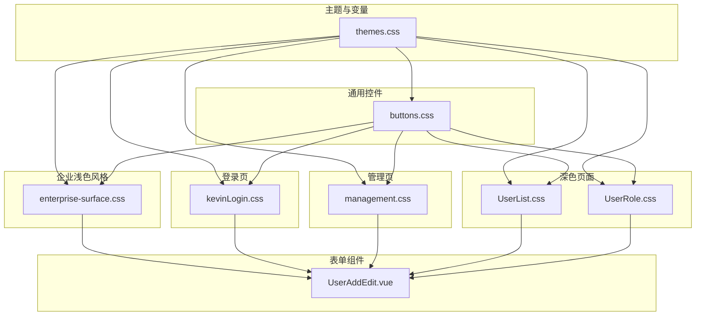
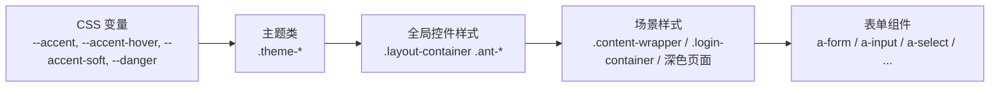
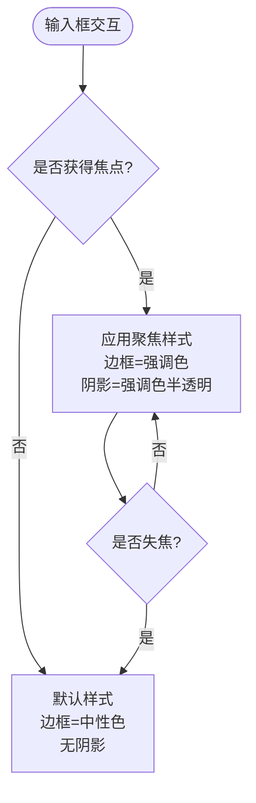
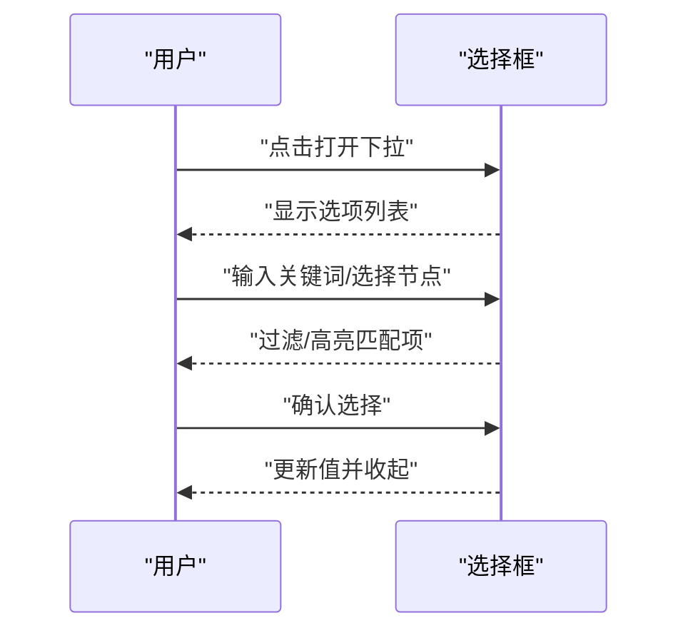
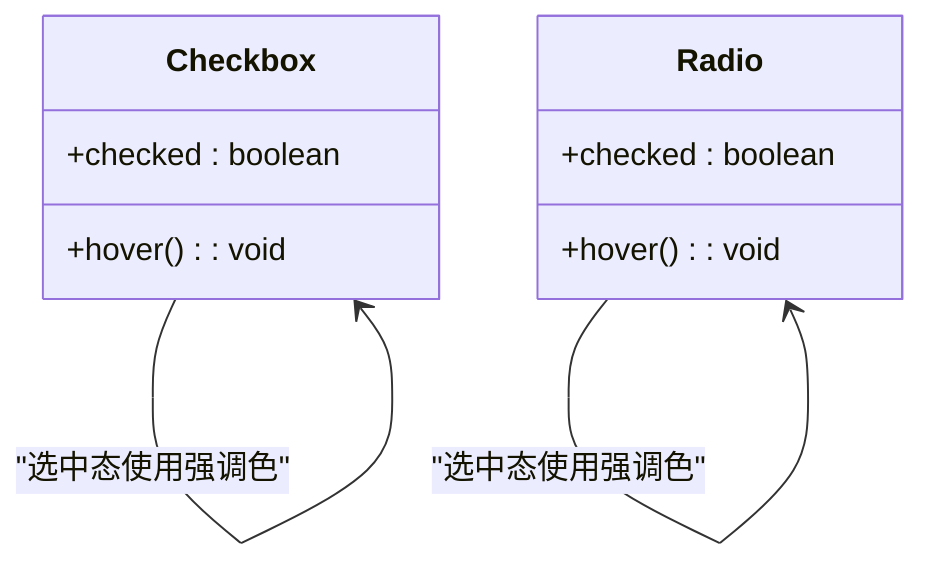
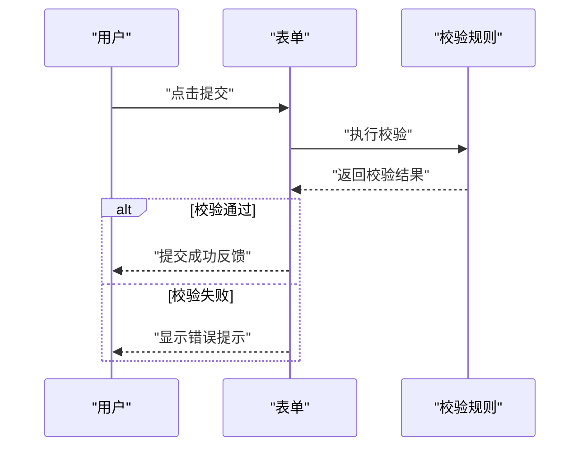
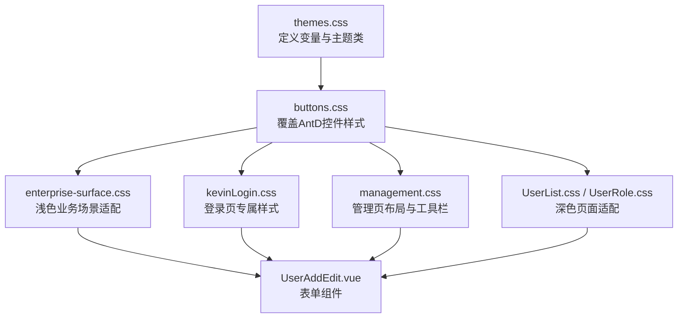

# 表单样式

<cite>
**本文引用的文件**
- [themes.css](file://vue/kevin.web.vue/src/css/themes.css)
- [buttons.css](file://vue/kevin.web.vue/src/css/buttons.css)
- [enterprise-surface.css](file://vue/kevin.web.vue/src/css/enterprise-surface.css)
- [kevinLogin.css](file://vue/kevin.web.vue/src/css/kevinLogin.css)
- [management.css](file://vue/kevin.web.vue/src/css/management.css)
- [UserList.css](file://vue/kevin.web.vue/src/css/UserList.css)
- [UserRole.css](file://vue/kevin.web.vue/src/css/UserRole.css)
- [UserAddEdit.vue](file://vue/kevin.web.vue/src/components/UserAddEdit.vue)
</cite>

## 目录
1. [简介](#简介)
2. [项目结构](#项目结构)
3. [核心组件](#核心组件)
4. [架构总览](#架构总览)
5. [详细组件分析](#详细组件分析)
6. [依赖关系分析](#依赖关系分析)
7. [性能考量](#性能考量)
8. [故障排查指南](#故障排查指南)
9. [结论](#结论)
10. [附录](#附录)

## 简介
本文件聚焦于前端表单组件的样式体系与定制方法，覆盖输入框、选择框、复选框、单选框等元素的视觉规范；说明聚焦态、验证态与错误提示的表现；阐述布局对齐与间距策略；提供可访问性与键盘导航建议；并给出主题化与品牌化方案、性能优化与体验提升的最佳实践。内容基于仓库中的 CSS 与 Vue 组件实现进行归纳与可视化说明。

## 项目结构
本项目的前端样式集中在 vue/kevin.web.vue/src/css 目录下，按“全局主题变量 + 通用控件样式 + 业务场景样式”分层组织：
- 主题变量与多主题切换：themes.css
- 通用控件（按钮、输入、选择、开关、日期等）聚焦与选中态：buttons.css
- 企业浅色背景下的统一卡片与表格、搜索栏、输入与选择器样式：enterprise-surface.css
- 登录页专用样式（含输入聚焦、验证码组合布局等）：kevinLogin.css
- 管理页面通用布局与工具栏、搜索、上传头像等：management.css
- 深色玻璃风页面（用户管理、角色管理）的表单与控件适配：UserList.css、UserRole.css
- 表单组件示例（用户新增/编辑弹窗）：UserAddEdit.vue

图表来源
- [themes.css:1-378](file://vue/kevin.web.vue/src/css/themes.css#L1-L378)
- [buttons.css:1-99](file://vue/kevin.web.vue/src/css/buttons.css#L1-L99)
- [enterprise-surface.css:1-327](file://vue/kevin.web.vue/src/css/enterprise-surface.css#L1-L327)
- [kevinLogin.css:1-255](file://vue/kevin.web.vue/src/css/kevinLogin.css#L1-L255)
- [management.css:1-177](file://vue/kevin.web.vue/src/css/management.css#L1-L177)
- [UserList.css:1-266](file://vue/kevin.web.vue/src/css/UserList.css#L1-L266)
- [UserRole.css:1-318](file://vue/kevin.web.vue/src/css/UserRole.css#L1-L318)
- [UserAddEdit.vue:1-552](file://vue/kevin.web.vue/src/components/UserAddEdit.vue#L1-L552)

章节来源
- [themes.css:1-378](file://vue/kevin.web.vue/src/css/themes.css#L1-L378)
- [buttons.css:1-99](file://vue/kevin.web.vue/src/css/buttons.css#L1-L99)
- [enterprise-surface.css:1-327](file://vue/kevin.web.vue/src/css/enterprise-surface.css#L1-L327)
- [kevinLogin.css:1-255](file://vue/kevin.web.vue/src/css/kevinLogin.css#L1-L255)
- [management.css:1-177](file://vue/kevin.web.vue/src/css/management.css#L1-L177)
- [UserList.css:1-266](file://vue/kevin.web.vue/src/css/UserList.css#L1-L266)
- [UserRole.css:1-318](file://vue/kevin.web.vue/src/css/UserRole.css#L1-L318)
- [UserAddEdit.vue:1-552](file://vue/kevin.web.vue/src/components/UserAddEdit.vue#L1-L552)

## 核心组件
- 输入框（Input / Input.Password / Search）
  - 聚焦态：边框色使用强调色，外发光使用强调色的半透明阴影，确保高对比度可见性。
  - 圆角与内边距：在登录与管理场景中采用一致的圆角与高度，保证视觉一致性。
  - 前缀/后缀：支持图标或按钮组合，保持统一的背景与边框处理。
- 选择框（Select / TreeSelect）
  - 聚焦态：与输入框一致的高亮边框与阴影。
  - 多选与树形：下拉区域最大高度与滚动条控制，避免长列表溢出。
- 复选框（Checkbox）
  - 选中态：填充色与边框色统一为强调色；悬停时边框高亮。
- 单选框（Radio）
  - 选中态：内部圆点颜色与边框色统一为强调色。
- 开关（Switch）
  - 开启态：背景色使用强调色；关闭态在深色页面中提供足够的对比度。
- 日期选择器（DatePicker/Picker）
  - 聚焦态：边框与阴影同输入框保持一致。
- 上传（Upload）
  - 头像上传卡片：虚线边框、悬停高亮、尺寸固定，便于预览与替换。

章节来源
- [buttons.css:22-99](file://vue/kevin.web.vue/src/css/buttons.css#L22-L99)
- [enterprise-surface.css:80-158](file://vue/kevin.web.vue/src/css/enterprise-surface.css#L80-L158)
- [kevinLogin.css:209-231](file://vue/kevin.web.vue/src/css/kevinLogin.css#L209-L231)
- [management.css:136-154](file://vue/kevin.web.vue/src/css/management.css#L136-L154)
- [UserList.css:209-240](file://vue/kevin.web.vue/src/css/UserList.css#L209-L240)
- [UserRole.css:243-272](file://vue/kevin.web.vue/src/css/UserRole.css#L243-L272)
- [UserAddEdit.vue:10-166](file://vue/kevin.web.vue/src/components/UserAddEdit.vue#L10-L166)

## 架构总览
表单样式通过“CSS 变量 + 主题类 + 组件级样式”三层协作：
- 主题层：定义强调色、背景、文字、危险色等变量，并通过主题类（如 .theme-enterprise、.theme-simple-white）注入到容器。
- 通用控件层：针对 Ant Design 组件的默认类名进行覆盖，统一聚焦、悬停、选中态，确保跨页面一致。
- 业务场景层：根据页面背景（浅色/深色/玻璃风）调整对比度、透明度与阴影，保证可读性与美观。

图表来源
- [themes.css:1-378](file://vue/kevin.web.vue/src/css/themes.css#L1-L378)
- [buttons.css:22-99](file://vue/kevin.web.vue/src/css/buttons.css#L22-L99)
- [enterprise-surface.css:1-327](file://vue/kevin.web.vue/src/css/enterprise-surface.css#L1-L327)
- [kevinLogin.css:1-255](file://vue/kevin.web.vue/src/css/kevinLogin.css#L1-L255)
- [UserList.css:1-266](file://vue/kevin.web.vue/src/css/UserList.css#L1-L266)
- [UserRole.css:1-318](file://vue/kevin.web.vue/src/css/UserRole.css#L1-L318)

## 详细组件分析

### 输入框（Input / Input.Password / Search）
- 聚焦态：边框变为强调色，外发光使用强调色的半透明阴影，确保焦点清晰可见。
- 圆角与尺寸：登录页与管理页统一圆角与高度，增强一致性。
- 搜索组合：输入框与按钮无缝拼接，按钮背景使用强调色，悬停过渡自然。

图表来源
- [buttons.css:46-57](file://vue/kevin.web.vue/src/css/buttons.css#L46-L57)
- [enterprise-surface.css:80-121](file://vue/kevin.web.vue/src/css/enterprise-surface.css#L80-L121)
- [kevinLogin.css:209-231](file://vue/kevin.web.vue/src/css/kevinLogin.css#L209-L231)
- [management.css:74-108](file://vue/kevin.web.vue/src/css/management.css#L74-L108)

章节来源
- [buttons.css:46-57](file://vue/kevin.web.vue/src/css/buttons.css#L46-L57)
- [enterprise-surface.css:80-121](file://vue/kevin.web.vue/src/css/enterprise-surface.css#L80-L121)
- [kevinLogin.css:209-231](file://vue/kevin.web.vue/src/css/kevinLogin.css#L209-L231)
- [management.css:74-108](file://vue/kevin.web.vue/src/css/management.css#L74-L108)

### 选择框（Select / TreeSelect）
- 聚焦态：与输入框一致的高亮边框与阴影。
- 多选与树形：下拉区域设置最大高度与滚动，避免遮挡；树节点支持过滤与展开。
- 深色页面适配：背景与文字对比度提升，选项文本清晰可读。

图表来源
- [buttons.css:59-63](file://vue/kevin.web.vue/src/css/buttons.css#L59-L63)
- [enterprise-surface.css:154-162](file://vue/kevin.web.vue/src/css/enterprise-surface.css#L154-L162)
- [UserList.css:220-232](file://vue/kevin.web.vue/src/css/UserList.css#L220-L232)
- [UserAddEdit.vue:33-74](file://vue/kevin.web.vue/src/components/UserAddEdit.vue#L33-L74)

章节来源
- [buttons.css:59-63](file://vue/kevin.web.vue/src/css/buttons.css#L59-L63)
- [enterprise-surface.css:154-162](file://vue/kevin.web.vue/src/css/enterprise-surface.css#L154-L162)
- [UserList.css:220-232](file://vue/kevin.web.vue/src/css/UserList.css#L220-L232)
- [UserAddEdit.vue:33-74](file://vue/kevin.web.vue/src/components/UserAddEdit.vue#L33-L74)

### 复选框与单选框
- 复选框：选中时填充与边框均为强调色；悬停边框高亮。
- 单选框：选中时内部圆点与边框均为强调色。
- 深色页面：开关与复选/单选在深色背景下提高对比度，确保状态可见。

图表来源
- [buttons.css:65-83](file://vue/kevin.web.vue/src/css/buttons.css#L65-L83)
- [UserList.css:234-240](file://vue/kevin.web.vue/src/css/UserList.css#L234-L240)
- [UserRole.css:266-272](file://vue/kevin.web.vue/src/css/UserRole.css#L266-L272)

章节来源
- [buttons.css:65-83](file://vue/kevin.web.vue/src/css/buttons.css#L65-L83)
- [UserList.css:234-240](file://vue/kevin.web.vue/src/css/UserList.css#L234-L240)
- [UserRole.css:266-272](file://vue/kevin.web.vue/src/css/UserRole.css#L266-L272)

### 日期选择器与开关
- 日期选择器：聚焦态边框与阴影与输入框一致，悬停边框高亮。
- 开关：开启态背景为强调色；深色页面中关闭态背景使用半透明白，确保对比度。

章节来源
- [buttons.css:85-99](file://vue/kevin.web.vue/src/css/buttons.css#L85-L99)
- [UserList.css:234-240](file://vue/kevin.web.vue/src/css/UserList.css#L234-L240)
- [UserRole.css:266-272](file://vue/kevin.web.vue/src/css/UserRole.css#L266-L272)

### 表单布局与间距
- 栅格布局：使用行/列栅格控制字段排列，常用两列布局，列宽比例合理分配。
- 标签与内容宽度：通过 label-col 与 wrapper-col 控制标签与输入框宽度比例，保证对齐与阅读节奏。
- 间距策略：行间距与列间距统一，工具栏与卡片头部留白一致，提升整体秩序感。

章节来源
- [UserAddEdit.vue:10-166](file://vue/kevin.web.vue/src/components/UserAddEdit.vue#L10-L166)
- [management.css:32-108](file://vue/kevin.web.vue/src/css/management.css#L32-L108)

### 验证状态与错误提示
- 表单校验：使用表单校验规则，必填、格式、长度等约束；提交时触发校验。
- 错误提示：校验失败时展示错误信息，聚焦态与错误态区分明显，便于定位问题。
- 交互流程：提交 -> 校验 -> 成功/失败反馈 -> 重置或继续编辑。

图表来源
- [UserAddEdit.vue:214-238](file://vue/kevin.web.vue/src/components/UserAddEdit.vue#L214-L238)
- [UserAddEdit.vue:451-521](file://vue/kevin.web.vue/src/components/UserAddEdit.vue#L451-L521)

章节来源
- [UserAddEdit.vue:214-238](file://vue/kevin.web.vue/src/components/UserAddEdit.vue#L214-L238)
- [UserAddEdit.vue:451-521](file://vue/kevin.web.vue/src/components/UserAddEdit.vue#L451-L521)

### 可访问性与键盘导航
- 键盘可达：所有表单元素应可通过 Tab 键顺序访问，Enter/Space 触发操作。
- 焦点可见：聚焦态使用高对比边框与阴影，确保键盘用户能明确当前焦点位置。
- 语义与标签：为每个输入提供清晰的标签与占位符，必要时添加 aria-describedby 关联错误提示。
- 颜色与对比：强调色与背景对比满足 WCAG 标准，避免仅用颜色表达状态。

章节来源
- [buttons.css:46-99](file://vue/kevin.web.vue/src/css/buttons.css#L46-L99)
- [kevinLogin.css:209-231](file://vue/kevin.web.vue/src/css/kevinLogin.css#L209-L231)
- [UserList.css:209-240](file://vue/kevin.web.vue/src/css/UserList.css#L209-L240)
- [UserRole.css:243-272](file://vue/kevin.web.vue/src/css/UserRole.css#L243-L272)

### 主题化与品牌化
- 主题变量：通过 CSS 变量集中管理强调色、悬停色、柔和色、危险色等，便于一键换肤。
- 主题类：在不同容器上应用主题类（如 .theme-enterprise、.theme-simple-white），快速切换整体风格。
- 品牌定制：修改强调色与侧栏背景即可实现品牌化；按钮、输入、选择、开关等控件自动继承主题变量。

章节来源
- [themes.css:1-378](file://vue/kevin.web.vue/src/css/themes.css#L1-L378)
- [buttons.css:22-44](file://vue/kevin.web.vue/src/css/buttons.css#L22-L44)

## 依赖关系分析
- 主题变量被全局控件样式引用，形成“变量 -> 主题类 -> 控件样式”的依赖链。
- 业务场景样式在通用控件基础上叠加，解决不同背景下的对比度与可读性问题。
- 表单组件通过类名与属性绑定，复用通用样式与主题变量，减少重复代码。

图表来源
- [themes.css:1-378](file://vue/kevin.web.vue/src/css/themes.css#L1-L378)
- [buttons.css:1-99](file://vue/kevin.web.vue/src/css/buttons.css#L1-L99)
- [enterprise-surface.css:1-327](file://vue/kevin.web.vue/src/css/enterprise-surface.css#L1-L327)
- [kevinLogin.css:1-255](file://vue/kevin.web.vue/src/css/kevinLogin.css#L1-L255)
- [management.css:1-177](file://vue/kevin.web.vue/src/css/management.css#L1-L177)
- [UserList.css:1-266](file://vue/kevin.web.vue/src/css/UserList.css#L1-L266)
- [UserRole.css:1-318](file://vue/kevin.web.vue/src/css/UserRole.css#L1-L318)
- [UserAddEdit.vue:1-552](file://vue/kevin.web.vue/src/components/UserAddEdit.vue#L1-L552)

章节来源
- [themes.css:1-378](file://vue/kevin.web.vue/src/css/themes.css#L1-L378)
- [buttons.css:1-99](file://vue/kevin.web.vue/src/css/buttons.css#L1-L99)
- [enterprise-surface.css:1-327](file://vue/kevin.web.vue/src/css/enterprise-surface.css#L1-L327)
- [kevinLogin.css:1-255](file://vue/kevin.web.vue/src/css/kevinLogin.css#L1-L255)
- [management.css:1-177](file://vue/kevin.web.vue/src/css/management.css#L1-L177)
- [UserList.css:1-266](file://vue/kevin.web.vue/src/css/UserList.css#L1-L266)
- [UserRole.css:1-318](file://vue/kevin.web.vue/src/css/UserRole.css#L1-L318)
- [UserAddEdit.vue:1-552](file://vue/kevin.web.vue/src/components/UserAddEdit.vue#L1-L552)

## 性能考量
- 样式优先级：合理使用 !important 仅在必要时覆盖第三方样式，避免过度重写导致维护成本上升。
- 选择器精简：尽量使用具体类名与作用域限定，减少全局污染与重绘开销。
- 动画与过渡：对 hover/focus 使用轻量过渡，避免复杂滤镜与大量阴影造成卡顿。
- 列表渲染：选择框下拉与树形列表限制最大高度与滚动，避免大列表导致的渲染压力。
- 主题切换：通过 CSS 变量与主题类切换，避免运行时频繁计算与样式重建。

[本节为通用指导，不直接分析具体文件]

## 故障排查指南
- 输入框聚焦不可见：检查是否被其他样式覆盖，确认聚焦态边框与阴影生效。
- 选择框选项不可读：在深色页面中确认背景与文字对比度，必要时调整透明度与颜色。
- 表单校验不触发：确认表单绑定模型与校验规则是否正确，提交逻辑是否调用校验方法。
- 主题切换无效：确认容器是否应用了对应的主题类，变量是否在当前作用域内生效。
- 上传头像异常：检查文件格式与大小限制，确认预览与提交逻辑正确。

章节来源
- [buttons.css:46-99](file://vue/kevin.web.vue/src/css/buttons.css#L46-L99)
- [UserList.css:209-240](file://vue/kevin.web.vue/src/css/UserList.css#L209-L240)
- [UserRole.css:243-272](file://vue/kevin.web.vue/src/css/UserRole.css#L243-L272)
- [UserAddEdit.vue:347-366](file://vue/kevin.web.vue/src/components/UserAddEdit.vue#L347-L366)
- [UserAddEdit.vue:451-521](file://vue/kevin.web.vue/src/components/UserAddEdit.vue#L451-L521)

## 结论
本项目通过“主题变量 + 通用控件样式 + 场景适配”的分层设计，实现了统一的表单样式体系。输入、选择、复选、单选、开关、日期等控件具备一致的聚焦、悬停与选中态；表单布局采用栅格与比例控制，保证对齐与间距的一致性；主题化方案支持快速品牌定制；同时兼顾可访问性与性能优化。建议在后续迭代中持续精简选择器、强化无障碍语义，并完善错误提示的可读性与引导性。

[本节为总结性内容，不直接分析具体文件]

## 附录
- 主题变量清单：强调色、悬停色、柔和色、危险色、背景与文字色等，详见主题文件。
- 控件样式清单：按钮、输入、选择、复选、单选、开关、日期等聚焦与选中态，详见通用控件样式文件。
- 场景适配清单：浅色企业风、登录页、深色玻璃风页面的对比度与透明度调整，详见场景样式文件。
- 表单组件示例：用户新增/编辑弹窗的布局、校验与交互，详见组件文件。

章节来源
- [themes.css:1-378](file://vue/kevin.web.vue/src/css/themes.css#L1-L378)
- [buttons.css:1-99](file://vue/kevin.web.vue/src/css/buttons.css#L1-L99)
- [enterprise-surface.css:1-327](file://vue/kevin.web.vue/src/css/enterprise-surface.css#L1-L327)
- [kevinLogin.css:1-255](file://vue/kevin.web.vue/src/css/kevinLogin.css#L1-L255)
- [management.css:1-177](file://vue/kevin.web.vue/src/css/management.css#L1-L177)
- [UserList.css:1-266](file://vue/kevin.web.vue/src/css/UserList.css#L1-L266)
- [UserRole.css:1-318](file://vue/kevin.web.vue/src/css/UserRole.css#L1-L318)
- [UserAddEdit.vue:1-552](file://vue/kevin.web.vue/src/components/UserAddEdit.vue#L1-L552)