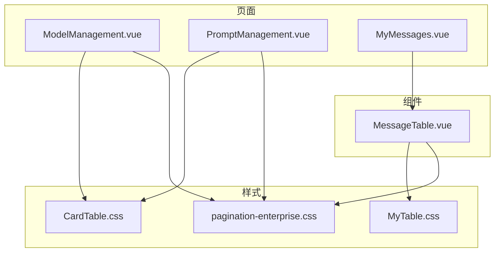
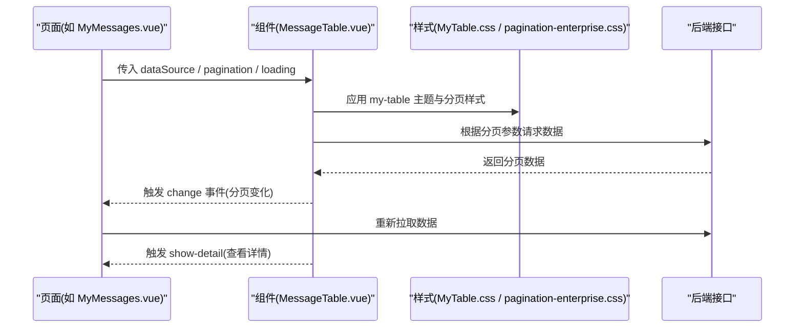
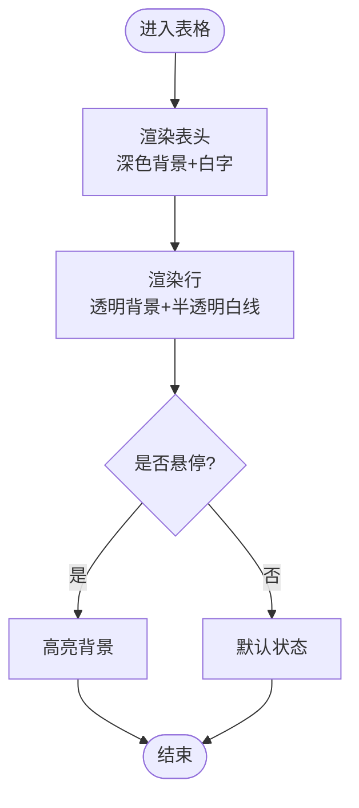
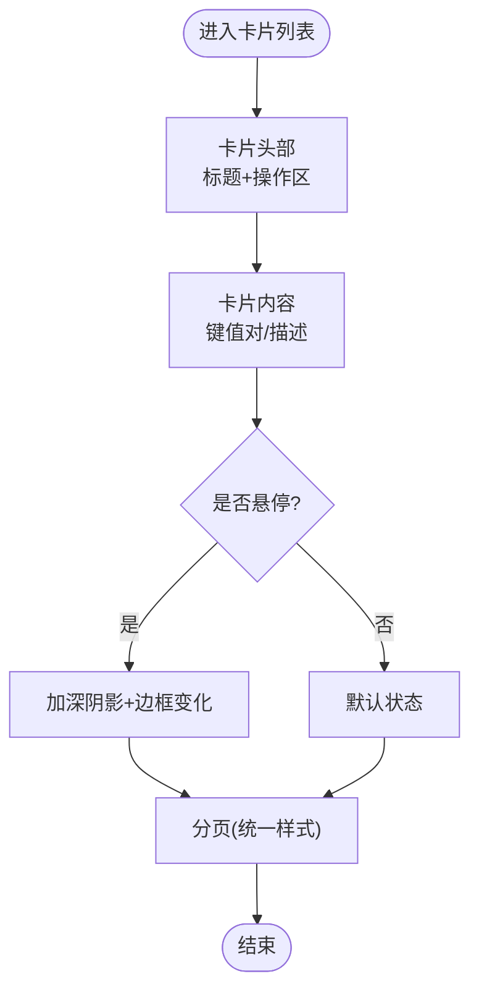
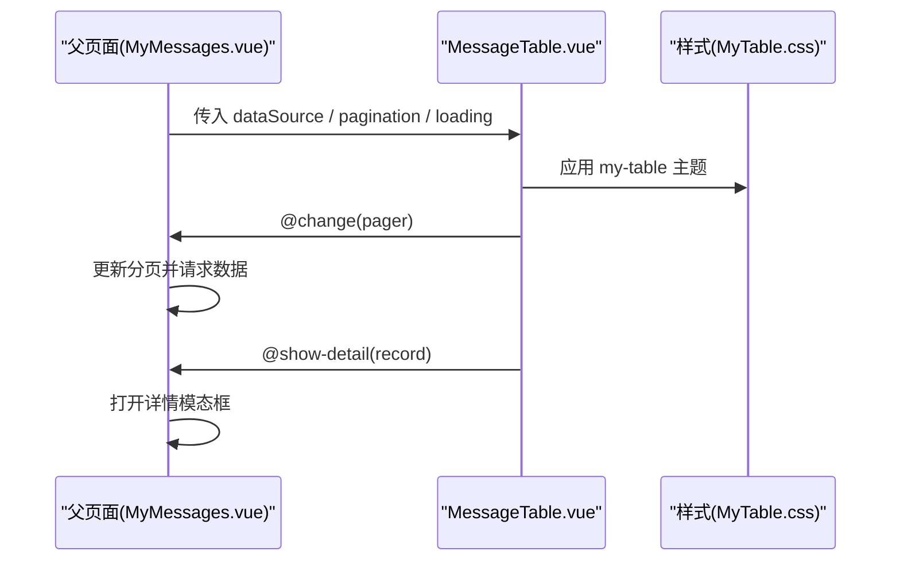
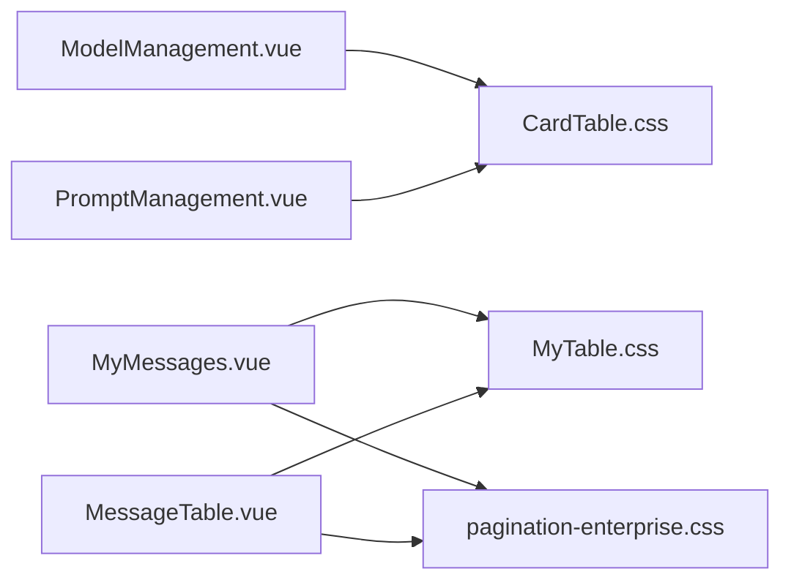

# 表格样式

<cite>
**本文引用的文件**
- [CardTable.css](file://vue/kevin.web.vue/src/css/CardTable.css)
- [MyTable.css](file://vue/kevin.web.vue/src/css/MyTable.css)
- [pagination-enterprise.css](file://vue/kevin.web.vue/src/css/pagination-enterprise.css)
- [MessageTable.vue](file://vue/kevin.web.vue/src/components/MessageTable.vue)
- [ModelManagement.vue](file://vue/kevin.web.vue/src/pages/ai/ModelManagement.vue)
- [PromptManagement.vue](file://vue/kevin.web.vue/src/pages/ai/PromptManagement.vue)
- [MyMessages.vue](file://vue/kevin.web.vue/src/pages/MyMessages.vue)
</cite>

## 目录
1. [简介](#简介)
2. [项目结构](#项目结构)
3. [核心组件](#核心组件)
4. [架构总览](#架构总览)
5. [详细组件分析](#详细组件分析)
6. [依赖关系分析](#依赖关系分析)
7. [性能考虑](#性能考虑)
8. [故障排查指南](#故障排查指南)
9. [结论](#结论)
10. [附录](#附录)

## 简介
本文件聚焦于前端表格展示的两套样式与实现：基于卡片布局的“CardTable”风格（浅色企业风）与基于 Ant Design Table 的“MyTable”深色主题。文档将系统说明表头、行高、边框、悬停等样式的定制方法，响应式适配策略，数据展示最佳实践（格式化、状态标识、交互），以及大数据量下的性能优化与主题扩展方案。

## 项目结构
本项目中表格相关样式与组件分布如下：
- 卡片列表样式：CardTable.css，用于模型、提示词等管理页的卡片化信息展示。
- 表格样式：MyTable.css，为 a-table 提供深色主题覆盖；分页统一样式在 pagination-enterprise.css。
- 通用表格组件：MessageTable.vue，封装 a-table 列渲染、状态显示与交互事件。
- 使用示例页面：ModelManagement.vue、PromptManagement.vue 使用 CardTable 风格；MyMessages.vue 使用 MessageTable 组件。

图表来源
- [ModelManagement.vue:1-200](file://vue/kevin.web.vue/src/pages/ai/ModelManagement.vue#L1-L200)
- [PromptManagement.vue:1-200](file://vue/kevin.web.vue/src/pages/ai/PromptManagement.vue#L1-L200)
- [MyMessages.vue:1-200](file://vue/kevin.web.vue/src/pages/MyMessages.vue#L1-L200)
- [MessageTable.vue:1-150](file://vue/kevin.web.vue/src/components/MessageTable.vue#L1-L150)
- [CardTable.css:1-353](file://vue/kevin.web.vue/src/css/CardTable.css#L1-L353)
- [MyTable.css:1-76](file://vue/kevin.web.vue/src/css/MyTable.css#L1-L76)
- [pagination-enterprise.css:1-135](file://vue/kevin.web.vue/src/css/pagination-enterprise.css#L1-L135)

章节来源
- [ModelManagement.vue:1-200](file://vue/kevin.web.vue/src/pages/ai/ModelManagement.vue#L1-L200)
- [PromptManagement.vue:1-200](file://vue/kevin.web.vue/src/pages/ai/PromptManagement.vue#L1-L200)
- [MyMessages.vue:1-200](file://vue/kevin.web.vue/src/pages/MyMessages.vue#L1-L200)
- [MessageTable.vue:1-150](file://vue/kevin.web.vue/src/components/MessageTable.vue#L1-L150)
- [CardTable.css:1-353](file://vue/kevin.web.vue/src/css/CardTable.css#L1-L353)
- [MyTable.css:1-76](file://vue/kevin.web.vue/src/css/MyTable.css#L1-L76)
- [pagination-enterprise.css:1-135](file://vue/kevin.web.vue/src/css/pagination-enterprise.css#L1-L135)

## 核心组件
- MyTable（基于 a-table 的深色主题表格）
  - 通过类名 my-table 对 antd table 进行主题覆盖，包括表头背景、行高、边框、选中态与悬停态。
  - 单元格内操作按钮采用 link 类型，颜色与 hover 状态在样式文件中定义。
  - 分页样式由 pagination-enterprise.css 统一控制，支持独立容器或表格底部分页。

- CardTable（卡片式信息展示）
  - 以 a-card 组合栅格布局呈现多字段信息，适合模型、提示词等“实体卡片”展示。
  - 卡片头部、内容区、悬停阴影与移动端适配均有明确样式定义。
  - 分页同样复用 pagination-enterprise.css。

章节来源
- [MyTable.css:1-76](file://vue/kevin.web.vue/src/css/MyTable.css#L1-L76)
- [pagination-enterprise.css:1-135](file://vue/kevin.web.vue/src/css/pagination-enterprise.css#L1-L135)
- [CardTable.css:1-353](file://vue/kevin.web.vue/src/css/CardTable.css#L1-L353)
- [MessageTable.vue:1-150](file://vue/kevin.web.vue/src/components/MessageTable.vue#L1-L150)

## 架构总览
下图展示了页面、组件与样式之间的调用关系，以及数据流与交互流程。

图表来源
- [MyMessages.vue:1-200](file://vue/kevin.web.vue/src/pages/MyMessages.vue#L1-L200)
- [MessageTable.vue:1-150](file://vue/kevin.web.vue/src/components/MessageTable.vue#L1-L150)
- [MyTable.css:1-76](file://vue/kevin.web.vue/src/css/MyTable.css#L1-L76)
- [pagination-enterprise.css:1-135](file://vue/kevin.web.vue/src/css/pagination-enterprise.css#L1-L135)

## 详细组件分析

### MyTable 样式与设计要点
- 表头样式
  - 表头背景色与文字色在深色主题下进行了覆盖，确保可读性。
  - 表头底部边框使用半透明白线，增强层次。
- 行高与边框
  - 行高通过单元格 padding 控制，整体更紧凑。
  - 行分隔使用半透明白线，保持深色主题一致性。
- 悬停与选中
  - 行悬停时背景色轻微高亮，选中行有更强的背景强调。
  - 链接按钮 hover 颜色变化，提升可点击反馈。
- 分页
  - 通过 pagination-enterprise.css 统一分页外观，支持表格内嵌与独立容器两种形式。

图表来源
- [MyTable.css:1-76](file://vue/kevin.web.vue/src/css/MyTable.css#L1-L76)
- [pagination-enterprise.css:1-135](file://vue/kevin.web.vue/src/css/pagination-enterprise.css#L1-L135)

章节来源
- [MyTable.css:1-76](file://vue/kevin.web.vue/src/css/MyTable.css#L1-L76)
- [pagination-enterprise.css:1-135](file://vue/kevin.web.vue/src/css/pagination-enterprise.css#L1-L135)

### CardTable 样式与设计要点
- 卡片容器
  - 白色背景、圆角、细边框与浅阴影，营造轻量层级感。
  - 卡片头部与内容区间距合理，标题区域背景略深，便于区分。
- 信息排版
  - 使用栅格与 flex 布局，标签与值对齐，长文本截断显示。
  - 卡片悬停时边框与阴影变化，提供交互反馈。
- 移动端适配
  - 在小屏幕下调整卡片内边距、头部与内容区布局，保证可读性与触控体验。
- 分页
  - 复用统一的分页样式，保持全站一致。

图表来源
- [CardTable.css:1-353](file://vue/kevin.web.vue/src/css/CardTable.css#L1-L353)
- [pagination-enterprise.css:1-135](file://vue/kevin.web.vue/src/css/pagination-enterprise.css#L1-L135)

章节来源
- [CardTable.css:1-353](file://vue/kevin.web.vue/src/css/CardTable.css#L1-L353)
- [pagination-enterprise.css:1-135](file://vue/kevin.web.vue/src/css/pagination-enterprise.css#L1-L135)

### MessageTable 组件的数据展示与交互
- 列渲染
  - 根据 dataIndex 动态渲染不同内容，如标题、发送人、创建人、时间等。
  - 未读消息标题加粗，直观标识状态。
- 日期格式化
  - 使用本地化时间格式输出，保证中文环境可读性。
- 交互
  - 操作列提供查看按钮，点击后向上层组件抛出事件，由页面处理详情弹窗。
  - 分页变化事件向上传递，由页面负责刷新数据。

图表来源
- [MessageTable.vue:1-150](file://vue/kevin.web.vue/src/components/MessageTable.vue#L1-L150)
- [MyMessages.vue:1-200](file://vue/kevin.web.vue/src/pages/MyMessages.vue#L1-L200)
- [MyTable.css:1-76](file://vue/kevin.web.vue/src/css/MyTable.css#L1-L76)

章节来源
- [MessageTable.vue:1-150](file://vue/kevin.web.vue/src/components/MessageTable.vue#L1-L150)
- [MyMessages.vue:1-200](file://vue/kevin.web.vue/src/pages/MyMessages.vue#L1-L200)

### 使用场景对比
- CardTable 风格
  - 适用于实体信息展示（如模型配置、提示词），强调卡片化、可视化与易扫描。
  - 典型页面：ModelManagement.vue、PromptManagement.vue。
- MyTable 风格
  - 适用于结构化数据列表（如消息、日志），强调高密度信息与操作便捷性。
  - 典型页面：MyMessages.vue。

章节来源
- [ModelManagement.vue:1-200](file://vue/kevin.web.vue/src/pages/ai/ModelManagement.vue#L1-L200)
- [PromptManagement.vue:1-200](file://vue/kevin.web.vue/src/pages/ai/PromptManagement.vue#L1-L200)
- [MyMessages.vue:1-200](file://vue/kevin.web.vue/src/pages/MyMessages.vue#L1-L200)

## 依赖关系分析
- 页面到样式
  - ModelManagement.vue、PromptManagement.vue 引入 CardTable.css。
  - MyMessages.vue 引入 MyTable.css 与 pagination-enterprise.css。
- 组件到样式
  - MessageTable.vue 通过 class 选择器应用 MyTable.css 主题。
  - 分页统一由 pagination-enterprise.css 控制，兼容表格内嵌与独立容器。

图表来源
- [ModelManagement.vue:1-200](file://vue/kevin.web.vue/src/pages/ai/ModelManagement.vue#L1-L200)
- [PromptManagement.vue:1-200](file://vue/kevin.web.vue/src/pages/ai/PromptManagement.vue#L1-L200)
- [MyMessages.vue:1-200](file://vue/kevin.web.vue/src/pages/MyMessages.vue#L1-L200)
- [MessageTable.vue:1-150](file://vue/kevin.web.vue/src/components/MessageTable.vue#L1-L150)
- [CardTable.css:1-353](file://vue/kevin.web.vue/src/css/CardTable.css#L1-L353)
- [MyTable.css:1-76](file://vue/kevin.web.vue/src/css/MyTable.css#L1-L76)
- [pagination-enterprise.css:1-135](file://vue/kevin.web.vue/src/css/pagination-enterprise.css#L1-L135)

章节来源
- [ModelManagement.vue:1-200](file://vue/kevin.web.vue/src/pages/ai/ModelManagement.vue#L1-L200)
- [PromptManagement.vue:1-200](file://vue/kevin.web.vue/src/pages/ai/PromptManagement.vue#L1-L200)
- [MyMessages.vue:1-200](file://vue/kevin.web.vue/src/pages/MyMessages.vue#L1-L200)
- [MessageTable.vue:1-150](file://vue/kevin.web.vue/src/components/MessageTable.vue#L1-L150)
- [CardTable.css:1-353](file://vue/kevin.web.vue/src/css/CardTable.css#L1-L353)
- [MyTable.css:1-76](file://vue/kevin.web.vue/src/css/MyTable.css#L1-L76)
- [pagination-enterprise.css:1-135](file://vue/kevin.web.vue/src/css/pagination-enterprise.css#L1-L135)

## 性能考虑
- 分页与懒加载
  - 使用服务端分页，避免一次性渲染大量数据；分页变化时仅请求当前页数据。
- 虚拟滚动（可选）
  - 若需客户端渲染超大列表，可考虑引入虚拟滚动方案以减少 DOM 节点数量。
- 减少重排与重绘
  - 合理使用 CSS transition，避免频繁切换复杂动画；尽量使用 transform 与 opacity 提升性能。
- 图片与富文本
  - 图片懒加载与尺寸限制；富文本按需渲染，避免首屏阻塞。
- 缓存策略
  - 对不常变动的字典或配置数据做前端缓存，减少重复请求。

[本节为通用指导，无需特定文件引用]

## 故障排查指南
- 表格主题不生效
  - 检查是否正确添加 my-table 类名，确认样式文件已引入且未被更高优先级规则覆盖。
- 分页样式异常
  - 确认 pagination-enterprise.css 已全局引入；检查是否存在冲突的选择器或 !important 覆盖。
- 移动端布局错乱
  - 检查 CardTable 的媒体查询是否生效；确认栅格与 flex 布局在小屏下的回退逻辑。
- 数据为空时的空状态
  - 确认空状态文案与样式已正确设置，避免空白区域影响用户体验。

章节来源
- [MyTable.css:1-76](file://vue/kevin.web.vue/src/css/MyTable.css#L1-L76)
- [pagination-enterprise.css:1-135](file://vue/kevin.web.vue/src/css/pagination-enterprise.css#L1-L135)
- [CardTable.css:305-353](file://vue/kevin.web.vue/src/css/CardTable.css#L305-L353)

## 结论
- CardTable 风格适合实体信息的卡片化展示，具备清晰的层级与良好的移动端适配。
- MyTable 风格适合高密度结构化数据的列表展示，配合统一分页样式，具备一致的深色主题体验。
- 通过组件化封装与样式模块化，可在不同业务场景中灵活复用与扩展。
- 建议结合分页、虚拟滚动与缓存策略，持续优化大数据量下的性能表现。

[本节为总结性内容，无需特定文件引用]

## 附录

### 主题定制与扩展开发指南
- 主题变量
  - 建议在样式文件中集中定义主色、辅助色、背景与文字色，便于全局替换。
- 深色/浅色切换
  - 可通过根级 class 或 CSS 变量切换主题；注意表格、分页、卡片在不同主题下的对比度。
- 组件扩展
  - 在 MessageTable 中新增列或操作时，遵循统一的插槽与事件约定，保持可扩展性。
- 规范与命名
  - 统一类名命名规范，避免冲突；样式文件按功能拆分，便于维护。

[本节为通用指导，无需特定文件引用]