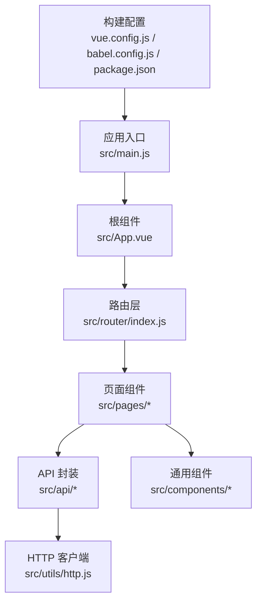
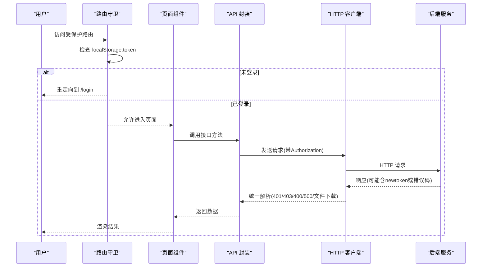
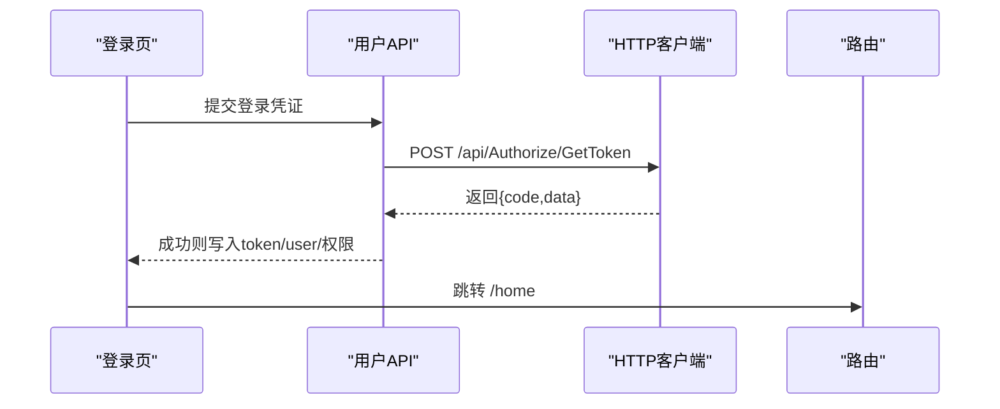
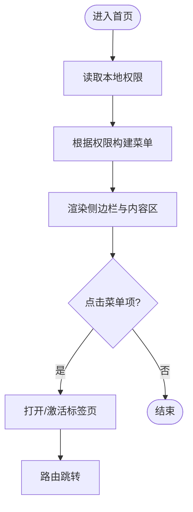
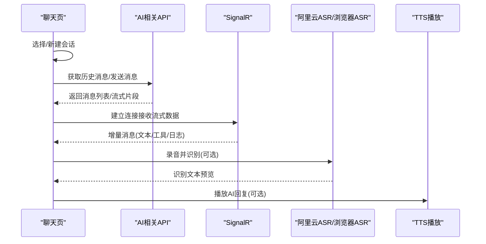
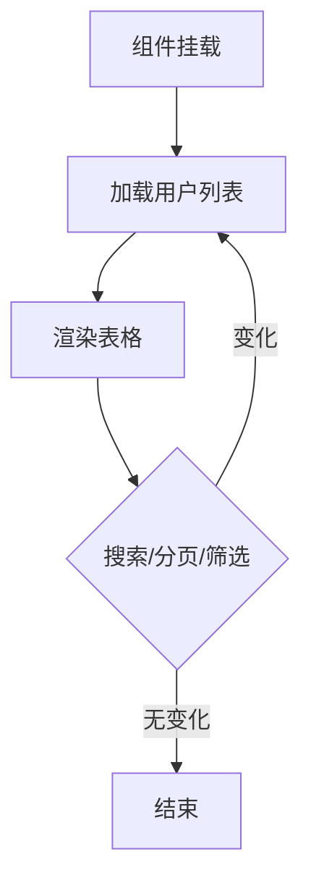
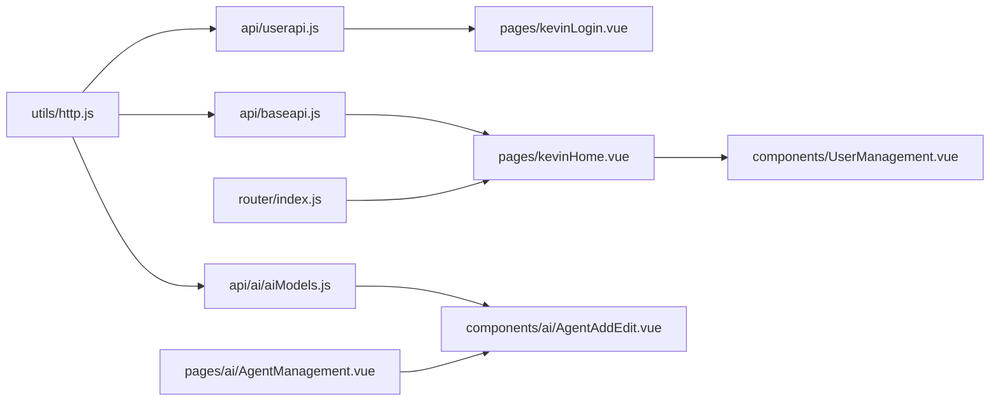

# 前端架构

<cite>
**本文引用的文件**
- [package.json](file://vue/kevin.web.vue/package.json)
- [main.js](file://vue/kevin.web.vue/src/main.js)
- [App.vue](file://vue/kevin.web.vue/src/App.vue)
- [index.js](file://vue/kevin.web.vue/src/router/index.js)
- [http.js](file://vue/kevin.web.vue/src/utils/http.js)
- [baseapi.js](file://vue/kevin.web.vue/src/api/baseapi.js)
- [userapi.js](file://vue/kevin.web.vue/src/api/userapi.js)
- [aiModels.js](file://vue/kevin.web.vue/src/api/ai/aiModels.js)
- [kevinLogin.vue](file://vue/kevin.web.vue/src/pages/kevinLogin.vue)
- [kevinHome.vue](file://vue/kevin.web.vue/src/pages/kevinHome.vue)
- [MyAIChat.vue](file://vue/kevin.web.vue/src/pages/ai/MyAIChat.vue)
- [AgentManagement.vue](file://vue/kevin.web.vue/src/pages/ai/AgentManagement.vue)
- [AgentAddEdit.vue](file://vue/kevin.web.vue/src/components/ai/AgentAddEdit.vue)
- [UserManagement.vue](file://vue/kevin.web.vue/src/components/UserManagement.vue)
- [vue.config.js](file://vue/kevin.web.vue/vue.config.js)
- [babel.config.js](file://vue/kevin.web.vue/babel.config.js)
</cite>

## 更新摘要
**所做更改**
- 更新了智能体配置组件的模型选择功能，新增"🤖 Auto (自动切换)"选项
- 简化了模型选项计算逻辑，移除了计算属性，直接在模板中渲染自动选项
- 增强了AI智能体的灵活性和用户体验

## 目录
1. [简介](#简介)
2. [项目结构](#项目结构)
3. [核心组件](#核心组件)
4. [架构总览](#架构总览)
5. [详细组件分析](#详细组件分析)
6. [依赖关系分析](#依赖关系分析)
7. [性能考虑](#性能考虑)
8. [故障排查指南](#故障排查指南)
9. [结论](#结论)
10. [附录](#附录)

## 简介
本文件面向 NetCoreKevin 的前端工程，基于 Vue 3 + Ant Design Vue 构建，采用前后端分离架构。文档覆盖：
- 页面组织与路由配置
- 状态管理与认证流程
- API 调用封装与错误处理
- Ant Design Vue 使用与自定义组件开发
- 工程化配置（构建、代码规范、开发环境）
- 主要功能页面实现说明（用户管理、AI 聊天界面、系统管理等）
- 最佳实践与性能优化建议

## 项目结构
前端工程位于 vue/kevin.web.vue，核心目录与职责如下：
- src/main.js：应用入口，注册全局插件与主题样式
- src/App.vue：根组件，提供 Ant Design 主题配置
- src/router/index.js：路由定义与鉴权守卫
- src/utils/http.js：Axios 实例与拦截器（请求头、响应统一处理、文件下载、401/403 处理）
- src/api/*：按模块划分的接口封装（如 userapi.js、baseapi.js、aiModels.js）
- src/pages/*：页面级组件（登录、首页、AI 聊天、系统管理等）
- src/components/*：可复用业务组件（如用户管理表格、智能体配置等）
- vue.config.js：Vue CLI 配置（代理、编译选项等）
- babel.config.js：Babel 预设
- package.json：依赖与脚本命令



**图表来源**
- [main.js:1-20](file://vue/kevin.web.vue/src/main.js#L1-L20)
- [App.vue:1-53](file://vue/kevin.web.vue/src/App.vue#L1-L53)
- [index.js:1-191](file://vue/kevin.web.vue/src/router/index.js#L1-L191)
- [http.js:1-125](file://vue/kevin.web.vue/src/utils/http.js#L1-L125)
- [vue.config.js:1-21](file://vue/kevin.web.vue/vue.config.js#L1-L21)
- [babel.config.js:1-6](file://vue/kevin.web.vue/babel.config.js#L1-L6)
- [package.json:1-68](file://vue/kevin.web.vue/package.json#L1-L68)

**章节来源**
- [main.js:1-20](file://vue/kevin.web.vue/src/main.js#L1-L20)
- [App.vue:1-53](file://vue/kevin.web.vue/src/App.vue#L1-L53)
- [index.js:1-191](file://vue/kevin.web.vue/src/router/index.js#L1-L191)
- [http.js:1-125](file://vue/kevin.web.vue/src/utils/http.js#L1-L125)
- [vue.config.js:1-21](file://vue/kevin.web.vue/vue.config.js#L1-L21)
- [babel.config.js:1-6](file://vue/kevin.web.vue/babel.config.js#L1-L6)
- [package.json:1-68](file://vue/kevin.web.vue/package.json#L1-L68)

## 核心组件
- 应用初始化与主题
  - 在入口中引入并注册 Ant Design Vue、路由、全局样式与 polyfill，设置 dayjs 中文语言包
  - 根组件通过 a-config-provider 注入主题 token（主色、圆角、字体、背景色），支持动态读取 CSS 变量更新主题
- 路由与鉴权
  - 使用 createWebHistory 模式，集中定义所有页面路由
  - 通过 beforeEach 守卫校验 localStorage 中的 token，未登录访问受保护路由时重定向到登录页；已登录访问登录页时跳转至首页
- HTTP 客户端
  - 基于 axios.create 创建实例，统一 baseURL、超时、withCredentials
  - 请求拦截：自动附加 Authorization 头（Bearer Token）
  - 响应拦截：统一处理新 Token 刷新、文件下载识别、401/403/400/500 错误提示与跳转
- API 封装
  - 按模块拆分（如 userapi.js、baseapi.js、aiModels.js），对后端接口进行方法级封装，便于复用与维护
- 页面与组件
  - 登录页 kevinLogin.vue：支持密码/验证码登录、租户 ID 输入、记住我、登录后持久化 token/user/权限
  - 首页 kevinHome.vue：侧边菜单、标签页导航、主题切换、全屏、消息未读数、权限控制菜单显示
  - AI 聊天 MyAIChat.vue：对话列表、消息流式展示、语音模式、联网搜索、文件上传、SignalR 通信、ASR/TTS 集成
  - 智能体管理 AgentManagement.vue：智能体 CRUD 操作、配置管理
  - 智能体配置 AgentAddEdit.vue：智能体详细信息配置、模型选择、工具技能绑定、用户角色绑定
  - 用户管理 UserManagement.vue：可配置列、分页、搜索、导出、增删改操作封装

**章节来源**
- [main.js:1-20](file://vue/kevin.web.vue/src/main.js#L1-L20)
- [App.vue:1-53](file://vue/kevin.web.vue/src/App.vue#L1-L53)
- [index.js:1-191](file://vue/kevin.web.vue/src/router/index.js#L1-L191)
- [http.js:1-125](file://vue/kevin.web.vue/src/utils/http.js#L1-L125)
- [baseapi.js:1-14](file://vue/kevin.web.vue/src/api/baseapi.js#L1-L14)
- [userapi.js:1-44](file://vue/kevin.web.vue/src/api/userapi.js#L1-L44)
- [aiModels.js:1-14](file://vue/kevin.web.vue/src/api/ai/aiModels.js#L1-L14)
- [kevinLogin.vue:1-346](file://vue/kevin.web.vue/src/pages/kevinLogin.vue#L1-L346)
- [kevinHome.vue:1-764](file://vue/kevin.web.vue/src/pages/kevinHome.vue#L1-L764)
- [MyAIChat.vue:1-800](file://vue/kevin.web.vue/src/pages/ai/MyAIChat.vue#L1-L800)
- [AgentManagement.vue:1-311](file://vue/kevin.web.vue/src/pages/ai/AgentManagement.vue#L1-L311)
- [AgentAddEdit.vue:1-1140](file://vue/kevin.web.vue/src/components/ai/AgentAddEdit.vue#L1-L1140)
- [UserManagement.vue:1-548](file://vue/kevin.web.vue/src/components/UserManagement.vue#L1-L548)

## 架构总览
前后端分离架构要点：
- 前端通过 Axios 发起 REST 请求，携带 Bearer Token；后端返回统一数据结构，包含 code、data、errMsg 等字段
- 认证状态存储在 localStorage（token、user、UserPermissions），路由守卫与 HTTP 拦截器共同保障访问安全
- 文件下载通过响应头 content-type 判断，交由 FileHandler 处理二进制流
- 实时通信：AI 聊天使用 SignalR 进行消息推送与流式输出
- 工程化：Vue CLI 5 + Webpack 5，Babel 转译，ESLint 代码检查，多环境变量构建



**图表来源**
- [index.js:177-189](file://vue/kevin.web.vue/src/router/index.js#L177-L189)
- [http.js:11-25](file://vue/kevin.web.vue/src/utils/http.js#L11-L25)
- [http.js:29-122](file://vue/kevin.web.vue/src/utils/http.js#L29-L122)
- [userapi.js:1-44](file://vue/kevin.web.vue/src/api/userapi.js#L1-L44)

**章节来源**
- [index.js:177-189](file://vue/kevin.web.vue/src/router/index.js#L177-L189)
- [http.js:11-25](file://vue/kevin.web.vue/src/utils/http.js#L11-L25)
- [http.js:29-122](file://vue/kevin.web.vue/src/utils/http.js#L29-L122)

## 详细组件分析

### 登录流程（kevinLogin.vue）
- 表单验证：用户名/密码/手机号/验证码/租户ID
- 登录成功后：
  - 保存 token 到 localStorage
  - 获取当前用户信息并缓存
  - 获取用户权限列表并缓存
  - 可选"记住我"持久化登录信息
  - 跳转到 /home



**图表来源**
- [kevinLogin.vue:239-302](file://vue/kevin.web.vue/src/pages/kevinLogin.vue#L239-L302)
- [userapi.js:3-9](file://vue/kevin.web.vue/src/api/userapi.js#L3-L9)

**章节来源**
- [kevinLogin.vue:1-346](file://vue/kevin.web.vue/src/pages/kevinLogin.vue#L1-L346)
- [userapi.js:1-44](file://vue/kevin.web.vue/src/api/userapi.js#L1-L44)

### 首页与权限控制（kevinHome.vue）
- 侧边菜单由 menuList 定义，结合 hasPermission 过滤显示
- 权限数据从 localStorage.UserPermissions 读取，若为空则默认显示全部菜单（开发阶段）
- 标签页导航：打开/关闭/刷新/关闭其他/关闭所有，并通过 routeComponentMap 映射组件
- 主题切换：支持企业蓝、墨黑、灰蓝、绿色、紫色、深海蓝、简约白等主题，并持久化到 localStorage



**图表来源**
- [kevinHome.vue:512-594](file://vue/kevin.web.vue/src/pages/kevinHome.vue#L512-L594)
- [kevinHome.vue:303-444](file://vue/kevin.web.vue/src/pages/kevinHome.vue#L303-L444)

**章节来源**
- [kevinHome.vue:1-764](file://vue/kevin.web.vue/src/pages/kevinHome.vue#L1-L764)

### AI 聊天界面（MyAIChat.vue）
- 对话列表与消息流：左侧会话列表，右侧消息区域，支持新增/删除会话
- 流式输出：接收后端流式响应，逐步拼接文本与折叠面板（思考过程、工具调用、附件、日志）
- 语音模式：按住说话、松开自动发送；支持阿里云 ASR 与浏览器 SpeechRecognition 降级；TTS 播放与倍速控制
- 联网搜索开关：可在发送时附带联网搜索标志
- 文件上传：支持多种格式，上传成功后以标签形式展示并可下载
- SignalR：用于实时消息推送与流式输出



**图表来源**
- [MyAIChat.vue:1-800](file://vue/kevin.web.vue/src/pages/ai/MyAIChat.vue#L1-L800)

**章节来源**
- [MyAIChat.vue:1-800](file://vue/kevin.web.vue/src/pages/ai/MyAIChat.vue#L1-L800)

### 智能体管理（AgentManagement.vue）
- 智能体列表展示：支持分页、搜索、CRUD 操作
- 智能体配置：通过 AgentAddEdit 组件进行详细配置
- 数据加载：调用 getAIAppsPageData 获取智能体列表
- 模态框管理：添加/编辑智能体的弹窗控制

**章节来源**
- [AgentManagement.vue:1-311](file://vue/kevin.web.vue/src/pages/ai/AgentManagement.vue#L1-L311)

### 智能体配置组件（AgentAddEdit.vue）- **已更新**
- **新增功能**：模型选择下拉框中增加了"🤖 Auto (自动切换)"选项
- **简化逻辑**：移除了模型选项的计算属性，直接在模板中渲染自动选项
- **表单验证**：支持名称、描述、类型、提示词、模型等字段的必填验证
- **多标签页**：智能体信息、技能工具、用户/角色/智能体绑定、压缩策略
- **数据绑定**：支持查看、添加、编辑三种模式的表单数据绑定
- **工具技能管理**：支持 Tools、Skills、Mcp 工具的批量选择和绑定
- **用户角色绑定**：支持用户、角色、智能体的关联绑定

**更新后的模型选择逻辑**：
```html
<a-select v-model:value="form.chatModelID">
  <a-select-option :value="'auto'">
    🤖 Auto (自动切换)
  </a-select-option>
  <a-select-option 
    v-for="model in modelList" 
    :key="model.id" 
    :value="model.id"
  >
    {{ model.modelName }}
  </a-select-option>
</a-select>
```

**章节来源**
- [AgentAddEdit.vue:56-76](file://vue/kevin.web.vue/src/components/ai/AgentAddEdit.vue#L56-L76)
- [AgentAddEdit.vue:732-733](file://vue/kevin.web.vue/src/components/ai/AgentAddEdit.vue#L732-L733)

### 用户管理组件（UserManagement.vue）
- 表格能力：列显示/隐藏、排序、筛选、分页、滚动
- 操作按钮：添加、编辑、删除、导出（blob 下载）
- 搜索：关键词搜索触发重新加载
- 事件与暴露：emit 用户增删改/导出/加载成功失败事件；defineExpose 暴露 reload 方法供父组件调用



**图表来源**
- [UserManagement.vue:337-429](file://vue/kevin.web.vue/src/components/UserManagement.vue#L337-L429)
- [UserManagement.vue:483-516](file://vue/kevin.web.vue/src/components/UserManagement.vue#L483-L516)

**章节来源**
- [UserManagement.vue:1-548](file://vue/kevin.web.vue/src/components/UserManagement.vue#L1-L548)

## 依赖关系分析
- 运行时依赖
  - Vue 3、Vue Router 4、Ant Design Vue 4、Axios、Dayjs、SignalR、CodeMirror、Marked、FileSaver、JSZip 等
- 构建与开发依赖
  - @vue/cli-service、Webpack 5、Babel、ESLint、eslint-plugin-vue
- 关键耦合点
  - http.js 被所有 api/* 模块引用，形成统一的网络层
  - router/index.js 集中管理路由与鉴权，被 App.vue 的 router-view 消费
  - kevinHome.vue 通过 routeComponentMap 与路由 key 关联页面组件，形成菜单与页面的映射关系
  - AgentAddEdit.vue 被 AgentManagement.vue 和 MyAgentList.vue 引用，提供智能体配置功能



**图表来源**
- [http.js:1-125](file://vue/kevin.web.vue/src/utils/http.js#L1-L125)
- [userapi.js:1-44](file://vue/kevin.web.vue/src/api/userapi.js#L1-L44)
- [baseapi.js:1-14](file://vue/kevin.web.vue/src/api/baseapi.js#L1-L14)
- [aiModels.js:1-14](file://vue/kevin.web.vue/src/api/ai/aiModels.js#L1-L14)
- [kevinLogin.vue:1-346](file://vue/kevin.web.vue/src/pages/kevinLogin.vue#L1-L346)
- [kevinHome.vue:1-764](file://vue/kevin.web.vue/src/pages/kevinHome.vue#L1-L764)
- [AgentManagement.vue:1-311](file://vue/kevin.web.vue/src/pages/ai/AgentManagement.vue#L1-L311)
- [AgentAddEdit.vue:1-1140](file://vue/kevin.web.vue/src/components/ai/AgentAddEdit.vue#L1-L1140)
- [UserManagement.vue:1-548](file://vue/kevin.web.vue/src/components/UserManagement.vue#L1-L548)

**章节来源**
- [package.json:16-45](file://vue/kevin.web.vue/package.json#L16-L45)
- [http.js:1-125](file://vue/kevin.web.vue/src/utils/http.js#L1-L125)
- [userapi.js:1-44](file://vue/kevin.web.vue/src/api/userapi.js#L1-L44)
- [baseapi.js:1-14](file://vue/kevin.web.vue/src/api/baseapi.js#L1-L14)
- [aiModels.js:1-14](file://vue/kevin.web.vue/src/api/ai/aiModels.js#L1-L14)
- [kevinLogin.vue:1-346](file://vue/kevin.web.vue/src/pages/kevinLogin.vue#L1-L346)
- [kevinHome.vue:1-764](file://vue/kevin.web.vue/src/pages/kevinHome.vue#L1-L764)
- [AgentManagement.vue:1-311](file://vue/kevin.web.vue/src/pages/ai/AgentManagement.vue#L1-L311)
- [AgentAddEdit.vue:1-1140](file://vue/kevin.web.vue/src/components/ai/AgentAddEdit.vue#L1-L1140)
- [UserManagement.vue:1-548](file://vue/kevin.web.vue/src/components/UserManagement.vue#L1-L548)

## 性能考虑
- 网络层
  - 合理设置超时与重试策略（当前为固定超时，可按需增加重试）
  - 文件下载通过 content-type 判断，避免不必要的 JSON 解析
- 渲染优化
  - 长列表使用虚拟滚动或分页（当前使用分页）
  - 大文本折叠展示（AI 聊天中的思考过程、工具调用、日志）
  - 语音识别预览使用 requestAnimationFrame 节流，减少频繁 DOM 更新
  - 智能体配置组件使用标签页分割，减少单次渲染的数据量
- 资源与构建
  - 按需引入 Ant Design Vue 组件与图标
  - 使用 Babel 与 ESLint 保证兼容性与代码质量
  - 生产构建开启压缩与 Tree Shaking（Vue CLI 默认行为）
  - 简化模型选项计算，移除不必要的计算属性，提升渲染性能

## 故障排查指南
- 401 未登录
  - 现象：页面跳转登录页，清理本地用户信息
  - 定位：检查 http.js 响应拦截器与路由守卫
- 403 无权限
  - 现象：提示"接口无权限访问"
  - 定位：检查 http.js 响应拦截器与后端权限策略
- 400/500 服务端错误
  - 现象：弹出错误消息，Promise reject
  - 定位：检查 http.js 响应拦截器与后端返回 errMsg
- 文件下载异常
  - 现象：无法下载或乱码
  - 定位：检查 content-type 判断与 FileHandler 处理逻辑
- 语音识别不可用
  - 现象：提示浏览器不支持或 HTTPS 限制
  - 定位：检查 MyAIChat.vue 中 ASR 初始化与环境检测
- 智能体配置问题
  - 现象：模型选择无效或自动切换不生效
  - 定位：检查 AgentAddEdit.vue 中 chatModelID 的值处理和后端接口对接

**章节来源**
- [http.js:29-122](file://vue/kevin.web.vue/src/utils/http.js#L29-L122)
- [index.js:177-189](file://vue/kevin.web.vue/src/router/index.js#L177-L189)
- [MyAIChat.vue:783-800](file://vue/kevin.web.vue/src/pages/ai/MyAIChat.vue#L783-L800)
- [AgentAddEdit.vue:56-76](file://vue/kevin.web.vue/src/components/ai/AgentAddEdit.vue#L56-L76)

## 结论
该前端工程采用清晰的模块化与分层设计：
- 路由与鉴权集中管理，保障访问安全
- HTTP 客户端统一封装，简化错误处理与文件下载
- 页面与组件职责明确，易于扩展与维护
- 工程化配置完善，支持多环境与代码规范
- **最新增强**：智能体配置组件支持自动模型切换，提升了 AI 应用的灵活性和用户体验

建议在后续迭代中：
- 引入更细粒度的权限控制（按钮级）
- 增加接口层单元测试与 E2E 测试
- 优化首屏加载（路由懒加载、资源预取）
- 完善监控与日志上报
- 继续优化智能体配置体验，考虑添加模型推荐功能

## 附录
- 开发脚本
  - serve：启动开发服务器
  - build：生产构建
  - lint：代码检查
- 环境变量与代理
  - VUE_APP_API_BASE_URL：API 基础地址
  - devServer.proxy：将 /VarApi 代理到后端服务

**章节来源**
- [package.json:5-14](file://vue/kevin.web.vue/package.json#L5-L14)
- [vue.config.js:5-18](file://vue/kevin.web.vue/vue.config.js#L5-L18)