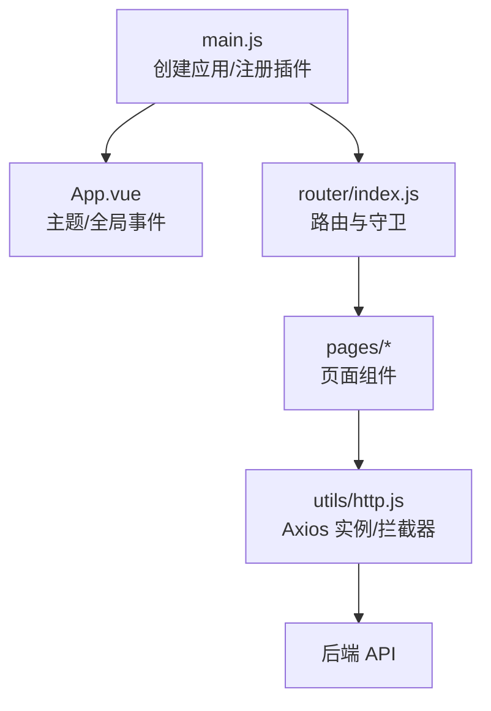
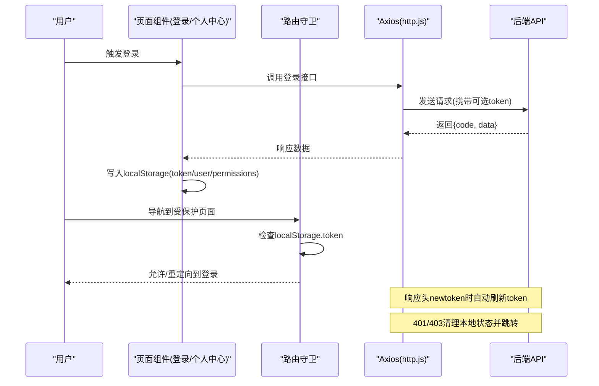
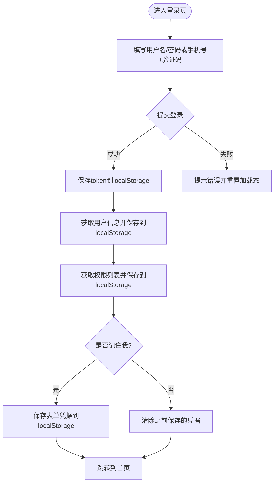
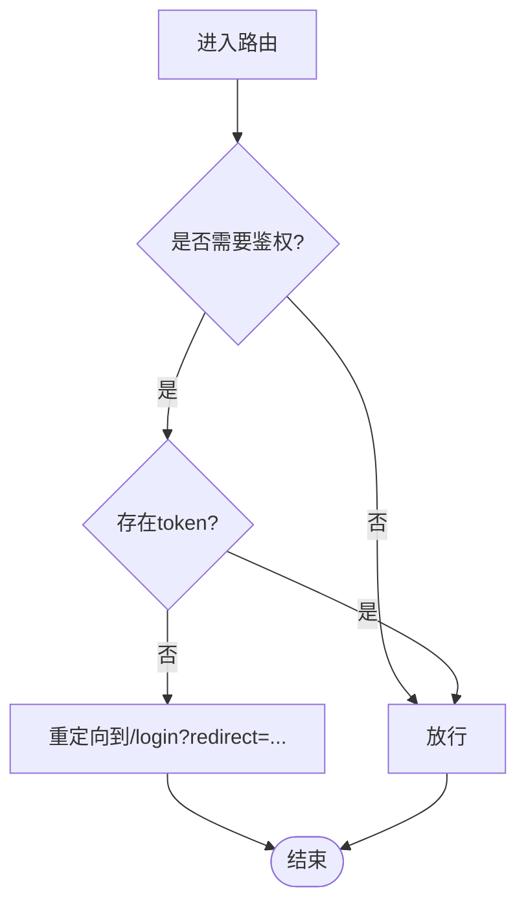
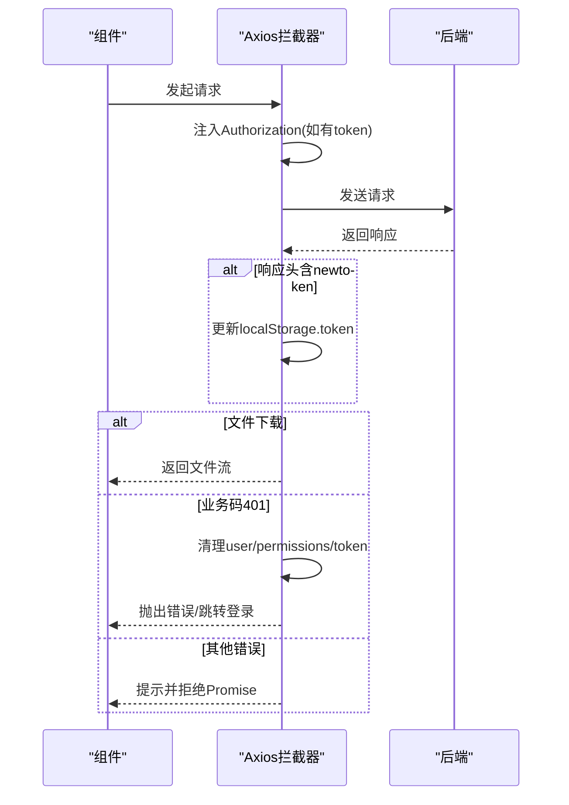
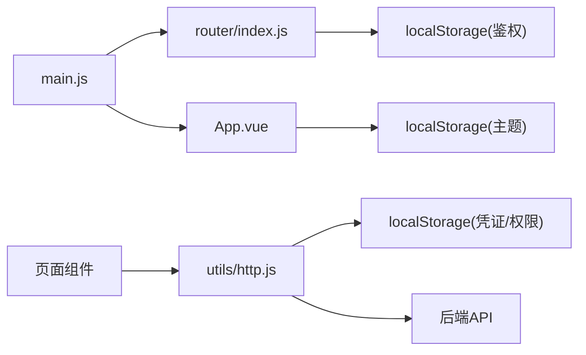

# 状态管理

<cite>
**本文引用的文件**
- [main.js](file://vue/kevin.web.vue/src/main.js)
- [App.vue](file://vue/kevin.web.vue/src/App.vue)
- [index.js](file://vue/kevin.web.vue/src/router/index.js)
- [http.js](file://vue/kevin.web.vue/src/utils/http.js)
- [kevinLogin.vue](file://vue/kevin.web.vue/src/pages/kevinLogin.vue)
- [UserProfile.vue](file://vue/kevin.web.vue/src/pages/UserProfile.vue)
</cite>

## 目录
1. [简介](#简介)
2. [项目结构](#项目结构)
3. [核心组件](#核心组件)
4. [架构总览](#架构总览)
5. [详细组件分析](#详细组件分析)
6. [依赖关系分析](#依赖关系分析)
7. [性能考虑](#性能考虑)
8. [故障排查指南](#故障排查指南)
9. [结论](#结论)
10. [附录](#附录)

## 简介
本文件面向 NetCoreKevin 前端的状态管理，聚焦于应用状态的组织方式与数据流策略。当前前端未引入集中式状态库（如 Pinia/Vuex），采用“组件级响应式 + 路由守卫 + 本地存储”的轻量方案：用户会话、权限与系统配置等全局信息通过 localStorage 持久化；页面内状态使用 Vue 的 ref/reactive 管理；网络请求统一由 Axios 拦截器处理认证与错误；路由守卫负责鉴权跳转。本文据此梳理状态模型、数据流、持久化与缓存策略，并给出最佳实践与优化建议。

## 项目结构
前端基于 Vue 3 + Ant Design Vue，入口初始化应用与插件，路由定义页面与鉴权规则，Axios 封装统一网络层，登录与个人中心等页面承载具体业务状态。

图表来源
- [main.js:1-20](file://vue/kevin.web.vue/src/main.js#L1-L20)
- [App.vue:1-53](file://vue/kevin.web.vue/src/App.vue#L1-L53)
- [index.js:1-191](file://vue/kevin.web.vue/src/router/index.js#L1-L191)
- [http.js:1-125](file://vue/kevin.web.vue/src/utils/http.js#L1-L125)

章节来源
- [main.js:1-20](file://vue/kevin.web.vue/src/main.js#L1-L20)
- [index.js:1-191](file://vue/kevin.web.vue/src/router/index.js#L1-L191)

## 核心组件
- 应用启动与主题：main.js 创建 Vue 应用并挂载；App.vue 提供全局主题与跨标签页的主题同步。
- 路由与鉴权：router/index.js 定义路由与 beforeEach 守卫，依据 localStorage 中的 token 控制访问。
- 网络层：utils/http.js 封装 Axios，统一注入 Authorization、处理 401/403/下载等场景，并在响应中更新 token。
- 登录流程：pages/kevinLogin.vue 完成登录、获取用户信息与权限并存入 localStorage。
- 用户资料：pages/UserProfile.vue 从 localStorage 读取用户信息展示。

章节来源
- [App.vue:1-53](file://vue/kevin.web.vue/src/App.vue#L1-L53)
- [index.js:177-191](file://vue/kevin.web.vue/src/router/index.js#L177-L191)
- [http.js:11-25](file://vue/kevin.web.vue/src/utils/http.js#L11-L25)
- [http.js:29-99](file://vue/kevin.web.vue/src/utils/http.js#L29-L99)
- [kevinLogin.vue:239-302](file://vue/kevin.web.vue/src/pages/kevinLogin.vue#L239-L302)
- [UserProfile.vue:127-136](file://vue/kevin.web.vue/src/pages/UserProfile.vue#L127-L136)

## 架构总览
整体数据流遵循“组件驱动 -> 网络层 -> 服务端 -> 状态落盘 -> 组件响应”的闭环。鉴权与权限在路由与网络层双重保障，用户上下文以 JSON 形式持久化到 localStorage。

图表来源
- [kevinLogin.vue:239-302](file://vue/kevin.web.vue/src/pages/kevinLogin.vue#L239-L302)
- [index.js:177-191](file://vue/kevin.web.vue/src/router/index.js#L177-L191)
- [http.js:11-25](file://vue/kevin.web.vue/src/utils/http.js#L11-L25)
- [http.js:29-99](file://vue/kevin.web.vue/src/utils/http.js#L29-L99)

## 详细组件分析

### 登录与会话状态
- 登录成功后将 token、用户信息、权限列表写入 localStorage，作为后续请求与鉴权的依据。
- 支持“记住我”选项，将表单凭据持久化以便下次快速登录。
- 登录完成后跳转到主页。

图表来源
- [kevinLogin.vue:239-302](file://vue/kevin.web.vue/src/pages/kevinLogin.vue#L239-L302)
- [kevinLogin.vue:317-343](file://vue/kevin.web.vue/src/pages/kevinLogin.vue#L317-L343)

章节来源
- [kevinLogin.vue:239-302](file://vue/kevin.web.vue/src/pages/kevinLogin.vue#L239-L302)
- [kevinLogin.vue:317-343](file://vue/kevin.web.vue/src/pages/kevinLogin.vue#L317-L343)

### 路由守卫与权限控制
- 路由 meta.requiresAuth 标记受保护页面。
- beforeEach 检查 localStorage.token，未登录则重定向到 /login；已登录访问登录页则重定向到 /home。
- 结合网络层 401 处理，形成前后端双重鉴权。

图表来源
- [index.js:177-191](file://vue/kevin.web.vue/src/router/index.js#L177-L191)

章节来源
- [index.js:177-191](file://vue/kevin.web.vue/src/router/index.js#L177-L191)

### 网络层与响应式更新
- 请求拦截：自动附加 Authorization 头；400 错误提示。
- 响应拦截：
  - 若响应头包含 newtoken，则更新 localStorage 中的 token。
  - 若为文件下载类型，直接交由文件处理器处理。
  - 若 code 为 401，清理 user、UserPermissions、token 并跳转登录。
  - 其他错误按状态码提示并拒绝 Promise。
- 该设计使“令牌刷新/失效”对上层透明，组件无需关心鉴权细节。

图表来源
- [http.js:11-25](file://vue/kevin.web.vue/src/utils/http.js#L11-L25)
- [http.js:29-99](file://vue/kevin.web.vue/src/utils/http.js#L29-L99)

章节来源
- [http.js:11-25](file://vue/kevin.web.vue/src/utils/http.js#L11-L25)
- [http.js:29-99](file://vue/kevin.web.vue/src/utils/http.js#L29-L99)

### 用户资料与本地读取
- 个人中心从 localStorage 读取 user 并渲染，体现“状态落盘 -> 组件读取”的简单模式。
- 修改密码功能通过 API 完成，成功后关闭弹窗并提示。

章节来源
- [UserProfile.vue:127-136](file://vue/kevin.web.vue/src/pages/UserProfile.vue#L127-L136)
- [UserProfile.vue:157-194](file://vue/kevin.web.vue/src/pages/UserProfile.vue#L157-L194)

### 主题与跨标签页同步
- App.vue 监听 window.storage 事件，当其他标签页变更主题相关存储时，延迟刷新主题色，实现多标签页主题一致。

章节来源
- [App.vue:24-40](file://vue/kevin.web.vue/src/App.vue#L24-L40)

## 依赖关系分析
- main.js 依赖 router 与 UI 框架，不直接持有业务状态。
- router/index.js 依赖 localStorage 进行鉴权判断。
- utils/http.js 依赖 axios 与 ant-design-vue 的消息提示，承担全局鉴权与错误处理。
- 页面组件依赖 http.js 提供的网络能力，并通过 localStorage 读写全局状态。

图表来源
- [main.js:1-20](file://vue/kevin.web.vue/src/main.js#L1-L20)
- [index.js:177-191](file://vue/kevin.web.vue/src/router/index.js#L177-L191)
- [http.js:11-25](file://vue/kevin.web.vue/src/utils/http.js#L11-L25)
- [http.js:29-99](file://vue/kevin.web.vue/src/utils/http.js#L29-L99)
- [App.vue:24-40](file://vue/kevin.web.vue/src/App.vue#L24-L40)

章节来源
- [main.js:1-20](file://vue/kevin.web.vue/src/main.js#L1-L20)
- [index.js:177-191](file://vue/kevin.web.vue/src/router/index.js#L177-L191)
- [http.js:11-25](file://vue/kevin.web.vue/src/utils/http.js#L11-L25)
- [http.js:29-99](file://vue/kevin.web.vue/src/utils/http.js#L29-L99)
- [App.vue:24-40](file://vue/kevin.web.vue/src/App.vue#L24-L40)

## 性能考虑
- 避免重复请求：对频繁读取的用户/权限数据，可在组件内做短期缓存或使用内存对象缓存，减少 localStorage 序列化开销。
- 批量更新：登录成功后一次性写入 token/user/permissions，减少多次 I/O。
- 懒加载与按需引入：路由与页面可按需拆分，降低首屏体积。
- 防抖/节流：对高频操作（如搜索、滚动）加防抖/节流，减少不必要的状态更新与请求。
- 大列表渲染：分页加载、虚拟滚动，避免一次性渲染大量 DOM。
- 主题同步延迟：跨标签页主题更新已使用 setTimeout 延迟，避免频繁重绘。

[本节为通用指导，不直接分析具体文件]

## 故障排查指南
- 401 未登录：检查网络层是否正确清理 user/permissions/token 并跳转；确认路由守卫是否拦截到登录页。
- 权限异常：确认登录后是否正确写入 UserPermissions；检查路由 meta 与实际权限匹配逻辑。
- 主题不同步：确认 storage 事件是否触发；检查浏览器是否禁用 storage 事件。
- 文件下载失败：检查响应头 content-type 判断逻辑与文件处理器。

章节来源
- [http.js:29-99](file://vue/kevin.web.vue/src/utils/http.js#L29-L99)
- [index.js:177-191](file://vue/kevin.web.vue/src/router/index.js#L177-L191)
- [App.vue:24-40](file://vue/kevin.web.vue/src/App.vue#L24-L40)

## 结论
当前前端采用轻量级状态管理：组件级响应式 + 路由守卫 + localStorage 持久化。其优点是结构简单、上手快；缺点是跨组件共享复杂时维护成本上升。建议在保持现有风格的前提下，逐步引入集中式状态管理（如 Pinia）来统一管理用户会话、权限与系统配置，提升可测试性与可维护性。

[本节为总结，不直接分析具体文件]

## 附录
- 关键状态键说明
  - token：登录令牌，用于请求鉴权与刷新。
  - user：当前用户信息，JSON 字符串。
  - UserPermissions：权限列表，JSON 字符串。
  - savedLoginInfo：可选的“记住我”凭据，JSON 字符串。
- 典型数据流
  - 登录 -> 写 token/user/permissions -> 路由放行 -> 页面读取 user 展示。
  - 请求 -> 注入 Authorization -> 401 清理本地状态 -> 跳转登录。
- 扩展建议
  - 增加权限校验工具函数，供路由与按钮级权限控制复用。
  - 将主题配置抽离为独立模块，统一读写 localStorage。
  - 为网络层增加重试与退避策略，提升弱网体验。

[本节为补充说明，不直接分析具体文件]