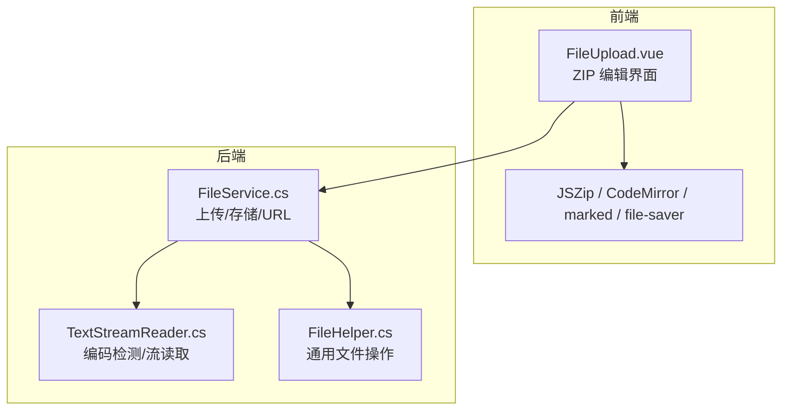
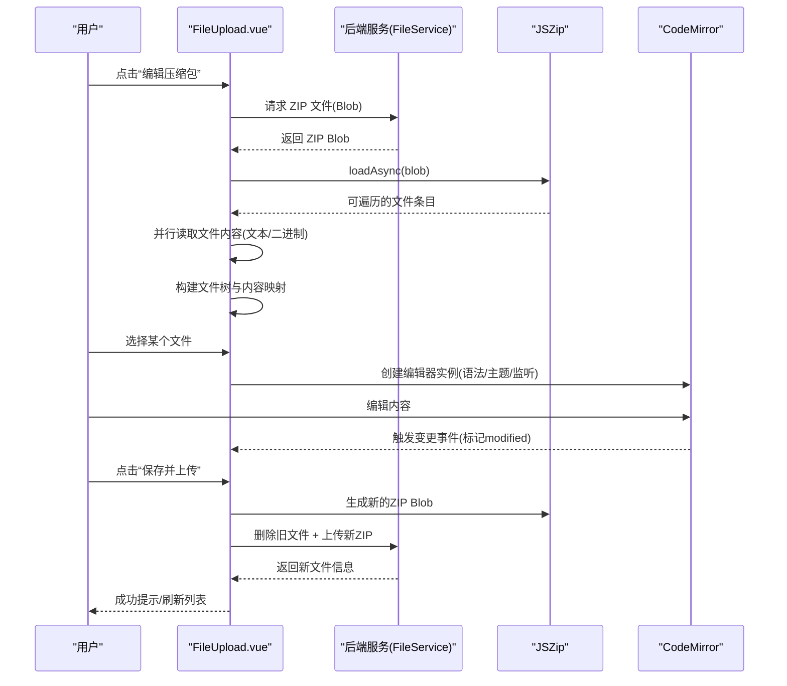
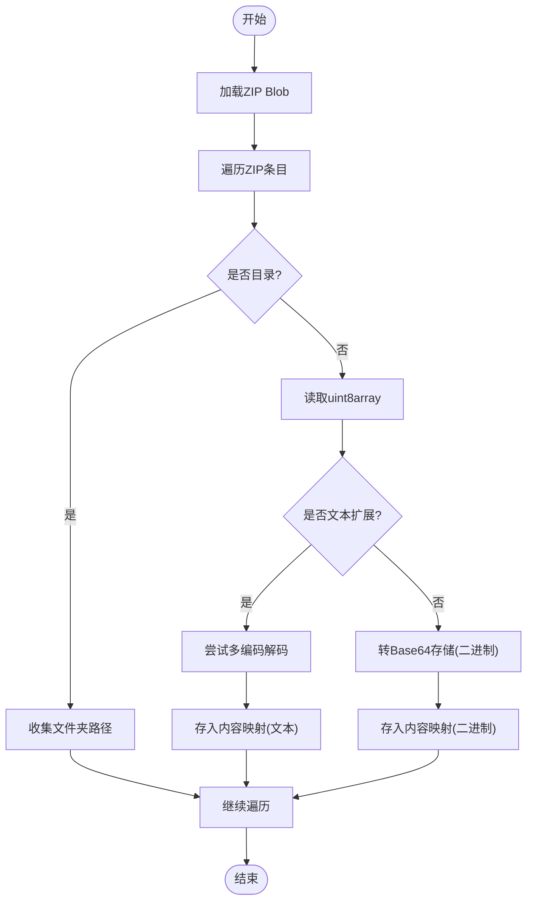
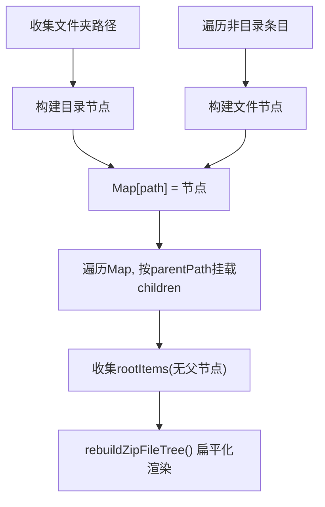
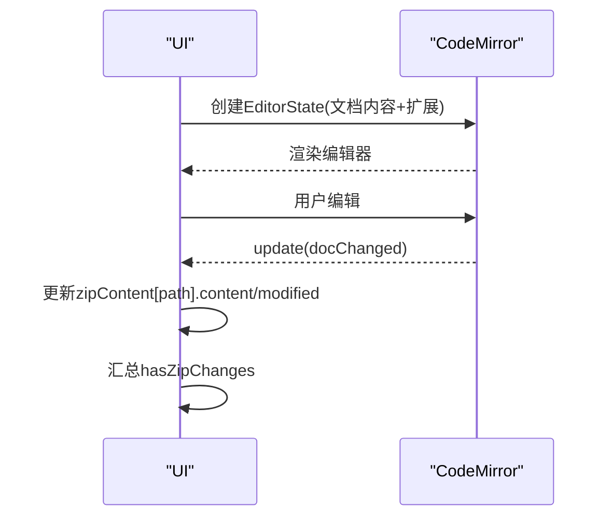
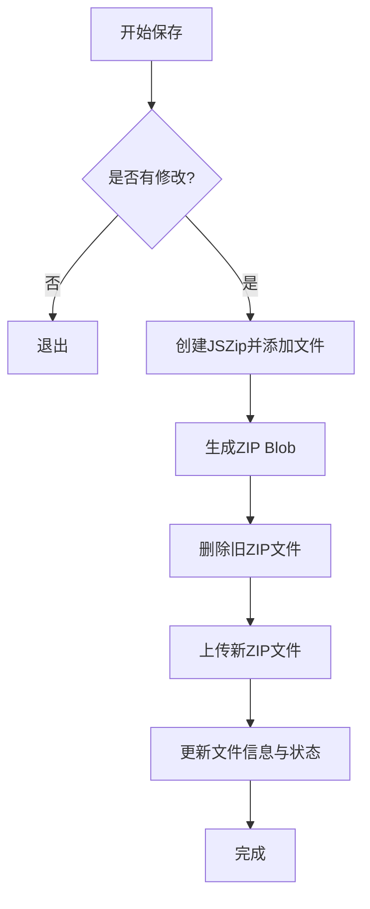
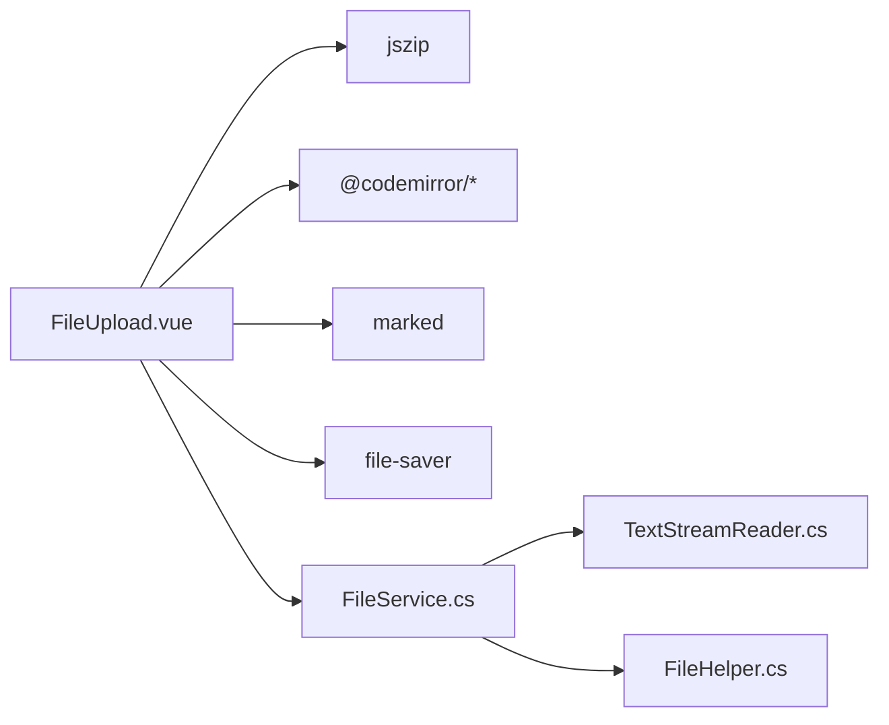

# 压缩包编辑功能

<cite>
**本文引用的文件**
- [FileUpload.vue](file://vue/kevin.web.vue/src/components/FileUpload.vue)
- [package.json](file://vue/kevin.web.vue/package.json)
- [TextStreamReader.cs](file://Kevin/kevin.Module/Kevin.Common/Helper/FileHandleTools/TextStreamReader.cs)
- [FileHelper.cs](file://Kevin/kevin.Module/Kevin.Common/Helper/FileHelper.cs)
- [FileService.cs](file://Kevin/Application/Services/FileService.cs)
</cite>

## 目录
1. [简介](#简介)
2. [项目结构](#项目结构)
3. [核心组件](#核心组件)
4. [架构总览](#架构总览)
5. [详细组件分析](#详细组件分析)
6. [依赖关系分析](#依赖关系分析)
7. [性能考虑](#性能考虑)
8. [故障排查指南](#故障排查指南)
9. [结论](#结论)
10. [附录：使用示例与最佳实践](#附录使用示例与最佳实践)

## 简介
本功能提供在浏览器端对 ZIP 压缩包进行在线编辑的完整能力，包括解压、文件树展示、代码编辑器集成、修改保存等。前端基于 JSZip 解析 ZIP、构建文件树并渲染；通过 CodeMirror（基于 @codemirror/view）实现语法高亮、主题、实时更新；支持多种文本编码自动识别（UTF-8、GBK、GB2312、GB18030、Big5），并对二进制文件进行识别与提示；保存时重新打包 ZIP、删除旧文件并上传新文件，或支持本地下载。后端提供文件上传、存储与 URL 获取能力，以及流式读取与编码检测工具。

## 项目结构
- 前端核心：Vue 组件 FileUpload.vue 实现了 ZIP 编辑的全部交互逻辑，包括加载 ZIP、构建文件树、编辑器集成、保存与下载。
- 依赖库：JSZip 用于 ZIP 解析与生成；@codemirror/* 系列用于编辑器；marked 用于 Markdown 预览；file-saver 用于本地下载。
- 后端支撑：FileService 负责文件上传与存储；TextStreamReader 提供流式读取与编码检测；FileHelper 提供通用文件操作。

图表来源
- [FileUpload.vue:179-206](file://vue/kevin.web.vue/src/components/FileUpload.vue#L179-L206)
- [FileService.cs:179-215](file://Kevin/Application/Services/FileService.cs#L179-L215)
- [TextStreamReader.cs:12-36](file://Kevin/kevin.Module/Kevin.Common/Helper/FileHandleTools/TextStreamReader.cs#L12-L36)
- [FileHelper.cs:211-223](file://Kevin/kevin.Module/Kevin.Common/Helper/FileHelper.cs#L211-L223)

章节来源
- [FileUpload.vue:179-206](file://vue/kevin.web.vue/src/components/FileUpload.vue#L179-L206)
- [package.json:16-36](file://vue/kevin.web.vue/package.json#L16-L36)

## 核心组件
- ZIP 加载与解析：通过 JSZip.loadAsync 将远程 ZIP Blob 解析为可遍历的条目集合，异步读取每个文件内容（文本或二进制）。
- 文件树构建：收集所有文件夹路径，构建节点对象，再根据 parentPath 建立父子关系，最终生成根节点数组；展开折叠状态由 Set 维护，扁平化渲染。
- 编辑器集成：根据文件扩展名选择语言（Markdown 或 JavaScript），启用 One Dark 主题，监听文档变更以标记修改状态。
- 保存机制：遍历内存中的内容映射，重建 ZIP；若存在修改则删除原文件并上传新 ZIP，或导出为本地文件。
- 编码处理：文本文件尝试 UTF-8、GBK、GB2312、GB18030、Big5 解码，优先返回无替换字符的结果；后端 TextStreamReader 通过 BOM 检测编码。

章节来源
- [FileUpload.vue:555-697](file://vue/kevin.web.vue/src/components/FileUpload.vue#L555-L697)
- [FileUpload.vue:699-760](file://vue/kevin.web.vue/src/components/FileUpload.vue#L699-L760)
- [FileUpload.vue:762-847](file://vue/kevin.web.vue/src/components/FileUpload.vue#L762-L847)
- [TextStreamReader.cs:12-36](file://Kevin/kevin.Module/Kevin.Common/Helper/FileHandleTools/TextStreamReader.cs#L12-L36)

## 架构总览
前端通过 FileUpload.vue 发起 ZIP 编辑流程：
- 用户点击“编辑压缩包”后，组件从服务器拉取 ZIP 文件并转为 Blob，交由 JSZip 解析。
- 解析过程中并行读取各文件内容，区分文本与二进制，构建内容映射与文件树。
- 用户选择文件后，动态创建 CodeMirror 实例进行编辑，实时记录变更。
- 保存时重新打包 ZIP，删除旧文件并上传新文件，或下载为本地文件。

图表来源
- [FileUpload.vue:555-697](file://vue/kevin.web.vue/src/components/FileUpload.vue#L555-L697)
- [FileUpload.vue:699-760](file://vue/kevin.web.vue/src/components/FileUpload.vue#L699-L760)
- [FileUpload.vue:762-847](file://vue/kevin.web.vue/src/components/FileUpload.vue#L762-L847)
- [FileService.cs:179-215](file://Kevin/Application/Services/FileService.cs#L179-L215)

## 详细组件分析

### ZIP 解压与内容读取
- 使用 JSZip.loadAsync 加载 Blob，遍历 zip.forEach 获取相对路径与是否目录。
- 非目录文件通过 async('uint8array') 读取字节数组，按扩展名判断是否为文本类型。
- 文本文件采用多编码尝试解码（UTF-8、GBK、GB2312、GB18030、Big5），选择无替换字符的结果；二进制文件以 Base64 存储并在保存时还原为 Uint8Array。
- 同时收集所有中间文件夹路径，用于后续构建树结构。

图表来源
- [FileUpload.vue:575-629](file://vue/kevin.web.vue/src/components/FileUpload.vue#L575-L629)

章节来源
- [FileUpload.vue:575-629](file://vue/kevin.web.vue/src/components/FileUpload.vue#L575-L629)

### 文件树形结构生成算法
- 先收集所有文件夹路径，构造目录节点（含 name、path、isDirectory、parentPath、children）。
- 再遍历 ZIP 中非目录条目，构造文件节点。
- 使用 Map 将所有节点按 path 索引，再根据 parentPath 将子节点挂到父节点的 children 中，未找到父节点的作为根节点。
- 展开/折叠状态由 expandedFolders Set 管理，rebuildZipFileTree 将原始树扁平化为当前可见层级，避免重复渲染。

图表来源
- [FileUpload.vue:631-682](file://vue/kevin.web.vue/src/components/FileUpload.vue#L631-L682)
- [FileUpload.vue:532-553](file://vue/kevin.web.vue/src/components/FileUpload.vue#L532-L553)

章节来源
- [FileUpload.vue:631-682](file://vue/kevin.web.vue/src/components/FileUpload.vue#L631-L682)
- [FileUpload.vue:532-553](file://vue/kevin.web.vue/src/components/FileUpload.vue#L532-L553)

### CodeMirror 编辑器集成
- 根据文件扩展名选择语言：Markdown 使用 markdown()，其他文本默认使用 javascript()。
- 启用 oneDark 主题与 basicSetup，设置 EditorView 样式使高度自适应。
- 通过 updateListener 监听文档变更，更新内容映射中的 content 与 originalContent，计算 modified 标志，并汇总 hasZipChanges。
- 切换文件时销毁旧实例，避免内存泄漏与冲突。

图表来源
- [FileUpload.vue:699-760](file://vue/kevin.web.vue/src/components/FileUpload.vue#L699-L760)

章节来源
- [FileUpload.vue:699-760](file://vue/kevin.web.vue/src/components/FileUpload.vue#L699-L760)

### 保存机制与操作流程
- 变更检测：每次编辑器变更都会对比 originalContent，标记 modified；全局 hasZipChanges 表示是否存在任何修改。
- 重新打包：遍历 zipContent 映射，文本直接写入，二进制通过 atob 还原为 Uint8Array 后写入。
- 旧文件删除与新文件上传：调用后端删除接口移除原 ZIP，再将新生成的 Blob 作为 application/zip 上传，最后获取新文件信息并更新列表。
- 本地下载：若无修改或未启用上传，可将生成的 ZIP Blob 通过 file-saver 下载到本地。

图表来源
- [FileUpload.vue:762-847](file://vue/kevin.web.vue/src/components/FileUpload.vue#L762-L847)
- [FileService.cs:179-215](file://Kevin/Application/Services/FileService.cs#L179-L215)

章节来源
- [FileUpload.vue:762-847](file://vue/kevin.web.vue/src/components/FileUpload.vue#L762-L847)
- [FileService.cs:179-215](file://Kevin/Application/Services/FileService.cs#L179-L215)

### 编码处理策略
- 前端文本解码：依次尝试 UTF-8、GBK、GB2312、GB18030、Big5，选择无替换字符（\ufffd）的解码结果，否则回退到 UTF-8。
- 后端流式读取：TextStreamReader 通过读取前几个字节检测 BOM，确定编码（如 UTF-8 BOM、UTF-16 LE/BE、UTF-32 LE），然后以对应编码读取文本。
- 该策略确保中文等多字节编码文件在前端正确显示与编辑，后端也能准确读取与处理。

章节来源
- [FileUpload.vue:593-608](file://vue/kevin.web.vue/src/components/FileUpload.vue#L593-L608)
- [TextStreamReader.cs:12-36](file://Kevin/kevin.Module/Kevin.Common/Helper/FileHandleTools/TextStreamReader.cs#L12-L36)

## 依赖关系分析
- 前端依赖：
  - jszip：ZIP 解析与生成。
  - @codemirror/*：编辑器核心、语言扩展、主题、视图。
  - marked：Markdown 预览渲染。
  - file-saver：本地下载 ZIP。
- 后端依赖：
  - FileService：文件上传、存储、URL 生成。
  - TextStreamReader：流式读取与编码检测。
  - FileHelper：通用文件操作（如远程流下载、文件名提取等）。

图表来源
- [package.json:16-36](file://vue/kevin.web.vue/package.json#L16-L36)
- [FileUpload.vue:179-206](file://vue/kevin.web.vue/src/components/FileUpload.vue#L179-L206)
- [FileService.cs:179-215](file://Kevin/Application/Services/FileService.cs#L179-L215)

章节来源
- [package.json:16-36](file://vue/kevin.web.vue/package.json#L16-L36)
- [FileUpload.vue:179-206](file://vue/kevin.web.vue/src/components/FileUpload.vue#L179-L206)

## 性能考虑
- 并行读取：使用 Promise.all 并行读取 ZIP 内文件内容，减少总体加载时间。
- 增量更新：编辑器变更仅更新内存映射，避免频繁网络请求。
- 资源清理：切换文件时销毁旧编辑器实例，防止内存泄漏。
- 大文件建议：对于超大 ZIP，建议分页或按需加载文件内容，避免一次性加载全部导致内存压力。

[本节为通用指导，不直接分析具体文件]

## 故障排查指南
- 加载 ZIP 失败：检查网络请求与 Blob 转换是否正确；确认 JSZip.loadAsync 参数与错误处理。
- 文本乱码：确认前端解码顺序与后端编码一致；必要时调整编码尝试顺序或强制指定编码。
- 二进制文件无法编辑：前端已识别并提示不支持在线编辑；如需编辑，请转换为文本格式或使用专用工具。
- 保存失败：检查删除旧文件与上传新文件的接口返回；确认权限与存储空间。

章节来源
- [FileUpload.vue:691-697](file://vue/kevin.web.vue/src/components/FileUpload.vue#L691-L697)
- [FileUpload.vue:762-847](file://vue/kevin.web.vue/src/components/FileUpload.vue#L762-L847)

## 结论
本功能通过前端 JSZip 与 CodeMirror 的组合，提供了完整的 ZIP 在线编辑体验：支持多编码文本、二进制识别、文件树可视化与交互式编辑，并在保存时实现“删除旧文件 + 上传新文件”的原子性更新。后端配合流式读取与编码检测，确保跨平台与跨编码的一致性。整体方案简洁高效，适合中小规模 ZIP 的快速编辑与维护。

[本节为总结，不直接分析具体文件]

## 附录：使用示例与最佳实践
- 打开 ZIP 编辑：在文件列表中点击“编辑压缩包”，等待加载完成后选择目标文件进行编辑。
- 编辑文本文件：支持 Markdown 与常见编程语言的高亮与主题；编辑后观察右上角“已修改”标签。
- 保存与上传：点击“保存并上传”，系统将删除原 ZIP 并上传新版本；也可点击“下载Zip”导出本地副本。
- 编码问题：如遇中文乱码，确认源文件编码与前端解码顺序匹配；必要时在后端统一编码后再上传。
- 大文件优化：对大型 ZIP 建议分批次编辑或限制单次加载的文件数量，提升响应速度。

[本节为使用指导，不直接分析具体文件]