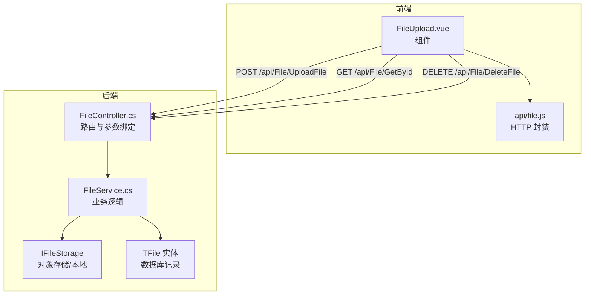
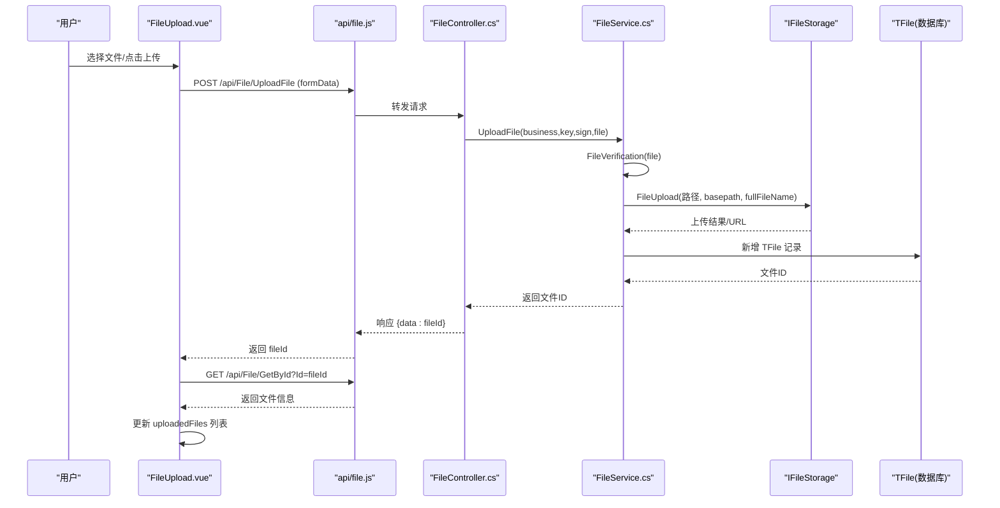
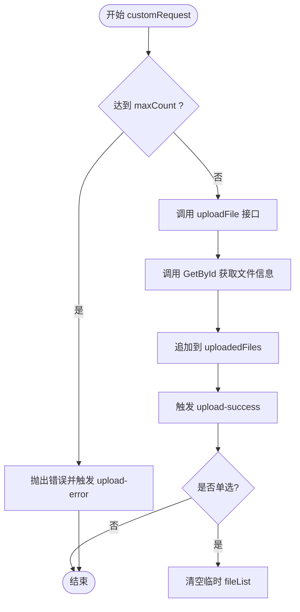
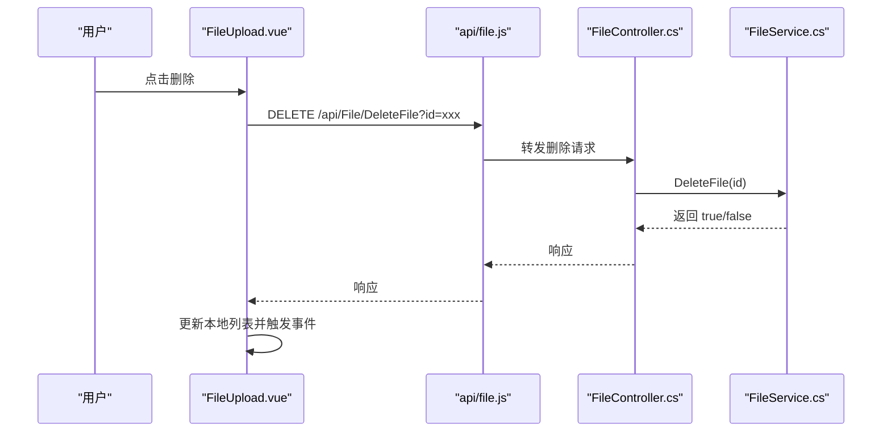
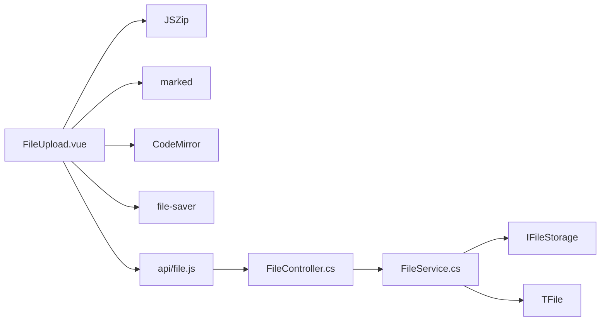

# 基础上传功能

<cite>
**本文引用的文件**
- [FileUpload.vue](file://vue/kevin.web.vue/src/components/FileUpload.vue)
- [file.js](file://vue/kevin.web.vue/src/api/file.js)
- [FileController.cs](file://Kevin/ Kevin.Web.Basics/Controllers/FileController.cs)
- [FileService.cs](file://Kevin/Application/Services/FileService.cs)
</cite>

## 目录
1. [简介](#简介)
2. [项目结构](#项目结构)
3. [核心组件与能力](#核心组件与能力)
4. [架构总览](#架构总览)
5. [详细组件分析](#详细组件分析)
6. [依赖关系分析](#依赖关系分析)
7. [性能与体验优化建议](#性能与体验优化建议)
8. [故障排查指南](#故障排查指南)
9. [结论](#结论)
10. [附录：使用示例与最佳实践](#附录使用示例与最佳实践)

## 简介
本章节面向“文件上传”的基础能力，覆盖多文件上传、文件类型限制、文件大小校验、上传状态反馈、已上传文件列表展示、删除、以及压缩包在线编辑等。文档同时说明组件的 props 配置项（business、keyValue、sign、accept、multiple、maxCount、disabled、showUploadList、uploadButtonText、initialFiles 等），并解释自定义上传流程 customRequest 的实现机制，包括验证、错误处理与成功回调。

## 项目结构
前端以 Vue 组件封装上传能力，调用统一的 file API；后端通过 ASP.NET Core 控制器暴露上传、下载、删除等接口，并由服务层完成存储与持久化。

图表来源
- [FileUpload.vue:1-177](file://vue/kevin.web.vue/src/components/FileUpload.vue#L1-L177)
- [file.js:8-23](file://vue/kevin.web.vue/src/api/file.js#L8-L23)
- [FileController.cs:46-93](file://Kevin/ Kevin.Web.Basics/Controllers/FileController.cs#L46-L93)
- [FileService.cs:169-236](file://Kevin/Application/Services/FileService.cs#L169-L236)

章节来源
- [FileUpload.vue:1-177](file://vue/kevin.web.vue/src/components/FileUpload.vue#L1-L177)
- [file.js:8-23](file://vue/kevin.web.vue/src/api/file.js#L8-L23)
- [FileController.cs:46-93](file://Kevin/ Kevin.Web.Basics/Controllers/FileController.cs#L46-L93)
- [FileService.cs:169-236](file://Kevin/Application/Services/FileService.cs#L169-L236)

## 核心组件与能力
- 多文件上传：支持一次选择多个文件，结合 multiple 与 maxCount 控制数量。
- 文件类型验证：通过 accept 属性限制可选择的文件类型；后端 FileVerification 对空文件与大小进行校验。
- 文件大小限制：后端根据字典配置或默认值限制单文件大小。
- 上传进度显示：当前实现为整体上传态（按钮 loading），未实现逐文件进度条；可通过扩展 customRequest 接入浏览器原生 XMLHttpRequest 进度事件。
- 已上传文件列表：展示文件名、大小、预览、删除等操作。
- 删除：调用删除接口后更新本地列表并触发事件。
- 压缩包编辑：支持在线查看 zip 内文本文件、修改并重新打包上传。

章节来源
- [FileUpload.vue:207-256](file://vue/kevin.web.vue/src/components/FileUpload.vue#L207-L256)
- [FileUpload.vue:290-336](file://vue/kevin.web.vue/src/components/FileUpload.vue#L290-L336)
- [FileService.cs:238-253](file://Kevin/Application/Services/FileService.cs#L238-L253)

## 架构总览
前端组件通过 Ant Design Vue 的 Upload 控件驱动，customRequest 接管上传流程；成功后拉取文件信息并维护本地列表。后端控制器接收请求，服务层执行校验、落盘、对象存储同步、写入 TFile 表并返回 ID。

图表来源
- [FileUpload.vue:290-336](file://vue/kevin.web.vue/src/components/FileUpload.vue#L290-L336)
- [file.js:8-23](file://vue/kevin.web.vue/src/api/file.js#L8-L23)
- [FileController.cs:46-61](file://Kevin/ Kevin.Web.Basics/Controllers/FileController.cs#L46-L61)
- [FileService.cs:169-236](file://Kevin/Application/Services/FileService.cs#L169-L236)

## 详细组件分析

### 组件 Props 与行为
- business（必填）：业务标识，用于区分不同业务域的文件归属。
- keyValue（必填）：键值，通常对应业务记录的 ID，便于关联文件与数据。
- sign（必填）：签名标记，用于权限或审计追踪。
- accept：浏览器侧接受的文件类型过滤（如 image/*,.pdf）。
- multiple：是否允许选择多个文件。
- maxCount：最大文件数量限制（前端在 customRequest 中校验）。
- disabled：禁用上传与操作。
- showUploadList：是否显示上传控件自带的列表（组件内部维护了独立的已上传列表）。
- uploadButtonText：上传按钮文案。
- initialFiles：初始已上传文件数组，用于回显历史文件。
- enablePreview：是否启用预览（图片、PDF、Word、Markdown、文本）。
- enableZipEdit：是否启用压缩包在线编辑。

章节来源
- [FileUpload.vue:207-256](file://vue/kevin.web.vue/src/components/FileUpload.vue#L207-L256)

### 自定义上传 customRequest 流程
- 触发时机：Ant Design Upload 触发 custom-request 时调用。
- 参数：options.file（待上传文件）、onSuccess、onError。
- 流程要点：
  - 设置 uploading 状态。
  - 若启用 maxCount，检查当前已上传数量。
  - 调用 uploadFile 接口提交表单数据。
  - 获取文件详情并追加到 uploadedFiles。
  - 触发 upload-success 事件，传递 fileId、fileName、fileSize、url、path。
  - 非多选模式清空临时文件列表。
  - 异常时触发 upload-error 事件。
- 注意：当前未实现逐文件进度上报，如需进度可在 customRequest 中使用 XMLHttpRequest 监听 progress 事件并更新 UI。

图表来源
- [FileUpload.vue:290-336](file://vue/kevin.web.vue/src/components/FileUpload.vue#L290-L336)

章节来源
- [FileUpload.vue:290-336](file://vue/kevin.web.vue/src/components/FileUpload.vue#L290-L336)

### 文件类型与大小校验
- 前端 accept：限制可选文件类型，提升用户体验。
- 后端 FileVerification：
  - 校验文件是否为空。
  - 读取系统字典中的“上传文件大小限制”，若无配置则默认 50MB。
  - 超过限制抛出友好异常。

章节来源
- [FileUpload.vue:207-256](file://vue/kevin.web.vue/src/components/FileUpload.vue#L207-L256)
- [FileService.cs:238-253](file://Kevin/Application/Services/FileService.cs#L238-L253)

### 文件删除流程
- 触发：点击删除按钮。
- 调用：deleteFileById 接口。
- 成功后：从本地 uploadedFiles 移除该文件，触发 delete-success 事件，提示成功。
- 失败：捕获异常，触发 delete-error 事件，提示失败。

图表来源
- [FileUpload.vue:342-369](file://vue/kevin.web.vue/src/components/FileUpload.vue#L342-L369)
- [file.js:119-122](file://vue/kevin.web.vue/src/api/file.js#L119-L122)
- [FileController.cs:200-210](file://Kevin/ Kevin.Web.Basics/Controllers/FileController.cs#L200-L210)
- [FileService.cs:48-65](file://Kevin/Application/Services/FileService.cs#L48-L65)

章节来源
- [FileUpload.vue:342-369](file://vue/kevin.web.vue/src/components/FileUpload.vue#L342-L369)
- [file.js:119-122](file://vue/kevin.web.vue/src/api/file.js#L119-L122)
- [FileController.cs:200-210](file://Kevin/ Kevin.Web.Basics/Controllers/FileController.cs#L200-L210)
- [FileService.cs:48-65](file://Kevin/Application/Services/FileService.cs#L48-L65)

### 预览与压缩包编辑
- 预览：
  - 图片：直接展示。
  - PDF：嵌入预览。
  - Word：通过 Google Docs Viewer 在线预览。
  - Markdown：渲染 HTML。
  - 文本：尝试多种编码解码后展示。
- 压缩包编辑：
  - 下载 zip 并解析为树形结构。
  - 文本文件使用 CodeMirror 编辑器，二进制文件仅提示不支持编辑。
  - 保存时重建 zip，删除旧文件并上传新 zip，更新列表。

章节来源
- [FileUpload.vue:414-495](file://vue/kevin.web.vue/src/components/FileUpload.vue#L414-L495)
- [FileUpload.vue:555-697](file://vue/kevin.web.vue/src/components/FileUpload.vue#L555-L697)
- [FileUpload.vue:762-821](file://vue/kevin.web.vue/src/components/FileUpload.vue#L762-L821)

## 依赖关系分析
- 前端依赖：
  - Ant Design Vue Upload 组件提供基础交互。
  - JSZip 用于 zip 解压/打包。
  - marked 用于 Markdown 渲染。
  - CodeMirror 用于文本编辑。
  - file-saver 用于下载。
- 后端依赖：
  - IFileStorage 抽象存储实现（本地/云存储）。
  - TFile 实体持久化。
  - 字典配置动态控制文件大小上限。

图表来源
- [FileUpload.vue:181-205](file://vue/kevin.web.vue/src/components/FileUpload.vue#L181-L205)
- [file.js:1-23](file://vue/kevin.web.vue/src/api/file.js#L1-L23)
- [FileController.cs:1-29](file://Kevin/ Kevin.Web.Basics/Controllers/FileController.cs#L1-L29)
- [FileService.cs:1-20](file://Kevin/Application/Services/FileService.cs#L1-L20)

章节来源
- [FileUpload.vue:181-205](file://vue/kevin.web.vue/src/components/FileUpload.vue#L181-L205)
- [file.js:1-23](file://vue/kevin.web.vue/src/api/file.js#L1-L23)
- [FileController.cs:1-29](file://Kevin/ Kevin.Web.Basics/Controllers/FileController.cs#L1-L29)
- [FileService.cs:1-20](file://Kevin/Application/Services/FileService.cs#L1-L20)

## 性能与体验优化建议
- 上传进度：当前为整体 loading，建议在 customRequest 中使用 XMLHttpRequest 监听 progress 事件，按文件维度更新进度条。
- 大文件分片：对于超大文件，可考虑前端分片上传与合并，减少超时风险。
- 并发控制：批量上传时可限制并发数，避免阻塞网络与服务器资源。
- 缓存策略：预览图片可使用缩略图接口降低带宽。
- 错误重试：对网络抖动导致的失败增加自动重试机制。

[本节为通用建议，不直接分析具体文件]

## 故障排查指南
- 上传失败：
  - 检查 accept 与后端 FileVerification 是否匹配。
  - 确认文件大小是否超过字典配置的限制。
  - 查看控制台日志与网络面板，定位接口响应。
- 删除失败：
  - 确认文件 ID 有效且未被软删除。
  - 检查后端 DeleteFile 返回值与异常信息。
- 预览异常：
  - 文本编码问题：组件会尝试多种编码解码，仍失败时需检查源文件编码。
  - Word/PDF：确保 URL 可公开访问或被代理放行。
- Zip 编辑：
  - 二进制文件无法编辑属预期行为。
  - 保存前需有变更才会启用保存按钮。

章节来源
- [FileService.cs:238-253](file://Kevin/Application/Services/FileService.cs#L238-L253)
- [FileUpload.vue:451-495](file://vue/kevin.web.vue/src/components/FileUpload.vue#L451-L495)
- [FileUpload.vue:718-730](file://vue/kevin.web.vue/src/components/FileUpload.vue#L718-L730)

## 结论
该上传组件提供了完整的前端上传、列表管理、预览与删除能力，并通过后端服务实现了统一的大小校验、存储与持久化。组件通过 props 灵活适配不同业务场景，customRequest 将上传流程解耦，便于扩展进度、重试与分片等功能。建议在生产环境中结合业务需求完善进度展示、并发控制与大文件处理能力。

[本节为总结性内容，不直接分析具体文件]

## 附录：使用示例与最佳实践
- 基本用法
  - 传入 business、keyValue、sign 三个必填参数，用于标识业务上下文与权限。
  - 通过 accept 限制文件类型，例如只允许图片与 PDF。
  - 使用 multiple 开启多选，配合 maxCount 限制数量。
  - 使用 initialFiles 回显历史文件，格式包含 id、name、size、url 等字段。
- 事件处理
  - 监听 upload-success 获取 fileId、fileName、fileSize、url、path，用于后续业务提交。
  - 监听 upload-error 处理失败提示与重试。
  - 监听 delete-success/delete-error 处理删除结果。
  - 监听 zip-updated 处理压缩包编辑后的替换。
- 最佳实践
  - 始终在后端进行文件类型与大小校验，前端校验仅用于体验优化。
  - 对敏感文件上传增加鉴权与签名校验。
  - 对预览链接做访问控制，避免越权访问。
  - 对批量上传增加并发限制与失败重试。
  - 对 zip 编辑保存采用“先删后传”的策略，保证原子性与一致性。

章节来源
- [FileUpload.vue:207-256](file://vue/kevin.web.vue/src/components/FileUpload.vue#L207-L256)
- [FileUpload.vue:290-336](file://vue/kevin.web.vue/src/components/FileUpload.vue#L290-L336)
- [FileUpload.vue:342-369](file://vue/kevin.web.vue/src/components/FileUpload.vue#L342-L369)
- [FileUpload.vue:762-821](file://vue/kevin.web.vue/src/components/FileUpload.vue#L762-L821)
- [file.js:8-23](file://vue/kevin.web.vue/src/api/file.js#L8-L23)
- [FileController.cs:46-93](file://Kevin/ Kevin.Web.Basics/Controllers/FileController.cs#L46-L93)
- [FileService.cs:169-236](file://Kevin/Application/Services/FileService.cs#L169-L236)