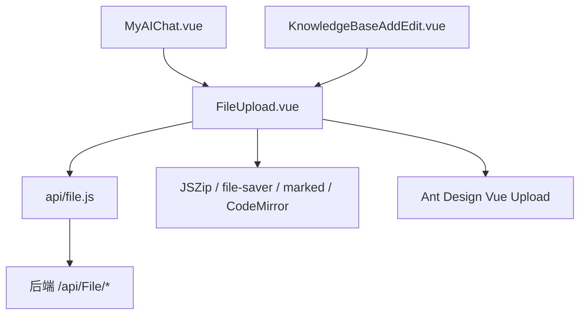
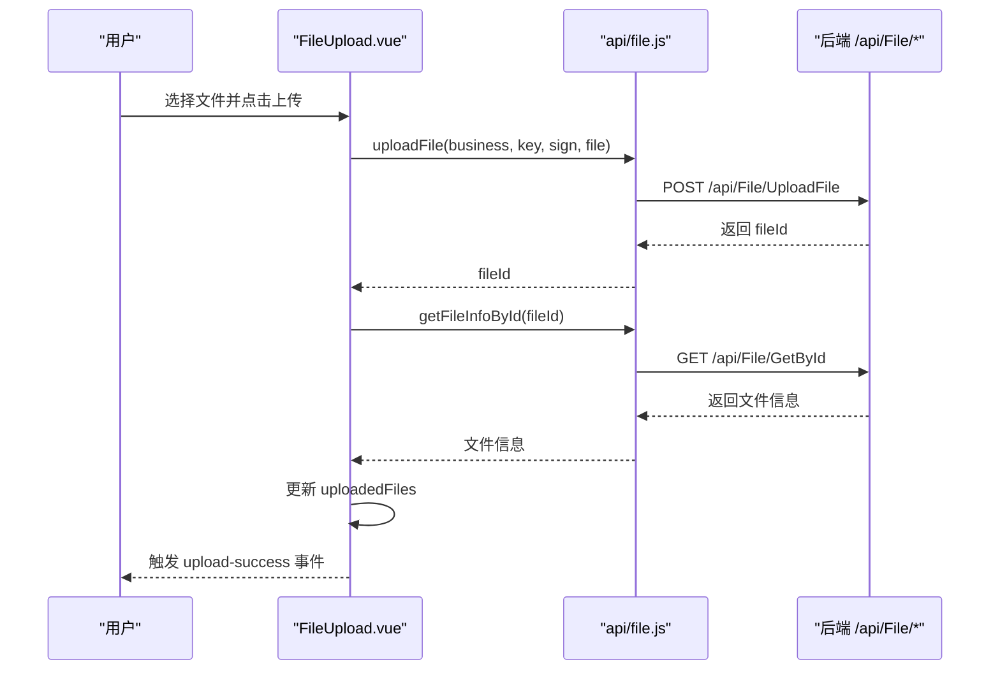
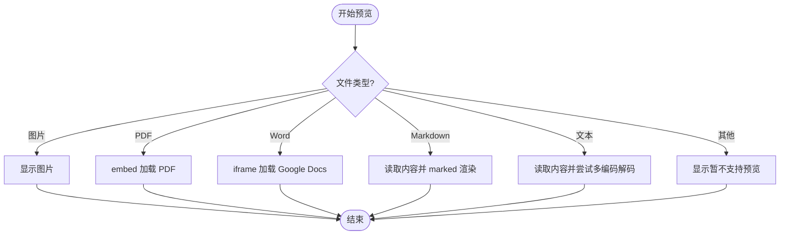
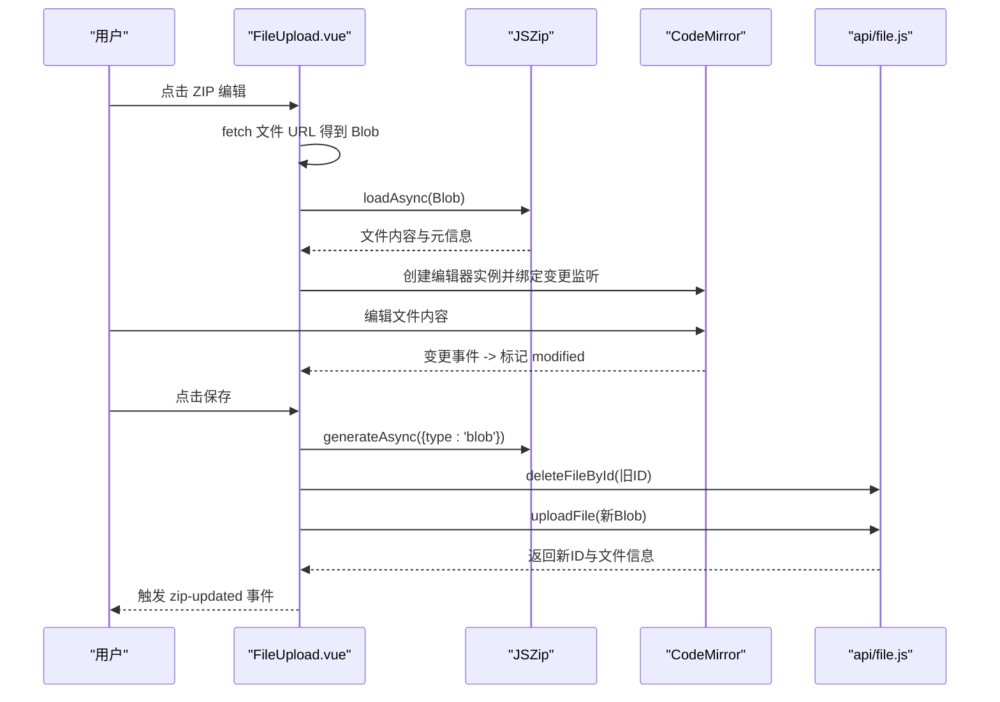
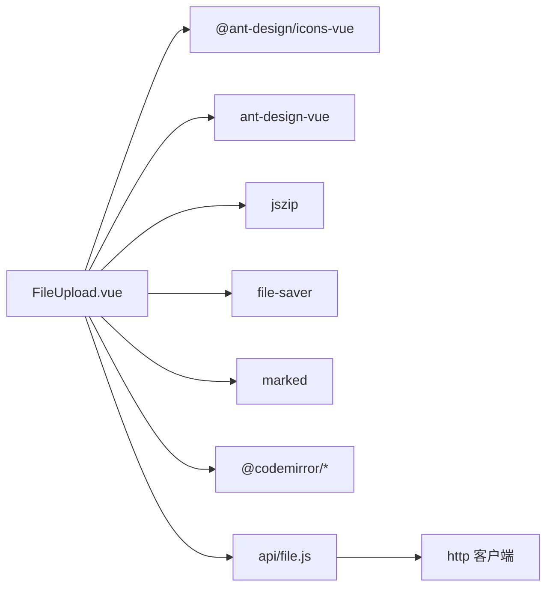

# 文件上传组件

<cite>
**本文引用的文件**
- [FileUpload.vue](file://vue/kevin.web.vue/src/components/FileUpload.vue)
- [file.js](file://vue/kevin.web.vue/src/api/file.js)
- [fileHandler.js](file://vue/kevin.web.vue/src/utils/fileHandler.js)
- [fileUtil.js](file://vue/kevin.web.vue/src/utils/fileUtil.js)
- [MyAIChat.vue](file://vue/kevin.web.vue/src/pages/ai/MyAIChat.vue)
- [KnowledgeBaseAddEdit.vue](file://vue/kevin.web.vue/src/components/ai/KnowledgeBaseAddEdit.vue)
</cite>

## 目录
1. [简介](#简介)
2. [项目结构](#项目结构)
3. [核心组件](#核心组件)
4. [架构总览](#架构总览)
5. [详细组件分析](#详细组件分析)
6. [依赖关系分析](#依赖关系分析)
7. [性能与优化](#性能与优化)
8. [故障排查指南](#故障排查指南)
9. [结论](#结论)
10. [附录：使用示例与最佳实践](#附录使用示例与最佳实践)

## 简介
本组件 FileUpload.vue 是一个功能完备的文件上传与预览、压缩包编辑的 Vue 3 组件。它基于 Ant Design Vue 的 Upload 能力，封装了多文件上传、文件类型限制、数量上限控制、已上传文件列表展示、在线预览（图片、PDF、Word、Markdown、文本）、以及 ZIP 压缩包的在线解压、文件树浏览、代码编辑器集成、修改保存与下载等能力。组件通过事件向父组件暴露上传成功/失败、删除成功/失败、压缩包更新等回调，便于上层业务灵活处理。

## 项目结构
围绕该组件的相关文件组织如下：
- 组件实现：FileUpload.vue
- 后端接口封装：file.js（上传、批量上传、远程上传、获取文件信息、删除等）
- 通用工具：fileHandler.js、fileUtil.js（下载、上传、预览等通用方法）
- 使用示例：MyAIChat.vue、KnowledgeBaseAddEdit.vue（在页面或子组件中引入并使用）

图表来源
- [FileUpload.vue:1-177](file://vue/kevin.web.vue/src/components/FileUpload.vue#L1-L177)
- [file.js:1-151](file://vue/kevin.web.vue/src/api/file.js#L1-L151)

章节来源
- [FileUpload.vue:1-177](file://vue/kevin.web.vue/src/components/FileUpload.vue#L1-L177)
- [file.js:1-151](file://vue/kevin.web.vue/src/api/file.js#L1-L151)

## 核心组件
- 多文件上传：支持 multiple 与 maxCount 控制；上传完成后自动拉取文件信息并加入已上传列表。
- 文件类型验证：通过 accept 属性限制选择器；内部根据扩展名判断是否可预览/编辑。
- 文件大小限制：当前未内置大小校验逻辑，可在 beforeUpload 或 customRequest 中扩展。
- 进度显示：组件未内置进度条，可通过外部包装或使用其他上传方案接入。
- 已上传文件列表：展示文件名、大小、操作按钮（预览、ZIP 编辑、删除）。
- 在线预览：图片、PDF、Word（Google Docs 嵌入）、Markdown（marked 渲染）、文本（多种编码尝试）。
- ZIP 编辑：解压 ZIP、构建文件树、CodeMirror 编辑器编辑文本文件、二进制文件只读提示、保存时重建 ZIP 并替换原文件、支持下载修改后的 ZIP。

章节来源
- [FileUpload.vue:207-256](file://vue/kevin.web.vue/src/components/FileUpload.vue#L207-L256)
- [FileUpload.vue:290-336](file://vue/kevin.web.vue/src/components/FileUpload.vue#L290-L336)
- [FileUpload.vue:414-495](file://vue/kevin.web.vue/src/components/FileUpload.vue#L414-L495)
- [FileUpload.vue:555-697](file://vue/kevin.web.vue/src/components/FileUpload.vue#L555-L697)
- [FileUpload.vue:762-821](file://vue/kevin.web.vue/src/components/FileUpload.vue#L762-L821)

## 架构总览
组件采用“视图 + 状态 + 事件”模式：
- 视图层：Ant Design Upload、Modal、Tree-like 列表、编辑器容器。
- 状态层：ref 管理上传状态、已上传文件、预览状态、ZIP 编辑状态。
- 事件层：向父组件抛出 upload-success、upload-error、delete-success、delete-error、zip-updated、file-ids-change。
- 数据流：customRequest 调用 API 上传 -> 获取文件信息 -> 更新本地列表 -> 触发事件。

图表来源
- [FileUpload.vue:290-336](file://vue/kevin.web.vue/src/components/FileUpload.vue#L290-L336)
- [file.js:8-23](file://vue/kevin.web.vue/src/api/file.js#L8-L23)
- [file.js:115-117](file://vue/kevin.web.vue/src/api/file.js#L115-L117)

## 详细组件分析

### Props 配置项说明
- business: 必填，业务领域标识，用于服务端分类存储。
- keyValue: 必填，关联的业务记录键值。
- sign: 必填，自定义标记，用于服务端鉴权或追踪。
- accept: 可选，字符串，限制文件选择器类型（如 image/*,.pdf）。
- multiple: 可选，布尔，是否允许选择多个文件。
- maxCount: 可选，数字，限制最大上传数量。
- disabled: 可选，布尔，禁用上传与操作。
- showUploadList: 可选，布尔，是否显示默认上传列表（组件内另有自定义列表）。
- uploadButtonText: 可选，字符串，上传按钮文案。
- initialFiles: 可选，数组或对象，初始化已上传文件列表（需包含 id/name/url/size）。
- enablePreview: 可选，布尔，是否启用预览功能。
- enableZipEdit: 可选，布尔，是否启用 ZIP 编辑功能。

章节来源
- [FileUpload.vue:207-256](file://vue/kevin.web.vue/src/components/FileUpload.vue#L207-L256)

### 事件机制
- upload-success: 上传成功后触发，参数包含 fileId、fileName、fileSize、url、path。
- upload-error: 上传失败后触发，参数包含 error、fileName。
- delete-success: 删除成功后触发，参数包含 fileId、fileName。
- delete-error: 删除失败后触发，参数包含 error、fileId、fileName。
- zip-updated: ZIP 编辑保存成功后触发，参数包含 oldFileId、newFileId、file（新文件信息）。
- file-ids-change: 当 uploadedFiles 变化时触发，参数为当前所有文件的 id 数组。

章节来源
- [FileUpload.vue:258-258](file://vue/kevin.web.vue/src/components/FileUpload.vue#L258-L258)
- [FileUpload.vue:312-332](file://vue/kevin.web.vue/src/components/FileUpload.vue#L312-L332)
- [FileUpload.vue:349-367](file://vue/kevin.web.vue/src/components/FileUpload.vue#L349-L367)
- [FileUpload.vue:814-814](file://vue/kevin.web.vue/src/components/FileUpload.vue#L814-L814)
- [FileUpload.vue:869-874](file://vue/kevin.web.vue/src/components/FileUpload.vue#L869-L874)

### 文件预览功能
- 图片：直接以 img 标签展示。
- PDF：使用 embed 标签加载。
- Word：通过 Google Docs 在线查看器 iframe 展示。
- Markdown：使用 marked 将内容渲染为 HTML 展示。
- 文本：读取文件内容，尝试 utf-8/gbk/gb2312/gb18030/big5 解码，失败回退到 utf-8。
- 不支持类型：显示空状态提示。

图表来源
- [FileUpload.vue:414-495](file://vue/kevin.web.vue/src/components/FileUpload.vue#L414-L495)

章节来源
- [FileUpload.vue:414-495](file://vue/kevin.web.vue/src/components/FileUpload.vue#L414-L495)

### ZIP 编辑功能
- 解压：使用 JSZip 加载 ZIP Blob，遍历文件并解析内容。
- 文件树：构建层级树结构，支持文件夹展开/折叠。
- 编辑器：对文本文件使用 CodeMirror 进行编辑，支持 JavaScript/Markdown 语法高亮与主题。
- 二进制文件：仅展示不可编辑提示。
- 保存：将修改后的内容重新打包为 ZIP，删除旧文件并上传新文件，更新本地列表。
- 下载：将当前内存中的 ZIP 内容生成 Blob 并下载。

图表来源
- [FileUpload.vue:555-697](file://vue/kevin.web.vue/src/components/FileUpload.vue#L555-L697)
- [FileUpload.vue:762-821](file://vue/kevin.web.vue/src/components/FileUpload.vue#L762-L821)
- [file.js:120-122](file://vue/kevin.web.vue/src/api/file.js#L120-L122)
- [file.js:8-23](file://vue/kevin.web.vue/src/api/file.js#L8-L23)

章节来源
- [FileUpload.vue:555-697](file://vue/kevin.web.vue/src/components/FileUpload.vue#L555-L697)
- [FileUpload.vue:762-821](file://vue/kevin.web.vue/src/components/FileUpload.vue#L762-L821)

### 状态管理与错误处理
- 状态管理：使用 ref 管理 uploading、uploadedFiles、preview 相关状态、ZIP 编辑相关状态。
- 错误处理：上传/删除/预览/ZIP 编辑均捕获异常，输出控制台日志并通过 message 提示用户；同时触发相应错误事件供父组件处理。
- 清理策略：关闭 ZIP 编辑弹窗时销毁编辑器实例，释放资源。

章节来源
- [FileUpload.vue:260-262](file://vue/kevin.web.vue/src/components/FileUpload.vue#L260-L262)
- [FileUpload.vue:325-335](file://vue/kevin.web.vue/src/components/FileUpload.vue#L325-L335)
- [FileUpload.vue:358-367](file://vue/kevin.web.vue/src/components/FileUpload.vue#L358-L367)
- [FileUpload.vue:849-867](file://vue/kevin.web.vue/src/components/FileUpload.vue#L849-L867)

### 对外暴露的方法
- getUploadedFileIds: 获取已上传文件 ID 列表。
- getUploadedFiles: 获取已上传文件详情副本。
- clearUploadedFiles: 清空已上传文件列表。

章节来源
- [FileUpload.vue:876-882](file://vue/kevin.web.vue/src/components/FileUpload.vue#L876-L882)

## 依赖关系分析
- 组件依赖：
  - Ant Design Vue Upload、Modal、Button、Tooltip、Badge、Empty、Spin、Icons。
  - JSZip：ZIP 解压与打包。
  - file-saver：浏览器端下载。
  - marked：Markdown 渲染。
  - CodeMirror：代码编辑器（JavaScript/Markdown 语言包与 OneDark 主题）。
- 接口依赖：
  - uploadFile、batchUploadFile、remoteUploadFile、getFileById、getImageById、getFilePathById、getFileInfoById、deleteFileById。

图表来源
- [FileUpload.vue:181-205](file://vue/kevin.web.vue/src/components/FileUpload.vue#L181-L205)
- [file.js:1-151](file://vue/kevin.web.vue/src/api/file.js#L1-L151)

章节来源
- [FileUpload.vue:181-205](file://vue/kevin.web.vue/src/components/FileUpload.vue#L181-L205)
- [file.js:1-151](file://vue/kevin.web.vue/src/api/file.js#L1-L151)

## 性能与优化
- 预览性能：
  - 图片与 PDF 直接使用原生渲染，避免额外开销。
  - Markdown 使用 marked 渲染，注意大文档可能引起卡顿，建议分页或虚拟滚动。
  - 文本预览采用多编码尝试解码，减少乱码问题。
- ZIP 编辑性能：
  - 使用 JSZip 异步加载与生成，避免阻塞主线程。
  - 编辑器按需创建与销毁，切换文件时及时释放实例。
  - 二进制文件不进入编辑器，仅展示提示，降低内存占用。
- 网络请求：
  - 上传成功后立即拉取文件信息，保证列表展示一致性。
  - 删除后再上传新 ZIP，确保覆盖更新。
- 可扩展点：
  - 可增加文件大小校验与类型白名单校验，提升安全性。
  - 可增加上传进度回调，改善用户体验。

[本节提供通用指导，无需具体文件引用]

## 故障排查指南
- 上传失败：
  - 检查 business/keyValue/sign 是否正确传递。
  - 查看控制台错误日志与 upload-error 事件参数。
  - 确认后端接口 /api/File/UploadFile 正常响应。
- 删除失败：
  - 检查 deleteFileById 接口是否返回成功。
  - 查看 delete-error 事件参数与 message 提示。
- 预览失败：
  - 图片/PDF/Word 依赖外链或浏览器支持，确认网络可达。
  - Markdown/文本预览失败时，检查文件 URL 是否可访问及编码是否正确。
- ZIP 编辑失败：
  - 检查 ZIP 是否为有效格式。
  - 保存时先删除旧文件再上传新文件，确保权限与路径正确。
  - 若编辑器报错，检查文件是否为文本类型。

章节来源
- [FileUpload.vue:325-335](file://vue/kevin.web.vue/src/components/FileUpload.vue#L325-L335)
- [FileUpload.vue:358-367](file://vue/kevin.web.vue/src/components/FileUpload.vue#L358-L367)
- [FileUpload.vue:482-488](file://vue/kevin.web.vue/src/components/FileUpload.vue#L482-L488)
- [FileUpload.vue:691-696](file://vue/kevin.web.vue/src/components/FileUpload.vue#L691-L696)
- [FileUpload.vue:815-818](file://vue/kevin.web.vue/src/components/FileUpload.vue#L815-L818)

## 结论
FileUpload.vue 提供了开箱即用的文件上传、预览与 ZIP 编辑能力，适用于多种业务场景。通过灵活的 props 与事件机制，上层组件可以便捷地集成与定制。建议在关键路径上增加文件大小与类型校验，并根据业务需求接入上传进度反馈，以提升用户体验与健壮性。

[本节为总结性内容，无需具体文件引用]

## 附录：使用示例与最佳实践

### 基本用法
- 在页面或子组件中引入组件，并传入必要的 business、keyValue、sign。
- 根据需要设置 multiple、maxCount、accept、enablePreview、enableZipEdit 等。
- 监听 upload-success、upload-error、delete-success、delete-error、zip-updated 事件进行处理。

章节来源
- [MyAIChat.vue:570-619](file://vue/kevin.web.vue/src/pages/ai/MyAIChat.vue#L570-L619)
- [KnowledgeBaseAddEdit.vue:243-261](file://vue/kevin.web.vue/src/components/ai/KnowledgeBaseAddEdit.vue#L243-L261)

### 最佳实践
- 安全校验：在前端增加文件大小与类型校验，结合后端验证，防止恶意文件上传。
- 用户体验：为长耗时操作添加 loading 与进度提示；对失败操作给出明确错误信息。
- 资源管理：在关闭 ZIP 编辑弹窗时确保销毁编辑器实例，避免内存泄漏。
- 兼容性：预览 Word 依赖 Google Docs 在线查看器，需考虑网络与隐私策略。
- 可维护性：通过事件与 expose 方法解耦组件与父组件，便于测试与复用。

[本节提供通用指导，无需具体文件引用]