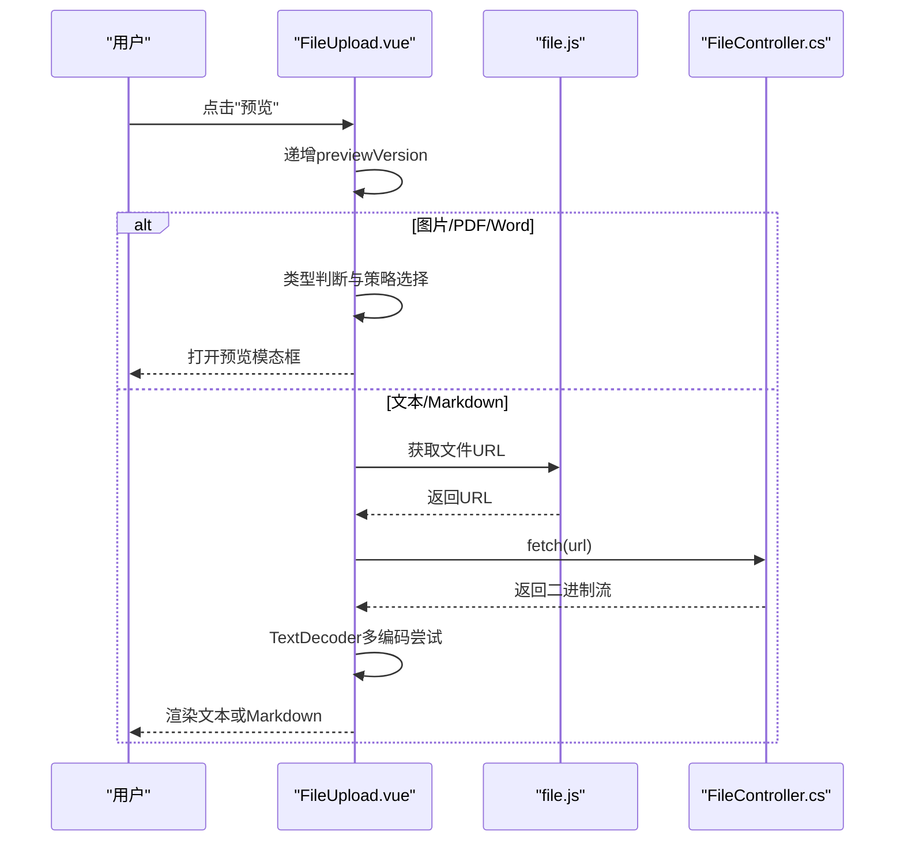
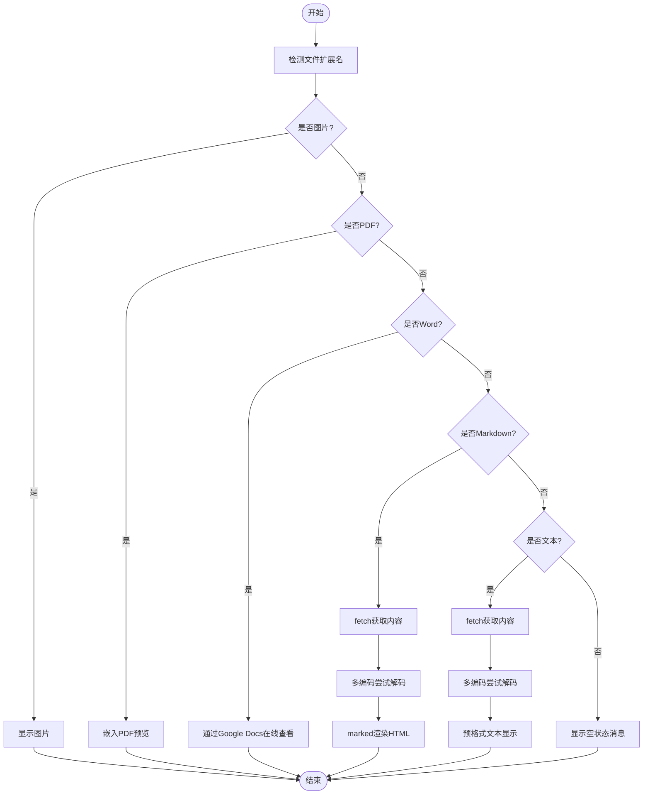
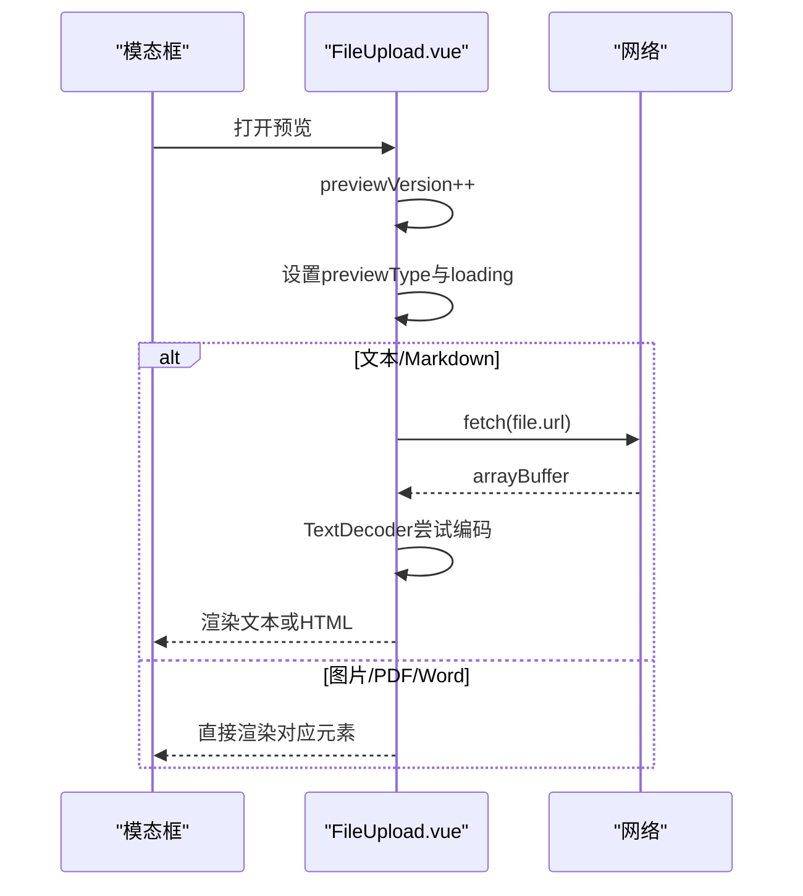
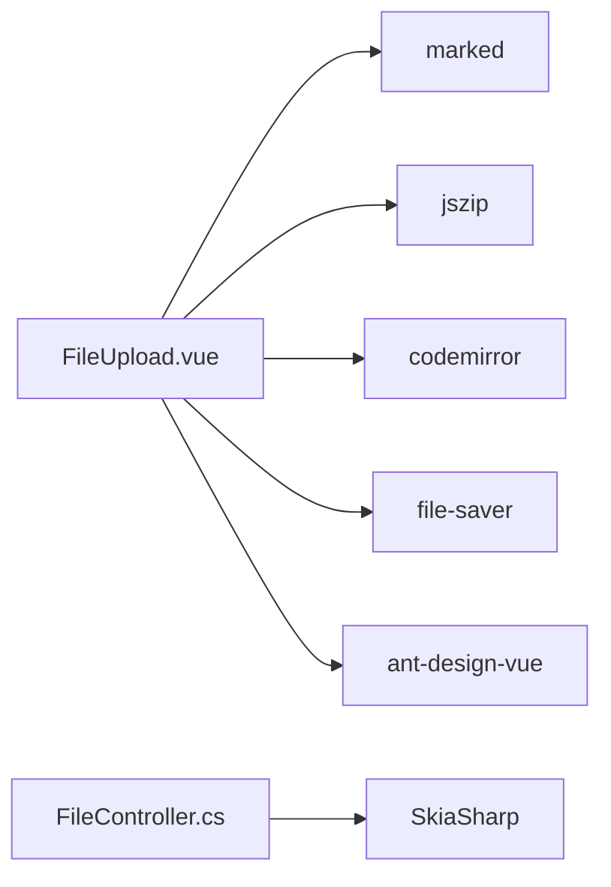

# 文件预览功能

<cite>
**本文引用的文件**
- [FileUpload.vue](file://vue/kevin.web.vue/src/components/FileUpload.vue)
- [file.js](file://vue/kevin.web.vue/src/api/file.js)
- [fileHandler.js](file://vue/kevin.web.vue/src/utils/fileHandler.js)
- [fileUtil.js](file://vue/kevin.web.vue/src/utils/fileUtil.js)
- [FileController.cs](file://Kevin/Kevin.Web.Basics/Controllers/FileController.cs)
- [TextStreamReader.cs](file://Kevin/kevin.Module/Kevin.Common/Helper/FileHandleTools/TextStreamReader.cs)
- [package.json](file://vue/kevin.web.vue/package.json)
</cite>

## 更新摘要
**所做更改**
- 更新了预览模态框的版本计数器机制，解决了内存泄漏和状态污染问题
- 增强了条件渲染逻辑，支持不支持文件类型的空状态消息显示
- 改进了Zip编辑器的版本控制，确保每次编辑从干净状态开始
- 优化了快速切换不同文件或预览类型时的性能表现

## 目录
1. [简介](#简介)
2. [项目结构](#项目结构)
3. [核心组件](#核心组件)
4. [架构总览](#架构总览)
5. [详细组件分析](#详细组件分析)
6. [依赖关系分析](#依赖关系分析)
7. [性能考虑](#性能考虑)
8. [故障排查指南](#故障排查指南)
9. [结论](#结论)
10. [附录：配置与使用示例](#附录配置与使用示例)

## 简介
本文件预览功能面向前端用户，提供对多种文件类型的在线预览能力，包括图片（jpg、jpeg、png、gif、bmp、webp、svg）、PDF、Word（doc、docx）、Markdown（md、markdown）以及文本文件。预览通过模态框实现，支持懒加载、编码自动检测、错误处理与内存管理。后端提供统一的文件获取接口，并支持图片缩放输出。

**最新更新**：实现了版本计数器机制，通过强制Vue完全销毁和重建预览内容区域，有效解决了快速切换不同文件或预览类型时的内存泄漏和状态污染问题。

## 项目结构
- 前端组件与工具
  - 文件上传与预览主组件：FileUpload.vue
  - 文件API封装：file.js
  - 通用文件工具：fileHandler.js、fileUtil.js
  - 依赖库：marked（Markdown渲染）、jszip（压缩包解析）、codemirror（编辑器）、file-saver（下载）
- 后端控制器与服务
  - 文件控制器：FileController.cs（上传、下载、图片缩放、路径获取等）
  - 文本读取工具：TextStreamReader.cs（自动BOM检测编码）

**图表来源**
- [FileUpload.vue:1-177](file://vue/kevin.web.vue/src/components/FileUpload.vue#L1-L177)
- [file.js:1-151](file://vue/kevin.web.vue/src/api/file.js#L1-L151)
- [FileController.cs:1-214](file://Kevin/Kevin.Web.Basics/Controllers/FileController.cs#L1-L214)

**章节来源**
- [FileUpload.vue:1-177](file://vue/kevin.web.vue/src/components/FileUpload.vue#L1-L177)
- [file.js:1-151](file://vue/kevin.web.vue/src/api/file.js#L1-L151)
- [FileController.cs:1-214](file://Kevin/Kevin.Web.Basics/Controllers/FileController.cs#L1-L214)

## 核心组件
- FileUpload.vue：负责文件列表展示、类型判断、预览模态框控制、不同文件类型的预览策略、压缩包编辑与保存。
- file.js：封装上传、批量上传、远程上传、获取文件流、获取图片、获取文件信息、删除等API调用。
- fileHandler.js / fileUtil.js：提供通用的下载、预览、Base64/Blob转换、文件大小格式化等工具方法。
- FileController.cs：提供文件上传、下载、图片缩放、路径获取、删除等HTTP接口。
- TextStreamReader.cs：从流中自动检测编码并读取文本内容（主要用于后端场景）。

**章节来源**
- [FileUpload.vue:180-495](file://vue/kevin.web.vue/src/components/FileUpload.vue#L180-L495)
- [file.js:1-151](file://vue/kevin.web.vue/src/api/file.js#L1-L151)
- [fileHandler.js:1-252](file://vue/kevin.web.vue/src/utils/fileHandler.js#L1-L252)
- [fileUtil.js:1-134](file://vue/kevin.web.vue/src/utils/fileUtil.js#L1-L134)
- [FileController.cs:1-214](file://Kevin/Kevin.Web.Basics/Controllers/FileController.cs#L1-L214)
- [TextStreamReader.cs:1-111](file://Kevin/kevin.Module/Kevin.Common/Helper/FileHandleTools/TextStreamReader.cs#L1-L111)

## 架构总览
前端通过FileUpload.vue触发预览，根据文件扩展名进行类型判断；不同类型采用不同预览策略：
- 图片：直接以标签显示
- PDF：使用<embed>标签内嵌预览
- Word：通过Google Docs在线查看（iframe）
- Markdown：使用marked库将Markdown转为HTML后渲染
- 文本：使用fetch获取二进制数据，并通过浏览器TextDecoder尝试多种编码（UTF-8、GBK、GB2312、GB18030、Big5），选择无替换字符的解码结果

后端通过FileController.cs提供统一的文件访问接口，支持按ID获取文件流、图片缩放返回PNG等。

**最新更新**：引入了版本计数器机制，在每次预览或编辑时递增版本号，强制Vue销毁并重建整个预览内容区域，确保从干净状态开始，避免状态污染。

**图表来源**
- [FileUpload.vue:425-495](file://vue/kevin.web.vue/src/components/FileUpload.vue#L425-L495)
- [file.js:114-117](file://vue/kevin.web.vue/src/api/file.js#L114-L117)
- [FileController.cs:101-107](file://Kevin/Kevin.Web.Basics/Controllers/FileController.cs#L101-L107)

## 详细组件分析

### 文件类型检测与预览策略
- 类型检测：基于文件扩展名判断是否为图片、PDF、Word、Markdown或文本。
- 预览策略：
  - 图片：直接显示，支持最大宽高限制与自适应缩放。
  - PDF：使用<embed>标签内嵌预览。
  - Word：通过Google Docs在线查看（iframe），需要外部网络可达。
  - Markdown：使用marked库渲染为HTML，并在模态框中显示。
  - 文本：使用fetch获取二进制数据，通过TextDecoder依次尝试UTF-8、GBK、GB2312、GB18030、Big5，选择无替换字符的结果；若失败则回退到UTF-8。

**更新**：增强了条件渲染逻辑，对于不支持预览的文件类型，现在会显示空状态消息"暂不支持预览此文件"，提供更好的用户体验。

**图表来源**
- [FileUpload.vue:379-416](file://vue/kevin.web.vue/src/components/FileUpload.vue#L379-L416)
- [FileUpload.vue:425-495](file://vue/kevin.web.vue/src/components/FileUpload.vue#L425-L495)

**章节来源**
- [FileUpload.vue:379-416](file://vue/kevin.web.vue/src/components/FileUpload.vue#L379-L416)
- [FileUpload.vue:425-495](file://vue/kevin.web.vue/src/components/FileUpload.vue#L425-L495)

### 预览模态框实现机制
- 状态管理：使用Vue响应式变量控制模态框可见性、当前预览文件、预览类型、加载状态、文本内容与Markdown HTML。
- **版本计数器机制**：通过`previewVersion`和`zipEditVersion`两个计数器，在每次预览或编辑时递增，强制Vue销毁并重建整个预览内容区域。
- 懒加载：仅在打开模态框时加载文本/Markdown内容，避免不必要的网络请求。
- 编码处理：使用浏览器原生TextDecoder尝试多种编码，确保中文等多字节字符正确显示。
- 错误处理：捕获网络与解码异常，清空预览内容并提示用户。

**更新**：版本计数器机制通过在模板中使用`:key="previewVersion"`和`:key="zipEditVersion"`来实现，确保每次操作都从干净状态开始，有效解决了快速切换时的内存泄漏和状态污染问题。

**图表来源**
- [FileUpload.vue:418-495](file://vue/kevin.web.vue/src/components/FileUpload.vue#L418-L495)

**章节来源**
- [FileUpload.vue:418-495](file://vue/kevin.web.vue/src/components/FileUpload.vue#L418-L495)

### 文本编码处理细节
- 前端：在预览文本时，依次尝试UTF-8、GBK、GB2312、GB18030、Big5，选择无替换字符的解码结果；若全部失败，回退到UTF-8。
- 后端：TextStreamReader通过BOM检测优先确定编码（UTF-8 BOM、UTF-16 LE/BE、UTF-32 LE），默认UTF-8，用于服务端读取文本流。

**章节来源**
- [FileUpload.vue:457-488](file://vue/kevin.web.vue/src/components/FileUpload.vue#L457-L488)
- [TextStreamReader.cs:12-36](file://Kevin/kevin.Module/Kevin.Common/Helper/FileHandleTools/TextStreamReader.cs#L12-L36)

### 图片、PDF、Word预览策略
- 图片：直接使用标签，支持最大宽高与object-fit适配。
- PDF：使用<embed>标签内嵌预览，需浏览器支持PDF插件或内置阅读器。
- Word：通过Google Docs在线查看，使用iframe加载https://docs.google.com/gview?url=...&embedded=true，需外网可达。

**章节来源**
- [FileUpload.vue:82-98](file://vue/kevin.web.vue/src/components/FileUpload.vue#L82-L98)
- [FileUpload.vue:439-449](file://vue/kevin.web.vue/src/components/FileUpload.vue#L439-L449)

### Markdown渲染
- 使用marked库将Markdown字符串转换为HTML，再注入到模态框中显示。
- 样式：为Markdown内容添加基础CSS，提升可读性与代码块高亮效果。

**章节来源**
- [FileUpload.vue:200-205](file://vue/kevin.web.vue/src/components/FileUpload.vue#L200-L205)
- [FileUpload.vue:479-481](file://vue/kevin.web.vue/src/components/FileUpload.vue#L479-L481)

### 版本计数器机制详解
**新增功能**：实现了两个关键版本计数器来解决内存管理和状态污染问题：

1. **previewVersion**：用于预览模态框
   - 在`handlePreview`函数开始时递增
   - 通过`:key="previewVersion"`绑定到预览容器
   - 强制Vue销毁并重建整个预览内容区域

2. **zipEditVersion**：用于Zip编辑器模态框
   - 在`handleZipEdit`函数开始时递增
   - 通过`:key="zipEditVersion"`绑定到编辑器容器
   - 确保每次编辑从干净状态开始

**技术优势**：
- 彻底清理之前的组件实例和事件监听器
- 避免内存泄漏和状态污染
- 解决快速切换文件时的性能问题
- 确保每次操作都有最新的文件状态

**章节来源**
- [FileUpload.vue:420-430](file://vue/kevin.web.vue/src/components/FileUpload.vue#L420-L430)
- [FileUpload.vue:505-575](file://vue/kevin.web.vue/src/components/FileUpload.vue#L505-L575)

### 后端文件服务
- 文件获取：GetFile接口返回文件流、MIME类型与文件名。
- 图片缩放：GetImage接口支持指定宽高，内部使用SkiaSharp进行缩放并返回PNG。
- 文件信息：GetById接口返回文件元数据（包含URL）。

**章节来源**
- [FileController.cs:101-107](file://Kevin/Kevin.Web.Basics/Controllers/FileController.cs#L101-L107)
- [FileController.cs:134-186](file://Kevin/Kevin.Web.Basics/Controllers/FileController.cs#L134-L186)
- [FileController.cs:116-121](file://Kevin/Kevin.Web.Basics/Controllers/FileController.cs#L116-L121)

## 依赖关系分析
- 前端依赖
  - marked：Markdown渲染
  - jszip：压缩包解析与编辑
  - codemirror：文本编辑器（用于Zip内文本编辑）
  - file-saver：文件下载
  - ant-design-vue：UI组件（Modal、Button、Icon等）
- 后端依赖
  - SkiaSharp：图片缩放与编码
  - Microsoft.AspNetCore.StaticFiles：静态文件类型映射

**图表来源**
- [package.json:16-35](file://vue/kevin.web.vue/package.json#L16-L35)
- [FileController.cs:9](file://Kevin/Kevin.Web.Basics/Controllers/FileController.cs#L9)

**章节来源**
- [package.json:16-35](file://vue/kevin.web.vue/package.json#L16-L35)
- [FileController.cs:9](file://Kevin/Kevin.Web.Basics/Controllers/FileController.cs#L9)

## 性能考虑
- **懒加载**：仅在打开预览时加载文本/Markdown内容，减少初始负载。
- **内存管理**：
  - **版本计数器机制**：通过递增版本号强制Vue销毁和重建组件，彻底清理内存引用
  - 预览关闭时清理Blob URL与编辑器实例，避免内存泄漏
  - 大文件预览建议结合分页或分片加载（可扩展）
- **错误处理**：网络请求与解码异常均被捕获并提示用户，保证用户体验。
- **图片优化**：后端支持按需缩放图片，减少传输体积。
- **状态隔离**：每个预览实例都有独立的DOM结构和事件监听器，避免状态交叉污染。

**更新**：版本计数器机制显著提升了快速切换文件时的性能表现，通过主动清理旧实例而非依赖垃圾回收，有效防止了内存泄漏。

## 故障排查指南
- 预览空白或乱码
  - 检查文件URL是否可访问，确认跨域与权限设置。
  - 确认文本编码是否正确，必要时调整编码尝试顺序。
- Word无法预览
  - 确认外网可达Google Docs，或替换为其他在线查看方案。
- PDF无法显示
  - 确认浏览器支持PDF内嵌预览，或提供下载链接作为备选。
- 图片加载失败
  - 检查图片ID与路径，确认后端GetImage接口正常。
- **新版本相关问题**：
  - 如果预览状态异常，检查版本计数器是否正确递增
  - 确认`:key`属性绑定到正确的版本变量
  - 验证组件销毁逻辑是否正常执行

**章节来源**
- [FileUpload.vue:457-488](file://vue/kevin.web.vue/src/components/FileUpload.vue#L457-L488)
- [FileController.cs:134-186](file://Kevin/Kevin.Web.Basics/Controllers/FileController.cs#L134-L186)

## 结论
该文件预览功能通过前端类型判断与后端文件服务协同，实现了图片、PDF、Word、Markdown与文本的在线预览。**最新版本**通过引入版本计数器机制，有效解决了快速切换不同文件或预览类型时的内存泄漏和状态污染问题，同时增强了空状态消息显示，提供了更好的用户体验。采用懒加载、多编码尝试与错误处理，兼顾了可用性与性能。可根据业务需求扩展更多文件类型与预览策略。

## 附录：配置与使用示例
- 启用预览：在FileUpload组件中设置enablePreview为true（默认开启）。
- 支持的预览类型：图片（jpg、jpeg、png、gif、bmp、webp、svg）、PDF、Word（doc、docx）、Markdown（md、markdown）、文本（txt、json、xml、html、css、js、ts、py、java、c、cpp、h、cs、go、rb、php、sh、yaml、yml、ini、conf、log）。
- 文本编码支持：UTF-8、GBK、GB2312、GB18030、Big5。
- 使用示例
  - 上传并预览：调用uploadFile接口上传文件，获取文件信息后点击"预览"。
  - 获取文件流：通过getFileById接口下载文件。
  - 获取图片：通过getImageById接口获取指定尺寸的图片。

**章节来源**
- [FileUpload.vue:248-255](file://vue/kevin.web.vue/src/components/FileUpload.vue#L248-L255)
- [FileUpload.vue:379-416](file://vue/kevin.web.vue/src/components/FileUpload.vue#L379-L416)
- [file.js:8-23](file://vue/kevin.web.vue/src/api/file.js#L8-L23)
- [file.js:58-95](file://vue/kevin.web.vue/src/api/file.js#L58-L95)
- [file.js:97-117](file://vue/kevin.web.vue/src/api/file.js#L97-L117)