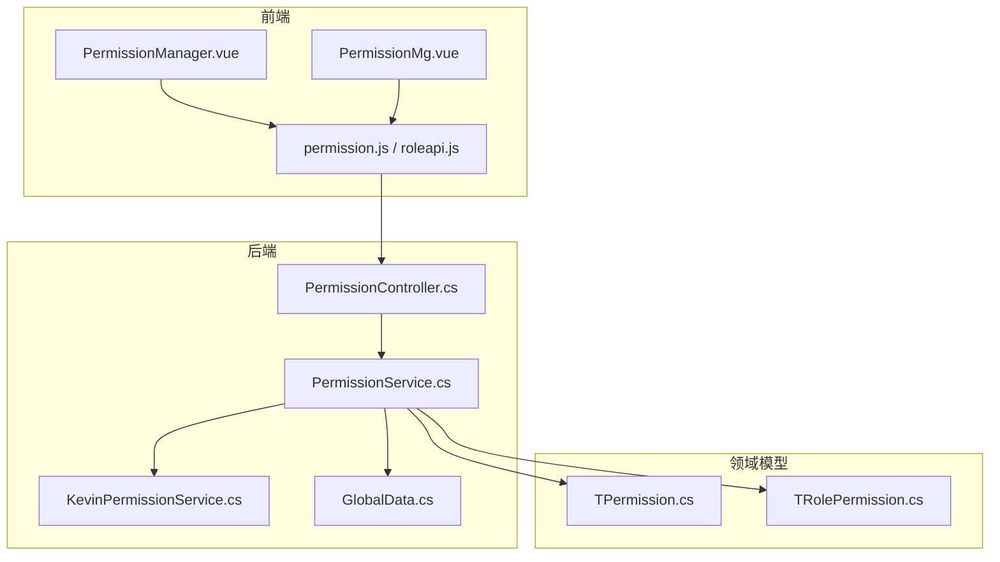
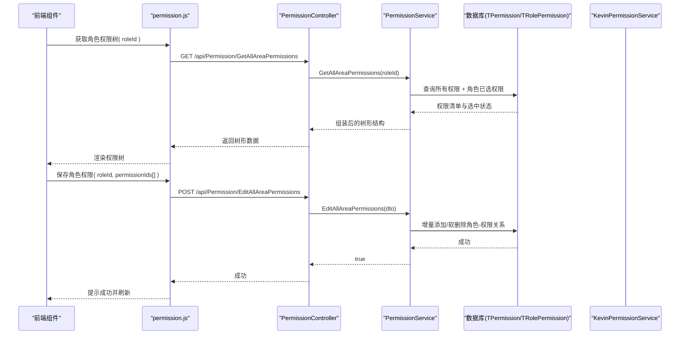
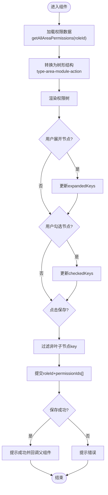
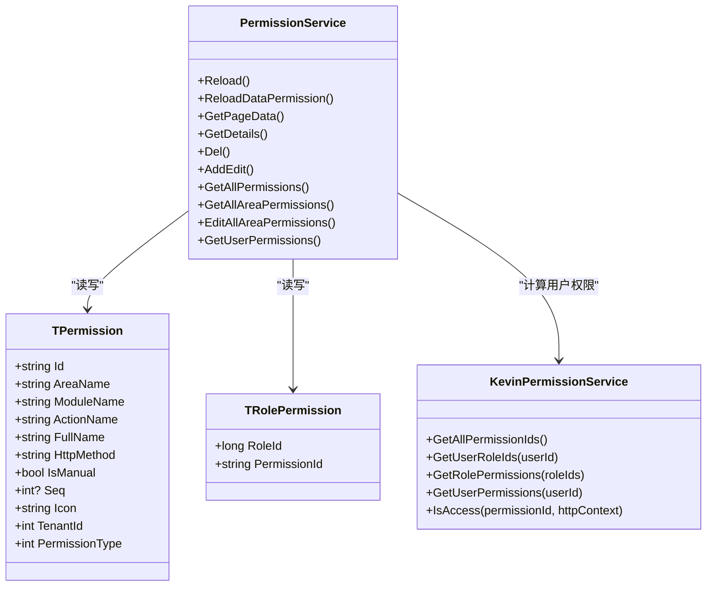
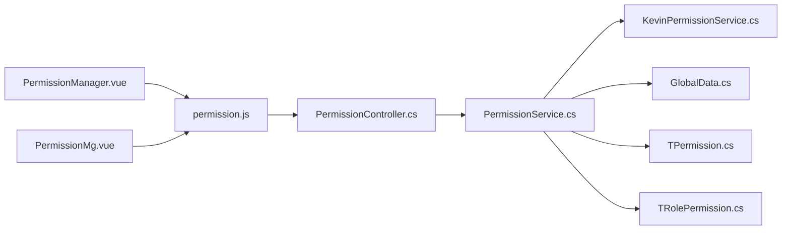

# 权限管理组件

<cite>
**本文引用的文件**
- [PermissionManager.vue](file://vue/kevin.web.vue/src/components/PermissionManager.vue)
- [PermissionMg.vue](file://vue/kevin.web.vue/src/pages/PermissionMg.vue)
- [permission.js](file://vue/kevin.web.vue/src/api/permission.js)
- [roleapi.js](file://vue/kevin.web.vue/src/api/roleapi.js)
- [PermissionController.cs](file://Kevin/Kevin.Web.Basics/Controllers/PermissionController.cs)
- [PermissionService.cs](file://Kevin/Application/Services/PermissionService.cs)
- [TPermission.cs](file://Kevin/Domain/Entities/TPermission.cs)
- [TRolePermission.cs](file://Kevin/Domain/Entities/TRolePermission.cs)
- [GlobalData.cs](file://Kevin/kevin.Module/kevin.Permission/Permission/GlobalData.cs)
- [KevinPermissionService.cs](file://Kevin/Application/Services/KevinPermissionService.cs)
</cite>

## 目录
1. [简介](#简介)
2. [项目结构](#项目结构)
3. [核心组件](#核心组件)
4. [架构总览](#架构总览)
5. [详细组件分析](#详细组件分析)
6. [依赖关系分析](#依赖关系分析)
7. [性能与缓存](#性能与缓存)
8. [故障排查指南](#故障排查指南)
9. [结论](#结论)
10. [附录：最佳实践与工作流](#附录最佳实践与工作流)

## 简介
本文件围绕前端权限管理组件 PermissionManager.vue，结合后端权限服务与数据模型，系统阐述权限管理的核心功能与实现机制。内容涵盖：
- 权限树形展示、节点展开收起、勾选与级联选择
- 角色权限分配（批量授权）
- 权限模型设计（菜单、功能、数据、接口四类权限）
- 权限数据的获取、初始化与同步策略
- 角色创建与权限继承思路
- 权限验证在前端路由守卫、组件级控制、API 请求拦截中的落地方式
- 权限配置的导入导出能力与模板管理建议
- 完整工作流程与配置最佳实践

## 项目结构
前端以 Vue 单文件组件组织权限管理界面，后端采用 ASP.NET Core 控制器与服务层提供权限查询与更新能力，领域实体承载权限与角色-权限关联关系。

图表来源
- [PermissionManager.vue:1-244](file://vue/kevin.web.vue/src/components/PermissionManager.vue#L1-L244)
- [PermissionMg.vue:1-549](file://vue/kevin.web.vue/src/pages/PermissionMg.vue#L1-L549)
- [permission.js:1-32](file://vue/kevin.web.vue/src/api/permission.js#L1-L32)
- [roleapi.js:1-23](file://vue/kevin.web.vue/src/api/roleapi.js#L1-L23)
- [PermissionController.cs:1-165](file://Kevin/Kevin.Web.Basics/Controllers/PermissionController.cs#L1-L165)
- [PermissionService.cs:1-434](file://Kevin/Application/Services/PermissionService.cs#L1-L434)
- [TPermission.cs:1-154](file://Kevin/Domain/Entities/TPermission.cs#L1-L154)
- [TRolePermission.cs:1-29](file://Kevin/Domain/Entities/TRolePermission.cs#L1-L29)
- [GlobalData.cs:1-91](file://Kevin/kevin.Module/kevin.Permission/Permission/GlobalData.cs#L1-L91)
- [KevinPermissionService.cs:1-87](file://Kevin/Application/Services/KevinPermissionService.cs#L1-L87)

章节来源
- [PermissionManager.vue:1-244](file://vue/kevin.web.vue/src/components/PermissionManager.vue#L1-L244)
- [PermissionMg.vue:1-549](file://vue/kevin.web.vue/src/pages/PermissionMg.vue#L1-L549)
- [permission.js:1-32](file://vue/kevin.web.vue/src/api/permission.js#L1-L32)
- [roleapi.js:1-23](file://vue/kevin.web.vue/src/api/roleapi.js#L1-L23)
- [PermissionController.cs:1-165](file://Kevin/Kevin.Web.Basics/Controllers/PermissionController.cs#L1-L165)
- [PermissionService.cs:1-434](file://Kevin/Application/Services/PermissionService.cs#L1-L434)
- [TPermission.cs:1-154](file://Kevin/Domain/Entities/TPermission.cs#L1-L154)
- [TRolePermission.cs:1-29](file://Kevin/Domain/Entities/TRolePermission.cs#L1-L29)
- [GlobalData.cs:1-91](file://Kevin/kevin.Module/kevin.Permission/Permission/GlobalData.cs#L1-L91)
- [KevinPermissionService.cs:1-87](file://Kevin/Application/Services/KevinPermissionService.cs#L1-L87)

## 核心组件
- PermissionManager.vue：基于 Ant Design Vue Tree 的权限树组件，负责按“权限类型-区域-模块-操作”层级渲染，支持勾选保存角色权限。
- PermissionMg.vue：权限元数据管理页面，支持分页列表、搜索、新增/编辑/删除、初始化权限等。
- permission.js / roleapi.js：封装前后端交互的 HTTP 调用。
- 后端控制器与服务：提供权限初始化、分页查询、详情获取、编辑、删除、角色权限批量分配、用户权限计算等能力。
- 领域实体：TPermission 描述权限项；TRolePermission 描述角色与权限的绑定关系。

章节来源
- [PermissionManager.vue:1-244](file://vue/kevin.web.vue/src/components/PermissionManager.vue#L1-L244)
- [PermissionMg.vue:1-549](file://vue/kevin.web.vue/src/pages/PermissionMg.vue#L1-L549)
- [permission.js:1-32](file://vue/kevin.web.vue/src/api/permission.js#L1-L32)
- [roleapi.js:1-23](file://vue/kevin.web.vue/src/api/roleapi.js#L1-L23)
- [PermissionController.cs:1-165](file://Kevin/Kevin.Web.Basics/Controllers/PermissionController.cs#L1-L165)
- [PermissionService.cs:1-434](file://Kevin/Application/Services/PermissionService.cs#L1-L434)
- [TPermission.cs:1-154](file://Kevin/Domain/Entities/TPermission.cs#L1-L154)
- [TRolePermission.cs:1-29](file://Kevin/Domain/Entities/TRolePermission.cs#L1-L29)

## 架构总览
权限体系由“四层权限模型 + 角色-权限映射 + 用户-角色-权限计算”构成：
- 权限类型：菜单、功能、数据、接口
- 权限项：包含区域、模块、动作、HTTP 方法、图标、序号等
- 角色-权限：TRolePermission 记录角色拥有的权限集合
- 用户-角色-权限：通过 KevinPermissionService 计算当前用户的可用权限集合

图表来源
- [PermissionManager.vue:147-183](file://vue/kevin.web.vue/src/components/PermissionManager.vue#L147-L183)
- [permission.js:24-32](file://vue/kevin.web.vue/src/api/permission.js#L24-L32)
- [PermissionController.cs:130-151](file://Kevin/Kevin.Web.Basics/Controllers/PermissionController.cs#L130-L151)
- [PermissionService.cs:306-414](file://Kevin/Application/Services/PermissionService.cs#L306-L414)

## 详细组件分析

### 权限树形结构与交互逻辑（PermissionManager.vue）
- 数据结构转换：将后端返回的“权限类型-区域-模块-操作”扁平结构转换为树形结构，同时收集已勾选的操作 ID。
- 节点展开：监听展开事件，维护 expandedKeys，默认展开根节点。
- 节点勾选：使用 Tree 的 checkedKeys 双向绑定，仅叶子节点（具体操作）参与最终提交。
- 保存流程：过滤非叶子节点 key，提交 roleId 与 permissionIds 数组，成功后触发父组件事件。

图表来源
- [PermissionManager.vue:76-139](file://vue/kevin.web.vue/src/components/PermissionManager.vue#L76-L139)
- [PermissionManager.vue:141-183](file://vue/kevin.web.vue/src/components/PermissionManager.vue#L141-L183)
- [PermissionManager.vue:185-223](file://vue/kevin.web.vue/src/components/PermissionManager.vue#L185-L223)

章节来源
- [PermissionManager.vue:1-244](file://vue/kevin.web.vue/src/components/PermissionManager.vue#L1-L244)

### 权限元数据管理（PermissionMg.vue）
- 列表与搜索：分页加载权限元数据，支持关键字模糊搜索。
- 新增/编辑：表单校验后调用统一编辑接口，区分新增与编辑场景。
- 删除：二次确认后执行删除。
- 初始化权限：调用后端 Reload 接口，根据全局模块定义重建系统权限。

章节来源
- [PermissionMg.vue:1-549](file://vue/kevin.web.vue/src/pages/PermissionMg.vue#L1-L549)
- [permission.js:1-32](file://vue/kevin.web.vue/src/api/permission.js#L1-L32)

### 后端权限服务与数据模型
- 权限初始化：从 GlobalData 扫描控制器与模块，生成接口权限与数据权限，写入 TPermission，并清理不再存在的旧权限。
- 角色权限分配：对比新旧权限集合，增量插入或软删除 TRolePermission。
- 用户权限计算：根据用户所属角色聚合其权限，并以字典形式返回是否拥有某权限。

图表来源
- [TPermission.cs:1-154](file://Kevin/Domain/Entities/TPermission.cs#L1-L154)
- [TRolePermission.cs:1-29](file://Kevin/Domain/Entities/TRolePermission.cs#L1-L29)
- [PermissionService.cs:25-434](file://Kevin/Application/Services/PermissionService.cs#L25-L434)
- [KevinPermissionService.cs:1-87](file://Kevin/Application/Services/KevinPermissionService.cs#L1-L87)

章节来源
- [PermissionService.cs:1-434](file://Kevin/Application/Services/PermissionService.cs#L1-L434)
- [KevinPermissionService.cs:1-87](file://Kevin/Application/Services/KevinPermissionService.cs#L1-L87)
- [TPermission.cs:1-154](file://Kevin/Domain/Entities/TPermission.cs#L1-L154)
- [TRolePermission.cs:1-29](file://Kevin/Domain/Entities/TRolePermission.cs#L1-L29)

## 依赖关系分析
- 前端依赖：
  - PermissionManager.vue 依赖 permission.js 提供的 getAllAreaPermissions 与 editAllAreaPermissions。
  - PermissionMg.vue 依赖 permission.js 提供的分页、详情、编辑、删除、初始化接口。
- 后端依赖：
  - PermissionController 依赖 PermissionService。
  - PermissionService 依赖 IPermissionRp、IRolePermissionRp、IKevinPermissionService、GlobalData。
  - KevinPermissionService 直接访问数据库计算用户权限。

图表来源
- [PermissionManager.vue:42-47](file://vue/kevin.web.vue/src/components/PermissionManager.vue#L42-L47)
- [PermissionMg.vue:163-179](file://vue/kevin.web.vue/src/pages/PermissionMg.vue#L163-L179)
- [permission.js:1-32](file://vue/kevin.web.vue/src/api/permission.js#L1-L32)
- [PermissionController.cs:1-165](file://Kevin/Kevin.Web.Basics/Controllers/PermissionController.cs#L1-L165)
- [PermissionService.cs:1-434](file://Kevin/Application/Services/PermissionService.cs#L1-L434)
- [KevinPermissionService.cs:1-87](file://Kevin/Application/Services/KevinPermissionService.cs#L1-L87)
- [GlobalData.cs:1-91](file://Kevin/kevin.Module/kevin.Permission/Permission/GlobalData.cs#L1-L91)
- [TPermission.cs:1-154](file://Kevin/Domain/Entities/TPermission.cs#L1-L154)
- [TRolePermission.cs:1-29](file://Kevin/Domain/Entities/TRolePermission.cs#L1-L29)

章节来源
- [PermissionManager.vue:1-244](file://vue/kevin.web.vue/src/components/PermissionManager.vue#L1-L244)
- [PermissionMg.vue:1-549](file://vue/kevin.web.vue/src/pages/PermissionMg.vue#L1-L549)
- [permission.js:1-32](file://vue/kevin.web.vue/src/api/permission.js#L1-L32)
- [PermissionController.cs:1-165](file://Kevin/Kevin.Web.Basics/Controllers/PermissionController.cs#L1-L165)
- [PermissionService.cs:1-434](file://Kevin/Application/Services/PermissionService.cs#L1-L434)
- [KevinPermissionService.cs:1-87](file://Kevin/Application/Services/KevinPermissionService.cs#L1-L87)
- [GlobalData.cs:1-91](file://Kevin/kevin.Module/kevin.Permission/Permission/GlobalData.cs#L1-L91)
- [TPermission.cs:1-154](file://Kevin/Domain/Entities/TPermission.cs#L1-L154)
- [TRolePermission.cs:1-29](file://Kevin/Domain/Entities/TRolePermission.cs#L1-L29)

## 性能与缓存
- 前端渲染优化：
  - 权限树仅在 roleId 变化时重新加载，避免重复请求。
  - 使用 v-model:checkedKeys 与受控展开，减少不必要的重渲染。
- 后端缓存与初始化：
  - GlobalData 缓存程序集、控制器、模块、菜单等信息，降低反射开销。
  - Reload 会比对现有权限与扫描结果，增量更新，避免全量重建带来的性能问题。
- 用户权限计算：
  - KevinPermissionService 根据用户角色聚合权限，返回键值对字典，便于快速判断。
  - 建议在网关或前端做短期缓存（如会话内），减少频繁计算。

[本节为通用性能讨论，不直接分析具体代码行]

## 故障排查指南
- 权限树为空或未显示：
  - 检查 roleId 是否正确传入，确认后端返回的数据结构是否符合预期。
  - 确认后端 Reload 是否执行过，确保权限元数据存在。
- 保存权限失败：
  - 检查提交的 permissionIds 是否为空或包含非叶子节点 key。
  - 查看后端 EditAllAreaPermissions 返回值与日志。
- 权限未生效：
  - 确认用户是否已绑定到对应角色。
  - 检查 KevinPermissionService.GetUserPermissions 是否返回期望的权限集合。
- 无法删除系统权限：
  - 系统自动生成的权限（IsManual=false）禁止删除，需通过 Reload 重新生成。

章节来源
- [PermissionManager.vue:157-183](file://vue/kevin.web.vue/src/components/PermissionManager.vue#L157-L183)
- [PermissionService.cs:208-219](file://Kevin/Application/Services/PermissionService.cs#L208-L219)
- [PermissionService.cs:373-414](file://Kevin/Application/Services/PermissionService.cs#L373-L414)
- [KevinPermissionService.cs:50-84](file://Kevin/Application/Services/KevinPermissionService.cs#L50-L84)

## 结论
PermissionManager.vue 提供了直观的角色权限分配界面，配合后端完善的权限初始化、角色-权限管理与用户权限计算，实现了完整的 RBAC 能力。通过“权限类型-区域-模块-操作”的层次化模型，可灵活覆盖菜单、功能、数据、接口等多维度的权限控制。建议在生产环境中结合前端路由守卫、组件级指令与 API 拦截器，形成端到端的权限保障体系。

[本节为总结性内容，不直接分析具体代码行]

## 附录：最佳实践与工作流

### 权限模型设计要点
- 四类权限：
  - 菜单权限：控制侧边栏与路由可见性
  - 功能权限：控制按钮与操作入口
  - 数据权限：控制数据范围与可见字段
  - 接口权限：控制后端 API 访问
- 权限项标识：
  - 使用 Area/Module/Action 组合唯一标识，便于扫描与初始化
  - 支持 Http 方法限定，增强接口级控制

章节来源
- [TPermission.cs:70-144](file://Kevin/Domain/Entities/TPermission.cs#L70-L144)
- [PermissionService.cs:25-79](file://Kevin/Application/Services/PermissionService.cs#L25-L79)

### 权限树的交互规范
- 节点展开：默认展开根节点，按需展开子节点
- 勾选规则：仅叶子节点（具体操作）参与提交
- 级联选择：如需父子联动，可在前端扩展 Tree 的 onCheck 逻辑，实现父节点全选/取消时同步子节点状态

章节来源
- [PermissionManager.vue:141-183](file://vue/kevin.web.vue/src/components/PermissionManager.vue#L141-L183)

### 权限数据的获取与同步
- 初始化：调用 Reload 接口，根据全局模块定义重建系统权限
- 实时同步：角色变更或权限变更后，前端应刷新权限树或用户权限缓存
- 缓存策略：
  - 前端：在会话期内缓存用户权限集合，避免重复请求
  - 后端：利用 GlobalData 缓存模块与菜单信息

章节来源
- [PermissionMg.vue:276-290](file://vue/kevin.web.vue/src/pages/PermissionMg.vue#L276-L290)
- [GlobalData.cs:42-88](file://Kevin/kevin.Module/kevin.Permission/Permission/GlobalData.cs#L42-L88)
- [KevinPermissionService.cs:50-84](file://Kevin/Application/Services/KevinPermissionService.cs#L50-L84)

### 角色权限分配与继承
- 批量分配：通过 EditAllAreaPermissions 一次性提交多个权限 ID
- 继承策略：
  - 基础角色授予通用权限，高级角色在此基础上叠加
  - 可通过角色分组或命名约定简化继承表达

章节来源
- [PermissionService.cs:373-414](file://Kevin/Application/Services/PermissionService.cs#L373-L414)

### 权限验证的实现方式
- 前端路由守卫：在进入路由前校验用户是否具备菜单权限
- 组件级控制：使用自定义指令或条件渲染控制按钮与区块可见性
- API 请求拦截：在请求头携带用户上下文，后端通过过滤器或中间件校验接口权限

章节来源
- [KevinPermissionService.cs:70-84](file://Kevin/Application/Services/KevinPermissionService.cs#L70-L84)
- [PermissionController.cs:154-162](file://Kevin/Kevin.Web.Basics/Controllers/PermissionController.cs#L154-L162)

### 权限配置的导入导出与模板管理
- 导入导出：
  - 导出：将当前角色的权限集合导出为 JSON/Excel，便于备份与迁移
  - 导入：读取模板文件，批量设置角色权限
- 模板管理：
  - 预置标准模板（如管理员、普通用户、只读用户）
  - 支持按环境（开发/测试/生产）切换模板

[本节为概念性说明，不直接分析具体代码行]

### 完整工作流程
1. 初始化权限：调用 Reload，生成系统权限与数据权限
2. 配置角色：在权限管理页面为角色勾选所需权限
3. 用户登录：计算用户权限集合并缓存
4. 前端控制：路由守卫与组件级指令依据权限控制 UI
5. 后端校验：API 层校验接口权限，拒绝无权限访问
6. 变更同步：权限变更后刷新缓存与界面

章节来源
- [PermissionMg.vue:276-290](file://vue/kevin.web.vue/src/pages/PermissionMg.vue#L276-L290)
- [PermissionManager.vue:185-223](file://vue/kevin.web.vue/src/components/PermissionManager.vue#L185-L223)
- [PermissionService.cs:25-79](file://Kevin/Application/Services/PermissionService.cs#L25-L79)
- [KevinPermissionService.cs:50-84](file://Kevin/Application/Services/KevinPermissionService.cs#L50-L84)