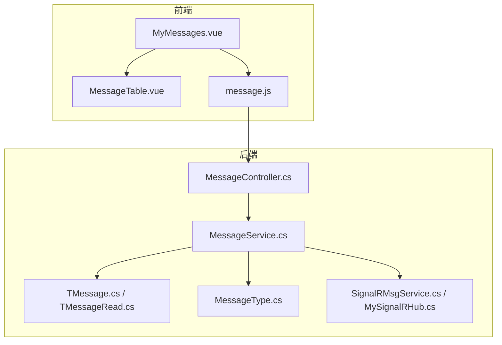
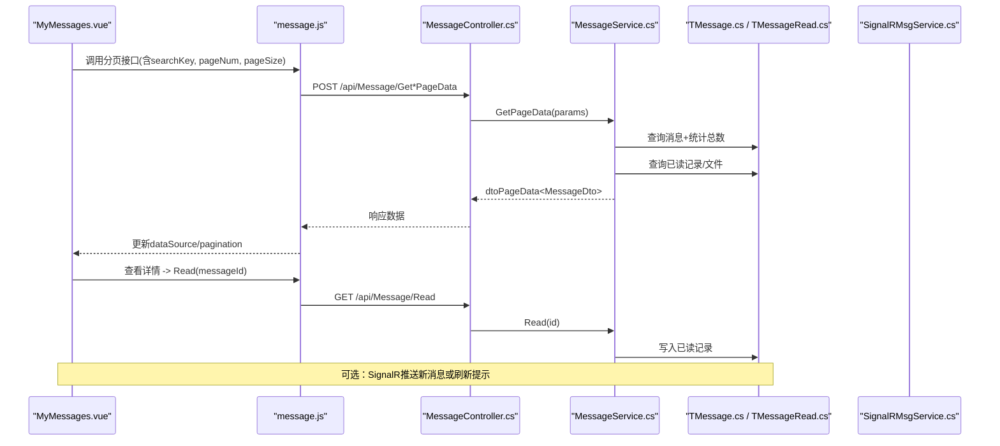
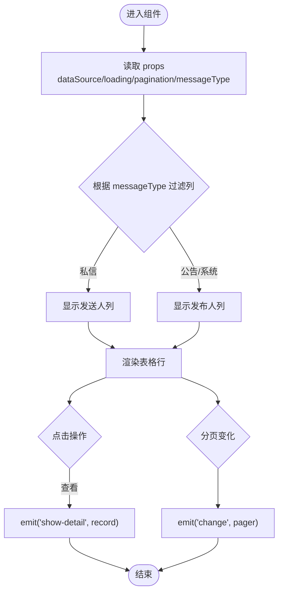
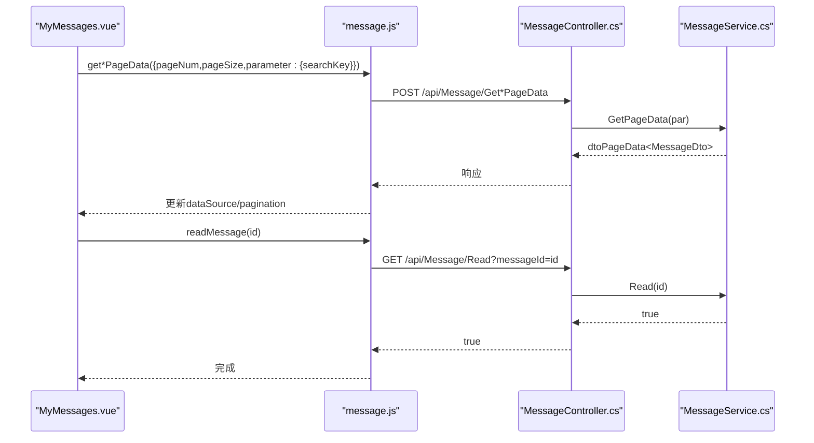
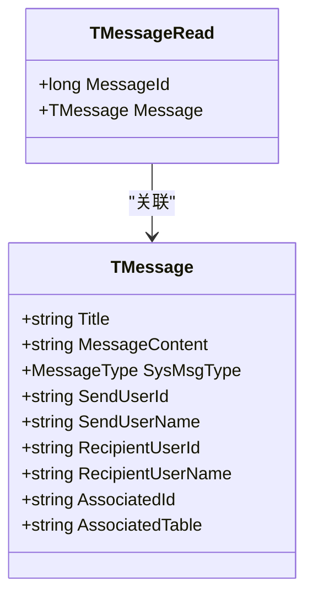
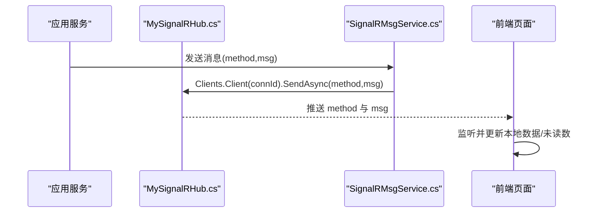
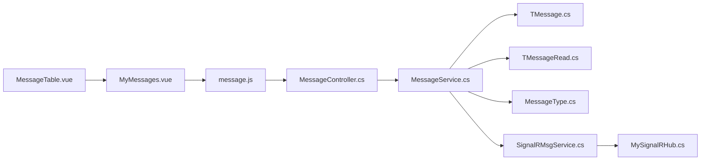

# 消息表格组件

<cite>
**本文引用的文件**
- [MessageTable.vue](file://vue/kevin.web.vue/src/components/MessageTable.vue)
- [MyMessages.vue](file://vue/kevin.web.vue/src/pages/MyMessages.vue)
- [message.js](file://vue/kevin.web.vue/src/api/message.js)
- [MessageController.cs](file://Kevin/Kevin.Web.Basics/Controllers/MessageController.cs)
- [MessageService.cs](file://Kevin/Application/Services/MessageService.cs)
- [TMessage.cs](file://Kevin/Domain/Entities/TMessage.cs)
- [TMessageRead.cs](file://Kevin/Domain/Entities/TMessageRead.cs)
- [MessageType.cs](file://Kevin/kevin.Share/Enums/MessageType.cs)
- [SignalRMsgService.cs](file://Kevin/kevin.Module/Kevin.SignalR/Service/SignalRMsgService.cs)
- [MySignalRHub.cs](file://Kevin/kevin.Module/Kevin.SignalR/MySignalRHub.cs)
</cite>

## 目录
1. [简介](#简介)
2. [项目结构](#项目结构)
3. [核心组件](#核心组件)
4. [架构总览](#架构总览)
5. [详细组件分析](#详细组件分析)
6. [依赖关系分析](#依赖关系分析)
7. [性能考虑](#性能考虑)
8. [故障排查指南](#故障排查指南)
9. [结论](#结论)
10. [附录](#附录)

## 简介
本文件围绕前端 MessageTable.vue 消息表格组件，结合后端 API、领域模型与 SignalR 实时推送能力，系统性说明其功能与实现：消息列表展示、分类筛选、状态管理（已读/未读）、分页与搜索、富文本内容展示、以及基于 SignalR 的实时消息更新机制。文档同时提供使用场景与性能优化建议，帮助开发者快速集成与扩展。

## 项目结构
- 前端
  - 组件层：MessageTable.vue 负责表格渲染、列过滤、事件派发
  - 页面层：MyMessages.vue 聚合多个消息类型 Tab，统一处理分页、搜索、详情弹窗与已读标记
  - API 层：message.js 封装消息相关 HTTP 接口
- 后端
  - 控制器：MessageController.cs 暴露分页查询、新增编辑、删除、已读、未读数等接口
  - 服务层：MessageService.cs 实现业务逻辑（分页、搜索、已读计数、读写操作）
  - 领域实体：TMessage.cs、TMessageRead.cs 定义消息与已读记录
  - 枚举：MessageType.cs 定义消息类型（公告、私信、系统、AI 等）
  - 实时推送：SignalRMsgService.cs、MySignalRHub.cs 提供连接管理与消息广播

图表来源
- [MessageTable.vue:1-150](file://vue/kevin.web.vue/src/components/MessageTable.vue#L1-L150)
- [MyMessages.vue:1-606](file://vue/kevin.web.vue/src/pages/MyMessages.vue#L1-L606)
- [message.js:1-37](file://vue/kevin.web.vue/src/api/message.js#L1-L37)
- [MessageController.cs:1-140](file://Kevin/Kevin.Web.Basics/Controllers/MessageController.cs#L1-L140)
- [MessageService.cs:1-186](file://Kevin/Application/Services/MessageService.cs#L1-L186)
- [TMessage.cs:1-55](file://Kevin/Domain/Entities/TMessage.cs#L1-L55)
- [TMessageRead.cs:1-20](file://Kevin/Domain/Entities/TMessageRead.cs#L1-L20)
- [MessageType.cs:1-22](file://Kevin/kevin.Share/Enums/MessageType.cs#L1-L22)
- [SignalRMsgService.cs:1-131](file://Kevin/kevin.Module/Kevin.SignalR/Service/SignalRMsgService.cs#L1-L131)
- [MySignalRHub.cs:97-155](file://Kevin/kevin.Module/Kevin.SignalR/MySignalRHub.cs#L97-L155)

章节来源
- [MessageTable.vue:1-150](file://vue/kevin.web.vue/src/components/MessageTable.vue#L1-L150)
- [MyMessages.vue:1-606](file://vue/kevin.web.vue/src/pages/MyMessages.vue#L1-L606)
- [message.js:1-37](file://vue/kevin.web.vue/src/api/message.js#L1-L37)
- [MessageController.cs:1-140](file://Kevin/Kevin.Web.Basics/Controllers/MessageController.cs#L1-L140)
- [MessageService.cs:1-186](file://Kevin/Application/Services/MessageService.cs#L1-L186)
- [TMessage.cs:1-55](file://Kevin/Domain/Entities/TMessage.cs#L1-L55)
- [TMessageRead.cs:1-20](file://Kevin/Domain/Entities/TMessageRead.cs#L1-L20)
- [MessageType.cs:1-22](file://Kevin/kevin.Share/Enums/MessageType.cs#L1-L22)
- [SignalRMsgService.cs:1-131](file://Kevin/kevin.Module/Kevin.SignalR/Service/SignalRMsgService.cs#L1-L131)
- [MySignalRHub.cs:97-155](file://Kevin/kevin.Module/Kevin.SignalR/MySignalRHub.cs#L97-L155)

## 核心组件
- MessageTable.vue
  - 职责：接收数据源、加载态、分页配置与消息类型，渲染 Ant Design Vue 表格；根据消息类型动态过滤列；格式化时间；触发“查看”事件。
  - 关键特性：
    - 列过滤：依据 messageType 决定显示“发送人”或“发布人”列
    - 未读高亮：标题在未读时加粗显示
    - 事件：change（分页变化）、show-detail（查看详情）
- MyMessages.vue
  - 职责：多 Tab 聚合不同消息类型的数据与分页；统一搜索；打开详情并调用已读接口；日期格式化。
- message.js
  - 职责：封装消息相关 HTTP 请求（分页、新增编辑、删除、已读、未读数、各类型分页）。
- MessageController.cs / MessageService.cs
  - 职责：提供分页查询（支持关键词搜索、按用户/类型筛选）、新增编辑、删除、已读标记、未读计数；填充 IsRead、Files、CreateUser 等展示字段。
- 领域模型与枚举
  - TMessage.cs：消息实体（标题、内容、类型、发送/接收人、关联信息等）
  - TMessageRead.cs：已读记录（消息ID、创建用户等）
  - MessageType.cs：消息类型枚举（公告、私人私信、公共系统、私人系统、所有、AI）
- SignalR 实时推送
  - SignalRMsgService.cs：提供按连接ID、身份ID、租户范围的消息发送能力
  - MySignalRHub.cs：维护连接与身份映射，支持断线清理

章节来源
- [MessageTable.vue:41-129](file://vue/kevin.web.vue/src/components/MessageTable.vue#L41-L129)
- [MyMessages.vue:124-490](file://vue/kevin.web.vue/src/pages/MyMessages.vue#L124-L490)
- [message.js:1-37](file://vue/kevin.web.vue/src/api/message.js#L1-L37)
- [MessageController.cs:33-137](file://Kevin/Kevin.Web.Basics/Controllers/MessageController.cs#L33-L137)
- [MessageService.cs:22-183](file://Kevin/Application/Services/MessageService.cs#L22-L183)
- [TMessage.cs:1-55](file://Kevin/Domain/Entities/TMessage.cs#L1-L55)
- [TMessageRead.cs:1-20](file://Kevin/Domain/Entities/TMessageRead.cs#L1-L20)
- [MessageType.cs:1-22](file://Kevin/kevin.Share/Enums/MessageType.cs#L1-L22)
- [SignalRMsgService.cs:1-131](file://Kevin/kevin.Module/Kevin.SignalR/Service/SignalRMsgService.cs#L1-L131)
- [MySignalRHub.cs:97-155](file://Kevin/kevin.Module/Kevin.SignalR/MySignalRHub.cs#L97-L155)

## 架构总览
消息表格从前端到后端的完整链路如下：
- 前端通过 MyMessages.vue 选择 Tab 与搜索条件，调用 message.js 中的分页接口
- 后端 MessageController 将参数转发至 MessageService，按类型与关键词查询，计算总数与分页数据
- 服务层补充 IsRead、Files、CreateUser 等展示信息，返回给前端
- 前端表格渲染，点击“查看”触发 show-detail，并在详情页调用 Read 接口标记为已读
- 实时消息通过 SignalR 推送新消息或通知刷新，前端可监听并更新本地数据

图表来源
- [MyMessages.vue:204-420](file://vue/kevin.web.vue/src/pages/MyMessages.vue#L204-L420)
- [message.js:1-37](file://vue/kevin.web.vue/src/api/message.js#L1-L37)
- [MessageController.cs:33-137](file://Kevin/Kevin.Web.Basics/Controllers/MessageController.cs#L33-L137)
- [MessageService.cs:48-104](file://Kevin/Application/Services/MessageService.cs#L48-L104)
- [TMessage.cs:1-55](file://Kevin/Domain/Entities/TMessage.cs#L1-L55)
- [TMessageRead.cs:1-20](file://Kevin/Domain/Entities/TMessageRead.cs#L1-L20)
- [SignalRMsgService.cs:72-111](file://Kevin/kevin.Module/Kevin.SignalR/Service/SignalRMsgService.cs#L72-L111)

## 详细组件分析

### MessageTable.vue 组件分析
- 输入属性
  - dataSource：消息列表数据
  - loading：加载状态
  - pagination：分页配置对象
  - messageType：消息类型（private-system、private-user、announcement、system），用于控制列显示
- 输出事件
  - change：分页变化时向上抛出 pager 对象
  - show-detail：点击“查看”时抛出当前行 record
- 列定义与过滤
  - 默认列：标题、发送人、发布人、时间、操作
  - 根据 messageType 过滤：私信类隐藏“发布人”，公告/系统类隐藏“发送人”
- 渲染细节
  - 标题在未读时加粗显示（isRead=false）
  - 时间格式化使用本地化字符串
- 样式
  - 操作按钮链接样式与悬停效果
  - 未读标题样式类

图表来源
- [MessageTable.vue:68-129](file://vue/kevin.web.vue/src/components/MessageTable.vue#L68-L129)

章节来源
- [MessageTable.vue:1-150](file://vue/kevin.web.vue/src/components/MessageTable.vue#L1-L150)

### MyMessages.vue 页面分析
- 多 Tab 管理：系统私信、私人私信、公司公告、系统消息、AI 消息
- 搜索：统一 searchKey，切换 Tab 或搜索时重置页码并重新拉取数据
- 分页：每个 Tab 独立分页状态，表格 change 事件更新分页并刷新数据
- 详情弹窗：显示标题、发送人/发布人、时间、富文本内容（v-html）
- 已读标记：点击“查看”后调用 readMessage 接口标记为已读

图表来源
- [MyMessages.vue:204-420](file://vue/kevin.web.vue/src/pages/MyMessages.vue#L204-L420)
- [message.js:1-37](file://vue/kevin.web.vue/src/api/message.js#L1-L37)
- [MessageController.cs:33-137](file://Kevin/Kevin.Web.Basics/Controllers/MessageController.cs#L33-L137)
- [MessageService.cs:48-104](file://Kevin/Application/Services/MessageService.cs#L48-L104)

章节来源
- [MyMessages.vue:1-606](file://vue/kevin.web.vue/src/pages/MyMessages.vue#L1-L606)

### 后端服务与数据模型
- 分页查询 GetPageData
  - 支持关键词搜索（标题/内容）
  - 支持按用户、消息类型筛选
  - 返回 total、data，并填充 IsRead、Files、CreateUser
- 已读标记 Read
  - 写入 TMessageRead 记录，包含消息ID、创建用户、租户ID等
- 新增编辑 AddEdit
  - 新增或更新消息，设置创建/更新时间、用户、租户等信息
- 删除 Delete
  - 软删除，设置 IsDelete、DeleteTime
- 未读计数 GetMyNoReadCount
  - 按当前租户与用户筛选，排除已读记录，支持按消息类型过滤

图表来源
- [TMessage.cs:1-55](file://Kevin/Domain/Entities/TMessage.cs#L1-L55)
- [TMessageRead.cs:1-20](file://Kevin/Domain/Entities/TMessageRead.cs#L1-L20)

章节来源
- [MessageService.cs:22-183](file://Kevin/Application/Services/MessageService.cs#L22-L183)
- [TMessage.cs:1-55](file://Kevin/Domain/Entities/TMessage.cs#L1-L55)
- [TMessageRead.cs:1-20](file://Kevin/Domain/Entities/TMessageRead.cs#L1-L20)

### 消息类型与差异化展示
- 消息类型枚举
  - Announcement：公司公告
  - PrivateUser：私人私信
  - System：公共系统消息
  - PrivateUserSystem：私人系统消息
  - All：仅用于筛选
  - AI：AI 消息
- 前端差异化
  - 私信类显示“发送人”列
  - 公告/系统类显示“发布人”列
  - 标题未读时加粗显示

章节来源
- [MessageType.cs:1-22](file://Kevin/kevin.Share/Enums/MessageType.cs#L1-L22)
- [MessageTable.vue:98-112](file://vue/kevin.web.vue/src/components/MessageTable.vue#L98-L112)
- [MessageTable.vue:10-13](file://vue/kevin.web.vue/src/components/MessageTable.vue#L10-L13)

### 搜索与分页
- 搜索
  - 前端统一 searchKey，传入 parameter.searchKey
  - 后端在 GetPageData 中按标题/内容模糊匹配
- 分页
  - 前端每 Tab 维护独立分页状态
  - 表格 change 事件更新 current/pageSize 并重新拉取数据
  - 后端返回 total/pageNum/pageSize 供前端同步

章节来源
- [MyMessages.vue:141-475](file://vue/kevin.web.vue/src/pages/MyMessages.vue#L141-L475)
- [MessageService.cs:48-90](file://Kevin/Application/Services/MessageService.cs#L48-L90)

### 富文本渲染
- 详情页使用 v-html 渲染 messageContent，支持 HTML、图片、链接等内容
- 注意：生产环境需对富文本进行安全过滤（如白名单策略），避免 XSS 风险

章节来源
- [MyMessages.vue:104-118](file://vue/kevin.web.vue/src/pages/MyMessages.vue#L104-L118)

### 实时消息推送（SignalR）
- 连接管理
  - MySignalRHub 维护连接与身份映射，支持断线清理
- 消息发送
  - SignalRMsgService 提供按连接ID、身份ID、租户范围发送消息的能力
- 使用场景
  - 新消息到达时，服务端通过 SignalR 推送方法名与消息体
  - 前端订阅对应方法，收到后刷新列表或增加未读计数

图表来源
- [SignalRMsgService.cs:72-111](file://Kevin/kevin.Module/Kevin.SignalR/Service/SignalRMsgService.cs#L72-L111)
- [MySignalRHub.cs:97-155](file://Kevin/kevin.Module/Kevin.SignalR/MySignalRHub.cs#L97-L155)

章节来源
- [SignalRMsgService.cs:1-131](file://Kevin/kevin.Module/Kevin.SignalR/Service/SignalRMsgService.cs#L1-L131)
- [MySignalRHub.cs:97-155](file://Kevin/kevin.Module/Kevin.SignalR/MySignalRHub.cs#L97-L155)

## 依赖关系分析
- 前端依赖
  - MessageTable.vue 依赖 Ant Design Vue 表格与图标
  - MyMessages.vue 依赖 message.js 提供的 API 封装
- 后端依赖
  - MessageController 依赖 IMessageService
  - MessageService 依赖 IMessageRp、IMessageReadRp、IFileService、IUserRp
  - 领域实体 TMessage、TMessageRead 与枚举 MessageType
- 实时推送依赖
  - SignalRMsgService 依赖 IHubContext<MySignalRHub> 与缓存服务
  - MySignalRHub 依赖 CurrentUser 与缓存服务以维护连接映射

图表来源
- [MessageTable.vue:1-150](file://vue/kevin.web.vue/src/components/MessageTable.vue#L1-L150)
- [MyMessages.vue:1-606](file://vue/kevin.web.vue/src/pages/MyMessages.vue#L1-L606)
- [message.js:1-37](file://vue/kevin.web.vue/src/api/message.js#L1-L37)
- [MessageController.cs:1-140](file://Kevin/Kevin.Web.Basics/Controllers/MessageController.cs#L1-L140)
- [MessageService.cs:1-186](file://Kevin/Application/Services/MessageService.cs#L1-L186)
- [TMessage.cs:1-55](file://Kevin/Domain/Entities/TMessage.cs#L1-L55)
- [TMessageRead.cs:1-20](file://Kevin/Domain/Entities/TMessageRead.cs#L1-L20)
- [MessageType.cs:1-22](file://Kevin/kevin.Share/Enums/MessageType.cs#L1-L22)
- [SignalRMsgService.cs:1-131](file://Kevin/kevin.Module/Kevin.SignalR/Service/SignalRMsgService.cs#L1-L131)
- [MySignalRHub.cs:97-155](file://Kevin/kevin.Module/Kevin.SignalR/MySignalRHub.cs#L97-L155)

章节来源
- [MessageService.cs:1-186](file://Kevin/Application/Services/MessageService.cs#L1-L186)
- [MessageController.cs:1-140](file://Kevin/Kevin.Web.Basics/Controllers/MessageController.cs#L1-L140)

## 性能考虑
- 分页与懒加载
  - 前端按 Tab 维护分页，避免一次性加载全部数据
  - 后端使用 Skip/Take 分页，减少数据库压力
- 搜索优化
  - 关键词搜索在后端进行，避免前端全量过滤
  - 建议在数据库层对标题/内容建立合适索引以提升模糊查询性能
- 已读状态
  - 已读记录单独表存储，查询时批量判断是否已读，减少 N+1 问题
- 文件附件
  - 文件 DTO 批量获取并按消息 ID 关联，减少多次 IO
- 实时推送
  - 使用 SignalR 按需推送，避免轮询
  - 连接映射缓存于 Redis，支持分布式部署下的连接查找
- 富文本渲染
  - 谨慎使用 v-html，建议在服务端或客户端做白名单过滤，防止 XSS

[本节为通用性能建议，不直接分析具体文件]

## 故障排查指南
- 列表为空或数据不正确
  - 检查前端分页参数是否正确传递（pageNum、pageSize）
  - 检查后端 GetPageData 的 searchKey 与 Parameter 是否正确拼接
  - 确认当前租户与用户上下文是否正确
- 已读状态不生效
  - 确认 Read 接口被调用且 messageId 正确
  - 检查 TMessageRead 是否成功写入，且查询时按 CreateUserId 与 TenantId 过滤
- 搜索无结果
  - 确认后端 Contains 查询字段是否为空
  - 检查数据库是否存在匹配数据
- 实时消息未推送
  - 检查 SignalR 连接是否正常建立
  - 确认目标连接ID或身份ID是否正确
  - 查看缓存中连接映射是否有效

章节来源
- [MessageService.cs:48-104](file://Kevin/Application/Services/MessageService.cs#L48-L104)
- [MessageController.cs:117-137](file://Kevin/Kevin.Web.Basics/Controllers/MessageController.cs#L117-L137)
- [SignalRMsgService.cs:25-111](file://Kevin/kevin.Module/Kevin.SignalR/Service/SignalRMsgService.cs#L25-L111)
- [MySignalRHub.cs:97-155](file://Kevin/kevin.Module/Kevin.SignalR/MySignalRHub.cs#L97-L155)

## 结论
MessageTable.vue 作为消息表格的核心展示组件，配合 MyMessages.vue 的多 Tab 管理、message.js 的 API 封装，以及后端 MessageController/MessageService 的分页、搜索、状态管理，形成了完整的消息管理能力。通过 SignalR 的实时推送，可实现新消息的即时通知与更新。建议在后续迭代中增强搜索维度（时间范围、发送人筛选）、完善富文本安全过滤，并结合缓存与索引优化查询性能。

[本节为总结性内容，不直接分析具体文件]

## 附录
- 常用接口路径
  - 分页查询：/api/Message/Get*PageData（系统私信、私人私信、公司公告、系统消息、AI 消息）
  - 新增编辑：/api/Message/AddEdit
  - 删除：/api/Message/Delete
  - 已读：/api/Message/Read
  - 未读数：/api/Message/GetMyNoReadCount
- 消息类型
  - Announcement、PrivateUser、System、PrivateUserSystem、All、AI

章节来源
- [message.js:1-37](file://vue/kevin.web.vue/src/api/message.js#L1-L37)
- [MessageController.cs:33-137](file://Kevin/Kevin.Web.Basics/Controllers/MessageController.cs#L33-L137)
- [MessageType.cs:1-22](file://Kevin/kevin.Share/Enums/MessageType.cs#L1-L22)