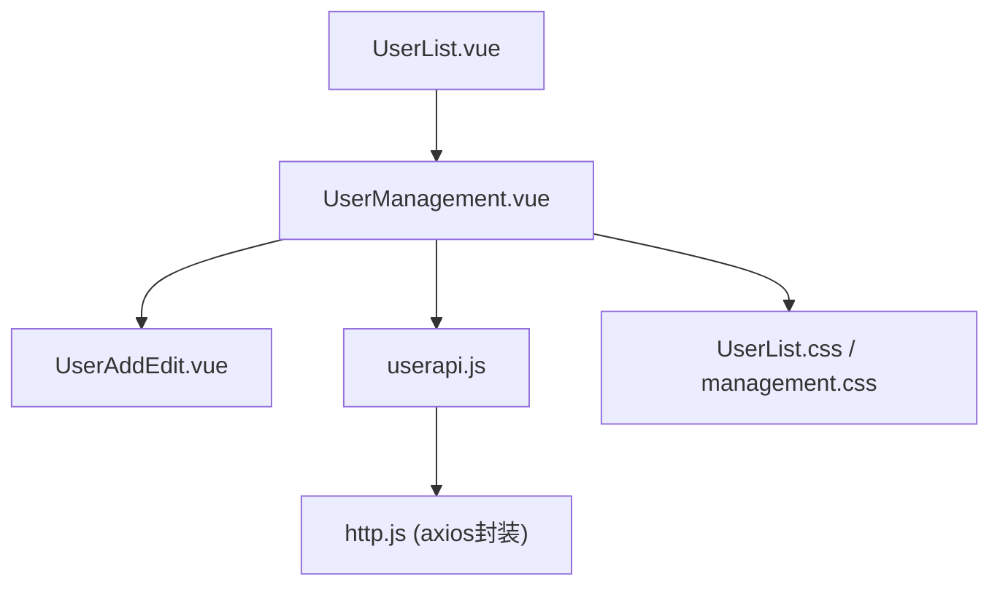
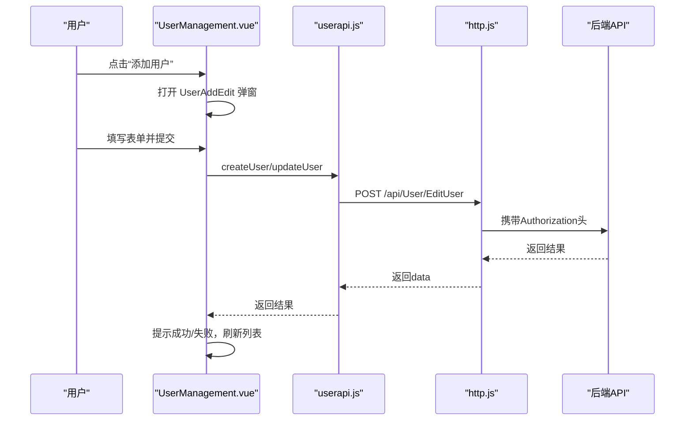
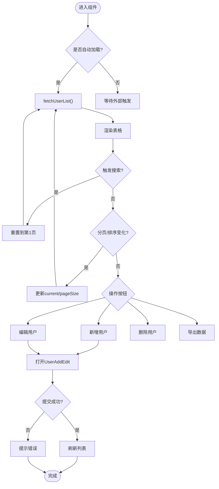
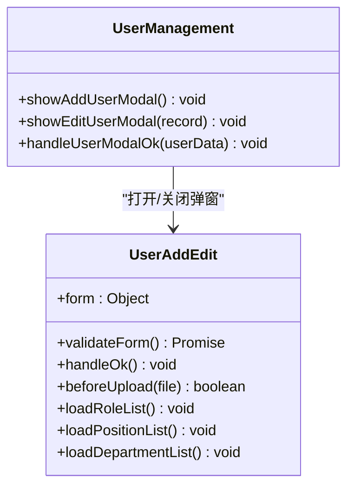
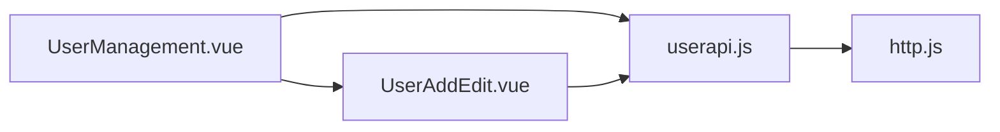

# 用户管理组件

<cite>
**本文引用的文件**
- [UserManagement.vue](file://vue/kevin.web.vue/src/components/UserManagement.vue)
- [UserAddEdit.vue](file://vue/kevin.web.vue/src/components/UserAddEdit.vue)
- [userapi.js](file://vue/kevin.web.vue/src/api/userapi.js)
- [http.js](file://vue/kevin.web.vue/src/utils/http.js)
- [UserList.vue](file://vue/kevin.web.vue/src/pages/UserList.vue)
- [UserList.css](file://vue/kevin.web.vue/src/css/UserList.css)
- [management.css](file://vue/kevin.web.vue/src/css/management.css)
</cite>

## 目录
1. [简介](#简介)
2. [项目结构](#项目结构)
3. [核心组件](#核心组件)
4. [架构总览](#架构总览)
5. [详细组件分析](#详细组件分析)
6. [依赖关系分析](#依赖关系分析)
7. [性能考虑](#性能考虑)
8. [故障排查指南](#故障排查指南)
9. [结论](#结论)
10. [附录：使用流程与最佳实践](#附录使用流程与最佳实践)

## 简介
本文件为 UserManagement.vue 用户管理组件的完整技术文档。内容覆盖用户列表展示、搜索过滤、分页查询、状态展示与管理、表单新增/编辑/删除、导出、列配置、排序、权限控制（按钮级）、表单验证规则、前后端交互、响应式设计与移动端适配，以及完整的操作流程与最佳实践。

## 项目结构
该功能由页面容器与两个核心组件构成：
- 页面容器：UserList.vue 仅用于挂载并引用 UserManagement 组件
- 列表与操作：UserManagement.vue 负责数据获取、表格渲染、搜索、分页、导出、列显示隐藏、打开新增/编辑弹窗等
- 新增/编辑弹窗：UserAddEdit.vue 负责用户信息的表单校验、角色/岗位/部门树选择、头像上传、调用后端接口保存或更新

图表来源
- [UserList.vue:1-17](file://vue/kevin.web.vue/src/pages/UserList.vue#L1-L17)
- [UserManagement.vue:1-548](file://vue/kevin.web.vue/src/components/UserManagement.vue#L1-L548)
- [UserAddEdit.vue:1-552](file://vue/kevin.web.vue/src/components/UserAddEdit.vue#L1-L552)
- [userapi.js:1-44](file://vue/kevin.web.vue/src/api/userapi.js#L1-L44)
- [http.js:1-125](file://vue/kevin.web.vue/src/utils/http.js#L1-L125)
- [UserList.css:1-266](file://vue/kevin.web.vue/src/css/UserList.css#L1-L266)
- [management.css:1-177](file://vue/kevin.web.vue/src/css/management.css#L1-L177)

章节来源
- [UserList.vue:1-17](file://vue/kevin.web.vue/src/pages/UserList.vue#L1-L17)
- [UserManagement.vue:1-548](file://vue/kevin.web.vue/src/components/UserManagement.vue#L1-L548)
- [UserAddEdit.vue:1-552](file://vue/kevin.web.vue/src/components/UserAddEdit.vue#L1-L552)
- [userapi.js:1-44](file://vue/kevin.web.vue/src/api/userapi.js#L1-L44)
- [http.js:1-125](file://vue/kevin.web.vue/src/utils/http.js#L1-L125)
- [UserList.css:1-266](file://vue/kevin.web.vue/src/css/UserList.css#L1-L266)
- [management.css:1-177](file://vue/kevin.web.vue/src/css/management.css#L1-L177)

## 核心组件
- UserManagement.vue：提供用户列表、搜索、分页、导出、列设置、状态展示、打开新增/编辑弹窗、删除确认、事件对外暴露等能力
- UserAddEdit.vue：提供用户新增/编辑表单、字段校验、角色/岗位/部门树选择、头像预览与上传、调用创建/更新接口
- userapi.js：封装所有用户相关 API（列表、创建、更新、删除、导出、角色列表等）
- http.js：统一 axios 实例、请求头注入 token、全局错误处理、文件下载处理、401/403 拦截跳转

章节来源
- [UserManagement.vue:152-523](file://vue/kevin.web.vue/src/components/UserManagement.vue#L152-L523)
- [UserAddEdit.vue:171-552](file://vue/kevin.web.vue/src/components/UserAddEdit.vue#L171-L552)
- [userapi.js:1-44](file://vue/kevin.web.vue/src/api/userapi.js#L1-L44)
- [http.js:1-125](file://vue/kevin.web.vue/src/utils/http.js#L1-L125)

## 架构总览
前端采用“页面容器 + 可复用组件”的模式。UserManagement 作为业务主入口，通过 userapi.js 调用后端接口；UserAddEdit 专注表单与数据提交；http.js 统一鉴权与异常处理。样式层通过 CSS 变量与媒体查询实现深色主题与移动端适配。

图表来源
- [UserManagement.vue:431-465](file://vue/kevin.web.vue/src/components/UserManagement.vue#L431-L465)
- [UserAddEdit.vue:451-521](file://vue/kevin.web.vue/src/components/UserAddEdit.vue#L451-L521)
- [userapi.js:11-17](file://vue/kevin.web.vue/src/api/userapi.js#L11-L17)
- [http.js:11-25](file://vue/kevin.web.vue/src/utils/http.js#L11-L25)

## 详细组件分析

### UserManagement.vue 组件分析
- 数据绑定与表格渲染
  - 使用 Ant Design Vue 的 a-table 渲染用户列表，columns 定义列标题、 dataIndex、宽度、筛选与排序开关
  - bodyCell 插槽对头像、状态、角色、岗位、部门、时间等字段进行格式化展示
  - 通过 computed(visibleColumns) 动态计算可见列，支持“列设置”下拉菜单勾选显示/隐藏
- 搜索与分页
  - 顶部搜索框触发 onSearch，重置页码并重新拉取数据
  - 分页器 pagination 包含 pageSize、pageNum、total、快速跳转、每页条数切换等
  - handleTableChange 监听分页变化，更新 current/pageSize 后重新 fetchUserList
- 用户状态管理
  - 状态列以 Tag 展示启用/禁用，颜色区分
  - 删除使用 a-popconfirm 二次确认，成功后刷新列表
- 新增/编辑/删除/导出
  - showAddUserModal/showEditUserModal 打开 UserAddEdit 弹窗，传入 title、currentUser
  - handleDelete 调用 DeleteUser 接口，成功后提示并刷新
  - handleExport 调用 ExportGetSysUserList，携带当前搜索条件与分页参数
- 事件与对外方法
  - 通过 defineEmits 暴露 user-added、user-updated、user-deleted、user-exported、load-success、load-error
  - 通过 defineExpose 暴露 reload 方法供父组件调用
- 权限控制（按钮级）
  - 通过 props 控制按钮显隐：showAddButton、showExportButton、showEditButton、showDeleteButton
  - 可在父组件根据角色/权限动态传入这些布尔值，实现按钮级权限控制
- 响应式与移动端适配
  - 引入 UserList.css 与 management.css，包含媒体查询 @media(max-width:768px)，在窄屏下调整布局与工具栏排列

图表来源
- [UserManagement.vue:337-429](file://vue/kevin.web.vue/src/components/UserManagement.vue#L337-L429)
- [UserManagement.vue:507-522](file://vue/kevin.web.vue/src/components/UserManagement.vue#L507-L522)
- [UserManagement.vue:431-505](file://vue/kevin.web.vue/src/components/UserManagement.vue#L431-L505)

章节来源
- [UserManagement.vue:1-548](file://vue/kevin.web.vue/src/components/UserManagement.vue#L1-L548)

### UserAddEdit.vue 组件分析
- 表单结构与字段
  - 用户名、昵称、手机号、邮箱、角色（多选）、部门（树选择）、岗位（树选择）、员工状态、入职时间、个性签名、性别、工号、上级、微信号、QQ、状态开关、密码、头像上传
- 表单验证规则
  - 必填项：用户名、昵称、手机号、角色、岗位、部门
  - 格式校验：手机号正则、邮箱类型
  - 业务校验：部门必须选择；新增时生成雪花ID再提交
- 数据填充与回显
  - 监听 props.user，若存在 id 则进入编辑模式，映射 roles/positions/dtoUserInfo 等字段
  - 新增时清空表单，保留默认值
- 树形数据加载
  - 加载角色列表、岗位树、部门树，并将后端扁平/层级数据转换为树结构
- 提交逻辑
  - 校验通过后组装 userData，新增时先获取新 ID，再调用 createUser/updateUser
  - 成功后提示并触发 ok 事件，父组件刷新列表
- 头像上传
  - beforeUpload 限制图片类型与大小，读取预览但不自动上传，最终将 base64 URL 随表单提交

图表来源
- [UserAddEdit.vue:186-239](file://vue/kevin.web.vue/src/components/UserAddEdit.vue#L186-L239)
- [UserAddEdit.vue:286-345](file://vue/kevin.web.vue/src/components/UserAddEdit.vue#L286-L345)
- [UserAddEdit.vue:368-431](file://vue/kevin.web.vue/src/components/UserAddEdit.vue#L368-L431)
- [UserAddEdit.vue:451-521](file://vue/kevin.web.vue/src/components/UserAddEdit.vue#L451-L521)
- [UserManagement.vue:431-465](file://vue/kevin.web.vue/src/components/UserManagement.vue#L431-L465)

章节来源
- [UserAddEdit.vue:1-552](file://vue/kevin.web.vue/src/components/UserAddEdit.vue#L1-L552)

### 数据模型与列配置
- 表格列
  - 头像、手机号、用户名、昵称、邮箱、角色、岗位、部门、状态、创建时间、最近登录时间、操作
  - 状态列支持筛选（启用/禁用），时间与操作列固定右侧
- 数据映射
  - 后端返回的用户对象映射为前端表格行，补充 key/id/name/nickName/phone/email/roles/positions/dtoUserInfo/status/createTime/recentLoginTime/avatar 等字段
  - 头像默认使用本地资源占位图

章节来源
- [UserManagement.vue:222-303](file://vue/kevin.web.vue/src/components/UserManagement.vue#L222-L303)
- [UserManagement.vue:398-412](file://vue/kevin.web.vue/src/components/UserManagement.vue#L398-L412)

### 权限控制机制（基于角色的访问控制与按钮级权限）
- 按钮级控制
  - 通过 props 控制“添加”“导出”“编辑”“删除”按钮的显示与隐藏，父组件可根据当前用户角色/权限决定传参
- 接口级保护
  - http.js 在响应拦截器中处理 401/403，未登录或无权限时清理本地信息并跳转登录页或提示无权限
- 建议扩展
  - 可在 UserManagement 中增加 v-if 指令结合权限标识，进一步细化到具体操作按钮的权限控制

章节来源
- [UserManagement.vue:167-210](file://vue/kevin.web.vue/src/components/UserManagement.vue#L167-L210)
- [http.js:51-96](file://vue/kevin.web.vue/src/utils/http.js#L51-L96)
- [http.js:100-122](file://vue/kevin.web.vue/src/utils/http.js#L100-L122)

### 表单验证规则
- 必填字段：用户名、昵称、手机号、角色、岗位、部门
- 格式验证：手机号正则、邮箱类型
- 业务规则：部门必须选择；新增时先获取雪花ID再提交；头像格式与大小限制

章节来源
- [UserAddEdit.vue:214-239](file://vue/kevin.web.vue/src/components/UserAddEdit.vue#L214-L239)
- [UserAddEdit.vue:347-366](file://vue/kevin.web.vue/src/components/UserAddEdit.vue#L347-L366)
- [UserAddEdit.vue:451-521](file://vue/kevin.web.vue/src/components/UserAddEdit.vue#L451-L521)

### 与后端 API 的交互方式
- 列表查询：POST /api/User/GetSysUserList，携带 searchKey、pageSize、pageNum 及外部 queryParams
- 新增/更新：POST /api/User/EditUser，新增时先 GET 雪花ID，再提交；更新直接提交
- 删除：DELETE /api/User/DeleteUser?id={id}
- 导出：POST /api/User/ExportGetSysUserList，responseType: blob，由 http.js 统一处理下载
- 角色列表：GET /api/User/GetUserRoleKey，用于弹窗中的角色多选

章节来源
- [userapi.js:11-33](file://vue/kevin.web.vue/src/api/userapi.js#L11-L33)
- [http.js:38-47](file://vue/kevin.web.vue/src/utils/http.js#L38-L47)
- [UserManagement.vue:374-429](file://vue/kevin.web.vue/src/components/UserManagement.vue#L374-L429)
- [UserManagement.vue:483-505](file://vue/kevin.web.vue/src/components/UserManagement.vue#L483-L505)
- [UserAddEdit.vue:368-431](file://vue/kevin.web.vue/src/components/UserAddEdit.vue#L368-L431)

### 响应式设计与移动端适配
- 样式层面
  - 深色主题卡片、表格、模态框、输入框、选择器等统一风格
  - 媒体查询在 768px 以下调整头部、工具栏布局，保证小屏可用性
- 交互层面
  - 表格横向滚动、列宽固定，避免在小屏出现错位
  - 弹窗宽度适中，表单栅格自适应

章节来源
- [UserList.css:3-266](file://vue/kevin.web.vue/src/css/UserList.css#L3-L266)
- [management.css:1-177](file://vue/kevin.web.vue/src/css/management.css#L1-L177)

## 依赖关系分析
- 组件耦合
  - UserManagement 与 UserAddEdit 通过 props/emits 松耦合通信
  - 两者均依赖 userapi.js 提供的接口函数
- 外部依赖
  - Ant Design Vue 组件库（a-table、a-modal、a-form、a-select、a-tree-select、a-upload 等）
  - axios 通过 http.js 统一封装，处理鉴权、错误、文件下载
- 潜在循环依赖
  - 未发现循环导入；组件间通过单向数据流与事件通信

图表来源
- [UserManagement.vue:152-166](file://vue/kevin.web.vue/src/components/UserManagement.vue#L152-L166)
- [UserAddEdit.vue:171-181](file://vue/kevin.web.vue/src/components/UserAddEdit.vue#L171-L181)
- [userapi.js:1-44](file://vue/kevin.web.vue/src/api/userapi.js#L1-L44)
- [http.js:1-125](file://vue/kevin.web.vue/src/utils/http.js#L1-L125)

章节来源
- [UserManagement.vue:152-166](file://vue/kevin.web.vue/src/components/UserManagement.vue#L152-L166)
- [UserAddEdit.vue:171-181](file://vue/kevin.web.vue/src/components/UserAddEdit.vue#L171-L181)
- [userapi.js:1-44](file://vue/kevin.web.vue/src/api/userapi.js#L1-L44)
- [http.js:1-125](file://vue/kevin.web.vue/src/utils/http.js#L1-L125)

## 性能考虑
- 列表渲染
  - 使用虚拟滚动或分页减少 DOM 节点数量；当前已实现分页
  - 列固定与横向滚动提升大数据量下的可读性
- 网络请求
  - 合并查询参数，避免重复请求；分页变化时仅拉取当前页
  - 导出使用 blob 下载，避免大 JSON 传输
- 表单与树
  - 角色/岗位/部门树仅在弹窗打开时加载，减少初始开销
  - 头像上传前进行类型与大小校验，避免无效请求

[本节为通用指导，不直接分析具体文件]

## 故障排查指南
- 401 未登录
  - http.js 会清理本地缓存并跳转登录页；检查 localStorage 中的 token 是否存在
- 403 无权限
  - 统一提示“接口无权限访问”，检查后端权限策略与当前用户角色
- 400 参数错误
  - 表单校验失败或后端参数校验失败；查看控制台错误信息与 message 提示
- 导出失败
  - 检查后端返回 content-type 是否为文件类型；确认 responseType: blob 配置正确
- 列表为空或总数不正确
  - 检查 getUserList 返回的数据结构，确保 data.total 与 data.list/data.data 正确映射

章节来源
- [http.js:51-96](file://vue/kevin.web.vue/src/utils/http.js#L51-L96)
- [http.js:100-122](file://vue/kevin.web.vue/src/utils/http.js#L100-L122)
- [UserManagement.vue:374-429](file://vue/kevin.web.vue/src/components/UserManagement.vue#L374-L429)
- [UserManagement.vue:483-505](file://vue/kevin.web.vue/src/components/UserManagement.vue#L483-L505)

## 结论
UserManagement.vue 提供了完整且可复用的用户管理能力，涵盖列表展示、搜索过滤、分页、状态展示、新增/编辑/删除、导出、列配置与排序等功能。配合 UserAddEdit.vue 的强校验表单与 tree 选择器，以及与 http.js 的统一鉴权与错误处理，形成稳定易用的用户管理方案。通过 props 控制的按钮级权限，可灵活对接不同角色的访问需求。

[本节为总结，不直接分析具体文件]

## 附录：使用流程与最佳实践
- 基本使用
  - 在页面中引入 UserManagement 组件，按需传入 title、searchPlaceholder、各按钮显隐 props、queryParams、autoLoad
  - 监听 user-added、user-updated、user-deleted、user-exported 等事件，完成后续业务逻辑
- 权限控制
  - 根据当前用户角色/权限，动态设置 showAddButton、showExportButton、showEditButton、showDeleteButton
  - 后端接口需配合权限校验，防止越权操作
- 表单优化
  - 合理设置必填与格式校验，减少无效提交
  - 头像上传前校验类型与大小，提升用户体验
- 列表体验
  - 合理使用列固定与横向滚动，避免小屏错位
  - 分页参数与搜索条件保持一致，避免数据不一致
- 导出功能
  - 导出时携带当前搜索条件与分页参数，确保导出范围符合预期
  - 注意浏览器下载行为与文件名设置（由后端或 http.js 处理）

[本节为通用指导，不直接分析具体文件]