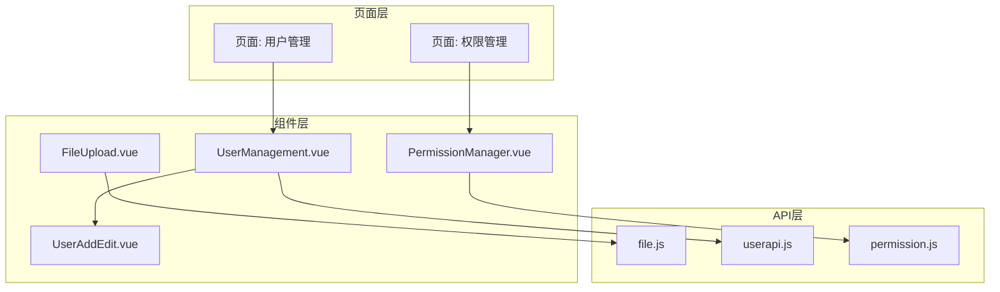
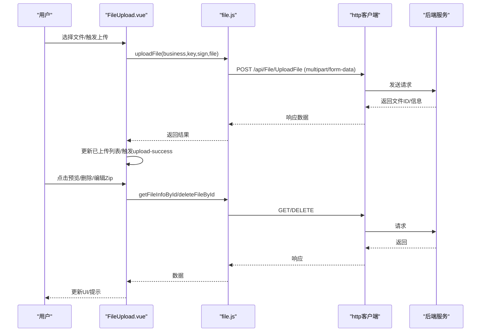
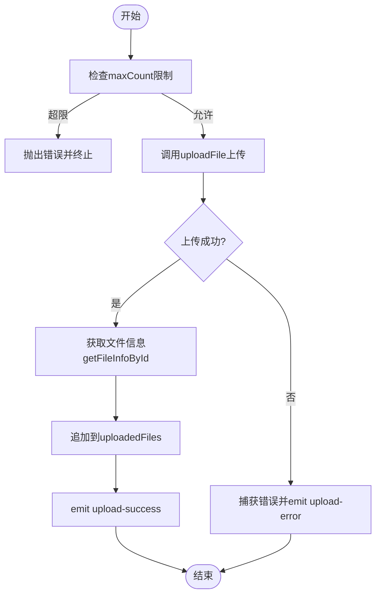
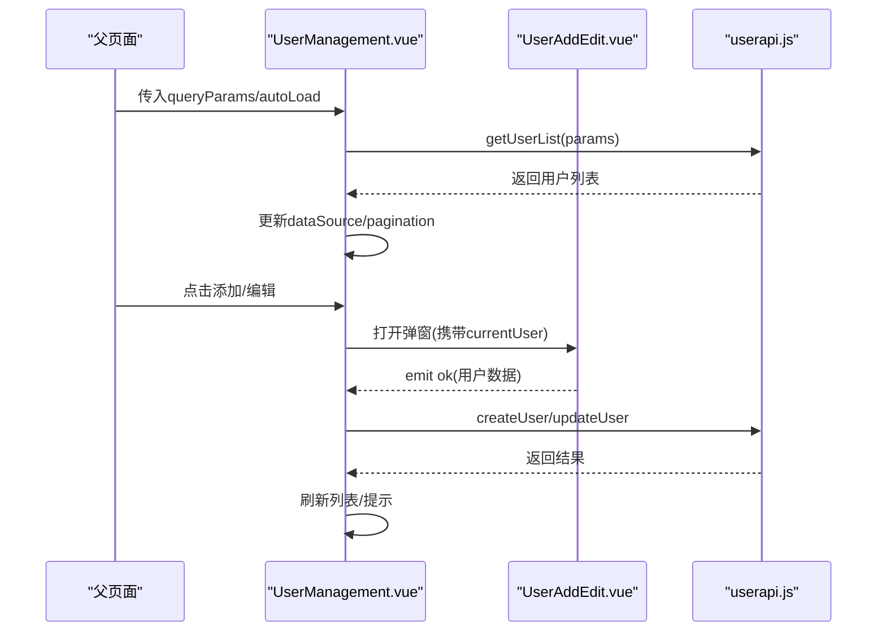
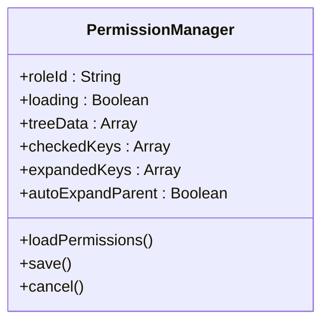
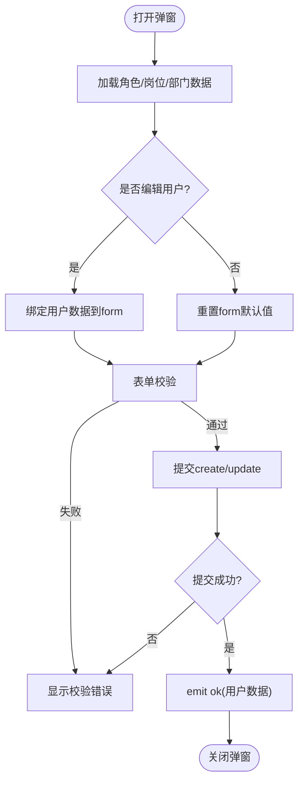
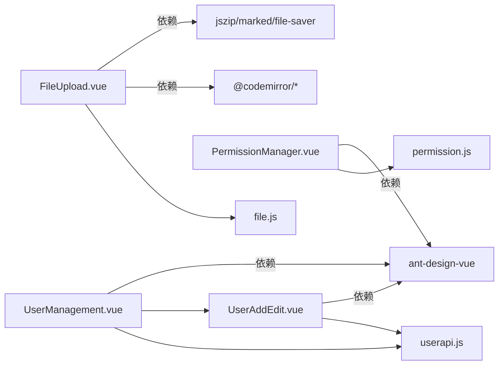

# 组件设计

<cite>
**本文引用的文件**
- [FileUpload.vue](file://vue/kevin.web.vue/src/components/FileUpload.vue)
- [UserManagement.vue](file://vue/kevin.web.vue/src/components/UserManagement.vue)
- [PermissionManager.vue](file://vue/kevin.web.vue/src/components/PermissionManager.vue)
- [UserAddEdit.vue](file://vue/kevin.web.vue/src/components/UserAddEdit.vue)
- [file.js](file://vue/kevin.web.vue/src/api/file.js)
- [userapi.js](file://vue/kevin.web.vue/src/api/userapi.js)
- [permission.js](file://vue/kevin.web.vue/src/api/permission.js)
- [package.json](file://vue/kevin.web.vue/package.json)
</cite>

## 目录
1. [简介](#简介)
2. [项目结构](#项目结构)
3. [核心组件](#核心组件)
4. [架构总览](#架构总览)
5. [详细组件分析](#详细组件分析)
6. [依赖关系分析](#依赖关系分析)
7. [性能考虑](#性能考虑)
8. [故障排查指南](#故障排查指南)
9. [结论](#结论)
10. [附录：最佳实践与示例](#附录最佳实践与示例)

## 简介
本文件面向 NetCoreKevin 前端（Vue 3 + Ant Design Vue）的自定义组件设计与实现规范，重点覆盖以下组件：
- FileUpload.vue：通用文件上传、预览、删除与压缩包在线编辑能力
- UserManagement.vue：用户列表管理（搜索、分页、列设置、导出、增删改）
- PermissionManager.vue：角色权限树形配置（加载、勾选、保存）
- UserAddEdit.vue：用户新增/编辑弹窗表单（含部门/岗位树选择、头像上传等）

文档将说明各组件的 props、事件、插槽使用、状态管理、组件间通信机制、Ant Design Vue 集成与主题定制思路，以及可复用性、错误处理与性能优化策略，并提供开发最佳实践与代码片段路径。

## 项目结构
前端采用模块化组织：
- components：业务级可复用组件（文件上传、用户管理、权限管理等）
- api：按领域划分的接口封装（file、user、permission 等）
- utils：HTTP 请求封装、工具函数
- pages：页面级视图，组合上述组件完成业务场景
- assets/css：样式与主题相关资源

图表来源
- [FileUpload.vue:1-200](file://vue/kevin.web.vue/src/components/FileUpload.vue#L1-L200)
- [UserManagement.vue:1-170](file://vue/kevin.web.vue/src/components/UserManagement.vue#L1-L170)
- [PermissionManager.vue:1-60](file://vue/kevin.web.vue/src/components/PermissionManager.vue#L1-L60)
- [UserAddEdit.vue:1-170](file://vue/kevin.web.vue/src/components/UserAddEdit.vue#L1-L170)
- [file.js:1-151](file://vue/kevin.web.vue/src/api/file.js#L1-L151)
- [userapi.js:1-44](file://vue/kevin.web.vue/src/api/userapi.js#L1-L44)
- [permission.js:1-32](file://vue/kevin.web.vue/src/api/permission.js#L1-L32)

章节来源
- [FileUpload.vue:1-200](file://vue/kevin.web.vue/src/components/FileUpload.vue#L1-L200)
- [UserManagement.vue:1-170](file://vue/kevin.web.vue/src/components/UserManagement.vue#L1-L170)
- [PermissionManager.vue:1-60](file://vue/kevin.web.vue/src/components/PermissionManager.vue#L1-L60)
- [UserAddEdit.vue:1-170](file://vue/kevin.web.vue/src/components/UserAddEdit.vue#L1-L170)
- [file.js:1-151](file://vue/kevin.web.vue/src/api/file.js#L1-L151)
- [userapi.js:1-44](file://vue/kevin.web.vue/src/api/userapi.js#L1-L44)
- [permission.js:1-32](file://vue/kevin.web.vue/src/api/permission.js#L1-L32)

## 核心组件
- FileUpload.vue：基于 Ant Design Upload 封装，支持多文件、最大数量限制、已上传列表展示、图片/PDF/Word/文本/Markdown 预览、Zip 压缩包在线编辑与重新上传；通过 API 层进行上传、删除、获取文件信息。
- UserManagement.vue：表格型用户管理，支持搜索、分页、列显示控制、导出、添加/编辑/删除；内嵌 UserAddEdit 弹窗；通过 userapi 获取数据。
- PermissionManager.vue：树形权限配置，支持多级权限（菜单/功能/数据/接口），根据角色 ID 加载并保存选中项；通过 permission 接口完成读取与更新。
- UserAddEdit.vue：用户新增/编辑弹窗，包含基础信息、角色多选、部门/岗位树选择、员工信息、状态开关、头像上传；表单校验与提交逻辑完善。

章节来源
- [FileUpload.vue:207-336](file://vue/kevin.web.vue/src/components/FileUpload.vue#L207-L336)
- [UserManagement.vue:167-214](file://vue/kevin.web.vue/src/components/UserManagement.vue#L167-L214)
- [PermissionManager.vue:48-57](file://vue/kevin.web.vue/src/components/PermissionManager.vue#L48-L57)
- [UserAddEdit.vue:186-262](file://vue/kevin.web.vue/src/components/UserAddEdit.vue#L186-L262)

## 架构总览
组件与 API 的交互遵循“组件 -> API 封装 -> HTTP 客户端”的分层模式：
- 组件仅关注 UI 与业务编排，不直接操作网络细节
- API 层统一封装请求参数、响应处理与错误提示
- 组件通过 props 接收外部配置，通过 emit 向父组件传递事件，保持高内聚低耦合

图表来源
- [FileUpload.vue:290-336](file://vue/kevin.web.vue/src/components/FileUpload.vue#L290-L336)
- [file.js:8-23](file://vue/kevin.web.vue/src/api/file.js#L8-L23)
- [file.js:114-122](file://vue/kevin.web.vue/src/api/file.js#L114-L122)

章节来源
- [FileUpload.vue:290-336](file://vue/kevin.web.vue/src/components/FileUpload.vue#L290-L336)
- [file.js:8-23](file://vue/kevin.web.vue/src/api/file.js#L8-L23)
- [file.js:114-122](file://vue/kevin.web.vue/src/api/file.js#L114-L122)

## 详细组件分析

### FileUpload.vue 文件上传组件
- 功能特性
  - 支持单/多文件上传、最大数量限制、禁用态
  - 已上传文件列表展示（名称、大小、链接）
  - 文件预览：图片、PDF、Word、Markdown、文本
  - Zip 压缩包在线编辑：树形文件列表、编辑器（CodeMirror）、二进制文件只读提示、保存后替换上传
  - 删除文件并刷新列表
- Props
  - business/key/sign：用于标识业务域与记录键值，配合上传接口
  - accept/multiple/maxCount/disabled/showUploadList/uploadButtonText：上传行为与文案
  - initialFiles：初始已上传文件数组（标准化为 id/name/size/url/rawFile）
  - enablePreview/enableZipEdit：是否启用预览与 Zip 编辑
- 事件
  - upload-success/upload-error：上传成功/失败回调
  - delete-success/delete-error：删除成功/失败回调
  - zip-updated：Zip 编辑后更新回调
- 状态管理
  - fileList：上传队列
  - uploading：全局上传中标志
  - uploadedFiles：已上传文件集合
  - preview*：预览模态框状态与内容
  - zip*：Zip 编辑相关状态（树、内容、修改标记、编辑器实例）
- 组件间通信
  - 通过 props 接收业务上下文（business/key/sign）
  - 通过 emit 向上层报告关键动作（上传/删除/Zip 更新）
- 错误处理
  - 上传失败捕获并触发 upload-error
  - 删除失败捕获并触发 delete-error
  - Zip 加载/保存异常提示
- 性能优化
  - 文本预览时尝试多种编码解码（utf-8/gbk/gb2312/gb18030/big5）避免乱码
  - CodeMirror 按需创建/销毁，避免内存泄漏
  - 大文件预览前判断类型，减少不必要请求
- 使用建议
  - 在父组件监听 upload-success 以维护业务数据
  - 合理设置 maxCount 与 accept，提升用户体验
  - 对敏感文件关闭预览或限制类型

图表来源
- [FileUpload.vue:290-336](file://vue/kevin.web.vue/src/components/FileUpload.vue#L290-L336)
- [file.js:8-23](file://vue/kevin.web.vue/src/api/file.js#L8-L23)
- [file.js:114-117](file://vue/kevin.web.vue/src/api/file.js#L114-L117)

章节来源
- [FileUpload.vue:207-336](file://vue/kevin.web.vue/src/components/FileUpload.vue#L207-L336)
- [FileUpload.vue:414-495](file://vue/kevin.web.vue/src/components/FileUpload.vue#L414-L495)
- [FileUpload.vue:555-697](file://vue/kevin.web.vue/src/components/FileUpload.vue#L555-L697)
- [file.js:8-23](file://vue/kevin.web.vue/src/api/file.js#L8-L23)
- [file.js:114-122](file://vue/kevin.web.vue/src/api/file.js#L114-L122)

### UserManagement.vue 用户管理组件
- 功能特性
  - 搜索、分页、列显示/隐藏、导出
  - 表格渲染用户信息（头像、手机号、用户名、昵称、邮箱、角色、岗位、部门、状态、时间）
  - 打开 UserAddEdit 弹窗进行新增/编辑
  - 删除用户（确认对话框）
- Props
  - title/searchPlaceholder：标题与搜索占位
  - showAddButton/showExportButton/showEditButton/showDeleteButton：按钮显隐控制
  - queryParams：外部查询参数（如部门/岗位筛选）
  - autoLoad：是否自动加载数据
- 事件
  - user-added/user-updated/user-deleted/user-exported：用户操作事件
  - load-success/load-error：数据加载成功/失败事件
- 状态管理
  - loading：加载状态
  - dataSource：表格数据源
  - columns/hiddenColumns：列定义与隐藏列
  - pagination：分页配置
  - searchKey：搜索关键词
  - userModalVisible/userModalTitle/currentUser：弹窗状态
- 组件间通信
  - 通过 props 注入查询条件与按钮显隐
  - 通过 emit 通知父组件用户操作结果
  - 内嵌 UserAddEdit 组件，通过 ok/cancel 事件处理表单提交
- 错误处理
  - 获取列表失败提示并触发 load-error
  - 删除失败提示
  - 导出失败提示
- 性能优化
  - 使用 nextTick 确保响应式更新后再赋值数据源
  - 分页与搜索联动，减少无效请求
  - 列显示动态计算 visibleColumns，降低渲染开销
- 使用建议
  - 父组件监听 user-added/user-updated 后刷新列表
  - 通过 queryParams 传入筛选条件，实现跨页面联动

图表来源
- [UserManagement.vue:374-429](file://vue/kevin.web.vue/src/components/UserManagement.vue#L374-L429)
- [UserManagement.vue:457-481](file://vue/kevin.web.vue/src/components/UserManagement.vue#L457-L481)
- [userapi.js:11-21](file://vue/kevin.web.vue/src/api/userapi.js#L11-L21)

章节来源
- [UserManagement.vue:167-214](file://vue/kevin.web.vue/src/components/UserManagement.vue#L167-L214)
- [UserManagement.vue:374-429](file://vue/kevin.web.vue/src/components/UserManagement.vue#L374-L429)
- [UserManagement.vue:457-481](file://vue/kevin.web.vue/src/components/UserManagement.vue#L457-L481)
- [userapi.js:11-21](file://vue/kevin.web.vue/src/api/userapi.js#L11-L21)

### PermissionManager.vue 权限管理组件
- 功能特性
  - 树形权限配置（菜单/功能/数据/接口）
  - 根据角色 ID 加载权限树与已选项
  - 保存时过滤非叶子节点，仅提交具体操作权限ID
- Props
  - roleId：当前角色ID（必填）
- 事件
  - save-success：保存成功回调
  - cancel：取消操作回调
- 状态管理
  - loading：加载状态
  - treeData：权限树数据
  - checkedKeys：已选中的节点键
  - expandedKeys/autoExpandParent：展开状态
- 组件间通信
  - 通过 props 接收 roleId 并监听变化
  - 通过 emit 通知父组件保存/取消
- 错误处理
  - 获取权限失败提示
  - 保存失败提示
- 使用建议
  - 父组件在保存成功后关闭弹窗或刷新角色权限
  - 可根据业务扩展权限类型映射

图表来源
- [PermissionManager.vue:48-57](file://vue/kevin.web.vue/src/components/PermissionManager.vue#L48-L57)
- [PermissionManager.vue:158-183](file://vue/kevin.web.vue/src/components/PermissionManager.vue#L158-L183)
- [permission.js:24-32](file://vue/kevin.web.vue/src/api/permission.js#L24-L32)

章节来源
- [PermissionManager.vue:48-57](file://vue/kevin.web.vue/src/components/PermissionManager.vue#L48-L57)
- [PermissionManager.vue:158-183](file://vue/kevin.web.vue/src/components/PermissionManager.vue#L158-L183)
- [permission.js:24-32](file://vue/kevin.web.vue/src/api/permission.js#L24-L32)

### UserAddEdit.vue 用户新增/编辑弹窗
- 功能特性
  - 表单字段：用户名、昵称、手机、邮箱、角色多选、部门/岗位树选择、员工状态、入职时间、个性签名、性别、工号、上级、微信/QQ、状态开关、密码、头像上传
  - 表单校验：必填、格式验证
  - 新增时获取雪花ID，编辑时更新用户信息
  - 头像上传前校验格式与大小，本地预览
- Props
  - visible/title/user：弹窗显隐、标题、当前用户数据
  - roleList/roleLoading：角色列表与加载状态
- 事件
  - ok：提交成功回调（携带用户数据）
  - cancel：取消回调
- 状态管理
  - form：表单数据（reactive）
  - validateInfos：表单校验信息
  - confirmLoading：提交中状态
  - positionTreeData/departmentTreeData：岗位/部门树数据
- 组件间通信
  - 通过 props 接收外部数据与状态
  - 通过 emit 向父组件传递提交结果
- 错误处理
  - 获取角色/岗位/部门列表失败提示
  - 提交失败提示
- 使用建议
  - 父组件在 ok 回调中刷新用户列表
  - 根据业务需要扩展字段或校验规则

图表来源
- [UserAddEdit.vue:273-345](file://vue/kevin.web.vue/src/components/UserAddEdit.vue#L273-L345)
- [UserAddEdit.vue:452-521](file://vue/kevin.web.vue/src/components/UserAddEdit.vue#L452-L521)
- [userapi.js:11-17](file://vue/kevin.web.vue/src/api/userapi.js#L11-L17)

章节来源
- [UserAddEdit.vue:186-262](file://vue/kevin.web.vue/src/components/UserAddEdit.vue#L186-L262)
- [UserAddEdit.vue:273-345](file://vue/kevin.web.vue/src/components/UserAddEdit.vue#L273-L345)
- [UserAddEdit.vue:452-521](file://vue/kevin.web.vue/src/components/UserAddEdit.vue#L452-L521)
- [userapi.js:11-17](file://vue/kevin.web.vue/src/api/userapi.js#L11-L17)

## 依赖关系分析
- 组件依赖
  - FileUpload.vue 依赖 file.js 提供的上传/删除/获取文件信息接口
  - UserManagement.vue 依赖 userapi.js 的用户列表/导出/增删改接口，并内嵌 UserAddEdit.vue
  - PermissionManager.vue 依赖 permission.js 的权限读取/保存接口
  - UserAddEdit.vue 依赖 userapi.js 的角色列表/用户增改接口，以及组织模块的岗位/部门树接口
- 第三方库
  - ant-design-vue：UI 组件库（Upload、Table、Tree、Modal、Form 等）
  - codemirror/marked/jszip/file-saver：文件编辑与预览增强
  - dayjs：日期格式化
  - axios：HTTP 客户端（通过 http 封装）

图表来源
- [FileUpload.vue:179-206](file://vue/kevin.web.vue/src/components/FileUpload.vue#L179-L206)
- [UserManagement.vue:152-165](file://vue/kevin.web.vue/src/components/UserManagement.vue#L152-L165)
- [PermissionManager.vue:42-47](file://vue/kevin.web.vue/src/components/PermissionManager.vue#L42-L47)
- [UserAddEdit.vue:171-181](file://vue/kevin.web.vue/src/components/UserAddEdit.vue#L171-L181)
- [package.json:16-36](file://vue/kevin.web.vue/package.json#L16-L36)

章节来源
- [FileUpload.vue:179-206](file://vue/kevin.web.vue/src/components/FileUpload.vue#L179-L206)
- [UserManagement.vue:152-165](file://vue/kevin.web.vue/src/components/UserManagement.vue#L152-L165)
- [PermissionManager.vue:42-47](file://vue/kevin.web.vue/src/components/PermissionManager.vue#L42-L47)
- [UserAddEdit.vue:171-181](file://vue/kevin.web.vue/src/components/UserAddEdit.vue#L171-L181)
- [package.json:16-36](file://vue/kevin.web.vue/package.json#L16-L36)

## 性能考虑
- 文件上传与预览
  - 使用 before-upload 进行前置校验，减少无效请求
  - 文本预览时多编码尝试，避免二次请求与乱码
  - CodeMirror 编辑器按需创建与销毁，防止内存泄漏
- 表格与树形控件
  - 使用 computed 计算可见列，减少不必要的渲染
  - 分页与搜索联动，避免全量数据加载
  - 树形控件懒展开与虚拟滚动（如需）以提升大数据量体验
- 网络请求
  - API 层统一封装，集中处理错误与重试策略
  - 合理使用 responseType（blob/json）避免多余转换
- 主题与样式
  - 通过 CSS 变量或主题配置文件定制 Ant Design Vue 主题
  - 使用 scoped 样式隔离，避免全局污染

[本节提供通用指导，无需特定文件引用]

## 故障排查指南
- 文件上传失败
  - 检查 business/key/sign 是否正确传递
  - 查看浏览器控制台错误日志与网络请求
  - 确认服务端接口返回格式与错误消息
  - 参考：[FileUpload.vue:325-336](file://vue/kevin.web.vue/src/components/FileUpload.vue#L325-L336)、[file.js:8-23](file://vue/kevin.web.vue/src/api/file.js#L8-L23)
- 文件删除失败
  - 检查 fileId 是否存在
  - 查看删除接口响应与错误提示
  - 参考：[FileUpload.vue:342-369](file://vue/kevin.web.vue/src/components/FileUpload.vue#L342-L369)、[file.js:119-122](file://vue/kevin.web.vue/src/api/file.js#L119-L122)
- 用户列表加载失败
  - 检查 queryParams 与分页参数
  - 查看 getUserList 响应结构与错误信息
  - 参考：[UserManagement.vue:374-429](file://vue/kevin.web.vue/src/components/UserManagement.vue#L374-L429)、[userapi.js:19-21](file://vue/kevin.web.vue/src/api/userapi.js#L19-L21)
- 权限树加载/保存失败
  - 检查 roleId 是否正确
  - 查看 getAllAreaPermissions/editAllAreaPermissions 响应
  - 参考：[PermissionManager.vue:185-209](file://vue/kevin.web.vue/src/components/PermissionManager.vue#L185-L209)、[permission.js:24-32](file://vue/kevin.web.vue/src/api/permission.js#L24-L32)
- 表单校验失败
  - 检查 validateInfos 的错误信息
  - 确认必填字段与格式规则
  - 参考：[UserAddEdit.vue:214-238](file://vue/kevin.web.vue/src/components/UserAddEdit.vue#L214-L238)、[UserAddEdit.vue:452-521](file://vue/kevin.web.vue/src/components/UserAddEdit.vue#L452-L521)

章节来源
- [FileUpload.vue:325-369](file://vue/kevin.web.vue/src/components/FileUpload.vue#L325-L369)
- [file.js:8-23](file://vue/kevin.web.vue/src/api/file.js#L8-L23)
- [file.js:119-122](file://vue/kevin.web.vue/src/api/file.js#L119-L122)
- [UserManagement.vue:374-429](file://vue/kevin.web.vue/src/components/UserManagement.vue#L374-L429)
- [userapi.js:19-21](file://vue/kevin.web.vue/src/api/userapi.js#L19-L21)
- [PermissionManager.vue:185-209](file://vue/kevin.web.vue/src/components/PermissionManager.vue#L185-L209)
- [permission.js:24-32](file://vue/kevin.web.vue/src/api/permission.js#L24-L32)
- [UserAddEdit.vue:214-238](file://vue/kevin.web.vue/src/components/UserAddEdit.vue#L214-L238)
- [UserAddEdit.vue:452-521](file://vue/kevin.web.vue/src/components/UserAddEdit.vue#L452-L521)

## 结论
NetCoreKevin 的前端组件设计遵循清晰的分层与职责分离原则：
- 组件聚焦 UI 与业务编排，API 层负责网络细节
- 通过 props/emit 实现松耦合通信，便于复用与维护
- 针对文件上传、用户管理、权限配置等高频场景提供了完整解决方案
- 结合 Ant Design Vue 与丰富生态库，实现了良好的用户体验与可扩展性

建议在后续迭代中继续强化：
- 统一的错误处理与用户提示策略
- 更细粒度的性能监控与优化（如虚拟列表、懒加载）
- 主题与国际化配置的集中化管理

[本节总结性内容，无需特定文件引用]

## 附录：最佳实践与示例
- 组件设计原则
  - 单一职责：每个组件专注一个业务场景
  - 可配置化：通过 props 暴露必要配置项
  - 事件驱动：通过 emit 向父组件传递关键动作
  - 可测试性：拆分逻辑函数，便于单元测试
- 文件上传最佳实践
  - 使用 before-upload 进行类型与大小校验
  - 提供明确的上传进度与错误提示
  - 对大文件采用分片上传（如需）
  - 参考：[FileUpload.vue:290-336](file://vue/kevin.web.vue/src/components/FileUpload.vue#L290-L336)、[file.js:8-23](file://vue/kevin.web.vue/src/api/file.js#L8-L23)
- 用户管理最佳实践
  - 分页与搜索联动，避免全量数据
  - 列显示可配置，提升灵活性
  - 表单校验与错误提示一致化
  - 参考：[UserManagement.vue:374-429](file://vue/kevin.web.vue/src/components/UserManagement.vue#L374-L429)、[UserAddEdit.vue:214-238](file://vue/kevin.web.vue/src/components/UserAddEdit.vue#L214-L238)
- 权限管理最佳实践
  - 树形结构扁平化处理，提升渲染性能
  - 保存时仅提交叶子节点，减少冗余数据
  - 参考：[PermissionManager.vue:158-183](file://vue/kevin.web.vue/src/components/PermissionManager.vue#L158-L183)、[permission.js:24-32](file://vue/kevin.web.vue/src/api/permission.js#L24-L32)
- Ant Design Vue 主题定制
  - 通过 CSS 变量覆盖默认主题色、字体、间距
  - 使用 :deep() 穿透样式，调整内部组件样式
  - 参考：[UserManagement.vue:525-548](file://vue/kevin.web.vue/src/components/UserManagement.vue#L525-L548)

章节来源
- [FileUpload.vue:290-336](file://vue/kevin.web.vue/src/components/FileUpload.vue#L290-L336)
- [file.js:8-23](file://vue/kevin.web.vue/src/api/file.js#L8-L23)
- [UserManagement.vue:374-429](file://vue/kevin.web.vue/src/components/UserManagement.vue#L374-L429)
- [UserManagement.vue:525-548](file://vue/kevin.web.vue/src/components/UserManagement.vue#L525-L548)
- [UserAddEdit.vue:214-238](file://vue/kevin.web.vue/src/components/UserAddEdit.vue#L214-L238)
- [PermissionManager.vue:158-183](file://vue/kevin.web.vue/src/components/PermissionManager.vue#L158-L183)
- [permission.js:24-32](file://vue/kevin.web.vue/src/api/permission.js#L24-L32)