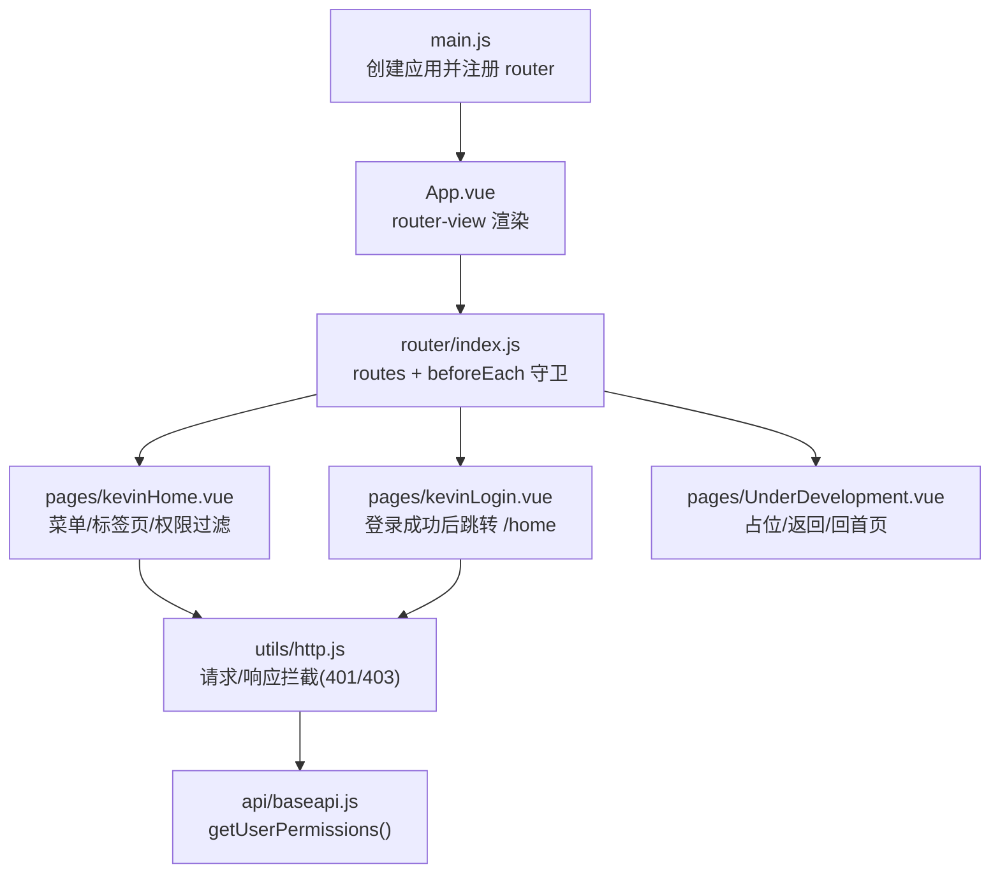
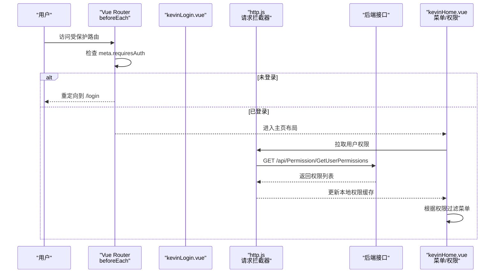
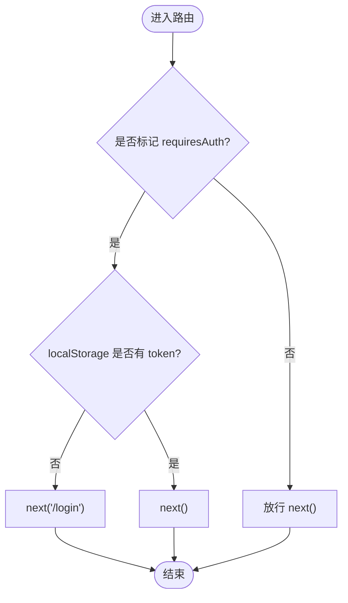
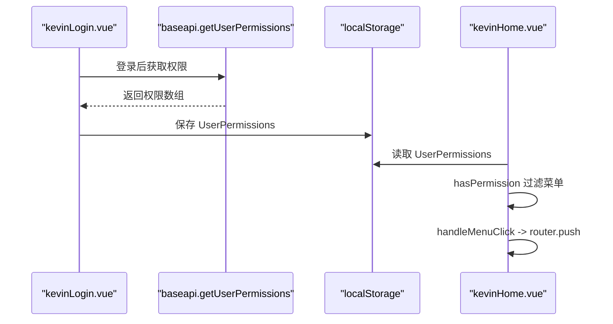
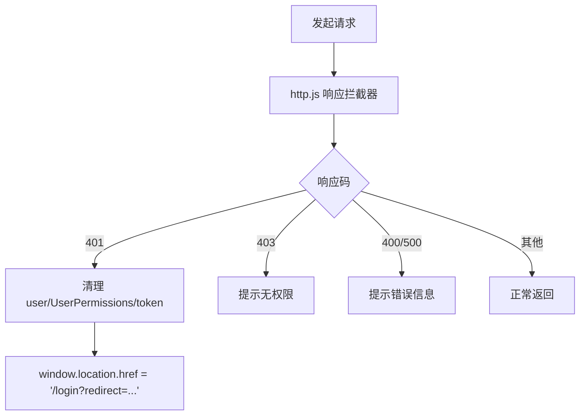
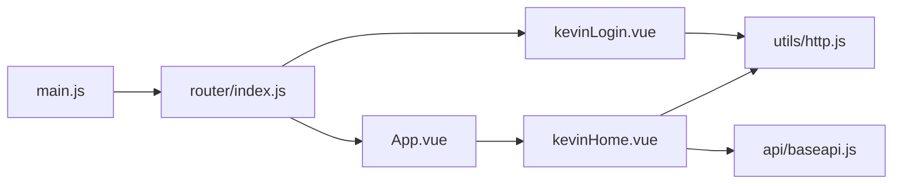

# 路由管理

<cite>
**本文引用的文件**
- [vue/kevin.web.vue/src/router/index.js](file://vue/kevin.web.vue/src/router/index.js)
- [vue/kevin.web.vue/src/main.js](file://vue/kevin.web.vue/src/main.js)
- [vue/kevin.web.vue/src/App.vue](file://vue/kevin.web.vue/src/App.vue)
- [vue/kevin.web.vue/src/pages/kevinHome.vue](file://vue/kevin.web.vue/src/pages/kevinHome.vue)
- [vue/kevin.web.vue/src/pages/kevinLogin.vue](file://vue/kevin.web.vue/src/pages/kevinLogin.vue)
- [vue/kevin.web.vue/src/pages/UnderDevelopment.vue](file://vue/kevin.web.vue/src/pages/UnderDevelopment.vue)
- [vue/kevin.web.vue/src/utils/http.js](file://vue/kevin.web.vue/src/utils/http.js)
- [vue/kevin.web.vue/src/api/baseapi.js](file://vue/kevin.web.vue/src/api/baseapi.js)
</cite>

## 目录
1. [简介](#简介)
2. [项目结构](#项目结构)
3. [核心组件](#核心组件)
4. [架构总览](#架构总览)
5. [详细组件分析](#详细组件分析)
6. [依赖关系分析](#依赖关系分析)
7. [性能考虑](#性能考虑)
8. [故障排查指南](#故障排查指南)
9. [结论](#结论)
10. [附录](#附录)

## 简介
本文件面向 NetCoreKevin 前端（Vue 3 + Vue Router）的路由管理，系统性说明：
- Vue Router 的配置方式与路由守卫机制
- 动态路由生成、权限控制与菜单同步逻辑
- 页面级组件组织与懒加载优化建议
- 路由参数传递、查询字符串处理与历史记录管理
- 路由元信息配置、面包屑导航与页面标题管理
- 路由跳转最佳实践与错误处理机制
- 前后端路由配合与 404 页面处理方案

## 项目结构
前端路由相关代码集中在 vue/kevin.web.vue/src 下：
- 路由定义与守卫：src/router/index.js
- 应用入口与插件注册：src/main.js
- 根组件与全局渲染出口：src/App.vue
- 主布局与菜单、标签页、权限控制：src/pages/kevinHome.vue
- 登录流程与登录后跳转：src/pages/kevinLogin.vue
- 未开发页面占位：src/pages/UnderDevelopment.vue
- HTTP 拦截与 401/403 统一处理：src/utils/http.js
- 获取用户权限接口封装：src/api/baseapi.js

图表来源
- [vue/kevin.web.vue/src/main.js:1-20](file://vue/kevin.web.vue/src/main.js#L1-L20)
- [vue/kevin.web.vue/src/App.vue:1-53](file://vue/kevin.web.vue/src/App.vue#L1-L53)
- [vue/kevin.web.vue/src/router/index.js:1-191](file://vue/kevin.web.vue/src/router/index.js#L1-L191)
- [vue/kevin.web.vue/src/pages/kevinHome.vue:1-764](file://vue/kevin.web.vue/src/pages/kevinHome.vue#L1-L764)
- [vue/kevin.web.vue/src/pages/kevinLogin.vue:1-346](file://vue/kevin.web.vue/src/pages/kevinLogin.vue#L1-L346)
- [vue/kevin.web.vue/src/utils/http.js:1-125](file://vue/kevin.web.vue/src/utils/http.js#L1-L125)
- [vue/kevin.web.vue/src/api/baseapi.js:1-14](file://vue/kevin.web.vue/src/api/baseapi.js#L1-L14)

章节来源
- [vue/kevin.web.vue/src/main.js:1-20](file://vue/kevin.web.vue/src/main.js#L1-L20)
- [vue/kevin.web.vue/src/App.vue:1-53](file://vue/kevin.web.vue/src/App.vue#L1-L53)
- [vue/kevin.web.vue/src/router/index.js:1-191](file://vue/kevin.web.vue/src/router/index.js#L1-L191)

## 核心组件
- 路由实例与守卫：在 src/router/index.js 中通过 createRouter 与 createWebHistory 初始化，并通过 beforeEach 实现鉴权跳转。
- 主页布局与菜单：src/pages/kevinHome.vue 维护菜单树、权限过滤、标签页与路由跳转。
- 登录流程：src/pages/kevinLogin.vue 完成登录、存储 token/用户信息/权限，并跳转到 /home。
- HTTP 拦截：src/utils/http.js 统一处理 401/403 等状态码，必要时重定向到登录页。
- 权限数据源：src/api/baseapi.js 提供 getUserPermissions 接口调用。

章节来源
- [vue/kevin.web.vue/src/router/index.js:172-191](file://vue/kevin.web.vue/src/router/index.js#L172-L191)
- [vue/kevin.web.vue/src/pages/kevinHome.vue:512-521](file://vue/kevin.web.vue/src/pages/kevinHome.vue#L512-L521)
- [vue/kevin.web.vue/src/pages/kevinLogin.vue:239-280](file://vue/kevin.web.vue/src/pages/kevinLogin.vue#L239-L280)
- [vue/kevin.web.vue/src/utils/http.js:51-96](file://vue/kevin.web.vue/src/utils/http.js#L51-L96)
- [vue/kevin.web.vue/src/api/baseapi.js:11-14](file://vue/kevin.web.vue/src/api/baseapi.js#L11-L14)

## 架构总览
下图展示了从浏览器访问到页面渲染的完整链路，包括路由守卫、权限校验、HTTP 拦截与后端交互。

图表来源
- [vue/kevin.web.vue/src/router/index.js:177-189](file://vue/kevin.web.vue/src/router/index.js#L177-L189)
- [vue/kevin.web.vue/src/pages/kevinHome.vue:724-742](file://vue/kevin.web.vue/src/pages/kevinHome.vue#L724-L742)
- [vue/kevin.web.vue/src/utils/http.js:11-25](file://vue/kevin.web.vue/src/utils/http.js#L11-L25)
- [vue/kevin.web.vue/src/api/baseapi.js:11-14](file://vue/kevin.web.vue/src/api/baseapi.js#L11-L14)

## 详细组件分析

### 路由配置与守卫
- 路由模式：使用 createWebHistory（HTML5 History），便于 SEO 和分享链接。
- 基础路由：包含 / 重定向到 /login；/login 登录页；/home 作为带子路由的主布局。
- 受保护路由：/home 及其子路由通过 meta.requiresAuth 标记，路由守卫在 beforeEach 中检查 localStorage 中的 token 进行鉴权。
- 登录态处理：若访问 /login 且已登录，则自动跳转到 /home。

图表来源
- [vue/kevin.web.vue/src/router/index.js:33-169](file://vue/kevin.web.vue/src/router/index.js#L33-L169)
- [vue/kevin.web.vue/src/router/index.js:177-189](file://vue/kevin.web.vue/src/router/index.js#L177-L189)

章节来源
- [vue/kevin.web.vue/src/router/index.js:172-191](file://vue/kevin.web.vue/src/router/index.js#L172-L191)

### 动态路由生成、权限控制与菜单同步
- 菜单数据：kevinHome.vue 内维护 menuList，每个菜单项带有 permission 字段。
- 权限过滤：hasPermission 基于 localStorage 中的 UserPermissions 数组判断是否显示菜单。
- 权限数据来源：kevinLogin.vue 登录成功后调用 getUserPermissions 并将结果存入 localStorage；kevinHome.vue 启动时读取该缓存用于菜单渲染。
- 菜单点击跳转：handleMenuClick 中根据 key 调用 router.push 跳转到对应路径。

图表来源
- [vue/kevin.web.vue/src/pages/kevinLogin.vue:250-260](file://vue/kevin.web.vue/src/pages/kevinLogin.vue#L250-L260)
- [vue/kevin.web.vue/src/api/baseapi.js:11-14](file://vue/kevin.web.vue/src/api/baseapi.js#L11-L14)
- [vue/kevin.web.vue/src/pages/kevinHome.vue:512-521](file://vue/kevin.web.vue/src/pages/kevinHome.vue#L512-L521)
- [vue/kevin.web.vue/src/pages/kevinHome.vue:724-742](file://vue/kevin.web.vue/src/pages/kevinHome.vue#L724-L742)
- [vue/kevin.web.vue/src/pages/kevinHome.vue:603-687](file://vue/kevin.web.vue/src/pages/kevinHome.vue#L603-L687)

章节来源
- [vue/kevin.web.vue/src/pages/kevinHome.vue:512-521](file://vue/kevin.web.vue/src/pages/kevinHome.vue#L512-L521)
- [vue/kevin.web.vue/src/pages/kevinHome.vue:724-742](file://vue/kevin.web.vue/src/pages/kevinHome.vue#L724-L742)
- [vue/kevin.web.vue/src/pages/kevinLogin.vue:250-260](file://vue/kevin.web.vue/src/pages/kevinLogin.vue#L250-L260)
- [vue/kevin.web.vue/src/api/baseapi.js:11-14](file://vue/kevin.web.vue/src/api/baseapi.js#L11-L14)

### 页面级组件组织与懒加载优化
- 当前组织：路由文件中直接 import 各页面组件，属于同步加载。
- 优化建议：将大体积页面改为异步组件或路由级懒加载，减少首屏包体与解析时间。例如使用 () => import('@/pages/xxx.vue') 或在路由中使用 component 的函数式写法。
- 影响范围：主要涉及 src/router/index.js 中的静态导入处。

章节来源
- [vue/kevin.web.vue/src/router/index.js:1-32](file://vue/kevin.web.vue/src/router/index.js#L1-L32)

### 路由参数传递、查询字符串与历史记录
- 参数传递：当前路由多为路径型参数（如 /home/user/list），可通过 router.push 的路径字符串或对象形式传递 params/query。
- 查询字符串：可在跳转时附加 query 参数，页面内通过 useRoute().query 读取。
- 历史记录：Vue Router 默认维护浏览器历史栈；支持 router.go(-1)、router.back() 等返回操作。
- 当前实现：kevinHome.vue 与 kevinLogin.vue 主要通过 router.push 进行跳转；UnderDevelopment.vue 使用 router.go(-1) 返回上一页。

章节来源
- [vue/kevin.web.vue/src/pages/kevinHome.vue:603-687](file://vue/kevin.web.vue/src/pages/kevinHome.vue#L603-L687)
- [vue/kevin.web.vue/src/pages/kevinLogin.vue:275-280](file://vue/kevin.web.vue/src/pages/kevinLogin.vue#L275-L280)
- [vue/kevin.web.vue/src/pages/UnderDevelopment.vue:62-70](file://vue/kevin.web.vue/src/pages/UnderDevelopment.vue#L62-L70)

### 路由元信息、面包屑与页面标题管理
- 元信息：路由可使用 meta 字段（如 requiresAuth）进行鉴权标记。
- 页面标题：当前 kevinHome.vue 维护 pageTitleMap 用于标签页标题展示，但未在全局设置 document.title。
- 面包屑：当前未实现通用面包屑组件；可基于路由层级与 meta 中的 title 构建。
- 改进建议：
  - 在路由 meta 中增加 title、breadcrumb 等字段，结合路由守卫或 App.vue 生命周期统一设置 document.title。
  - 在 kevinHome.vue 中根据当前路由名称映射到面包屑节点。

章节来源
- [vue/kevin.web.vue/src/router/index.js:43-48](file://vue/kevin.web.vue/src/router/index.js#L43-L48)
- [vue/kevin.web.vue/src/pages/kevinHome.vue:348-372](file://vue/kevin.web.vue/src/pages/kevinHome.vue#L348-L372)

### 路由跳转最佳实践
- 统一使用命名路由与 params/query 传递参数，避免硬编码路径拼接。
- 对受保护路由统一通过 meta.requiresAuth 与 beforeEach 守卫控制。
- 菜单与路由解耦：菜单 key 与路由 path 通过映射表关联，便于扩展与维护。
- 避免重复跳转：在菜单点击前判断当前激活路由，防止无意义刷新。

章节来源
- [vue/kevin.web.vue/src/pages/kevinHome.vue:603-687](file://vue/kevin.web.vue/src/pages/kevinHome.vue#L603-L687)
- [vue/kevin.web.vue/src/router/index.js:177-189](file://vue/kevin.web.vue/src/router/index.js#L177-L189)

### 错误处理机制
- 路由层：beforeEach 中处理未登录跳转与已登录访问登录页的重定向。
- HTTP 层：http.js 在响应拦截器中统一处理 401/403/400/500，并在 401 时清理本地缓存并重定向到 /login，附带 redirect 参数以便登录后回跳。
- 页面层：登录失败与网络异常通过 message 提示用户。

图表来源
- [vue/kevin.web.vue/src/utils/http.js:51-96](file://vue/kevin.web.vue/src/utils/http.js#L51-L96)
- [vue/kevin.web.vue/src/utils/http.js:100-122](file://vue/kevin.web.vue/src/utils/http.js#L100-L122)

章节来源
- [vue/kevin.web.vue/src/utils/http.js:51-96](file://vue/kevin.web.vue/src/utils/http.js#L51-L96)
- [vue/kevin.web.vue/src/utils/http.js:100-122](file://vue/kevin.web.vue/src/utils/http.js#L100-L122)

### 前后端路由配合与 404 处理
- 前端路由：使用 HTML5 History 模式，需服务端支持 SPA 路由回退（将未知路径回退到 index.html）。
- 后端路由：后端 API 以 /api/* 为前缀，前端通过 axios baseURL 指向后端服务。
- 404 页面：当前存在 UnderDevelopment.vue 作为“开发中”占位，但尚未配置为全局 404 路由。建议新增一个 404 页面并在路由末尾添加 catch-all 路由。

章节来源
- [vue/kevin.web.vue/src/router/index.js:172-175](file://vue/kevin.web.vue/src/router/index.js#L172-L175)
- [vue/kevin.web.vue/src/pages/UnderDevelopment.vue:1-152](file://vue/kevin.web.vue/src/pages/UnderDevelopment.vue#L1-L152)

## 依赖关系分析
- main.js 引入并注册 router，App.vue 通过 router-view 渲染视图。
- router/index.js 集中管理 routes 与 beforeEach 守卫。
- kevinHome.vue 依赖 http.js 获取权限，依赖 baseapi.js 的 getUserPermissions。
- kevinLogin.vue 在登录成功后写入 localStorage 并跳转至 /home。
- http.js 在请求前注入 Authorization 头，在响应中处理 401/403 等错误。

图表来源
- [vue/kevin.web.vue/src/main.js:1-20](file://vue/kevin.web.vue/src/main.js#L1-L20)
- [vue/kevin.web.vue/src/App.vue:1-53](file://vue/kevin.web.vue/src/App.vue#L1-L53)
- [vue/kevin.web.vue/src/router/index.js:1-191](file://vue/kevin.web.vue/src/router/index.js#L1-L191)
- [vue/kevin.web.vue/src/pages/kevinHome.vue:1-764](file://vue/kevin.web.vue/src/pages/kevinHome.vue#L1-L764)
- [vue/kevin.web.vue/src/pages/kevinLogin.vue:1-346](file://vue/kevin.web.vue/src/pages/kevinLogin.vue#L1-L346)
- [vue/kevin.web.vue/src/utils/http.js:1-125](file://vue/kevin.web.vue/src/utils/http.js#L1-L125)
- [vue/kevin.web.vue/src/api/baseapi.js:1-14](file://vue/kevin.web.vue/src/api/baseapi.js#L1-L14)

章节来源
- [vue/kevin.web.vue/src/main.js:1-20](file://vue/kevin.web.vue/src/main.js#L1-L20)
- [vue/kevin.web.vue/src/App.vue:1-53](file://vue/kevin.web.vue/src/App.vue#L1-L53)
- [vue/kevin.web.vue/src/router/index.js:1-191](file://vue/kevin.web.vue/src/router/index.js#L1-L191)
- [vue/kevin.web.vue/src/pages/kevinHome.vue:1-764](file://vue/kevin.web.vue/src/pages/kevinHome.vue#L1-L764)
- [vue/kevin.web.vue/src/pages/kevinLogin.vue:1-346](file://vue/kevin.web.vue/src/pages/kevinLogin.vue#L1-L346)
- [vue/kevin.web.vue/src/utils/http.js:1-125](file://vue/kevin.web.vue/src/utils/http.js#L1-L125)
- [vue/kevin.web.vue/src/api/baseapi.js:1-14](file://vue/kevin.web.vue/src/api/baseapi.js#L1-L14)

## 性能考虑
- 首屏优化：将路由组件改为懒加载，减少初始包体大小。
- 路由复用：合理使用 keep-alive 缓存高频切换的页面，避免重复渲染。
- 权限预取：在登录成功后预取权限并缓存，减少后续重复请求。
- 路由守卫轻量化：避免在 beforeEach 中进行耗时操作，保持跳转流畅。

[本节为通用指导，不直接分析具体文件]

## 故障排查指南
- 无法进入受保护页面：检查 localStorage 中是否存在 token；确认路由 meta.requiresAuth 是否正确设置；查看 beforeEach 是否被意外中断。
- 登录后仍跳转回登录页：检查 http.js 的 401 处理逻辑；确认后端是否返回 newtoken；确认 getUserPermissions 是否成功执行。
- 菜单不显示：检查 UserPermissions 是否已正确写入 localStorage；确认 hasPermission 逻辑与菜单 permission 字段匹配。
- 404 页面未生效：确认是否在路由末尾添加了 catch-all 路由；确认服务端是否将未知路径回退到 index.html。

章节来源
- [vue/kevin.web.vue/src/router/index.js:177-189](file://vue/kevin.web.vue/src/router/index.js#L177-L189)
- [vue/kevin.web.vue/src/utils/http.js:51-96](file://vue/kevin.web.vue/src/utils/http.js#L51-L96)
- [vue/kevin.web.vue/src/pages/kevinHome.vue:724-742](file://vue/kevin.web.vue/src/pages/kevinHome.vue#L724-L742)

## 结论
本项目的前端路由采用 Vue Router 的 HTML5 History 模式，并通过 beforeEach 守卫实现基础的鉴权控制。菜单与权限通过本地缓存与后端接口协同实现，具备较好的可扩展性。建议在以下方面持续优化：
- 路由懒加载与按需引入，提升首屏性能
- 完善路由元信息与全局标题/面包屑管理
- 补充全局 404 路由与服务端回退策略
- 统一参数传递与查询字符串处理规范

[本节为总结性内容，不直接分析具体文件]

## 附录
- 关键实现位置参考：
  - 路由定义与守卫：[vue/kevin.web.vue/src/router/index.js:33-191](file://vue/kevin.web.vue/src/router/index.js#L33-L191)
  - 主页菜单与权限：[vue/kevin.web.vue/src/pages/kevinHome.vue:512-742](file://vue/kevin.web.vue/src/pages/kevinHome.vue#L512-L742)
  - 登录与跳转：[vue/kevin.web.vue/src/pages/kevinLogin.vue:239-280](file://vue/kevin.web.vue/src/pages/kevinLogin.vue#L239-L280)
  - HTTP 拦截与 401/403：[vue/kevin.web.vue/src/utils/http.js:11-122](file://vue/kevin.web.vue/src/utils/http.js#L11-L122)
  - 权限接口封装：[vue/kevin.web.vue/src/api/baseapi.js:11-14](file://vue/kevin.web.vue/src/api/baseapi.js#L11-L14)