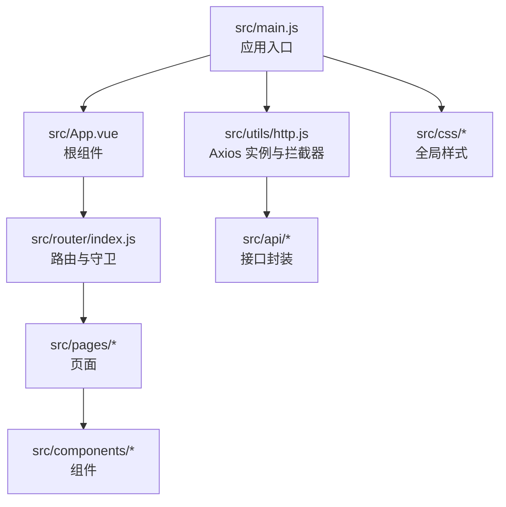
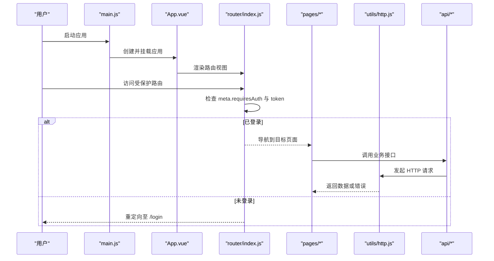
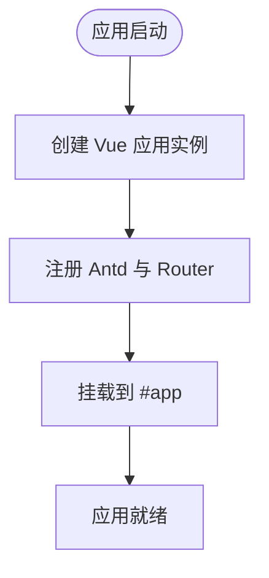
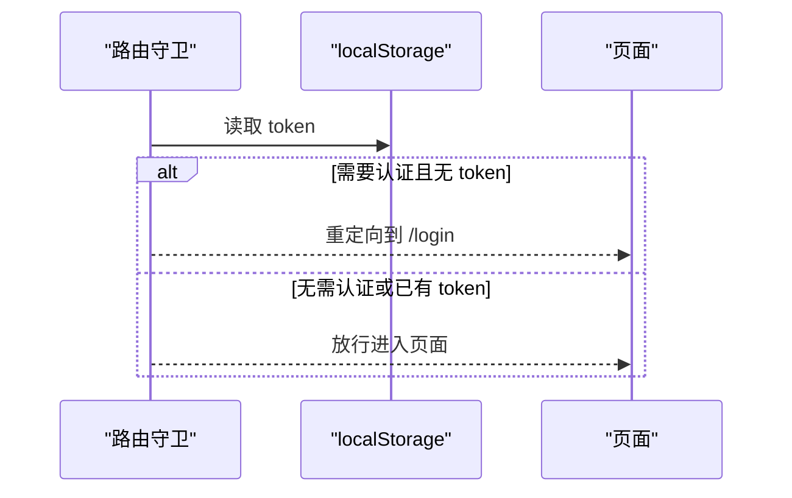
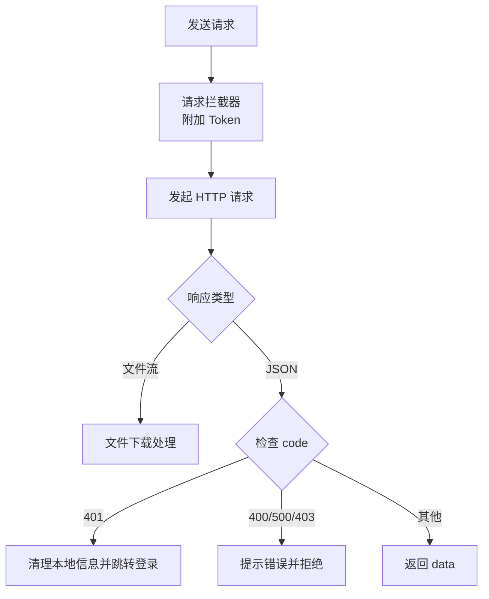
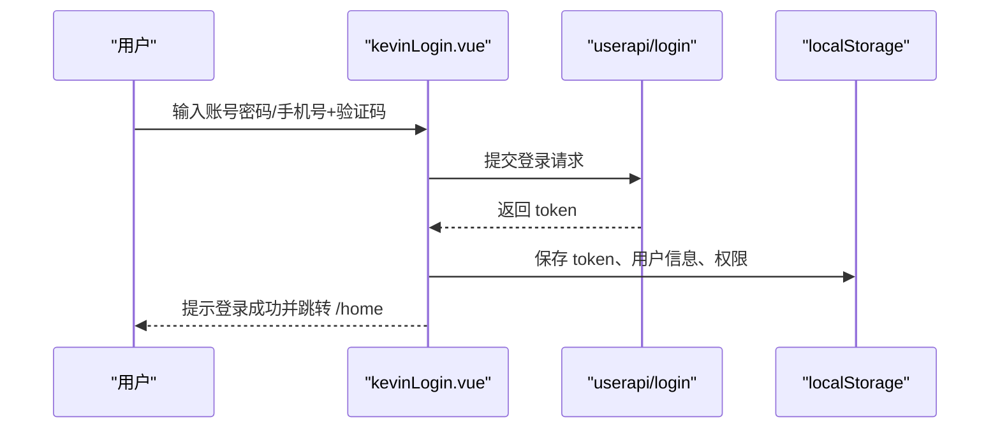
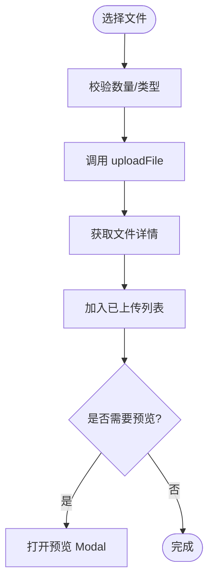
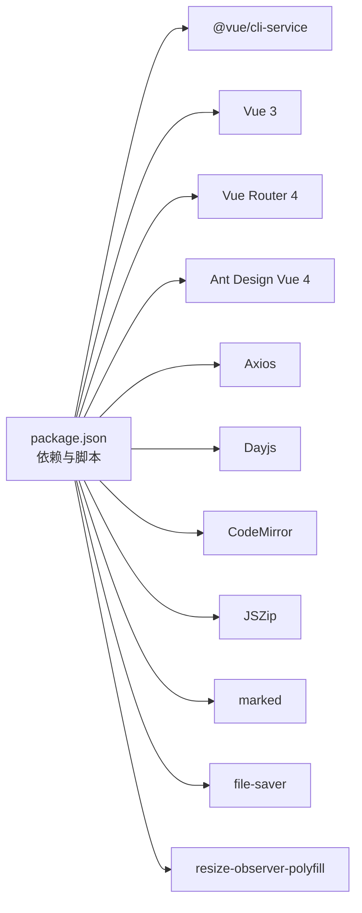

# 项目结构

<cite>
**本文引用的文件**
- [package.json](file://vue/kevin.web.vue/package.json)
- [vue.config.js](file://vue/kevin.web.vue/vue.config.js)
- [babel.config.js](file://vue/kevin.web.vue/babel.config.js)
- [src/main.js](file://vue/kevin.web.vue/src/main.js)
- [src/App.vue](file://vue/kevin.web.vue/src/App.vue)
- [src/router/index.js](file://vue/kevin.web.vue/src/router/index.js)
- [src/utils/http.js](file://vue/kevin.web.vue/src/utils/http.js)
- [src/utils/fileHandler.js](file://vue/kevin.web.vue/src/utils/fileHandler.js)
- [src/api/baseapi.js](file://vue/kevin.web.vue/src/api/baseapi.js)
- [src/pages/kevinLogin.vue](file://vue/kevin.web.vue/src/pages/kevinLogin.vue)
- [src/components/FileUpload.vue](file://vue/kevin.web.vue/src/components/FileUpload.vue)
</cite>

## 目录
1. [简介](#简介)
2. [项目结构](#项目结构)
3. [核心组件](#核心组件)
4. [架构总览](#架构总览)
5. [详细组件分析](#详细组件分析)
6. [依赖关系分析](#依赖关系分析)
7. [性能考量](#性能考量)
8. [故障排查指南](#故障排查指南)
9. [结论](#结论)
10. [附录：新模块添加与扩展指南](#附录新模块添加与扩展指南)

## 简介
本文件面向 NetCoreKevin 前端（Vue 3）项目的结构与实现，聚焦于 src 目录的职责划分、入口初始化流程、根组件生命周期、构建配置、开发服务器代理、路由与鉴权机制、HTTP 封装与文件处理等。文档同时提供模块加载顺序、全局插件注册方式以及新增模块的最佳实践，帮助开发者快速理解并扩展项目。

## 项目结构
前端位于 vue/kevin.web.vue 目录，采用 Vue 3 + Ant Design Vue + Vue Router 的技术栈，按功能域组织代码：
- src/api：按业务域划分的接口封装（ai、organizational、baseapi、userapi、roleapi、permission、tenant、log、message、file、code_generator、dic 等）
- src/components：可复用 UI 组件（如 FileUpload、MessageTable、PermissionManager、UserAddEdit、UserManagement 及 ai 子目录）
- src/pages：页面级视图（登录、首页、仪表盘、用户管理、角色管理、权限管理、系统公告、消息、日志、租户、代码生成器、AI 管理、组织架构等）
- src/router：路由定义与守卫
- src/utils：通用工具（http 请求封装、文件处理、适配器等）
- src/css：全局样式与主题定制
- public：静态资源与入口 HTML

图表来源
- [src/main.js:1-20](file://vue/kevin.web.vue/src/main.js#L1-L20)
- [src/App.vue:1-53](file://vue/kevin.web.vue/src/App.vue#L1-L53)
- [src/router/index.js:1-191](file://vue/kevin.web.vue/src/router/index.js#L1-L191)
- [src/utils/http.js:1-124](file://vue/kevin.web.vue/src/utils/http.js#L1-L124)

章节来源
- [package.json:1-68](file://vue/kevin.web.vue/package.json#L1-L68)
- [vue.config.js:1-21](file://vue/kevin.web.vue/vue.config.js#L1-L21)
- [babel.config.js:1-6](file://vue/kevin.web.vue/babel.config.js#L1-L6)

## 核心组件
- 应用入口 main.js
  - 创建 Vue 应用实例，挂载 Ant Design Vue 组件库与路由
  - 引入全局样式与 dayjs 中文本地化
  - 注入 ResizeObserver polyfill 以兼容旧浏览器
  - 关闭生产提示并挂载到 #app
- 根组件 App.vue
  - 使用 a-config-provider 统一主题
  - 动态读取 CSS 变量 --accent 更新主色
  - 监听 storage 事件以响应主题变化
  - 渲染 router-view 承载页面内容
- 路由 index.js
  - 基于 createWebHistory 的 SPA 路由
  - 集中定义所有页面路由，包含 /login、/home 及其多级子路由
  - 通过 meta.requiresAuth 控制访问权限，结合 localStorage 中的 token 进行鉴权跳转
- HTTP 封装 utils/http.js
  - 基于 axios.create 创建实例，设置 baseURL、超时、携带凭证
  - 请求拦截：自动附加 Authorization 头（Bearer Token）
  - 响应拦截：统一处理文件下载、401 未登录跳转、错误提示、Token 刷新
- 文件处理 utils/fileHandler.js
  - 提供下载、上传、批量上传、预览、Base64/Blob 转换、文件大小格式化等能力
  - 与 http 实例协作，统一错误提示与成功反馈

章节来源
- [src/main.js:1-20](file://vue/kevin.web.vue/src/main.js#L1-L20)
- [src/App.vue:1-53](file://vue/kevin.web.vue/src/App.vue#L1-L53)
- [src/router/index.js:1-191](file://vue/kevin.web.vue/src/router/index.js#L1-L191)
- [src/utils/http.js:1-124](file://vue/kevin.web.vue/src/utils/http.js#L1-L124)
- [src/utils/fileHandler.js:1-252](file://vue/kevin.web.vue/src/utils/fileHandler.js#L1-L252)

## 架构总览
前端采用“入口 -> 根组件 -> 路由 -> 页面 -> 组件 -> API”的分层结构，配合统一的 HTTP 拦截器与文件处理工具，形成清晰的职责边界与可扩展性。

图表来源
- [src/main.js:1-20](file://vue/kevin.web.vue/src/main.js#L1-L20)
- [src/App.vue:1-53](file://vue/kevin.web.vue/src/App.vue#L1-L53)
- [src/router/index.js:1-191](file://vue/kevin.web.vue/src/router/index.js#L1-L191)
- [src/utils/http.js:1-124](file://vue/kevin.web.vue/src/utils/http.js#L1-L124)

## 详细组件分析

### 入口初始化流程与全局配置（main.js）
- 初始化步骤
  - 引入 Vue 应用、根组件、Ant Design Vue、路由、全局样式、dayjs 中文本地化
  - 为 window 注入 ResizeObserver polyfill
  - 创建应用实例，注册 Antd 与 router，关闭生产提示
  - 挂载到 #app
- 全局配置要点
  - 通过 ant-design-vue 的 theme 在 App.vue 中统一主题
  - 通过 css 变量 --accent 动态调整主色
  - 通过 devServer.proxy 将 /VarApi 转发到后端服务

图表来源
- [src/main.js:1-20](file://vue/kevin.web.vue/src/main.js#L1-L20)
- [vue.config.js:1-21](file://vue/kevin.web.vue/vue.config.js#L1-L21)

章节来源
- [src/main.js:1-20](file://vue/kevin.web.vue/src/main.js#L1-L20)
- [vue.config.js:1-21](file://vue/kevin.web.vue/vue.config.js#L1-L21)

### 根组件 App.vue 的结构与生命周期
- 结构
  - 使用 a-config-provider 包裹整个应用，传递主题配置
  - 通过 router-view 渲染当前路由对应的页面
- 生命周期与状态
  - onMounted 时读取 CSS 变量 --accent 并更新主题主色
  - 定时再次读取以确保样式生效
  - 监听 storage 事件，当存储变化时重新计算主题主色
- 样式
  - 设置全局字体、平滑抗锯齿、最小高度与基础颜色

章节来源
- [src/App.vue:1-53](file://vue/kevin.web.vue/src/App.vue#L1-L53)

### 路由与鉴权（router/index.js）
- 路由组织
  - 根路径重定向到 /login
  - /login 为登录页
  - /home 为需要认证的主布局，包含多个子路由（仪表盘、用户、角色、权限、字典、日志、公告、租户、代码生成器、消息、AI 相关、组织架构等）
- 鉴权逻辑
  - beforeEach 中判断目标路由是否标记 requiresAuth
  - 若需要认证且 localStorage 无 token，则跳转到 /login
  - 若已在登录页且有 token，则跳转到 /home

图表来源
- [src/router/index.js:172-191](file://vue/kevin.web.vue/src/router/index.js#L172-L191)

章节来源
- [src/router/index.js:1-191](file://vue/kevin.web.vue/src/router/index.js#L1-L191)

### HTTP 封装与错误处理（utils/http.js）
- 请求拦截
  - 从 localStorage 读取 token，附加到 Authorization 头
  - 对 400 参数错误进行提示
- 响应拦截
  - 支持文件下载：根据 content-type 识别二进制流并交由 fileHandler 处理
  - 统一处理 401：清理本地用户信息并重定向到登录页
  - 统一处理 400/500/403：提示错误并拒绝 Promise
  - 支持服务端返回 newtoken 时自动刷新本地 token
- 错误处理
  - 区分网络错误与业务错误，给出友好提示
  - 避免重复跳转登录页（排除登录接口与已在登录页的情况）

图表来源
- [src/utils/http.js:1-124](file://vue/kevin.web.vue/src/utils/http.js#L1-L124)

章节来源
- [src/utils/http.js:1-124](file://vue/kevin.web.vue/src/utils/http.js#L1-L124)

### 文件处理工具（utils/fileHandler.js）
- 能力
  - 下载：支持从响应头提取文件名并触发浏览器下载
  - 上传：单文件与多文件上传，支持额外参数与进度回调
  - 预览：在新窗口打开 Blob URL 预览
  - 转换：Base64 与 Blob 互转
  - 辅助：获取文件信息、格式化文件大小
- 集成
  - 与 http.js 的响应拦截器配合，自动识别文件流并调用下载方法

章节来源
- [src/utils/fileHandler.js:1-252](file://vue/kevin.web.vue/src/utils/fileHandler.js#L1-L252)

### 登录流程（pages/kevinLogin.vue）
- 表单与交互
  - 支持密码登录与验证码登录两种模式
  - 表单校验：用户名/手机号、密码、验证码、租户 ID
  - 验证码按钮倒计时与禁用状态
- 登录逻辑
  - 调用 userapi.login 提交凭据
  - 成功后将 token 写入 localStorage，并获取用户信息与权限保存到本地
  - 可选记住我：保存登录信息到 localStorage
  - 登录成功后跳转到 /home
- 错误处理
  - 捕获异常并提示用户重试

图表来源
- [src/pages/kevinLogin.vue:164-346](file://vue/kevin.web.vue/src/pages/kevinLogin.vue#L164-L346)

章节来源
- [src/pages/kevinLogin.vue:1-346](file://vue/kevin.web.vue/src/pages/kevinLogin.vue#L1-L346)

### 文件上传组件（components/FileUpload.vue）
- 功能
  - 支持单/多文件上传、最大数量限制、禁用状态、自定义上传按钮文案
  - 已上传文件列表展示、删除、预览（图片、PDF、Word、Markdown、文本）
  - Zip 压缩包在线编辑：解析树形结构、选择文件、CodeMirror 编辑器、修改检测、保存并重新上传
- 技术点
  - 使用 JSZip 解析与重建 zip
  - 使用 marked 渲染 Markdown
  - 使用 CodeMirror 提供语法高亮与主题
  - 与 api/file 的 uploadFile、deleteFileById、getFileInfoById 协作
  - 通过 beforeUpload 与 customRequest 控制上传流程

图表来源
- [src/components/FileUpload.vue:1-800](file://vue/kevin.web.vue/src/components/FileUpload.vue#L1-L800)

章节来源
- [src/components/FileUpload.vue:1-800](file://vue/kevin.web.vue/src/components/FileUpload.vue#L1-L800)

## 依赖关系分析
- 运行时依赖
  - Vue 3、Vue Router 4、Ant Design Vue 4、Axios、Dayjs、SignalR、CodeMirror、JSZip、marked、file-saver、resize-observer-polyfill
- 构建与开发依赖
  - @vue/cli-service、@vue/cli-plugin-babel、@vue/cli-plugin-eslint、Babel、ESLint、Webpack
- 构建脚本
  - serve：默认开发环境
  - serve:dev：显式 development 模式
  - serve:pre：预发布模式
  - build：生产构建
  - build:dev/build:pre：指定模式构建
  - lint/lint:dev/lint:pre：代码检查

图表来源
- [package.json:1-68](file://vue/kevin.web.vue/package.json#L1-L68)

章节来源
- [package.json:1-68](file://vue/kevin.web.vue/package.json#L1-L68)

## 性能考量
- 按需引入与打包优化
  - 使用 @vue/cli-service 与 webpack，可通过 tree-shaking 减少体积
  - 合理使用 CodeMirror 语言包与主题，仅引入必要扩展
- 网络请求
  - 合理设置超时与重试策略（可在 http 实例中扩展）
  - 利用响应拦截器统一处理错误，减少重复逻辑
- 文件处理
  - 大文件上传建议使用分片与断点续传（可在 fileHandler 中扩展）
  - 预览时使用懒加载与虚拟滚动（针对大量文件场景）
- 主题与样式
  - 通过 CSS 变量与 a-config-provider 统一管理主题，减少重复样式

[本节为通用指导，不直接分析具体文件]

## 故障排查指南
- 登录失败或频繁跳转
  - 检查 localStorage 中 token 是否存在与有效
  - 确认后端返回的 code 与 newtoken 字段是否符合预期
  - 查看 http 响应拦截器中对 401 的处理逻辑
- 文件下载失败
  - 确认响应头 content-type 是否为二进制流类型
  - 检查 fileHandler 的 responsedownload 与 getFilenameFromResponse 逻辑
- 预览异常
  - 检查文件类型判断与编码解码逻辑（text decoder 尝试多种编码）
  - 对于 Word/PDF，确保外部预览服务可用
- 路由守卫导致无法进入页面
  - 检查 meta.requiresAuth 与 token 的匹配逻辑
  - 确认是否在登录页或已登录状态下访问

章节来源
- [src/utils/http.js:1-124](file://vue/kevin.web.vue/src/utils/http.js#L1-L124)
- [src/utils/fileHandler.js:1-252](file://vue/kevin.web.vue/src/utils/fileHandler.js#L1-L252)
- [src/router/index.js:172-191](file://vue/kevin.web.vue/src/router/index.js#L172-L191)

## 结论
NetCoreKevin 前端项目采用清晰的模块化结构与统一的工具封装，具备良好的可维护性与扩展性。通过 main.js 的初始化、App.vue 的主题管理、router 的鉴权机制、http 的拦截器与 fileHandler 的文件处理能力，形成了稳定可靠的前端基础设施。建议后续在此基础上继续完善错误上报、性能监控与单元测试，进一步提升工程化水平。

[本节为总结性内容，不直接分析具体文件]

## 附录：新模块添加与扩展指南
- 新增页面
  - 在 src/pages 下创建页面组件
  - 在 src/router/index.js 中添加路由，如需鉴权则在 meta 中标记 requiresAuth
- 新增 API
  - 在 src/api 下按业务域创建接口文件，封装 http 调用
  - 在页面中导入并使用对应接口
- 新增组件
  - 在 src/components 下创建可复用组件，遵循 props/emits 规范
  - 在页面中按需引入并使用
- 新增工具
  - 在 src/utils 下添加工具函数或类，保持单一职责
  - 在需要的地方引入使用
- 构建与运行
  - 使用 npm run serve 启动开发服务器
  - 使用 npm run build 构建生产版本
  - 通过 vue.config.js 的 devServer.proxy 配置后端代理
- 最佳实践
  - 保持组件与页面的职责单一，复杂逻辑下沉到 utils 或 store（如有）
  - 统一错误处理与用户提示，避免分散的 message 调用
  - 使用 TypeScript 或 JSDoc 增强类型提示与可维护性（可选）

章节来源
- [src/router/index.js:1-191](file://vue/kevin.web.vue/src/router/index.js#L1-L191)
- [src/api/baseapi.js:1-14](file://vue/kevin.web.vue/src/api/baseapi.js#L1-L14)
- [vue.config.js:1-21](file://vue/kevin.web.vue/vue.config.js#L1-L21)
- [package.json:1-68](file://vue/kevin.web.vue/package.json#L1-L68)